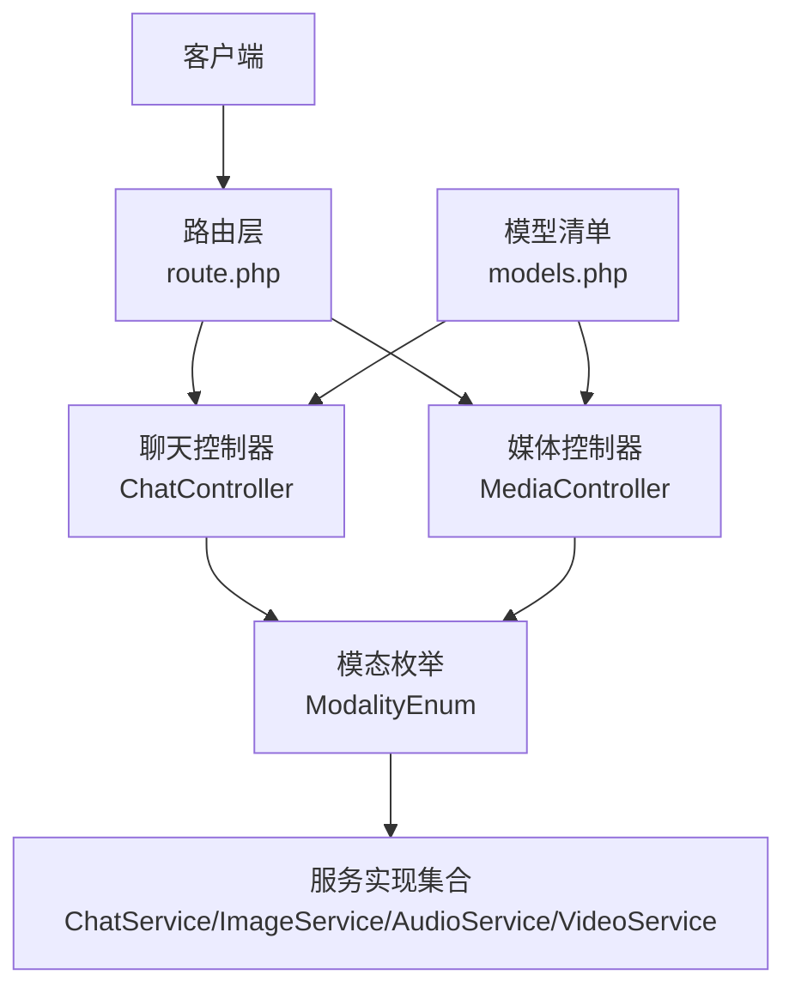
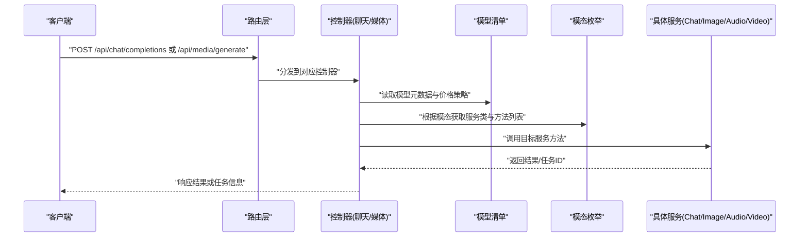
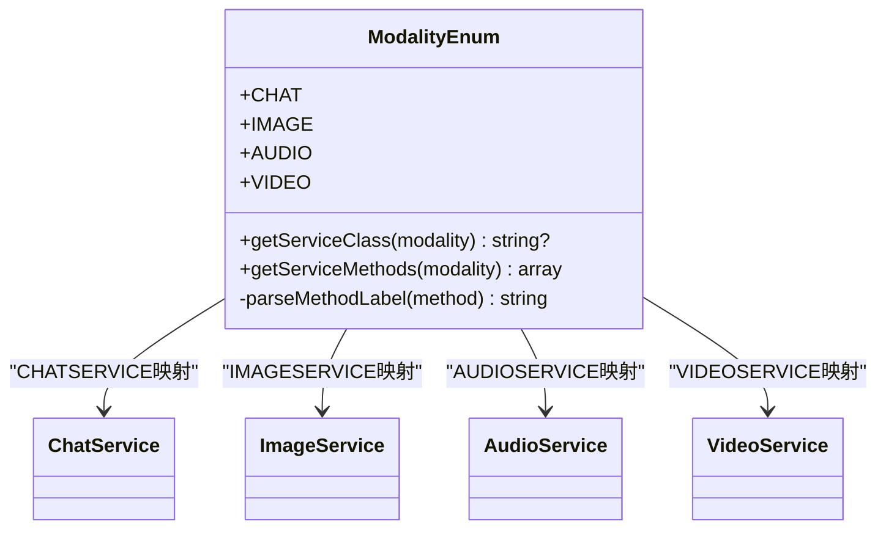
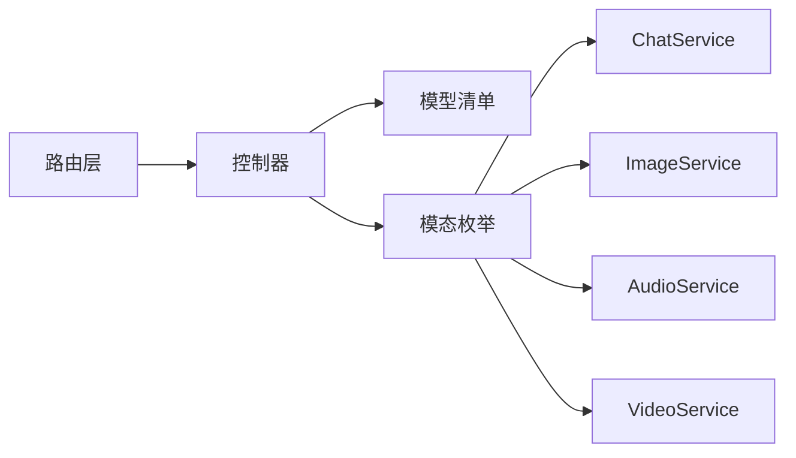
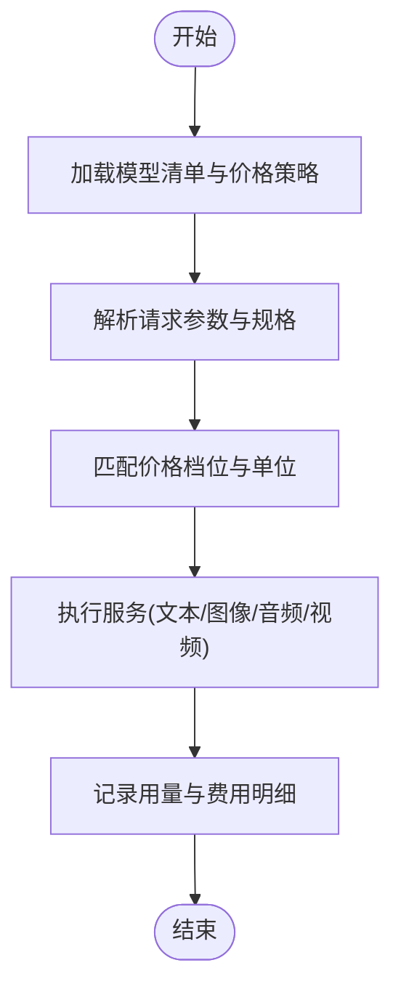

# AI模型API

<cite>
**本文引用的文件**   
- [server/plugin/xbAiModelAgent/config/route.php](file://server/plugin/xbAiModelAgent/config/route.php)
- [server/plugin/xbAiModelAgent/data/models.php](file://server/plugin/xbAiModelAgent/data/models.php)
- [server/plugin/xbAiModelAgent/enum/ModalityEnum.php](file://server/plugin/xbAiModelAgent/enum/ModalityEnum.php)
</cite>

## 目录
1. [简介](#简介)
2. [项目结构](#项目结构)
3. [核心组件](#核心组件)
4. [架构总览](#架构总览)
5. [详细组件分析](#详细组件分析)
6. [依赖关系分析](#依赖关系分析)
7. [性能与扩展性](#性能与扩展性)
8. [计费与用量统计](#计费与用量统计)
9. [调用示例与最佳实践](#调用示例与最佳实践)
10. [故障排查指南](#故障排查指南)
11. [结论](#结论)

## 简介
本文件面向开发者，系统化梳理“AI模型代理”插件的API接入与管理能力。内容覆盖统一的多模态模型接入（文本、图像、音频、视频）、任务调度机制（异步处理、进度跟踪、结果回调）、计费与用量统计（积分扣费、使用记录查询），并提供端到端调用示例与最佳实践建议。

## 项目结构
该功能以插件形式集成在Webman框架中，通过路由将外部请求分发到控制器，再由控制器根据模型配置与模态类型选择对应服务进行执行。关键入口包括：
- 路由定义：对外暴露统一的HTTP接口
- 模型清单：集中管理可用模型、模态、价格策略等元数据
- 模态枚举：按模态动态解析并绑定具体服务类与方法

图表来源
- [server/plugin/xbAiModelAgent/config/route.php:1-13](file://server/plugin/xbAiModelAgent/config/route.php#L1-L13)
- [server/plugin/xbAiModelAgent/enum/ModalityEnum.php:1-157](file://server/plugin/xbAiModelAgent/enum/ModalityEnum.php#L1-L157)
- [server/plugin/xbAiModelAgent/data/models.php:1-800](file://server/plugin/xbAiModelAgent/data/models.php#L1-L800)

章节来源
- [server/plugin/xbAiModelAgent/config/route.php:1-13](file://server/plugin/xbAiModelAgent/config/route.php#L1-L13)

## 核心组件
- 路由层
  - 提供统一的对外接口路径，分别承载文本聊天与媒体生成两类场景。
- 模型清单
  - 集中维护模型ID、名称、模态、状态、图标、标签、描述及价格策略等元信息，支持多价格档位与单位。
- 模态枚举
  - 以常量数组形式声明各模态（文本、图片、音频、视频）及其对应的服务类，并提供反射式方法扫描，用于动态发现可调用方法。

章节来源
- [server/plugin/xbAiModelAgent/config/route.php:1-13](file://server/plugin/xbAiModelAgent/config/route.php#L1-L13)
- [server/plugin/xbAiModelAgent/data/models.php:1-800](file://server/plugin/xbAiModelAgent/data/models.php#L1-L800)
- [server/plugin/xbAiModelAgent/enum/ModalityEnum.php:1-157](file://server/plugin/xbAiModelAgent/enum/ModalityEnum.php#L1-L157)

## 架构总览
整体采用“路由→控制器→服务”的分层模式，结合“模型清单+模态枚举”的配置驱动方式，实现对多厂商、多模态模型的统一接入。

图表来源
- [server/plugin/xbAiModelAgent/config/route.php:1-13](file://server/plugin/xbAiModelAgent/config/route.php#L1-L13)
- [server/plugin/xbAiModelAgent/enum/ModalityEnum.php:1-157](file://server/plugin/xbAiModelAgent/enum/ModalityEnum.php#L1-L157)
- [server/plugin/xbAiModelAgent/data/models.php:1-800](file://server/plugin/xbAiModelAgent/data/models.php#L1-L800)

## 详细组件分析

### 路由与控制器
- 文本聊天接口
  - 路径：/api/chat/completions
  - 职责：接收对话参数，校验后交由文本服务处理，返回流式或非流式结果。
- 媒体生成接口
  - 路径：/api/media/generate
  - 职责：接收媒体生成参数（如图像/视频规格、质量、数量等），交由对应媒体服务处理，可能返回任务ID以便后续查询。

章节来源
- [server/plugin/xbAiModelAgent/config/route.php:1-13](file://server/plugin/xbAiModelAgent/config/route.php#L1-L13)

### 模型清单与定价策略
- 模型元数据
  - 字段包含：name、model_id、modality、status、icon、tags、sort、description 等。
- 价格策略
  - prices 为数组，支持多档位；每个档位包含 unit、label、price、unit_label、min_price、max_price、image_size、video_quality、image_limit、video_duration 等字段，用于精细化计费与限制控制。
- 模态标识
  - modality 值与模态枚举一一对应，用于路由到不同服务。

章节来源
- [server/plugin/xbAiModelAgent/data/models.php:1-800](file://server/plugin/xbAiModelAgent/data/models.php#L1-L800)

### 模态枚举与服务映射
- 模态类型
  - 文本、图片、音频、视频四类，分别对应不同的 service 类名。
- 动态方法发现
  - 通过反射扫描服务类的公开方法，排除魔术方法与父类方法，自动生成可选的方法选项，便于前端或上层编排。
- 辅助方法
  - getServiceClass：根据模态值返回服务类全限定名
  - getServiceMethods：返回当前服务类的所有公开方法选项（含从注释提取的标签）

图表来源
- [server/plugin/xbAiModelAgent/enum/ModalityEnum.php:1-157](file://server/plugin/xbAiModelAgent/enum/ModalityEnum.php#L1-L157)

章节来源
- [server/plugin/xbAiModelAgent/enum/ModalityEnum.php:1-157](file://server/plugin/xbAiModelAgent/enum/ModalityEnum.php#L1-L157)

### 任务调度与异步处理（概念说明）
- 异步任务
  - 对于耗时较长的媒体生成任务，建议采用异步队列模式：提交任务后返回任务ID，客户端轮询或通过回调获取结果。
- 进度跟踪
  - 在服务内部维护任务状态机（如排队中、处理中、完成、失败），并通过任务ID暴露查询接口。
- 结果回调
  - 支持回调URL或消息通道通知，避免长轮询带来的资源消耗。

[本节为通用设计说明，不直接分析具体代码文件]

## 依赖关系分析
- 路由对控制器存在强依赖
- 控制器对模型清单与模态枚举存在弱依赖（配置驱动）
- 模态枚举通过反射依赖具体服务类，形成松耦合的服务发现机制

图表来源
- [server/plugin/xbAiModelAgent/config/route.php:1-13](file://server/plugin/xbAiModelAgent/config/route.php#L1-L13)
- [server/plugin/xbAiModelAgent/enum/ModalityEnum.php:1-157](file://server/plugin/xbAiModelAgent/enum/ModalityEnum.php#L1-L157)
- [server/plugin/xbAiModelAgent/data/models.php:1-800](file://server/plugin/xbAiModelAgent/data/models.php#L1-L800)

章节来源
- [server/plugin/xbAiModelAgent/config/route.php:1-13](file://server/plugin/xbAiModelAgent/config/route.php#L1-L13)
- [server/plugin/xbAiModelAgent/enum/ModalityEnum.php:1-157](file://server/plugin/xbAiModelAgent/enum/ModalityEnum.php#L1-L157)
- [server/plugin/xbAiModelAgent/data/models.php:1-800](file://server/plugin/xbAiModelAgent/data/models.php#L1-L800)

## 性能与扩展性
- 路由层轻量转发，避免在路由中执行业务逻辑
- 模型清单与模态枚举作为配置中心，新增模型或服务无需修改核心流程
- 服务类通过反射动态发现方法，降低硬编码耦合，提升可扩展性
- 建议引入缓存层（如Redis）缓存模型清单与价格策略，减少频繁IO

[本节为通用优化建议，不直接分析具体代码文件]

## 计费与用量统计
- 计费维度
  - 基于 models.php 中的 prices 数组，支持按Token、区间、每张、每条、视频规格等多种计费单位
  - 支持最小/最大价格区间，便于兜底与封顶
- 用量统计
  - 建议在服务执行前后记录输入输出规模（如Token数、图片张数、视频时长等），并与价格策略匹配计算费用
  - 建立使用记录表，关联用户、模型、任务ID、时间戳、费用明细等字段，便于审计与分析

[本节为通用计费流程说明，不直接分析具体代码文件]

## 调用示例与最佳实践
- 文本聊天
  - 接口：/api/chat/completions
  - 要点：携带模型ID、消息历史、温度等参数；注意流式与非流式返回差异
- 媒体生成
  - 接口：/api/media/generate
  - 要点：携带模型ID、模态类型、规格（分辨率/时长/质量）、数量等；长任务建议异步处理并轮询结果
- 错误处理
  - 统一错误码与消息格式；区分业务错误与系统错误
  - 对第三方服务异常进行重试与降级
- 性能优化
  - 合理设置超时与并发上限
  - 大文件上传采用分片与断点续传
  - 对热点模型与价格策略做缓存

[本节为通用调用指导，不直接分析具体代码文件]

## 故障排查指南
- 路由未命中
  - 检查路由配置文件是否注册了正确的路径与控制器
- 模型不存在或不可用
  - 核对 models.php 中 model_id 与 modality 是否正确
- 服务方法缺失
  - 确认模态枚举中 service 指向的服务类是否存在且包含所需公开方法
- 计费异常
  - 检查价格档位匹配逻辑与单位换算是否正确

章节来源
- [server/plugin/xbAiModelAgent/config/route.php:1-13](file://server/plugin/xbAiModelAgent/config/route.php#L1-L13)
- [server/plugin/xbAiModelAgent/data/models.php:1-800](file://server/plugin/xbAiModelAgent/data/models.php#L1-L800)
- [server/plugin/xbAiModelAgent/enum/ModalityEnum.php:1-157](file://server/plugin/xbAiModelAgent/enum/ModalityEnum.php#L1-L157)

## 结论
本插件通过“路由+控制器+服务”的分层架构，结合“模型清单+模态枚举”的配置驱动，实现了多模态AI模型的统一接入与管理。借助反射式方法发现与灵活的价格策略，系统在扩展性与可维护性方面具备良好基础。后续可在异步任务、用量统计与计费结算方面进一步完善，以提升整体稳定性与可观测性。