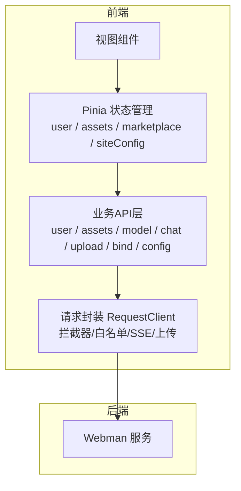
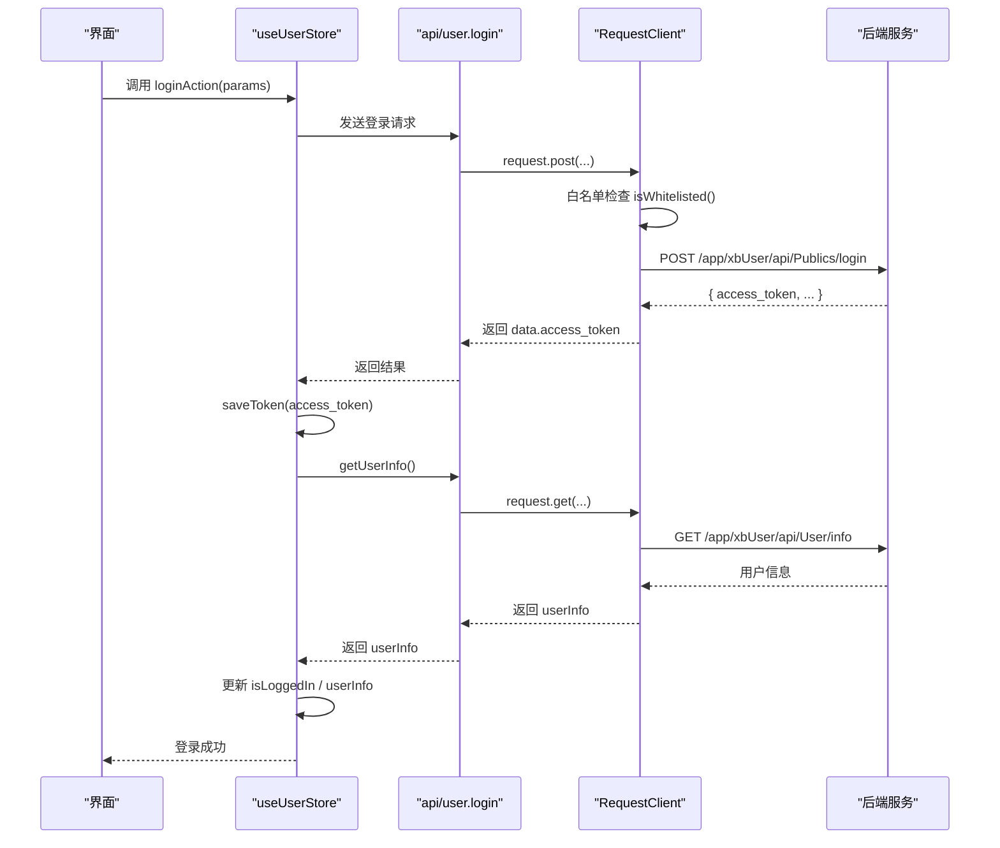
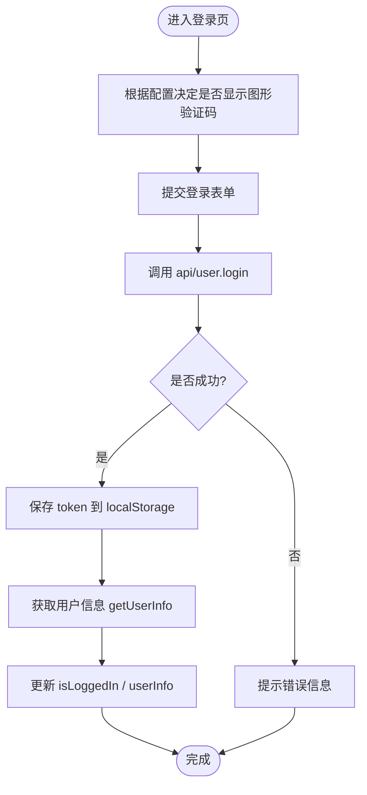
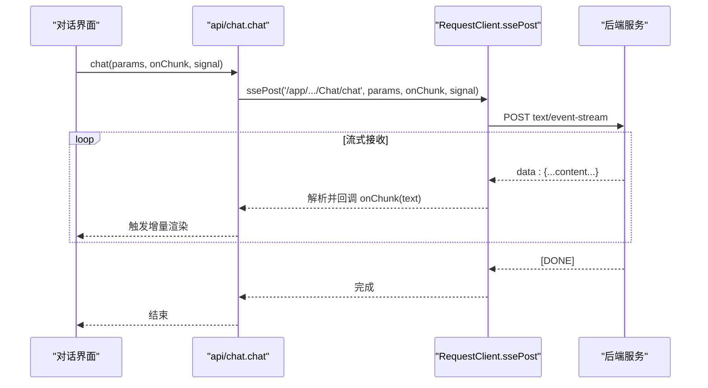
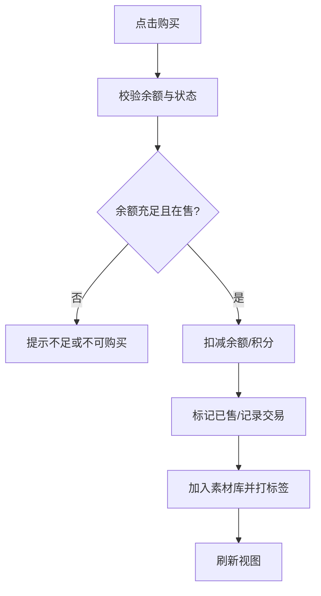
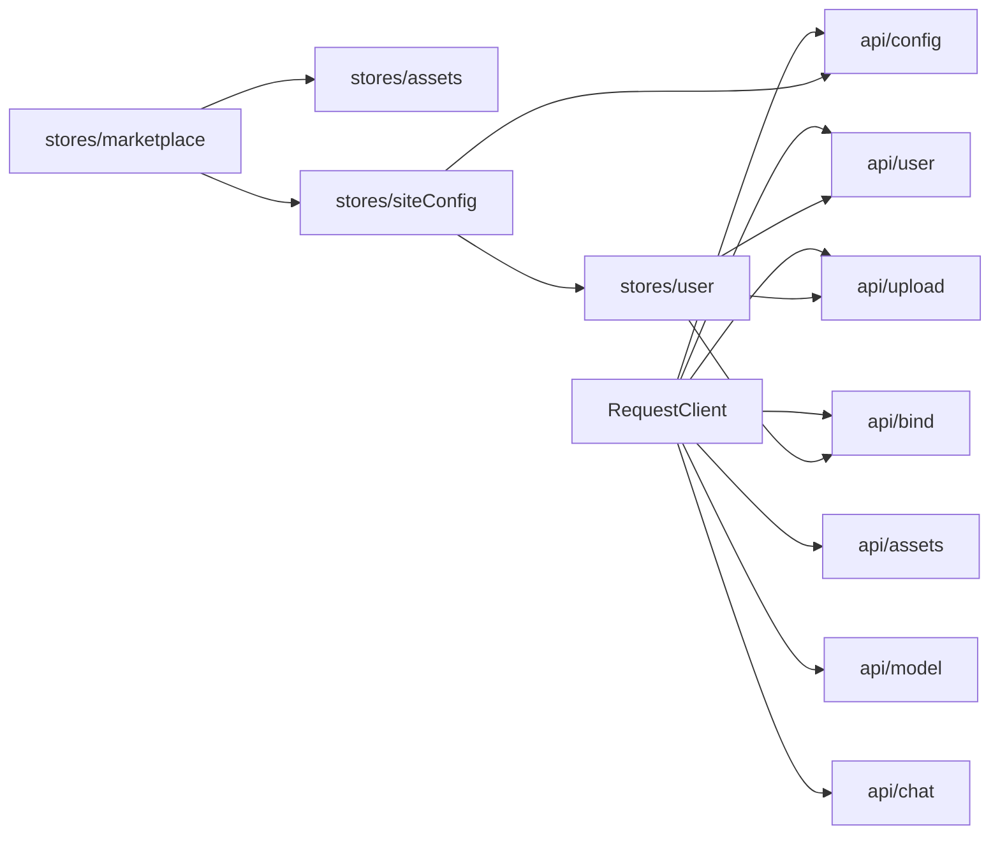

# 业务API模块

<cite>
**本文引用的文件**   
- [frontend/src/utils/request/index.ts](file://frontend/src/utils/request/index.ts)
- [frontend/src/utils/request/config.ts](file://frontend/src/utils/request/config.ts)
- [frontend/src/utils/request/white.json](file://frontend/src/utils/request/white.json)
- [frontend/src/api/user.ts](file://frontend/src/api/user.ts)
- [frontend/src/api/assets.ts](file://frontend/src/api/assets.ts)
- [frontend/src/api/model.ts](file://frontend/src/api/model.ts)
- [frontend/src/api/chat.ts](file://frontend/src/api/chat.ts)
- [frontend/src/api/upload.ts](file://frontend/src/api/upload.ts)
- [frontend/src/api/bind.ts](file://frontend/src/api/bind.ts)
- [frontend/src/api/config.ts](file://frontend/src/api/config.ts)
- [frontend/src/stores/user.ts](file://frontend/src/stores/user.ts)
- [frontend/src/stores/assets.ts](file://frontend/src/stores/assets.ts)
- [frontend/src/stores/marketplace.ts](file://frontend/src/stores/marketplace.ts)
- [frontend/src/stores/siteConfig.ts](file://frontend/src/stores/siteConfig.ts)
</cite>

## 目录
1. [简介](#简介)
2. [项目结构](#项目结构)
3. [核心组件](#核心组件)
4. [架构总览](#架构总览)
5. [详细组件分析](#详细组件分析)
6. [依赖关系分析](#依赖关系分析)
7. [性能与缓存策略](#性能与缓存策略)
8. [故障排查指南](#故障排查指南)
9. [结论](#结论)
10. [附录：接口清单与使用示例](#附录接口清单与使用示例)

## 简介
本文件面向前端业务API模块，系统性梳理用户认证、资产管理、AI模型调用、市场交易等核心能力的接口定义、参数校验、响应结构、错误处理以及与前端状态管理的集成方式。文档同时提供数据流图、时序图和流程图，帮助读者快速理解从页面到后端的数据流转与状态更新机制。

## 项目结构
前端采用“API层 + 请求封装 + Pinia状态管理”的分层组织方式：
- API层：按业务域拆分（user、assets、model、chat、upload、bind、config），统一通过请求客户端发起HTTP/SSE请求。
- 请求封装：基于Axios的RequestClient，集中处理Token注入、白名单判断、SSE流式解析、上传进度等。
- 状态管理：Pinia Store负责登录态、素材库、市场交易、站点配置等全局状态，驱动UI渲染与交互。

图表来源
- [frontend/src/utils/request/index.ts:32-237](file://frontend/src/utils/request/index.ts#L32-L237)
- [frontend/src/api/user.ts:150-226](file://frontend/src/api/user.ts#L150-L226)
- [frontend/src/stores/user.ts:8-327](file://frontend/src/stores/user.ts#L8-L327)

章节来源
- [frontend/src/utils/request/index.ts:1-237](file://frontend/src/utils/request/index.ts#L1-L237)
- [frontend/src/utils/request/config.ts:1-39](file://frontend/src/utils/request/config.ts#L1-L39)
- [frontend/src/utils/request/white.json:1-28](file://frontend/src/utils/request/white.json#L1-L28)

## 核心组件
- 请求客户端 RequestClient
  - 职责：封装Axios实例，统一设置baseURL/超时；自动附加Authorization头；白名单免鉴权；SSE流式POST；文件上传进度回调；返回标准化数据。
  - 关键能力：
    - Token注入：默认从localStorage读取token并注入请求头。
    - 白名单控制：isWhitelisted(url)决定是否需要登录态。
    - SSE支持：ssePost方法逐块解析text/event-stream，兼容多种消息体字段。
    - 上传：FormData构建，支持额外字段、自定义字段名、取消控制器、进度回调。
- 业务API层
  - user：注册、登录、获取用户信息、修改资料、密码相关、绑定手机/邮箱、退出登录。
  - assets：资产列表、详情、创建、更新、删除。
  - model：模型列表、分页列表。
  - chat：AI聊天（SSE流式）。
  - upload：文件上传。
  - bind：绑定/解绑手机/邮箱。
  - config：站点配置。
- 状态管理 Store
  - user：登录态、用户信息、绑定状态、头像/昵称更新、初始化防抖。
  - assets：本地素材库（类型/子类型/标签筛选、增删）。
  - marketplace：市场上架、购买、交易记录、点赞、排序与筛选。
  - siteConfig：站点配置加载、货币名称/余额计算与写入。

章节来源
- [frontend/src/utils/request/index.ts:32-237](file://frontend/src/utils/request/index.ts#L32-L237)
- [frontend/src/api/user.ts:150-226](file://frontend/src/api/user.ts#L150-L226)
- [frontend/src/api/assets.ts:98-135](file://frontend/src/api/assets.ts#L98-L135)
- [frontend/src/api/model.ts:92-106](file://frontend/src/api/model.ts#L92-L106)
- [frontend/src/api/chat.ts:47-60](file://frontend/src/api/chat.ts#L47-L60)
- [frontend/src/api/upload.ts:9-24](file://frontend/src/api/upload.ts#L9-L24)
- [frontend/src/api/bind.ts:31-58](file://frontend/src/api/bind.ts#L31-L58)
- [frontend/src/api/config.ts:194-200](file://frontend/src/api/config.ts#L194-L200)
- [frontend/src/stores/user.ts:8-327](file://frontend/src/stores/user.ts#L8-L327)
- [frontend/src/stores/assets.ts:43-161](file://frontend/src/stores/assets.ts#L43-L161)
- [frontend/src/stores/marketplace.ts:77-334](file://frontend/src/stores/marketplace.ts#L77-L334)
- [frontend/src/stores/siteConfig.ts:7-100](file://frontend/src/stores/siteConfig.ts#L7-L100)

## 架构总览
下图展示一次典型的用户登录流程，包括白名单判断、Token注入、状态同步与用户信息拉取。

图表来源
- [frontend/src/stores/user.ts:87-105](file://frontend/src/stores/user.ts#L87-L105)
- [frontend/src/api/user.ts:157-169](file://frontend/src/api/user.ts#L157-L169)
- [frontend/src/utils/request/index.ts:46-58](file://frontend/src/utils/request/index.ts#L46-L58)
- [frontend/src/utils/request/config.ts:22-38](file://frontend/src/utils/request/config.ts#L22-L38)

## 详细组件分析

### 用户认证模块
- 接口概览
  - 注册：POST /app/xbUser/api/Publics/register
  - 登录：POST /app/xbUser/api/Publics/login
  - 获取用户信息：GET /app/xbUser/api/User/info
  - 修改资料（单字段）：PUT /app/xbUser/api/User/profile
  - 修改资料（昵称/头像）：PUT /app/xbUser/api/User/editProfile
  - 修改密码：PUT /app/xbUser/api/User/password
  - 找回密码：PUT /app/xbUser/api/Publics/findPassword
  - 图形验证码：GET /app/xbUser/api/Publics/captcha
  - 手机验证码登录：POST /app/xbUser/api/Publics/mobileLogin
  - 邮箱验证码登录：POST /app/xbUser/api/Publics/emailLogin
  - 退出登录：DELETE /app/xbUser/api/Publics/logout
- 参数验证要点
  - 登录/注册/找回密码等可能受图形验证码开关影响，需携带captcha_key与captcha_code。
  - 手机号/邮箱登录需携带对应code。
  - 修改资料字段为单字段时，field/value必填。
- 响应数据结构
  - 登录返回包含access_token、refresh_token、expires_in等。
  - 用户信息包含id、username、nickname、mobile、email、avatar、balance、integral等。
- 错误处理逻辑
  - 登录失败或网络异常时，store捕获错误并返回统一格式{success,message}。
  - 退出登录即使接口失败也会清理本地token与用户信息。
- 与状态管理集成
  - useUserStore在登录成功后持久化token，并拉取用户信息，更新isLoggedIn与userInfo。
  - 页面刷新时initUser会尝试恢复登录态，若失效则清除本地状态。
  - 绑定手机/邮箱后同步更新userInfo对应字段。

图表来源
- [frontend/src/stores/user.ts:87-105](file://frontend/src/stores/user.ts#L87-L105)
- [frontend/src/api/user.ts:157-169](file://frontend/src/api/user.ts#L157-L169)

章节来源
- [frontend/src/api/user.ts:150-226](file://frontend/src/api/user.ts#L150-L226)
- [frontend/src/stores/user.ts:8-327](file://frontend/src/stores/user.ts#L8-L327)
- [frontend/src/utils/request/config.ts:22-38](file://frontend/src/utils/request/config.ts#L22-L38)

### 资产管理模块
- 接口概览
  - 资产列表：GET /app/xbAiAsset/api/Asset/list
  - 资产详情：GET /app/xbAiAsset/api/Asset/detail
  - 创建资产：POST /app/xbAiAsset/api/Asset/create
  - 更新资产：PUT /app/xbAiAsset/api/Asset/update
  - 删除资产：DELETE /app/xbAiAsset/api/Asset/delete
- 参数与响应
  - 列表查询支持type/source/name/page/limit等过滤与分页。
  - 资产项包含id、name、type、source、thumb、media_url、duration、tags、create_at等。
- 错误处理
  - 由请求拦截器统一处理网络与业务错误，上层可结合业务提示。
- 与状态管理集成
  - 当前assets store以本地数据为主，提供增删与筛选能力；后续可对接API实现服务端同步。

章节来源
- [frontend/src/api/assets.ts:98-135](file://frontend/src/api/assets.ts#L98-L135)
- [frontend/src/stores/assets.ts:43-161](file://frontend/src/stores/assets.ts#L43-L161)

### AI模型调用模块
- 接口概览
  - 模型列表：GET /app/xbAiModelAgent/api/Model/index
  - 模型分页列表：GET /app/xbAiModelAgent/api/Model/getList
  - AI聊天（SSE流式）：POST /app/xbAiModelAgent/api/Chat/chat
- 参数与响应
  - ChatParams支持temperature、top_p、n、max_tokens、stop、penalties、tools、tool_choice、response_format、seed等。
  - SSE流式返回文本片段，RequestClient.ssePost逐块解析并回调onChunk。
- 错误处理
  - SSE连接失败、超时、中止均会抛出错误，调用方可捕获并提示。
- 与状态管理集成
  - 可在对话类Store中维护messages数组，将onChunk追加至最后一条消息内容，实现实时渲染。

图表来源
- [frontend/src/api/chat.ts:47-60](file://frontend/src/api/chat.ts#L47-L60)
- [frontend/src/utils/request/index.ts:132-227](file://frontend/src/utils/request/index.ts#L132-L227)

章节来源
- [frontend/src/api/model.ts:92-106](file://frontend/src/api/model.ts#L92-L106)
- [frontend/src/api/chat.ts:1-60](file://frontend/src/api/chat.ts#L1-L60)
- [frontend/src/utils/request/index.ts:132-227](file://frontend/src/utils/request/index.ts#L132-L227)

### 市场交易模块
- 能力说明
  - 上架商品：listAsset(listingId, price, description?)
  - 批量上架：listAssetsBatch(items[])
  - 下架商品：unlistAsset(listingId)
  - 购买商品：purchaseAsset(listingId)
  - 修改售价：updatePrice(listingId, newPrice)
  - 切换点赞：toggleLike(listingId)
- 数据模型
  - MarketListing：包含asset、seller、price、status、viewCount、likeCount等。
  - Transaction：买入/卖出记录，含asset缩略图、价格、时间等。
  - UserWallet：余额、累计收入、累计支出。
- 业务规则
  - 购买前校验余额（currencyBalance）、卖家非本人、商品在售。
  - 购买成功后扣减余额、记录交易、添加到素材库并标记已购。
- 与状态管理集成
  - marketplace store维护listings/transactions/wallet，并提供computed派生视图（如filteredListings、myListings、buyTransactions、sellTransactions）。
  - 与siteConfig store联动，动态选择余额或积分作为货币。

图表来源
- [frontend/src/stores/marketplace.ts:254-293](file://frontend/src/stores/marketplace.ts#L254-L293)
- [frontend/src/stores/siteConfig.ts:65-86](file://frontend/src/stores/siteConfig.ts#L65-L86)

章节来源
- [frontend/src/stores/marketplace.ts:77-334](file://frontend/src/stores/marketplace.ts#L77-L334)
- [frontend/src/stores/siteConfig.ts:7-100](file://frontend/src/stores/siteConfig.ts#L7-L100)

### 上传与绑定模块
- 上传
  - 接口：POST /app/xbUpload/api/Upload/upload
  - 能力：支持进度回调、额外字段、自定义字段名、取消控制器。
  - 使用场景：头像上传后调用editProfileField保存。
- 绑定/解绑
  - 绑定手机/邮箱：PUT /app/xbUser/api/Bind/bindMobile、/app/xbUser/api/Bind/bindMail
  - 解绑手机/邮箱：DELETE /app/xbUser/api/Bind/unlockBindMobile、/app/xbUser/api/Bind/unlockMail
  - 成功后同步更新userInfo对应字段。

章节来源
- [frontend/src/api/upload.ts:9-24](file://frontend/src/api/upload.ts#L9-L24)
- [frontend/src/api/bind.ts:31-58](file://frontend/src/api/bind.ts#L31-L58)
- [frontend/src/stores/user.ts:273-298](file://frontend/src/stores/user.ts#L273-L298)

## 依赖关系分析
- 请求层依赖
  - RequestClient依赖defaultConfig与白名单配置，统一处理鉴权与SSE。
  - 各API模块仅依赖request实例，保持低耦合。
- 状态层依赖
  - user store依赖user API与upload、bind API。
  - marketplace store依赖assets store与siteConfig store。
  - siteConfig store依赖config API与user store（用于读写余额/积分）。

图表来源
- [frontend/src/utils/request/index.ts:32-237](file://frontend/src/utils/request/index.ts#L32-L237)
- [frontend/src/api/user.ts:150-226](file://frontend/src/api/user.ts#L150-L226)
- [frontend/src/api/assets.ts:98-135](file://frontend/src/api/assets.ts#L98-L135)
- [frontend/src/api/model.ts:92-106](file://frontend/src/api/model.ts#L92-L106)
- [frontend/src/api/chat.ts:47-60](file://frontend/src/api/chat.ts#L47-L60)
- [frontend/src/api/upload.ts:9-24](file://frontend/src/api/upload.ts#L9-L24)
- [frontend/src/api/bind.ts:31-58](file://frontend/src/api/bind.ts#L31-L58)
- [frontend/src/api/config.ts:194-200](file://frontend/src/api/config.ts#L194-L200)
- [frontend/src/stores/user.ts:8-327](file://frontend/src/stores/user.ts#L8-L327)
- [frontend/src/stores/assets.ts:43-161](file://frontend/src/stores/assets.ts#L43-L161)
- [frontend/src/stores/marketplace.ts:77-334](file://frontend/src/stores/marketplace.ts#L77-L334)
- [frontend/src/stores/siteConfig.ts:7-100](file://frontend/src/stores/siteConfig.ts#L7-L100)

章节来源
- [frontend/src/utils/request/index.ts:32-237](file://frontend/src/utils/request/index.ts#L32-L237)
- [frontend/src/utils/request/config.ts:1-39](file://frontend/src/utils/request/config.ts#L1-L39)
- [frontend/src/utils/request/white.json:1-28](file://frontend/src/utils/request/white.json#L1-L28)

## 性能与缓存策略
- 请求级优化
  - 白名单接口无需鉴权，减少Token注入与鉴权开销。
  - SSE流式传输避免长轮询，降低带宽与延迟。
- 状态级优化
  - initUser防重复初始化，避免并发拉取用户信息。
  - computed派生数据（marketplace筛选/排序、siteConfig货币名称/余额）减少重复计算。
- 建议
  - 对热点资源（如模型列表、热门标签）引入短期缓存（内存或浏览器缓存）。
  - 上传大文件时启用断点续传与分片上传（可扩展）。
  - 列表分页与虚拟滚动结合，提升大数据量渲染性能。

[本节为通用指导，不直接分析具体文件]

## 故障排查指南
- 登录相关问题
  - 现象：登录后立即失效。
  - 排查：确认白名单是否包含登录接口；检查Token是否正确注入；查看getUserInfo是否返回错误导致清理状态。
- SSE聊天中断
  - 现象：流式输出中途停止。
  - 排查：检查signal是否被提前中止；确认服务端是否推送[DONE]；查看网络状态与跨域配置。
- 上传失败
  - 现象：上传无进度或失败。
  - 排查：确认fieldName与后端一致；检查extraData字段类型；观察AbortController是否误用。
- 市场购买失败
  - 现象：余额不足或无法购买。
  - 排查：核对currencyBalance计算逻辑（余额/积分）；确认商品状态为active且非本人商品。

章节来源
- [frontend/src/utils/request/config.ts:22-38](file://frontend/src/utils/request/config.ts#L22-L38)
- [frontend/src/utils/request/index.ts:132-227](file://frontend/src/utils/request/index.ts#L132-L227)
- [frontend/src/stores/user.ts:54-85](file://frontend/src/stores/user.ts#L54-L85)
- [frontend/src/stores/marketplace.ts:254-293](file://frontend/src/stores/marketplace.ts#L254-L293)

## 结论
本业务API模块通过清晰的API分层、统一的请求封装与Pinia状态管理，实现了用户认证、资产管理、AI模型调用与市场交易的完整闭环。借助白名单与SSE能力，系统在安全性与实时性方面具备良好基础。后续可进一步扩展缓存策略与服务端同步，以提升性能与一致性。

[本节为总结，不直接分析具体文件]

## 附录：接口清单与使用示例

- 用户认证
  - 登录
    - 路径：POST /app/xbUser/api/Publics/login
    - 参数：username、password、可选captcha_key/captcha_code
    - 响应：access_token、refresh_token、expires_in
    - 参考：[frontend/src/api/user.ts:157-162](file://frontend/src/api/user.ts#L157-L162)
  - 获取用户信息
    - 路径：GET /app/xbUser/api/User/info
    - 响应：用户基本信息与余额/积分
    - 参考：[frontend/src/api/user.ts:167-169](file://frontend/src/api/user.ts#L167-L169)
  - 退出登录
    - 路径：DELETE /app/xbUser/api/Publics/logout
    - 参数：client='web' | 'mobile'
    - 参考：[frontend/src/api/user.ts:223-225](file://frontend/src/api/user.ts#L223-L225)
- 资产管理
  - 资产列表
    - 路径：GET /app/xbAiAsset/api/Asset/list
    - 参数：type/source/name/page/limit
    - 响应：分页结构与data数组
    - 参考：[frontend/src/api/assets.ts:101-103](file://frontend/src/api/assets.ts#L101-L103)
  - 创建资产
    - 路径：POST /app/xbAiAsset/api/Asset/create
    - 参数：name/type/source/media_url/可选thumb/duration/tags
    - 响应：资产详情
    - 参考：[frontend/src/api/assets.ts:118-120](file://frontend/src/api/assets.ts#L118-L120)
- AI模型调用
  - 模型列表
    - 路径：GET /app/xbAiModelAgent/api/Model/index
    - 参数：group_code、model_id（可选）
    - 响应：模型数组
    - 参考：[frontend/src/api/model.ts:96-98](file://frontend/src/api/model.ts#L96-L98)
  - AI聊天（SSE）
    - 路径：POST /app/xbAiModelAgent/api/Chat/chat
    - 参数：model_id、messages、temperature/top_p/n/max_tokens等
    - 行为：流式回调onChunk(text)
    - 参考：[frontend/src/api/chat.ts:53-59](file://frontend/src/api/chat.ts#L53-L59)
- 上传与绑定
  - 文件上传
    - 路径：POST /app/xbUpload/api/Upload/upload
    - 参数：file（formData字段名file）
    - 响应：url
    - 参考：[frontend/src/api/upload.ts:15-23](file://frontend/src/api/upload.ts#L15-L23)
  - 绑定手机
    - 路径：PUT /app/xbUser/api/Bind/bindMobile
    - 参数：mobile、code
    - 参考：[frontend/src/api/bind.ts:34-36](file://frontend/src/api/bind.ts#L34-36)
- 站点配置
  - 获取站点配置
    - 路径：GET /app/xbMovieApp/api/Config/index
    - 响应：系统/备案/短信/邮件/用户/充值/提现/资产/社区等配置
    - 参考：[frontend/src/api/config.ts:197-199](file://frontend/src/api/config.ts#L197-L199)

章节来源
- [frontend/src/api/user.ts:150-226](file://frontend/src/api/user.ts#L150-L226)
- [frontend/src/api/assets.ts:98-135](file://frontend/src/api/assets.ts#L98-L135)
- [frontend/src/api/model.ts:92-106](file://frontend/src/api/model.ts#L92-L106)
- [frontend/src/api/chat.ts:1-60](file://frontend/src/api/chat.ts#L1-L60)
- [frontend/src/api/upload.ts:9-24](file://frontend/src/api/upload.ts#L9-L24)
- [frontend/src/api/bind.ts:31-58](file://frontend/src/api/bind.ts#L31-L58)
- [frontend/src/api/config.ts:194-200](file://frontend/src/api/config.ts#L194-L200)