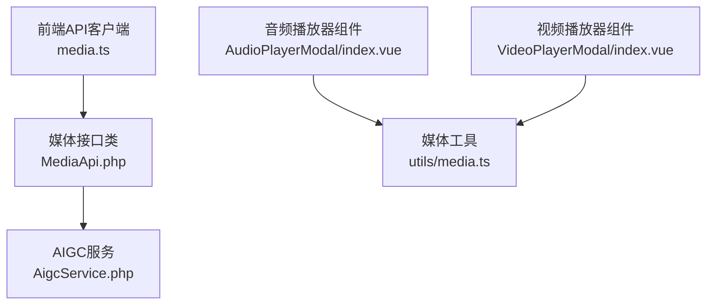
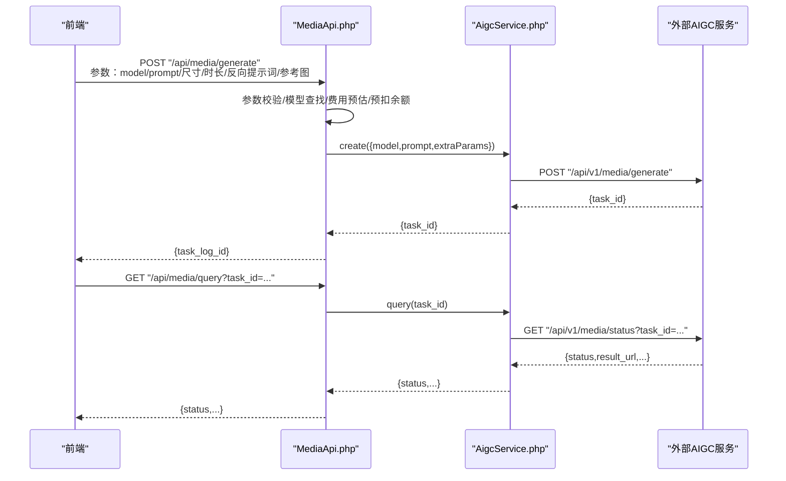
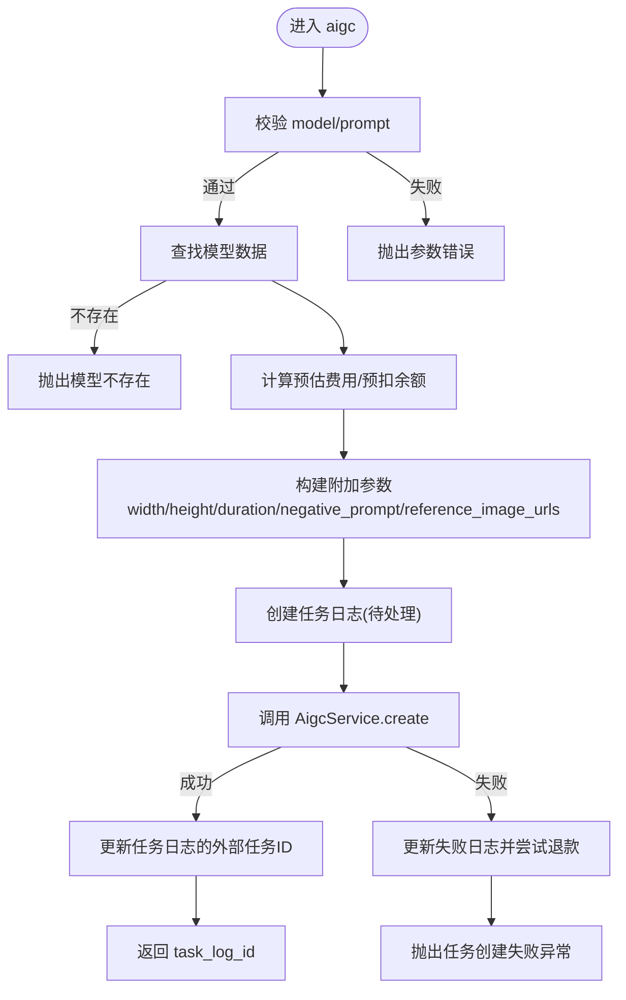
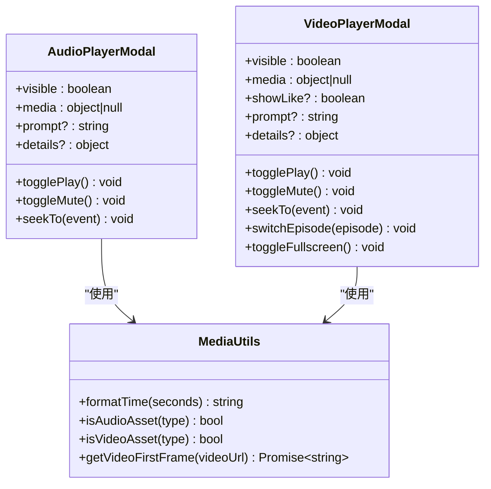
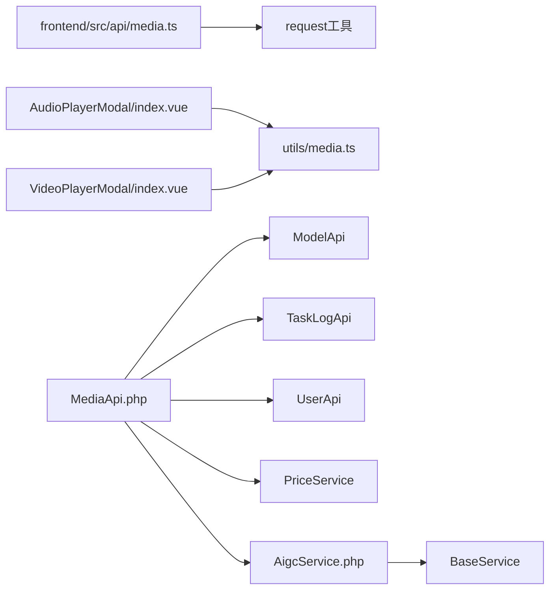

# 媒体处理API

<cite>
**本文引用的文件**   
- [frontend/src/api/media.ts](file://frontend/src/api/media.ts)
- [server/plugin/xbAiModelAgent/api/MediaApi.php](file://server/plugin/xbAiModelAgent/api/MediaApi.php)
- [server/plugin/xbAiModelAgent/service/xbservice/AigcService.php](file://server/plugin/xbAiModelAgent/service/xbservice/AigcService.php)
- [frontend/src/utils/media.ts](file://frontend/src/utils/media.ts)
- [frontend/src/components/AudioPlayerModal/index.vue](file://frontend/src/components/AudioPlayerModal/index.vue)
- [frontend/src/components/VideoPlayerModal/index.vue](file://frontend/src/components/VideoPlayerModal/index.vue)
</cite>

## 目录
1. [简介](#简介)
2. [项目结构](#项目结构)
3. [核心组件](#核心组件)
4. [架构总览](#架构总览)
5. [详细组件分析](#详细组件分析)
6. [依赖关系分析](#依赖关系分析)
7. [性能与流式传输优化](#性能与流式传输优化)
8. [故障排查指南](#故障排查指南)
9. [结论](#结论)
10. [附录：API调用示例与最佳实践](#附录api调用示例与最佳实践)

## 简介
本文件面向“媒体处理API”的开发者与集成方，聚焦于音视频文件的生成、任务状态查询、前端播放器集成与基础媒体能力（如视频首帧截图）。根据仓库现有实现，系统提供AIGC媒体生成接口（图片/音频/视频），并配套前端媒体播放组件与工具函数。文档将围绕以下目标展开：
- 说明媒体生成与查询接口的参数、流程与错误处理
- 解释前端播放器集成方式与基础媒体能力
- 给出批量处理、进度监控、错误重试等实用场景的实现思路
- 对性能与流式传输提出可落地的优化建议

注意：当前仓库未包含服务端转码、压缩、水印、缩略图生成等媒体处理逻辑的直接实现；本节在“性能与流式传输优化”中提供通用方案与建议，供后续扩展参考。

## 项目结构
本项目采用前后端分离结构：
- 前端通过 API 客户端发起媒体生成与查询请求，并使用原生 HTMLMediaElement 进行播放与基础处理
- 后端以插件形式提供媒体生成接口，负责参数校验、费用预估、任务创建与状态查询

图表来源
- [frontend/src/api/media.ts:1-57](file://frontend/src/api/media.ts#L1-L57)
- [server/plugin/xbAiModelAgent/api/MediaApi.php:1-203](file://server/plugin/xbAiModelAgent/api/MediaApi.php#L1-L203)
- [server/plugin/xbAiModelAgent/service/xbservice/AigcService.php:1-58](file://server/plugin/xbAiModelAgent/service/xbservice/AigcService.php#L1-L58)
- [frontend/src/utils/media.ts:1-55](file://frontend/src/utils/media.ts#L1-L55)
- [frontend/src/components/AudioPlayerModal/index.vue:1-181](file://frontend/src/components/AudioPlayerModal/index.vue#L1-L181)
- [frontend/src/components/VideoPlayerModal/index.vue:1-318](file://frontend/src/components/VideoPlayerModal/index.vue#L1-L318)

章节来源
- [frontend/src/api/media.ts:1-57](file://frontend/src/api/media.ts#L1-L57)
- [server/plugin/xbAiModelAgent/api/MediaApi.php:1-203](file://server/plugin/xbAiModelAgent/api/MediaApi.php#L1-L203)
- [server/plugin/xbAiModelAgent/service/xbservice/AigcService.php:1-58](file://server/plugin/xbAiModelAgent/service/xbservice/AigcService.php#L1-L58)
- [frontend/src/utils/media.ts:1-55](file://frontend/src/utils/media.ts#L1-L55)
- [frontend/src/components/AudioPlayerModal/index.vue:1-181](file://frontend/src/components/AudioPlayerModal/index.vue#L1-L181)
- [frontend/src/components/VideoPlayerModal/index.vue:1-318](file://frontend/src/components/VideoPlayerModal/index.vue#L1-L318)

## 核心组件
- 媒体生成与查询（前端）
  - 提供创建媒体生成任务与查询任务状态的接口封装
  - 支持图片、音频、视频三类模态的参数定义
- 媒体生成与查询（后端）
  - 接收请求、校验参数、计算费用、创建任务日志、投递到AIGC服务
  - 提供任务状态查询入口
- 前端媒体工具与播放器
  - 时间格式化、类型判断、视频首帧截图
  - 音频/视频播放器弹窗组件，支持播放控制、进度条、静音、全屏等

章节来源
- [frontend/src/api/media.ts:1-57](file://frontend/src/api/media.ts#L1-L57)
- [server/plugin/xbAiModelAgent/api/MediaApi.php:1-203](file://server/plugin/xbAiModelAgent/api/MediaApi.php#L1-L203)
- [server/plugin/xbAiModelAgent/service/xbservice/AigcService.php:1-58](file://server/plugin/xbAiModelAgent/service/xbservice/AigcService.php#L1-L58)
- [frontend/src/utils/media.ts:1-55](file://frontend/src/utils/media.ts#L1-L55)
- [frontend/src/components/AudioPlayerModal/index.vue:1-181](file://frontend/src/components/AudioPlayerModal/index.vue#L1-L181)
- [frontend/src/components/VideoPlayerModal/index.vue:1-318](file://frontend/src/components/VideoPlayerModal/index.vue#L1-L318)

## 架构总览
媒体处理的核心链路如下：
- 前端调用 /api/media/generate 创建任务
- 后端 MediaApi 校验参数、预估费用、创建任务日志，并通过 AigcService 调用外部AIGC服务
- 前端调用 /api/media/query 轮询任务状态
- 前端使用原生 <audio>/<video> 标签进行播放，结合工具函数完成基础媒体操作

图表来源
- [frontend/src/api/media.ts:45-56](file://frontend/src/api/media.ts#L45-L56)
- [server/plugin/xbAiModelAgent/api/MediaApi.php:46-152](file://server/plugin/xbAiModelAgent/api/MediaApi.php#L46-L152)
- [server/plugin/xbAiModelAgent/service/xbservice/AigcService.php:33-56](file://server/plugin/xbAiModelAgent/service/xbservice/AigcService.php#L33-L56)

## 详细组件分析

### 媒体生成与查询（前端）
- 功能要点
  - generateMedia：提交媒体生成任务，统一封装为POST请求
  - queryMediaTask：按 task_id 查询任务状态，用于进度监控
- 数据结构
  - ImageParams/AudioParams/VideoParams：分别定义图片、音频、视频的生成参数
- 使用建议
  - 前端应维护任务ID列表，轮询查询任务状态，直至成功或失败
  - 对网络异常与超时进行重试与降级处理

章节来源
- [frontend/src/api/media.ts:1-57](file://frontend/src/api/media.ts#L1-L57)

### 媒体生成与查询（后端）
- 功能要点
  - aigc：统一入口，负责参数校验、模型获取、费用预估与预扣、任务日志创建、调用AIGC服务、异常回滚
  - estimateMediaCost：依据模型定价策略计算费用（图片按尺寸、视频按时长/清晰度）
- 关键流程
  - 参数校验：必填字段检查
  - 模型查找：确保模型存在且有效
  - 费用计算：根据模态与参数选择不同计费策略
  - 任务创建：记录任务日志并更新外部任务ID
  - 异常处理：失败时更新日志状态并尝试退款
- 状态查询
  - 通过 AigcService.query 转发至外部服务的状态接口

图表来源
- [server/plugin/xbAiModelAgent/api/MediaApi.php:46-152](file://server/plugin/xbAiModelAgent/api/MediaApi.php#L46-L152)
- [server/plugin/xbAiModelAgent/api/MediaApi.php:163-201](file://server/plugin/xbAiModelAgent/api/MediaApi.php#L163-L201)

章节来源
- [server/plugin/xbAiModelAgent/api/MediaApi.php:1-203](file://server/plugin/xbAiModelAgent/api/MediaApi.php#L1-L203)
- [server/plugin/xbAiModelAgent/service/xbservice/AigcService.php:1-58](file://server/plugin/xbAiModelAgent/service/xbservice/AigcService.php#L1-L58)

### 前端媒体工具与播放器
- 工具函数
  - formatTime：秒数格式化为 mm:ss
  - isAudioAsset/isVideoAsset：基于类型判断媒体种类
  - getVideoFirstFrame：从视频URL提取第一帧作为 base64 DataURL，用于封面/预览
- 播放器组件
  - AudioPlayerModal：音频播放弹窗，支持播放/暂停、静音、进度拖拽、时间显示
  - VideoPlayerModal：视频播放弹窗，支持播放/暂停、静音、进度拖拽、全屏、选集切换、点赞交互

图表来源
- [frontend/src/utils/media.ts:1-55](file://frontend/src/utils/media.ts#L1-L55)
- [frontend/src/components/AudioPlayerModal/index.vue:1-181](file://frontend/src/components/AudioPlayerModal/index.vue#L1-L181)
- [frontend/src/components/VideoPlayerModal/index.vue:1-318](file://frontend/src/components/VideoPlayerModal/index.vue#L1-L318)

章节来源
- [frontend/src/utils/media.ts:1-55](file://frontend/src/utils/media.ts#L1-L55)
- [frontend/src/components/AudioPlayerModal/index.vue:1-181](file://frontend/src/components/AudioPlayerModal/index.vue#L1-L181)
- [frontend/src/components/VideoPlayerModal/index.vue:1-318](file://frontend/src/components/VideoPlayerModal/index.vue#L1-L318)

## 依赖关系分析
- 前端依赖
  - media.ts 依赖 request 工具进行HTTP通信
  - 播放器组件依赖原生HTMLMediaElement与Canvas（首帧截图）
- 后端依赖
  - MediaApi 依赖 ModelApi、TaskLogApi、UserApi、PriceService、AigcService
  - AigcService 继承 BaseService，复用统一的HTTP方法（postMultipart/get）

图表来源
- [frontend/src/api/media.ts:1-57](file://frontend/src/api/media.ts#L1-L57)
- [frontend/src/utils/media.ts:1-55](file://frontend/src/utils/media.ts#L1-L55)
- [frontend/src/components/AudioPlayerModal/index.vue:1-181](file://frontend/src/components/AudioPlayerModal/index.vue#L1-L181)
- [frontend/src/components/VideoPlayerModal/index.vue:1-318](file://frontend/src/components/VideoPlayerModal/index.vue#L1-L318)
- [server/plugin/xbAiModelAgent/api/MediaApi.php:1-203](file://server/plugin/xbAiModelAgent/api/MediaApi.php#L1-L203)
- [server/plugin/xbAiModelAgent/service/xbservice/AigcService.php:1-58](file://server/plugin/xbAiModelAgent/service/xbservice/AigcService.php#L1-L58)

章节来源
- [frontend/src/api/media.ts:1-57](file://frontend/src/api/media.ts#L1-L57)
- [frontend/src/utils/media.ts:1-55](file://frontend/src/utils/media.ts#L1-L55)
- [frontend/src/components/AudioPlayerModal/index.vue:1-181](file://frontend/src/components/AudioPlayerModal/index.vue#L1-L181)
- [frontend/src/components/VideoPlayerModal/index.vue:1-318](file://frontend/src/components/VideoPlayerModal/index.vue#L1-L318)
- [server/plugin/xbAiModelAgent/api/MediaApi.php:1-203](file://server/plugin/xbAiModelAgent/api/MediaApi.php#L1-L203)
- [server/plugin/xbAiModelAgent/service/xbservice/AigcService.php:1-58](file://server/plugin/xbAiModelAgent/service/xbservice/AigcService.php#L1-L58)

## 性能与流式传输优化
以下为通用优化建议，便于后续扩展媒体处理能力：
- 流式传输
  - 优先使用浏览器原生 <audio>/<video> 的流式播放能力，避免整文件下载后再播放
  - 服务端输出分块响应（chunked transfer encoding），配合Range请求实现断点续播
- 缓存与CDN
  - 静态媒体资源上CDN，开启强缓存与协商缓存策略
  - 针对热门内容设置合理的Cache-Control与ETag
- 自适应码率与多分辨率
  - 提供HLS/DASH等多码率版本，前端根据带宽动态切换
- 首帧与缩略图
  - 服务端生成高质量缩略图并缓存；前端可使用 getVideoFirstFrame 做兜底
- 转码与压缩
  - 统一转码流水线（容器/编码/比特率/分辨率），按需生成适配版本
- 水印与版权保护
  - 服务端添加不可见水印与可见水印，结合DRM或Token鉴权防止盗链

[本节为通用指导，不直接分析具体文件]

## 故障排查指南
- 常见错误
  - 参数缺失：model或prompt为空导致参数校验失败
  - 模型不存在：模型ID无效或未配置
  - 任务创建失败：外部AIGC服务异常或返回空task_id
- 定位步骤
  - 检查前端请求参数是否完整
  - 查看后端任务日志状态与错误信息
  - 核对外部AIGC服务返回的状态与结果
- 恢复策略
  - 失败时自动重试（指数退避）
  - 预扣余额失败或任务失败时触发退款流程

章节来源
- [server/plugin/xbAiModelAgent/api/MediaApi.php:46-152](file://server/plugin/xbAiModelAgent/api/MediaApi.php#L46-L152)

## 结论
当前仓库实现了AIGC媒体生成与查询的基础链路，并提供前端播放器与工具函数。对于转码、压缩、水印、缩略图等媒体处理能力，建议在现有架构基础上引入专用处理服务与流水线，并结合CDN与流式传输提升用户体验。

[本节为总结性内容，不直接分析具体文件]

## 附录：API调用示例与最佳实践
- 创建媒体生成任务
  - 前端调用 generateMedia，传入 model、prompt 及可选参数（宽度、高度、时长、反向提示词、参考图）
  - 成功后获得 task_log_id，用于后续状态查询
- 查询任务状态
  - 前端循环调用 queryMediaTask，直到任务完成或失败
  - 建议加入最大重试次数与退避策略
- 批量处理
  - 并发提交多个任务，维护任务队列与进度映射
  - 对失败任务进行重试与告警
- 进度监控
  - 前端展示进度条与状态文案，支持取消与重试
- 错误重试
  - 网络层重试（指数退避+抖动）
  - 业务层重试（幂等性保证，避免重复计费）

章节来源
- [frontend/src/api/media.ts:45-56](file://frontend/src/api/media.ts#L45-L56)
- [server/plugin/xbAiModelAgent/api/MediaApi.php:46-152](file://server/plugin/xbAiModelAgent/api/MediaApi.php#L46-L152)
- [server/plugin/xbAiModelAgent/service/xbservice/AigcService.php:33-56](file://server/plugin/xbAiModelAgent/service/xbservice/AigcService.php#L33-L56)