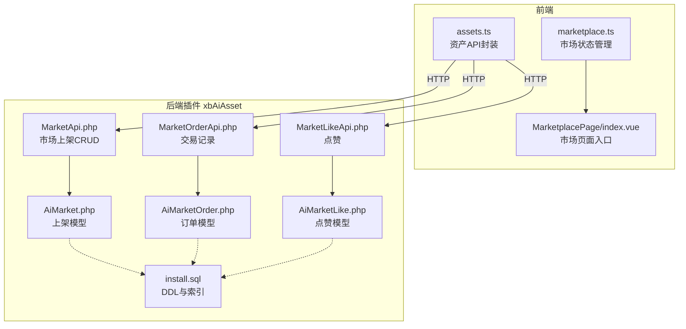
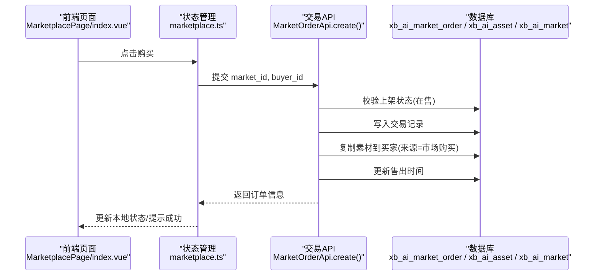
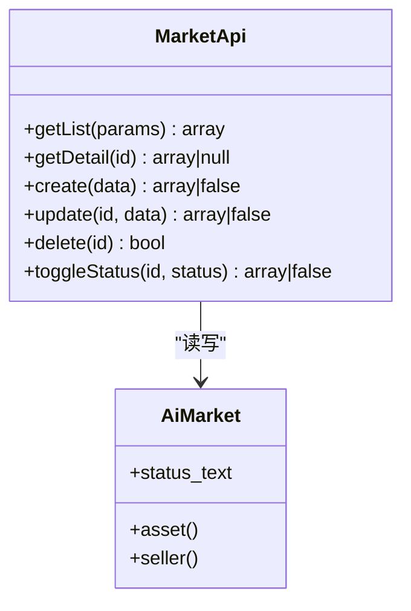
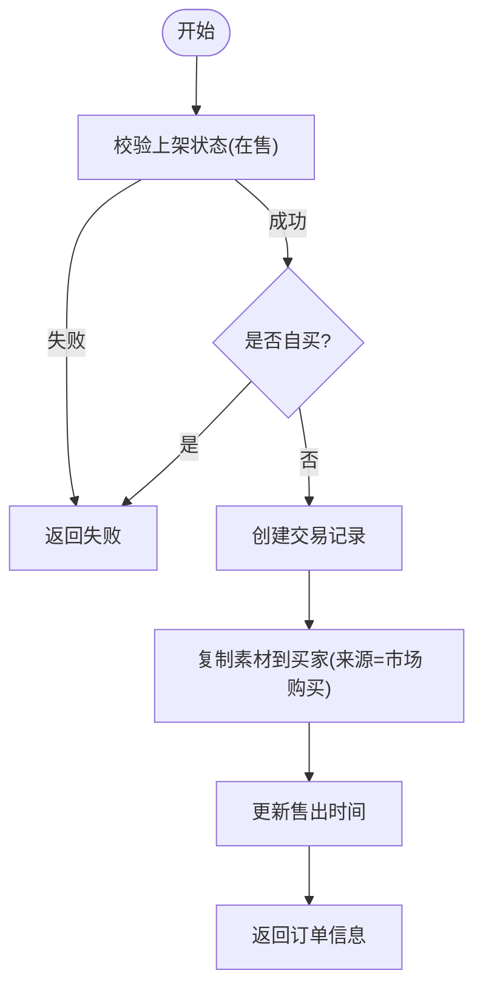
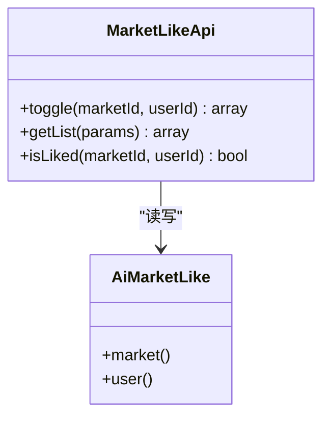
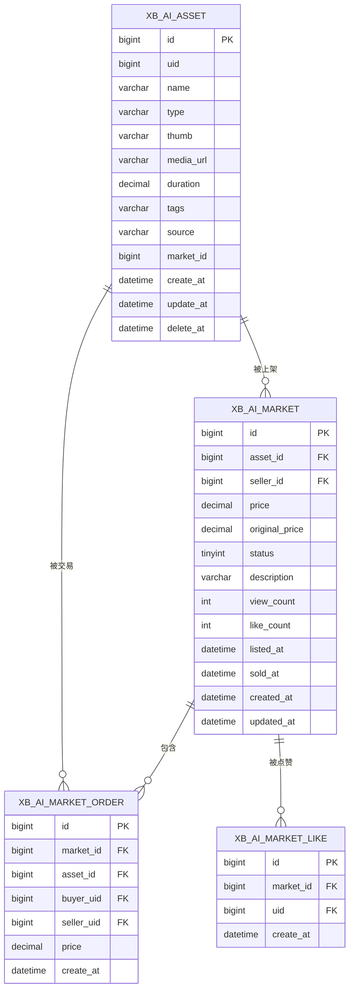
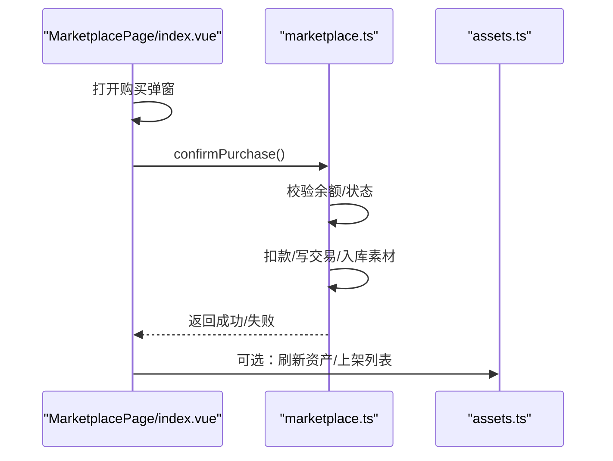
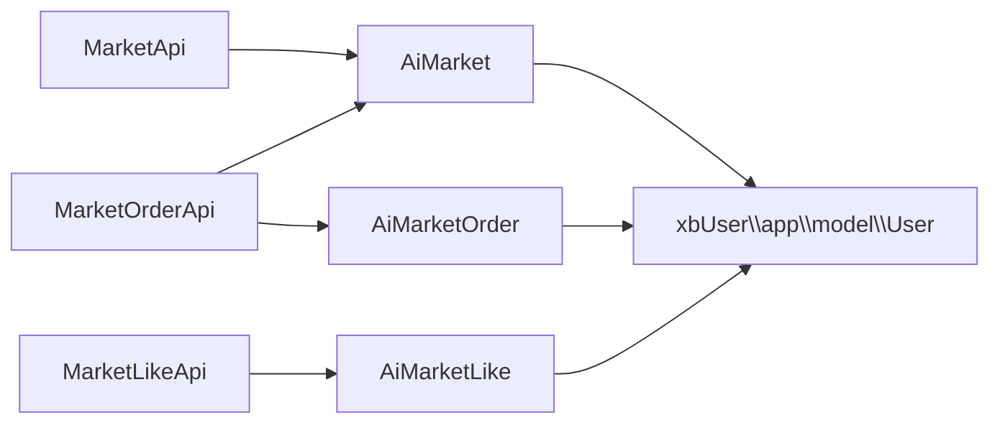

# 市场交易API

<cite>
**本文引用的文件**   
- [MarketApi.php](file://server/plugin/xbAiAsset/api/MarketApi.php)
- [MarketOrderApi.php](file://server/plugin/xbAiAsset/api/MarketOrderApi.php)
- [MarketLikeApi.php](file://server/plugin/xbAiAsset/api/MarketLikeApi.php)
- [AiMarket.php](file://server/plugin/xbAiAsset/app/model/AiMarket.php)
- [AiMarketOrder.php](file://server/plugin/xbAiAsset/app/model/AiMarketOrder.php)
- [AiMarketLike.php](file://server/plugin/xbAiAsset/app/model/AiMarketLike.php)
- [install.sql](file://server/plugin/xbAiAsset/install.sql)
- [assets.ts](file://frontend/src/api/assets.ts)
- [marketplace.ts](file://frontend/src/stores/marketplace.ts)
- [index.vue](file://frontend/src/views/MarketplacePage/index.vue)
</cite>

## 目录
1. [简介](#简介)
2. [项目结构](#项目结构)
3. [核心组件](#核心组件)
4. [架构总览](#架构总览)
5. [详细组件分析](#详细组件分析)
6. [依赖关系分析](#依赖关系分析)
7. [性能与扩展性](#性能与扩展性)
8. [故障排查指南](#故障排查指南)
9. [结论](#结论)
10. [附录：API调用示例](#附录api调用示例)

## 简介
本文件面向资产市场的商业化能力，提供商品上架、购买交易、点赞互动等后端API的完整说明，并结合前端状态管理与页面交互，给出端到端的调用流程与最佳实践。文档覆盖订单处理（含支付集成点）、库存管理（素材复制与来源标记）、交易记录、用户评价与数据统计等关键逻辑，帮助开发者快速落地并扩展市场交易功能。

## 项目结构
- 后端插件 xbAiAsset 提供市场上架、交易记录、点赞等API与数据模型；数据库脚本定义表结构与索引。
- 前端通过 assets.ts 暴露资产相关接口封装，marketplace.ts 维护市场态（上架、交易、钱包），MarketplacePage/index.vue 组织页面交互与弹窗。

图表来源
- [MarketApi.php:1-191](file://server/plugin/xbAiAsset/api/MarketApi.php#L1-L191)
- [MarketOrderApi.php:1-144](file://server/plugin/xbAiAsset/api/MarketOrderApi.php#L1-L144)
- [MarketLikeApi.php:1-118](file://server/plugin/xbAiAsset/api/MarketLikeApi.php#L1-L118)
- [AiMarket.php:1-51](file://server/plugin/xbAiAsset/app/model/AiMarket.php#L1-L51)
- [AiMarketOrder.php:1-63](file://server/plugin/xbAiAsset/app/model/AiMarketOrder.php#L1-L63)
- [AiMarketLike.php:1-45](file://server/plugin/xbAiAsset/app/model/AiMarketLike.php#L1-L45)
- [install.sql:1-105](file://server/plugin/xbAiAsset/install.sql#L1-L105)
- [assets.ts:1-135](file://frontend/src/api/assets.ts#L1-L135)
- [marketplace.ts:1-334](file://frontend/src/stores/marketplace.ts#L1-L334)
- [index.vue:1-196](file://frontend/src/views/MarketplacePage/index.vue#L1-L196)

章节来源
- [assets.ts:1-135](file://frontend/src/api/assets.ts#L1-L135)
- [marketplace.ts:1-334](file://frontend/src/stores/marketplace.ts#L1-L334)
- [index.vue:1-196](file://frontend/src/views/MarketplacePage/index.vue#L1-L196)

## 核心组件
- 市场上架 API（MarketApi）
  - 列表/详情/创建/更新/删除/切换状态，支持按状态、卖家、素材ID筛选与分页。
  - 详情访问会自增浏览次数。
- 交易记录 API（MarketOrderApi）
  - 列表查询（买家/卖家/上架/素材维度）。
  - 创建交易：校验在售状态、禁止自买、写入订单、复制素材到买家名下（source=30）、记录售出时间。
- 点赞 API（MarketLikeApi）
  - 切换点赞（存在则取消，不存在则新增），同步更新点赞数；支持列表与是否已点赞查询。
- 数据模型
  - AiMarket：关联素材与卖家，提供状态文本获取器。
  - AiMarketOrder：关联上架、素材、买家、卖家。
  - AiMarketLike：关联上架与用户。
- 数据库
  - install.sql 定义了资产、市场上架、交易记录、点赞、热门标签与用户标签等表及索引。

章节来源
- [MarketApi.php:1-191](file://server/plugin/xbAiAsset/api/MarketApi.php#L1-L191)
- [MarketOrderApi.php:1-144](file://server/plugin/xbAiAsset/api/MarketOrderApi.php#L1-L144)
- [MarketLikeApi.php:1-118](file://server/plugin/xbAiAsset/api/MarketLikeApi.php#L1-L118)
- [AiMarket.php:1-51](file://server/plugin/xbAiAsset/app/model/AiMarket.php#L1-L51)
- [AiMarketOrder.php:1-63](file://server/plugin/xbAiAsset/app/model/AiMarketOrder.php#L1-L63)
- [AiMarketLike.php:1-45](file://server/plugin/xbAiAsset/app/model/AiMarketLike.php#L1-L45)
- [install.sql:1-105](file://server/plugin/xbAiAsset/install.sql#L1-L105)

## 架构总览
下图展示从前端到后端的典型“购买”链路：前端触发购买 -> 调用交易API -> 校验与落库 -> 复制素材 -> 更新售出时间 -> 返回结果。

图表来源
- [MarketOrderApi.php:78-142](file://server/plugin/xbAiAsset/api/MarketOrderApi.php#L78-L142)
- [AiMarketOrder.php:1-63](file://server/plugin/xbAiAsset/app/model/AiMarketOrder.php#L1-L63)
- [AiMarket.php:1-51](file://server/plugin/xbAiAsset/app/model/AiMarket.php#L1-L51)
- [index.vue:64-81](file://frontend/src/views/MarketplacePage/index.vue#L64-L81)
- [marketplace.ts:254-293](file://frontend/src/stores/marketplace.ts#L254-L293)

## 详细组件分析

### 市场上架 API（MarketApi）
- 能力概览
  - 列表：支持 status/seller_id/asset_id 过滤与分页。
  - 详情：读取时自增 view_count。
  - 创建：设置默认状态为在售，记录 listed_at，触发事件钩子。
  - 更新/删除：支持前置/后置事件钩子。
  - 切换状态：将状态在“在售/下架”间切换。
- 关键约束
  - 详情访问会累加浏览计数，便于热度统计。
  - 状态枚举由 MarketStatusEnum 提供。
- 事件扩展点
  - 创建/更新/删除前后均派发事件，可用于审计、通知或异步任务。

图表来源
- [MarketApi.php:42-189](file://server/plugin/xbAiAsset/api/MarketApi.php#L42-L189)
- [AiMarket.php:20-50](file://server/plugin/xbAiAsset/app/model/AiMarket.php#L20-L50)

章节来源
- [MarketApi.php:42-189](file://server/plugin/xbAiAsset/api/MarketApi.php#L42-L189)
- [AiMarket.php:20-50](file://server/plugin/xbAiAsset/app/model/AiMarket.php#L20-L50)

### 交易记录 API（MarketOrderApi）
- 能力概览
  - 列表：支持 buyer_id/seller_id/market_id/asset_id 过滤与分页。
  - 创建：校验在售、禁止自买、写入订单、复制素材到买家、更新售出时间。
- 业务要点
  - 库存管理：通过复制素材并标记 source=30（市场购买）实现“虚拟库存”与使用权转移。
  - 幂等建议：建议在外部增加幂等键（如 buyer_id+market_id+时间窗口）避免重复下单。
  - 事务建议：订单写入、素材复制、售出时间更新应在同一事务中执行，保证一致性。

图表来源
- [MarketOrderApi.php:78-142](file://server/plugin/xbAiAsset/api/MarketOrderApi.php#L78-L142)
- [AiMarketOrder.php:1-63](file://server/plugin/xbAiAsset/app/model/AiMarketOrder.php#L1-L63)

章节来源
- [MarketOrderApi.php:48-142](file://server/plugin/xbAiAsset/api/MarketOrderApi.php#L48-L142)
- [AiMarketOrder.php:1-63](file://server/plugin/xbAiAsset/app/model/AiMarketOrder.php#L1-L63)

### 点赞 API（MarketLikeApi）
- 能力概览
  - 切换点赞：若已存在则取消并减计数，否则新增并加计数。
  - 列表：支持 market_id/user_id 过滤与分页。
  - 是否已点赞：判断当前用户对某商品的点赞状态。
- 数据一致性
  - 使用原子增减操作减少并发竞争。
  - 唯一索引保障同一用户对同一商品仅一次点赞。

图表来源
- [MarketLikeApi.php:40-116](file://server/plugin/xbAiAsset/api/MarketLikeApi.php#L40-L116)
- [AiMarketLike.php:19-44](file://server/plugin/xbAiAsset/app/model/AiMarketLike.php#L19-L44)

章节来源
- [MarketLikeApi.php:40-116](file://server/plugin/xbAiAsset/api/MarketLikeApi.php#L40-L116)
- [AiMarketLike.php:19-44](file://server/plugin/xbAiAsset/app/model/AiMarketLike.php#L19-L44)

### 数据模型与数据库设计
- 主要实体
  - 资产（xb_ai_asset）：名称、类型、缩略图、媒体地址、时长、标签、来源、关联上架ID等。
  - 市场上架（xb_ai_market）：关联素材与卖家、价格、原价、状态、描述、浏览/点赞数、上下架时间等。
  - 交易记录（xb_ai_market_order）：关联上架、素材、买家、卖家、金额、时间。
  - 点赞（xb_ai_market_like）：唯一约束（market_id, uid）。
- 索引策略
  - 常用查询字段建立复合索引，如 seller_id+status、status+asset_id、buyer/seller/market 等。
- 扩展点
  - 热门标签与用户标签表用于搜索与推荐。

图表来源
- [install.sql:1-105](file://server/plugin/xbAiAsset/install.sql#L1-L105)

章节来源
- [install.sql:1-105](file://server/plugin/xbAiAsset/install.sql#L1-L105)

### 前端状态与页面交互
- assets.ts
  - 提供资产列表、详情、创建、更新、删除等请求封装，路径以 /app/xbAiAsset/api/... 开头。
- marketplace.ts
  - 维护市场上架、交易记录、钱包余额等本地状态；提供上架、批量上架、下架、购买、改价、点赞等方法。
  - 购买流程：检查余额、扣款、记录交易、添加到素材库、更新状态。
- MarketplacePage/index.vue
  - 组合筛选、排序、分页、预览、购买、交易历史、价格编辑等弹窗；调用 store 方法驱动状态变化。

图表来源
- [index.vue:64-81](file://frontend/src/views/MarketplacePage/index.vue#L64-L81)
- [marketplace.ts:254-293](file://frontend/src/stores/marketplace.ts#L254-L293)
- [assets.ts:98-135](file://frontend/src/api/assets.ts#L98-L135)

章节来源
- [assets.ts:1-135](file://frontend/src/api/assets.ts#L1-L135)
- [marketplace.ts:1-334](file://frontend/src/stores/marketplace.ts#L1-L334)
- [index.vue:1-196](file://frontend/src/views/MarketplacePage/index.vue#L1-L196)

## 依赖关系分析
- 模块耦合
  - MarketApi/MarketOrderApi/MarketLikeApi 分别依赖对应模型，低耦合高内聚。
  - 模型通过 belongsTo 关联用户与素材，保持领域边界清晰。
- 外部依赖
  - 用户系统：xbUser 插件的用户模型。
  - 事件总线：Webman\Event\Event 用于生命周期钩子。
- 潜在循环依赖
  - 当前未见循环引用；如需扩展，建议通过事件或队列解耦。

图表来源
- [MarketApi.php:1-191](file://server/plugin/xbAiAsset/api/MarketApi.php#L1-L191)
- [MarketOrderApi.php:1-144](file://server/plugin/xbAiAsset/api/MarketOrderApi.php#L1-L144)
- [MarketLikeApi.php:1-118](file://server/plugin/xbAiAsset/api/MarketLikeApi.php#L1-L118)
- [AiMarket.php:20-50](file://server/plugin/xbAiAsset/app/model/AiMarket.php#L20-L50)
- [AiMarketOrder.php:31-61](file://server/plugin/xbAiAsset/app/model/AiMarketOrder.php#L31-L61)
- [AiMarketLike.php:31-43](file://server/plugin/xbAiAsset/app/model/AiMarketLike.php#L31-L43)

章节来源
- [MarketApi.php:1-191](file://server/plugin/xbAiAsset/api/MarketApi.php#L1-L191)
- [MarketOrderApi.php:1-144](file://server/plugin/xbAiAsset/api/MarketOrderApi.php#L1-L144)
- [MarketLikeApi.php:1-118](file://server/plugin/xbAiAsset/api/MarketLikeApi.php#L1-L118)

## 性能与扩展性
- 查询优化
  - 充分利用索引：seller_id/status、status/asset_id、buyer/seller/market 等。
  - 列表接口统一分页，避免一次性加载大数据集。
- 写入优化
  - 点赞采用原子增减，降低锁竞争。
  - 交易流程建议事务包裹，确保订单、素材复制、售出时间的一致性。
- 缓存与热点
  - 热门商品可引入 Redis 缓存浏览量/点赞数，定时回写数据库。
- 扩展点
  - 利用事件钩子接入支付、分账、风控、通知等异步流程。

[本节为通用指导，不直接分析具体文件]

## 故障排查指南
- 常见问题
  - 无法购买自己的商品：交易创建会拒绝自买。
  - 非在售不可购买：需先确认上架状态为在售。
  - 余额不足：前端需在购买前校验余额并提示充值。
  - 重复点赞：点赞表有唯一约束，重复操作会被忽略或转为取消。
- 定位建议
  - 查看交易记录与上架状态是否一致。
  - 核对素材来源是否为“市场购买”，确认 market_id 是否正确回填。
  - 关注事件钩子是否抛出异常导致流程中断。

章节来源
- [MarketOrderApi.php:82-142](file://server/plugin/xbAiAsset/api/MarketOrderApi.php#L82-L142)
- [MarketLikeApi.php:46-79](file://server/plugin/xbAiAsset/api/MarketLikeApi.php#L46-L79)

## 结论
本方案围绕市场上架、交易、点赞三大核心能力，结合清晰的模型设计与可扩展的事件机制，提供了稳定且易扩展的交易闭环。配合前端的资产与状态管理，可实现完整的商业交易体验。后续可在支付、分账、风控、评价与数据分析方面基于现有事件与模型进行平滑扩展。

[本节为总结性内容，不直接分析具体文件]

## 附录：API调用示例

说明
- 以下示例为概念性调用步骤，实际路径与参数请以各控制器/路由为准。
- 所有示例均遵循“请求-校验-落库-响应”的统一模式。

- 商品发布（上架）
  - 目标：将已有素材上架至市场并定价。
  - 步骤：
    1) 准备素材（确保存在且归属当前卖家）。
    2) 调用市场上架创建接口，传入 asset_id、price、description 等。
    3) 成功后获得 listingId，前端可展示“在售”。
  - 参考实现位置
    - [MarketApi.php:94-111](file://server/plugin/xbAiAsset/api/MarketApi.php#L94-L111)
    - [AiMarket.php:20-50](file://server/plugin/xbAiAsset/app/model/AiMarket.php#L20-L50)

- 购买交易（下单）
  - 目标：买家完成购买，生成交易记录并将素材复制到买家账户。
  - 步骤：
    1) 校验商品在售与买家非卖家本人。
    2) 创建交易记录，复制素材（source=30），更新售出时间。
    3) 返回订单信息，前端更新状态与素材库。
  - 参考实现位置
    - [MarketOrderApi.php:82-142](file://server/plugin/xbAiAsset/api/MarketOrderApi.php#L82-L142)
    - [AiMarketOrder.php:1-63](file://server/plugin/xbAiAsset/app/model/AiMarketOrder.php#L1-L63)

- 支付集成（扩展点）
  - 建议：在交易创建前后事件中接入支付网关，完成扣款与回调对账。
  - 参考事件点
    - [MarketOrderApi.php:111-139](file://server/plugin/xbAiAsset/api/MarketOrderApi.php#L111-L139)

- 库存管理（素材复制与来源标记）
  - 行为：购买后将素材复制一份至买家，并标记 source=30，同时回填 market_id。
  - 参考实现位置
    - [MarketOrderApi.php:119-131](file://server/plugin/xbAiAsset/api/MarketOrderApi.php#L119-L131)
    - [install.sql:1-21](file://server/plugin/xbAiAsset/install.sql#L1-L21)

- 交易记录查询
  - 支持按买家/卖家/上架/素材维度分页查询。
  - 参考实现位置
    - [MarketOrderApi.php:48-75](file://server/plugin/xbAiAsset/api/MarketOrderApi.php#L48-L75)

- 收益结算（扩展点）
  - 建议：基于交易记录与分润规则，在订单完成后触发结算任务，计算平台抽成与卖家收入。
  - 参考事件点
    - [MarketOrderApi.php:137-139](file://server/plugin/xbAiAsset/api/MarketOrderApi.php#L137-L139)

- 用户评价系统（扩展点）
  - 建议：在订单完成后开放评价入口，存储评价内容与评分，并在商品详情页聚合展示。
  - 可复用事件：ORDER_CREATED/ORDER_CREATE_AFTER。

- 数据统计分析
  - 指标：浏览量、点赞数、销量、热销排行、转化率等。
  - 数据来源：xb_ai_market.view_count/like_count、xb_ai_market_order 汇总。
  - 参考表结构
    - [install.sql:24-44](file://server/plugin/xbAiAsset/install.sql#L24-L44)
    - [install.sql:47-61](file://server/plugin/xbAiAsset/install.sql#L47-L61)

- 前端调用示例（概念）
  - 资产列表/详情/创建/更新/删除
    - 参考封装路径
      - [assets.ts:98-135](file://frontend/src/api/assets.ts#L98-L135)
  - 市场购买流程（前端状态）
    - 参考实现位置
      - [marketplace.ts:254-293](file://frontend/src/stores/marketplace.ts#L254-L293)
      - [index.vue:64-81](file://frontend/src/views/MarketplacePage/index.vue#L64-L81)

章节来源
- [MarketApi.php:94-111](file://server/plugin/xbAiAsset/api/MarketApi.php#L94-L111)
- [MarketOrderApi.php:82-142](file://server/plugin/xbAiAsset/api/MarketOrderApi.php#L82-L142)
- [AiMarketOrder.php:1-63](file://server/plugin/xbAiAsset/app/model/AiMarketOrder.php#L1-L63)
- [install.sql:1-61](file://server/plugin/xbAiAsset/install.sql#L1-L61)
- [assets.ts:98-135](file://frontend/src/api/assets.ts#L98-L135)
- [marketplace.ts:254-293](file://frontend/src/stores/marketplace.ts#L254-L293)
- [index.vue:64-81](file://frontend/src/views/MarketplacePage/index.vue#L64-L81)