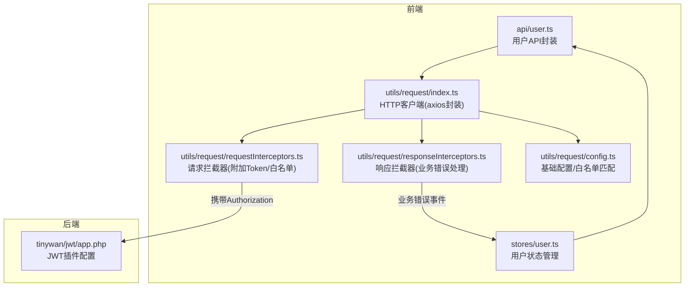
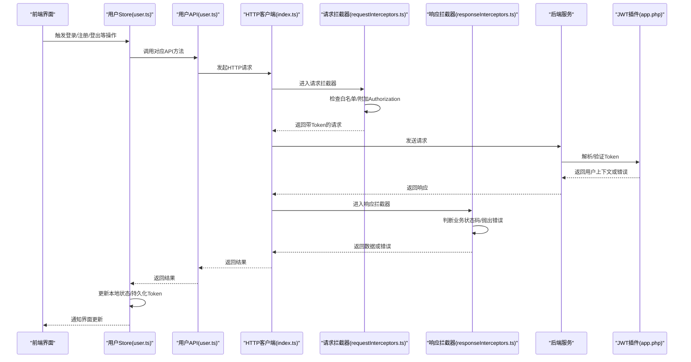
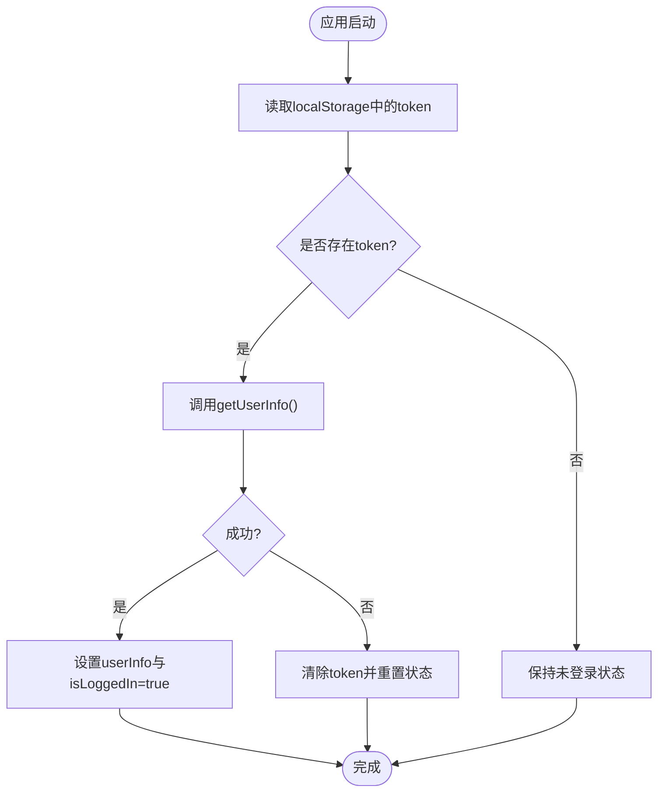
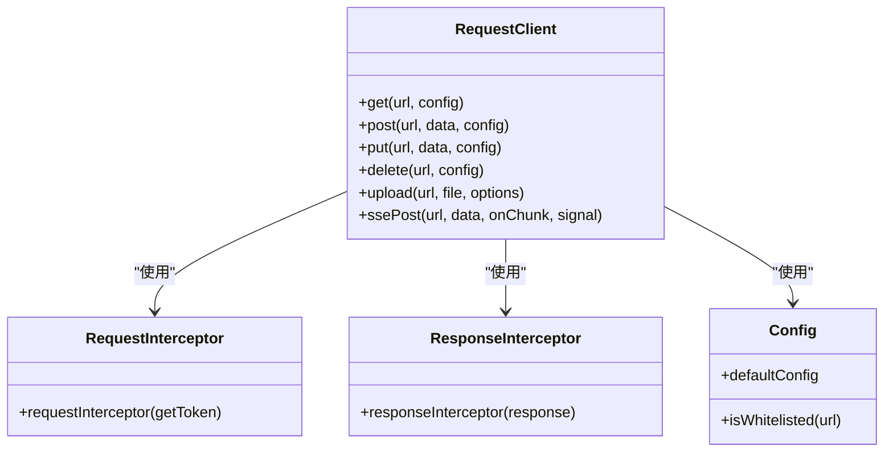
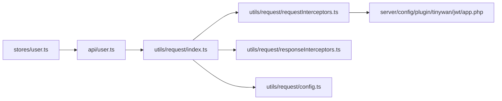

# 用户系统API

<cite>
**本文引用的文件**   
- [frontend/src/api/user.ts](file://frontend/src/api/user.ts)
- [frontend/src/stores/user.ts](file://frontend/src/stores/user.ts)
- [frontend/src/utils/request/index.ts](file://frontend/src/utils/request/index.ts)
- [frontend/src/utils/request/requestInterceptors.ts](file://frontend/src/utils/request/requestInterceptors.ts)
- [frontend/src/utils/request/responseInterceptors.ts](file://frontend/src/utils/request/responseInterceptors.ts)
- [frontend/src/utils/request/config.ts](file://frontend/src/utils/request/config.ts)
- [server/config/plugin/tinywan/jwt/app.php](file://server/config/plugin/tinywan/jwt/app.php)
</cite>

## 目录
1. [简介](#简介)
2. [项目结构](#项目结构)
3. [核心组件](#核心组件)
4. [架构总览](#架构总览)
5. [详细组件分析](#详细组件分析)
6. [依赖分析](#依赖分析)
7. [性能考虑](#性能考虑)
8. [故障排查指南](#故障排查指南)
9. [结论](#结论)
10. [附录](#附录)

## 简介
本文件面向前后端开发者，系统化梳理用户系统的认证、注册登录、个人信息管理、权限控制等核心能力，并重点说明 JWT 认证机制在前端的实现方式（Token 注入、白名单校验、错误拦截），以及前端用户状态管理（登录态持久化、用户信息缓存）与常见操作调用示例（注册、登录、登出、密码修改、头像上传）。

## 项目结构
围绕用户系统的关键代码分布在以下位置：
- 前端 API 封装：统一的用户接口定义与请求方法
- 前端状态管理：登录态、用户信息、绑定关系与常用操作的 Store
- 前端网络层：Axios 封装、请求/响应拦截器、白名单策略
- 后端配置：JWT 插件配置（算法、密钥、过期时间、单设备策略等）

图表来源
- [frontend/src/api/user.ts:1-226](file://frontend/src/api/user.ts#L1-L226)
- [frontend/src/stores/user.ts:1-327](file://frontend/src/stores/user.ts#L1-L327)
- [frontend/src/utils/request/index.ts:1-237](file://frontend/src/utils/request/index.ts#L1-L237)
- [frontend/src/utils/request/requestInterceptors.ts:1-47](file://frontend/src/utils/request/requestInterceptors.ts#L1-L47)
- [frontend/src/utils/request/responseInterceptors.ts:1-24](file://frontend/src/utils/request/responseInterceptors.ts#L1-L24)
- [frontend/src/utils/request/config.ts:1-39](file://frontend/src/utils/request/config.ts#L1-L39)
- [server/config/plugin/tinywan/jwt/app.php:1-37](file://server/config/plugin/tinywan/jwt/app.php#L1-L37)

章节来源
- [frontend/src/api/user.ts:1-226](file://frontend/src/api/user.ts#L1-L226)
- [frontend/src/stores/user.ts:1-327](file://frontend/src/stores/user.ts#L1-L327)
- [frontend/src/utils/request/index.ts:1-237](file://frontend/src/utils/request/index.ts#L1-L237)
- [frontend/src/utils/request/requestInterceptors.ts:1-47](file://frontend/src/utils/request/requestInterceptors.ts#L1-L47)
- [frontend/src/utils/request/responseInterceptors.ts:1-24](file://frontend/src/utils/request/responseInterceptors.ts#L1-L24)
- [frontend/src/utils/request/config.ts:1-39](file://frontend/src/utils/request/config.ts#L1-L39)
- [server/config/plugin/tinywan/jwt/app.php:1-37](file://server/config/plugin/tinywan/jwt/app.php#L1-L37)

## 核心组件
- 用户API封装
  - 提供注册、登录、获取用户信息、修改资料、修改密码、重置密码、验证码、手机/邮箱验证码登录、退出登录等接口。
  - 关键路径参考：[用户API封装:1-226](file://frontend/src/api/user.ts#L1-L226)
- 用户状态管理
  - 维护登录态、用户信息、手机号/邮箱绑定状态；封装登录、登出、注册、改密、头像更新等操作。
  - 关键路径参考：[用户状态管理:1-327](file://frontend/src/stores/user.ts#L1-L327)
- HTTP客户端与拦截器
  - Axios 封装，自动附加 Token、统一业务错误处理、支持上传与SSE流式请求。
  - 关键路径参考：[HTTP客户端:1-237](file://frontend/src/utils/request/index.ts#L1-L237)、[请求拦截器:1-47](file://frontend/src/utils/request/requestInterceptors.ts#L1-L47)、[响应拦截器:1-24](file://frontend/src/utils/request/responseInterceptors.ts#L1-L24)、[基础配置:1-39](file://frontend/src/utils/request/config.ts#L1-L39)
- 后端JWT配置
  - 配置算法、访问令牌与刷新令牌的密钥与过期时间、是否单设备、缓存前缀等。
  - 关键路径参考：[JWT配置:1-37](file://server/config/plugin/tinywan/jwt/app.php#L1-L37)

章节来源
- [frontend/src/api/user.ts:1-226](file://frontend/src/api/user.ts#L1-L226)
- [frontend/src/stores/user.ts:1-327](file://frontend/src/stores/user.ts#L1-L327)
- [frontend/src/utils/request/index.ts:1-237](file://frontend/src/utils/request/index.ts#L1-L237)
- [frontend/src/utils/request/requestInterceptors.ts:1-47](file://frontend/src/utils/request/requestInterceptors.ts#L1-L47)
- [frontend/src/utils/request/responseInterceptors.ts:1-24](file://frontend/src/utils/request/responseInterceptors.ts#L1-L24)
- [frontend/src/utils/request/config.ts:1-39](file://frontend/src/utils/request/config.ts#L1-L39)
- [server/config/plugin/tinywan/jwt/app.php:1-37](file://server/config/plugin/tinywan/jwt/app.php#L1-L37)

## 架构总览
下图展示了从页面到后端的完整认证与鉴权链路，包括 Token 的生成、注入、验证与错误处理。

图表来源
- [frontend/src/stores/user.ts:1-327](file://frontend/src/stores/user.ts#L1-L327)
- [frontend/src/api/user.ts:1-226](file://frontend/src/api/user.ts#L1-L226)
- [frontend/src/utils/request/index.ts:1-237](file://frontend/src/utils/request/index.ts#L1-L237)
- [frontend/src/utils/request/requestInterceptors.ts:1-47](file://frontend/src/utils/request/requestInterceptors.ts#L1-L47)
- [frontend/src/utils/request/responseInterceptors.ts:1-24](file://frontend/src/utils/request/responseInterceptors.ts#L1-L24)
- [server/config/plugin/tinywan/jwt/app.php:1-37](file://server/config/plugin/tinywan/jwt/app.php#L1-L37)

## 详细组件分析

### 用户API封装（user.ts）
- 功能范围
  - 公共接口：注册、登录、获取验证码、手机/邮箱验证码登录、重置密码、退出登录
  - 受保护接口：获取用户信息、修改资料（单字段/批量）、修改密码
- 数据结构
  - 登录响应包含 token_type、expires_in、access_token、refresh_token
  - 用户信息包含 id、username、nickname、mobile、email、avatar、balance、integral 等
- 典型调用路径
  - 注册：POST /app/xbUser/api/Publics/register
  - 登录：POST /app/xbUser/api/Publics/login
  - 获取用户信息：GET /app/xbUser/api/User/info
  - 修改资料（单字段）：PUT /app/xbUser/api/User/profile
  - 修改资料（昵称/头像）：PUT /app/xbUser/api/User/editProfile
  - 修改密码：PUT /app/xbUser/api/User/password
  - 重置密码：PUT /app/xbUser/api/Publics/findPassword
  - 获取验证码：GET /app/xbUser/api/Publics/captcha
  - 手机验证码登录：POST /app/xbUser/api/Publics/mobileLogin
  - 邮箱验证码登录：POST /app/xbUser/api/Publics/emailLogin
  - 退出登录：DELETE /app/xbUser/api/Publics/logout

章节来源
- [frontend/src/api/user.ts:1-226](file://frontend/src/api/user.ts#L1-L226)

### 用户状态管理（stores/user.ts）
- 状态设计
  - isLoggedIn：登录态标志
  - userInfo：当前用户信息对象
  - isPhoneBound/isEmailBound/isWechatBound：第三方绑定状态计算属性
- 持久化与初始化
  - 使用 localStorage 存储 access_token
  - 应用启动时通过 initUser 尝试恢复登录态并拉取用户信息
- 核心流程
  - 登录：保存 access_token → 拉取用户信息 → 设置 isLoggedIn
  - 登出：调用服务端退出接口 → 清理本地 token 与用户信息
  - 头像上传：先调用上传接口获取 URL → 再调用 editProfileField 保存 avatar
- 并发控制
  - 使用 initPromise 防止重复初始化用户信息

图表来源
- [frontend/src/stores/user.ts:1-327](file://frontend/src/stores/user.ts#L1-L327)

章节来源
- [frontend/src/stores/user.ts:1-327](file://frontend/src/stores/user.ts#L1-L327)

### HTTP客户端与拦截器（index.ts / requestInterceptors.ts / responseInterceptors.ts / config.ts）
- 请求拦截器
  - 为所有非白名单请求自动附加 Authorization: Bearer <token>
  - 白名单由 white.json 加载并通过 isWhitelisted 进行精确或通配符匹配
- 响应拦截器
  - 当业务状态码非 0 时，广播业务错误事件并拒绝 Promise
- 上传与SSE
  - 提供 upload 方法支持进度回调与额外表单字段
  - 提供 ssePost 方法用于服务端推送场景（如AI对话流式输出）
- 白名单策略
  - 通过正则将 * 转换为通配符匹配，兼容带参数的URL

图表来源
- [frontend/src/utils/request/index.ts:1-237](file://frontend/src/utils/request/index.ts#L1-L237)
- [frontend/src/utils/request/requestInterceptors.ts:1-47](file://frontend/src/utils/request/requestInterceptors.ts#L1-L47)
- [frontend/src/utils/request/responseInterceptors.ts:1-24](file://frontend/src/utils/request/responseInterceptors.ts#L1-L24)
- [frontend/src/utils/request/config.ts:1-39](file://frontend/src/utils/request/config.ts#L1-L39)

章节来源
- [frontend/src/utils/request/index.ts:1-237](file://frontend/src/utils/request/index.ts#L1-L237)
- [frontend/src/utils/request/requestInterceptors.ts:1-47](file://frontend/src/utils/request/requestInterceptors.ts#L1-L47)
- [frontend/src/utils/request/responseInterceptors.ts:1-24](file://frontend/src/utils/request/responseInterceptors.ts#L1-L24)
- [frontend/src/utils/request/config.ts:1-39](file://frontend/src/utils/request/config.ts#L1-L39)

### 后端JWT配置（tinywan/jwt/app.php）
- 关键参数
  - algorithms：签名算法（HS256）
  - access_secret_key/access_exp：访问令牌密钥与过期时间（秒）
  - refresh_secret_key/refresh_exp：刷新令牌密钥与过期时间（秒）
  - iss/nbf/leeway：签发者、生效时间与容差
  - is_single_device：是否限制单设备登录
  - cache_token_ttl/cache_token_pre/cache_refresh_token_pre：缓存策略与前缀
- 安全建议
  - 生产环境务必替换默认密钥与RSA私钥/公钥
  - 根据业务需要调整 access_exp 与 refresh_exp
  - 开启单设备登录时需配合服务端黑名单/会话管理

章节来源
- [server/config/plugin/tinywan/jwt/app.php:1-37](file://server/config/plugin/tinywan/jwt/app.php#L1-L37)

## 依赖分析
- 模块耦合
  - stores/user.ts 依赖 api/user.ts 与 utils/request/*
  - api/user.ts 仅依赖 utils/request/index.ts
  - utils/request/* 内部自洽，config.ts 提供白名单策略
- 外部依赖
  - axios 作为底层HTTP库
  - tinywan/jwt 插件负责服务端JWT签发与校验

图表来源
- [frontend/src/api/user.ts:1-226](file://frontend/src/api/user.ts#L1-L226)
- [frontend/src/stores/user.ts:1-327](file://frontend/src/stores/user.ts#L1-L327)
- [frontend/src/utils/request/index.ts:1-237](file://frontend/src/utils/request/index.ts#L1-L237)
- [frontend/src/utils/request/requestInterceptors.ts:1-47](file://frontend/src/utils/request/requestInterceptors.ts#L1-L47)
- [frontend/src/utils/request/responseInterceptors.ts:1-24](file://frontend/src/utils/request/responseInterceptors.ts#L1-L24)
- [frontend/src/utils/request/config.ts:1-39](file://frontend/src/utils/request/config.ts#L1-L39)
- [server/config/plugin/tinywan/jwt/app.php:1-37](file://server/config/plugin/tinywan/jwt/app.php#L1-L37)

章节来源
- [frontend/src/api/user.ts:1-226](file://frontend/src/api/user.ts#L1-L226)
- [frontend/src/stores/user.ts:1-327](file://frontend/src/stores/user.ts#L1-L327)
- [frontend/src/utils/request/index.ts:1-237](file://frontend/src/utils/request/index.ts#L1-L237)
- [frontend/src/utils/request/requestInterceptors.ts:1-47](file://frontend/src/utils/request/requestInterceptors.ts#L1-L47)
- [frontend/src/utils/request/responseInterceptors.ts:1-24](file://frontend/src/utils/request/responseInterceptors.ts#L1-L24)
- [frontend/src/utils/request/config.ts:1-39](file://frontend/src/utils/request/config.ts#L1-L39)
- [server/config/plugin/tinywan/jwt/app.php:1-37](file://server/config/plugin/tinywan/jwt/app.php#L1-L37)

## 性能考虑
- 避免重复初始化用户信息：initPromise 保证并发安全
- 合理设置超时与重试：默认 30s，可根据接口特性调整
- 上传大文件：使用 upload 的进度回调提升体验，必要时增加分片与断点续传
- SSE 流式输出：基于 XMLHttpRequest 逐块处理，减少内存占用

## 故障排查指南
- 常见问题
  - 401 未授权：检查是否在白名单中且存在有效 token；确认请求拦截器是否正确附加 Authorization
  - 业务错误：响应拦截器会广播 business-error 事件，可在全局监听定位问题
  - 登录态丢失：检查 localStorage 中 token 是否存在；确认 initUser 是否被正确调用
- 定位步骤
  - 查看浏览器网络面板，确认请求头是否包含 Authorization
  - 在响应拦截器处打印 status/msg 与 url，快速定位失败接口
  - 核对 JWT 配置（算法、密钥、过期时间）与服务端日志

章节来源
- [frontend/src/utils/request/responseInterceptors.ts:1-24](file://frontend/src/utils/request/responseInterceptors.ts#L1-L24)
- [frontend/src/utils/request/requestInterceptors.ts:1-47](file://frontend/src/utils/request/requestInterceptors.ts#L1-L47)
- [frontend/src/stores/user.ts:1-327](file://frontend/src/stores/user.ts#L1-L327)

## 结论
本用户系统采用“前端集中式状态管理 + Axios 拦截器 + 后端JWT”的架构模式，实现了统一的认证与鉴权流程。通过白名单策略与拦截器，既保证了安全性，又简化了业务开发。建议在后续迭代中补充刷新令牌机制与更完善的错误提示体系，以提升用户体验与可维护性。

## 附录

### 常见操作API调用示例（路径与参数说明）
- 用户注册
  - 接口：POST /app/xbUser/api/Publics/register
  - 参数：username、password、nickname、icode（可选）、captcha_key/captcha_code（条件必填）、code（条件必填）
  - 参考：[用户API封装:153-155](file://frontend/src/api/user.ts#L153-L155)
- 用户名密码登录
  - 接口：POST /app/xbUser/api/Publics/login
  - 参数：username、password、captcha_key/captcha_code（条件必填）
  - 返回：token_type、expires_in、access_token、refresh_token
  - 参考：[用户API封装:160-162](file://frontend/src/api/user.ts#L160-L162)
- 手机验证码登录
  - 接口：POST /app/xbUser/api/Publics/mobileLogin
  - 参数：mobile、code、captcha_key/captcha_code（条件必填）
  - 返回：同上
  - 参考：[用户API封装:209-211](file://frontend/src/api/user.ts#L209-L211)
- 邮箱验证码登录
  - 接口：POST /app/xbUser/api/Publics/emailLogin
  - 参数：email、code、captcha_key/captcha_code（条件必填）
  - 返回：同上
  - 参考：[用户API封装:216-218](file://frontend/src/api/user.ts#L216-L218)
- 获取用户信息
  - 接口：GET /app/xbUser/api/User/info
  - 返回：用户基本信息与余额积分等
  - 参考：[用户API封装:167-169](file://frontend/src/api/user.ts#L167-L169)
- 修改个人资料（单字段）
  - 接口：PUT /app/xbUser/api/User/profile
  - 参数：field、value（例如 field=avatar/value=url 或 field=nickname/value=新昵称）
  - 参考：[用户API封装:174-176](file://frontend/src/api/user.ts#L174-L176)
- 修改资料（昵称/头像）
  - 接口：PUT /app/xbUser/api/User/editProfile
  - 参数：nickname、avatar
  - 参考：[用户API封装:181-183](file://frontend/src/api/user.ts#L181-L183)
- 修改登录密码
  - 接口：PUT /app/xbUser/api/User/password
  - 参数：origin_password、password
  - 参考：[用户API封装:188-190](file://frontend/src/api/user.ts#L188-L190)
- 找回密码（重置密码）
  - 接口：PUT /app/xbUser/api/Publics/findPassword
  - 参数：username、code、password、captcha_key/captcha_code（条件必填）
  - 参考：[用户API封装:195-197](file://frontend/src/api/user.ts#L195-L197)
- 获取图像验证码
  - 接口：GET /app/xbUser/api/Publics/captcha
  - 返回：captcha_key、captcha_image（base64）
  - 参考：[用户API封装:202-204](file://frontend/src/api/user.ts#L202-L204)
- 退出登录
  - 接口：DELETE /app/xbUser/api/Publics/logout
  - 参数：client（web/mobile）
  - 参考：[用户API封装:223-225](file://frontend/src/api/user.ts#L223-L225)

### 前端状态管理与持久化要点
- 登录成功后保存 access_token 至 localStorage，并在每次应用启动时尝试恢复登录态
- 登录态变化与用户信息变更均通过 Pinia store 驱动视图更新
- 头像上传流程：先调用上传接口获取 URL，再通过 editProfileField 保存 avatar

章节来源
- [frontend/src/stores/user.ts:1-327](file://frontend/src/stores/user.ts#L1-L327)
- [frontend/src/api/user.ts:1-226](file://frontend/src/api/user.ts#L1-L226)