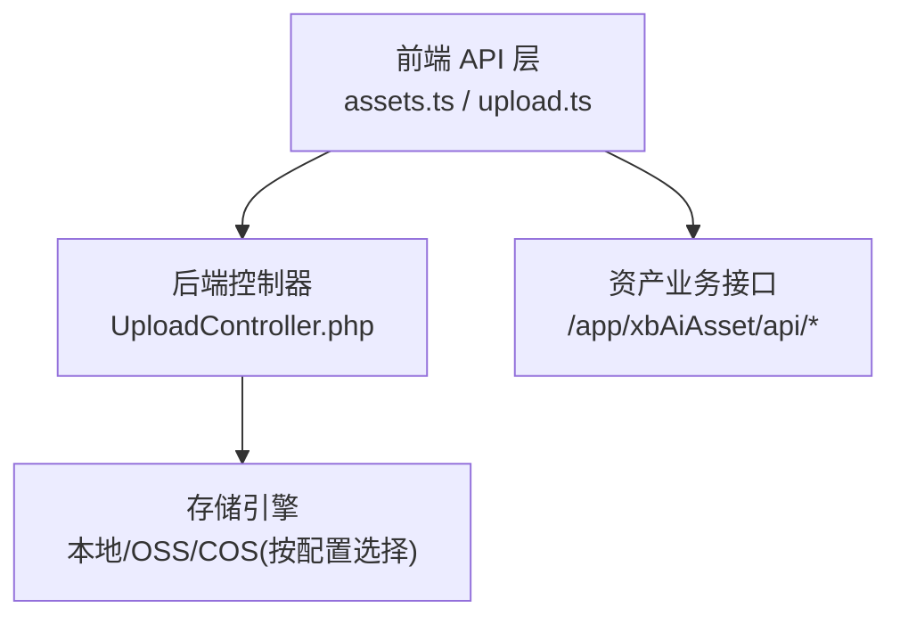
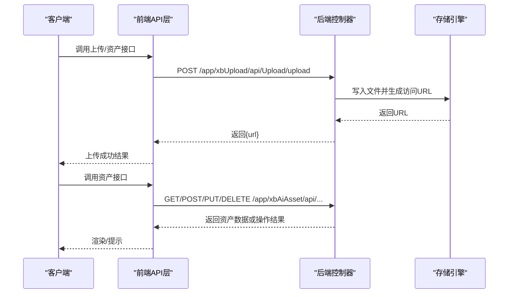
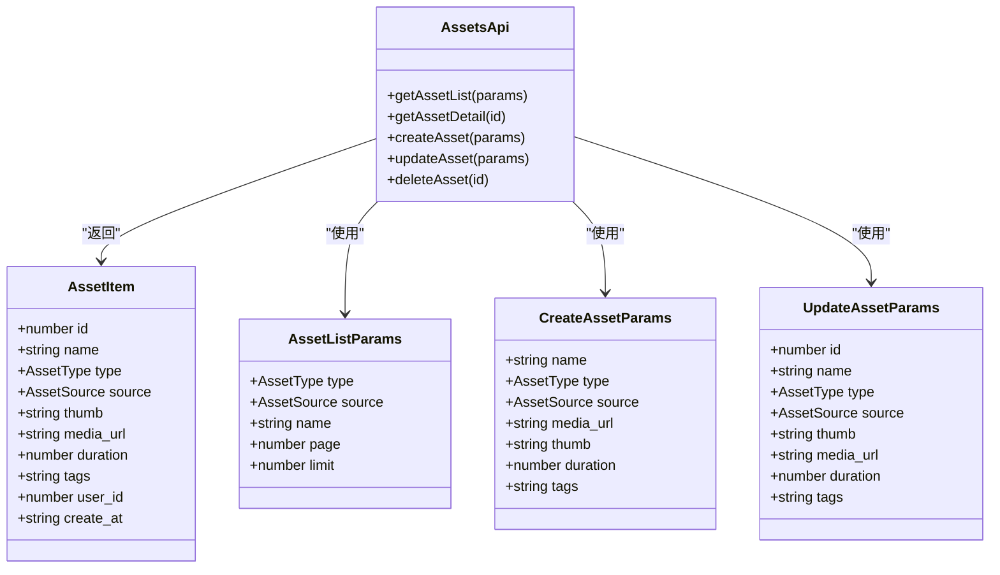
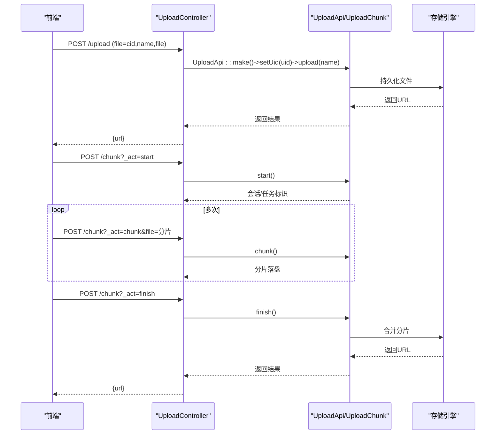
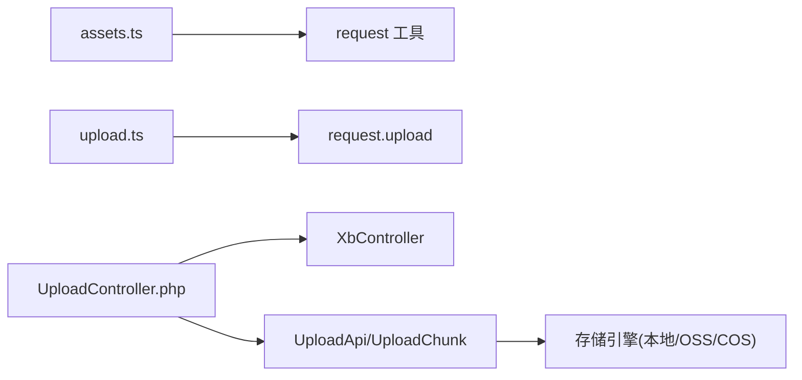

# 资产管理API

<cite>
**本文引用的文件**
- [frontend/src/api/assets.ts](file://frontend/src/api/assets.ts)
- [frontend/src/api/upload.ts](file://frontend/src/api/upload.ts)
- [server/plugin/xbUpload/app/api/controller/UploadController.php](file://server/plugin/xbUpload/app/api/controller/UploadController.php)
</cite>

## 目录
1. [简介](#简介)
2. [项目结构](#项目结构)
3. [核心组件](#核心组件)
4. [架构总览](#架构总览)
5. [详细组件分析](#详细组件分析)
6. [依赖分析](#依赖分析)
7. [性能考虑](#性能考虑)
8. [故障排查指南](#故障排查指南)
9. [结论](#结论)
10. [附录](#附录)

## 简介
本文件面向资产管理API的使用与集成，聚焦素材资源的完整生命周期管理：上传下载、分类标签、搜索筛选、版本控制等。文档同时说明前端调用方式与后端上传入口，并给出多存储引擎（本地、阿里云OSS、腾讯云COS）的接入思路与配置要点。为便于不同技术背景的读者理解，文档采用由浅入深的分层讲解，并提供可视化架构图与流程图。

## 项目结构
本项目在前后端分离的架构下提供资产管理能力：
- 前端通过统一的请求封装调用资产与上传接口
- 后端以插件化形式提供上传控制器与分片上传能力
- 资产数据模型在前端定义，用于类型约束与交互逻辑

图表来源
- [frontend/src/api/assets.ts](file://frontend/src/api/assets.ts)
- [frontend/src/api/upload.ts](file://frontend/src/api/upload.ts)
- [server/plugin/xbUpload/app/api/controller/UploadController.php](file://server/plugin/xbUpload/app/api/controller/UploadController.php)

章节来源
- [frontend/src/api/assets.ts](file://frontend/src/api/assets.ts)
- [frontend/src/api/upload.ts](file://frontend/src/api/upload.ts)
- [server/plugin/xbUpload/app/api/controller/UploadController.php](file://server/plugin/xbUpload/app/api/controller/UploadController.php)

## 核心组件
- 资产列表与详情
  - 获取资产列表：支持按类型、来源、名称分页查询
  - 获取资产详情：根据ID返回单条资产信息
- 资产CRUD
  - 创建资产：提交名称、类型、来源、媒体地址、封面、时长、标签等
  - 更新资产：可部分字段更新
  - 删除资产：按ID删除
- 文件上传
  - 普通上传：表单上传，返回访问URL
  - 分片上传：start/chunk/finish三段式流程，适合大文件

章节来源
- [frontend/src/api/assets.ts](file://frontend/src/api/assets.ts)
- [frontend/src/api/upload.ts](file://frontend/src/api/upload.ts)
- [server/plugin/xbUpload/app/api/controller/UploadController.php](file://server/plugin/xbUpload/app/api/controller/UploadController.php)

## 架构总览
资产管理API的整体调用链路如下：
- 前端发起HTTP请求到后端路由
- 资产类接口由xbAiAsset插件处理（当前仓库未包含该插件控制器源码，但前端已定义路由）
- 上传类接口由xbUpload插件的UploadController统一接收，内部委托给上传服务与具体存储引擎

图表来源
- [frontend/src/api/upload.ts](file://frontend/src/api/upload.ts)
- [frontend/src/api/assets.ts](file://frontend/src/api/assets.ts)
- [server/plugin/xbUpload/app/api/controller/UploadController.php](file://server/plugin/xbUpload/app/api/controller/UploadController.php)

## 详细组件分析

### 资产接口（前端定义）
- 资源模型
  - 资产项：包含id、name、type、source、thumb、media_url、duration、tags、user_id、create_at等字段
  - 列表参数：type、source、name、page、limit
  - 响应体：total、per_page、current_page、last_page、data
- 接口清单
  - 获取列表：GET /app/xbAiAsset/api/Asset/list
  - 获取详情：GET /app/xbAiAsset/api/Asset/detail?id=...
  - 创建资产：POST /app/xbAiAsset/api/Asset/create
  - 更新资产：PUT /app/xbAiAsset/api/Asset/update
  - 删除资产：DELETE /app/xbAiAsset/api/Asset/delete?id=...

图表来源
- [frontend/src/api/assets.ts](file://frontend/src/api/assets.ts)

章节来源
- [frontend/src/api/assets.ts](file://frontend/src/api/assets.ts)

### 文件上传接口（前端+后端）
- 前端上传API
  - 方法：upload(file, options)
  - 路径：/app/xbUpload/api/Upload/upload
  - 字段名：file
  - 可选回调：onProgress、abortController
- 后端上传控制器
  - 普通上传：POST /app/xbUpload/api/Upload/upload
    - 表单参数：cid（可选）、name（默认file）、file（必填）
    - 返回：统一成功响应，包含文件访问URL
  - 分片上传：POST /app/xbUpload/api/Upload/chunk
    - 参数_act：start、chunk、finish
    - 分片阶段：开始、上传分片、合并完成

图表来源
- [frontend/src/api/upload.ts](file://frontend/src/api/upload.ts)
- [server/plugin/xbUpload/app/api/controller/UploadController.php](file://server/plugin/xbUpload/app/api/controller/UploadController.php)

章节来源
- [frontend/src/api/upload.ts](file://frontend/src/api/upload.ts)
- [server/plugin/xbUpload/app/api/controller/UploadController.php](file://server/plugin/xbUpload/app/api/controller/UploadController.php)

### 多存储引擎支持与配置
- 支持的引擎
  - 本地存储：默认实现，适用于开发或小规模部署
  - 阿里云OSS：通过对应插件扩展接入
  - 腾讯云COS：通过对应插件扩展接入
- 接入方式
  - 安装并启用相应插件（如 xbUploadOss、xbUploadCos）
  - 在插件配置中设置密钥、Bucket、域名等必要参数
  - 系统根据全局或场景配置选择目标引擎
- 注意事项
  - 确保网络可达与权限正确
  - 合理设置CDN加速与缓存策略
  - 对敏感信息进行环境变量管理

章节来源
- [server/plugin/xbUpload/config/app.php](file://server/plugin/xbUpload/config/app.php)
- [server/plugin/xbUploadOss/config/app.php](file://server/plugin/xbUploadOss/config/app.php)
- [server/plugin/xbUploadCos/config/app.php](file://server/plugin/xbUploadCos/config/app.php)

### 资产元数据管理与索引优化
- 元数据建议
  - 基础字段：名称、类型、来源、媒体地址、封面、时长、标签、用户ID、时间戳
  - 扩展字段：分辨率、码率、格式、哈希校验值、版本标识
- 索引优化策略
  - 高频查询字段建立索引：type、source、user_id、create_at
  - 组合索引：type+source、user_id+create_at
  - 全文检索：对name、tags进行倒排索引或借助搜索引擎
  - 冷热分层：历史资产归档至低成本存储，热点数据保留高性能存储
  - 版本号与快照：通过version字段或独立版本表记录变更，支持回滚与对比

[本节为通用设计建议，不直接分析具体文件]

### 高级功能使用模式
- 批量上传
  - 前端循环调用上传接口，或使用分片上传提升稳定性
  - 结合进度回调与取消控制，提升用户体验
- 智能搜索
  - 基于类型、来源、关键词的组合筛选
  - 结合标签与名称模糊匹配，必要时引入搜索引擎
- 标签管理
  - 新增/编辑资产时附带tags
  - 提供标签聚合与热门标签统计接口（可扩展）

章节来源
- [frontend/src/api/assets.ts](file://frontend/src/api/assets.ts)
- [frontend/src/api/upload.ts](file://frontend/src/api/upload.ts)

## 依赖分析
- 前端依赖
  - assets.ts 依赖 request 工具进行HTTP调用
  - upload.ts 依赖 request.upload 进行文件上传
- 后端依赖
  - UploadController 依赖 XbController 基类与上传服务
  - 上传服务对接具体存储引擎（本地/OSS/COS）

图表来源
- [frontend/src/api/assets.ts](file://frontend/src/api/assets.ts)
- [frontend/src/api/upload.ts](file://frontend/src/api/upload.ts)
- [server/plugin/xbUpload/app/api/controller/UploadController.php](file://server/plugin/xbUpload/app/api/controller/UploadController.php)

章节来源
- [frontend/src/api/assets.ts](file://frontend/src/api/assets.ts)
- [frontend/src/api/upload.ts](file://frontend/src/api/upload.ts)
- [server/plugin/xbUpload/app/api/controller/UploadController.php](file://server/plugin/xbUpload/app/api/controller/UploadController.php)

## 性能考虑
- 上传优化
  - 大文件优先使用分片上传，降低失败重试成本
  - 并发上传需限制并发度，避免服务端过载
  - 启用断点续传与会话状态持久化
- 存储优化
  - 对象存储开启压缩与转码（图片/视频）
  - 使用CDN缓存静态资源，减少源站压力
- 查询优化
  - 合理使用分页与限流
  - 对高频条件建立合适索引
  - 复杂搜索下沉到搜索引擎

[本节为通用指导，不直接分析具体文件]

## 故障排查指南
- 上传失败
  - 检查请求方法与表单字段是否匹配
  - 确认用户身份与权限
  - 查看存储引擎配置与网络连通性
- 分片上传异常
  - 核对_act参数顺序：start→chunk→finish
  - 检查分片大小与总数一致性
  - 确认合并阶段能读取全部分片
- 资产接口错误
  - 校验必填字段与数据类型
  - 确认路由与插件是否启用
  - 查看日志定位具体错误堆栈

章节来源
- [server/plugin/xbUpload/app/api/controller/UploadController.php](file://server/plugin/xbUpload/app/api/controller/UploadController.php)

## 结论
资产管理API围绕“上传—存储—检索—管理”的主线构建，前端提供清晰的类型与接口封装，后端通过统一控制器与分片机制保障上传体验。通过插件化扩展，系统可灵活接入多种存储引擎，满足从本地到云端的多样化需求。配合合理的元数据设计与索引策略，可实现高效稳定的资产管理能力。

## 附录
- 常用接口速查
  - 上传：POST /app/xbUpload/api/Upload/upload
  - 分片：POST /app/xbUpload/api/Upload/chunk
  - 资产列表：GET /app/xbAiAsset/api/Asset/list
  - 资产详情：GET /app/xbAiAsset/api/Asset/detail
  - 创建资产：POST /app/xbAiAsset/api/Asset/create
  - 更新资产：PUT /app/xbAiAsset/api/Asset/update
  - 删除资产：DELETE /app/xbAiAsset/api/Asset/delete

章节来源
- [frontend/src/api/assets.ts](file://frontend/src/api/assets.ts)
- [frontend/src/api/upload.ts](file://frontend/src/api/upload.ts)
- [server/plugin/xbUpload/app/api/controller/UploadController.php](file://server/plugin/xbUpload/app/api/controller/UploadController.php)