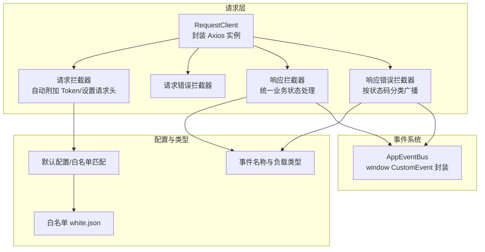
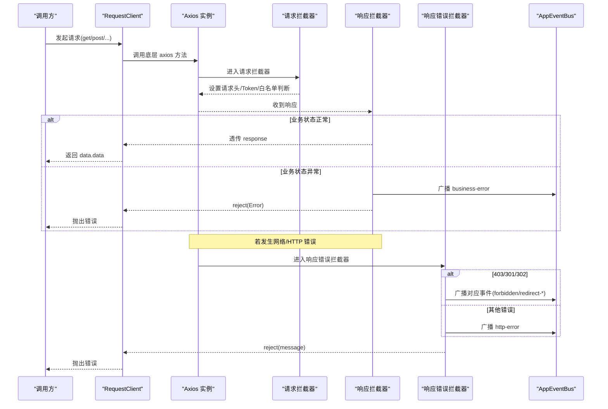
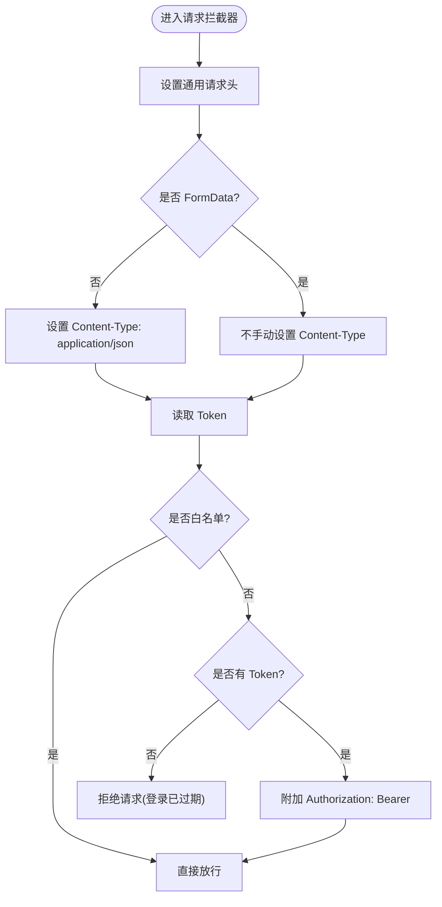
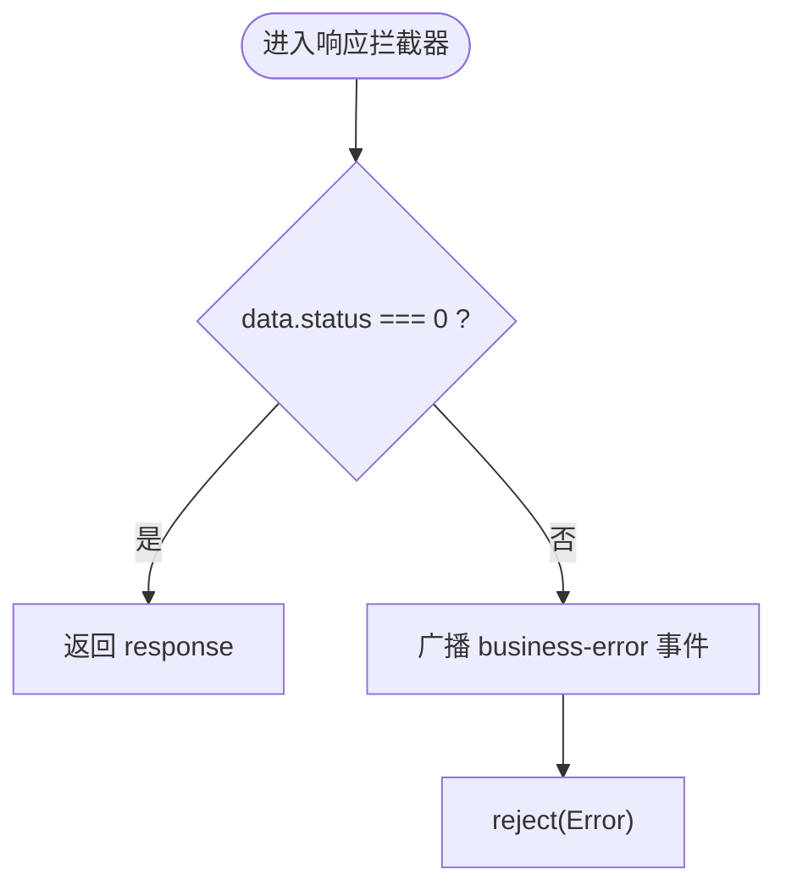
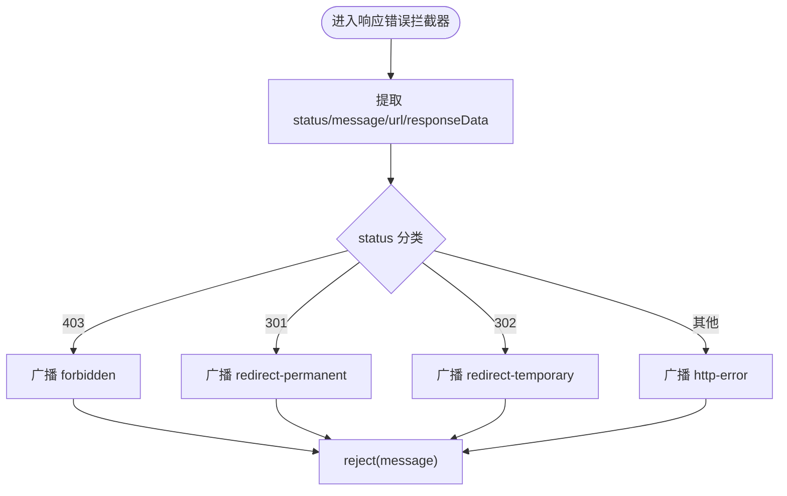
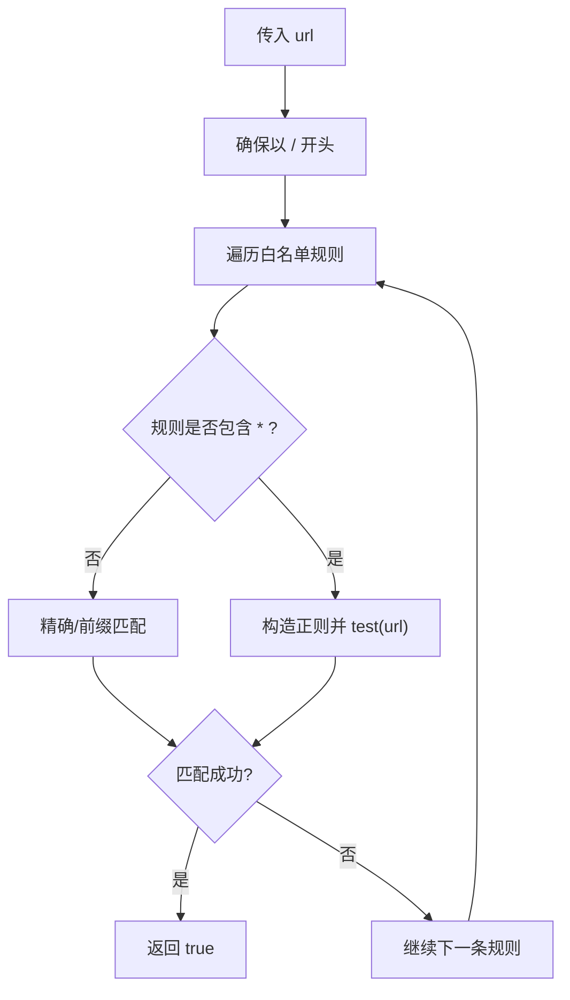
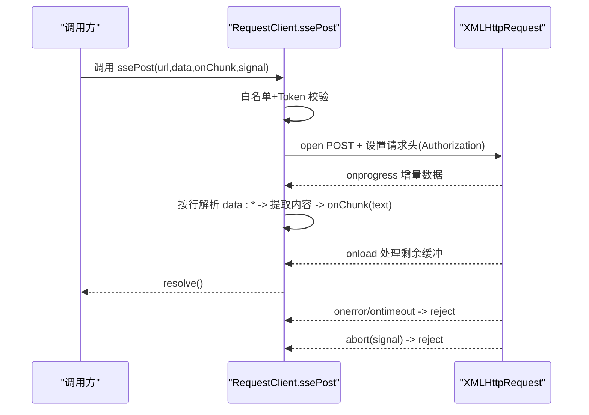
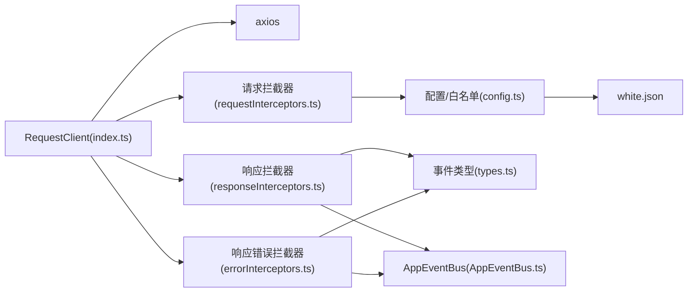

# 拦截器机制

<cite>
**本文引用的文件**
- [index.ts](file://frontend/src/utils/request/index.ts)
- [config.ts](file://frontend/src/utils/request/config.ts)
- [requestInterceptors.ts](file://frontend/src/utils/request/requestInterceptors.ts)
- [responseInterceptors.ts](file://frontend/src/utils/request/responseInterceptors.ts)
- [errorInterceptors.ts](file://frontend/src/utils/request/errorInterceptors.ts)
- [types.ts](file://frontend/src/utils/request/types.ts)
- [white.json](file://frontend/src/utils/request/white.json)
- [AppEventBus.ts](file://frontend/src/events/AppEventBus.ts)
</cite>

## 目录
1. [简介](#简介)
2. [项目结构](#项目结构)
3. [核心组件](#核心组件)
4. [架构总览](#架构总览)
5. [详细组件分析](#详细组件分析)
6. [依赖关系分析](#依赖关系分析)
7. [性能与稳定性](#性能与稳定性)
8. [故障排查指南](#故障排查指南)
9. [结论](#结论)
10. [附录：自定义拦截器开发指南](#附录自定义拦截器开发指南)

## 简介
本文件系统性梳理前端请求拦截器与响应拦截器的实现原理与使用方式，覆盖以下关键能力：
- Token 自动附加与白名单免鉴权
- 请求头统一设置（JSON、FormData 兼容）
- 响应数据统一处理与业务状态码检查
- HTTP 错误分类与事件广播
- 执行顺序、错误处理流程与调试技巧
- 自定义拦截器扩展方法与最佳实践
- 结合业务场景的使用模式（含 SSE 流式请求）

## 项目结构
拦截器相关代码集中在 utils/request 目录下，配合全局事件总线 AppEventBus 完成跨模块通信。

图示来源
- [index.ts:32-58](file://frontend/src/utils/request/index.ts#L32-L58)
- [requestInterceptors.ts:12-39](file://frontend/src/utils/request/requestInterceptors.ts#L12-L39)
- [responseInterceptors.ts:10-23](file://frontend/src/utils/request/responseInterceptors.ts#L10-L23)
- [errorInterceptors.ts:10-56](file://frontend/src/utils/request/errorInterceptors.ts#L10-L56)
- [config.ts:7-38](file://frontend/src/utils/request/config.ts#L7-L38)
- [types.ts:1-40](file://frontend/src/utils/request/types.ts#L1-L40)
- [white.json:1-28](file://frontend/src/utils/request/white.json#L1-L28)
- [AppEventBus.ts:30-109](file://frontend/src/events/AppEventBus.ts#L30-L109)

章节来源
- [index.ts:32-58](file://frontend/src/utils/request/index.ts#L32-L58)
- [config.ts:7-38](file://frontend/src/utils/request/config.ts#L7-L38)
- [requestInterceptors.ts:12-39](file://frontend/src/utils/request/requestInterceptors.ts#L12-L39)
- [responseInterceptors.ts:10-23](file://frontend/src/utils/request/responseInterceptors.ts#L10-L23)
- [errorInterceptors.ts:10-56](file://frontend/src/utils/request/errorInterceptors.ts#L10-L56)
- [types.ts:1-40](file://frontend/src/utils/request/types.ts#L1-L40)
- [white.json:1-28](file://frontend/src/utils/request/white.json#L1-L28)
- [AppEventBus.ts:30-109](file://frontend/src/events/AppEventBus.ts#L30-L109)

## 核心组件
- RequestClient：基于 Axios 的客户端封装，负责创建实例、注册拦截器、提供 get/post/put/delete/upload/ssePost 等方法。
- 请求拦截器：为每次请求设置通用请求头；根据白名单决定是否跳过鉴权；非白名单且无 Token 时拒绝请求并附加 Authorization。
- 响应拦截器：对后端返回的业务状态进行统一校验，非成功态则触发“业务错误”事件并拒绝 Promise。
- 响应错误拦截器：捕获网络/HTTP 错误，按状态码分类广播事件（如 403、301、302），最终拒绝 Promise。
- 配置与白名单：集中管理 baseURL、超时等默认配置；通过 white.json 维护免鉴权接口列表，支持精确与通配符匹配。
- 事件系统：AppEventBus 将请求生命周期中的异常以 window CustomEvent 形式广播，供任意模块监听处理。

章节来源
- [index.ts:32-58](file://frontend/src/utils/request/index.ts#L32-L58)
- [requestInterceptors.ts:12-39](file://frontend/src/utils/request/requestInterceptors.ts#L12-L39)
- [responseInterceptors.ts:10-23](file://frontend/src/utils/request/responseInterceptors.ts#L10-L23)
- [errorInterceptors.ts:10-56](file://frontend/src/utils/request/errorInterceptors.ts#L10-L56)
- [config.ts:7-38](file://frontend/src/utils/request/config.ts#L7-L38)
- [types.ts:1-40](file://frontend/src/utils/request/types.ts#L1-L40)
- [AppEventBus.ts:30-109](file://frontend/src/events/AppEventBus.ts#L30-L109)

## 架构总览
下图展示一次典型请求从发起、拦截到响应的完整链路，以及错误分支的事件广播路径。

图示来源
- [index.ts:46-58](file://frontend/src/utils/request/index.ts#L46-L58)
- [requestInterceptors.ts:12-39](file://frontend/src/utils/request/requestInterceptors.ts#L12-L39)
- [responseInterceptors.ts:10-23](file://frontend/src/utils/request/responseInterceptors.ts#L10-L23)
- [errorInterceptors.ts:10-56](file://frontend/src/utils/request/errorInterceptors.ts#L10-L56)
- [AppEventBus.ts:30-109](file://frontend/src/events/AppEventBus.ts#L30-L109)

## 详细组件分析

### 请求拦截器（自动附加 Token、请求头设置、白名单）
- 功能要点
  - 统一设置 accept、X-Requested-With 等请求头。
  - 非 FormData 请求设置 Content-Type 为 application/json；FormData 交由浏览器自动生成 boundary。
  - 白名单接口直接放行；非白名单接口若无 Token 则拒绝请求。
  - 有 Token 时在 Authorization 头附加 Bearer 前缀。
- 白名单匹配策略
  - 支持精确匹配与带参数的 URL 前缀匹配。
  - 支持通配符 *，内部转换为正则表达式进行匹配。
- 执行时机
  - 在 Axios 发送请求之前执行，可在此处修改 config.headers、config.url 等。

图示来源
- [requestInterceptors.ts:12-39](file://frontend/src/utils/request/requestInterceptors.ts#L12-L39)
- [config.ts:22-38](file://frontend/src/utils/request/config.ts#L22-L38)

章节来源
- [requestInterceptors.ts:12-39](file://frontend/src/utils/request/requestInterceptors.ts#L12-L39)
- [config.ts:22-38](file://frontend/src/utils/request/config.ts#L22-L38)

### 响应拦截器（统一业务状态处理）
- 功能要点
  - 当后端返回的业务状态码非成功态时，触发“业务错误”事件并拒绝 Promise。
  - 成功态直接透传 response，由上层按需取 data.data。
- 事件广播
  - 通过 AppEventBus 广播 request:business-error，携带 message、status、url、response 等上下文。

图示来源
- [responseInterceptors.ts:10-23](file://frontend/src/utils/request/responseInterceptors.ts#L10-L23)
- [types.ts:1-40](file://frontend/src/utils/request/types.ts#L1-L40)
- [AppEventBus.ts:30-109](file://frontend/src/events/AppEventBus.ts#L30-L109)

章节来源
- [responseInterceptors.ts:10-23](file://frontend/src/utils/request/responseInterceptors.ts#L10-L23)
- [types.ts:1-40](file://frontend/src/utils/request/types.ts#L1-L40)
- [AppEventBus.ts:30-109](file://frontend/src/events/AppEventBus.ts#L30-L109)

### 响应错误拦截器（HTTP 错误分类与事件广播）
- 功能要点
  - 捕获网络/HTTP 错误，提取 status、message、responseData、url。
  - 针对 403、301、302 分别广播专用事件；其他错误广播 http-error。
  - 最终统一 reject(message)，便于上层统一处理。
- 事件映射
  - forbidden、redirect-permanent、redirect-temporary、http-error 等事件名来自 types.ts 的常量定义。

图示来源
- [errorInterceptors.ts:10-56](file://frontend/src/utils/request/errorInterceptors.ts#L10-L56)
- [types.ts:1-40](file://frontend/src/utils/request/types.ts#L1-L40)
- [AppEventBus.ts:30-109](file://frontend/src/events/AppEventBus.ts#L30-L109)

章节来源
- [errorInterceptors.ts:10-56](file://frontend/src/utils/request/errorInterceptors.ts#L10-L56)
- [types.ts:1-40](file://frontend/src/utils/request/types.ts#L1-L40)
- [AppEventBus.ts:30-109](file://frontend/src/events/AppEventBus.ts#L30-L109)

### 白名单机制（white.json 与 isWhitelisted）
- 数据来源
  - white.json 列出免鉴权接口路径，支持带参数的前缀匹配与通配符。
- 匹配逻辑
  - 自动补全前导斜杠。
  - 非通配符：精确匹配或前缀匹配（包含查询串）。
  - 通配符：将 * 替换为 .* 构建正则进行匹配。
- 使用位置
  - 请求拦截器中用于决定是否跳过 Token 校验。
  - ssePost 中同样复用该逻辑进行前置鉴权判断。

图示来源
- [config.ts:22-38](file://frontend/src/utils/request/config.ts#L22-L38)
- [white.json:1-28](file://frontend/src/utils/request/white.json#L1-L28)

章节来源
- [config.ts:22-38](file://frontend/src/utils/request/config.ts#L22-L38)
- [white.json:1-28](file://frontend/src/utils/request/white.json#L1-L28)

### SSE 流式请求（ssePost）
- 设计动机
  - 与 Axios 共享同一网络层，避免 CORS 问题；逐块回调文本片段。
- 鉴权与白名单
  - 非白名单接口必须携带 Token，否则直接拒绝。
- 解析策略
  - 基于 XMLHttpRequest 接收 text/event-stream，按行拆分，识别 data: 字段。
  - 兼容多种 JSON 结构，提取 content/text 字段；遇到 [DONE] 结束。
- 取消与超时
  - 支持 AbortSignal 取消；onerror/ontimeout 统一 reject。

图示来源
- [index.ts:132-227](file://frontend/src/utils/request/index.ts#L132-L227)
- [config.ts:22-38](file://frontend/src/utils/request/config.ts#L22-L38)

章节来源
- [index.ts:132-227](file://frontend/src/utils/request/index.ts#L132-L227)
- [config.ts:22-38](file://frontend/src/utils/request/config.ts#L22-L38)

## 依赖关系分析
- RequestClient 依赖 Axios 实例，并在构造函数中注册请求与响应拦截器。
- 请求拦截器依赖白名单匹配函数 isWhitelisted。
- 响应与错误拦截器依赖事件类型定义与 AppEventBus。
- 白名单数据来源于 white.json，被 config.ts 加载。

图示来源
- [index.ts:32-58](file://frontend/src/utils/request/index.ts#L32-L58)
- [requestInterceptors.ts:12-39](file://frontend/src/utils/request/requestInterceptors.ts#L12-L39)
- [responseInterceptors.ts:10-23](file://frontend/src/utils/request/responseInterceptors.ts#L10-L23)
- [errorInterceptors.ts:10-56](file://frontend/src/utils/request/errorInterceptors.ts#L10-L56)
- [config.ts:7-38](file://frontend/src/utils/request/config.ts#L7-L38)
- [types.ts:1-40](file://frontend/src/utils/request/types.ts#L1-L40)
- [white.json:1-28](file://frontend/src/utils/request/white.json#L1-L28)
- [AppEventBus.ts:30-109](file://frontend/src/events/AppEventBus.ts#L30-L109)

章节来源
- [index.ts:32-58](file://frontend/src/utils/request/index.ts#L32-L58)
- [config.ts:7-38](file://frontend/src/utils/request/config.ts#L7-L38)
- [types.ts:1-40](file://frontend/src/utils/request/types.ts#L1-L40)
- [AppEventBus.ts:30-109](file://frontend/src/events/AppEventBus.ts#L30-L109)

## 性能与稳定性
- 请求头设置
  - 仅在非 FormData 情况下设置 Content-Type，避免重复计算与潜在冲突。
- 白名单匹配
  - 通配符匹配会生成正则，建议合理控制白名单规模与复杂度，必要时缓存结果。
- 上传与 SSE
  - 上传接口关闭超时，避免大文件中断；SSE 采用增量解析，减少内存占用。
- 事件广播
  - 使用 window CustomEvent，开销较低；注意监听器数量，避免过多 handler 影响性能。

[本节为通用指导，无需源码引用]

## 故障排查指南
- 常见问题定位
  - 未登录访问受保护接口：检查白名单是否正确、Token 是否存在、请求拦截器是否拒绝。
  - 业务错误：查看响应拦截器广播的 business-error 事件，确认后端返回的 status 与 msg。
  - 权限不足/重定向：关注 forbidden、redirect-permanent、redirect-temporary 事件，定位服务端返回的状态码与 Location 头。
  - 网络异常/超时：监听 http-error 事件，检查 baseURL、代理配置与网络连通性。
- 调试技巧
  - 在请求拦截器内打印 config.headers 与 url，确认是否命中白名单与是否附加了 Authorization。
  - 在响应拦截器与错误拦截器内打印 response 与 error 对象，核对 status 与 data 结构。
  - 使用 AppEventBus 的全局监听，集中输出所有请求异常事件，便于快速定位问题。
- 事件订阅示例思路
  - 在应用启动时订阅 request:http-error、request:forbidden 等事件，统一弹出提示或跳转登录页。

章节来源
- [requestInterceptors.ts:12-39](file://frontend/src/utils/request/requestInterceptors.ts#L12-L39)
- [responseInterceptors.ts:10-23](file://frontend/src/utils/request/responseInterceptors.ts#L10-L23)
- [errorInterceptors.ts:10-56](file://frontend/src/utils/request/errorInterceptors.ts#L10-L56)
- [types.ts:1-40](file://frontend/src/utils/request/types.ts#L1-L40)
- [AppEventBus.ts:30-109](file://frontend/src/events/AppEventBus.ts#L30-L109)

## 结论
该拦截器体系以 RequestClient 为中心，围绕 Axios 的请求/响应生命周期，实现了统一的鉴权、请求头设置、业务状态校验与错误分类广播。借助白名单机制与 AppEventBus，既能满足免鉴权接口的便捷访问，又能保证受保护接口的安全性与可观测性。整体结构清晰、职责单一，易于扩展与维护。

[本节为总结性内容，无需源码引用]

## 附录：自定义拦截器开发指南

### 扩展点与执行顺序
- 扩展点
  - 请求拦截器：在发送前修改请求配置（headers、params、url 等）。
  - 请求错误拦截器：在网络层错误发生时进行处理（如重试、降级）。
  - 响应拦截器：在收到响应后统一处理业务状态、转换数据结构。
  - 响应错误拦截器：在 HTTP 错误发生时进行分类与广播。
- 执行顺序
  - 请求阶段：请求拦截器 → 实际请求 → 响应拦截器 → 响应错误拦截器。
  - 错误分支：任一阶段抛错都会进入对应的错误拦截器。

章节来源
- [index.ts:46-58](file://frontend/src/utils/request/index.ts#L46-L58)

### 如何添加自定义请求拦截器
- 步骤
  - 新建一个函数，签名与现有请求拦截器一致，接受 InternalAxiosRequestConfig 并返回配置或 Promise.reject。
  - 在 RequestClient.setupInterceptors 中追加 this.instance.interceptors.request.use(...)。
- 注意事项
  - 保持与白名单逻辑一致，避免重复鉴权。
  - 谨慎修改 Content-Type，尤其是上传场景。

章节来源
- [index.ts:46-58](file://frontend/src/utils/request/index.ts#L46-L58)
- [requestInterceptors.ts:12-39](file://frontend/src/utils/request/requestInterceptors.ts#L12-L39)

### 如何添加自定义响应拦截器
- 步骤
  - 新建一个函数，签名与现有响应拦截器一致，接受 AxiosResponse 并返回 response 或 Promise.reject。
  - 在 setupInterceptors 中追加 this.instance.interceptors.response.use(...)。
- 注意事项
  - 如需变更业务状态码判定条件，请同步更新事件广播与上层消费逻辑。

章节来源
- [index.ts:46-58](file://frontend/src/utils/request/index.ts#L46-L58)
- [responseInterceptors.ts:10-23](file://frontend/src/utils/request/responseInterceptors.ts#L10-L23)

### 如何添加自定义响应错误拦截器
- 步骤
  - 新建一个函数，签名与现有响应错误拦截器一致，接受 AxiosError 并进行分类处理。
  - 在 setupInterceptors 中追加 this.instance.interceptors.response.use(..., customErrorInterceptor)。
- 注意事项
  - 新增错误类型需同步在 types.ts 中补充事件名与负载类型，并在 AppEventBus 中提供快捷方法（可选）。

章节来源
- [index.ts:46-58](file://frontend/src/utils/request/index.ts#L46-L58)
- [errorInterceptors.ts:10-56](file://frontend/src/utils/request/errorInterceptors.ts#L10-L56)
- [types.ts:1-40](file://frontend/src/utils/request/types.ts#L1-L40)

### 白名单扩展
- 在 white.json 中添加新路径，支持精确与前缀匹配，必要时使用通配符。
- 若匹配规则复杂，可在 config.ts 中优化 isWhitelisted 的实现（例如引入更高效的匹配算法或缓存）。

章节来源
- [white.json:1-28](file://frontend/src/utils/request/white.json#L1-L28)
- [config.ts:22-38](file://frontend/src/utils/request/config.ts#L22-L38)

### 结合业务场景的使用模式
- 登录态失效处理
  - 监听 forbidden/unauthorized 事件，弹出登录弹窗或跳转登录页，成功后重新发起失败请求。
- 全局错误提示
  - 监听 http-error/business-error，统一弹出消息提示，提升用户体验。
- 上传进度与取消
  - 使用 upload 方法的 onProgress 与 abortController 实现进度条与中止上传。
- 流式对话
  - 使用 ssePost 接收服务端推送，逐步渲染内容，直至收到 [DONE]。

章节来源
- [index.ts:82-121](file://frontend/src/utils/request/index.ts#L82-L121)
- [index.ts:132-227](file://frontend/src/utils/request/index.ts#L132-L227)
- [types.ts:1-40](file://frontend/src/utils/request/types.ts#L1-L40)
- [AppEventBus.ts:30-109](file://frontend/src/events/AppEventBus.ts#L30-L109)