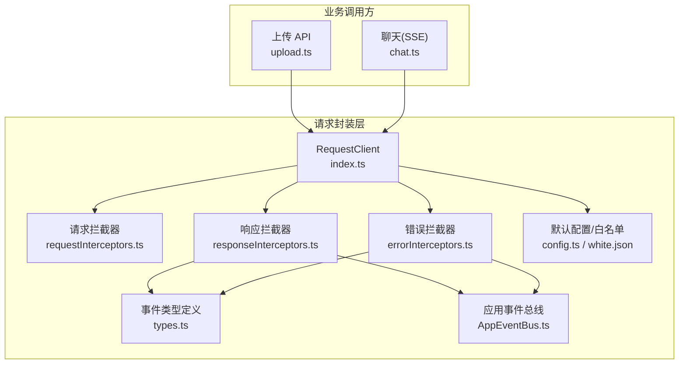
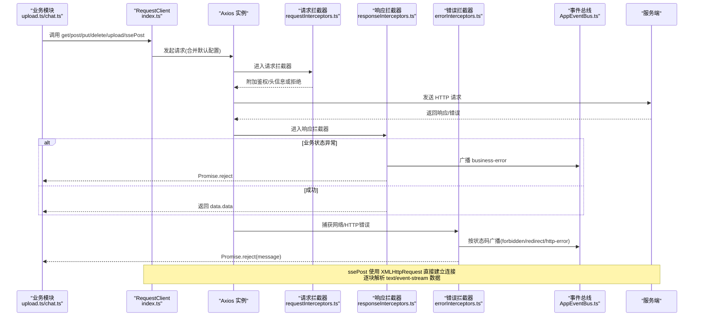
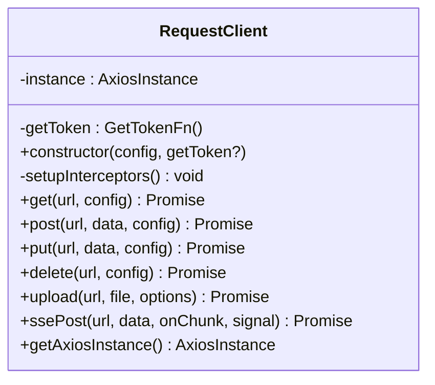
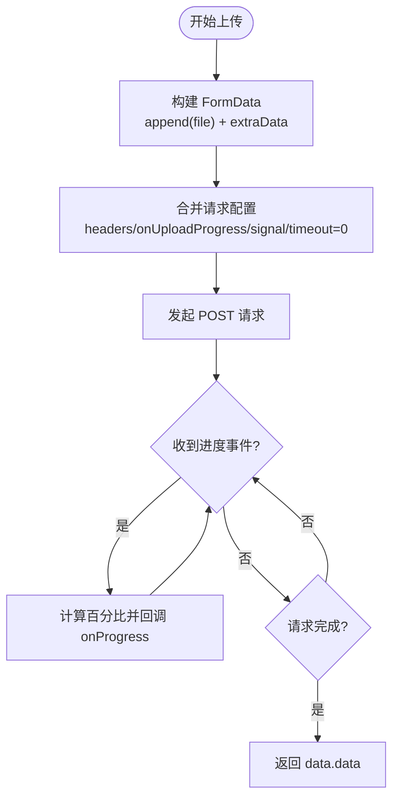
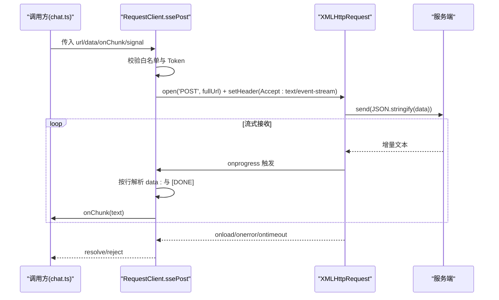
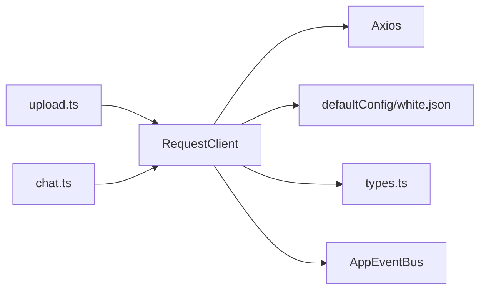

# 请求核心封装

<cite>
**本文引用的文件**   
- [frontend/src/utils/request/index.ts](file://frontend/src/utils/request/index.ts)
- [frontend/src/utils/request/config.ts](file://frontend/src/utils/request/config.ts)
- [frontend/src/utils/request/types.ts](file://frontend/src/utils/request/types.ts)
- [frontend/src/utils/request/requestInterceptors.ts](file://frontend/src/utils/request/requestInterceptors.ts)
- [frontend/src/utils/request/responseInterceptors.ts](file://frontend/src/utils/request/responseInterceptors.ts)
- [frontend/src/utils/request/errorInterceptors.ts](file://frontend/src/utils/request/errorInterceptors.ts)
- [frontend/src/utils/request/white.json](file://frontend/src/utils/request/white.json)
- [frontend/src/api/upload.ts](file://frontend/src/api/upload.ts)
- [frontend/src/api/chat.ts](file://frontend/src/api/chat.ts)
- [frontend/src/events/AppEventBus.ts](file://frontend/src/events/AppEventBus.ts)
</cite>

## 目录
1. [简介](#简介)
2. [项目结构](#项目结构)
3. [核心组件](#核心组件)
4. [架构总览](#架构总览)
5. [详细组件分析](#详细组件分析)
6. [依赖关系分析](#依赖关系分析)
7. [性能与稳定性](#性能与稳定性)
8. [故障排查指南](#故障排查指南)
9. [结论](#结论)
10. [附录：API 使用示例与最佳实践](#附录api-使用示例与最佳实践)

## 简介
本文件围绕前端请求核心封装进行系统化说明，重点解析 RequestClient 类的实现原理与使用方式。内容涵盖 Axios 实例配置、基础 URL 设置、超时处理、通用请求方法封装（GET/POST/PUT/DELETE）、文件上传（FormData、进度回调、字段映射、取消控制），以及 SSE 流式请求（基于 XMLHttpRequest 的事件流解析）。同时提供完整的 API 使用示例与最佳实践建议，帮助读者快速上手并稳定集成到业务中。

## 项目结构
请求相关代码集中在 utils/request 目录下，采用“单一入口 + 拦截器拆分 + 类型/配置分离”的组织方式：
- index.ts：导出 RequestClient 类与默认实例 request，包含所有对外能力（HTTP 方法与 SSE）
- config.ts：默认 Axios 配置与环境变量注入，白名单加载与匹配逻辑
- types.ts：请求事件常量与事件负载类型定义
- requestInterceptors.ts：请求拦截器（自动附加 Token、Content-Type 等）
- responseInterceptors.ts：响应拦截器（统一业务错误处理与事件广播）
- errorInterceptors.ts：网络/HTTP 错误拦截器（按状态码分类广播事件）
- white.json：无需鉴权的接口路径列表

图表来源
- [frontend/src/utils/request/index.ts:32-233](file://frontend/src/utils/request/index.ts#L32-L233)
- [frontend/src/utils/request/config.ts:1-39](file://frontend/src/utils/request/config.ts#L1-L39)
- [frontend/src/utils/request/types.ts:1-40](file://frontend/src/utils/request/types.ts#L1-L40)
- [frontend/src/utils/request/requestInterceptors.ts:1-47](file://frontend/src/utils/request/requestInterceptors.ts#L1-L47)
- [frontend/src/utils/request/responseInterceptors.ts:1-24](file://frontend/src/utils/request/responseInterceptors.ts#L1-L24)
- [frontend/src/utils/request/errorInterceptors.ts:1-57](file://frontend/src/utils/request/errorInterceptors.ts#L1-L57)
- [frontend/src/events/AppEventBus.ts:1-109](file://frontend/src/events/AppEventBus.ts#L1-L109)
- [frontend/src/api/upload.ts:1-24](file://frontend/src/api/upload.ts#L1-L24)
- [frontend/src/api/chat.ts:1-60](file://frontend/src/api/chat.ts#L1-L60)

章节来源
- [frontend/src/utils/request/index.ts:1-237](file://frontend/src/utils/request/index.ts#L1-L237)
- [frontend/src/utils/request/config.ts:1-39](file://frontend/src/utils/request/config.ts#L1-L39)
- [frontend/src/utils/request/types.ts:1-40](file://frontend/src/utils/request/types.ts#L1-L40)
- [frontend/src/utils/request/requestInterceptors.ts:1-47](file://frontend/src/utils/request/requestInterceptors.ts#L1-L47)
- [frontend/src/utils/request/responseInterceptors.ts:1-24](file://frontend/src/utils/request/responseInterceptors.ts#L1-L24)
- [frontend/src/utils/request/errorInterceptors.ts:1-57](file://frontend/src/utils/request/errorInterceptors.ts#L1-L57)
- [frontend/src/utils/request/white.json:1-28](file://frontend/src/utils/request/white.json#L1-L28)
- [frontend/src/api/upload.ts:1-24](file://frontend/src/api/upload.ts#L1-L24)
- [frontend/src/api/chat.ts:1-60](file://frontend/src/api/chat.ts#L1-L60)
- [frontend/src/events/AppEventBus.ts:1-109](file://frontend/src/events/AppEventBus.ts#L1-L109)

## 核心组件
- RequestClient：统一的 HTTP 客户端封装，提供 get/post/put/delete、upload、ssePost 等方法；内部维护一个 Axios 实例，并通过拦截器完成鉴权、错误处理与事件广播。
- 默认配置与白名单：从环境变量注入 baseURL，设置全局 timeout；白名单用于免登录访问的接口路径匹配。
- 拦截器体系：
  - 请求拦截器：自动设置 accept、X-Requested-With、Content-Type（非 FormData），并按白名单决定是否携带 Authorization。
  - 响应拦截器：对业务状态码进行统一判断，失败时通过事件总线广播业务错误。
  - 错误拦截器：针对 HTTP 状态码（如 403、301、302）进行分类广播，其他错误归为 http-error。
- 事件系统：通过 AppEventBus 将请求生命周期中的关键事件以 window CustomEvent 形式广播，便于全局监听与处理。

章节来源
- [frontend/src/utils/request/index.ts:32-233](file://frontend/src/utils/request/index.ts#L32-L233)
- [frontend/src/utils/request/config.ts:1-39](file://frontend/src/utils/request/config.ts#L1-L39)
- [frontend/src/utils/request/requestInterceptors.ts:1-47](file://frontend/src/utils/request/requestInterceptors.ts#L1-L47)
- [frontend/src/utils/request/responseInterceptors.ts:1-24](file://frontend/src/utils/request/responseInterceptors.ts#L1-L24)
- [frontend/src/utils/request/errorInterceptors.ts:1-57](file://frontend/src/utils/request/errorInterceptors.ts#L1-L57)
- [frontend/src/events/AppEventBus.ts:1-109](file://frontend/src/events/AppEventBus.ts#L1-L109)

## 架构总览
下图展示了请求从业务调用到服务端返回的完整链路，包括拦截器、事件总线与 SSE 流式处理的交互。

图表来源
- [frontend/src/utils/request/index.ts:32-233](file://frontend/src/utils/request/index.ts#L32-L233)
- [frontend/src/utils/request/requestInterceptors.ts:1-47](file://frontend/src/utils/request/requestInterceptors.ts#L1-L47)
- [frontend/src/utils/request/responseInterceptors.ts:1-24](file://frontend/src/utils/request/responseInterceptors.ts#L1-L24)
- [frontend/src/utils/request/errorInterceptors.ts:1-57](file://frontend/src/utils/request/errorInterceptors.ts#L1-L57)
- [frontend/src/events/AppEventBus.ts:1-109](file://frontend/src/events/AppEventBus.ts#L1-L109)
- [frontend/src/api/upload.ts:1-24](file://frontend/src/api/upload.ts#L1-L24)
- [frontend/src/api/chat.ts:1-60](file://frontend/src/api/chat.ts#L1-L60)

## 详细组件分析

### RequestClient 类
- 构造与初始化
  - 合并 defaultConfig 与传入配置创建 Axios 实例
  - 设置 getToken 函数（默认读取 localStorage 中的 token）
  - 注册请求与响应拦截器
- 通用 HTTP 方法
  - get/post/put/delete：统一包装 Axios 对应方法，并解包 ApiResponse 的 data.data 作为返回值
- 文件上传 upload
  - 构建 FormData，支持自定义字段名 fieldName 与额外字段 extraData
  - 支持 onProgress 进度回调（percent 范围 0~100）
  - 支持 headers 覆盖与 abortController 取消控制
  - 上传场景关闭超时（timeout: 0）
- SSE 流式请求 ssePost
  - 使用 XMLHttpRequest 建立 POST 连接，Accept 设置为 text/event-stream
  - 在 onprogress 中增量读取 responseText，按换行分割，过滤空行与注释行，解析 data: 前缀的消息体
  - 兼容多种 JSON 结构提取文本片段（choices.delta.content/message.content/content/text）
  - 遇到 [DONE] 标记则结束并 resolve
  - 支持 AbortSignal 取消，并在 onload/onerror/ontimeout 中做收尾与错误处理

图表来源
- [frontend/src/utils/request/index.ts:32-233](file://frontend/src/utils/request/index.ts#L32-L233)

章节来源
- [frontend/src/utils/request/index.ts:32-233](file://frontend/src/utils/request/index.ts#L32-L233)

### 默认配置与白名单
- baseURL：优先使用环境变量 VITE_API_BASE_URL，否则回退到 /proxy
- timeout：默认 30000ms
- 白名单加载：从 white.json 动态加载，isWhitelisted 支持精确匹配与通配符匹配（* 转正则）
- 作用：非白名单接口必须携带有效 Token，白名单接口可匿名访问

章节来源
- [frontend/src/utils/request/config.ts:1-39](file://frontend/src/utils/request/config.ts#L1-L39)
- [frontend/src/utils/request/white.json:1-28](file://frontend/src/utils/request/white.json#L1-L28)

### 请求拦截器
- 固定头部：accept=application/json、X-Requested-With=XMLHttpRequest
- Content-Type：当 data 不是 FormData 时设置为 application/json；FormData 交由浏览器自动生成 boundary
- 鉴权策略：根据 isWhitelisted 判断是否跳过 Token；否则若无 Token 则拒绝请求并提示重新登录

章节来源
- [frontend/src/utils/request/requestInterceptors.ts:1-47](file://frontend/src/utils/request/requestInterceptors.ts#L1-L47)
- [frontend/src/utils/request/config.ts:1-39](file://frontend/src/utils/request/config.ts#L1-L39)

### 响应拦截器与错误拦截器
- 响应拦截器：若后端返回的业务状态码非 0，则通过事件总线广播 business-error，并 reject
- 错误拦截器：根据 HTTP 状态码分类广播 forbidden、redirect-permanent、redirect-temporary、http-error，并附带 message、status、url、response 等上下文

章节来源
- [frontend/src/utils/request/responseInterceptors.ts:1-24](file://frontend/src/utils/request/responseInterceptors.ts#L1-L24)
- [frontend/src/utils/request/errorInterceptors.ts:1-57](file://frontend/src/utils/request/errorInterceptors.ts#L1-L57)
- [frontend/src/utils/request/types.ts:1-40](file://frontend/src/utils/request/types.ts#L1-L40)
- [frontend/src/events/AppEventBus.ts:1-109](file://frontend/src/events/AppEventBus.ts#L1-L109)

### 上传功能详解
- FormData 构建：默认字段名为 file，可通过 fieldName 自定义；extraData 支持追加任意键值对
- 进度回调：onUploadProgress 计算 percent 并回调 onProgress(percent, event)
- 取消控制：通过 AbortController.signal 传递至底层请求，可在用户操作或页面切换时中止上传
- 超时策略：上传不设置超时，避免大文件被中断

图表来源
- [frontend/src/utils/request/index.ts:82-121](file://frontend/src/utils/request/index.ts#L82-L121)

章节来源
- [frontend/src/utils/request/index.ts:82-121](file://frontend/src/utils/request/index.ts#L82-L121)
- [frontend/src/api/upload.ts:1-24](file://frontend/src/api/upload.ts#L1-L24)

### SSE 流式请求详解
- 使用场景：需要服务端持续推送文本片段（如 AI 对话生成）
- 实现要点：
  - 使用 XMLHttpRequest 建立长连接，Accept=text/event-stream
  - 在 onprogress 中增量拼接 buffer，按换行拆分，忽略空行与注释行
  - 解析 data: 前缀消息体，兼容多种 JSON 结构提取 content
  - 遇到 [DONE] 终止并 resolve；onload 处理剩余缓冲
  - 支持 AbortSignal 取消，onerror/ontimeout 抛出错误
- 与 Axios 的关系：共享同一 baseURL 与鉴权策略（手动拼接 base URL 与 Authorization）

图表来源
- [frontend/src/utils/request/index.ts:123-227](file://frontend/src/utils/request/index.ts#L123-L227)
- [frontend/src/api/chat.ts:1-60](file://frontend/src/api/chat.ts#L1-L60)

章节来源
- [frontend/src/utils/request/index.ts:123-227](file://frontend/src/utils/request/index.ts#L123-L227)
- [frontend/src/api/chat.ts:1-60](file://frontend/src/api/chat.ts#L1-L60)

## 依赖关系分析
- RequestClient 依赖：
  - Axios 实例与拦截器链
  - 默认配置与白名单匹配
  - 事件类型与事件总线
- 业务模块依赖：
  - upload.ts 依赖 request.upload
  - chat.ts 依赖 request.ssePost

图表来源
- [frontend/src/utils/request/index.ts:32-233](file://frontend/src/utils/request/index.ts#L32-L233)
- [frontend/src/utils/request/config.ts:1-39](file://frontend/src/utils/request/config.ts#L1-L39)
- [frontend/src/utils/request/types.ts:1-40](file://frontend/src/utils/request/types.ts#L1-L40)
- [frontend/src/events/AppEventBus.ts:1-109](file://frontend/src/events/AppEventBus.ts#L1-L109)
- [frontend/src/api/upload.ts:1-24](file://frontend/src/api/upload.ts#L1-L24)
- [frontend/src/api/chat.ts:1-60](file://frontend/src/api/chat.ts#L1-L60)

章节来源
- [frontend/src/utils/request/index.ts:32-233](file://frontend/src/utils/request/index.ts#L32-L233)
- [frontend/src/utils/request/config.ts:1-39](file://frontend/src/utils/request/config.ts#L1-L39)
- [frontend/src/utils/request/types.ts:1-40](file://frontend/src/utils/request/types.ts#L1-L40)
- [frontend/src/events/AppEventBus.ts:1-109](file://frontend/src/events/AppEventBus.ts#L1-L109)
- [frontend/src/api/upload.ts:1-24](file://frontend/src/api/upload.ts#L1-L24)
- [frontend/src/api/chat.ts:1-60](file://frontend/src/api/chat.ts#L1-L60)

## 性能与稳定性
- 超时策略
  - 普通请求默认 30s，适合大多数场景
  - 上传场景关闭超时，避免大文件中断
- 内存与解析
  - SSE 使用字符串拼接与按行拆分，注意在超长流下合理管理 buffer 与 onChunk 的处理开销
- 并发与取消
  - 上传与 SSE 均支持 AbortController/AbortSignal，建议在页面卸载或用户主动取消时及时释放资源
- 鉴权与白名单
  - 白名单减少不必要的鉴权开销，但需确保敏感接口不在白名单内

[本节为通用指导，不涉及具体文件分析]

## 故障排查指南
- 常见错误与定位
  - 业务错误：响应拦截器会广播 business-error，检查后端 status 与 msg
  - 未授权/权限不足：401/403 会通过事件总线广播 unauthorized/forbidden，检查 Token 与权限
  - 重定向：301/302 会广播 redirect-permanent/temporary，检查服务端 location 与路由
  - 网络异常：http-error 事件，检查网络连通性与代理配置
- 调试建议
  - 监听 appEventBus 的全局事件，集中记录错误上下文（url、status、message、response）
  - 对于 SSE，打印 onChunk 内容与 [DONE] 出现时机，确认服务端推送格式是否符合预期
  - 上传失败时，检查 formData 字段名与 extraData 是否正确，确认 onUploadProgress 是否正常回调

章节来源
- [frontend/src/utils/request/responseInterceptors.ts:1-24](file://frontend/src/utils/request/responseInterceptors.ts#L1-L24)
- [frontend/src/utils/request/errorInterceptors.ts:1-57](file://frontend/src/utils/request/errorInterceptors.ts#L1-L57)
- [frontend/src/utils/request/types.ts:1-40](file://frontend/src/utils/request/types.ts#L1-L40)
- [frontend/src/events/AppEventBus.ts:1-109](file://frontend/src/events/AppEventBus.ts#L1-L109)

## 结论
该请求封装以 RequestClient 为核心，结合 Axios 拦截器与事件总线，提供了统一的鉴权、错误处理与事件通知机制。上传与 SSE 的高级特性通过原生能力扩展，满足复杂业务需求。整体设计清晰、职责分明，易于扩展与维护。

[本节为总结性内容，不涉及具体文件分析]

## 附录：API 使用示例与最佳实践

- 基本用法
  - GET/POST/PUT/DELETE：通过 request.get/post/put/delete 调用，返回 data.data
  - 参考路径：[frontend/src/api/*.ts](file://frontend/src/api/assets.ts)

- 文件上传
  - 使用 request.upload，支持 onProgress 与 abortController
  - 参考路径：[frontend/src/api/upload.ts](file://frontend/src/api/upload.ts)

- SSE 流式请求
  - 使用 request.ssePost，传入 onChunk 与可选 AbortSignal
  - 参考路径：[frontend/src/api/chat.ts](file://frontend/src/api/chat.ts)

- 全局错误监听
  - 监听 business-error、http-error、unauthorized、forbidden、redirect-permanent、redirect-temporary 等事件
  - 参考路径：[frontend/src/events/AppEventBus.ts](file://frontend/src/events/AppEventBus.ts)

- 最佳实践
  - 合理设置 baseURL 与 timeout，区分上传与 SSE 的特殊配置
  - 使用白名单仅暴露必要接口，避免敏感接口匿名访问
  - 在组件卸载或用户取消时，及时调用 abortController.abort() 或 signal 取消
  - 对 onChunk 进行节流或批处理，避免频繁更新导致的渲染压力
  - 集中处理错误事件，提升用户体验与可观测性

章节来源
- [frontend/src/api/upload.ts:1-24](file://frontend/src/api/upload.ts#L1-L24)
- [frontend/src/api/chat.ts:1-60](file://frontend/src/api/chat.ts#L1-L60)
- [frontend/src/events/AppEventBus.ts:1-109](file://frontend/src/events/AppEventBus.ts#L1-L109)