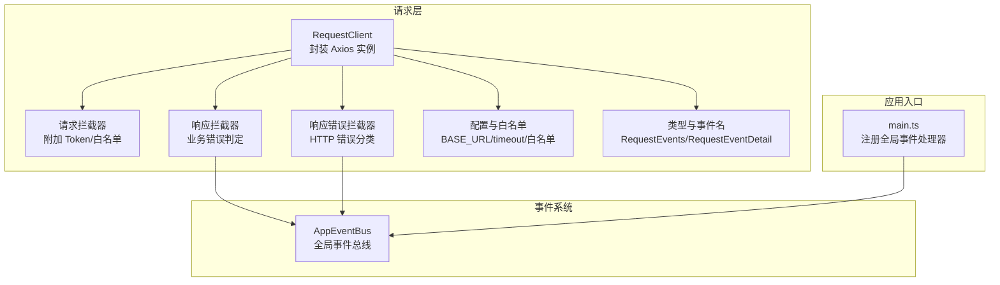
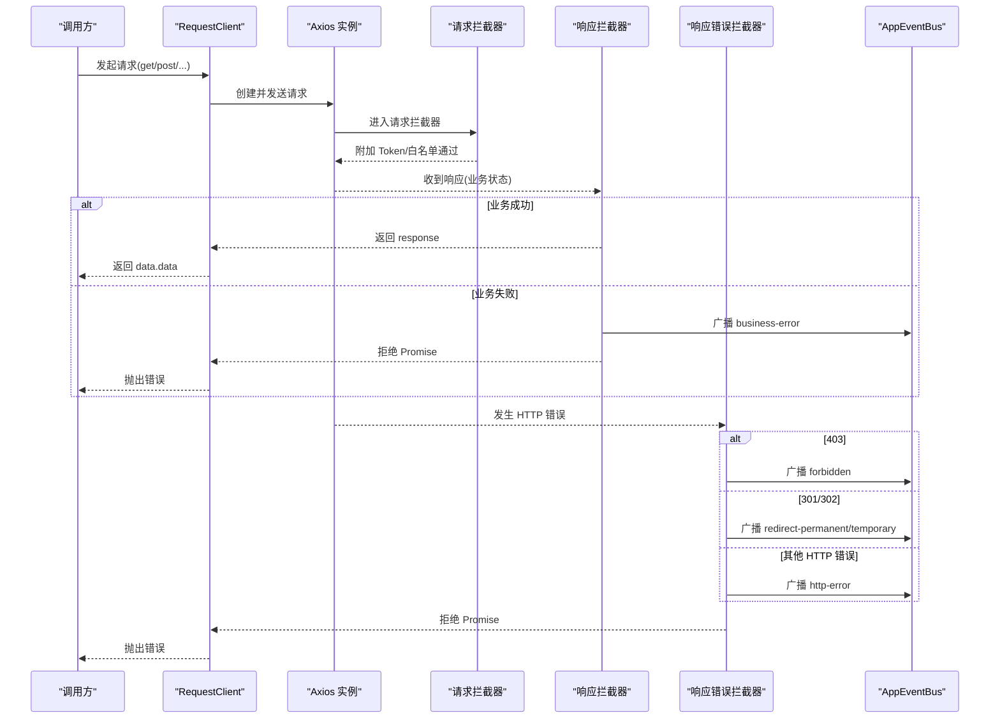
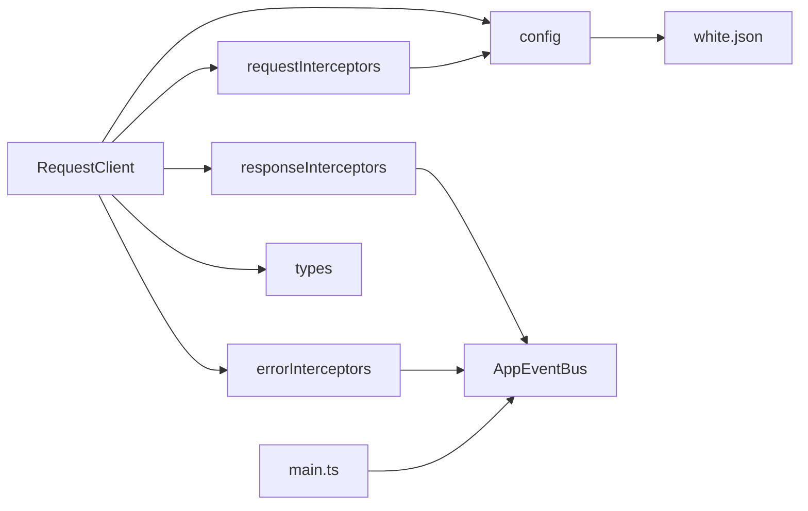

# 错误处理策略

<cite>
**本文引用的文件**
- [frontend/src/utils/request/index.ts](file://frontend/src/utils/request/index.ts)
- [frontend/src/utils/request/requestInterceptors.ts](file://frontend/src/utils/request/requestInterceptors.ts)
- [frontend/src/utils/request/responseInterceptors.ts](file://frontend/src/utils/request/responseInterceptors.ts)
- [frontend/src/utils/request/errorInterceptors.ts](file://frontend/src/utils/request/errorInterceptors.ts)
- [frontend/src/utils/request/config.ts](file://frontend/src/utils/request/config.ts)
- [frontend/src/utils/request/types.ts](file://frontend/src/utils/request/types.ts)
- [frontend/src/utils/request/white.json](file://frontend/src/utils/request/white.json)
- [frontend/src/events/AppEventBus.ts](file://frontend/src/events/AppEventBus.ts)
- [frontend/src/main.ts](file://frontend/src/main.ts)
</cite>

## 目录
1. [简介](#简介)
2. [项目结构](#项目结构)
3. [核心组件](#核心组件)
4. [架构总览](#架构总览)
5. [详细组件分析](#详细组件分析)
6. [依赖关系分析](#依赖关系分析)
7. [性能与可靠性考虑](#性能与可靠性考虑)
8. [故障排查指南](#故障排查指南)
9. [结论](#结论)
10. [附录](#附录)

## 简介
本文件系统化梳理前端请求层的错误处理策略，覆盖网络错误、HTTP 状态码错误、业务逻辑错误的分类与统一处理机制。重点说明错误拦截器的实现原理（事件广播、用户引导、重试扩展点），并给出不同错误类型的处理建议（如 401 未授权跳转登录、403 权限不足提示、301/302 重定向处理、5xx 服务器错误提示、网络超时重试等）。同时提供自定义错误处理的扩展方法与错误日志记录的最佳实践。

## 项目结构
错误处理相关代码集中在前端 utils/request 模块与应用事件总线中：
- 请求客户端封装与拦截器装配：RequestClient
- 请求拦截器：自动附加 Token、白名单校验
- 响应拦截器：业务错误判定与事件广播
- 响应错误拦截器：HTTP 错误分类与事件广播
- 类型与常量：事件名、事件负载定义
- 配置与白名单：基础 URL、超时、白名单匹配
- 应用事件总线：全局事件分发与监听
- 应用启动：注册全局事件处理器

图表来源
- [frontend/src/utils/request/index.ts:32-58](file://frontend/src/utils/request/index.ts#L32-L58)
- [frontend/src/utils/request/requestInterceptors.ts:12-39](file://frontend/src/utils/request/requestInterceptors.ts#L12-L39)
- [frontend/src/utils/request/responseInterceptors.ts:10-23](file://frontend/src/utils/request/responseInterceptors.ts#L10-L23)
- [frontend/src/utils/request/errorInterceptors.ts:10-56](file://frontend/src/utils/request/errorInterceptors.ts#L10-L56)
- [frontend/src/utils/request/config.ts:1-39](file://frontend/src/utils/request/config.ts#L1-L39)
- [frontend/src/utils/request/types.ts:1-40](file://frontend/src/utils/request/types.ts#L1-L40)
- [frontend/src/events/AppEventBus.ts:30-109](file://frontend/src/events/AppEventBus.ts#L30-L109)
- [frontend/src/main.ts:13-18](file://frontend/src/main.ts#L13-L18)

章节来源
- [frontend/src/utils/request/index.ts:32-58](file://frontend/src/utils/request/index.ts#L32-L58)
- [frontend/src/utils/request/config.ts:1-39](file://frontend/src/utils/request/config.ts#L1-L39)
- [frontend/src/utils/request/types.ts:1-40](file://frontend/src/utils/request/types.ts#L1-L40)
- [frontend/src/events/AppEventBus.ts:30-109](file://frontend/src/events/AppEventBus.ts#L30-L109)
- [frontend/src/main.ts:13-18](file://frontend/src/main.ts#L13-L18)

## 核心组件
- RequestClient：创建 Axios 实例，装配请求/响应拦截器，提供 get/post/put/delete/upload/ssePost 等方法，默认返回 data.data。
- 请求拦截器：设置通用请求头；对非白名单接口强制要求携带有效 Token；无 Token 时拒绝请求。
- 响应拦截器：当后端返回的业务状态码非成功时，触发“业务错误”事件并拒绝 Promise。
- 响应错误拦截器：根据 HTTP 状态码分类（403、301、302、其他）触发对应事件，最终拒绝 Promise。
- 类型与事件：集中定义事件名称与事件负载结构，便于跨模块一致使用。
- 配置与白名单：统一 baseURL、超时时间；白名单支持精确与通配符匹配，避免鉴权拦截。
- 应用事件总线：基于 window CustomEvent 的全局事件分发，提供便捷方法触发特定事件。
- 应用入口：在应用启动时注册全局事件处理器，将 HTTP 错误事件与路由跳转、登录弹窗等交互联动。

章节来源
- [frontend/src/utils/request/index.ts:32-58](file://frontend/src/utils/request/index.ts#L32-L58)
- [frontend/src/utils/request/requestInterceptors.ts:12-39](file://frontend/src/utils/request/requestInterceptors.ts#L12-L39)
- [frontend/src/utils/request/responseInterceptors.ts:10-23](file://frontend/src/utils/request/responseInterceptors.ts#L10-L23)
- [frontend/src/utils/request/errorInterceptors.ts:10-56](file://frontend/src/utils/request/errorInterceptors.ts#L10-L56)
- [frontend/src/utils/request/config.ts:1-39](file://frontend/src/utils/request/config.ts#L1-L39)
- [frontend/src/utils/request/types.ts:1-40](file://frontend/src/utils/request/types.ts#L1-L40)
- [frontend/src/events/AppEventBus.ts:30-109](file://frontend/src/events/AppEventBus.ts#L30-L109)
- [frontend/src/main.ts:13-18](file://frontend/src/main.ts#L13-L18)

## 架构总览
下图展示一次请求从发起、拦截、到响应与错误处理的完整流程，以及事件总线在各环节中的作用。

图表来源
- [frontend/src/utils/request/index.ts:46-58](file://frontend/src/utils/request/index.ts#L46-L58)
- [frontend/src/utils/request/requestInterceptors.ts:12-39](file://frontend/src/utils/request/requestInterceptors.ts#L12-L39)
- [frontend/src/utils/request/responseInterceptors.ts:10-23](file://frontend/src/utils/request/responseInterceptors.ts#L10-L23)
- [frontend/src/utils/request/errorInterceptors.ts:10-56](file://frontend/src/utils/request/errorInterceptors.ts#L10-L56)
- [frontend/src/events/AppEventBus.ts:30-109](file://frontend/src/events/AppEventBus.ts#L30-L109)

## 详细组件分析

### 请求拦截器：Token 注入与白名单
- 功能要点
  - 设置通用请求头（Accept、X-Requested-With、Content-Type）。
  - 白名单接口跳过鉴权；非白名单接口若无 Token 则直接拒绝。
  - 有 Token 时在 Authorization 头附加 Bearer token。
- 设计考量
  - 白名单由 white.json 加载，isWhitelisted 支持精确与通配符匹配，避免误拦截。
  - 对 FormData 请求不手动设置 Content-Type，交由浏览器生成 boundary。
- 可扩展点
  - 可在此处增加签名、traceId、租户头等通用逻辑。
  - 可在无 Token 时触发“显示登录弹窗”事件，提升用户体验。

章节来源
- [frontend/src/utils/request/requestInterceptors.ts:12-39](file://frontend/src/utils/request/requestInterceptors.ts#L12-L39)
- [frontend/src/utils/request/config.ts:12-39](file://frontend/src/utils/request/config.ts#L12-L39)
- [frontend/src/utils/request/white.json:1-28](file://frontend/src/utils/request/white.json#L1-L28)

### 响应拦截器：业务错误判定与事件广播
- 功能要点
  - 当后端返回的 status 非 0 时，视为业务错误。
  - 广播 business-error 事件，包含 message、status、url、response 等上下文。
  - 拒绝 Promise，使调用方可统一 catch 处理。
- 设计考量
  - 将业务错误与 HTTP 错误解耦，便于分层治理。
  - 事件化传播，允许任意模块订阅并执行统一提示或跳转。

章节来源
- [frontend/src/utils/request/responseInterceptors.ts:10-23](file://frontend/src/utils/request/responseInterceptors.ts#L10-L23)
- [frontend/src/utils/request/types.ts:1-40](file://frontend/src/utils/request/types.ts#L1-L40)

### 响应错误拦截器：HTTP 错误分类与事件广播
- 功能要点
  - 403：广播 forbidden 事件。
  - 301/302：广播 redirect-permanent/redirect-temporary 事件，并附带 location 信息。
  - 其他：广播 http-error 事件（含网络异常、超时、未知状态码等）。
  - 最终拒绝 Promise，确保上层能捕获。
- 设计考量
  - 以事件驱动替代硬编码分支，降低耦合度。
  - 为后续统一提示、跳转、重试提供稳定钩子。

章节来源
- [frontend/src/utils/request/errorInterceptors.ts:10-56](file://frontend/src/utils/request/errorInterceptors.ts#L10-L56)
- [frontend/src/utils/request/types.ts:1-40](file://frontend/src/utils/request/types.ts#L1-L40)

### 类型与事件：统一的错误模型
- 事件名常量：business-error、http-error、unauthorized、forbidden、redirect-permanent、redirect-temporary。
- 事件负载：type、message、status、url、response。
- 映射表：错误类型到事件名的映射，保证一致性。

章节来源
- [frontend/src/utils/request/types.ts:1-40](file://frontend/src/utils/request/types.ts#L1-L40)

### 配置与白名单：基础参数与鉴权豁免
- BASE_URL：优先使用环境变量，否则回退代理路径。
- timeout：默认 30s，上传场景可单独设置为 0。
- 白名单：white.json 列表 + isWhitelisted 匹配逻辑，支持带参与通配符。

章节来源
- [frontend/src/utils/request/config.ts:1-39](file://frontend/src/utils/request/config.ts#L1-L39)
- [frontend/src/utils/request/white.json:1-28](file://frontend/src/utils/request/white.json#L1-L28)

### 应用事件总线：全局事件分发
- 能力：emit/on/off/once，快捷方法 emitUnauthorized/emitForbidden/emitRedirectPermanent/emitRedirectTemporary。
- 用途：与 HTTP 拦截器的事件体系互通，供任意模块订阅处理。

章节来源
- [frontend/src/events/AppEventBus.ts:30-109](file://frontend/src/events/AppEventBus.ts#L30-L109)

### 应用入口：全局事件处理器注册
- 在 main.ts 中注册全局 HTTP 状态码事件处理器，将 401/403/301/302 与路由跳转、登录弹窗等交互联动。
- 可通过 onShowLogin 触发登录弹窗，或通过 router 进行页面跳转。

章节来源
- [frontend/src/main.ts:13-18](file://frontend/src/main.ts#L13-L18)

## 依赖关系分析
- RequestClient 依赖 requestInterceptors、responseInterceptors、errorInterceptors、config、types。
- 响应与错误拦截器均依赖 AppEventBus 进行事件广播。
- 白名单数据由 white.json 静态导入，isWhitelisted 在请求拦截器中使用。
- main.ts 依赖 AppEventBus 完成全局事件绑定。

图表来源
- [frontend/src/utils/request/index.ts:1-6](file://frontend/src/utils/request/index.ts#L1-L6)
- [frontend/src/utils/request/requestInterceptors.ts:1-4](file://frontend/src/utils/request/requestInterceptors.ts#L1-L4)
- [frontend/src/utils/request/responseInterceptors.ts:1-5](file://frontend/src/utils/request/responseInterceptors.ts#L1-L5)
- [frontend/src/utils/request/errorInterceptors.ts:1-5](file://frontend/src/utils/request/errorInterceptors.ts#L1-L5)
- [frontend/src/utils/request/config.ts:1-12](file://frontend/src/utils/request/config.ts#L1-L12)
- [frontend/src/utils/request/types.ts:1-15](file://frontend/src/utils/request/types.ts#L1-L15)
- [frontend/src/events/AppEventBus.ts:1-3](file://frontend/src/events/AppEventBus.ts#L1-L3)
- [frontend/src/main.ts:1-6](file://frontend/src/main.ts#L1-L6)

章节来源
- [frontend/src/utils/request/index.ts:1-6](file://frontend/src/utils/request/index.ts#L1-L6)
- [frontend/src/utils/request/config.ts:1-12](file://frontend/src/utils/request/config.ts#L1-L12)
- [frontend/src/utils/request/types.ts:1-15](file://frontend/src/utils/request/types.ts#L1-L15)
- [frontend/src/events/AppEventBus.ts:1-3](file://frontend/src/events/AppEventBus.ts#L1-L3)
- [frontend/src/main.ts:1-6](file://frontend/src/main.ts#L1-L6)

## 性能与可靠性考虑
- 超时控制
  - 默认 30s，适用于常规 API；上传接口显式关闭超时以避免大文件中断。
- 重试机制
  - 当前未内置重试。建议在业务层针对幂等 GET 请求实现指数退避重试，或在拦截器中按条件触发重试。
- 并发与取消
  - 上传支持 AbortController 取消；SSE 流也支持信号取消，避免资源泄漏。
- 事件风暴防护
  - 对高频错误（如 5xx）建议限流或合并提示，避免 UI 抖动。
- 白名单维护
  - 定期审计白名单，减少不必要的鉴权开销与潜在安全风险。

[本节为通用指导，无需源码引用]

## 故障排查指南
- 现象：请求被拒绝且提示“登录已过期，请重新登录”
  - 可能原因：非白名单接口未携带 Token。
  - 排查步骤：检查 getToken 实现、localStorage 是否包含 token、白名单是否遗漏该接口。
  - 参考位置
    - [frontend/src/utils/request/requestInterceptors.ts:31-34](file://frontend/src/utils/request/requestInterceptors.ts#L31-L34)
    - [frontend/src/utils/request/config.ts:22-39](file://frontend/src/utils/request/config.ts#L22-L39)
    - [frontend/src/utils/request/white.json:1-28](file://frontend/src/utils/request/white.json#L1-L28)

- 现象：业务失败但 HTTP 状态码为 200
  - 可能原因：后端返回业务状态码非 0。
  - 排查步骤：查看 business-error 事件的 message 与 response，定位具体业务错误。
  - 参考位置
    - [frontend/src/utils/request/responseInterceptors.ts:12-20](file://frontend/src/utils/request/responseInterceptors.ts#L12-L20)

- 现象：出现 403/301/302 或其他 HTTP 错误
  - 可能原因：权限不足、重定向、网络异常、服务端错误等。
  - 排查步骤：订阅对应事件（forbidden/redirect-permanent/redirect-temporary/http-error），打印 status/url/response。
  - 参考位置
    - [frontend/src/utils/request/errorInterceptors.ts:16-54](file://frontend/src/utils/request/errorInterceptors.ts#L16-L54)

- 现象：SSE 流式请求失败或中断
  - 可能原因：网络错误、超时、主动取消。
  - 排查步骤：检查 xhr.onerror/ontimeout 回调与 signal 是否正确传入。
  - 参考位置
    - [frontend/src/utils/request/index.ts:215-226](file://frontend/src/utils/request/index.ts#L215-L226)

章节来源
- [frontend/src/utils/request/requestInterceptors.ts:31-34](file://frontend/src/utils/request/requestInterceptors.ts#L31-L34)
- [frontend/src/utils/request/config.ts:22-39](file://frontend/src/utils/request/config.ts#L22-L39)
- [frontend/src/utils/request/white.json:1-28](file://frontend/src/utils/request/white.json#L1-L28)
- [frontend/src/utils/request/responseInterceptors.ts:12-20](file://frontend/src/utils/request/responseInterceptors.ts#L12-L20)
- [frontend/src/utils/request/errorInterceptors.ts:16-54](file://frontend/src/utils/request/errorInterceptors.ts#L16-L54)
- [frontend/src/utils/request/index.ts:215-226](file://frontend/src/utils/request/index.ts#L215-L226)

## 结论
本项目采用“拦截器 + 事件总线”的错误处理架构，将网络错误、HTTP 状态码错误与业务错误清晰分层，并通过统一事件模型对外暴露，便于在应用层集中实现提示、跳转、重试等策略。该方案具备良好扩展性与可观测性，适合在多模块、多页面协作的前端工程中落地。

[本节为总结性内容，无需源码引用]

## 附录

### 错误类型与处理策略建议
- 401 未授权
  - 行为：跳转到登录页或弹出登录框；清空本地凭证；必要时刷新页面。
  - 扩展：在请求拦截器无 Token 时也可触发“显示登录弹窗”事件。
- 403 权限不足
  - 行为：提示“权限不足”，必要时引导申请权限或降级展示。
- 301/302 重定向
  - 行为：读取 location 头，按规则跳转或提示；注意避免循环重定向。
- 5xx 服务器错误
  - 行为：友好提示“服务暂时不可用”，必要时引导稍后重试或反馈问题。
- 网络错误/超时
  - 行为：提示网络异常；对幂等 GET 请求可尝试指数退避重试；对非幂等请求谨慎重试。

[本节为通用策略，无需源码引用]

### 自定义错误处理扩展方法
- 新增错误类型
  - 在 types.ts 的 RequestEvents 与 requestEventNameMap 中补充新事件名与映射。
  - 在 errorInterceptors.ts 中增加对应分支，广播新事件。
- 全局统一提示
  - 在 main.ts 注册的事件处理器中，订阅各事件并调用 UI 组件（如 Toast/Modal）进行提示。
- 重试机制
  - 在业务层封装重试函数，或使用 axios-retry 等库；对 SSE 与上传需评估可行性与副作用。
- 日志上报
  - 在事件处理器中收集 type/message/status/url/response，异步上报至日志系统。

章节来源
- [frontend/src/utils/request/types.ts:1-40](file://frontend/src/utils/request/types.ts#L1-L40)
- [frontend/src/utils/request/errorInterceptors.ts:10-56](file://frontend/src/utils/request/errorInterceptors.ts#L10-L56)
- [frontend/src/main.ts:13-18](file://frontend/src/main.ts#L13-L18)

### 错误日志记录最佳实践
- 最小必要字段：type、message、status、url、timestamp、userAgent、sessionId。
- 敏感信息脱敏：避免记录密码、token、个人信息等。
- 采样与限流：对高频错误进行采样上报，避免日志风暴。
- 关联追踪：结合 traceId 串联前后端日志，便于定位问题。
- 分级上报：区分 warn/error/fatal，便于告警与监控。

[本节为通用指导，无需源码引用]