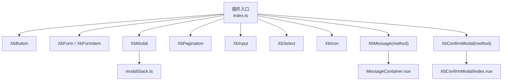
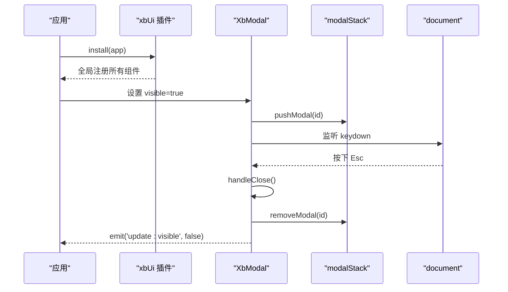
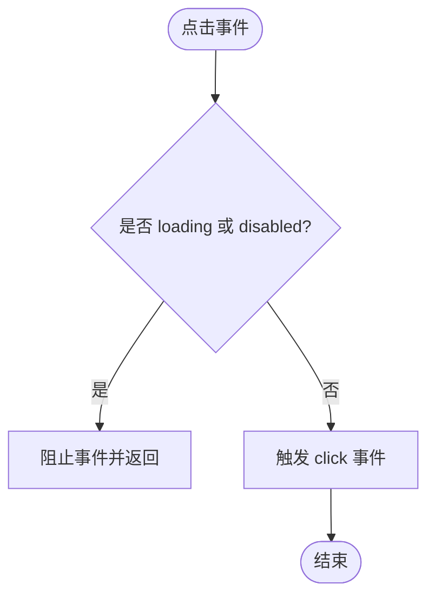
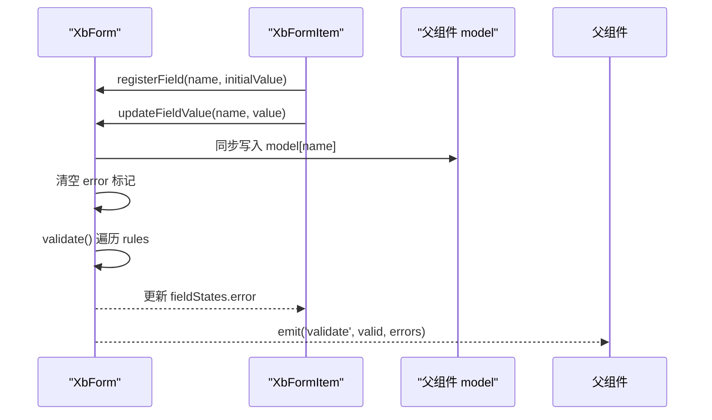
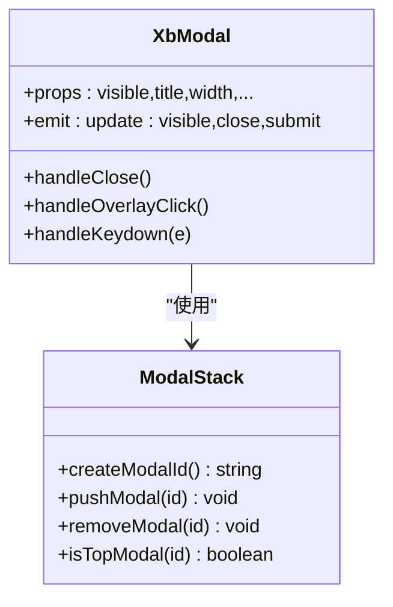
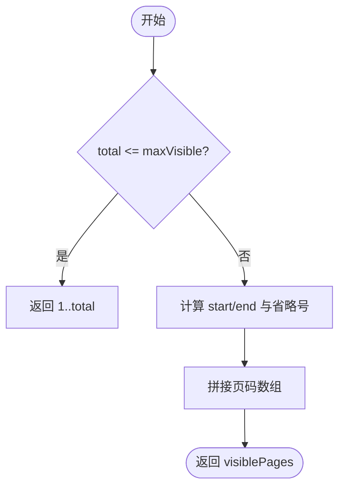
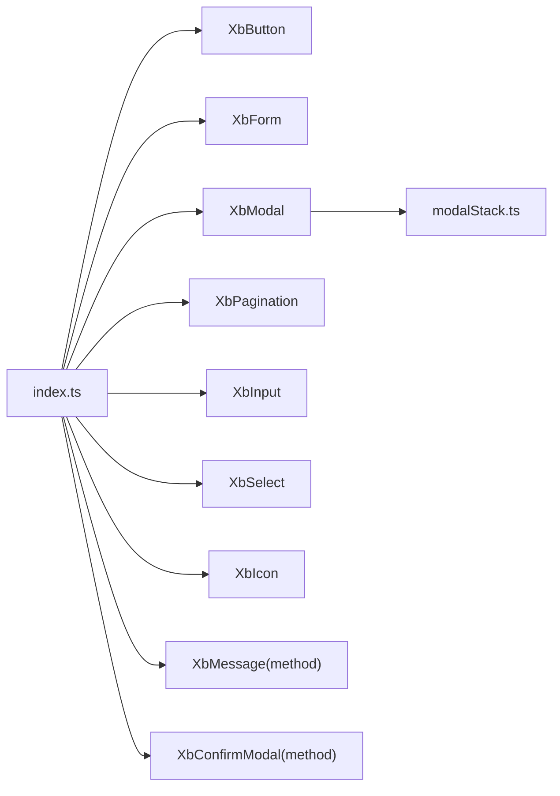

# UI组件库

<cite>
**本文引用的文件**   
- [frontend/src/xbUi/index.ts](file://frontend/src/xbUi/index.ts)
- [frontend/src/xbUi/XbButton/index.vue](file://frontend/src/xbUi/XbButton/index.vue)
- [frontend/src/xbUi/XbForm/index.vue](file://frontend/src/xbUi/XbForm/index.vue)
- [frontend/src/xbUi/XbForm/types.ts](file://frontend/src/xbUi/XbForm/types.ts)
- [frontend/src/xbUi/XbModal/index.vue](file://frontend/src/xbUi/XbModal/index.vue)
- [frontend/src/xbUi/modalStack.ts](file://frontend/src/xbUi/modalStack.ts)
- [frontend/src/xbUi/XbPagination/index.vue](file://frontend/src/xbUi/XbPagination/index.vue)
- [frontend/src/xbUi/XbConfirmModal/method.ts](file://frontend/src/xbUi/XbConfirmModal/method.ts)
- [frontend/src/xbUi/XbMessage/method.ts](file://frontend/src/xbUi/XbMessage/method.ts)
- [frontend/src/xbUi/XbIcon/index.vue](file://frontend/src/xbUi/XbIcon/index.vue)
- [frontend/src/xbUi/XbInput/index.vue](file://frontend/src/xbUi/XbInput/index.vue)
- [frontend/src/xbUi/XbSelect/index.vue](file://frontend/src/xbUi/XbSelect/index.vue)
</cite>

## 目录
1. [简介](#简介)
2. [项目结构](#项目结构)
3. [核心组件](#核心组件)
4. [架构总览](#架构总览)
5. [详细组件分析](#详细组件分析)
6. [依赖关系分析](#依赖关系分析)
7. [性能与可访问性](#性能与可访问性)
8. [样式系统与主题定制](#样式系统与主题定制)
9. [国际化支持](#国际化支持)
10. [组件开发规范](#组件开发规范)
11. [测试指南](#测试指南)
12. [故障排查](#故障排查)
13. [结论](#结论)

## 简介
本文件面向前端团队与使用者，系统化梳理 xbUi 自定义 UI 组件库的设计理念、组件架构、API 设计规范、样式系统、主题定制、核心组件实现原理与使用方法，并给出组件开发规范、样式覆盖策略、无障碍访问建议与测试方法。该组件库基于 Vue 3 + TypeScript + Tailwind CSS 构建，提供按钮、表单、模态框、分页器、输入、选择等常用基础能力，并通过命令式 API 提供消息提示与确认弹窗。

## 项目结构
组件库位于 frontend/src/xbUi 目录下，采用“按功能分目录”的组织方式：每个组件一个独立目录，包含 index.vue 与可选的 types.ts；全局插件入口为 index.ts，负责统一注册与类型导出；命令式能力（消息、确认弹窗）通过 method.ts 暴露函数式 API；共享逻辑如模态栈 modalStack.ts 用于管理多模态焦点与键盘行为。

图表来源
- [frontend/src/xbUi/index.ts:1-100](file://frontend/src/xbUi/index.ts#L1-L100)
- [frontend/src/xbUi/modalStack.ts:1-29](file://frontend/src/xbUi/modalStack.ts#L1-L29)

章节来源
- [frontend/src/xbUi/index.ts:1-100](file://frontend/src/xbUi/index.ts#L1-L100)

## 核心组件
- 按钮 XbButton：支持多种视觉变体、尺寸、加载态、禁用态、块级布局、自定义主色与渐变背景，默认原生 type=button 避免误触发表单提交。
- 表单 XbForm + XbFormItem：提供声明式校验规则、字段状态管理、提交与重置能力，支持 label 宽度与位置配置。
- 模态框 XbModal：丰富的动画集合、键盘交互（Esc 关闭、Enter 提交）、遮罩点击关闭、持久化模式、无内边距模式、Teleport 到 body。
- 分页器 XbPagination：智能页码计算与省略号展示，上一页/下一页按钮禁用态控制。
- 输入 XbInput：受控双向绑定、密码可见切换、清除按钮、前缀/后缀插槽、错误提示与占位符。
- 选择 XbSelect：下拉面板自动定位（向上/向下展开）、互斥打开、滚动对齐选中项、清除选项。
- 图标 XbIcon：统一封装 Lucide 与 LobeHub 彩色/Mono 图标，解决 SVG defs ID 冲突，Avatar 风格渲染。
- 消息 XbMessage：编程式调用，支持 success/warning/error/info 快捷方法与 close/closeAll。
- 确认弹窗 XbConfirmModal：命令式 API，支持异步 onConfirm 自动 loading，Promise 返回布尔值。

章节来源
- [frontend/src/xbUi/XbButton/index.vue:1-110](file://frontend/src/xbUi/XbButton/index.vue#L1-L110)
- [frontend/src/xbUi/XbForm/index.vue:1-164](file://frontend/src/xbUi/XbForm/index.vue#L1-L164)
- [frontend/src/xbUi/XbForm/types.ts:1-15](file://frontend/src/xbUi/XbForm/types.ts#L1-L15)
- [frontend/src/xbUi/XbModal/index.vue:1-620](file://frontend/src/xbUi/XbModal/index.vue#L1-L620)
- [frontend/src/xbUi/XbPagination/index.vue:1-103](file://frontend/src/xbUi/XbPagination/index.vue#L1-L103)
- [frontend/src/xbUi/XbInput/index.vue:1-177](file://frontend/src/xbUi/XbInput/index.vue#L1-L177)
- [frontend/src/xbUi/XbSelect/index.vue:1-271](file://frontend/src/xbUi/XbSelect/index.vue#L1-L271)
- [frontend/src/xbUi/XbIcon/index.vue:1-148](file://frontend/src/xbUi/XbIcon/index.vue#L1-L148)
- [frontend/src/xbUi/XbMessage/method.ts:1-116](file://frontend/src/xbUi/XbMessage/method.ts#L1-L116)
- [frontend/src/xbUi/XbConfirmModal/method.ts:1-150](file://frontend/src/xbUi/XbConfirmModal/method.ts#L1-L150)

## 架构总览
组件库以 Vue Plugin 形式统一安装，内部将各组件全局注册，同时保留按需导入能力。命令式 API 通过 createApp 动态挂载到 body，使用 Teleport 确保层级与焦点隔离。模态栈维护当前最顶层模态实例，保证键盘事件仅作用于顶层模态。

图表来源
- [frontend/src/xbUi/index.ts:54-63](file://frontend/src/xbUi/index.ts#L54-L63)
- [frontend/src/xbUi/XbModal/index.vue:94-116](file://frontend/src/xbUi/XbModal/index.vue#L94-L116)
- [frontend/src/xbUi/modalStack.ts:13-29](file://frontend/src/xbUi/modalStack.ts#L13-L29)

## 详细组件分析

### 按钮 XbButton
- 设计要点
  - 通过 props 控制 type、size、loading、disabled、block、color、gradient、nativeType。
  - 根据是否传入 color 动态切换样式类与 CSS 变量，支持自定义主色与渐变。
  - 默认 nativeType="button" 避免误触发表单提交。
- 关键流程
  - 点击时若处于 loading/disabled 则阻止冒泡与事件发射。
- 无障碍
  - 禁用态使用 pointer-events-none 与 opacity 降低交互暗示。
  - 聚焦态移除 outline 但可通过 focus-visible 自定义样式。

图表来源
- [frontend/src/xbUi/XbButton/index.vue:56-59](file://frontend/src/xbUi/XbButton/index.vue#L56-L59)

章节来源
- [frontend/src/xbUi/XbButton/index.vue:1-110](file://frontend/src/xbUi/XbButton/index.vue#L1-L110)

### 表单 XbForm 与 XbFormItem
- 设计要点
  - 通过 provide/inject 向子项注入上下文，集中管理字段状态与校验。
  - 支持 required/min/max/pattern/validator 规则，同步与异步校验均支持。
  - 暴露 validate/resetFields/handleSubmit 方法，便于外部控制。
- 数据流
  - 子项更新值时同步至 fieldStates 与 model，清空对应错误。
  - 提交前遍历 rules 执行校验，收集错误并触发 validate 事件。

图表来源
- [frontend/src/xbUi/XbForm/index.vue:25-79](file://frontend/src/xbUi/XbForm/index.vue#L25-L79)
- [frontend/src/xbUi/XbForm/index.vue:81-156](file://frontend/src/xbUi/XbForm/index.vue#L81-L156)

章节来源
- [frontend/src/xbUi/XbForm/index.vue:1-164](file://frontend/src/xbUi/XbForm/index.vue#L1-L164)
- [frontend/src/xbUi/XbForm/types.ts:1-15](file://frontend/src/xbUi/XbForm/types.ts#L1-L15)

### 模态框 XbModal
- 设计要点
  - 内置丰富动画类型，支持随机动画与指定动画。
  - 键盘支持：仅对顶层模态响应 Esc 关闭与 Enter 提交（非编辑态）。
  - Teleport 到 body，避免 z-index 与 overflow 问题。
- 交互流程
  - visible 变化时入栈/出栈，记录 activeAnimation，绑定/解绑键盘事件。
  - 打开时将焦点移至内容区域，防止背景表单仍可操作。

图表来源
- [frontend/src/xbUi/XbModal/index.vue:33-116](file://frontend/src/xbUi/XbModal/index.vue#L33-L116)
- [frontend/src/xbUi/modalStack.ts:1-29](file://frontend/src/xbUi/modalStack.ts#L1-L29)

章节来源
- [frontend/src/xbUi/XbModal/index.vue:1-620](file://frontend/src/xbUi/XbModal/index.vue#L1-L620)
- [frontend/src/xbUi/modalStack.ts:1-29](file://frontend/src/xbUi/modalStack.ts#L1-L29)

### 分页器 XbPagination
- 设计要点
  - 根据 currentPage、totalPages、maxVisible 计算可见页码列表，首尾固定显示，中间区域自适应。
  - 上一页/下一页按钮在边界时禁用。
- 算法流程
  - 当 total <= max 直接返回全部页码；否则计算 start/end 并插入省略号。

图表来源
- [frontend/src/xbUi/XbPagination/index.vue:19-49](file://frontend/src/xbUi/XbPagination/index.vue#L19-L49)

章节来源
- [frontend/src/xbUi/XbPagination/index.vue:1-103](file://frontend/src/xbUi/XbPagination/index.vue#L1-L103)

### 输入 XbInput
- 设计要点
  - 受控 v-model 双向绑定，支持 password 可见切换、clearable 清除、前/后缀插槽。
  - 错误态高亮边框与阴影，focus 态品牌色描边。
- 事件
  - 标准 input/focus/blur/clear/keydown 事件透传。

章节来源
- [frontend/src/xbUi/XbInput/index.vue:1-177](file://frontend/src/xbUi/XbInput/index.vue#L1-L177)

### 选择 XbSelect
- 设计要点
  - 下拉面板通过 Teleport 到 body，计算相对触发元素的位置，空间不足时向上展开。
  - 多实例互斥：通过自定义事件通知其他实例关闭自身下拉。
  - 自动滚动到选中项，保持可视居中。
- 生命周期
  - 挂载时注册 document click、resize、scroll 监听；卸载时清理。

章节来源
- [frontend/src/xbUi/XbSelect/index.vue:1-271](file://frontend/src/xbUi/XbSelect/index.vue#L1-L271)

### 图标 XbIcon
- 设计要点
  - 统一封装 Lucide 与 LobeHub 图标，支持 lobe: 前缀与直接名称。
  - 彩色图标通过替换 SVG defs ID 避免冲突；Mono 图标以 Avatar 风格渲染。
- 兼容性
  - kebab-case 自动转 PascalCase 以匹配 Lucide 组件名。

章节来源
- [frontend/src/xbUi/XbIcon/index.vue:1-148](file://frontend/src/xbUi/XbIcon/index.vue#L1-L148)

### 消息 XbMessage
- 设计要点
  - 命令式 API，首次调用时创建容器并挂载到 body。
  - 支持 success/warning/error/info 快捷方法，自动关闭与手动关闭。
- 状态管理
  - 模块级 state.messages 驱动 MessageContainer 渲染。

章节来源
- [frontend/src/xbUi/XbMessage/method.ts:1-116](file://frontend/src/xbUi/XbMessage/method.ts#L1-L116)

### 确认弹窗 XbConfirmModal
- 设计要点
  - 命令式 API，返回 Promise<boolean>，onConfirm 支持异步并自动显示 loading。
  - 通过 createApp 动态挂载，过渡结束后卸载 DOM。
- 交互
  - 支持标题、消息、按钮文案、类型、宽度、动画等配置。

章节来源
- [frontend/src/xbUi/XbConfirmModal/method.ts:1-150](file://frontend/src/xbUi/XbConfirmModal/method.ts#L1-L150)

## 依赖关系分析
- 插件入口集中导入并全局注册组件，同时单独导出各组件与类型，便于按需引入。
- 模态相关组件依赖 modalStack 进行栈管理与顶层判断。
- 消息与确认弹窗依赖各自的方法文件，通过 createApp 动态挂载。

图表来源
- [frontend/src/xbUi/index.ts:1-100](file://frontend/src/xbUi/index.ts#L1-L100)
- [frontend/src/xbUi/modalStack.ts:1-29](file://frontend/src/xbUi/modalStack.ts#L1-L29)

章节来源
- [frontend/src/xbUi/index.ts:1-100](file://frontend/src/xbUi/index.ts#L1-L100)

## 性能与可访问性
- 性能
  - 分页器使用计算属性生成可见页码，避免不必要的重排。
  - 选择器下拉面板使用 Teleport 与 fixed 定位，减少回流影响。
  - 模态动画使用 CSS transition/animation，GPU 加速 transform/opacity。
- 可访问性
  - 按钮与输入组件提供清晰的禁用态与聚焦态样式。
  - 模态框打开后将焦点移入内容区域，Esc 关闭，Enter 提交（非编辑态）。
  - 建议为关键交互补充 aria-* 属性与 role，提升屏幕阅读器体验。

[本节为通用指导，不直接分析具体文件]

## 样式系统与主题定制
- 设计令牌
  - 广泛使用 CSS 变量（如 --brand、--border、--surface-elevated、--danger 等），便于主题切换。
- 覆盖策略
  - 优先通过 props 与 slot 扩展外观；必要时通过 scoped 样式覆盖或外层 CSS 变量重写。
  - 按钮支持自定义主色与渐变，通过 CSS 变量 --xb-btn-color 注入。
- 工具链
  - 基于 Tailwind CSS 原子类组合，配合 PostCSS/Autoprefixer 处理兼容性与优化。

章节来源
- [frontend/src/xbUi/XbButton/index.vue:44-70](file://frontend/src/xbUi/XbButton/index.vue#L44-L70)
- [frontend/src/xbUi/XbModal/index.vue:158-198](file://frontend/src/xbUi/XbModal/index.vue#L158-L198)
- [frontend/src/xbUi/XbInput/index.vue:59-67](file://frontend/src/xbUi/XbInput/index.vue#L59-L67)

## 国际化支持
- 现状
  - 组件库本身未内置 i18n 机制，文本硬编码于组件中。
- 建议方案
  - 在应用层引入 i18n 库，将组件中的静态文案抽离为键值，通过 prop 或插槽传入。
  - 对于表单校验 message，可在 rules 中传入本地化后的字符串。

[本节为通用指导，不直接分析具体文件]

## 组件开发规范
- 命名与组织
  - 组件目录以 Xb 前缀命名，统一入口 index.vue，类型定义放在 types.ts。
- Props 设计
  - 使用 withDefaults 提供默认值，明确类型约束；对外暴露最小必要接口。
- 事件与模型
  - 遵循 v-model 约定，使用 update:modelValue 与相应事件；避免副作用泄露。
- 样式
  - 优先使用 Tailwind 原子类，复杂样式使用 scoped 样式；通过 CSS 变量提供主题钩子。
- 可访问性
  - 为交互元素提供合适的 tabindex、aria-* 与键盘事件处理。
- 命令式 API
  - 使用 createApp 动态挂载，注意生命周期清理与过渡结束后的卸载。

章节来源
- [frontend/src/xbUi/index.ts:54-63](file://frontend/src/xbUi/index.ts#L54-L63)
- [frontend/src/xbUi/XbForm/index.vue:152-156](file://frontend/src/xbUi/XbForm/index.vue#L152-L156)
- [frontend/src/xbUi/XbMessage/method.ts:36-53](file://frontend/src/xbUi/XbMessage/method.ts#L36-L53)
- [frontend/src/xbUi/XbConfirmModal/method.ts:78-91](file://frontend/src/xbUi/XbConfirmModal/method.ts#L78-L91)

## 测试指南
- 单元测试
  - 使用 Vue Test Utils 对组件进行 mount/shallowMount，断言 props 变更与事件触发。
  - 针对表单校验，构造 rules 并调用 validate，断言 errors 与 valid 状态。
- 交互测试
  - 模拟键盘事件验证模态框 Esc 关闭与 Enter 提交行为。
  - 模拟点击文档外部验证选择器下拉关闭与互斥逻辑。
- 命令式 API
  - 对 XbMessage 与 XbConfirmModal 进行集成测试，验证 DOM 挂载与卸载、Promise 返回值。

[本节为通用指导，不直接分析具体文件]

## 故障排查
- 模态框无法关闭
  - 检查 persistent 与 closeOnOverlay 配置；确认 isTopModal 是否为 true。
- 表单校验不生效
  - 确认 rules 结构与字段名一致；异步 validator 需返回 Promise。
- 选择器下拉错位
  - 检查窗口 resize/scroll 监听是否正确；确认 openUpward 分支的定位计算。
- 消息未显示
  - 确认 ensureContainer 已执行；检查 duration 是否为 0 导致立即关闭。

章节来源
- [frontend/src/xbUi/XbModal/index.vue:79-92](file://frontend/src/xbUi/XbModal/index.vue#L79-L92)
- [frontend/src/xbUi/XbForm/index.vue:81-134](file://frontend/src/xbUi/XbForm/index.vue#L81-L134)
- [frontend/src/xbUi/XbSelect/index.vue:67-92](file://frontend/src/xbUi/XbSelect/index.vue#L67-L92)
- [frontend/src/xbUi/XbMessage/method.ts:36-53](file://frontend/src/xbUi/XbMessage/method.ts#L36-L53)

## 结论
xbUi 组件库以清晰的分层与统一的插件入口，提供了稳定易用的基础 UI 能力。通过 CSS 变量与 Tailwind 原子类，实现了良好的主题定制与样式一致性；通过命令式 API 提升了交互效率。建议在后续迭代中完善 i18n 支持与无障碍增强，并建立完善的自动化测试体系，进一步提升可用性与可维护性。