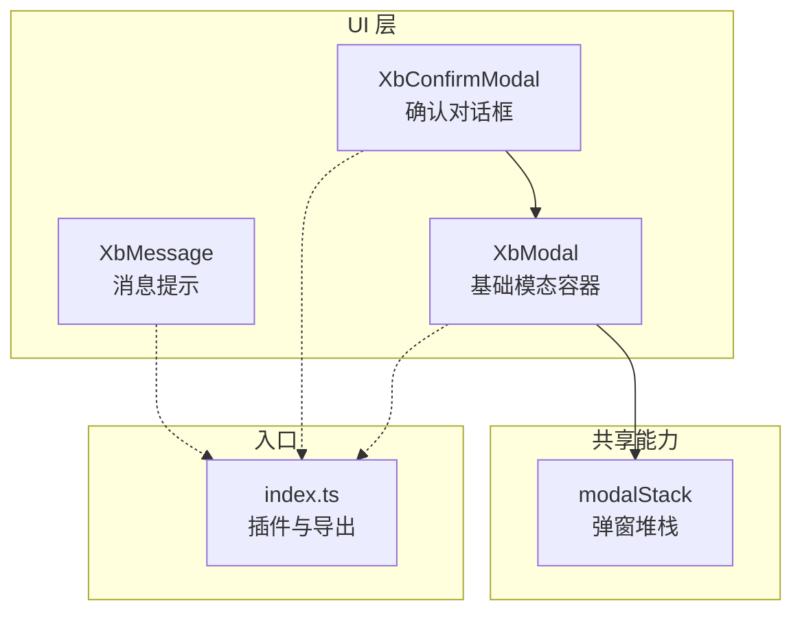
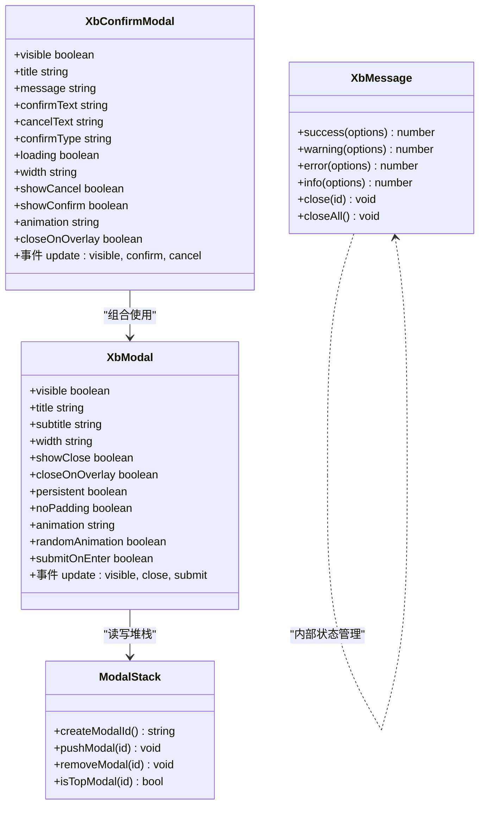
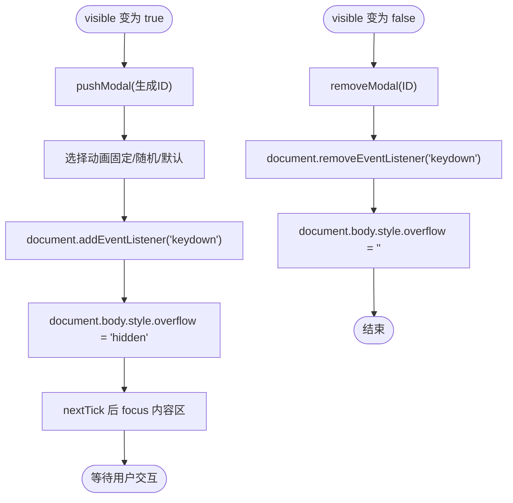
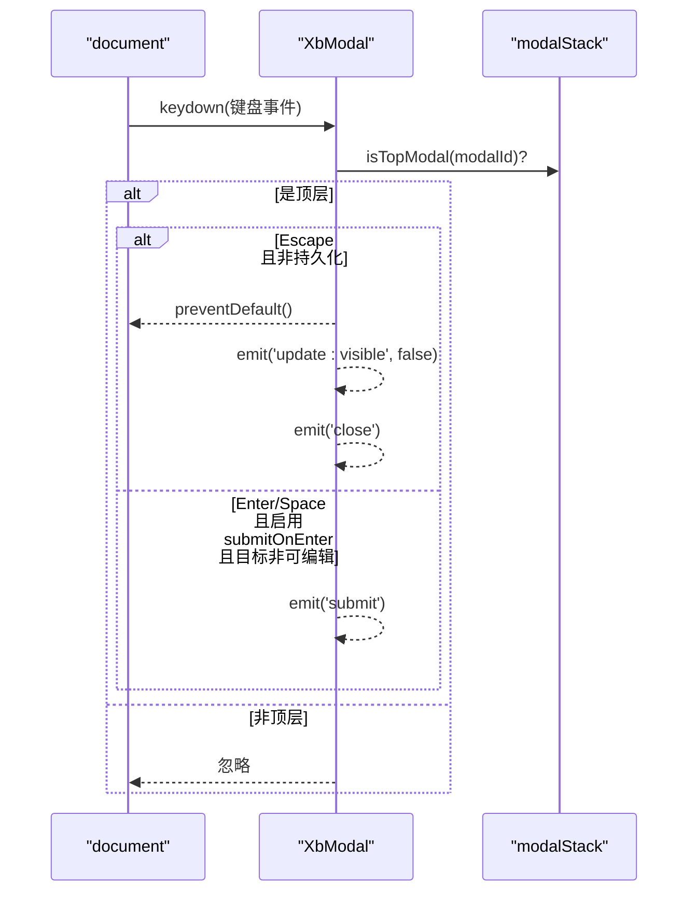
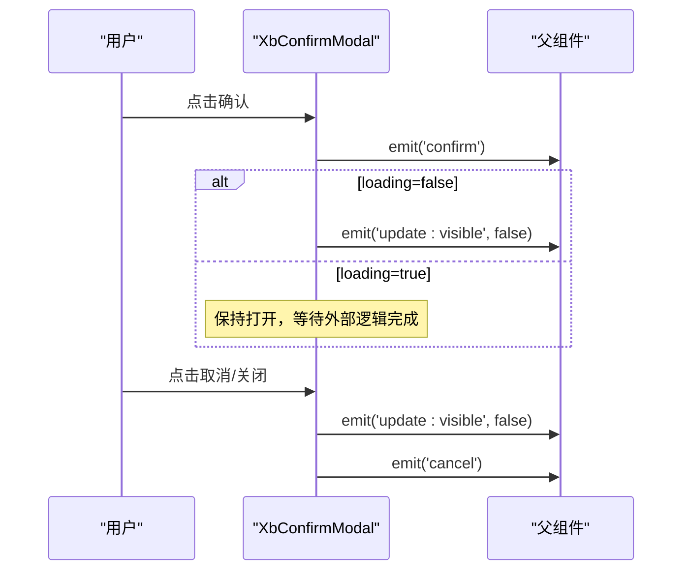
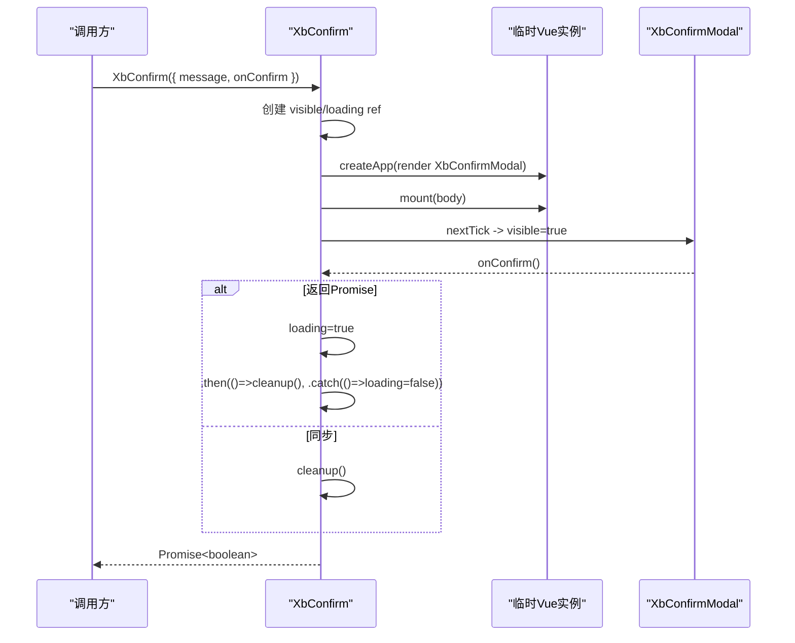
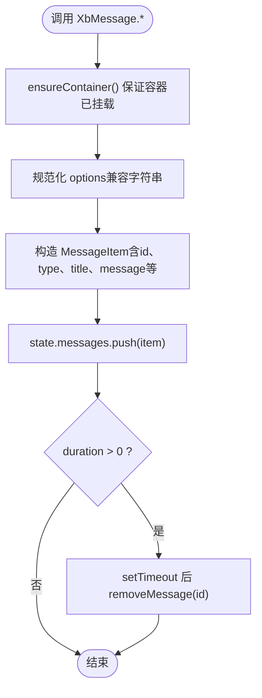
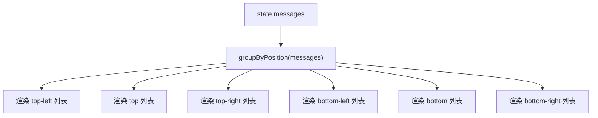
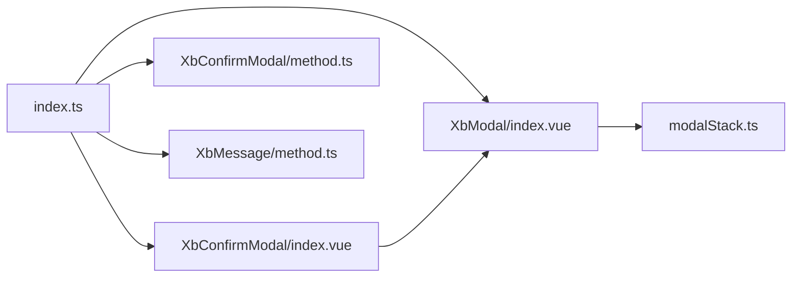

# 反馈组件

<cite>
**本文引用的文件**   
- [XbModal/index.vue](file://frontend/src/xbUi/XbModal/index.vue)
- [modalStack.ts](file://frontend/src/xbUi/modalStack.ts)
- [XbConfirmModal/index.vue](file://frontend/src/xbUi/XbConfirmModal/index.vue)
- [XbConfirmModal/method.ts](file://frontend/src/xbUi/XbConfirmModal/method.ts)
- [XbMessage/MessageContainer.vue](file://frontend/src/xbUi/XbMessage/MessageContainer.vue)
- [XbMessage/method.ts](file://frontend/src/xbUi/XbMessage/method.ts)
- [index.ts](file://frontend/src/xbUi/index.ts)
</cite>

## 目录
1. [简介](#简介)
2. [项目结构](#项目结构)
3. [核心组件](#核心组件)
4. [架构总览](#架构总览)
5. [详细组件分析](#详细组件分析)
6. [依赖关系分析](#依赖关系分析)
7. [性能与体验优化](#性能与体验优化)
8. [故障排查指南](#故障排查指南)
9. [结论](#结论)
10. [附录：使用示例与最佳实践](#附录使用示例与最佳实践)

## 简介
本章节面向前端开发者，系统性梳理反馈交互 UI 组件的实现原理与使用方法，覆盖模态框（XbModal）、确认对话框（XbConfirmModal）与消息提示（XbMessage）。重点讲解弹窗管理、堆栈控制、异步操作处理、键盘交互、焦点管理等高级能力，并提供多弹窗场景的处理方案、用户体验优化建议与可访问性支持。

## 项目结构
反馈相关代码位于前端 UI 库模块中，采用“声明式组件 + 命令式 API”的组合方式：
- XbModal：基础模态容器，负责遮罩、动画、键盘与焦点管理、滚动锁定等。
- modalStack：全局弹窗堆栈，维护当前最顶层弹窗 ID，用于键盘事件路由。
- XbConfirmModal：基于 XbModal 的确认对话框，提供 loading 状态与 Promise 化调用。
- XbMessage：全局消息提示，支持多种位置、动画类型与自动关闭。
- index.ts：统一导出插件与组件，便于按需或全量引入。

图表来源
- [XbModal/index.vue:1-120](file://frontend/src/xbUi/XbModal/index.vue#L1-L120)
- [modalStack.ts:1-29](file://frontend/src/xbUi/modalStack.ts#L1-L29)
- [XbConfirmModal/index.vue:1-60](file://frontend/src/xbUi/XbConfirmModal/index.vue#L1-L60)
- [XbMessage/MessageContainer.vue:1-120](file://frontend/src/xbUi/XbMessage/MessageContainer.vue#L1-L120)
- [index.ts:1-100](file://frontend/src/xbUi/index.ts#L1-L100)

章节来源
- [index.ts:1-100](file://frontend/src/xbUi/index.ts#L1-L100)

## 核心组件
- XbModal
  - 功能：通用模态容器，支持标题、副标题、宽度、关闭按钮、点击遮罩关闭、持久化模式、无内边距、多种入场动画、随机动画、Enter 提交等。
  - 行为：可见时入栈并监听键盘；隐藏时出栈并移除监听；body 滚动锁定；将焦点移入内容区域。
- XbConfirmModal
  - 功能：在 XbModal 基础上封装确认/取消按钮、loading 状态、默认文案与宽度、是否显示取消/确认按钮、动画与遮罩关闭策略。
  - 行为：当 onConfirm 返回 Promise 时自动进入 loading，完成后关闭并 resolve(true)，失败则保持打开并可重试。
- XbMessage
  - 功能：全局消息提示，支持 success/warning/error/info 四种类型、标题与正文、图标开关、关闭按钮、动画与位置、自动关闭延迟。
  - 行为：首次调用时挂载到 body，内部通过响应式数组维护消息列表，按位置分组渲染，支持手动关闭与全部关闭。

章节来源
- [XbModal/index.vue:1-120](file://frontend/src/xbUi/XbModal/index.vue#L1-L120)
- [XbConfirmModal/index.vue:1-101](file://frontend/src/xbUi/XbConfirmModal/index.vue#L1-L101)
- [XbMessage/MessageContainer.vue:1-120](file://frontend/src/xbUi/XbMessage/MessageContainer.vue#L1-L120)

## 架构总览
下图展示了三个反馈组件之间的协作关系以及它们与全局堆栈和入口导出的关联。

图表来源
- [modalStack.ts:1-29](file://frontend/src/xbUi/modalStack.ts#L1-L29)
- [XbModal/index.vue:1-120](file://frontend/src/xbUi/XbModal/index.vue#L1-L120)
- [XbConfirmModal/index.vue:1-101](file://frontend/src/xbUi/XbConfirmModal/index.vue#L1-L101)
- [XbMessage/method.ts:1-116](file://frontend/src/xbUi/XbMessage/method.ts#L1-L116)

## 详细组件分析

### XbModal 基础模态容器
- 设计要点
  - 使用 Teleport 将模态渲染至 body，避免父级样式影响。
  - 使用 Transition 实现遮罩淡入淡出，并为内容区提供丰富的动画类名。
  - 通过 props 控制展示细节：标题、副标题、宽度、关闭按钮、遮罩关闭、持久化、无内边距、动画、随机动画、Enter 提交。
  - 可见性变化时：入栈、选择动画、绑定键盘事件、锁定 body 滚动、将焦点移至内容区；不可见时：出栈、解绑事件、恢复滚动。
  - 键盘交互：仅对最顶层弹窗生效；Escape 关闭（非持久化）；Enter/Space 触发提交（仅在非可编辑元素且启用 submitOnEnter 时）。
  - 可访问性：内容区设置 tabindex="-1" 以便程序化聚焦；focus-visible 样式确保键盘导航可见。

- 关键流程（可见性变化）

图表来源
- [XbModal/index.vue:94-116](file://frontend/src/xbUi/XbModal/index.vue#L94-L116)
- [modalStack.ts:13-23](file://frontend/src/xbUi/modalStack.ts#L13-L23)

- 键盘事件处理

图表来源
- [XbModal/index.vue:78-92](file://frontend/src/xbUi/XbModal/index.vue#L78-L92)
- [modalStack.ts:25-29](file://frontend/src/xbUi/modalStack.ts#L25-L29)

章节来源
- [XbModal/index.vue:1-120](file://frontend/src/xbUi/XbModal/index.vue#L1-L120)
- [modalStack.ts:1-29](file://frontend/src/xbUi/modalStack.ts#L1-L29)

### XbConfirmModal 确认对话框
- 设计要点
  - 基于 XbModal 封装，提供 title/message、确认/取消按钮、loading 状态、宽度、动画、遮罩关闭策略。
  - 暴露 update:visible、confirm、cancel 事件，供上层双向绑定与业务回调。
  - 当 loading 为真时，禁止自动关闭，由上层在异步完成后自行关闭。

- 典型交互序列

图表来源
- [XbConfirmModal/index.vue:33-55](file://frontend/src/xbUi/XbConfirmModal/index.vue#L33-L55)

章节来源
- [XbConfirmModal/index.vue:1-101](file://frontend/src/xbUi/XbConfirmModal/index.vue#L1-L101)

### XbConfirm 命令式调用
- 设计要点
  - 提供函数式 API，支持字符串或配置对象作为参数。
  - 内部动态创建 Vue 应用实例，挂载到 body，并在 nextTick 后显示。
  - 支持 onConfirm 返回 Promise，自动切换 loading 状态，成功则清理并 resolve(true)，失败则保留弹窗。
  - 关闭时等待过渡动画结束后卸载应用与 DOM 节点，避免内存泄漏。

- 调用时序

图表来源
- [XbConfirmModal/method.ts:68-149](file://frontend/src/xbUi/XbConfirmModal/method.ts#L68-L149)

章节来源
- [XbConfirmModal/method.ts:1-150](file://frontend/src/xbUi/XbConfirmModal/method.ts#L1-L150)

### XbMessage 消息提示
- 设计要点
  - 单例容器：首次调用 ensureContainer 时创建并挂载到 body，后续复用同一实例。
  - 状态集中：通过响应式 state.messages 维护所有消息项，包含 id、type、title、message、closable、showIcon、animation、position。
  - 分组渲染：根据 position 将消息分组，分别渲染在不同区域的列表中，底部区域使用反向排列。
  - 动画丰富：内置 slide-down/slide-up/slide-left/slide-right/fade/scale/bounce/flip/zoom/swing/elastic/rotate/blur/backdrop 等多种动画。
  - 生命周期：支持自动关闭（duration > 0），也支持手动关闭与全部关闭。

- 添加消息流程

图表来源
- [XbMessage/method.ts:36-79](file://frontend/src/xbUi/XbMessage/method.ts#L36-L79)

- 容器渲染与分组

图表来源
- [XbMessage/MessageContainer.vue:64-87](file://frontend/src/xbUi/XbMessage/MessageContainer.vue#L64-L87)
- [XbMessage/MessageContainer.vue:90-114](file://frontend/src/xbUi/XbMessage/MessageContainer.vue#L90-L114)

章节来源
- [XbMessage/method.ts:1-116](file://frontend/src/xbUi/XbMessage/method.ts#L1-L116)
- [XbMessage/MessageContainer.vue:1-120](file://frontend/src/xbUi/XbMessage/MessageContainer.vue#L1-L120)

## 依赖关系分析
- 组件间依赖
  - XbConfirmModal 依赖 XbModal 进行布局与交互。
  - XbModal 依赖 modalStack 进行堆栈管理与顶层判断。
  - XbMessage 独立运行，通过全局状态与容器渲染消息。
- 导出与注册
  - index.ts 统一导出组件与命令式 API，支持插件安装与单独导入。

图表来源
- [index.ts:1-100](file://frontend/src/xbUi/index.ts#L1-L100)
- [XbConfirmModal/index.vue:1-60](file://frontend/src/xbUi/XbConfirmModal/index.vue#L1-L60)
- [XbModal/index.vue:1-60](file://frontend/src/xbUi/XbModal/index.vue#L1-L60)
- [modalStack.ts:1-29](file://frontend/src/xbUi/modalStack.ts#L1-L29)

章节来源
- [index.ts:1-100](file://frontend/src/xbUi/index.ts#L1-L100)

## 性能与体验优化
- 动画与过渡
  - 合理选择动画时长与缓动曲线，避免过度复杂动画导致卡顿。
  - 大量消息同时出现时，优先使用轻量动画（如 fade/scale），减少重排重绘。
- 滚动与焦点
  - 模态打开时锁定 body 滚动，关闭时恢复，避免页面抖动。
  - 使用 nextTick 后将焦点移入内容区，提升键盘可达性与无障碍体验。
- 资源释放
  - 命令式弹窗在关闭后延时卸载应用与 DOM，确保过渡动画完整播放且不泄漏。
- 可访问性
  - 提供 focus-visible 样式，确保键盘导航可见。
  - 为可关闭按钮提供清晰的 hover/focus 反馈。
- 多弹窗场景
  - 借助 modalStack 确保只有最顶层弹窗响应键盘事件，避免冲突。
  - 谨慎使用 persistent 模式，避免阻塞用户操作。

[本节为通用指导，不直接分析具体文件]

## 故障排查指南
- 键盘事件无效
  - 检查是否为最顶层弹窗（isTopModal），若非顶层则不会响应。
  - 确认未处于可编辑元素（input/textarea/select/contentEditable）中，Enter/Space 才会触发提交。
- 滚动未恢复
  - 检查 visible 变为 false 时是否正确移除键盘监听并恢复 body overflow。
- 命令式弹窗未关闭
  - 若 onConfirm 返回 Promise，需确保成功路径调用 cleanup 并 resolve(true)。
  - 失败路径应重置 loading，允许用户重试。
- 消息未自动关闭
  - 检查 duration 是否大于 0，否则不会自动关闭。
- 内存泄漏
  - 确认命令式弹窗在关闭后执行 unmount 与 DOM 移除。

章节来源
- [XbModal/index.vue:78-116](file://frontend/src/xbUi/XbModal/index.vue#L78-L116)
- [XbConfirmModal/method.ts:78-149](file://frontend/src/xbUi/XbConfirmModal/method.ts#L78-L149)
- [XbMessage/method.ts:70-92](file://frontend/src/xbUi/XbMessage/method.ts#L70-L92)

## 结论
XbModal、XbConfirmModal 与 XbMessage 共同构成了完整的反馈交互体系。通过统一的堆栈管理、丰富的动画与位置选项、完善的键盘与焦点处理，以及命令式 API 的便捷调用，开发者可以快速构建一致、可靠且友好的用户反馈体验。遵循本文的最佳实践与注意事项，可在复杂场景中保持稳定的交互质量与良好的可访问性。

[本节为总结，不直接分析具体文件]

## 附录：使用示例与最佳实践
- 声明式用法
  - 在模板中使用 <XbModal> 或 <XbConfirmModal>，通过 v-model 控制 visible，并处理 confirm/cancel/close/submit 事件。
- 命令式用法
  - 使用 XbConfirm 弹出确认对话框，onConfirm 可返回 Promise 以自动处理 loading。
  - 使用 XbMessage.success/info/warning/error 快速展示消息，支持自定义标题、图标、动画与位置。
- 多弹窗协同
  - 利用 modalStack 的顶层判断，确保键盘事件只作用于最上层弹窗。
  - 对于需要阻止背景操作的场景，可使用 persistent 模式，但需谨慎使用以避免阻塞。
- 可访问性建议
  - 为重要操作提供明确的键盘快捷键说明。
  - 为关闭按钮提供清晰的焦点样式与提示。
- 性能建议
  - 批量消息时使用合适的动画与布局，避免频繁重排。
  - 长列表或复杂内容建议在模态内容区内滚动，而非整个页面。

[本节为使用指导，不直接分析具体文件]