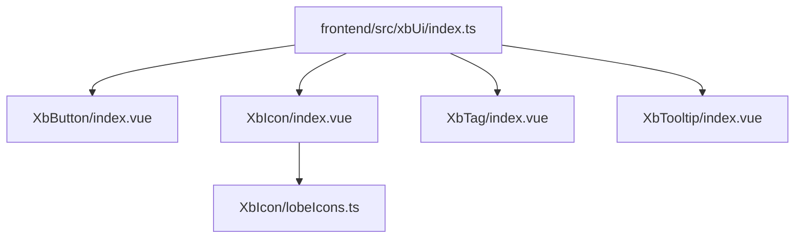
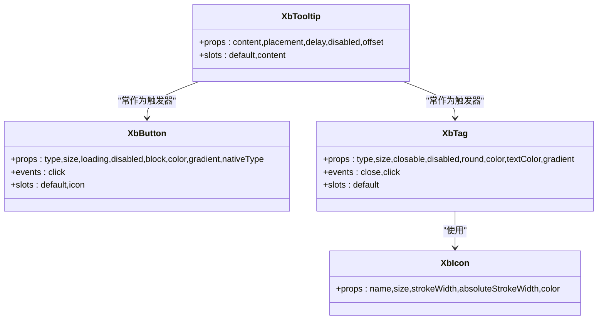
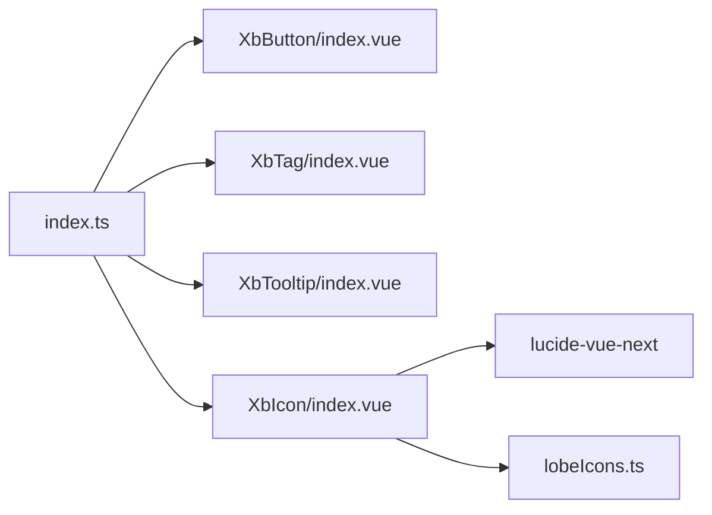

# 基础组件

<cite>
**本文引用的文件**   
- [XbButton/index.vue](file://frontend/src/xbUi/XbButton/index.vue)
- [XbIcon/index.vue](file://frontend/src/xbUi/XbIcon/index.vue)
- [XbTag/index.vue](file://frontend/src/xbUi/XbTag/index.vue)
- [XbTooltip/index.vue](file://frontend/src/xbUi/XbTooltip/index.vue)
- [index.ts](file://frontend/src/xbUi/index.ts)
- [lobeIcons.ts](file://frontend/src/xbUi/XbIcon/lobeIcons.ts)
</cite>

## 目录
1. [简介](#简介)
2. [项目结构](#项目结构)
3. [核心组件](#核心组件)
4. [架构总览](#架构总览)
5. [详细组件分析](#详细组件分析)
6. [依赖关系分析](#依赖关系分析)
7. [性能与可访问性](#性能与可访问性)
8. [常见问题与排障](#常见问题与排障)
9. [结论](#结论)
10. [附录：使用示例与最佳实践](#附录使用示例与最佳实践)

## 简介
本章节面向前端开发者，系统化梳理 XbUI 基础展示型组件的实现原理与使用方法，重点覆盖以下四个组件：
- 按钮 XbButton
- 图标 XbIcon
- 标签 XbTag
- 提示框 XbTooltip

文档将逐项说明 Props、Events、Slots、样式覆盖与主题定制方式，并提供最佳实践、性能考虑与常见问题解决方案。

## 项目结构
XbUI 采用按功能分目录的组织方式，每个组件独立一个文件夹，统一通过 index.ts 聚合导出，便于按需引入或全局注册。

图表来源
- [index.ts:1-100](file://frontend/src/xbUi/index.ts#L1-L100)
- [XbButton/index.vue:1-110](file://frontend/src/xbUi/XbButton/index.vue#L1-L110)
- [XbIcon/index.vue:1-148](file://frontend/src/xbUi/XbIcon/index.vue#L1-L148)
- [XbTag/index.vue:1-103](file://frontend/src/xbUi/XbTag/index.vue#L1-L103)
- [XbTooltip/index.vue:1-207](file://frontend/src/xbUi/XbTooltip/index.vue#L1-L207)
- [lobeIcons.ts:1-34](file://frontend/src/xbUi/XbIcon/lobeIcons.ts#L1-L34)

章节来源
- [index.ts:1-100](file://frontend/src/xbUi/index.ts#L1-L100)

## 核心组件
本节对四个基础组件进行概览式说明，后续章节再深入细节。

- XbButton：提供多种类型、尺寸、加载态、禁用态、块级模式，支持自定义主色与渐变背景，默认原生 button type 为 button 避免误触发表单提交。
- XbIcon：同时支持 Lucide 图标与 LobeHub 品牌图标（含彩色与 Mono 两种风格），自动处理 SVG defs ID 冲突，Mono 图标以 Avatar 圆形背景呈现。
- XbTag：提供多语义类型、尺寸、圆角、可关闭、禁用等能力，支持自定义背景与文字颜色及渐变。
- XbTooltip：基于 Teleport 渲染到 body，支持四种方向、延迟显示、溢出自动回退、滚动与窗口缩放时位置更新。

章节来源
- [XbButton/index.vue:1-110](file://frontend/src/xbUi/XbButton/index.vue#L1-L110)
- [XbIcon/index.vue:1-148](file://frontend/src/xbUi/XbIcon/index.vue#L1-L148)
- [XbTag/index.vue:1-103](file://frontend/src/xbUi/XbTag/index.vue#L1-L103)
- [XbTooltip/index.vue:1-207](file://frontend/src/xbUi/XbTooltip/index.vue#L1-L207)

## 架构总览
从组件间依赖与数据流角度，整体关系如下：

图表来源
- [XbButton/index.vue:1-110](file://frontend/src/xbUi/XbButton/index.vue#L1-L110)
- [XbTag/index.vue:1-103](file://frontend/src/xbUi/XbTag/index.vue#L1-L103)
- [XbIcon/index.vue:1-148](file://frontend/src/xbUi/XbIcon/index.vue#L1-L148)
- [XbTooltip/index.vue:1-207](file://frontend/src/xbUi/XbTooltip/index.vue#L1-L207)

## 详细组件分析

### XbButton 按钮
- 设计要点
  - 类型与尺寸：type 支持 primary/secondary/ghost/danger/outline；size 支持 sm/md/lg。
  - 状态控制：loading 与 disabled 会禁用交互并降低不透明度。
  - 布局：block 使按钮全宽。
  - 主题扩展：color 与 gradient 配合实现自定义主色与渐变背景。
  - 原生行为：nativeType 默认 button，避免误触发表单提交。
- 事件与插槽
  - 事件：click（在 loading/disabled 下被拦截）。
  - 插槽：默认插槽用于文本内容；icon 插槽用于前置图标。
- 样式与主题
  - 通过 CSS 变量 --xb-btn-color 注入自定义颜色，hover 时增强阴影与亮度。
  - 当 type=primary 且未设置 color 时，使用内置渐变与阴影变量。
- 可访问性
  - 聚焦可见轮廓已移除，建议外层容器提供合适的 aria-label 或使用原生 button 的语义。
- 使用建议
  - 表单场景务必保持 nativeType="button"，或在需要提交时显式设置为 submit。
  - 长文案建议使用 block 提升点击区域。
  - 自定义颜色时注意对比度，确保可读性与无障碍体验。

章节来源
- [XbButton/index.vue:1-110](file://frontend/src/xbUi/XbButton/index.vue#L1-L110)

### XbIcon 图标
- 设计要点
  - 双引擎：Lucide 图标与 LobeHub 品牌图标。
  - 名称解析：name 支持 kebab-case 转 PascalCase 匹配 Lucide；支持 lobe: 前缀或直接传入 LobeHub 图标名。
  - 彩色与 Mono：LobeHub 彩色图标直接渲染 paths；Mono 图标以 Avatar 圆形背景+白色图标呈现。
  - ID 冲突防护：为彩色图标的 defs 引用生成实例唯一后缀，避免同页重复渲染冲突。
- 属性
  - name：必填，图标名。
  - size：图标尺寸（px）。
  - strokeWidth / absoluteStrokeWidth：Lucide 线宽控制。
  - color：覆盖 Mono 图标在 Avatar 上的颜色。
- 事件与插槽
  - 无自定义事件；透传 $attrs 至底层元素，便于绑定 aria-* 等属性。
- 样式与主题
  - Mono 图标 Avatar 背景色由 lobeIcons 数据中的 avatarBg 决定，边框在浅色背景时显示。
  - 可通过 color prop 覆盖图标填充色。
- 使用建议
  - 大量使用彩色 LobeHub 图标时，注意页面中 defs 的唯一性已由组件内部处理。
  - 若需严格一致的大小，请固定 size 并使用 Avatar 风格。

章节来源
- [XbIcon/index.vue:1-148](file://frontend/src/xbUi/XbIcon/index.vue#L1-L148)
- [lobeIcons.ts:1-34](file://frontend/src/xbUi/XbIcon/lobeIcons.ts#L1-L34)

### XbTag 标签
- 设计要点
  - 类型与尺寸：type 支持 default/brand/success/warning/danger/info；size 支持 sm/md/lg。
  - 交互：closable 显示关闭按钮，点击触发 close 事件；disabled 禁用交互。
  - 外观：round 切换圆角；支持自定义 color/textColor 与渐变。
- 事件与插槽
  - 事件：close（阻止冒泡）、click。
  - 插槽：默认插槽承载内容。
- 样式与主题
  - 通过 CSS 变量 --xb-tag-color 与 --xb-tag-text 注入自定义配色。
  - 渐变模式下背景为线性渐变，边框与文字颜色跟随变量。
- 使用建议
  - 可关闭标签建议在外层监听 close 事件并更新数据源。
  - 自定义颜色时注意与背景的对比度。

章节来源
- [XbTag/index.vue:1-103](file://frontend/src/xbUi/XbTag/index.vue#L1-L103)

### XbTooltip 提示框
- 设计要点
  - 定位策略：Teleport 到 body，避免父级 overflow 影响。
  - 方向与偏移：placement 支持 top/bottom/left/right；offset 控制间距。
  - 延迟与防抖：show/hide 分别使用定时器，避免频繁闪烁。
  - 自适应：计算四向位置后，检测视口边界，必要时自动回退到反方向。
  - 滚动与缩放：监听 window scroll/resize，实时更新位置。
- 属性
  - content：提示文本。
  - placement：默认 top。
  - delay：显示延迟毫秒数。
  - disabled：禁用提示。
  - offset：提示与触发器的间距。
- 事件与插槽
  - 插槽：default 为触发器；content 为提示内容（优先于 props.content）。
- 使用建议
  - 触发器应为可聚焦元素或包含可聚焦子元素，以提升键盘可访问性。
  - 复杂内容建议使用 content 插槽，避免超长文本导致溢出。

章节来源
- [XbTooltip/index.vue:1-207](file://frontend/src/xbUi/XbTooltip/index.vue#L1-L207)

## 依赖关系分析
- 组件导出
  - 所有基础组件均通过 index.ts 统一导出，既支持插件式全局注册，也支持按需导入。
- 图标数据
  - XbIcon 依赖 lobeIcons.ts 提供的品牌图标数据，包含 viewBox、paths、hasColor、avatar* 等元信息。
- 外部库
  - XbIcon 使用 lucide-vue-next 动态解析并渲染 Lucide 图标。

图表来源
- [index.ts:1-100](file://frontend/src/xbUi/index.ts#L1-L100)
- [XbIcon/index.vue:1-148](file://frontend/src/xbUi/XbIcon/index.vue#L1-L148)
- [lobeIcons.ts:1-34](file://frontend/src/xbUi/XbIcon/lobeIcons.ts#L1-L34)

章节来源
- [index.ts:1-100](file://frontend/src/xbUi/index.ts#L1-L100)

## 性能与可访问性
- 渲染与重排
  - Tooltip 使用 Teleport 到 body，减少因父级 transform/overflow 导致的布局抖动。
  - 位置计算仅在 visible 时执行，并在滚动/缩放时增量更新。
- 定时器管理
  - show/hide 使用独立定时器，clearTimers 保证卸载与禁用时及时清理，避免内存泄漏。
- 图标渲染
  - 彩色 LobeHub 图标通过替换 defs ID 避免冲突，但大量同类型彩色图标仍可能增加 DOM 体积，建议按需使用。
- 可访问性
  - Button 移除了默认 outline，建议在应用层补充 focus-visible 样式或保留系统默认焦点样式。
  - Tooltip 触发器应可聚焦，必要时添加 aria-describedby 指向提示内容。

[无需来源：本节为通用性能与可访问性建议]

## 常见问题与排障
- 按钮点击无效
  - 检查是否处于 loading 或 disabled 状态；确认事件未被上层捕获。
- 自定义颜色不生效
  - 确保 type=primary 且设置了 color；渐变需同时启用 gradient。
- 图标不显示或错位
  - 检查 name 是否正确（kebab-case 会被转换为 PascalCase）；LobeHub 图标可使用 lobe: 前缀。
- 彩色图标重叠或样式异常
  - 组件已自动处理 defs ID 冲突；如仍有问题，检查是否存在第三方样式覆盖 svg defs。
- 标签关闭无响应
  - 确认 closable 为 true 且未 disabled；监听 close 事件并更新数据。
- 提示框位置不正确或被遮挡
  - 检查父容器是否有 transform/overflow:hidden；调整 offset 或 placement；确认触发器有实际尺寸。

章节来源
- [XbButton/index.vue:1-110](file://frontend/src/xbUi/XbButton/index.vue#L1-L110)
- [XbIcon/index.vue:1-148](file://frontend/src/xbUi/XbIcon/index.vue#L1-L148)
- [XbTag/index.vue:1-103](file://frontend/src/xbUi/XbTag/index.vue#L1-L103)
- [XbTooltip/index.vue:1-207](file://frontend/src/xbUi/XbTooltip/index.vue#L1-L207)

## 结论
XbButton、XbIcon、XbTag、XbTooltip 四个基础组件在设计上保持一致的 API 风格与主题扩展能力，兼顾易用性与可定制性。通过 CSS 变量与 props 组合，可在不修改源码的前提下完成主题化与行为微调。遵循本文的最佳实践与注意事项，可在大多数业务场景中稳定高效地使用这些组件。

[无需来源：本节为总结性内容]

## 附录：使用示例与最佳实践
以下为常见用法指引（不包含具体代码，仅给出路径参考）：

- 按钮
  - 基本用法与类型切换：参见 [XbButton/index.vue:1-110](file://frontend/src/xbUi/XbButton/index.vue#L1-L110)
  - 自定义颜色与渐变：参见 [XbButton/index.vue:1-110](file://frontend/src/xbUi/XbButton/index.vue#L1-L110)
  - 与图标组合：使用 icon 插槽插入 [XbIcon:1-148](file://frontend/src/xbUi/XbIcon/index.vue#L1-L148)
- 图标
  - Lucide 图标：参见 [XbIcon/index.vue:1-148](file://frontend/src/xbUi/XbIcon/index.vue#L1-L148)
  - LobeHub 彩色/Mono 图标：参见 [XbIcon/index.vue:1-148](file://frontend/src/xbUi/XbIcon/index.vue#L1-L148)、[lobeIcons.ts:1-34](file://frontend/src/xbUi/XbIcon/lobeIcons.ts#L1-L34)
- 标签
  - 可关闭标签与事件处理：参见 [XbTag/index.vue:1-103](file://frontend/src/xbUi/XbTag/index.vue#L1-L103)
  - 自定义配色与渐变：参见 [XbTag/index.vue:1-103](file://frontend/src/xbUi/XbTag/index.vue#L1-L103)
- 提示框
  - 基础用法与方向控制：参见 [XbTooltip/index.vue:1-207](file://frontend/src/xbUi/XbTooltip/index.vue#L1-L207)
  - 与按钮/标签组合：将 [XbButton:1-110](file://frontend/src/xbUi/XbButton/index.vue#L1-L110) 或 [XbTag:1-103](file://frontend/src/xbUi/XbTag/index.vue#L1-L103) 作为触发器

最佳实践清单
- 主题定制
  - 优先使用 props 提供的 color/textColor 与 gradient 开关，避免直接覆盖组件内部类名。
- 可访问性
  - 为不可见按钮或图标提供 aria-label；为 Tooltip 触发器设置 tabindex 与 aria-describedby。
- 性能优化
  - 列表中使用 Tooltip 时，尽量精简提示内容；避免在高频滚动容器中密集渲染。
  - 大量彩色 LobeHub 图标时，考虑合并或降级为 Mono 风格。
- 兼容性
  - 注意浏览器对 color-mix 的支持情况；在不支持的浏览器中，自定义渐变效果可能降级。

[无需来源：本节为使用指南与最佳实践汇总]