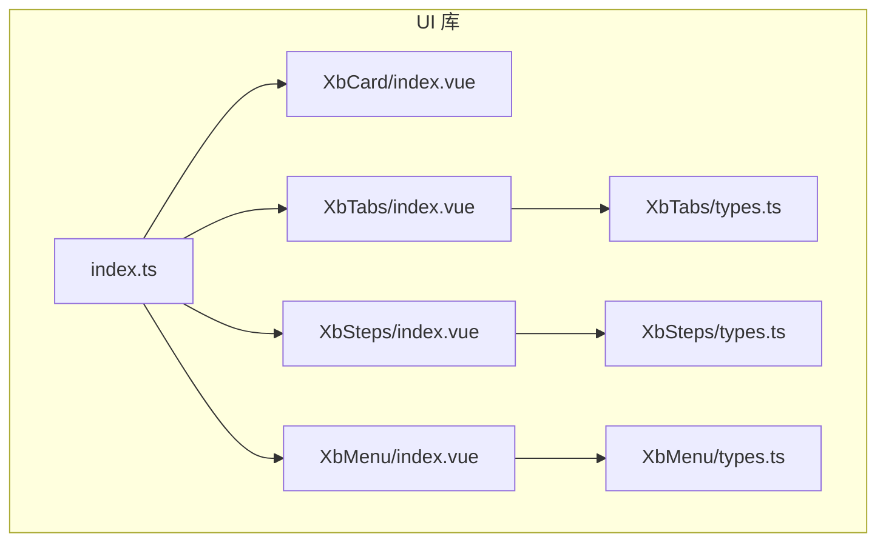
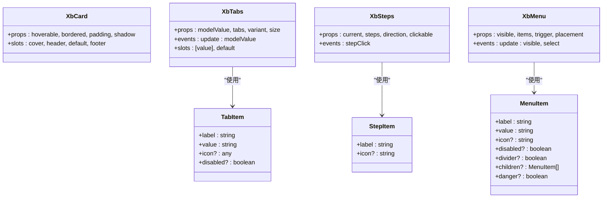
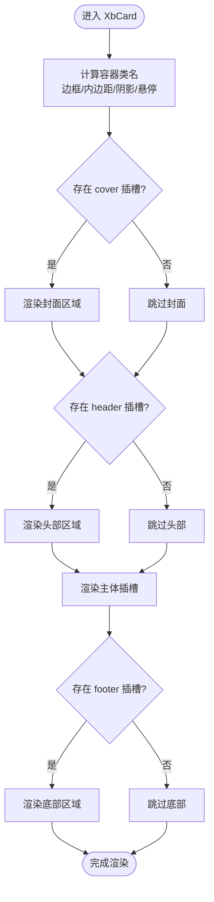
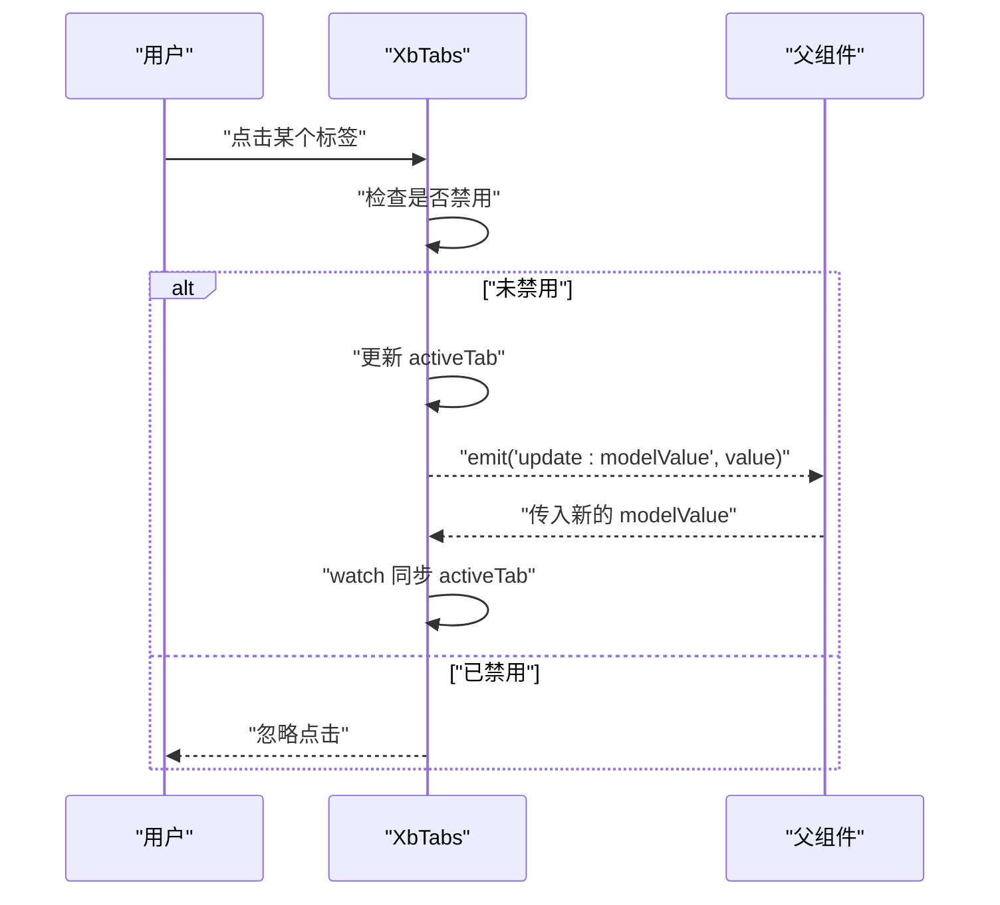
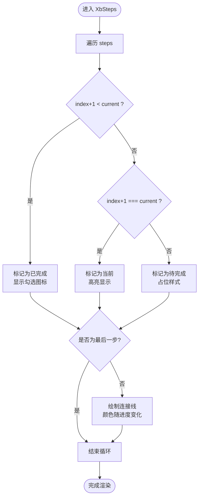
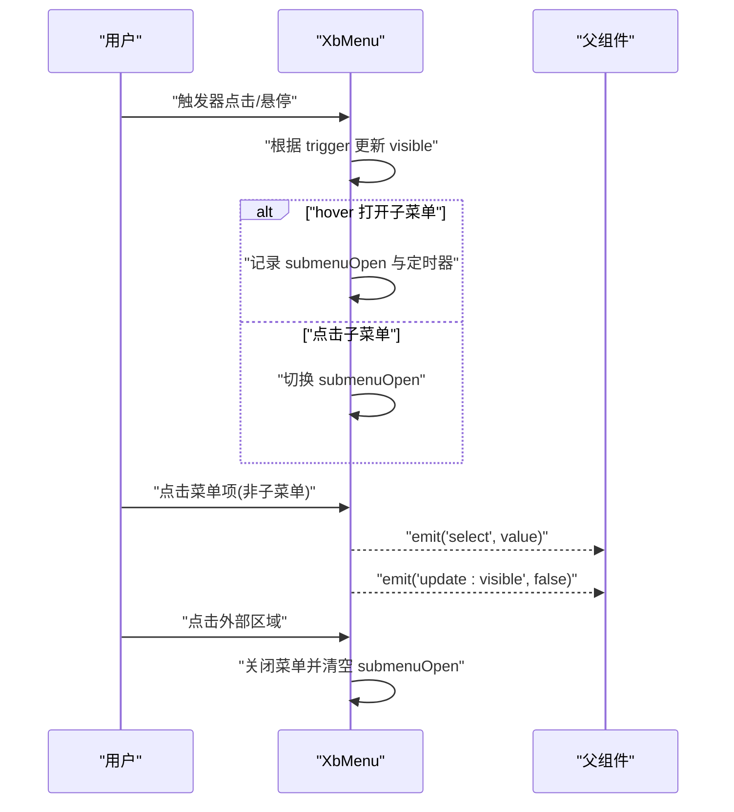
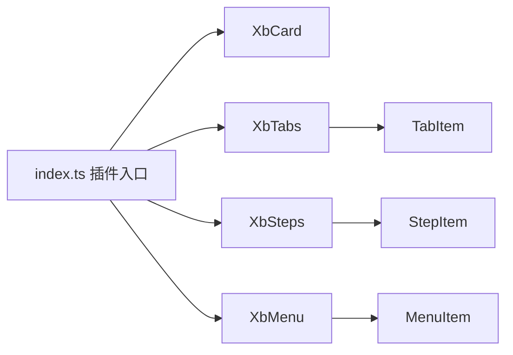

# 布局组件

<cite>
**本文引用的文件**   
- [XbCard/index.vue](file://frontend/src/xbUi/XbCard/index.vue)
- [XbTabs/index.vue](file://frontend/src/xbUi/XbTabs/index.vue)
- [XbTabs/types.ts](file://frontend/src/xbUi/XbTabs/types.ts)
- [XbSteps/index.vue](file://frontend/src/xbUi/XbSteps/index.vue)
- [XbSteps/types.ts](file://frontend/src/xbUi/XbSteps/types.ts)
- [XbMenu/index.vue](file://frontend/src/xbUi/XbMenu/index.vue)
- [XbMenu/types.ts](file://frontend/src/xbUi/XbMenu/types.ts)
- [index.ts](file://frontend/src/xbUi/index.ts)
</cite>

## 目录
1. [简介](#简介)
2. [项目结构](#项目结构)
3. [核心组件](#核心组件)
4. [架构总览](#架构总览)
5. [详细组件分析](#详细组件分析)
6. [依赖关系分析](#依赖关系分析)
7. [性能考量](#性能考量)
8. [疑难解答](#疑难解答)
9. [结论](#结论)
10. [附录：组合示例与最佳实践](#附录组合示例与最佳实践)

## 简介
本章节聚焦于前端 UI 库中的布局与导航类组件，包括卡片（XbCard）、标签页（XbTabs）、步骤条（XbSteps）和菜单（XbMenu）。文档将深入讲解这些组件的布局模式、响应式表现、嵌套使用、动态渲染等高级特性，并提供复杂页面布局的最佳实践、性能优化策略与用户体验设计指南。同时给出丰富的组合示例与实际应用场景，帮助读者快速构建高质量的管理后台或内容型页面。

## 项目结构
布局相关组件位于前端源码的 xbUi 目录下，采用“按功能分目录”的组织方式，每个组件包含独立的实现与类型定义，并通过统一的插件入口进行全局注册与按需导出。

图表来源
- [XbCard/index.vue:1-48](file://frontend/src/xbUi/XbCard/index.vue#L1-L48)
- [XbTabs/index.vue:1-83](file://frontend/src/xbUi/XbTabs/index.vue#L1-L83)
- [XbTabs/types.ts:1-7](file://frontend/src/xbUi/XbTabs/types.ts#L1-L7)
- [XbSteps/index.vue:1-90](file://frontend/src/xbSteps/index.vue#L1-L90)
- [XbSteps/types.ts:1-6](file://frontend/src/xbUi/XbSteps/types.ts#L1-L6)
- [XbMenu/index.vue:1-170](file://frontend/src/xbUi/XbMenu/index.vue#L1-L170)
- [XbMenu/types.ts:1-10](file://frontend/src/xbUi/XbMenu/types.ts#L1-L10)
- [index.ts:1-100](file://frontend/src/xbUi/index.ts#L1-L100)

章节来源
- [index.ts:1-100](file://frontend/src/xbUi/index.ts#L1-L100)

## 核心组件
本节对四个布局导航组件进行概览性说明，涵盖用途、关键属性、事件与插槽、以及典型用法要点。

- XbCard（卡片）
  - 用途：用于承载一组相关内容，提供可配置的边框、内边距、阴影与悬浮效果。
  - 关键属性：hoverable、bordered、padding、shadow。
  - 插槽：cover（封面）、header（头部）、默认插槽（主体）、footer（底部）。
  - 行为：通过计算类名组合 Tailwind 样式，支持悬停提升与阴影切换；封面区域自动撑满宽度并裁剪图片。
  - 适用场景：数据展示卡片、产品卡片、配置项容器等。

- XbTabs（标签页）
  - 用途：在有限空间内组织多组内容，支持两种变体（线型与卡片型）与三种尺寸。
  - 关键属性：modelValue（当前激活值）、tabs（标签数组）、variant、size。
  - 事件：update:modelValue。
  - 插槽：以 value 命名的具名插槽对应各标签面板，也支持默认插槽兜底。
  - 行为：双向绑定 modelValue；点击禁用标签无效；根据 variant 渲染下划线或卡片高亮；图标可通过 TabItem.icon 注入。
  - 适用场景：设置页、表单分步、内容分类浏览。

- XbSteps（步骤条）
  - 用途：引导用户完成多步流程，支持水平与垂直方向，可选点击交互。
  - 关键属性：current（当前步骤，从 1 开始）、steps（步骤列表）、direction、clickable。
  - 事件：stepClick（点击已完成的步骤时触发）。
  - 行为：已完成步骤显示勾选图标，当前步骤高亮，未完成步骤为占位态；连接线颜色随进度变化；clickable 允许提前跳转。
  - 适用场景：向导式表单、安装流程、审批流。

- XbMenu（下拉菜单）
  - 用途：提供轻量级下拉菜单与子菜单，支持点击或悬浮触发，多种放置位置。
  - 关键属性：visible、items、trigger、placement。
  - 事件：update:visible、select。
  - 行为：支持禁用、危险样式、分隔线；子菜单支持 hover 延迟关闭与点击展开；点击外部区域关闭；内置过渡动画。
  - 适用场景：工具栏操作、行内操作菜单、更多选项。

章节来源
- [XbCard/index.vue:1-48](file://frontend/src/xbUi/XbCard/index.vue#L1-L48)
- [XbTabs/index.vue:1-83](file://frontend/src/xbUi/XbTabs/index.vue#L1-L83)
- [XbTabs/types.ts:1-7](file://frontend/src/xbUi/XbTabs/types.ts#L1-L7)
- [XbSteps/index.vue:1-90](file://frontend/src/xbUi/XbSteps/index.vue#L1-L90)
- [XbSteps/types.ts:1-6](file://frontend/src/xbUi/XbSteps/types.ts#L1-L6)
- [XbMenu/index.vue:1-170](file://frontend/src/xbUi/XbMenu/index.vue#L1-L170)
- [XbMenu/types.ts:1-10](file://frontend/src/xbUi/XbMenu/types.ts#L1-L10)

## 架构总览
整体采用“组件 + 类型 + 统一插件”的架构。组件内部仅关注自身状态与交互，类型定义集中管理数据结构，插件负责全局注册与按需导出，便于在应用层灵活引入。

图表来源
- [XbTabs/index.vue:1-83](file://frontend/src/xbUi/XbTabs/index.vue#L1-L83)
- [XbTabs/types.ts:1-7](file://frontend/src/xbUi/XbTabs/types.ts#L1-L7)
- [XbSteps/index.vue:1-90](file://frontend/src/xbUi/XbSteps/index.vue#L1-L90)
- [XbSteps/types.ts:1-6](file://frontend/src/xbUi/XbSteps/types.ts#L1-L6)
- [XbMenu/index.vue:1-170](file://frontend/src/xbUi/XbMenu/index.vue#L1-L170)
- [XbMenu/types.ts:1-10](file://frontend/src/xbUi/XbMenu/types.ts#L1-L10)

## 详细组件分析

### XbCard（卡片）
- 布局模式
  - 外层容器通过计算类名组合基础样式与条件样式（边框、内边距、阴影、悬停），形成一致的视觉层级。
  - 封面区域使用负外边距与圆角处理，确保图片铺满且与卡片圆角一致。
- 响应式设计
  - 基于 Tailwind 原子类，天然适配不同屏幕尺寸；封面图片使用对象覆盖保持比例。
- 嵌套使用
  - 可在 header/footer 中嵌入按钮、标题、副标题等；body 中可嵌套表格、列表、其他卡片等。
- 动态渲染
  - 通过 v-if 控制 cover/header/footer 的显隐，减少不必要的 DOM 节点。
- 性能考虑
  - 使用 computed 生成类名，避免重复计算；无重绘密集型逻辑。

图表来源
- [XbCard/index.vue:15-38](file://frontend/src/xbUi/XbCard/index.vue#L15-L38)

章节来源
- [XbCard/index.vue:1-48](file://frontend/src/xbUi/XbCard/index.vue#L1-L48)

### XbTabs（标签页）
- 布局模式
  - 导航区根据 variant 选择线型（底部指示条）或卡片型（选中态背景与阴影）。
  - 尺寸通过 size 映射到不同的间距与字号，保证在不同密度下的可读性。
- 响应式设计
  - 使用弹性布局与紧凑间距，在小屏上仍可良好展示；长标签文本不换行，避免错位。
- 嵌套使用
  - 每个标签对应一个具名插槽（名称为 tab.value），适合放置复杂面板内容；也可在面板内再嵌套 XbCard 等容器。
- 动态渲染
  - 通过 v-for 渲染标签按钮，v-if 渲染下划线指示器；slot[name] 按需渲染当前面板。
- 交互与状态
  - 支持 disabled 标签不可点击；watch 监听外部 modelValue 同步内部 activeTab。

图表来源
- [XbTabs/index.vue:18-28](file://frontend/src/xbUi/XbTabs/index.vue#L18-L28)
- [XbTabs/index.vue:40-83](file://frontend/src/xbUi/XbTabs/index.vue#L40-L83)

章节来源
- [XbTabs/index.vue:1-83](file://frontend/src/xbUi/XbTabs/index.vue#L1-L83)
- [XbTabs/types.ts:1-7](file://frontend/src/xbUi/XbTabs/types.ts#L1-L7)

### XbSteps（步骤条）
- 布局模式
  - 水平与垂直两种方向，通过 flex 布局与条件类名切换；连接线长度与方向随方向属性变化。
- 响应式设计
  - 小屏下建议垂直方向以提升可读性；水平方向在窄屏时可结合滚动或缩小字号。
- 嵌套使用
  - 通常作为表单或流程的顶部导航，下方配合 XbForm 或自定义面板。
- 动态渲染
  - 根据 current 与 index 的关系决定样式与图标；连接线仅在非末项渲染。
- 交互与状态
  - clickable 允许点击任意步骤；否则仅允许点击已完成步骤；点击后触发 stepClick 事件由父组件驱动 current 变更。

图表来源
- [XbSteps/index.vue:30-89](file://frontend/src/xbUi/XbSteps/index.vue#L30-L89)

章节来源
- [XbSteps/index.vue:1-90](file://frontend/src/xbUi/XbSteps/index.vue#L1-L90)
- [XbSteps/types.ts:1-6](file://frontend/src/xbUi/XbSteps/types.ts#L1-L6)

### XbMenu（下拉菜单）
- 布局模式
  - 触发器通过 slot 暴露，菜单容器绝对定位，placement 控制相对位置；子菜单以绝对定位弹出。
- 响应式设计
  - 最小宽度与内边距保证触控友好；在移动端建议使用 click 触发以避免误触。
- 嵌套使用
  - 支持多级子菜单；可在触发器中放入按钮、图标或文字。
- 动态渲染
  - 通过 v-for 渲染菜单项与分隔线；子菜单根据 submenuOpen 状态决定是否显示。
- 交互与状态
  - trigger 支持 click/hover；hover 模式下子菜单有延迟关闭逻辑；点击外部区域关闭菜单；支持禁用与危险样式。

图表来源
- [XbMenu/index.vue:23-58](file://frontend/src/xbUi/XbMenu/index.vue#L23-L58)
- [XbMenu/index.vue:76-156](file://frontend/src/xbUi/XbMenu/index.vue#L76-L156)

章节来源
- [XbMenu/index.vue:1-170](file://frontend/src/xbUi/XbMenu/index.vue#L1-L170)
- [XbMenu/types.ts:1-10](file://frontend/src/xbUi/XbMenu/types.ts#L1-L10)

## 依赖关系分析
- 组件间耦合度低，各自独立维护状态，通过 props/events/slots 通信。
- 类型定义与实现分离，增强可维护性与可复用性。
- 插件入口统一注册，避免重复导入，降低应用层复杂度。

图表来源
- [index.ts:1-100](file://frontend/src/xbUi/index.ts#L1-L100)
- [XbTabs/types.ts:1-7](file://frontend/src/xbUi/XbTabs/types.ts#L1-L7)
- [XbSteps/types.ts:1-6](file://frontend/src/xbUi/XbSteps/types.ts#L1-L6)
- [XbMenu/types.ts:1-10](file://frontend/src/xbUi/XbMenu/types.ts#L1-L10)

章节来源
- [index.ts:1-100](file://frontend/src/xbUi/index.ts#L1-L100)

## 性能考量
- 计算类名与条件渲染
  - 使用 computed 生成类名，避免模板中复杂表达式导致的频繁重算。
  - 使用 v-if 控制可选区域的渲染，减少初始 DOM 体积。
- 事件与监听
  - 菜单组件在挂载时添加全局点击监听，卸载时移除，避免内存泄漏。
  - 子菜单 hover 使用定时器延迟关闭，平衡体验与性能。
- 样式与动画
  - 基于 CSS 过渡与 transform 的动画，利用 GPU 加速，减少重排重绘。
- 大数据量
  - 标签页与步骤条的数据量较大时，建议分页或懒加载面板内容，避免一次性渲染过多节点。

[本节为通用指导，不直接分析具体文件]

## 疑难解答
- 标签页无法切换
  - 检查 TabItem.disabled 是否被设置为 true；确认父组件是否正确传递并更新 modelValue。
- 步骤条点击无效
  - 若 clickable 为 false，则只能点击已完成步骤；如需自由跳转，请启用 clickable。
- 菜单点击外部不关闭
  - 确认菜单根元素 ref 正确绑定，且未被其他遮罩层拦截点击事件。
- 菜单子菜单闪烁
  - hover 模式下存在延迟关闭逻辑，避免鼠标快速进出导致闪烁；必要时改用 click 触发。
- 卡片封面图片变形
  - 确保封面图片容器宽高合理，或使用 object-fit 保持比例。

章节来源
- [XbTabs/index.vue:24-28](file://frontend/src/xbUi/XbTabs/index.vue#L24-L28)
- [XbSteps/index.vue:22-27](file://frontend/src/xbUi/XbSteps/index.vue#L22-L27)
- [XbMenu/index.vue:47-58](file://frontend/src/xbUi/XbMenu/index.vue#L47-L58)
- [XbCard/index.vue:26-28](file://frontend/src/xbUi/XbCard/index.vue#L26-L28)

## 结论
XbCard、XbTabs、XbSteps、XbMenu 四个布局导航组件提供了清晰的结构化能力与良好的交互体验。它们遵循一致的 API 设计与类型约束，易于组合与扩展。在实际项目中，建议结合业务场景选择合适的布局模式与交互方式，并通过懒加载、条件渲染与样式优化等手段提升性能与可用性。

[本节为总结性内容，不直接分析具体文件]

## 附录：组合示例与最佳实践
- 复杂页面布局
  - 使用 XbCard 作为页面主容器，header 放置页面标题与操作按钮，body 内嵌 XbTabs 组织多模块内容，footer 放置分页或辅助信息。
- 向导式表单
  - 顶部使用 XbSteps 展示流程进度，中间使用 XbTabs 切换不同阶段的内容，底部使用 XbCard 包裹表单与提交按钮。
- 工具栏与上下文菜单
  - 在表格行或工具栏中使用 XbMenu，trigger 设为 click，placement 根据屏幕空间选择 bottom-start 或 top-end。
- 响应式策略
  - 小屏优先使用垂直步骤条与卡片型标签页；在大屏上使用线型标签页与水平步骤条以获得更清晰的视觉层次。
- 可访问性
  - 为所有可交互元素提供键盘可达性；为图标提供语义化描述；确保对比度符合无障碍标准。
- 主题与风格
  - 通过品牌色与中性色变量统一视觉语言；在 hover、active、disabled 状态下保持一致的反馈。

[本节为概念性内容，不直接分析具体文件]