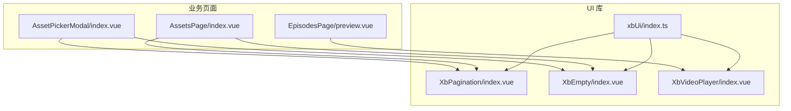
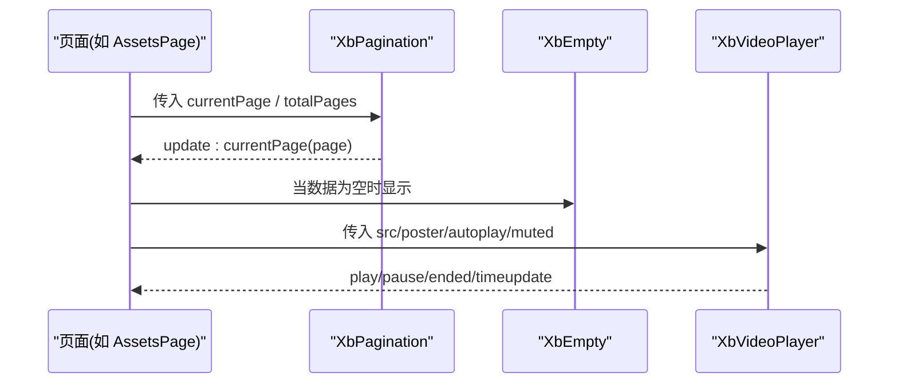
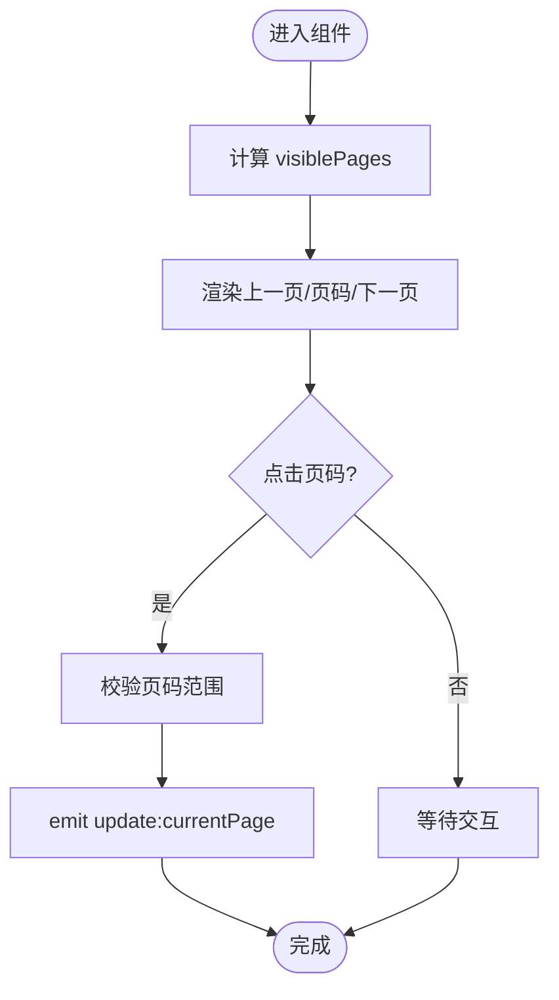
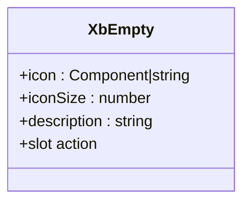
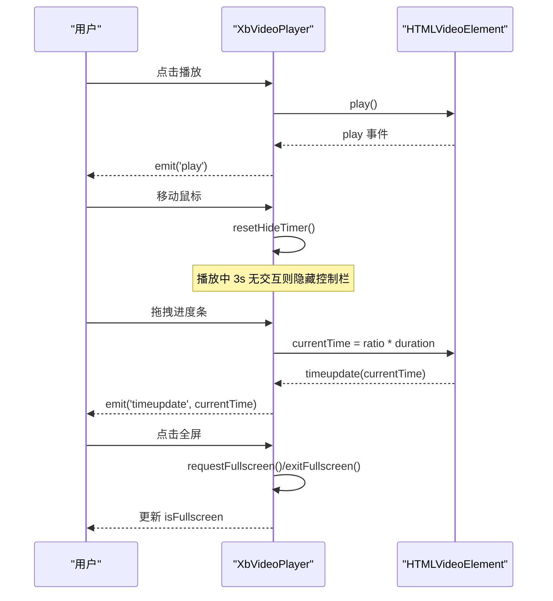
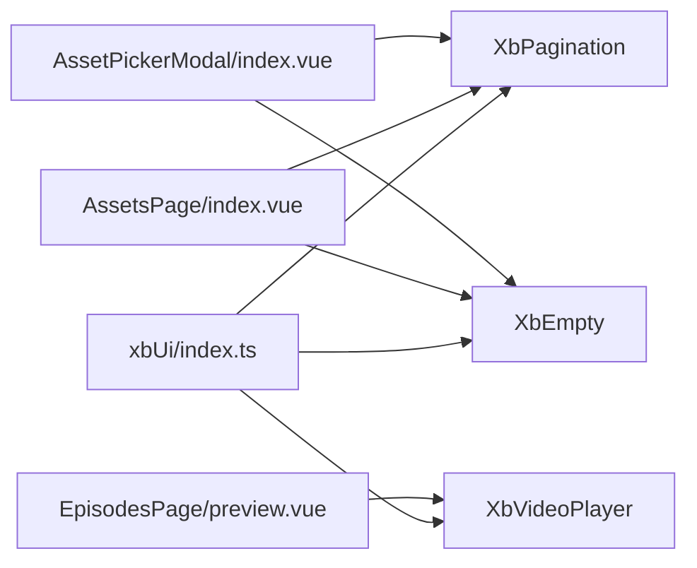

# 数据展示组件

<cite>
**本文引用的文件**   
- [XbPagination/index.vue](file://frontend/src/xbUi/XbPagination/index.vue)
- [XbEmpty/index.vue](file://frontend/src/xbUi/XbEmpty/index.vue)
- [XbVideoPlayer/index.vue](file://frontend/src/xbUi/XbVideoPlayer/index.vue)
- [xbUi/index.ts](file://frontend/src/xbUi/index.ts)
- [AssetsPage/index.vue](file://frontend/src/views/AssetsPage/index.vue)
- [AssetPickerModal/index.vue](file://frontend/src/components/AssetPickerModal/index.vue)
- [EpisodesPage/preview.vue](file://frontend/src/views/EpisodesPage/preview.vue)
</cite>

## 目录
1. [简介](#简介)
2. [项目结构](#项目结构)
3. [核心组件](#核心组件)
4. [架构总览](#架构总览)
5. [详细组件分析](#详细组件分析)
6. [依赖关系分析](#依赖关系分析)
7. [性能与大数据量优化](#性能与大数据量优化)
8. [故障排查指南](#故障排查指南)
9. [结论](#结论)
10. [附录：使用示例与最佳实践](#附录使用示例与最佳实践)

## 简介
本文件围绕数据展示相关的三个基础 UI 组件进行深入文档化，包括分页器（XbPagination）、空状态（XbEmpty）和视频播放器（XbVideoPlayer）。内容涵盖实现原理、API 与事件、交互流程、性能优化策略以及在实际页面中的集成方式。同时提供大数据量处理的最佳实践、内存管理与渲染性能优化建议，帮助读者构建稳定高效的数据展示方案。

## 项目结构
这三个组件位于前端 UI 库中，并通过统一的插件入口进行全局注册，便于在任意页面或弹窗中使用。

图表来源
- [XbPagination/index.vue:1-103](file://frontend/src/xbUi/XbPagination/index.vue#L1-L103)
- [XbEmpty/index.vue:1-32](file://frontend/src/xbUi/XbEmpty/index.vue#L1-L32)
- [XbVideoPlayer/index.vue:1-617](file://frontend/src/xbUi/XbVideoPlayer/index.vue#L1-L617)
- [xbUi/index.ts:1-100](file://frontend/src/xbUi/index.ts#L1-L100)
- [AssetsPage/index.vue:390-473](file://frontend/src/views/AssetsPage/index.vue#L390-L473)
- [AssetPickerModal/index.vue:195-227](file://frontend/src/components/AssetPickerModal/index.vue#L195-L227)
- [EpisodesPage/preview.vue:25-52](file://frontend/src/views/EpisodesPage/preview.vue#L25-L52)

章节来源
- [xbUi/index.ts:1-100](file://frontend/src/xbUi/index.ts#L1-L100)

## 核心组件
本节概述三个组件的职责与对外能力：

- XbPagination（分页器）
  - 职责：以最小 DOM 节点渲染可见页码，支持省略号折叠，双向绑定当前页。
  - 关键特性：计算可见页码范围、上一页/下一页按钮禁用态、点击跳转触发更新事件。
  - 适用场景：列表、网格等需要分页浏览的数据展示区域。

- XbEmpty（空状态）
  - 职责：统一展示“无数据”占位信息，支持自定义图标与操作插槽。
  - 关键特性：可传入字符串图标名或 Vue 组件作为图标；描述文案；action 插槽扩展操作。
  - 适用场景：筛选后无结果、首次加载为空、用户清空数据等。

- XbVideoPlayer（视频播放器）
  - 职责：封装原生 video 元素，提供播放控制、进度拖拽、倍速、静音、全屏、控制栏自动隐藏等能力。
  - 关键特性：时间格式化、播放/暂停/结束事件、timeupdate 回调、鼠标/键盘交互、全屏 API 适配。
  - 适用场景：素材预览、成片预览、媒体详情页等。

章节来源
- [XbPagination/index.vue:1-103](file://frontend/src/xbUi/XbPagination/index.vue#L1-L103)
- [XbEmpty/index.vue:1-32](file://frontend/src/xbUi/XbEmpty/index.vue#L1-L32)
- [XbVideoPlayer/index.vue:1-617](file://frontend/src/xbUi/XbVideoPlayer/index.vue#L1-L617)

## 架构总览
从组件到页面的调用关系如下：

图表来源
- [AssetsPage/index.vue:390-473](file://frontend/src/views/AssetsPage/index.vue#L390-L473)
- [AssetPickerModal/index.vue:195-227](file://frontend/src/components/AssetPickerModal/index.vue#L195-L227)
- [EpisodesPage/preview.vue:25-52](file://frontend/src/views/EpisodesPage/preview.vue#L25-L52)
- [XbPagination/index.vue:1-103](file://frontend/src/xbUi/XbPagination/index.vue#L1-L103)
- [XbEmpty/index.vue:1-32](file://frontend/src/xbUi/XbEmpty/index.vue#L1-L32)
- [XbVideoPlayer/index.vue:1-617](file://frontend/src/xbUi/XbVideoPlayer/index.vue#L1-L617)

## 详细组件分析

### XbPagination（分页器）
- 输入属性
  - currentPage：当前页码（受控）
  - totalPages：总页数
  - maxVisible：最大可见页码数（默认 7）
- 输出事件
  - update:currentPage：页码变更时发出，父级通过 v-model 风格的双向绑定接收
- 内部逻辑要点
  - visiblePages 计算属性：根据 total、current、maxVisible 计算可见页码序列，必要时插入省略号以保持中间区域宽度一致
  - goTo：边界校验后触发 update:currentPage
  - 模板：上一页/下一页按钮根据边界禁用；页码按钮高亮当前页；省略号仅展示文本
- 复杂度分析
  - 计算可见页码 O(k)，k 为 maxVisible，通常固定且较小
  - 渲染节点数量 O(k)，避免全量渲染所有页码
- 使用建议
  - 与后端分页接口配合，每次切换页码重新拉取数据
  - 在大量数据场景下，结合虚拟滚动或按需加载进一步降低首屏压力

图表来源
- [XbPagination/index.vue:18-55](file://frontend/src/xbUi/XbPagination/index.vue#L18-L55)
- [XbPagination/index.vue:58-102](file://frontend/src/xbUi/XbPagination/index.vue#L58-L102)

章节来源
- [XbPagination/index.vue:1-103](file://frontend/src/xbUi/XbPagination/index.vue#L1-L103)

### XbEmpty（空状态）
- 输入属性
  - icon：字符串图标名或 Vue 组件（默认不传时使用内置 inbox 图标）
  - iconSize：图标尺寸（默认 48）
  - description：空状态提示文案
- 插槽
  - action：用于放置额外操作按钮（例如“去生成”、“刷新”）
- 渲染策略
  - 若传入组件类型则直接渲染该组件并传递 size 属性
  - 否则使用内置图标组件渲染指定名称的图标
- 使用建议
  - 在数据请求完成后，若无数据则显示空状态
  - 通过 action 插槽提供引导性操作，提升用户体验

图表来源
- [XbEmpty/index.vue:1-32](file://frontend/src/xbUi/XbEmpty/index.vue#L1-L32)

章节来源
- [XbEmpty/index.vue:1-32](file://frontend/src/xbUi/XbEmpty/index.vue#L1-L32)

### XbVideoPlayer（视频播放器）
- 输入属性
  - src：视频地址
  - poster：封面图地址
  - autoplay：是否自动播放
  - muted：是否默认静音
- 输出事件
  - play、pause、ended、timeupdate(currentTime)
- 内部状态
  - isPlaying、currentTime、duration、volume、isMuted、isFullscreen、showControls、isDragging、playbackRate、isLoaded
- 核心功能
  - 播放/暂停、进度条拖拽、时间格式化、倍速选择、静音切换、全屏切换
  - 控制栏自动隐藏（播放状态下 3 秒无交互自动隐藏）
  - 键盘快捷键（空格键播放/暂停）
  - 监听 loadedmetadata 获取时长并初始化状态
- 生命周期与清理
  - onMounted 注册全屏、鼠标、键盘事件监听
  - onUnmounted 移除监听并清理定时器
- 性能与体验
  - 使用 preload="metadata" 减少初始加载体积
  - 拖动进度条时避免频繁 timeupdate 导致的抖动
  - 控制栏仅在播放时自动隐藏，提升沉浸感

图表来源
- [XbVideoPlayer/index.vue:84-199](file://frontend/src/xbUi/XbVideoPlayer/index.vue#L84-L199)
- [XbVideoPlayer/index.vue:209-357](file://frontend/src/xbUi/XbVideoPlayer/index.vue#L209-L357)

章节来源
- [XbVideoPlayer/index.vue:1-617](file://frontend/src/xbUi/XbVideoPlayer/index.vue#L1-L617)

## 依赖关系分析
- 组件注册
  - 所有 UI 组件通过 xbUi 插件统一注册，页面可直接使用标签形式引入
- 页面集成
  - 资产列表页使用 XbEmpty 和 XbPagination 组合呈现数据与分页
  - 资产选择弹窗同样使用这两个组件
  - 剧集预览页使用 XbVideoPlayer 进行成片预览

图表来源
- [xbUi/index.ts:1-100](file://frontend/src/xbUi/index.ts#L1-L100)
- [AssetsPage/index.vue:390-473](file://frontend/src/views/AssetsPage/index.vue#L390-L473)
- [AssetPickerModal/index.vue:195-227](file://frontend/src/components/AssetPickerModal/index.vue#L195-L227)
- [EpisodesPage/preview.vue:25-52](file://frontend/src/views/EpisodesPage/preview.vue#L25-L52)

章节来源
- [xbUi/index.ts:1-100](file://frontend/src/xbUi/index.ts#L1-L100)

## 性能与大数据量优化
针对数据展示场景，尤其是大数据量与多媒体资源，建议采用以下策略：

- 分页与懒加载
  - 使用 XbPagination 驱动后端分页，避免一次性加载全部数据
  - 在翻页前预加载下一页数据，提升切换流畅度
- 列表虚拟化
  - 对长列表启用虚拟滚动（仅渲染可视区项），显著降低 DOM 节点数量与重排开销
  - 对于图片/缩略图，使用懒加载与低质量占位图（LQIP）
- 媒体播放优化
  - 使用 preload="metadata" 减少首包大小
  - 合理设置 poster 封面，提升首帧感知速度
  - 大视频考虑分片加载或 HLS/DASH 流式播放
- 渲染与内存管理
  - 避免在列表项中创建重型子组件，按需挂载
  - 及时销毁监听器与定时器（参考 XbVideoPlayer 的生命周期清理）
  - 使用 key 稳定标识，避免不必要的组件重建
- 交互体验
  - 控制栏自动隐藏、键盘快捷键、拖拽反馈等细节提升可用性
  - 空状态提供明确引导操作，减少用户困惑

[本节为通用指导，无需具体文件引用]

## 故障排查指南
- 分页器不响应
  - 检查父组件是否正确监听 update:currentPage 并更新 currentPage
  - 确认 totalPages 大于 1，否则分页器不会渲染
- 空状态未显示
  - 确保在数据为空且非加载中才显示 XbEmpty
  - 若传入 icon 为组件，需确认组件正确导入并可渲染
- 视频无法播放
  - 检查 src 是否为有效 URL，跨域资源需配置 CORS
  - 浏览器自动播放策略可能阻止 autoplay，建议先静音再播放
  - 确认 mounted 后事件监听已注册，unmounted 后已清理

章节来源
- [XbPagination/index.vue:51-55](file://frontend/src/xbUi/XbPagination/index.vue#L51-L55)
- [XbEmpty/index.vue:14-31](file://frontend/src/xbUi/XbEmpty/index.vue#L14-L31)
- [XbVideoPlayer/index.vue:186-199](file://frontend/src/xbUi/XbVideoPlayer/index.vue#L186-L199)

## 结论
XbPagination、XbEmpty、XbVideoPlayer 构成了数据展示的基础设施：前者负责导航与数据切分，后者负责无数据的友好提示，视频播放器则提供完整的媒体交互体验。结合分页、虚拟化、懒加载与合理的生命周期管理，可在大数据量与多媒体场景下获得良好的性能与用户体验。

[本节为总结性内容，无需具体文件引用]

## 附录：使用示例与最佳实践
- 在资产列表页中组合使用空状态与分页器
  - 当 paginatedAssets 为空且非加载中时显示 XbEmpty，并提供“用 AI 生成素材”的操作
  - 当 totalPages > 1 时显示 XbPagination，并在 update:currentPage 事件中触发数据刷新
- 在资产选择弹窗中复用分页与空状态
  - 弹窗内同样遵循“空状态 + 分页”的组合模式，保持交互一致性
- 在剧集预览页使用视频播放器
  - 将生成的视频地址传入 src，必要时设置 poster 提升首帧体验
  - 监听 play/pause/ended/timeupdate 事件，实现播放统计与状态同步

章节来源
- [AssetsPage/index.vue:390-473](file://frontend/src/views/AssetsPage/index.vue#L390-L473)
- [AssetPickerModal/index.vue:195-227](file://frontend/src/components/AssetPickerModal/index.vue#L195-L227)
- [EpisodesPage/preview.vue:25-52](file://frontend/src/views/EpisodesPage/preview.vue#L25-L52)