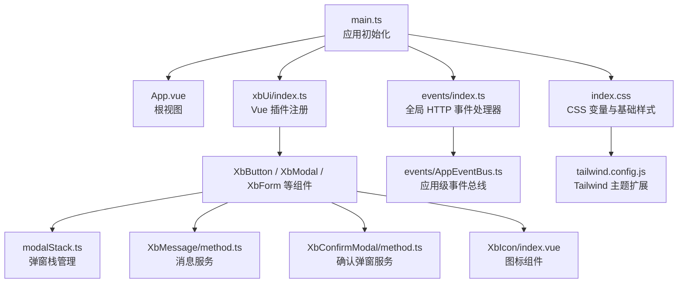
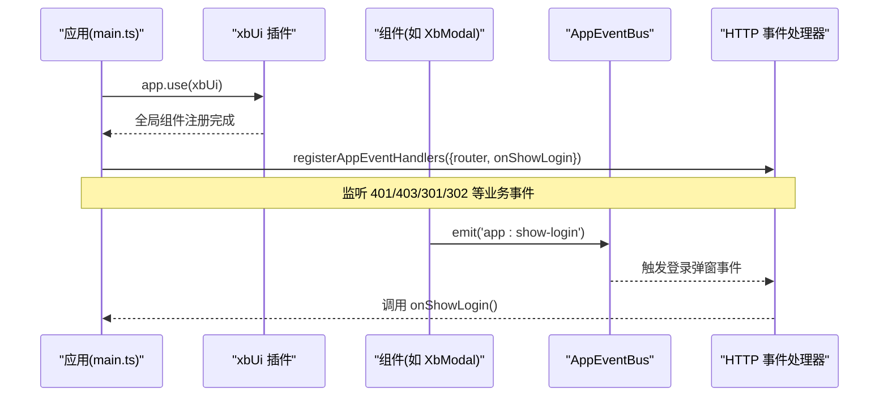
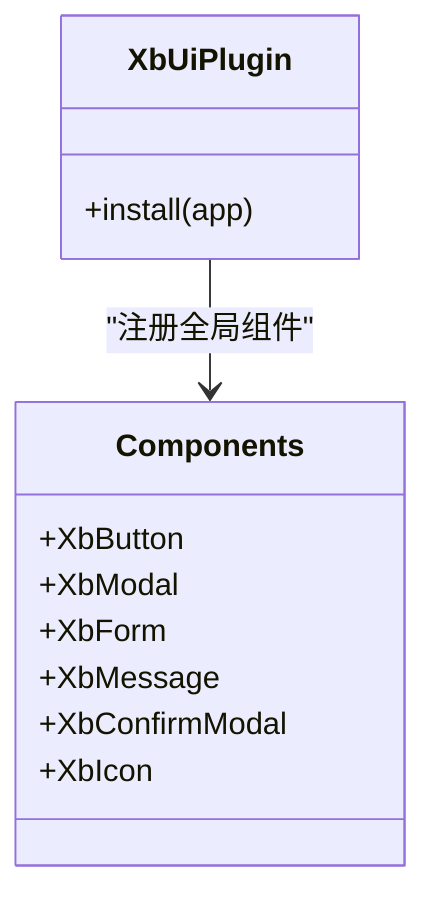
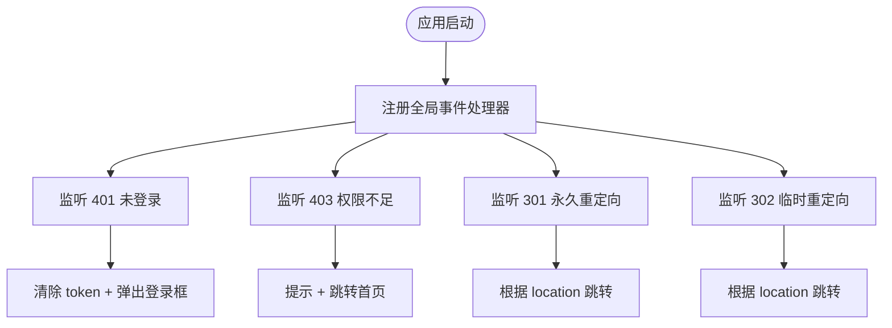
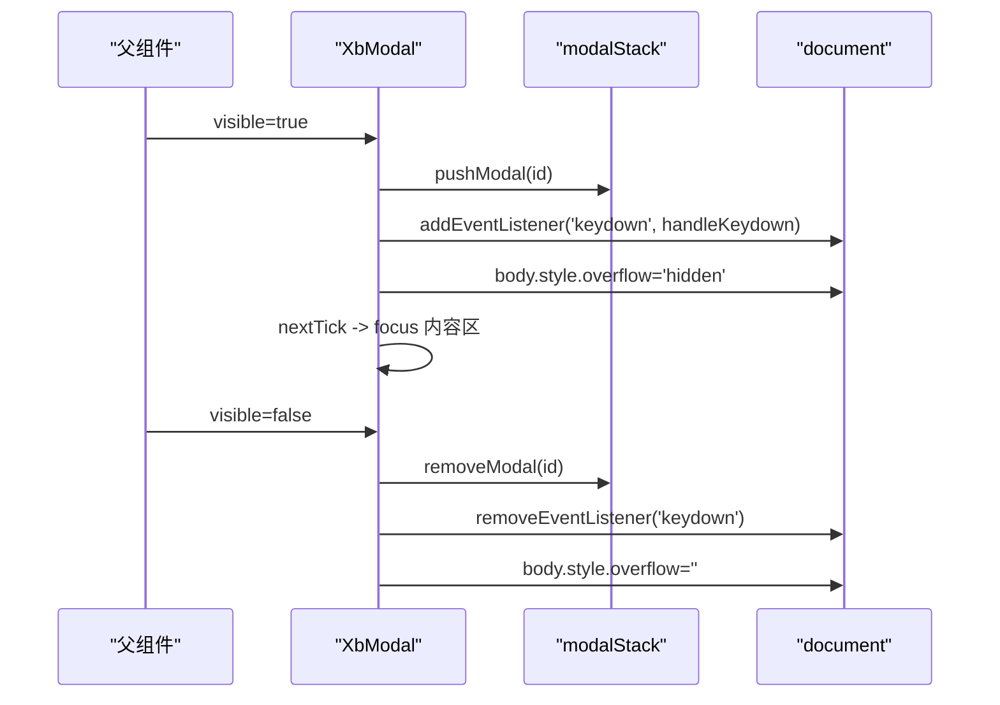
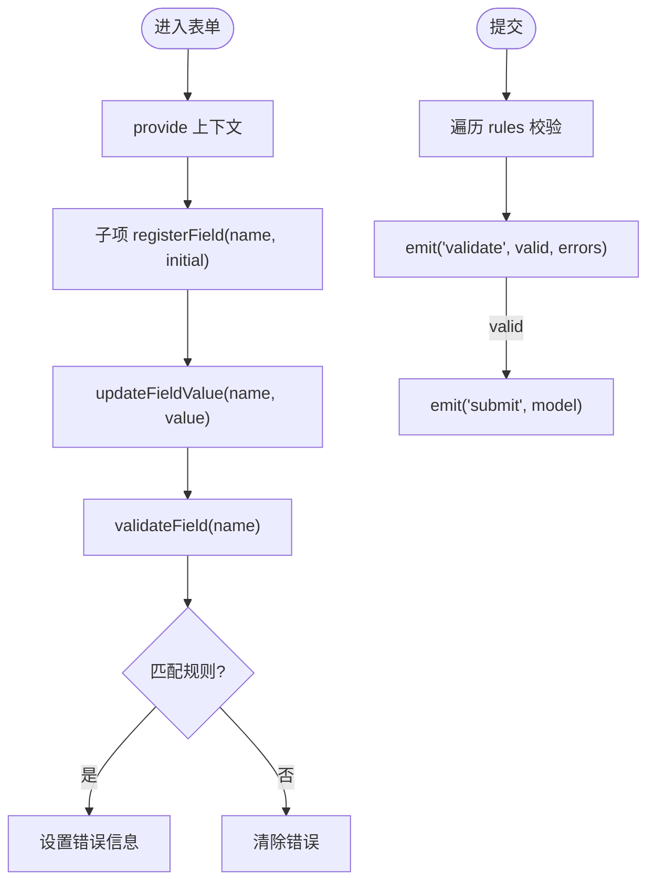
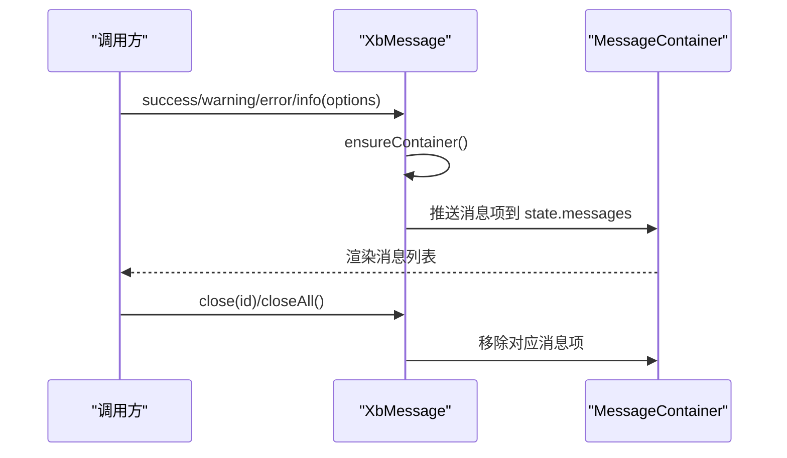
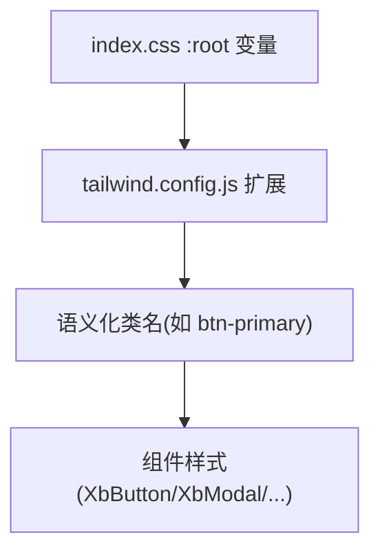
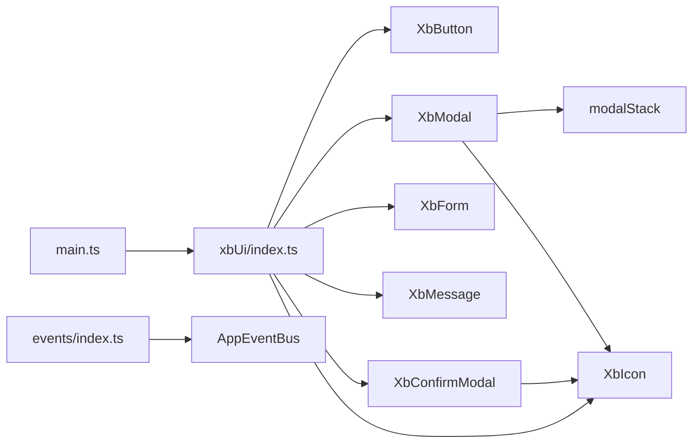

# 组件架构设计

<cite>
**本文引用的文件**   
- [frontend/src/xbUi/index.ts](file://frontend/src/xbUi/index.ts)
- [frontend/src/main.ts](file://frontend/src/main.ts)
- [frontend/src/App.vue](file://frontend/src/App.vue)
- [frontend/src/events/AppEventBus.ts](file://frontend/src/events/AppEventBus.ts)
- [frontend/src/events/index.ts](file://frontend/src/events/index.ts)
- [frontend/src/xbUi/modalStack.ts](file://frontend/src/xbUi/modalStack.ts)
- [frontend/src/xbUi/XbButton/index.vue](file://frontend/src/xbUi/XbButton/index.vue)
- [frontend/src/xbUi/XbModal/index.vue](file://frontend/src/xbUi/XbModal/index.vue)
- [frontend/src/xbUi/XbForm/index.vue](file://frontend/src/xbUi/XbForm/index.vue)
- [frontend/src/xbUi/XbForm/types.ts](file://frontend/src/xbUi/XbForm/types.ts)
- [frontend/src/xbUi/XbMessage/method.ts](file://frontend/src/xbUi/XbMessage/method.ts)
- [frontend/src/xbUi/XbConfirmModal/method.ts](file://frontend/src/xbUi/XbConfirmModal/method.ts)
- [frontend/src/xbUi/XbIcon/index.vue](file://frontend/src/xbUi/XbIcon/index.vue)
- [frontend/src/index.css](file://frontend/src/index.css)
- [frontend/tailwind.config.js](file://frontend/tailwind.config.js)
</cite>

## 目录
1. [引言](#引言)
2. [项目结构](#项目结构)
3. [核心组件](#核心组件)
4. [架构总览](#架构总览)
5. [详细组件分析](#详细组件分析)
6. [依赖关系分析](#依赖关系分析)
7. [性能考量](#性能考量)
8. [故障排查指南](#故障排查指南)
9. [结论](#结论)
10. [附录](#附录)

## 引言
本文件面向 UI 组件库的架构设计与实现规范，围绕以下目标展开：整体架构与模块化组织、组件注册机制、全局状态管理、样式系统与主题定制、事件系统、插槽机制、类型定义规范、生命周期管理、性能优化策略、可访问性支持与国际化集成方案。文档基于前端代码仓库中的 xbUi 组件库及其周边基础设施进行系统化梳理，并提供可视化图示帮助理解。

## 项目结构
前端采用 Vue 3 + TypeScript + Tailwind CSS 技术栈，组件库位于 frontend/src/xbUi 目录，通过 Vue Plugin 统一安装与按需导出；应用入口在 main.ts 中完成插件挂载与全局事件处理器注册；样式体系以 CSS 变量 + Tailwind 扩展为主，提供深色主题与品牌色体系。



图表来源
- [frontend/src/main.ts:1-21](file://frontend/src/main.ts#L1-L21)
- [frontend/src/xbUi/index.ts:1-100](file://frontend/src/xbUi/index.ts#L1-L100)
- [frontend/src/events/index.ts:1-119](file://frontend/src/events/index.ts#L1-L119)
- [frontend/src/events/AppEventBus.ts:1-109](file://frontend/src/events/AppEventBus.ts#L1-L109)
- [frontend/src/xbUi/modalStack.ts:1-29](file://frontend/src/xbUi/modalStack.ts#L1-L29)
- [frontend/src/xbUi/XbMessage/method.ts:1-116](file://frontend/src/xbUi/XbMessage/method.ts#L1-L116)
- [frontend/src/xbUi/XbConfirmModal/method.ts:1-150](file://frontend/src/xbUi/XbConfirmModal/method.ts#L1-L150)
- [frontend/src/xbUi/XbIcon/index.vue:1-148](file://frontend/src/xbUi/XbIcon/index.vue#L1-L148)
- [frontend/src/index.css:1-268](file://frontend/src/index.css#L1-L268)
- [frontend/tailwind.config.js:1-81](file://frontend/tailwind.config.js#L1-L81)

章节来源
- [frontend/src/main.ts:1-21](file://frontend/src/main.ts#L1-L21)
- [frontend/src/xbUi/index.ts:1-100](file://frontend/src/xbUi/index.ts#L1-L100)
- [frontend/src/index.css:1-268](file://frontend/src/index.css#L1-L268)
- [frontend/tailwind.config.js:1-81](file://frontend/tailwind.config.js#L1-L81)

## 核心组件
- 按钮 XbButton：支持多种视觉变体（主色、次级、幽灵、危险、描边）、尺寸、加载态、禁用态、块级布局、自定义颜色与渐变背景，并通过 CSS 变量注入动态主题色。
- 模态框 XbModal：提供丰富的动画、键盘交互、遮罩关闭、持久化模式、内容滚动区域、头部/底部插槽，结合 modalStack 管理顶层焦点与 ESC 行为。
- 表单 XbForm + XbFormItem：基于 provide/inject 提供上下文，集中校验规则与字段状态，支持同步/异步校验器、提交与重置。
- 消息 XbMessage：命令式 API，支持多位置、自动关闭、动画、图标显示与关闭控制。
- 确认弹窗 XbConfirmModal：命令式调用，返回 Promise，支持异步确认与 loading 态。
- 图标 XbIcon：统一封装 Lucide 与 LobeHub 彩色/单色图标，处理 SVG defs ID 冲突与 Avatar 风格渲染。

章节来源
- [frontend/src/xbUi/XbButton/index.vue:1-110](file://frontend/src/xbUi/XbButton/index.vue#L1-L110)
- [frontend/src/xbUi/XbModal/index.vue:1-620](file://frontend/src/xbUi/XbModal/index.vue#L1-L620)
- [frontend/src/xbUi/XbForm/index.vue:1-164](file://frontend/src/xbUi/XbForm/index.vue#L1-L164)
- [frontend/src/xbUi/XbForm/types.ts:1-15](file://frontend/src/xbUi/XbForm/types.ts#L1-L15)
- [frontend/src/xbUi/XbMessage/method.ts:1-116](file://frontend/src/xbUi/XbMessage/method.ts#L1-L116)
- [frontend/src/xbUi/XbConfirmModal/method.ts:1-150](file://frontend/src/xbUi/XbConfirmModal/method.ts#L1-L150)
- [frontend/src/xbUi/XbIcon/index.vue:1-148](file://frontend/src/xbUi/XbIcon/index.vue#L1-L148)

## 架构总览
组件库采用“插件式注册 + 命令式服务 + 全局事件总线”的三层架构：
- 插件层：xbUi 作为 Vue 插件，批量注册全局组件并导出类型，便于按需引入与类型提示。
- 服务层：XbMessage、XbConfirm 等通过 createApp 动态挂载到 body，提供命令式 API，解耦业务逻辑与 UI 呈现。
- 事件层：AppEventBus 基于 window CustomEvent 提供跨模块通信；registerAppEventHandlers 将 HTTP 拦截器事件与路由、登录弹窗、消息提示联动。



图表来源
- [frontend/src/main.ts:1-21](file://frontend/src/main.ts#L1-L21)
- [frontend/src/xbUi/index.ts:1-100](file://frontend/src/xbUi/index.ts#L1-L100)
- [frontend/src/events/AppEventBus.ts:1-109](file://frontend/src/events/AppEventBus.ts#L1-L109)
- [frontend/src/events/index.ts:1-119](file://frontend/src/events/index.ts#L1-L119)

## 详细组件分析

### 组件注册与插件机制
- 插件定义：xbUi 使用 Vue Plugin 接口，遍历 components 对象并 app.component(name, component) 注册为全局组件。
- 导出策略：同时提供默认插件导出与单个组件/类型导出，兼顾一键安装与按需引入。
- 类型导出：集中导出各组件的类型定义，提升 IDE 体验与类型安全。



图表来源
- [frontend/src/xbUi/index.ts:1-100](file://frontend/src/xbUi/index.ts#L1-L100)

章节来源
- [frontend/src/xbUi/index.ts:1-100](file://frontend/src/xbUi/index.ts#L1-L100)

### 全局状态管理与事件系统
- 应用级事件总线 AppEventBus：封装 window CustomEvent，提供 emit/on/off/once 及便捷方法（如 emitUnauthorized、emitShowLogin）。
- 全局 HTTP 事件处理器：统一监听 401/403/301/302 与业务错误、网络错误，执行清理 token、跳转路由、弹出登录框、消息提示等操作。
- 事件解耦：通过 onShowLogin 回调注入登录 UI，避免硬耦合；onMessage 可接入任意 Toast/Message 库。



图表来源
- [frontend/src/events/index.ts:1-119](file://frontend/src/events/index.ts#L1-L119)
- [frontend/src/events/AppEventBus.ts:1-109](file://frontend/src/events/AppEventBus.ts#L1-L109)

章节来源
- [frontend/src/events/AppEventBus.ts:1-109](file://frontend/src/events/AppEventBus.ts#L1-L109)
- [frontend/src/events/index.ts:1-119](file://frontend/src/events/index.ts#L1-L119)

### 模态框与弹窗栈
- 弹窗栈 modalStack：维护当前可见弹窗的 ID 栈，确保仅顶层弹窗响应键盘快捷键（ESC、Enter），并在 visible 变化时 push/remove。
- XbModal：提供丰富动画、遮罩点击关闭、持久化模式、无内边距模式、头部/主体/底部插槽、聚焦管理、body 滚动锁定。
- 生命周期：watch(visible) 控制挂载/卸载、键盘事件绑定与移除、focus 转移；onUnmounted 清理栈。



图表来源
- [frontend/src/xbUi/XbModal/index.vue:1-620](file://frontend/src/xbUi/XbModal/index.vue#L1-L620)
- [frontend/src/xbUi/modalStack.ts:1-29](file://frontend/src/xbUi/modalStack.ts#L1-L29)

章节来源
- [frontend/src/xbUi/XbModal/index.vue:1-620](file://frontend/src/xbUi/XbModal/index.vue#L1-L620)
- [frontend/src/xbUi/modalStack.ts:1-29](file://frontend/src/xbUi/modalStack.ts#L1-L29)

### 表单与校验
- 上下文提供：XbForm 通过 provide('xbFormContext') 暴露 registerField/unregisterField/updateFieldValue/validateField/getFieldError/isFieldTouched 等方法。
- 校验规则：支持 required/min/max/pattern/validator（同步或异步），validate() 聚合错误并更新 fieldStates，emit('validate', valid, errors)。
- 提交与重置：handleSubmit 先 validate，成功后 emit('submit', model)；resetFields 清空 touched 与 error。



图表来源
- [frontend/src/xbUi/XbForm/index.vue:1-164](file://frontend/src/xbUi/XbForm/index.vue#L1-L164)
- [frontend/src/xbUi/XbForm/types.ts:1-15](file://frontend/src/xbUi/XbForm/types.ts#L1-L15)

章节来源
- [frontend/src/xbUi/XbForm/index.vue:1-164](file://frontend/src/xbUi/XbForm/index.vue#L1-L164)
- [frontend/src/xbUi/XbForm/types.ts:1-15](file://frontend/src/xbUi/XbForm/types.ts#L1-L15)

### 命令式消息与确认弹窗
- XbMessage：ensureContainer 懒创建容器与应用实例，addMessage 生成唯一 id 并推入 state.messages，支持 duration 自动关闭与 closeAll。
- XbConfirm：createApp 动态挂载确认弹窗，返回 Promise；onConfirm 支持异步，loading 态由内部 ref 控制，cleanup 等待过渡后卸载。



图表来源
- [frontend/src/xbUi/XbMessage/method.ts:1-116](file://frontend/src/xbUi/XbMessage/method.ts#L1-L116)

章节来源
- [frontend/src/xbUi/XbMessage/method.ts:1-116](file://frontend/src/xbUi/XbMessage/method.ts#L1-L116)
- [frontend/src/xbUi/XbConfirmModal/method.ts:1-150](file://frontend/src/xbUi/XbConfirmModal/method.ts#L1-L150)

### 图标组件与资源管理
- XbIcon：统一处理 Lucide 与 LobeHub 图标，支持 lobe: 前缀、Avatar 风格、SVG defs ID 冲突隔离（随机后缀）与属性透传。
- 资源扩展：lobeIcons 集中管理 LobeHub 图标数据，isLobeColorIcon 判断是否彩色图标，processedLobePaths 替换 ID 引用避免冲突。

```mermaid
classDiagram
class XbIcon {
+props : name,size,strokeWidth,...
-isLobeIcon
-isLobeColorIcon
-processedLobePaths
+render()
}
class LobeIcons {
+OpenAI : {paths,hasColor,avatarBg,...}
+DeepSeek : ...
}
XbIcon --> LobeIcons : "读取图标数据"
```

图表来源
- [frontend/src/xbUi/XbIcon/index.vue:1-148](file://frontend/src/xbUi/XbIcon/index.vue#L1-L148)

章节来源
- [frontend/src/xbUi/XbIcon/index.vue:1-148](file://frontend/src/xbUi/XbIcon/index.vue#L1-L148)

### 样式系统与主题定制
- CSS 变量：在 index.css 的 :root 中定义 surface、brand、content、border、danger、gradient、shadow、transition、spacing、radius 等变量，形成统一的视觉语言。
- Tailwind 扩展：tailwind.config.js 将 CSS 变量映射到 colors、borderRadius、boxShadow、animation、keyframes，使组件可通过语义化类名快速构建界面。
- 组件样式：组件内部使用 scoped style 与 Tailwind 组合，优先使用 CSS 变量与语义化类名，保证主题一致性与可定制性。



图表来源
- [frontend/src/index.css:1-268](file://frontend/src/index.css#L1-L268)
- [frontend/tailwind.config.js:1-81](file://frontend/tailwind.config.js#L1-L81)

章节来源
- [frontend/src/index.css:1-268](file://frontend/src/index.css#L1-L268)
- [frontend/tailwind.config.js:1-81](file://frontend/tailwind.config.js#L1-L81)

## 依赖关系分析
- 组件间依赖：XbModal 依赖 XbIcon；XbForm 依赖 types；XbConfirmModal 依赖 XbIcon；XbMessage 依赖 MessageContainer。
- 运行时依赖：modalStack 被 XbModal 使用；AppEventBus 被 events/index.ts 复用；main.ts 负责装配所有子系统。



图表来源
- [frontend/src/main.ts:1-21](file://frontend/src/main.ts#L1-L21)
- [frontend/src/xbUi/index.ts:1-100](file://frontend/src/xbUi/index.ts#L1-L100)
- [frontend/src/xbUi/modalStack.ts:1-29](file://frontend/src/xbUi/modalStack.ts#L1-L29)
- [frontend/src/events/index.ts:1-119](file://frontend/src/events/index.ts#L1-L119)
- [frontend/src/events/AppEventBus.ts:1-109](file://frontend/src/events/AppEventBus.ts#L1-L109)

章节来源
- [frontend/src/main.ts:1-21](file://frontend/src/main.ts#L1-L21)
- [frontend/src/xbUi/index.ts:1-100](file://frontend/src/xbUi/index.ts#L1-L100)
- [frontend/src/xbUi/modalStack.ts:1-29](file://frontend/src/xbUi/modalStack.ts#L1-L29)
- [frontend/src/events/index.ts:1-119](file://frontend/src/events/index.ts#L1-L119)
- [frontend/src/events/AppEventBus.ts:1-109](file://frontend/src/events/AppEventBus.ts#L1-L109)

## 性能考量
- 懒挂载与按需渲染：XbMessage 与 XbConfirm 仅在首次调用时创建应用实例与 DOM 节点，减少初始开销。
- 动画与过渡：XbModal 使用 CSS transition 与 @keyframes，避免复杂 JS 计算；合理选择 animation 类型以降低重排重绘。
- 事件监听管理：XbModal 在 visible 变化时增删 document keydown 监听，避免内存泄漏；modalStack 保证仅顶层弹窗响应键盘事件。
- 样式性能：大量使用 CSS 变量与 Tailwind 原子类，减少重复样式与运行时计算；scoped style 限制作用域，降低样式冲突。
- 图标渲染：XbIcon 对彩色图标进行 ID 替换以避免重复渲染冲突，Mono 图标采用 Avatar 风格减少额外 DOM。

[本节为通用性能建议，不直接分析具体文件]

## 故障排查指南
- 401 未登录：检查 registerAppEventHandlers 是否正确注册 UNAUTHORIZED 事件；确认 localStorage 清理与 onShowLogin 回调是否生效。
- 403 权限不足：确认 FORBIDDEN 事件处理器是否跳转到首页并提示；检查路由名称配置。
- 301/302 重定向：验证 response.location 是否存在且路径正确；站内路径应使用 router.push，外部链接使用 window.location。
- 消息未显示：确保 ensureContainer 已创建 mountNode 与 app；检查 state.messages 是否被正确推送与移除。
- 确认弹窗未关闭：检查 cleanup 是否在 Promise resolve/reject 后执行；确认过渡时间足够让动画结束再卸载。
- 表单校验异常：核对 rules 配置与 validator 返回值类型；确认 updateFieldValue 与 fieldStates 同步。

章节来源
- [frontend/src/events/index.ts:1-119](file://frontend/src/events/index.ts#L1-L119)
- [frontend/src/xbUi/XbMessage/method.ts:1-116](file://frontend/src/xbUi/XbMessage/method.ts#L1-L116)
- [frontend/src/xbUi/XbConfirmModal/method.ts:1-150](file://frontend/src/xbUi/XbConfirmModal/method.ts#L1-L150)
- [frontend/src/xbUi/XbForm/index.vue:1-164](file://frontend/src/xbUi/XbForm/index.vue#L1-L164)

## 结论
该 UI 组件库以插件式注册为核心，结合命令式服务与全局事件总线，实现了高内聚、低耦合的架构。样式系统通过 CSS 变量与 Tailwind 扩展提供强大的主题定制能力；事件系统有效解耦了 HTTP 拦截器与 UI 表现；模态框与表单组件具备完善的生命周期管理与校验机制。建议在后续迭代中持续完善可访问性（ARIA 属性、键盘导航）、国际化（i18n 集成）与单元测试覆盖，进一步提升组件库的健壮性与易用性。

[本节为总结性内容，不直接分析具体文件]

## 附录
- 组件开发规范
  - 命名：组件目录与文件名保持一致，使用 PascalCase（如 XbButton）。
  - Props/Emits：使用 defineProps/defineEmits 明确类型；默认值通过 withDefaults 提供。
  - 插槽：合理使用具名插槽（header/footer/icon）与默认插槽，保持扩展性。
  - 类型：集中导出类型定义，便于消费者获得完整类型提示。
- API 设计原则
  - 一致性：相似组件遵循相同 props/emits 约定（如 visible/update:visible）。
  - 最小化：只暴露必要 API，内部细节通过私有方法与 computed 隐藏。
  - 可组合：支持与其他组件组合（如 XbModal + XbForm）。
- 事件系统设计
  - 使用 AppEventBus 统一管理全局事件，避免 window 事件污染。
  - 业务事件与 HTTP 事件分离，通过 registerAppEventHandlers 桥接。
- 插槽机制实现
  - 使用 <slot> 与 v-slot 提供灵活的内容注入，配合条件渲染与默认内容。
- 生命周期管理
  - watch(visible) 控制挂载/卸载与副作用（事件监听、DOM 操作）。
  - onUnmounted 清理资源，防止内存泄漏。
- 国际化集成方案（建议）
  - 在组件内通过 i18n 函数获取文案，避免硬编码字符串。
  - 在 XbMessage/XbConfirm 中支持 message/title 的动态翻译。
- 可访问性支持（建议）
  - 为关键交互元素添加 aria-* 属性（如 role、aria-label、aria-expanded）。
  - 确保键盘可达与焦点顺序合理，提供 skip-to-content 与 focus trap。

[本节为概念性指导，不直接分析具体文件]