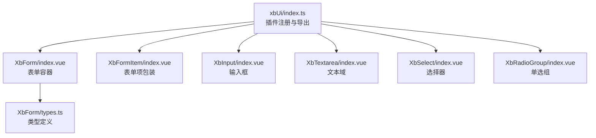
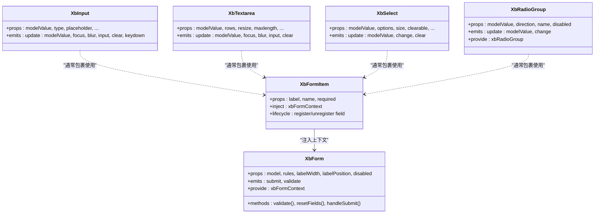
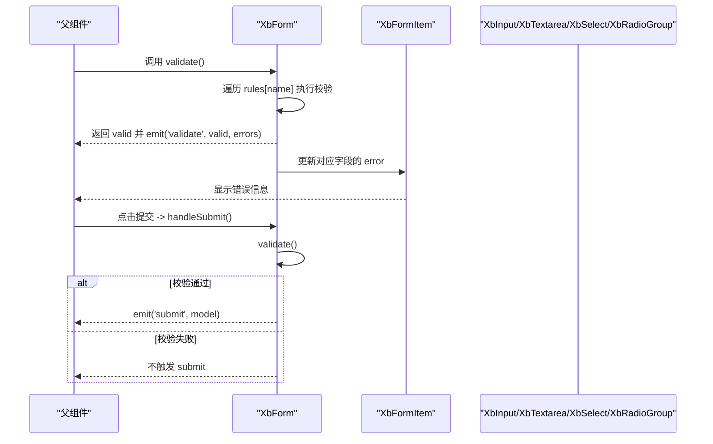
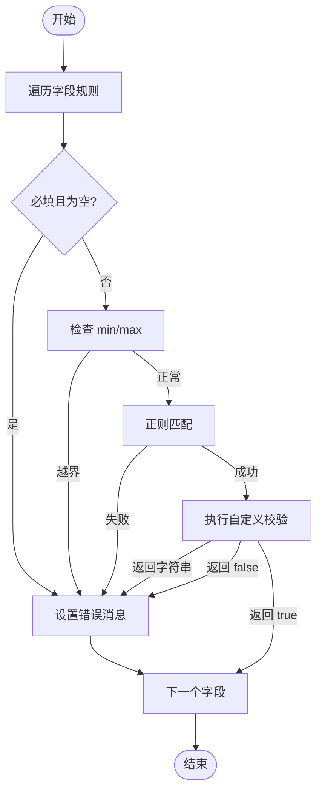
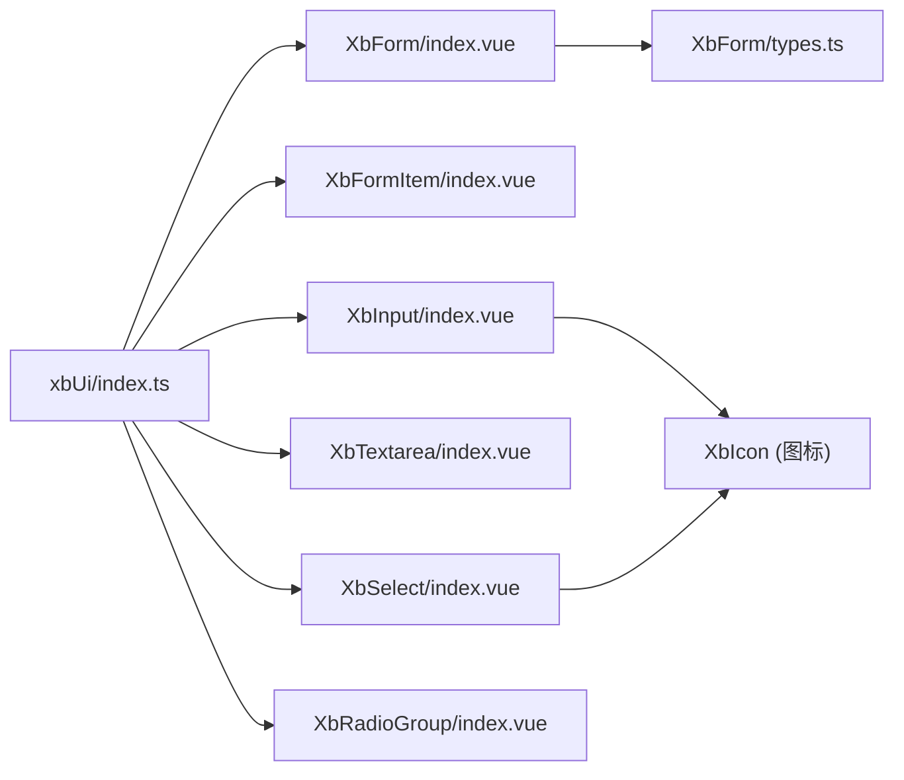

# 表单组件

<cite>
**本文引用的文件**   
- [index.ts](file://frontend/src/xbUi/index.ts)
- [XbForm/index.vue](file://frontend/src/xbUi/XbForm/index.vue)
- [XbForm/types.ts](file://frontend/src/xbUi/XbForm/types.ts)
- [XbFormItem/index.vue](file://frontend/src/xbUi/XbFormItem/index.vue)
- [XbInput/index.vue](file://frontend/src/xbUi/XbInput/index.vue)
- [XbSelect/index.vue](file://frontend/src/xbUi/XbSelect/index.vue)
- [XbTextarea/index.vue](file://frontend/src/xbUi/XbTextarea/index.vue)
- [XbRadioGroup/index.vue](file://frontend/src/xbUi/XbRadioGroup/index.vue)
</cite>

## 目录
1. [简介](#简介)
2. [项目结构](#项目结构)
3. [核心组件](#核心组件)
4. [架构总览](#架构总览)
5. [详细组件分析](#详细组件分析)
6. [依赖关系分析](#依赖关系分析)
7. [性能与体验优化](#性能与体验优化)
8. [故障排查指南](#故障排查指南)
9. [结论](#结论)
10. [附录：API 速查](#附录api-速查)

## 简介
本章节面向使用 Xb 前端 UI 库的开发者，系统化讲解表单相关组件的设计与用法，包括表单容器、表单项、输入框、选择器、文本域、单选组等。文档覆盖数据绑定、验证机制、错误处理、布局配置、自定义校验规则、复杂表单场景方案、性能优化与用户体验改进建议，帮助你在实际项目中高效构建高质量表单。

## 项目结构
表单相关组件位于 xbUi 包中，统一通过插件方式注册并提供类型导出。关键入口与组织如下：
- 组件聚合与插件注册：统一在 index.ts 中导入并全局注册，同时提供独立导出与类型导出
- 表单体系：
  - XbForm：表单容器，负责上下文提供、字段状态管理、整体校验与提交
  - XbFormItem：表单项包装，负责标签渲染、错误信息展示以及与表单上下文的联动
  - 基础输入控件：XbInput、XbTextarea、XbSelect、XbRadioGroup 等，遵循 v-model 双向绑定约定

图表来源
- [index.ts:1-100](file://frontend/src/xbUi/index.ts#L1-L100)
- [XbForm/index.vue:1-164](file://frontend/src/xbUi/XbForm/index.vue#L1-L164)
- [XbFormItem/index.vue:1-80](file://frontend/src/xbFormItem/index.vue#L1-L80)
- [XbInput/index.vue:1-177](file://frontend/src/xbUi/XbInput/index.vue#L1-L177)
- [XbTextarea/index.vue:1-168](file://frontend/src/xbUi/XbTextarea/index.vue#L1-L168)
- [XbSelect/index.vue:1-271](file://frontend/src/xbUi/XbSelect/index.vue#L1-L271)
- [XbRadioGroup/index.vue:1-43](file://frontend/src/xbUi/XbRadioGroup/index.vue#L1-L43)
- [XbForm/types.ts:1-15](file://frontend/src/xbUi/XbForm/types.ts#L1-L15)

章节来源
- [index.ts:1-100](file://frontend/src/xbUi/index.ts#L1-L100)

## 核心组件
本节从职责边界、对外 API、内部实现要点三个维度概述各组件。

- XbForm（表单容器）
  - 职责：提供表单上下文、维护字段状态、执行校验、触发提交事件
  - 对外属性：model、rules、labelWidth、labelPosition、disabled
  - 对外事件：submit、validate
  - 暴露方法：validate、resetFields、handleSubmit
  - 关键点：通过 provide/inject 向子项传递上下文；支持 required/min/max/pattern/validator 规则；异步 validator 支持 Promise

- XbFormItem（表单项包装）
  - 职责：渲染 label、插槽内容、错误提示；与表单上下文联动注册/注销字段
  - 对外属性：label、name、required
  - 关键点：根据 labelPosition 与 labelWidth 自适应布局；错误信息来自表单上下文

- XbInput（输入框）
  - 职责：通用单行输入，支持密码可见切换、清除、前/后缀插槽、尺寸控制
  - 对外属性：modelValue、type、placeholder、disabled、readonly、error、label、clearable、maxlength、tabindex、size、showPasswordToggle
  - 对外事件：update:modelValue、focus、blur、input、clear、keydown

- XbTextarea（文本域）
  - 职责：多行文本输入，支持字数统计、四角插槽、清除按钮、缩放方向
  - 对外属性：modelValue、placeholder、disabled、readonly、error、label、clearable、maxlength、countClass、rows、resize
  - 对外事件：update:modelValue、focus、blur、input、clear

- XbSelect（选择器）
  - 职责：下拉选择，支持向上/向下展开、清空、选项插槽、选中项滚动定位
  - 对外属性：modelValue、options、placeholder、disabled、error、label、clearable、size
  - 对外事件：update:modelValue、change、clear
  - 关键点：Teleport 到 body 渲染面板；实例间互斥关闭；动态计算定位避免遮挡

- XbRadioGroup（单选组）
  - 职责：为多个单选按钮提供分组上下文与值同步
  - 对外属性：modelValue、disabled、name、direction
  - 对外事件：update:modelValue、change
  - 关键点：provide 共享 value/disabled/name/change，供子项消费

章节来源
- [XbForm/index.vue:1-164](file://frontend/src/xbUi/XbForm/index.vue#L1-L164)
- [XbForm/types.ts:1-15](file://frontend/src/xbUi/XbForm/types.ts#L1-L15)
- [XbFormItem/index.vue:1-80](file://frontend/src/xbFormItem/index.vue#L1-L80)
- [XbInput/index.vue:1-177](file://frontend/src/xbUi/XbInput/index.vue#L1-L177)
- [XbTextarea/index.vue:1-168](file://frontend/src/xbUi/XbTextarea/index.vue#L1-L168)
- [XbSelect/index.vue:1-271](file://frontend/src/xbUi/XbSelect/index.vue#L1-L271)
- [XbRadioGroup/index.vue:1-43](file://frontend/src/xbUi/XbRadioGroup/index.vue#L1-L43)

## 架构总览
表单体系采用“容器 + 子项”的组合模式：
- XbForm 作为根容器，提供统一的上下文（字段注册、更新、校验、错误读取、布局参数）
- XbFormItem 作为每个字段的包装层，负责与上下文交互以及错误信息的呈现
- 具体输入控件（XbInput/XbTextarea/XbSelect/XbRadioGroup）通过 v-model 与父级 model 保持同步，并在需要时借助 XbFormItem 的错误提示

图表来源
- [XbForm/index.vue:1-164](file://frontend/src/xbUi/XbForm/index.vue#L1-L164)
- [XbFormItem/index.vue:1-80](file://frontend/src/xbFormItem/index.vue#L1-L80)
- [XbInput/index.vue:1-177](file://frontend/src/xbUi/XbInput/index.vue#L1-L177)
- [XbTextarea/index.vue:1-168](file://frontend/src/xbUi/XbTextarea/index.vue#L1-L168)
- [XbSelect/index.vue:1-271](file://frontend/src/xbUi/XbSelect/index.vue#L1-L271)
- [XbRadioGroup/index.vue:1-43](file://frontend/src/xbUi/XbRadioGroup/index.vue#L1-L43)

## 详细组件分析

### 表单容器 XbForm
- 设计要点
  - 通过 provide 暴露 xbFormContext，包含字段注册、更新、校验、错误读取、是否已触碰、布局参数等能力
  - 字段状态 fieldStates 以响应式对象维护，记录 value、error、touched
  - 支持同步与异步校验规则（validator 可返回 Promise）
  - 暴露 validate/resetFields/handleSubmit 方法，便于外部程序化控制
- 数据流
  - 子项通过 context.updateFieldValue 更新值并同步到 props.model
  - 校验失败时，context.getFieldError 返回错误消息，由 XbFormItem 渲染
- 复杂度
  - 单次 validate 遍历所有规则，时间复杂度 O(N×M)，N 为字段数，M 为规则数

图表来源
- [XbForm/index.vue:81-156](file://frontend/src/xbUi/XbForm/index.vue#L81-L156)
- [XbFormItem/index.vue:27-30](file://frontend/src/xbFormItem/index.vue#L27-L30)

章节来源
- [XbForm/index.vue:1-164](file://frontend/src/xbUi/XbForm/index.vue#L1-L164)
- [XbForm/types.ts:1-15](file://frontend/src/xbUi/XbForm/types.ts#L1-L15)

### 表单项包装 XbFormItem
- 设计要点
  - 挂载时向表单上下文注册字段，卸载时注销
  - 根据 labelPosition 与 labelWidth 调整布局样式
  - 读取表单上下文中的错误信息并渲染
- 与容器的协作
  - 通过 inject 获取 xbFormContext，确保与 XbForm 的状态一致

章节来源
- [XbFormItem/index.vue:1-80](file://frontend/src/xbFormItem/index.vue#L1-L80)

### 输入框 XbInput
- 设计要点
  - 支持多种 type（含 password），密码可见切换
  - 支持前/后缀插槽、清除按钮、尺寸控制、禁用/只读态
  - 严格遵循 v-model 约定，触发 update:modelValue 与 input/focus/blur/clear/keydown 事件
- 使用建议
  - 与 XbFormItem 组合使用时，将 error 交由表单上下文统一管理，避免重复错误提示

章节来源
- [XbInput/index.vue:1-177](file://frontend/src/xbUi/XbInput/index.vue#L1-L177)

### 文本域 XbTextarea
- 设计要点
  - 支持行数、缩放方向、字数统计、四角插槽、清除按钮
  - 与 XbFormItem 配合时，错误信息统一由表单上下文驱动
- 使用建议
  - 长文本场景建议开启 maxlength 与底部计数，提升用户输入预期

章节来源
- [XbTextarea/index.vue:1-168](file://frontend/src/xbUi/XbTextarea/index.vue#L1-L168)

### 选择器 XbSelect
- 设计要点
  - Teleport 到 body 渲染下拉面板，避免 z-index 与 overflow 问题
  - 智能定位：当下方空间不足时向上展开，保证面板始终可见
  - 多实例互斥：通过自定义事件通知其他实例关闭自身下拉
  - 自动滚动到选中项，提升长列表可用性
- 使用建议
  - 大量选项时可结合虚拟滚动或分页加载（业务侧实现）

章节来源
- [XbSelect/index.vue:1-271](file://frontend/src/xbUi/XbSelect/index.vue#L1-L271)

### 单选组 XbRadioGroup
- 设计要点
  - 提供分组上下文，集中管理当前值、禁用态与变更回调
  - 支持水平/垂直排列
- 使用建议
  - 与 XbFormItem 组合时，注意 name 唯一性以避免原生 radio 冲突

章节来源
- [XbRadioGroup/index.vue:1-43](file://frontend/src/xbUi/XbRadioGroup/index.vue#L1-L43)

### 表单验证流程（算法流程图）

图表来源
- [XbForm/index.vue:81-134](file://frontend/src/xbUi/XbForm/index.vue#L81-L134)

## 依赖关系分析
- 组件注册与导出
  - 统一在 index.ts 中导入并全局注册，同时提供独立导出与类型导出，便于按需引入
- 组件内依赖
  - XbForm 依赖 types.ts 的类型定义
  - XbSelect 依赖 XbIcon 图标组件（用于箭头与清除图标）
  - XbInput 依赖 XbIcon 图标组件（用于密码切换与清除图标）

图表来源
- [index.ts:1-100](file://frontend/src/xbUi/index.ts#L1-L100)
- [XbForm/index.vue:1-164](file://frontend/src/xbUi/XbForm/index.vue#L1-L164)
- [XbForm/types.ts:1-15](file://frontend/src/xbUi/XbForm/types.ts#L1-L15)
- [XbInput/index.vue:1-177](file://frontend/src/xbUi/XbInput/index.vue#L1-L177)
- [XbSelect/index.vue:1-271](file://frontend/src/xbUi/XbSelect/index.vue#L1-L271)

章节来源
- [index.ts:1-100](file://frontend/src/xbUi/index.ts#L1-L100)

## 性能与体验优化
- 表单校验
  - 优先使用同步规则（required/min/max/pattern），将耗时逻辑放入异步 validator，避免阻塞主线程
  - 对大型表单可考虑分步校验或懒校验（仅在字段 touched 后触发）
- 渲染与定位
  - XbSelect 使用 Teleport 与固定定位，减少重排；监听窗口滚动与 resize 仅在校验打开时更新位置
- 交互反馈
  - 输入框与文本域提供清晰的焦点态与错误态视觉反馈
  - 选择器默认滚动到选中项，提升长列表可用性
- 无障碍与键盘操作
  - 输入框支持 tabindex 与 keydown 事件透传，便于扩展快捷键
  - 单选组提供合理的 name 生成策略，避免原生 radio 冲突
- 内存与生命周期
  - XbFormItem 在卸载时主动注销字段，避免内存泄漏
  - XbSelect 在卸载时移除全局事件监听，降低副作用风险

[本节为通用指导，无需源码引用]

## 故障排查指南
- 字段未生效或未更新
  - 确认 XbFormItem 的 name 与 XbForm 的 rules/model 键名一致
  - 检查是否在 XbFormItem 中正确包裹了输入控件
- 校验不触发或错误不显示
  - 确认 XbForm 的 rules 配置完整，且字段已被 XbFormItem 注册
  - 若使用异步 validator，确保返回 Promise 或布尔/字符串结果
- 选择器下拉被遮挡或定位异常
  - 检查父容器是否存在 overflow:hidden 或 transform 影响定位
  - 观察窗口滚动与 resize 事件是否被拦截
- 单选组冲突
  - 为 XbRadioGroup 显式设置 name，避免随机名导致原生 radio 分组不一致

章节来源
- [XbForm/index.vue:25-79](file://frontend/src/xbUi/XbForm/index.vue#L25-L79)
- [XbFormItem/index.vue:15-25](file://frontend/src/xbFormItem/index.vue#L15-L25)
- [XbSelect/index.vue:145-157](file://frontend/src/xbUi/XbSelect/index.vue#L145-L157)
- [XbRadioGroup/index.vue:20-30](file://frontend/src/xbUi/XbRadioGroup/index.vue#L20-L30)

## 结论
Xb 表单组件体系以“容器 + 子项”为核心，围绕 provide/inject 实现上下文共享与状态集中管理，具备完善的验证机制与良好的交互体验。通过合理配置 rules、利用异步校验、结合布局与错误提示，可在复杂表单场景中快速构建稳定、易用、高性能的表单界面。

[本节为总结性内容，无需源码引用]

## 附录：API 速查
- XbForm
  - 属性：model、rules、labelWidth、labelPosition、disabled
  - 事件：submit、validate
  - 方法：validate、resetFields、handleSubmit
- XbFormItem
  - 属性：label、name、required
- XbInput
  - 属性：modelValue、type、placeholder、disabled、readonly、error、label、clearable、maxlength、tabindex、size、showPasswordToggle
  - 事件：update:modelValue、focus、blur、input、clear、keydown
- XbTextarea
  - 属性：modelValue、placeholder、disabled、readonly、error、label、clearable、maxlength、countClass、rows、resize
  - 事件：update:modelValue、focus、blur、input、clear
- XbSelect
  - 属性：modelValue、options、placeholder、disabled、error、label、clearable、size
  - 事件：update:modelValue、change、clear
- XbRadioGroup
  - 属性：modelValue、disabled、name、direction
  - 事件：update:modelValue、change

章节来源
- [XbForm/index.vue:4-20](file://frontend/src/xbUi/XbForm/index.vue#L4-L20)
- [XbFormItem/index.vue:3-11](file://frontend/src/xbFormItem/index.vue#L3-L11)
- [XbInput/index.vue:3-36](file://frontend/src/xbUi/XbInput/index.vue#L3-L36)
- [XbTextarea/index.vue:3-35](file://frontend/src/xbUi/XbTextarea/index.vue#L3-L35)
- [XbSelect/index.vue:12-36](file://frontend/src/xbUi/XbSelect/index.vue#L12-L36)
- [XbRadioGroup/index.vue:3-18](file://frontend/src/xbUi/XbRadioGroup/index.vue#L3-L18)