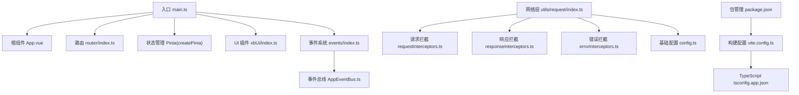
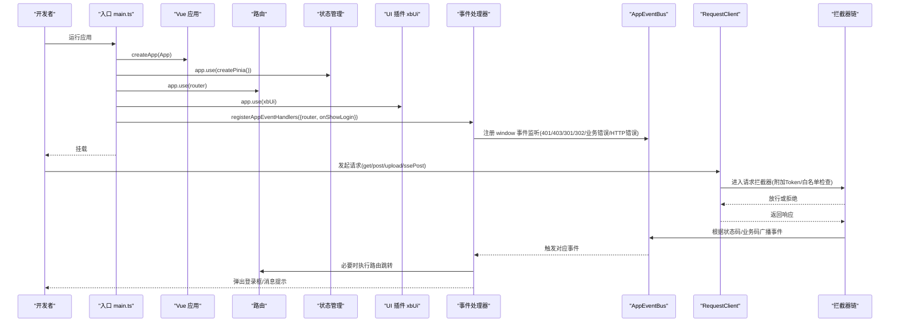
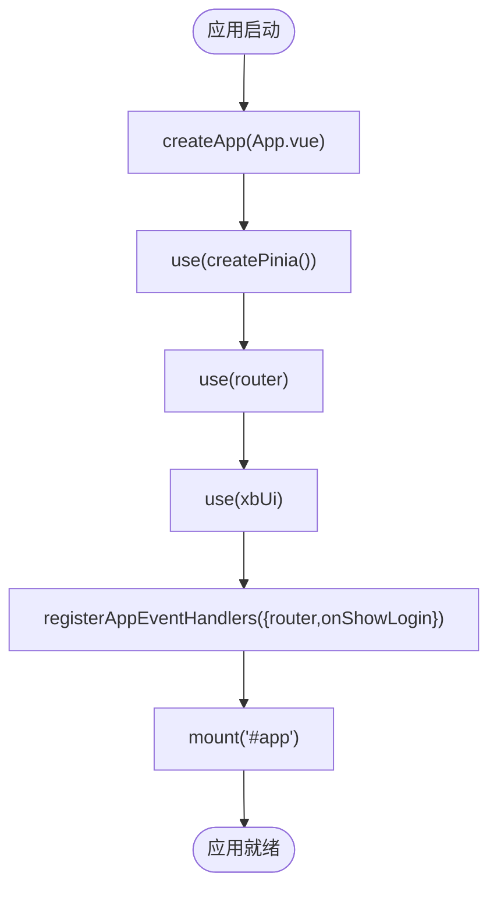
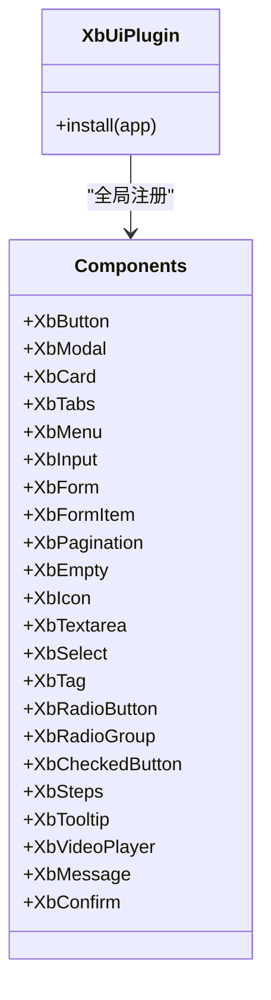
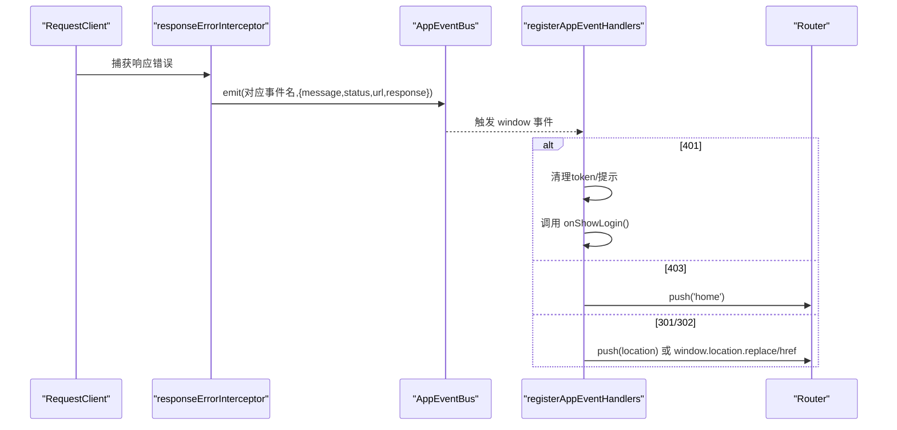
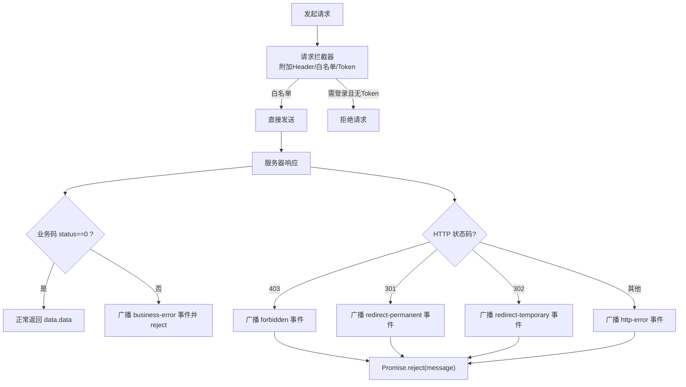
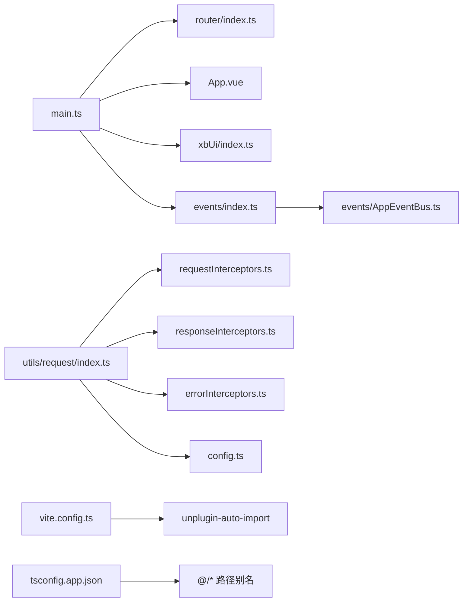

# Vue 3 应用架构

<cite>
**本文引用的文件**   
- [frontend/src/main.ts](file://frontend/src/main.ts)
- [frontend/src/App.vue](file://frontend/src/App.vue)
- [frontend/vite.config.ts](file://frontend/vite.config.ts)
- [frontend/tsconfig.json](file://frontend/tsconfig.json)
- [frontend/tsconfig.app.json](file://frontend/tsconfig.app.json)
- [frontend/package.json](file://frontend/package.json)
- [frontend/src/router/index.ts](file://frontend/src/router/index.ts)
- [frontend/src/events/index.ts](file://frontend/src/events/index.ts)
- [frontend/src/events/AppEventBus.ts](file://frontend/src/events/AppEventBus.ts)
- [frontend/src/utils/request/index.ts](file://frontend/src/utils/request/index.ts)
- [frontend/src/utils/request/config.ts](file://frontend/src/utils/request/config.ts)
- [frontend/src/utils/request/requestInterceptors.ts](file://frontend/src/utils/request/requestInterceptors.ts)
- [frontend/src/utils/request/responseInterceptors.ts](file://frontend/src/utils/request/responseInterceptors.ts)
- [frontend/src/utils/request/errorInterceptors.ts](file://frontend/src/utils/request/errorInterceptors.ts)
- [frontend/src/xbUi/index.ts](file://frontend/src/xbUi/index.ts)
</cite>

## 目录
1. [简介](#简介)
2. [项目结构](#项目结构)
3. [核心组件](#核心组件)
4. [架构总览](#架构总览)
5. [详细组件分析](#详细组件分析)
6. [依赖关系分析](#依赖关系分析)
7. [性能与构建优化](#性能与构建优化)
8. [故障排查指南](#故障排查指南)
9. [结论](#结论)

## 简介
本文件面向开发者，系统化梳理该 Vue 3 前端应用的架构设计与实现细节。重点覆盖：
- 应用初始化流程与入口职责
- 模块注册机制（路由、状态管理、UI 插件）
- 事件总线与全局 HTTP 错误处理集成
- TypeScript 与 Vite 构建配置要点
- 启动流程图、模块依赖图、请求拦截与 SSE 流式处理
- 性能优化与调试技巧

## 项目结构
前端采用模块化分层组织：
- 入口与根组件：main.ts、App.vue
- 路由：router/index.ts 及守卫
- 状态管理：Pinia（通过 createPinia 注入）
- UI 组件库：xbUi 插件统一注册
- 网络层：utils/request 封装 Axios、拦截器、SSE 支持
- 事件系统：events 提供 AppEventBus 与全局 HTTP 事件处理器
- 构建与类型：vite.config.ts、tsconfig.*、package.json

图表来源
- [frontend/src/main.ts:1-21](file://frontend/src/main.ts#L1-L21)
- [frontend/src/App.vue:1-4](file://frontend/src/App.vue#L1-L4)
- [frontend/src/router/index.ts:1-15](file://frontend/src/router/index.ts#L1-L15)
- [frontend/src/xbUi/index.ts:1-100](file://frontend/src/xbUi/index.ts#L1-L100)
- [frontend/src/events/index.ts:1-119](file://frontend/src/events/index.ts#L1-L119)
- [frontend/src/events/AppEventBus.ts:1-109](file://frontend/src/events/AppEventBus.ts#L1-L109)
- [frontend/src/utils/request/index.ts:1-237](file://frontend/src/utils/request/index.ts#L1-L237)
- [frontend/src/utils/request/config.ts:1-39](file://frontend/src/utils/request/config.ts#L1-L39)
- [frontend/src/utils/request/requestInterceptors.ts:1-47](file://frontend/src/utils/request/requestInterceptors.ts#L1-L47)
- [frontend/src/utils/request/responseInterceptors.ts:1-24](file://frontend/src/utils/request/responseInterceptors.ts#L1-L24)
- [frontend/src/utils/request/errorInterceptors.ts:1-57](file://frontend/src/utils/request/errorInterceptors.ts#L1-L57)
- [frontend/vite.config.ts:1-32](file://frontend/vite.config.ts#L1-L32)
- [frontend/tsconfig.app.json:1-27](file://frontend/tsconfig.app.json#L1-L27)
- [frontend/package.json:1-35](file://frontend/package.json#L1-L35)

章节来源
- [frontend/src/main.ts:1-21](file://frontend/src/main.ts#L1-L21)
- [frontend/src/App.vue:1-4](file://frontend/src/App.vue#L1-L4)
- [frontend/vite.config.ts:1-32](file://frontend/vite.config.ts#L1-L32)
- [frontend/tsconfig.json:1-7](file://frontend/tsconfig.json#L1-L7)
- [frontend/tsconfig.app.json:1-27](file://frontend/tsconfig.app.json#L1-L27)
- [frontend/package.json:1-35](file://frontend/package.json#L1-L35)

## 核心组件
- 应用入口 main.ts
  - 创建 Vue 应用实例并挂载根组件
  - 注册 Pinia、Router、自定义 UI 插件
  - 注册全局 HTTP 事件处理器，绑定路由与登录弹窗回调
  - 引入全局样式
- 根组件 App.vue
  - 仅包含路由视图容器，作为页面渲染出口
- 路由 router/index.ts
  - 使用 Hash 历史模式
  - 加载路由表并安装 beforeEach/afterEach 守卫
- UI 插件 xbUi/index.ts
  - 批量注册组件为全局组件
  - 同时导出单个组件与方法（如 XbMessage、XbConfirm）
- 事件系统 events/index.ts 与 AppEventBus.ts
  - 提供 AppEventBus 单例，封装 window CustomEvent
  - 提供 registerAppEventHandlers，集中监听 HTTP 相关事件并执行路由跳转或提示
- 网络层 utils/request/index.ts
  - 基于 Axios 的 RequestClient 封装
  - 自动附加 Token、白名单校验、上传进度、SSE 流式 POST
  - 通过拦截器将业务错误与 HTTP 错误转为事件广播

章节来源
- [frontend/src/main.ts:1-21](file://frontend/src/main.ts#L1-L21)
- [frontend/src/App.vue:1-4](file://frontend/src/App.vue#L1-L4)
- [frontend/src/router/index.ts:1-15](file://frontend/src/router/index.ts#L1-L15)
- [frontend/src/xbUi/index.ts:1-100](file://frontend/src/xbUi/index.ts#L1-L100)
- [frontend/src/events/index.ts:1-119](file://frontend/src/events/index.ts#L1-L119)
- [frontend/src/events/AppEventBus.ts:1-109](file://frontend/src/events/AppEventBus.ts#L1-L109)
- [frontend/src/utils/request/index.ts:1-237](file://frontend/src/utils/request/index.ts#L1-L237)

## 架构总览
下图展示从应用启动到首次渲染的关键路径，以及请求生命周期中事件系统的参与方式。

图表来源
- [frontend/src/main.ts:1-21](file://frontend/src/main.ts#L1-L21)
- [frontend/src/events/index.ts:1-119](file://frontend/src/events/index.ts#L1-L119)
- [frontend/src/events/AppEventBus.ts:1-109](file://frontend/src/events/AppEventBus.ts#L1-L109)
- [frontend/src/utils/request/index.ts:1-237](file://frontend/src/utils/request/index.ts#L1-L237)
- [frontend/src/utils/request/requestInterceptors.ts:1-47](file://frontend/src/utils/request/requestInterceptors.ts#L1-L47)
- [frontend/src/utils/request/responseInterceptors.ts:1-24](file://frontend/src/utils/request/responseInterceptors.ts#L1-L24)
- [frontend/src/utils/request/errorInterceptors.ts:1-57](file://frontend/src/utils/request/errorInterceptors.ts#L1-L57)

## 详细组件分析

### 应用初始化流程（main.ts）
- 创建应用实例并挂载根组件
- 依次注册 Pinia、Router、xbUi 插件
- 调用 registerAppEventHandlers 完成全局 HTTP 事件监听与路由/登录弹窗回调绑定
- 引入 index.css 完成全局样式注入
- 最后挂载到 #app

图表来源
- [frontend/src/main.ts:1-21](file://frontend/src/main.ts#L1-L21)

章节来源
- [frontend/src/main.ts:1-21](file://frontend/src/main.ts#L1-L21)

### 模块注册机制（xbUi 插件）
- 以 Plugin 形式暴露 install(app)，在 install 中遍历组件列表并 app.component 全局注册
- 同时导出各组件与方法，便于按需引入
- 通过 main.ts 中的 app.use(xbUi) 完成一次性注册

图表来源
- [frontend/src/xbUi/index.ts:1-100](file://frontend/src/xbUi/index.ts#L1-L100)

章节来源
- [frontend/src/xbUi/index.ts:1-100](file://frontend/src/xbUi/index.ts#L1-L100)

### 事件总线与全局 HTTP 事件处理
- AppEventBus 封装 window CustomEvent，提供 emit/on/off/once 与快捷方法（如 emitUnauthorized、emitShowLogin）
- registerAppEventHandlers 集中注册 window 事件监听，按状态码执行不同策略：
  - 401：清除 token、提示、打开登录弹窗或跳转
  - 403：提示并跳转首页
  - 301/302：解析 location，站内用 router，站外用 window.location
  - 业务错误/HTTP 错误：提示用户
- 事件由网络层拦截器统一广播，保证解耦与可测试性

图表来源
- [frontend/src/events/AppEventBus.ts:1-109](file://frontend/src/events/AppEventBus.ts#L1-L109)
- [frontend/src/events/index.ts:1-119](file://frontend/src/events/index.ts#L1-L119)
- [frontend/src/utils/request/errorInterceptors.ts:1-57](file://frontend/src/utils/request/errorInterceptors.ts#L1-L57)

章节来源
- [frontend/src/events/AppEventBus.ts:1-109](file://frontend/src/events/AppEventBus.ts#L1-L109)
- [frontend/src/events/index.ts:1-119](file://frontend/src/events/index.ts#L1-L119)
- [frontend/src/utils/request/errorInterceptors.ts:1-57](file://frontend/src/utils/request/errorInterceptors.ts#L1-L57)

### 网络层与拦截器设计
- RequestClient
  - 构造时合并默认配置与传入配置，设置 getToken 函数（默认读取 localStorage.token）
  - 统一封装 get/post/put/delete，自动解包 data.data
  - upload 支持进度回调、额外字段、自定义头、取消控制器
  - ssePost 基于 XMLHttpRequest 解析服务端推送，逐块回调文本片段
- 请求拦截器
  - 设置 accept/X-Requested-With/Content-Type（FormData 除外）
  - 白名单接口跳过 Token 校验；非白名单无 Token 直接拒绝
- 响应拦截器
  - 业务码非 0 时广播“业务错误”事件并 reject
- 错误拦截器
  - 按 HTTP 状态码广播对应事件（403/301/302/其他），携带 message/status/url/response/location 等上下文

图表来源
- [frontend/src/utils/request/index.ts:1-237](file://frontend/src/utils/request/index.ts#L1-L237)
- [frontend/src/utils/request/requestInterceptors.ts:1-47](file://frontend/src/utils/request/requestInterceptors.ts#L1-L47)
- [frontend/src/utils/request/responseInterceptors.ts:1-24](file://frontend/src/utils/request/responseInterceptors.ts#L1-L24)
- [frontend/src/utils/request/errorInterceptors.ts:1-57](file://frontend/src/utils/request/errorInterceptors.ts#L1-L57)
- [frontend/src/utils/request/config.ts:1-39](file://frontend/src/utils/request/config.ts#L1-L39)

章节来源
- [frontend/src/utils/request/index.ts:1-237](file://frontend/src/utils/request/index.ts#L1-L237)
- [frontend/src/utils/request/requestInterceptors.ts:1-47](file://frontend/src/utils/request/requestInterceptors.ts#L1-L47)
- [frontend/src/utils/request/responseInterceptors.ts:1-24](file://frontend/src/utils/request/responseInterceptors.ts#L1-L24)
- [frontend/src/utils/request/errorInterceptors.ts:1-57](file://frontend/src/utils/request/errorInterceptors.ts#L1-L57)
- [frontend/src/utils/request/config.ts:1-39](file://frontend/src/utils/request/config.ts#L1-L39)

### 路由与守卫
- 使用 Hash 历史模式
- 加载 routes 并安装 beforeEach/afterEach 守卫（具体逻辑位于 guards 目录）
- 在 main.ts 中通过 app.use(router) 注入应用

章节来源
- [frontend/src/router/index.ts:1-15](file://frontend/src/router/index.ts#L1-L15)

### TypeScript 配置
- 顶层 tsconfig.json 引用 tsconfig.app.json
- tsconfig.app.json 启用严格模式、ESNext 模块、bundler 解析、JSON 模块导入、@/* 路径别名、包含 src 与 auto-imports.d.ts/env.d.ts
- 配合 unplugin-auto-import 生成类型声明，提升开发体验

章节来源
- [frontend/tsconfig.json:1-7](file://frontend/tsconfig.json#L1-L7)
- [frontend/tsconfig.app.json:1-27](file://frontend/tsconfig.app.json#L1-L27)

### Vite 构建配置
- 启用 @vitejs/plugin-vue 与 unplugin-auto-import（自动导入 vue/vue-router/pinia API，并生成 dts）
- 配置 @ 路径别名指向 src
- 开发服务器：忽略 white.json 热更新、配置 /proxy 代理至本地后端
- 构建脚本与预览命令在 package.json 中定义

章节来源
- [frontend/vite.config.ts:1-32](file://frontend/vite.config.ts#L1-L32)
- [frontend/package.json:1-35](file://frontend/package.json#L1-L35)

## 依赖关系分析
- 入口依赖
  - main.ts 依赖 router、App.vue、xbUi 插件、事件系统、全局样式
- 事件系统依赖
  - events/index.ts 依赖 AppEventBus 与网络层事件类型
  - AppEventBus 依赖 window CustomEvent
- 网络层依赖
  - RequestClient 依赖 axios、拦截器与基础配置
  - 拦截器依赖白名单与事件总线
- 构建与类型
  - vite.config.ts 依赖 AutoImport 插件与路径别名
  - tsconfig.app.json 提供编译选项与路径映射

图表来源
- [frontend/src/main.ts:1-21](file://frontend/src/main.ts#L1-L21)
- [frontend/src/router/index.ts:1-15](file://frontend/src/router/index.ts#L1-L15)
- [frontend/src/App.vue:1-4](file://frontend/src/App.vue#L1-L4)
- [frontend/src/xbUi/index.ts:1-100](file://frontend/src/xbUi/index.ts#L1-L100)
- [frontend/src/events/index.ts:1-119](file://frontend/src/events/index.ts#L1-L119)
- [frontend/src/events/AppEventBus.ts:1-109](file://frontend/src/events/AppEventBus.ts#L1-L109)
- [frontend/src/utils/request/index.ts:1-237](file://frontend/src/utils/request/index.ts#L1-L237)
- [frontend/src/utils/request/requestInterceptors.ts:1-47](file://frontend/src/utils/request/requestInterceptors.ts#L1-L47)
- [frontend/src/utils/request/responseInterceptors.ts:1-24](file://frontend/src/utils/request/responseInterceptors.ts#L1-L24)
- [frontend/src/utils/request/errorInterceptors.ts:1-57](file://frontend/src/utils/request/errorInterceptors.ts#L1-L57)
- [frontend/src/utils/request/config.ts:1-39](file://frontend/src/utils/request/config.ts#L1-L39)
- [frontend/vite.config.ts:1-32](file://frontend/vite.config.ts#L1-L32)
- [frontend/tsconfig.app.json:1-27](file://frontend/tsconfig.app.json#L1-L27)

## 性能与构建优化
- 自动导入减少样板代码，缩短开发时间并降低重复 import 开销
- 路径别名提升可读性与维护性
- 开发代理避免跨域问题，提升联调效率
- 上传进度与 SSE 流式输出改善大文件与长任务的用户体验
- 建议
  - 对大型组件进行懒加载与路由级代码分割
  - 合理使用 Pinia 模块拆分与持久化策略
  - 生产环境开启压缩与资源缓存策略

[本节为通用指导，不直接分析具体文件]

## 故障排查指南
- 401 未登录
  - 现象：提示登录过期并弹出登录框或跳转登录页
  - 定位：检查是否已正确设置 token、白名单是否正确、拦截器是否生效
- 403 权限不足
  - 现象：提示权限不足并跳转首页
  - 定位：确认当前用户角色与资源权限配置
- 301/302 重定向
  - 现象：跳转到后端返回的 location
  - 定位：检查后端 Location 头是否为站内路径或外部地址
- 业务错误
  - 现象：提示“请求失败”
  - 定位：查看后端返回的业务码与 msg，确认响应拦截器是否正确广播事件
- 网络异常
  - 现象：提示网络异常
  - 定位：检查代理配置、CORS、超时设置与服务端可用性

章节来源
- [frontend/src/events/index.ts:1-119](file://frontend/src/events/index.ts#L1-L119)
- [frontend/src/utils/request/responseInterceptors.ts:1-24](file://frontend/src/utils/request/responseInterceptors.ts#L1-L24)
- [frontend/src/utils/request/errorInterceptors.ts:1-57](file://frontend/src/utils/request/errorInterceptors.ts#L1-L57)
- [frontend/src/utils/request/requestInterceptors.ts:1-47](file://frontend/src/utils/request/requestInterceptors.ts#L1-L47)
- [frontend/src/utils/request/config.ts:1-39](file://frontend/src/utils/request/config.ts#L1-L39)

## 结论
该应用以清晰的入口初始化流程为核心，结合 Pinia、Router 与自研 UI 插件形成稳定骨架；通过事件总线与网络层拦截器的协同，实现了统一的鉴权、重定向与错误处理机制。TypeScript 与 Vite 的配置进一步提升了开发体验与构建效率。遵循本文档的架构说明与最佳实践，有助于快速理解与扩展前端应用。