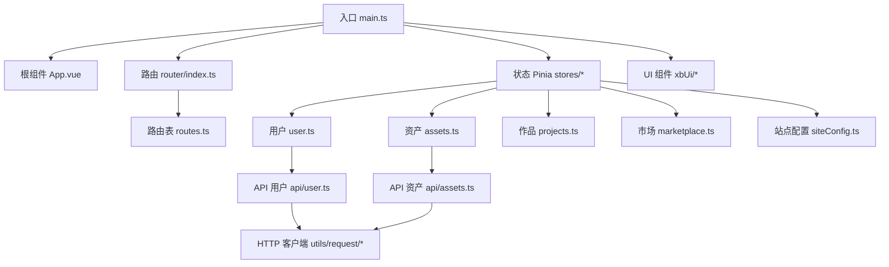
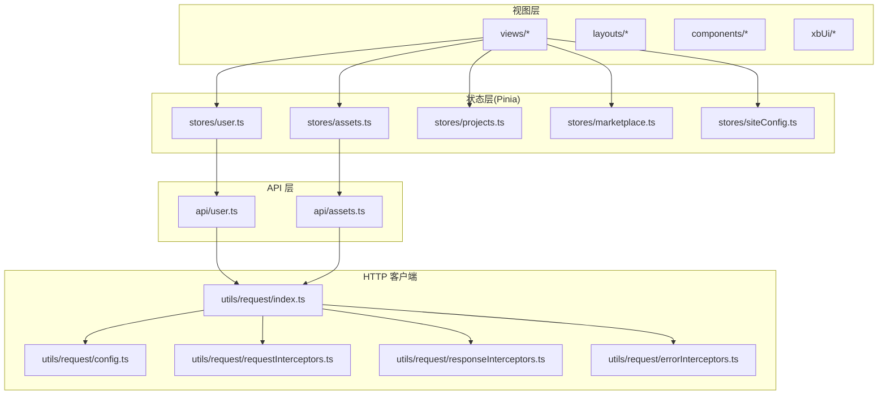
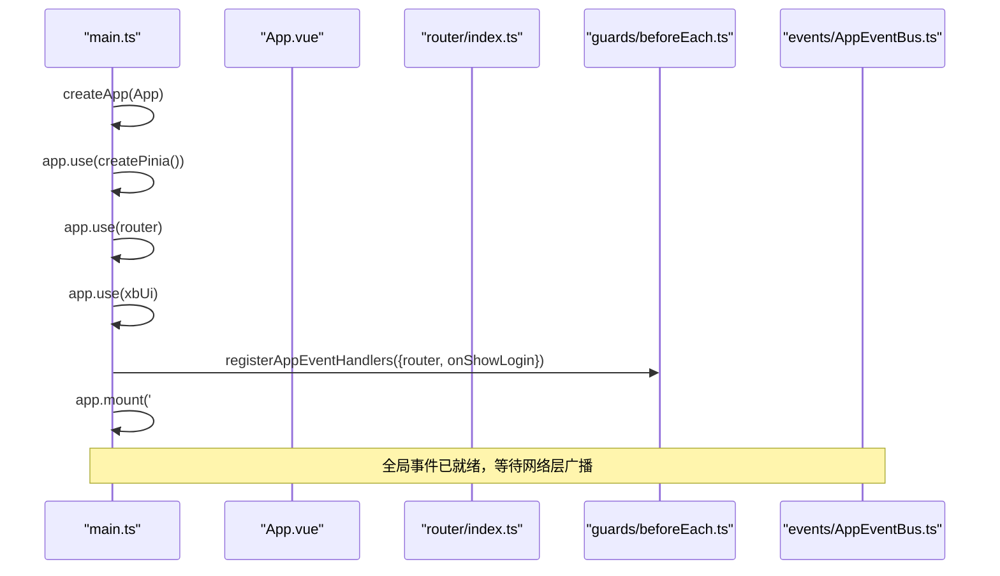
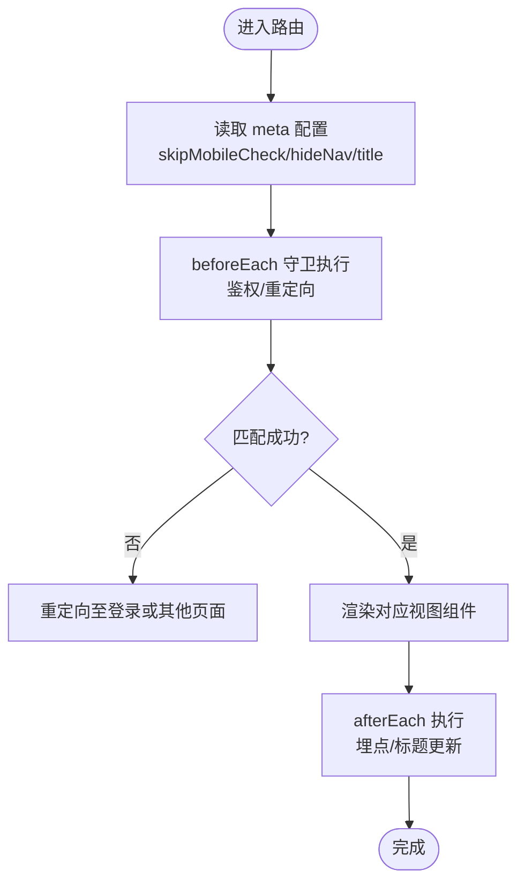
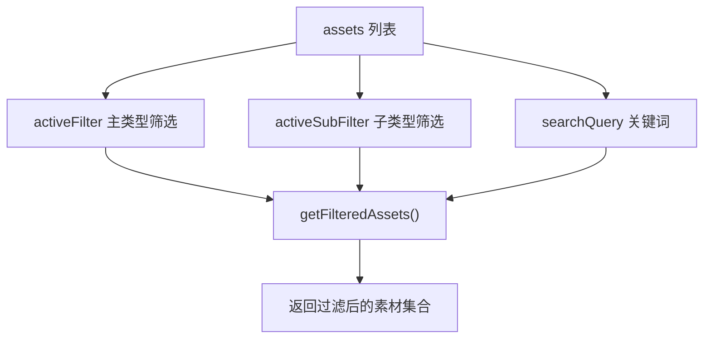
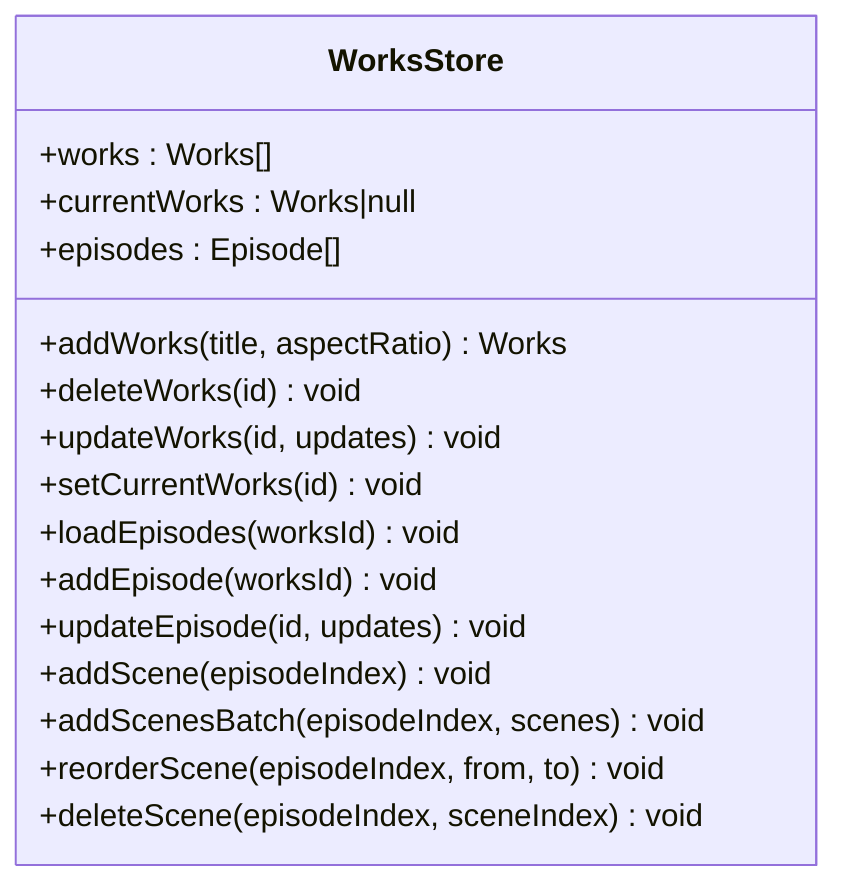
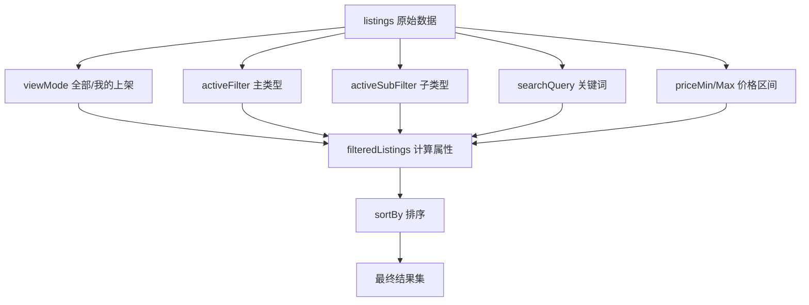
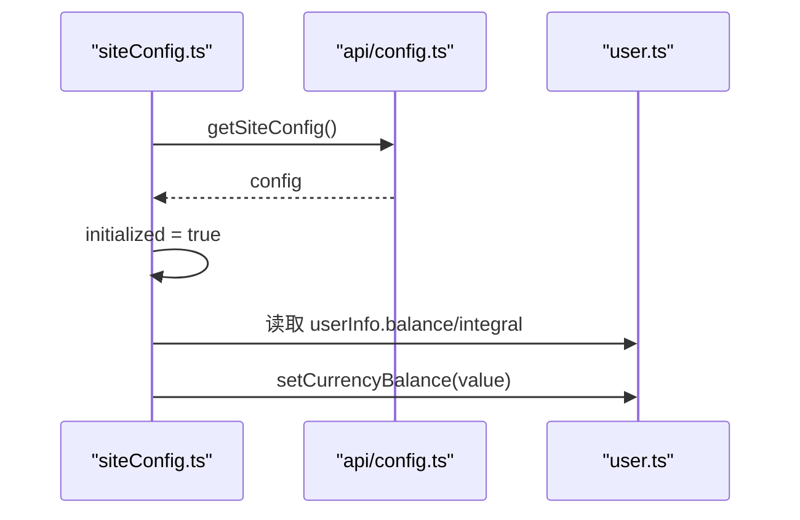
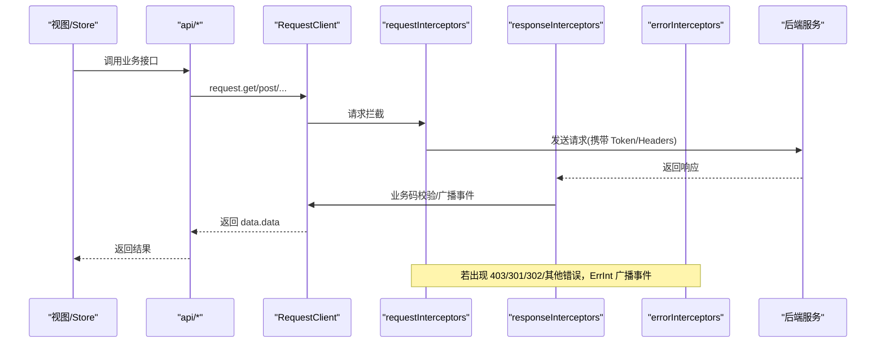
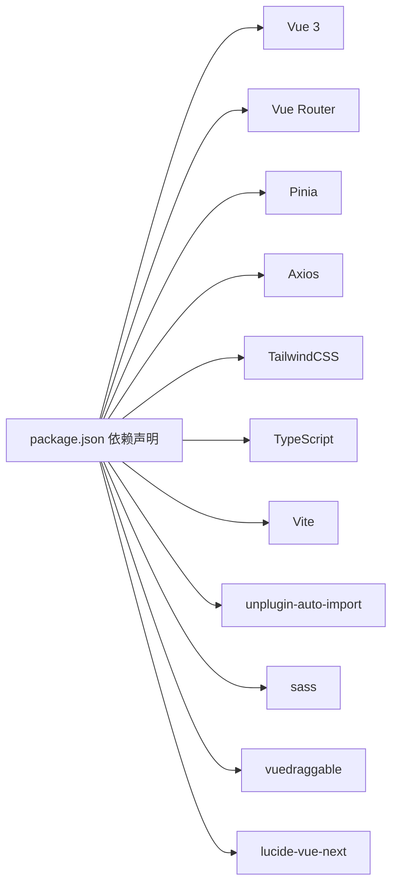

# 前端开发

<cite>
**本文引用的文件**   
- [package.json](file://frontend/package.json)
- [vite.config.ts](file://frontend/vite.config.ts)
- [main.ts](file://frontend/src/main.ts)
- [App.vue](file://frontend/src/App.vue)
- [router/index.ts](file://frontend/src/router/index.ts)
- [router/routes.ts](file://frontend/src/router/routes.ts)
- [stores/user.ts](file://frontend/src/stores/user.ts)
- [stores/assets.ts](file://frontend/src/stores/assets.ts)
- [stores/projects.ts](file://frontend/src/stores/projects.ts)
- [stores/marketplace.ts](file://frontend/src/stores/marketplace.ts)
- [stores/siteConfig.ts](file://frontend/src/stores/siteConfig.ts)
- [utils/request/index.ts](file://frontend/src/utils/request/index.ts)
- [utils/request/config.ts](file://frontend/src/utils/request/config.ts)
- [utils/request/requestInterceptors.ts](file://frontend/src/utils/request/requestInterceptors.ts)
- [utils/request/responseInterceptors.ts](file://frontend/src/utils/request/responseInterceptors.ts)
- [utils/request/errorInterceptors.ts](file://frontend/src/utils/request/errorInterceptors.ts)
- [api/user.ts](file://frontend/src/api/user.ts)
- [api/assets.ts](file://frontend/src/api/assets.ts)
</cite>

## 目录
1. [简介](#简介)
2. [项目结构](#项目结构)
3. [核心组件](#核心组件)
4. [架构总览](#架构总览)
5. [详细组件分析](#详细组件分析)
6. [依赖分析](#依赖分析)
7. [性能考虑](#性能考虑)
8. [故障排查指南](#故障排查指南)
9. [结论](#结论)
10. [附录](#附录)

## 简介
本文件面向积木云AI创作平台的前端开发者，系统性梳理基于 Vue 3 + TypeScript + Vite 的前端工程化方案。内容覆盖应用架构、路由与守卫、状态管理（Pinia）、API 客户端封装、自定义 UI 组件库、构建配置与优化策略，并提供从基础到高级的实践建议与常见问题解决方案，帮助团队高效协作与持续演进。

## 项目结构
前端采用模块化分层组织：
- 入口与全局初始化：main.ts、App.vue
- 路由：router/index.ts、router/routes.ts、router/guards/*
- 状态管理：stores/*（用户、资产、作品、市场、站点配置）
- API 层：api/*（按业务域拆分）
- HTTP 客户端：utils/request/*（Axios 封装、拦截器、白名单）
- 页面视图：views/*（按功能模块划分）
- 布局：layouts/*（顶部栏、侧边栏等）
- 通用组件：components/*（业务级复用组件）
- 自研 UI 组件：xbUi/*（按钮、表单、弹窗、消息、分页等）
- 构建与工具：vite.config.ts、tailwind.config.js、postcss.config.js、scripts/*



图表来源
- [main.ts:1-21](file://frontend/src/main.ts#L1-L21)
- [App.vue:1-4](file://frontend/src/App.vue#L1-L4)
- [router/index.ts:1-15](file://frontend/src/router/index.ts#L1-L15)
- [router/routes.ts:1-110](file://frontend/src/router/routes.ts#L1-L110)
- [stores/user.ts:1-327](file://frontend/src/stores/user.ts#L1-L327)
- [stores/assets.ts:1-161](file://frontend/src/stores/assets.ts#L1-L161)
- [stores/projects.ts:1-279](file://frontend/src/stores/projects.ts#L1-L279)
- [stores/marketplace.ts:1-334](file://frontend/src/stores/marketplace.ts#L1-L334)
- [stores/siteConfig.ts:1-100](file://frontend/src/stores/siteConfig.ts#L1-L100)
- [api/user.ts:1-226](file://frontend/src/api/user.ts#L1-L226)
- [api/assets.ts:1-135](file://frontend/src/api/assets.ts#L1-L135)
- [utils/request/index.ts:1-237](file://frontend/src/utils/request/index.ts#L1-L237)

章节来源
- [package.json:1-35](file://frontend/package.json#L1-L35)
- [vite.config.ts:1-32](file://frontend/vite.config.ts#L1-L32)
- [main.ts:1-21](file://frontend/src/main.ts#L1-L21)
- [App.vue:1-4](file://frontend/src/App.vue#L1-L4)
- [router/index.ts:1-15](file://frontend/src/router/index.ts#L1-L15)
- [router/routes.ts:1-110](file://frontend/src/router/routes.ts#L1-L110)

## 核心组件
- 应用启动与插件注册
  - 创建应用实例并挂载 Pinia、Router、自定义 UI 组件库
  - 注册全局事件处理器，统一处理鉴权相关事件（如 401/403/重定向）
- 路由系统
  - Hash 模式历史，集中式路由表，子路由与嵌套布局
  - 前置/后置守卫用于权限校验与导航行为控制
- 状态管理（Pinia）
  - 用户态：登录/登出、信息初始化、绑定解绑、头像更新
  - 资产态：素材分类、筛选、搜索、增删
  - 作品态：作品/剧集/分镜的 CRUD 与排序
  - 市场态：上架/下架、购买、交易记录、钱包余额联动
  - 站点配置：动态获取配置、货币名称与余额计算
- API 客户端
  - Axios 封装类 RequestClient，统一请求/响应拦截、错误广播、SSE 流式 POST、上传进度
  - 白名单机制：无需 Token 的接口放行
  - 类型化响应与泛型方法

章节来源
- [main.ts:1-21](file://frontend/src/main.ts#L1-L21)
- [router/index.ts:1-15](file://frontend/src/router/index.ts#L1-L15)
- [router/routes.ts:1-110](file://frontend/src/router/routes.ts#L1-L110)
- [stores/user.ts:1-327](file://frontend/src/stores/user.ts#L1-L327)
- [stores/assets.ts:1-161](file://frontend/src/stores/assets.ts#L1-L161)
- [stores/projects.ts:1-279](file://frontend/src/stores/projects.ts#L1-L279)
- [stores/marketplace.ts:1-334](file://frontend/src/stores/marketplace.ts#L1-L334)
- [stores/siteConfig.ts:1-100](file://frontend/src/stores/siteConfig.ts#L1-L100)
- [utils/request/index.ts:1-237](file://frontend/src/utils/request/index.ts#L1-L237)
- [utils/request/config.ts:1-39](file://frontend/src/utils/request/config.ts#L1-L39)
- [utils/request/requestInterceptors.ts:1-47](file://frontend/src/utils/request/requestInterceptors.ts#L1-L47)
- [utils/request/responseInterceptors.ts:1-24](file://frontend/src/utils/request/responseInterceptors.ts#L1-L24)
- [utils/request/errorInterceptors.ts:1-57](file://frontend/src/utils/request/errorInterceptors.ts#L1-L57)
- [api/user.ts:1-226](file://frontend/src/api/user.ts#L1-L226)
- [api/assets.ts:1-135](file://frontend/src/api/assets.ts#L1-L135)

## 架构总览
整体采用“视图层 -> 状态层 -> API 层 -> HTTP 客户端”的分层架构，配合路由守卫与全局事件总线实现跨模块通信与统一错误处理。



图表来源
- [stores/user.ts:1-327](file://frontend/src/stores/user.ts#L1-L327)
- [stores/assets.ts:1-161](file://frontend/src/stores/assets.ts#L1-L161)
- [stores/projects.ts:1-279](file://frontend/src/stores/projects.ts#L1-L279)
- [stores/marketplace.ts:1-334](file://frontend/src/stores/marketplace.ts#L1-L334)
- [stores/siteConfig.ts:1-100](file://frontend/src/stores/siteConfig.ts#L1-L100)
- [api/user.ts:1-226](file://frontend/src/api/user.ts#L1-L226)
- [api/assets.ts:1-135](file://frontend/src/api/assets.ts#L1-L135)
- [utils/request/index.ts:1-237](file://frontend/src/utils/request/index.ts#L1-L237)
- [utils/request/config.ts:1-39](file://frontend/src/utils/request/config.ts#L1-L39)
- [utils/request/requestInterceptors.ts:1-47](file://frontend/src/utils/request/requestInterceptors.ts#L1-L47)
- [utils/request/responseInterceptors.ts:1-24](file://frontend/src/utils/request/responseInterceptors.ts#L1-L24)
- [utils/request/errorInterceptors.ts:1-57](file://frontend/src/utils/request/errorInterceptors.ts#L1-L57)

## 详细组件分析

### 应用启动与全局初始化
- 创建应用实例，安装 Pinia、Router、自定义 UI 组件库
- 注册全局事件处理器，监听网络层广播的错误事件（如 401/403/重定向），触发登录弹窗或跳转
- 挂载到 DOM



图表来源
- [main.ts:1-21](file://frontend/src/main.ts#L1-L21)
- [App.vue:1-4](file://frontend/src/App.vue#L1-L4)
- [router/index.ts:1-15](file://frontend/src/router/index.ts#L1-L15)

章节来源
- [main.ts:1-21](file://frontend/src/main.ts#L1-L21)
- [App.vue:1-4](file://frontend/src/App.vue#L1-L4)

### 路由与导航守卫
- 使用 Hash 历史模式，集中式路由表定义页面与元信息
- 通过前置/后置守卫完成鉴权、重定向、标题设置等逻辑
- 支持移动端独立路由与嵌套布局



图表来源
- [router/index.ts:1-15](file://frontend/src/router/index.ts#L1-L15)
- [router/routes.ts:1-110](file://frontend/src/router/routes.ts#L1-L110)

章节来源
- [router/index.ts:1-15](file://frontend/src/router/index.ts#L1-L15)
- [router/routes.ts:1-110](file://frontend/src/router/routes.ts#L1-L110)

### 状态管理（Pinia）

#### 用户状态 store
- 职责：登录/登出、用户信息初始化、绑定/解绑手机号邮箱、修改密码、头像上传与更新
- 关键设计：
  - initUser 防并发重复拉取用户信息
  - 登录成功后自动拉取用户信息并持久化 token
  - 登出时清理本地状态，确保一致性

```mermaid
classDiagram
class UserStore {
+isLoggedIn : boolean
+userInfo : UserInfo
+isPhoneBound : boolean
+isEmailBound : boolean
+isWechatBound : boolean
+saveToken(token)
+getToken() string
+clearToken()
+initUser() Promise~void~
+loginAction(params) Promise~{success,message}~
+mobileLoginAction(params) Promise~{success,message}~
+emailLoginAction(params) Promise~{success,message}~
+logoutAction() Promise~void~
+registerAction(params) Promise~{success,message}~
+changePasswordAction(params) Promise~{success,message}~
+resetPasswordAction(params) Promise~{success,message}~
+bindPhone(mobile,code) Promise~{success,message}~
+unbindPhone(code) Promise~{success,message}~
+bindEmailAction(email,code) Promise~{success,message}~
+unbindEmailAction(code) Promise~{success,message}~
+updateAvatar(file) Promise~{success,message}~
+updateNickname(nickname) Promise~{success,message}~
}
```

图表来源
- [stores/user.ts:1-327](file://frontend/src/stores/user.ts#L1-L327)
- [api/user.ts:1-226](file://frontend/src/api/user.ts#L1-L226)

章节来源
- [stores/user.ts:1-327](file://frontend/src/stores/user.ts#L1-L327)
- [api/user.ts:1-226](file://frontend/src/api/user.ts#L1-L226)

#### 资产状态 store
- 职责：素材主类型/子类型定义、列表维护、筛选与搜索、新增/删除
- 复杂度：过滤逻辑 O(n)，适合中小规模数据；大数据场景可结合后端分页与虚拟滚动



图表来源
- [stores/assets.ts:1-161](file://frontend/src/stores/assets.ts#L1-L161)

章节来源
- [stores/assets.ts:1-161](file://frontend/src/stores/assets.ts#L1-L161)

#### 作品状态 store
- 职责：作品/剧集/分镜的增删改查、顺序调整、批量新增
- 特点：提供局部更新与批量操作，便于复杂编辑流程



图表来源
- [stores/projects.ts:1-279](file://frontend/src/stores/projects.ts#L1-L279)

章节来源
- [stores/projects.ts:1-279](file://frontend/src/stores/projects.ts#L1-L279)

#### 市场状态 store
- 职责：商品上架/下架、购买、交易记录、钱包余额联动、排序与筛选
- 特性：computed 派生 filteredListings，支持多条件组合与排序



图表来源
- [stores/marketplace.ts:1-334](file://frontend/src/stores/marketplace.ts#L1-L334)

章节来源
- [stores/marketplace.ts:1-334](file://frontend/src/stores/marketplace.ts#L1-L334)

#### 站点配置 store
- 职责：异步加载站点配置、根据配置决定货币名称与余额字段、提供便捷方法
- 与用户 store 联动：读写 balance/integral 取决于 recharge_type



图表来源
- [stores/siteConfig.ts:1-100](file://frontend/src/stores/siteConfig.ts#L1-L100)
- [stores/user.ts:1-327](file://frontend/src/stores/user.ts#L1-L327)

章节来源
- [stores/siteConfig.ts:1-100](file://frontend/src/stores/siteConfig.ts#L1-L100)
- [stores/user.ts:1-327](file://frontend/src/stores/user.ts#L1-L327)

### API 客户端封装
- RequestClient 封装 Axios，提供 GET/POST/PUT/DELETE/upload/ssePost 等方法
- 请求拦截器：自动附加 Authorization、Content-Type、X-Requested-With；白名单免鉴权
- 响应拦截器：统一业务码判断并广播事件
- 错误拦截器：按 HTTP 状态码广播 forbidden/redirect/http-error 等事件
- SSE 流式 POST：基于 XMLHttpRequest 解析 text/event-stream，支持取消与进度回调



图表来源
- [utils/request/index.ts:1-237](file://frontend/src/utils/request/index.ts#L1-L237)
- [utils/request/config.ts:1-39](file://frontend/src/utils/request/config.ts#L1-L39)
- [utils/request/requestInterceptors.ts:1-47](file://frontend/src/utils/request/requestInterceptors.ts#L1-L47)
- [utils/request/responseInterceptors.ts:1-24](file://frontend/src/utils/request/responseInterceptors.ts#L1-L24)
- [utils/request/errorInterceptors.ts:1-57](file://frontend/src/utils/request/errorInterceptors.ts#L1-L57)

章节来源
- [utils/request/index.ts:1-237](file://frontend/src/utils/request/index.ts#L1-L237)
- [utils/request/config.ts:1-39](file://frontend/src/utils/request/config.ts#L1-L39)
- [utils/request/requestInterceptors.ts:1-47](file://frontend/src/utils/request/requestInterceptors.ts#L1-L47)
- [utils/request/responseInterceptors.ts:1-24](file://frontend/src/utils/request/responseInterceptors.ts#L1-L24)
- [utils/request/errorInterceptors.ts:1-57](file://frontend/src/utils/request/errorInterceptors.ts#L1-L57)

### 自定义 UI 组件库（xbUi）
- 提供常用基础组件：按钮、卡片、输入、文本域、选择、单选组、步骤、标签、分页、图标、视频播放器、确认弹窗、消息提示等
- 通过全局插件方式安装，减少样板代码，统一交互体验
- 建议：为每个组件编写类型定义与文档注释，保持 props/events 稳定

章节来源
- [main.ts:1-21](file://frontend/src/main.ts#L1-L21)

## 依赖分析
- 运行时依赖
  - Vue 3、Vue Router、Pinia、Axios、Sass、拖拽库 vuedraggable、Lucide 图标
- 开发依赖
  - Vite、@vitejs/plugin-vue、TypeScript、vue-tsc、TailwindCSS、PostCSS、AutoImport、Sharp（图片压缩脚本）
- 构建与代理
  - Vite 开发服务器启用代理 /proxy 转发至本地后端
  - AutoImport 自动导入 vue/vue-router/pinia 常用 API，生成 dts 提升 TS 体验



图表来源
- [package.json:1-35](file://frontend/package.json#L1-L35)
- [vite.config.ts:1-32](file://frontend/vite.config.ts#L1-L32)

章节来源
- [package.json:1-35](file://frontend/package.json#L1-L35)
- [vite.config.ts:1-32](file://frontend/vite.config.ts#L1-L32)

## 性能考虑
- 路由懒加载：所有页面组件采用动态 import，降低首屏体积
- 自动导入：使用 unplugin-auto-import 减少手动引入，提高开发效率
- 静态资源优化：提供图片压缩脚本，生产环境可集成 Sharp 进行图片转 WebP/AVIF
- 样式按需：Tailwind 仅打包使用的原子类，避免冗余
- 网络优化：
  - 合理设置超时与重试策略
  - 大文件上传使用 FormData 与进度反馈
  - SSE 流式输出避免长轮询
- 缓存策略：对不频繁变化的配置与字典数据做内存缓存，必要时结合浏览器缓存

[本节为通用指导，不涉及具体文件分析]

## 故障排查指南
- 登录过期/无权限
  - 现象：401/403 或重定向
  - 定位：检查请求拦截器是否注入 Authorization，白名单是否正确
  - 处理：全局事件总线广播后，在入口处统一弹出登录框或跳转
- 业务错误
  - 现象：后端返回 status !== 0
  - 定位：响应拦截器会抛出错误并广播 business-error
  - 处理：在入口处订阅事件，展示 Toast 或引导用户修正
- 网络异常
  - 现象：超时、断网、CORS
  - 定位：错误拦截器广播 http-error
  - 处理：提示网络异常，提供重试或切换网络
- 上传失败
  - 现象：上传中断或进度不更新
  - 定位：检查 upload 方法的 onUploadProgress 与 AbortController
  - 处理：增加重试与错误提示，必要时限制文件大小与类型

章节来源
- [utils/request/responseInterceptors.ts:1-24](file://frontend/src/utils/request/responseInterceptors.ts#L1-L24)
- [utils/request/errorInterceptors.ts:1-57](file://frontend/src/utils/request/errorInterceptors.ts#L1-L57)
- [utils/request/requestInterceptors.ts:1-47](file://frontend/src/utils/request/requestInterceptors.ts#L1-L47)
- [utils/request/index.ts:1-237](file://frontend/src/utils/request/index.ts#L1-L237)

## 结论
本项目以清晰的层次结构与完善的工程化配置为基础，结合 Pinia 的状态管理与统一的 HTTP 客户端封装，实现了可扩展、易维护的前端架构。通过路由懒加载、自动导入、Tailwind 按需与 SSE 流式能力，兼顾了开发体验与运行性能。建议在后续迭代中完善单元测试、E2E 测试与监控埋点，进一步提升质量与可观测性。

[本节为总结，不涉及具体文件分析]

## 附录
- 开发规范建议
  - 命名：组件 PascalCase，文件 kebab-case；变量与方法 camelCase；常量 UPPER_SNAKE_CASE
  - 类型：API 层严格定义入参与返回值，store 暴露最小必要接口
  - 错误：统一错误广播与用户提示，避免分散 try/catch
  - 日志：关键路径埋点，区分 warn/error
- 最佳实践清单
  - 路由懒加载、组件按需引入
  - 状态最小化与派生数据 computed
  - 网络请求去抖/节流与取消控制器
  - 上传前校验与分片（可选）
  - 国际化与主题扩展预留接口

[本节为通用指导，不涉及具体文件分析]