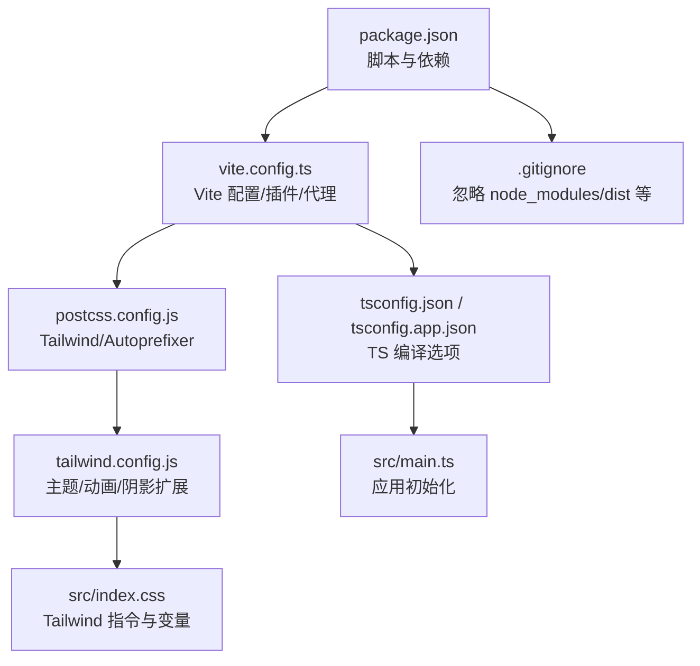
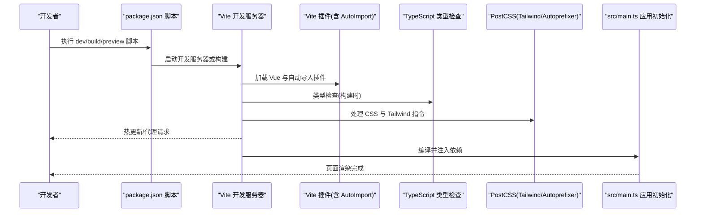
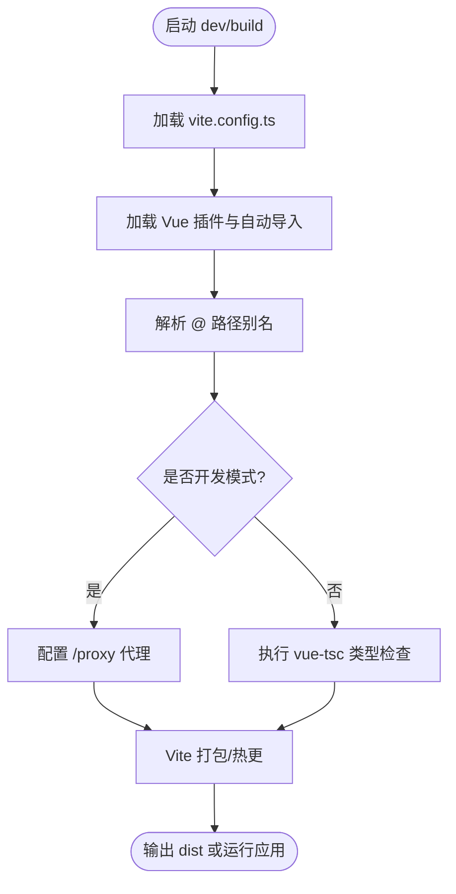
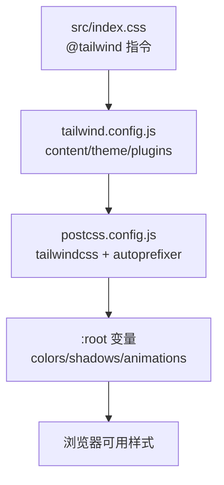
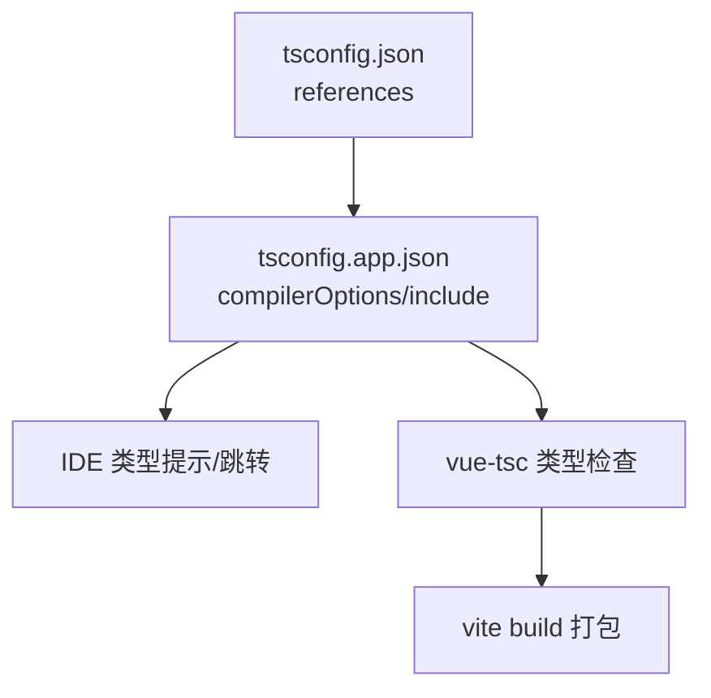
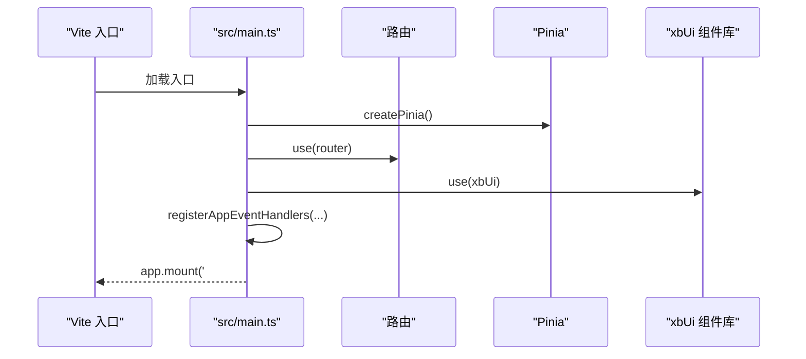
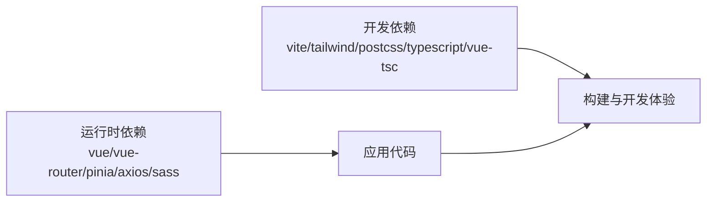

# 开发工作流

<cite>
**本文引用的文件**   
- [frontend/vite.config.ts](file://frontend/vite.config.ts)
- [frontend/tailwind.config.js](file://frontend/tailwind.config.js)
- [frontend/postcss.config.js](file://frontend/postcss.config.js)
- [frontend/package.json](file://frontend/package.json)
- [frontend/tsconfig.json](file://frontend/tsconfig.json)
- [frontend/tsconfig.app.json](file://frontend/tsconfig.app.json)
- [frontend/src/main.ts](file://frontend/src/main.ts)
- [frontend/src/index.css](file://frontend/src/index.css)
- [frontend/.gitignore](file://frontend/.gitignore)
</cite>

## 目录
1. [简介](#简介)
2. [项目结构](#项目结构)
3. [核心组件](#核心组件)
4. [架构总览](#架构总览)
5. [详细组件分析](#详细组件分析)
6. [依赖分析](#依赖分析)
7. [性能考虑](#性能考虑)
8. [故障排查指南](#故障排查指南)
9. [结论](#结论)
10. [附录](#附录)

## 简介
本文件面向前端开发者，系统化梳理该项目的开发工作流与构建工具链，涵盖：
- 开发环境搭建与启动
- 代码规范与类型检查
- 构建配置（Vite、TailwindCSS、PostCSS、TypeScript）
- 热重载与代理
- 调试与预览
- Git 工作流与版本发布建议
- 性能监控与优化实践

## 项目结构
前端采用 Vue 3 + Vite + TypeScript + TailwindCSS 的现代工程化方案。关键配置文件与入口如下：
- 构建与插件：vite.config.ts、postcss.config.js、tailwind.config.js
- 脚本与依赖：package.json
- 类型与编译：tsconfig.json、tsconfig.app.json
- 应用入口：src/main.ts
- 全局样式与主题：src/index.css
- 忽略规则：.gitignore

图表来源
- [frontend/package.json:1-35](file://frontend/package.json#L1-L35)
- [frontend/vite.config.ts:1-32](file://frontend/vite.config.ts#L1-L32)
- [frontend/postcss.config.js:1-7](file://frontend/postcss.config.js#L1-L7)
- [frontend/tailwind.config.js:1-81](file://frontend/tailwind.config.js#L1-L81)
- [frontend/src/index.css:1-268](file://frontend/src/index.css#L1-L268)
- [frontend/tsconfig.json:1-7](file://frontend/tsconfig.json#L1-L7)
- [frontend/tsconfig.app.json:1-27](file://frontend/tsconfig.app.json#L1-L27)
- [frontend/src/main.ts:1-21](file://frontend/src/main.ts#L1-L21)
- [frontend/.gitignore:1-4](file://frontend/.gitignore#L1-L4)

章节来源
- [frontend/package.json:1-35](file://frontend/package.json#L1-L35)
- [frontend/vite.config.ts:1-32](file://frontend/vite.config.ts#L1-L32)
- [frontend/postcss.config.js:1-7](file://frontend/postcss.config.js#L1-L7)
- [frontend/tailwind.config.js:1-81](file://frontend/tailwind.config.js#L1-L81)
- [frontend/tsconfig.json:1-7](file://frontend/tsconfig.json#L1-L7)
- [frontend/tsconfig.app.json:1-27](file://frontend/tsconfig.app.json#L1-L27)
- [frontend/src/main.ts:1-21](file://frontend/src/main.ts#L1-L21)
- [frontend/src/index.css:1-268](file://frontend/src/index.css#L1-L268)
- [frontend/.gitignore:1-4](file://frontend/.gitignore#L1-L4)

## 核心组件
- 构建与运行
  - 开发服务器：通过脚本启动，提供热重载与本地代理。
  - 构建产物：执行类型检查后打包输出到 dist。
  - 预览：对构建产物进行静态预览。
- 插件与工具
  - Vite 插件：Vue 支持、自动导入（unplugin-auto-import）。
  - PostCSS：TailwindCSS 与 Autoprefixer。
  - TypeScript：严格模式、模块解析为 bundler 模式、仅类型检查不生成 JS。
- 样式系统
  - TailwindCSS 主题扩展：颜色、圆角、阴影、动画与关键帧。
  - CSS 变量：在 index.css 中定义设计令牌，供 Tailwind 与业务样式使用。
- 应用初始化
  - main.ts 中注册 Pinia、路由、UI 组件库与全局事件处理器，挂载根组件。

章节来源
- [frontend/package.json:6-11](file://frontend/package.json#L6-L11)
- [frontend/vite.config.ts:6-13](file://frontend/vite.config.ts#L6-L13)
- [frontend/postcss.config.js:1-7](file://frontend/postcss.config.js#L1-L7)
- [frontend/tailwind.config.js:1-81](file://frontend/tailwind.config.js#L1-L81)
- [frontend/tsconfig.app.json:1-27](file://frontend/tsconfig.app.json#L1-L27)
- [frontend/src/index.css:1-64](file://frontend/src/index.css#L1-L64)
- [frontend/src/main.ts:1-21](file://frontend/src/main.ts#L1-L21)

## 架构总览
下图展示了从源码到浏览器渲染的关键链路：Vite 读取配置与插件，结合 TS 类型检查与 PostCSS/Tailwind 处理样式，最终由浏览器加载并初始化应用。

图表来源
- [frontend/package.json:6-11](file://frontend/package.json#L6-L11)
- [frontend/vite.config.ts:6-13](file://frontend/vite.config.ts#L6-L13)
- [frontend/postcss.config.js:1-7](file://frontend/postcss.config.js#L1-L7)
- [frontend/src/main.ts:1-21](file://frontend/src/main.ts#L1-L21)

## 详细组件分析

### Vite 配置与开发体验
- 插件
  - @vitejs/plugin-vue：启用 .vue 单文件组件支持。
  - unplugin-auto-import：自动导入 vue/vue-router/pinia API，减少样板代码；同时生成 dts 声明文件。
- 路径别名
  - 将 @ 映射到 src 目录，统一导入路径。
- 开发服务器
  - watch.ignored：排除白名单文件变更触发全量重建，提升热更效率。
  - server.proxy：将 /proxy 前缀转发至后端服务，解决跨域问题。
- 构建流程
  - 构建脚本先执行 vue-tsc 类型检查，再调用 vite build 打包。

图表来源
- [frontend/vite.config.ts:6-30](file://frontend/vite.config.ts#L6-L30)
- [frontend/package.json:6-11](file://frontend/package.json#L6-L11)

章节来源
- [frontend/vite.config.ts:1-32](file://frontend/vite.config.ts#L1-L32)
- [frontend/package.json:6-11](file://frontend/package.json#L6-L11)

### TailwindCSS 集成与 PostCSS 处理
- 扫描范围
  - tailwind.config.js 的 content 指定了需要扫描的文件后缀与目录，确保按需生成样式。
- 主题扩展
  - 自定义颜色体系（surface/brand/content/border/danger）、圆角、阴影、动画与关键帧。
- PostCSS 管线
  - postcss.config.js 启用 tailwindcss 与 autoprefixer，负责指令展开与浏览器兼容性前缀。
- 设计令牌
  - src/index.css 通过 :root 变量集中管理色彩、渐变、阴影、过渡与间距，配合 Tailwind 使用。

图表来源
- [frontend/tailwind.config.js:1-81](file://frontend/tailwind.config.js#L1-L81)
- [frontend/postcss.config.js:1-7](file://frontend/postcss.config.js#L1-L7)
- [frontend/src/index.css:1-64](file://frontend/src/index.css#L1-L64)

章节来源
- [frontend/tailwind.config.js:1-81](file://frontend/tailwind.config.js#L1-L81)
- [frontend/postcss.config.js:1-7](file://frontend/postcss.config.js#L1-L7)
- [frontend/src/index.css:1-268](file://frontend/src/index.css#L1-L268)

### TypeScript 编译与类型检查
- 顶层 tsconfig.json 使用 references 引用子配置，便于多包/多目标管理。
- tsconfig.app.json 关键设置：
  - target/lib/moduleResolution：适配现代浏览器与打包器。
  - strict/isolatedModules/noEmit：严格模式、模块化隔离、仅类型检查不产出 JS。
  - paths/@/*：与 Vite 别名保持一致，IDE 提示与构建一致。
- 构建脚本中通过 vue-tsc 进行类型检查，保证构建前类型安全。

图表来源
- [frontend/tsconfig.json:1-7](file://frontend/tsconfig.json#L1-L7)
- [frontend/tsconfig.app.json:1-27](file://frontend/tsconfig.app.json#L1-L27)
- [frontend/package.json:6-11](file://frontend/package.json#L6-L11)

章节来源
- [frontend/tsconfig.json:1-7](file://frontend/tsconfig.json#L1-L7)
- [frontend/tsconfig.app.json:1-27](file://frontend/tsconfig.app.json#L1-L27)
- [frontend/package.json:6-11](file://frontend/package.json#L6-L11)

### 应用初始化与全局事件
- main.ts 负责：
  - 创建应用实例，注册 Pinia、路由与 UI 组件库。
  - 注册全局 HTTP 状态码事件处理，如登录态失效跳转等。
  - 挂载到 #app。
- 与构建的关系：
  - 作为 Vite 入口被自动导入与依赖图收集，参与热更新。

图表来源
- [frontend/src/main.ts:1-21](file://frontend/src/main.ts#L1-L21)

章节来源
- [frontend/src/main.ts:1-21](file://frontend/src/main.ts#L1-L21)

## 依赖分析
- 运行时依赖
  - Vue 生态：vue、vue-router、pinia
  - UI 与交互：lucide-vue-next、vuedraggable
  - 网络：axios
  - 样式预处理：sass
- 开发依赖
  - 构建与插件：vite、@vitejs/plugin-vue、unplugin-auto-import
  - 样式：tailwindcss、autoprefixer、postcss
  - 类型：typescript、vue-tsc、@types/node
  - 资源处理：sharp（用于图片压缩脚本）

图表来源
- [frontend/package.json:12-33](file://frontend/package.json#L12-L33)

章节来源
- [frontend/package.json:12-33](file://frontend/package.json#L12-L33)

## 性能考虑
- 构建体积
  - 使用 Tailwind 的按需生成与内容扫描，避免未用样式进入产物。
  - 合理使用自动导入，避免引入不必要的 API。
- 开发体验
  - 利用 watch.ignored 排除大文件或频繁变更的非关键文件，减少无意义重建。
  - 使用 server.proxy 就近联调，减少跨域与额外中间层开销。
- 类型检查
  - 构建前执行 vue-tsc，尽早发现类型错误，降低线上风险。
- 资源优化
  - 借助 sharp 与脚本进行图片压缩，减小静态资源体积。

[本节为通用指导，无需列出具体文件来源]

## 故障排查指南
- 开发服务器无法访问后端接口
  - 检查 vite.config.ts 中的 proxy 配置与目标地址是否正确。
  - 确认请求路径是否以 /proxy 开头，且后端服务已启动。
- 样式未生效或类名缺失
  - 核对 tailwind.config.js 的 content 是否覆盖所有模板文件路径。
  - 确认 postcss.config.js 已启用 tailwindcss 与 autoprefixer。
  - 检查 src/index.css 是否包含 @tailwind 指令。
- 类型报错但能运行
  - 构建脚本会先执行 vue-tsc，定位 tsconfig.app.json 的 include 与 paths 配置是否与 Vite 别名一致。
- 自动导入无效或 IDE 提示异常
  - 确认 unplugin-auto-import 的 dts 输出路径存在并被 TS 包含。
  - 重启 IDE 或清理缓存。
- 构建失败
  - 优先查看 vue-tsc 输出的类型错误，修复后再构建。
  - 若出现模块解析问题，检查 package.json 的 type 与 moduleResolution 设置。

章节来源
- [frontend/vite.config.ts:19-30](file://frontend/vite.config.ts#L19-L30)
- [frontend/tailwind.config.js:1-10](file://frontend/tailwind.config.js#L1-L10)
- [frontend/postcss.config.js:1-7](file://frontend/postcss.config.js#L1-L7)
- [frontend/src/index.css:1-3](file://frontend/src/index.css#L1-L3)
- [frontend/tsconfig.app.json:20-26](file://frontend/tsconfig.app.json#L20-L26)
- [frontend/package.json:6-11](file://frontend/package.json#L6-L11)

## 结论
本项目基于 Vite 构建了高效的前端开发工作流：通过 Vue 插件与自动导入提升开发效率，借助 TailwindCSS 与 PostCSS 实现可维护的样式体系，结合 TypeScript 的类型检查保障质量。合理的代理与忽略策略进一步优化了开发与构建体验。建议在团队内统一遵循现有脚本与配置，持续完善代码规范与发布流程。

[本节为总结性内容，无需列出具体文件来源]

## 附录

### 开发环境搭建与常用命令
- 安装依赖
  - 在项目根目录执行依赖安装（建议使用 pnpm/yarn/npm 对应命令）。
- 启动开发服务器
  - 执行 dev 脚本，开启热重载与代理。
- 构建生产产物
  - 执行 build 脚本，先类型检查再打包。
- 预览构建产物
  - 执行 preview 脚本，本地预览 dist 内容。

章节来源
- [frontend/package.json:6-11](file://frontend/package.json#L6-L11)

### 代码规范与格式化建议
- 编辑器
  - 推荐启用 ESLint + Prettier + Stylelint（可按需引入），并在保存时自动格式化。
- 提交前校验
  - 建议引入 Husky + lint-staged，在提交前对改动文件执行类型检查与格式化。
- 命名与风格
  - 组件与文件命名保持语义化；CSS 类名遵循 Tailwind 原子类为主、组合少量自定义类的原则。

[本节为通用指导，无需列出具体文件来源]

### Git 工作流与版本发布
- 分支策略
  - 主分支保护，功能分支按特性拆分，合并前进行代码审查与 CI 校验。
- 提交规范
  - 采用约定式提交（如 feat/fix/docs/chore 等），便于自动生成变更日志。
- 版本发布
  - 使用 npm version 或专用工具（如 standard-version）管理版本号与变更日志。
  - 构建产物纳入发布清单，注意 .gitignore 已忽略 node_modules、dist 与自动生成的 d.ts。

章节来源
- [frontend/.gitignore:1-4](file://frontend/.gitignore#L1-L4)

### 性能监控与埋点建议
- 前端性能指标
  - 接入 Performance Observer 采集 LCP/FID/CLS 等指标。
- 错误监控
  - 捕获全局错误与 Promise 未处理拒绝，上报至监控系统。
- 用户行为
  - 对关键操作（如上传、生成任务）埋点，统计成功率与耗时。

[本节为通用指导，无需列出具体文件来源]