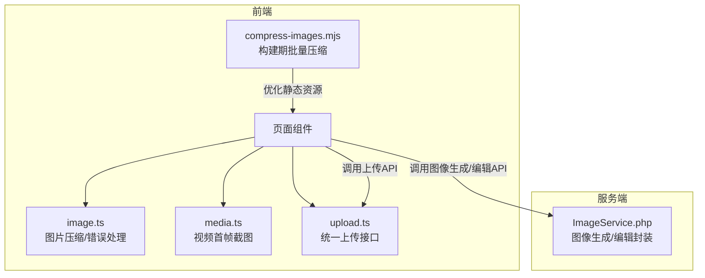
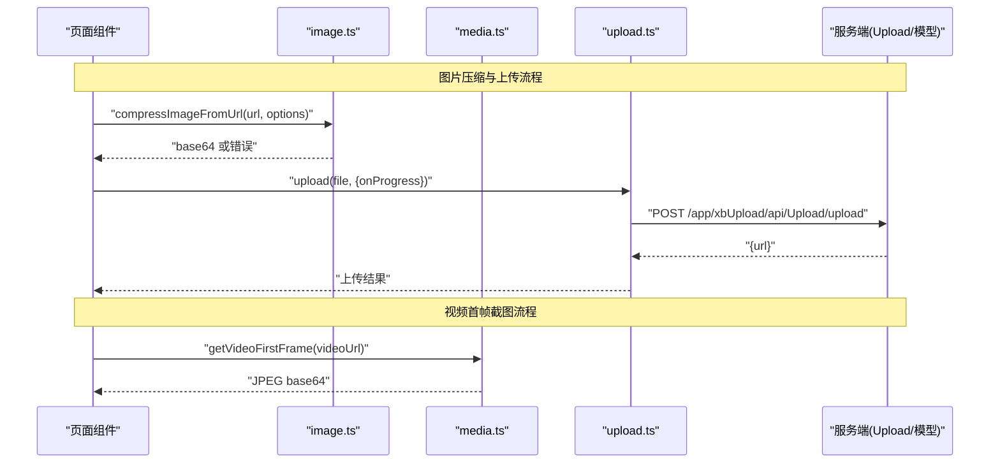
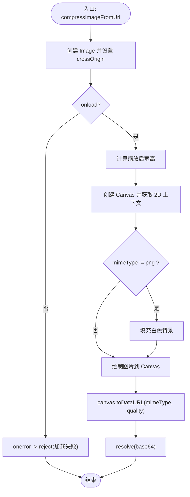
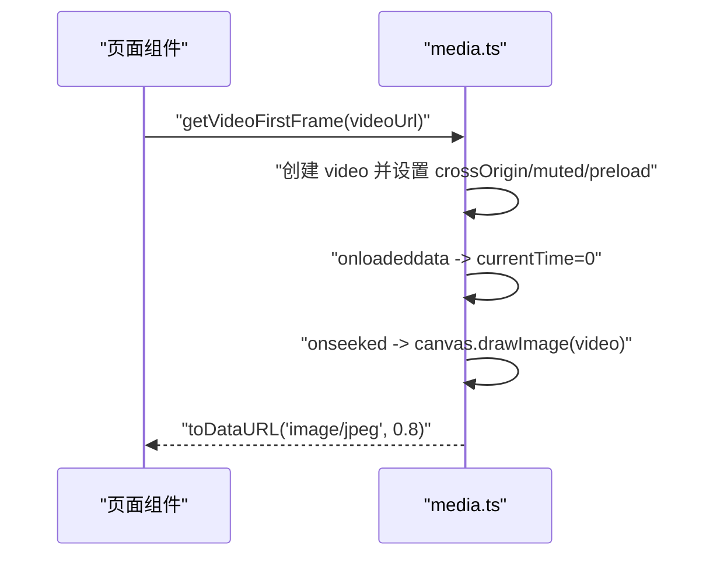
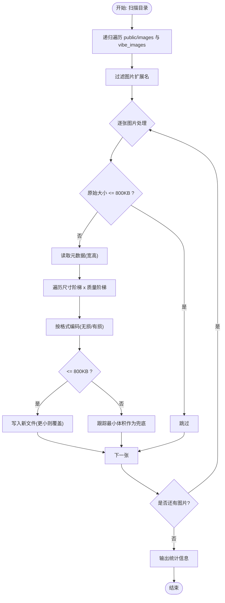
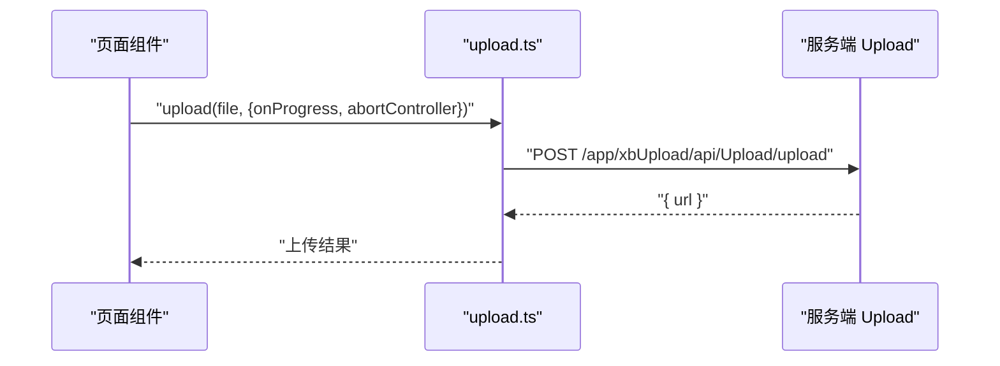
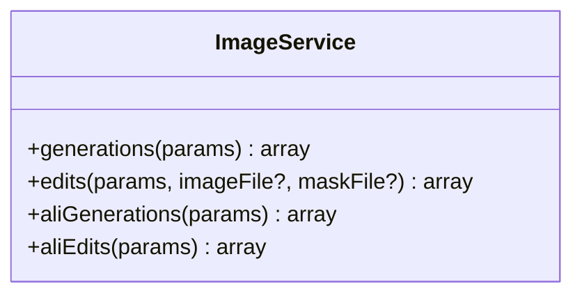
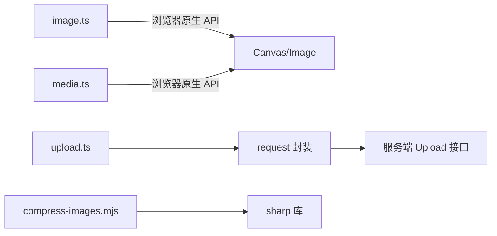

# 图像处理工具

<cite>
**本文引用的文件**   
- [frontend/src/utils/image.ts](file://frontend/src/utils/image.ts)
- [frontend/scripts/compress-images.mjs](file://frontend/scripts/compress-images.mjs)
- [frontend/src/utils/media.ts](file://frontend/src/utils/media.ts)
- [frontend/src/api/upload.ts](file://frontend/src/api/upload.ts)
- [server/plugin/xbAiModelAgent/service/xbcode/ImageService.php](file://server/plugin/xbAiModelAgent/service/xbcode/ImageService.php)
</cite>

## 目录
1. [简介](#简介)
2. [项目结构](#项目结构)
3. [核心组件](#核心组件)
4. [架构总览](#架构总览)
5. [详细组件分析](#详细组件分析)
6. [依赖关系分析](#依赖关系分析)
7. [性能考量](#性能考量)
8. [故障排查指南](#故障排查指南)
9. [结论](#结论)
10. [附录](#附录)

## 简介
本仓库包含一套面向前端的图像处理与媒体处理工具，以及服务端图像生成能力封装。前端侧提供：
- 图片加载失败占位图与错误处理
- 基于 Canvas 的图片压缩（支持尺寸缩放、质量与输出格式控制）
- 视频首帧截图提取（用于封面预览）
- 批量离线图片压缩脚本（构建期优化静态资源体积）
- 统一的上传 API 封装（对接后端上传服务）

服务端侧提供：
- 图像生成与编辑的 OpenAI 风格接口封装（含多模态参数）
- 通义千问风格的图像生成与编辑接口封装

该文档从系统架构、组件职责、数据流、错误处理与性能优化等维度进行系统化说明，帮助开发者快速理解并扩展图像处理功能。

## 项目结构
与图像处理相关的代码主要分布在以下位置：
- 前端工具库：utils/image.ts、utils/media.ts
- 构建期脚本：scripts/compress-images.mjs
- 上传 API：api/upload.ts
- 服务端图像服务：plugin/xbAiModelAgent/service/xbcode/ImageService.php

图表来源
- [frontend/src/utils/image.ts:1-106](file://frontend/src/utils/image.ts#L1-L106)
- [frontend/src/utils/media.ts:1-55](file://frontend/src/utils/media.ts#L1-L55)
- [frontend/scripts/compress-images.mjs:1-122](file://frontend/scripts/compress-images.mjs#L1-L122)
- [frontend/src/api/upload.ts:1-24](file://frontend/src/api/upload.ts#L1-L24)
- [server/plugin/xbAiModelAgent/service/xbcode/ImageService.php:1-128](file://server/plugin/xbAiModelAgent/service/xbcode/ImageService.php#L1-L128)

章节来源
- [frontend/src/utils/image.ts:1-106](file://frontend/src/utils/image.ts#L1-L106)
- [frontend/src/utils/media.ts:1-55](file://frontend/src/utils/media.ts#L1-L55)
- [frontend/scripts/compress-images.mjs:1-122](file://frontend/scripts/compress-images.mjs#L1-L122)
- [frontend/src/api/upload.ts:1-24](file://frontend/src/api/upload.ts#L1-L24)
- [server/plugin/xbAiModelAgent/service/xbcode/ImageService.php:1-128](file://server/plugin/xbAiModelAgent/service/xbcode/ImageService.php#L1-L128)

## 核心组件
- 图片压缩与错误处理（前端）
  - 提供默认占位图与图片加载失败时的回退策略
  - 通过 Canvas 将远程图片按最大宽高限制缩放，并以指定 MIME 类型与质量输出为 base64
  - 对跨域场景进行防护提示，避免 canvas 污染导致压缩失败
- 视频首帧截图（前端）
  - 使用 video + canvas 抽取第一帧，返回 JPEG base64 DataURL
  - 自动设置 crossOrigin 与 muted，减少跨域与音频加载开销
- 构建期批量图片压缩（Node.js 脚本）
  - 遍历 public/images 与 vibe_images 目录，针对 JPG/PNG/WebP 执行多级质量与尺寸阶梯压缩
  - 优先无损 PNG 重压，再降级调色板有损；JPEG 启用 mozjpeg 与渐进式；WebP 直接有损
  - 目标单张不超过 800KB，记录节省体积与未达标数量
- 统一上传 API（前端）
  - 封装 /app/xbUpload/api/Upload/upload 接口，支持进度回调与中断控制器
- 服务端图像生成/编辑封装（PHP）
  - 提供 OpenAI 风格 images/generations 与 images/edits 方法
  - 提供通义千问风格 images/generations 与 images/edits 方法
  - edits 支持 multipart 上传 image/mask 与文本参数

章节来源
- [frontend/src/utils/image.ts:1-106](file://frontend/src/utils/image.ts#L1-L106)
- [frontend/src/utils/media.ts:1-55](file://frontend/src/utils/media.ts#L1-L55)
- [frontend/scripts/compress-images.mjs:1-122](file://frontend/scripts/compress-images.mjs#L1-L122)
- [frontend/src/api/upload.ts:1-24](file://frontend/src/api/upload.ts#L1-L24)
- [server/plugin/xbAiModelAgent/service/xbcode/ImageService.php:1-128](file://server/plugin/xbAiModelAgent/service/xbcode/ImageService.php#L1-L128)

## 架构总览
下图展示前端图像处理工具与服务端图像服务的交互关系与关键流程。

图表来源
- [frontend/src/utils/image.ts:35-105](file://frontend/src/utils/image.ts#L35-L105)
- [frontend/src/utils/media.ts:20-54](file://frontend/src/utils/media.ts#L20-L54)
- [frontend/src/api/upload.ts:15-23](file://frontend/src/api/upload.ts#L15-L23)

## 详细组件分析

### 图片压缩与错误处理（前端）
- 设计要点
  - 默认占位图使用内联 SVG data URI，避免额外网络请求
  - 图片加载失败时自动替换为占位图，提升用户体验
  - 压缩流程：
    - 根据 maxWidth/maxHeight 按比例缩放
    - 非 PNG 输出时填充白色背景，避免透明区域变黑
    - 以指定 mimeType 与 quality 输出 base64
  - 跨域保护：若 canvas 被污染，抛出明确错误提示配置服务端响应头
- 复杂度与性能
  - 时间复杂度 O(W×H)，受画布像素数影响
  - 内存占用与画布大小成正比，建议合理设置最大边长
- 错误处理
  - 图片加载失败：拒绝 Promise 并携带 URL
  - Canvas 上下文不可用：拒绝并提示
  - 跨域污染：拒绝并给出修复指引

图表来源
- [frontend/src/utils/image.ts:35-105](file://frontend/src/utils/image.ts#L35-L105)

章节来源
- [frontend/src/utils/image.ts:1-106](file://frontend/src/utils/image.ts#L1-L106)

### 视频首帧截图（前端）
- 设计要点
  - 使用 video 元素加载元数据，seek 到 0 秒后捕获一帧
  - 使用 canvas 绘制并导出 JPEG base64，降低体积
  - 设置 crossOrigin 与 muted，避免跨域与音频加载问题
- 错误处理
  - 视频加载失败：reject 并清理 DOM 引用
  - 捕获异常：在 try/catch 中返回错误

图表来源
- [frontend/src/utils/media.ts:20-54](file://frontend/src/utils/media.ts#L20-L54)

章节来源
- [frontend/src/utils/media.ts:1-55](file://frontend/src/utils/media.ts#L1-L55)

### 构建期批量图片压缩（Node.js 脚本）
- 设计要点
  - 扫描 public/images 与 vibe_images 目录，递归收集图片
  - 仅处理 jpg/jpeg/png/webp 扩展名
  - 多级质量与尺寸阶梯：
    - 尺寸阶梯：不缩放、1920、1600、1280、1024
    - 质量阶梯：从高到低逐步尝试，直到满足 <= 800KB
  - 针对不同格式采用最优策略：
    - PNG：先无损重压，再降级 palette 有损
    - WebP：直接有损
    - JPEG：mozjpeg + 渐进式
  - 仅当压缩后更小才覆盖原文件，统计节省体积与未达标数量
- 复杂度与性能
  - 时间复杂度 O(N × Q × S)，N 为图片数，Q 为质量步数，S 为尺寸步数
  - 使用 sharp 进行高效编解码，适合构建期批处理

图表来源
- [frontend/scripts/compress-images.mjs:1-122](file://frontend/scripts/compress-images.mjs#L1-L122)

章节来源
- [frontend/scripts/compress-images.mjs:1-122](file://frontend/scripts/compress-images.mjs#L1-L122)

### 统一上传 API（前端）
- 设计要点
  - 封装 /app/xbUpload/api/Upload/upload 接口
  - 支持 onProgress 进度回调与 abortController 中断
  - 返回统一结构 { url }
- 集成方式
  - 页面组件可直接调用 upload(file, options) 完成上传

图表来源
- [frontend/src/api/upload.ts:15-23](file://frontend/src/api/upload.ts#L15-L23)

章节来源
- [frontend/src/api/upload.ts:1-24](file://frontend/src/api/upload.ts#L1-L24)

### 服务端图像生成/编辑封装（PHP）
- 设计要点
  - 提供 OpenAI 风格接口：
    - generations：生成图像，支持 model/prompt/n/size/background/moderation/quality/stream/style/user 等参数
    - edits：编辑图像，支持 multipart 上传 image/mask 与文本参数
  - 提供通义千问风格接口：
    - aliGenerations：生成图像，支持 model/input/messages/parameters/negative_prompt/prompt_extend/watermark/size 等
    - aliEdits：编辑图像，参数类似
- 错误处理
  - 基于底层 post/postMultipart 返回，上层可结合业务逻辑判断状态码与消息体

图表来源
- [server/plugin/xbAiModelAgent/service/xbcode/ImageService.php:1-128](file://server/plugin/xbAiModelAgent/service/xbcode/ImageService.php#L1-L128)

章节来源
- [server/plugin/xbAiModelAgent/service/xbcode/ImageService.php:1-128](file://server/plugin/xbAiModelAgent/service/xbcode/ImageService.php#L1-L128)

## 依赖关系分析
- 前端内部依赖
  - image.ts 与 media.ts 为纯工具函数，无外部运行时依赖
  - upload.ts 依赖 request 模块（由工程统一封装），对外暴露简洁 API
- 构建期脚本依赖
  - compress-images.mjs 依赖 Node.js fs/promises、path 与 sharp 库
- 前后端交互
  - 前端通过 upload.ts 调用后端上传接口
  - 前端可通过 ImageService 对应的后端路由调用图像生成/编辑能力（具体路由由插件注册）

图表来源
- [frontend/src/utils/image.ts:1-106](file://frontend/src/utils/image.ts#L1-L106)
- [frontend/src/utils/media.ts:1-55](file://frontend/src/utils/media.ts#L1-L55)
- [frontend/src/api/upload.ts:1-24](file://frontend/src/api/upload.ts#L1-L24)
- [frontend/scripts/compress-images.mjs:1-122](file://frontend/scripts/compress-images.mjs#L1-L122)

章节来源
- [frontend/src/utils/image.ts:1-106](file://frontend/src/utils/image.ts#L1-L106)
- [frontend/src/utils/media.ts:1-55](file://frontend/src/utils/media.ts#L1-L55)
- [frontend/src/api/upload.ts:1-24](file://frontend/src/api/upload.ts#L1-L24)
- [frontend/scripts/compress-images.mjs:1-122](file://frontend/scripts/compress-images.mjs#L1-L122)

## 性能考量
- 前端图片压缩
  - 合理设置 maxWidth/maxHeight，避免超大画布导致卡顿
  - 选择合适 mimeType：webp 通常比 jpeg 更小且质量更好
  - 跨域图片需确保服务端允许跨域，否则压缩会失败
- 视频首帧截图
  - 使用 muted 与 preload=metadata 减少不必要的加载
  - 输出 JPEG 而非 PNG，显著减小体积
- 构建期批量压缩
  - 仅在构建阶段运行，避免影响运行时性能
  - 多级阶梯策略可在体积与质量之间取得平衡
  - 建议配合 CDN 缓存策略，进一步提升加载速度
- 上传与存储
  - 大文件上传建议使用分片与断点续传（可扩展）
  - 服务端存储建议开启压缩与缩略图生成

[本节为通用指导，无需特定文件引用]

## 故障排查指南
- 图片压缩失败（跨域污染）
  - 现象：canvas.toDataURL 抛出错误或返回空
  - 原因：跨域图片未配置允许跨域的响应头
  - 解决：在服务端添加 CORS 响应头，或在 img.crossOrigin 设置为空字符串以避免跨域检查
- 图片加载失败
  - 现象：Promise 被拒绝并携带 URL
  - 解决：检查 URL 可达性、CORS 配置与网络环境
- 视频首帧截图失败
  - 现象：Promise 被拒绝并携带错误信息
  - 解决：确认视频地址可访问、跨域配置正确，且浏览器支持相关 API
- 构建期压缩未达标
  - 现象：仍超标数量 > 0
  - 解决：进一步降低质量或尺寸阶梯，或拆分大图

章节来源
- [frontend/src/utils/image.ts:87-96](file://frontend/src/utils/image.ts#L87-L96)
- [frontend/src/utils/image.ts:99-101](file://frontend/src/utils/image.ts#L99-L101)
- [frontend/src/utils/media.ts:49-52](file://frontend/src/utils/media.ts#L49-L52)
- [frontend/scripts/compress-images.mjs:114-120](file://frontend/scripts/compress-images.mjs#L114-L120)

## 结论
本项目在前端提供了完善的图像处理工具链，涵盖压缩、错误处理、视频首帧截图与构建期批量优化；在后端提供了图像生成与编辑的标准化封装。整体设计清晰、职责单一，易于扩展与维护。建议在后续迭代中：
- 增加前端上传的分片与重试机制
- 引入服务端缩略图与动态裁剪能力
- 完善错误日志与监控指标，便于定位问题

[本节为总结性内容，无需特定文件引用]

## 附录
- 常用配置项参考
  - 图片压缩选项
    - maxWidth/maxHeight：最大边长（px）
    - quality：压缩质量（0-1）
    - mimeType：输出格式（jpeg/webp/png）
    - crossOrigin：跨域策略
  - 视频首帧截图
    - crossOrigin：anonymous
    - muted：true
    - preload：metadata
  - 构建期压缩
    - 目标目录：public/images、vibe_images
    - 目标大小：<= 800KB
    - 支持格式：jpg/jpeg/png/webp

章节来源
- [frontend/src/utils/image.ts:14-26](file://frontend/src/utils/image.ts#L14-L26)
- [frontend/src/utils/media.ts:20-31](file://frontend/src/utils/media.ts#L20-L31)
- [frontend/scripts/compress-images.mjs:7-17](file://frontend/scripts/compress-images.mjs#L7-L17)