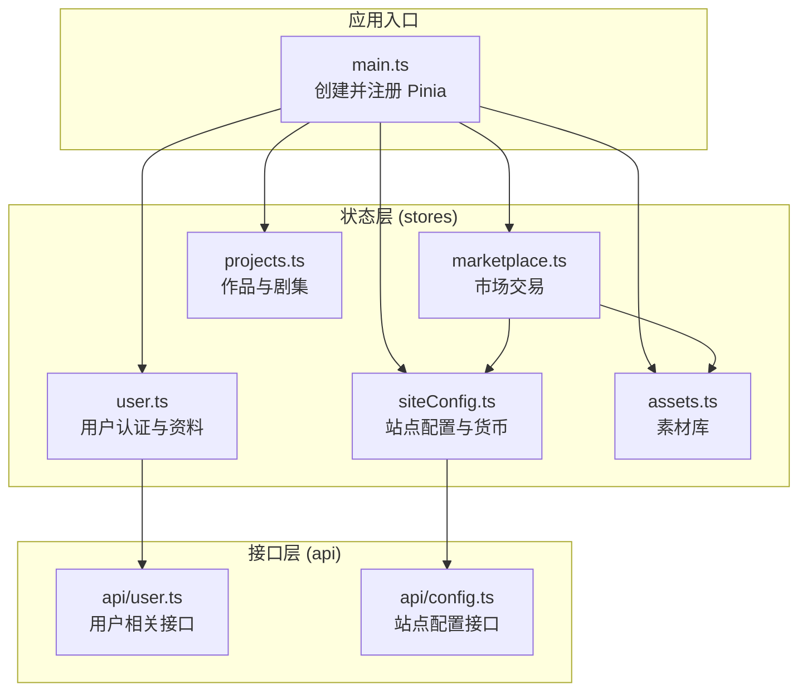
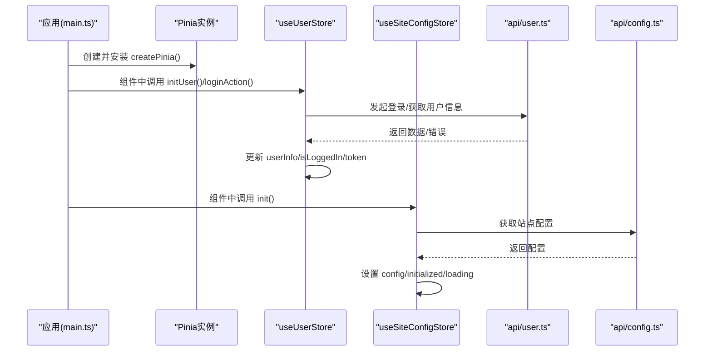
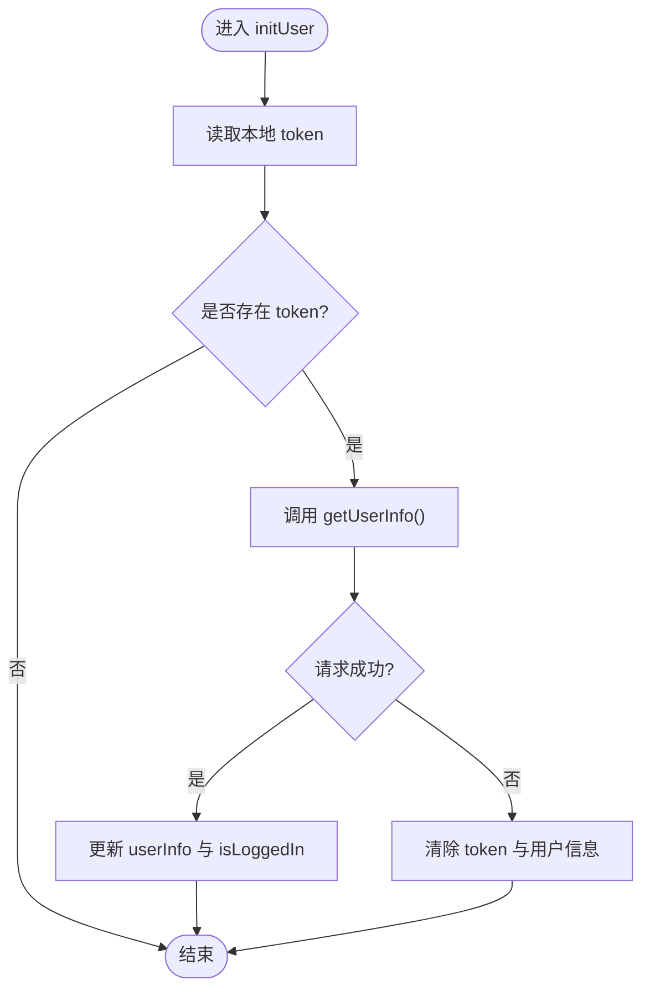
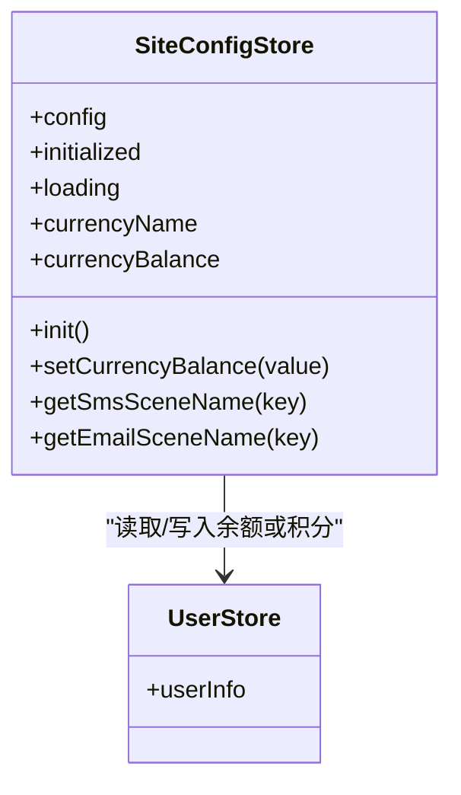
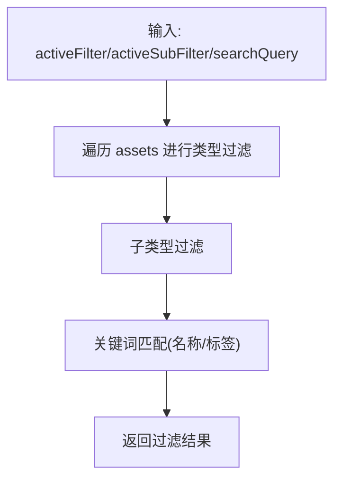
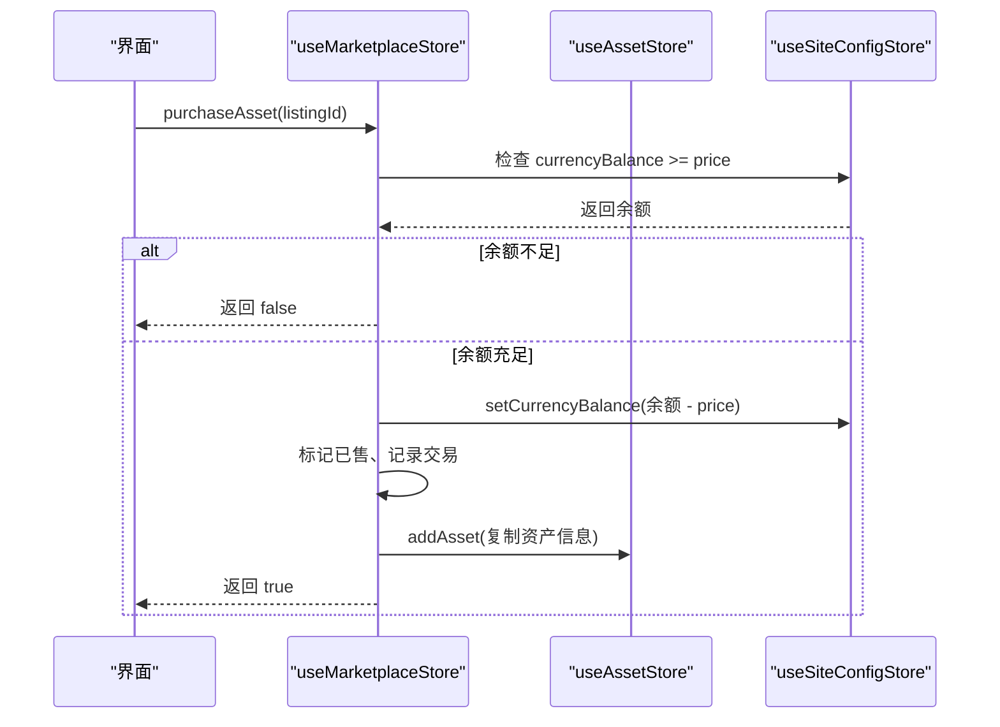
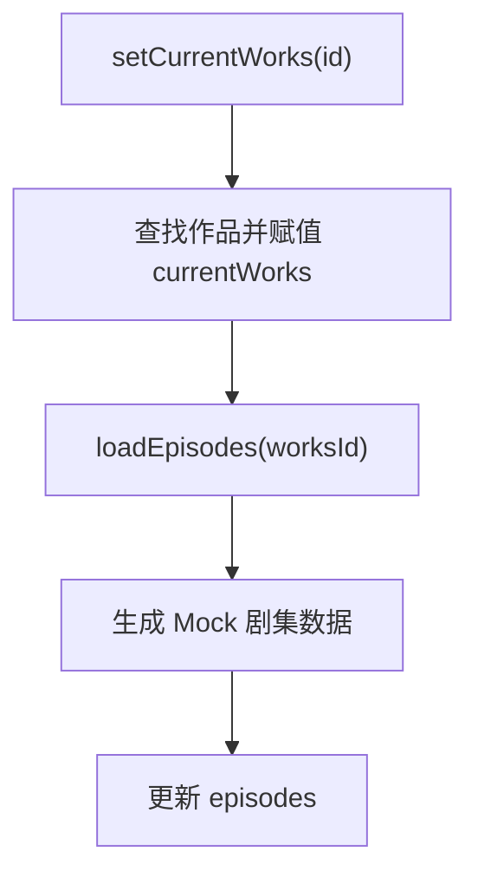
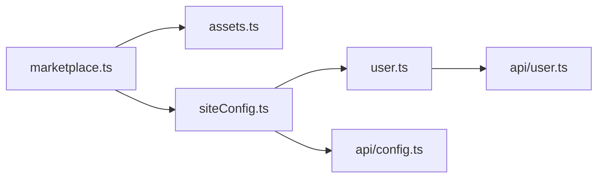

# Pinia架构设计

<cite>
**本文引用的文件**
- [main.ts](file://frontend/src/main.ts)
- [user.ts](file://frontend/src/stores/user.ts)
- [assets.ts](file://frontend/src/stores/assets.ts)
- [marketplace.ts](file://frontend/src/stores/marketplace.ts)
- [projects.ts](file://frontend/src/stores/projects.ts)
- [siteConfig.ts](file://frontend/src/stores/siteConfig.ts)
- [user.ts API](file://frontend/src/api/user.ts)
- [config.ts API](file://frontend/src/api/config.ts)
</cite>

## 目录
1. [简介](#简介)
2. [项目结构](#项目结构)
3. [核心组件](#核心组件)
4. [架构总览](#架构总览)
5. [详细组件分析](#详细组件分析)
6. [依赖关系分析](#依赖关系分析)
7. [性能与优化](#性能与优化)
8. [调试与排错指南](#调试与排错指南)
9. [结论](#结论)
10. [附录：大型应用组织建议](#附录大型应用组织建议)

## 简介
本文件围绕前端仓库中的 Pinia 状态管理实践，系统化梳理 Store 定义模式、响应式更新机制、模块化组织原则、异步处理最佳实践、初始化流程与依赖注入方式，并结合具体代码路径给出可落地的优化与调试建议。文档面向不同技术背景的读者，既提供高层概览，也深入到源码级实现细节。

## 项目结构
本项目采用按领域划分的 Store 模块组织方式，每个业务域一个 Store 文件，集中管理该领域的 State、Getters（computed）和 Actions（函数）。Store 通过 defineStore 的 Composition API 风格定义，使用 ref/computed/函数封装逻辑，并在需要时跨 Store 互相调用。

图表来源
- [main.ts:8-11](file://frontend/src/main.ts#L8-L11)
- [user.ts](file://frontend/src/stores/user.ts)
- [siteConfig.ts](file://frontend/src/stores/siteConfig.ts)
- [assets.ts](file://frontend/src/stores/assets.ts)
- [marketplace.ts](file://frontend/src/stores/marketplace.ts)
- [projects.ts](file://frontend/src/stores/projects.ts)
- [user.ts API](file://frontend/src/api/user.ts)
- [config.ts API](file://frontend/src/api/config.ts)

章节来源
- [main.ts:8-11](file://frontend/src/main.ts#L8-L11)

## 核心组件
- 用户状态 store（user.ts）
  - 职责：登录/注册/密码重置/绑定解绑/头像昵称修改/本地 token 持久化/并发初始化防抖。
  - 关键特性：ref 管理 isLoggedIn、userInfo；computed 派生绑定状态；async actions 统一错误处理与返回结构化结果；initUser 防止重复请求。
- 站点配置 store（siteConfig.ts）
  - 职责：拉取站点配置、暴露短信/邮件模板名称获取方法、根据充值类型动态选择余额或积分作为“货币”。
  - 关键特性：initialized/loading 控制加载态；computed 计算 currencyName/currencyBalance；setCurrencyBalance 写入 userStore 对应字段。
- 素材库 store（assets.ts）
  - 职责：维护素材列表、筛选与搜索、增删素材。
  - 关键特性：ref 数组 + computed 过滤（在 action 中直接返回过滤结果），避免额外 computed 开销。
- 市场 store（marketplace.ts）
  - 职责：商品上架/下架、购买、排序筛选、交易记录、点赞、钱包统计。
  - 关键特性：computed 复杂过滤与排序；跨 store 协作（assets、siteConfig）；批量操作封装。
- 作品 store（projects.ts）
  - 职责：作品 CRUD、当前作品切换、剧集与分镜场景管理。
  - 关键特性：嵌套数据结构（works -> episodes -> scenes）的增删改查与顺序调整。

章节来源
- [user.ts:8-326](file://frontend/src/stores/user.ts#L8-L326)
- [siteConfig.ts:7-99](file://frontend/src/stores/siteConfig.ts#L7-L99)
- [assets.ts:42-160](file://frontend/src/stores/assets.ts#L42-L160)
- [marketplace.ts:76-333](file://frontend/src/stores/marketplace.ts#L76-L333)
- [projects.ts:72-278](file://frontend/src/stores/projects.ts#L72-L278)

## 架构总览
Pinia 在本项目中以“单例 Store + 组合式 API”的方式运行。应用启动时在 main.ts 中创建并安装 Pinia 插件，随后各组件按需引入 useXxxStore 访问状态与方法。Store 之间通过相互调用形成松耦合的业务编排。

图表来源
- [main.ts:8-11](file://frontend/src/main.ts#L8-L11)
- [user.ts:54-105](file://frontend/src/stores/user.ts#L54-L105)
- [user.ts API:160-169](file://frontend/src/api/user.ts#L160-L169)
- [siteConfig.ts:17-29](file://frontend/src/stores/siteConfig.ts#L17-L29)
- [config.ts API:197-199](file://frontend/src/api/config.ts#L197-L199)

## 详细组件分析

### 用户状态管理（user.ts）
- 状态设计
  - isLoggedIn：登录态布尔值
  - userInfo：用户详情对象
  - isPhoneBound/isEmailBound/isWechatBound：基于 userInfo 的 computed 派生状态
- 异步流程
  - initUser：页面刷新后恢复登录态，若 token 存在则拉取用户信息；失败则清理本地状态
  - loginAction/mobileLoginAction/emailLoginAction：统一登录流程，成功后保存 token 并拉取用户信息
  - logoutAction：无论服务端是否成功，均清理本地状态
  - bind/unbind/updateAvatar/updateNickname：结合上传与资料编辑接口，成功后同步本地状态
- 并发控制
  - initPromise：防止多次并行初始化导致重复请求
- 错误处理
  - 所有异步 Action 捕获异常并返回 { success, message } 的结构化结果，便于 UI 提示

图表来源
- [user.ts:54-85](file://frontend/src/stores/user.ts#L54-L85)

章节来源
- [user.ts:8-326](file://frontend/src/stores/user.ts#L8-L326)
- [user.ts API:160-169](file://frontend/src/api/user.ts#L160-L169)

### 站点配置与货币（siteConfig.ts）
- 状态设计
  - config：站点配置对象
  - initialized/loading：初始化与加载状态
- 计算属性
  - currencyName：根据 recharge_type 决定显示余额还是积分的名称
  - currencyBalance：根据 recharge_type 从 userStore 的 userInfo.balance/integral 取值
- 行为
  - init：首次拉取配置，设置 initialized 与 loading
  - setCurrencyBalance：根据配置写入 userStore 对应字段
  - getSmsSceneName/getEmailSceneName：安全地获取模板名称，未找到回退 key

图表来源
- [siteConfig.ts:7-99](file://frontend/src/stores/siteConfig.ts#L7-L99)
- [user.ts:16-36](file://frontend/src/stores/user.ts#L16-L36)

章节来源
- [siteConfig.ts:7-99](file://frontend/src/stores/siteConfig.ts#L7-L99)
- [user.ts:16-36](file://frontend/src/stores/user.ts#L16-L36)

### 素材库（assets.ts）
- 状态设计
  - assets：素材数组
  - searchQuery/activeFilter/activeSubFilter：筛选与搜索条件
- 行为
  - addAsset/deleteAsset：增删素材
  - getFilteredAssets：根据筛选与关键词返回过滤后的列表（action 内计算，避免多余 computed）

图表来源
- [assets.ts:132-149](file://frontend/src/stores/assets.ts#L132-L149)

章节来源
- [assets.ts:42-160](file://frontend/src/stores/assets.ts#L42-L160)

### 市场（marketplace.ts）
- 状态设计
  - listings：上架商品列表
  - transactions：交易记录
  - wallet：钱包统计
  - searchQuery/activeFilter/activeSubFilter/sortBy/priceMin/priceMax/viewMode：筛选与视图控制
- 计算属性
  - filteredListings：综合多条件过滤与排序
  - myListings/buyTransactions/sellTransactions：派生视图
- 行为
  - listAsset/listAssetsBatch/unlistAsset：上架/批量上架/下架
  - purchaseAsset：校验余额、扣款、记录交易、添加至素材库
  - updatePrice/toggleLike：价格修改与点赞

图表来源
- [marketplace.ts:254-293](file://frontend/src/stores/marketplace.ts#L254-L293)
- [siteConfig.ts:77-86](file://frontend/src/stores/siteConfig.ts#L77-L86)
- [assets.ts:115-122](file://frontend/src/stores/assets.ts#L115-L122)

章节来源
- [marketplace.ts:76-333](file://frontend/src/stores/marketplace.ts#L76-L333)
- [assets.ts:115-122](file://frontend/src/stores/assets.ts#L115-L122)
- [siteConfig.ts:77-86](file://frontend/src/stores/siteConfig.ts#L77-L86)

### 作品与剧集（projects.ts）
- 状态设计
  - works：作品列表
  - currentWorks：当前选中作品
  - episodes：剧集列表
- 行为
  - addWorks/deleteWorks/updateWorks：作品 CRUD
  - setCurrentWorks/loadEpisodes：切换作品并加载剧集
  - addEpisode/updateEpisode：剧集管理
  - addScene/addScenesBatch/reorderScene/deleteScene：分镜场景管理

图表来源
- [projects.ts:165-185](file://frontend/src/stores/projects.ts#L165-L185)

章节来源
- [projects.ts:72-278](file://frontend/src/stores/projects.ts#L72-L278)

## 依赖关系分析
- 跨 Store 依赖
  - marketplace.ts 依赖 assets.ts 与 siteConfig.ts，用于购买流程与余额读写
  - siteConfig.ts 依赖 user.ts，用于根据充值类型读写余额或积分
- 接口层依赖
  - user.ts 依赖 api/user.ts
  - siteConfig.ts 依赖 api/config.ts

图表来源
- [marketplace.ts:208-293](file://frontend/src/stores/marketplace.ts#L208-L293)
- [siteConfig.ts:65-86](file://frontend/src/stores/siteConfig.ts#L65-L86)
- [user.ts:88-105](file://frontend/src/stores/user.ts#L88-L105)
- [user.ts API:160-169](file://frontend/src/api/user.ts#L160-L169)
- [config.ts API:197-199](file://frontend/src/api/config.ts#L197-L199)

章节来源
- [marketplace.ts:208-293](file://frontend/src/stores/marketplace.ts#L208-L293)
- [siteConfig.ts:65-86](file://frontend/src/stores/siteConfig.ts#L65-L86)
- [user.ts:88-105](file://frontend/src/stores/user.ts#L88-L105)
- [user.ts API:160-169](file://frontend/src/api/user.ts#L160-L169)
- [config.ts API:197-199](file://frontend/src/api/config.ts#L197-L199)

## 性能与优化
- 减少不必要的 computed
  - assets.ts 的过滤逻辑放在 action 中返回，避免为同一过滤结果创建多个 computed，降低订阅开销
- 合理拆分 Store
  - 将用户、配置、素材、市场、作品等按领域拆分，避免单一巨型 Store 导致的变更范围过大
- 懒加载与缓存
  - siteConfig.ts 使用 initialized 标志避免重复请求；user.ts 的 initUser 使用 Promise 缓存防止并发重复请求
- 局部更新
  - 对大对象（如 userInfo）尽量只更新必要字段，避免整体替换造成深层响应式开销
- 批量操作
  - marketplace.ts 提供 listAssetsBatch 等方法，减少多次调用带来的状态抖动
- 事件驱动与副作用隔离
  - 将副作用（网络请求、本地存储）集中在 Store 的 Actions 中，保持组件侧纯展示

[本节为通用指导，不直接分析具体文件]

## 调试与排错指南
- 常见问题定位
  - 登录态不一致：检查 user.ts 的 initUser 与 loginAction 是否正确更新 isLoggedIn 与 userInfo
  - 余额变化无效：确认 siteConfig.ts 的 setCurrencyBalance 是否根据 recharge_type 正确写入 userStore 的 balance 或 integral
  - 购买失败：查看 marketplace.ts 的 purchaseAsset 中余额校验与资产复制逻辑
- 日志与断点
  - 在关键 Action 前后打印入参与返回值，确认数据流转
  - 使用浏览器开发者工具观察 Pinia Devtools 的状态快照与变更历史
- 错误处理一致性
  - 确保所有异步 Action 返回结构化结果，UI 层统一处理 success/message 分支

章节来源
- [user.ts:54-105](file://frontend/src/stores/user.ts#L54-L105)
- [siteConfig.ts:77-86](file://frontend/src/stores/siteConfig.ts#L77-L86)
- [marketplace.ts:254-293](file://frontend/src/stores/marketplace.ts#L254-L293)

## 结论
本项目基于 Pinia 的组合式 API 实现了清晰、可维护的状态管理架构。通过领域驱动的 Store 拆分、统一的异步处理与错误返回、以及合理的计算属性与缓存策略，达到了良好的可读性与性能表现。建议在后续演进中继续遵循这些模式，逐步完善类型约束、单元测试与监控埋点。

[本节为总结性内容，不直接分析具体文件]

## 附录：大型应用组织建议
- 目录结构
  - stores/ 下按领域划分文件，必要时进一步细分 types.ts、actions.ts、getters.ts
- 命名规范
  - Store 导出 useXxxStore，内部 state 使用小驼峰，actions 使用动词短语
- 类型先行
  - 在 api/ 与 stores/ 中严格定义接口类型，提升可维护性与重构安全性
- 测试策略
  - 对关键 Action 编写单元测试，模拟网络与跨 Store 依赖，验证边界条件与错误分支
- 扩展性
  - 对于跨领域共享逻辑，考虑抽取到 utils 或 shared services，避免循环依赖

[本节为通用指导，不直接分析具体文件]