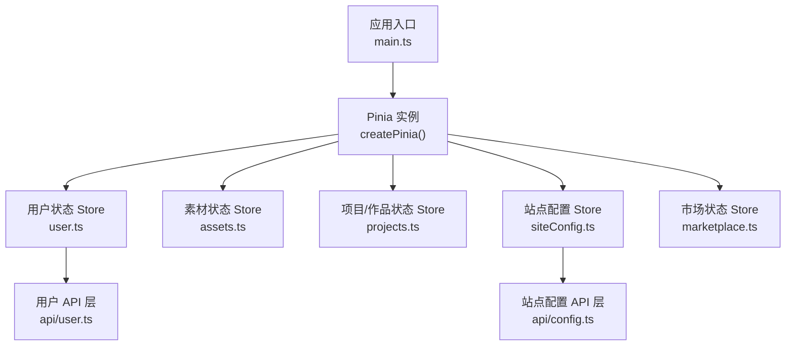
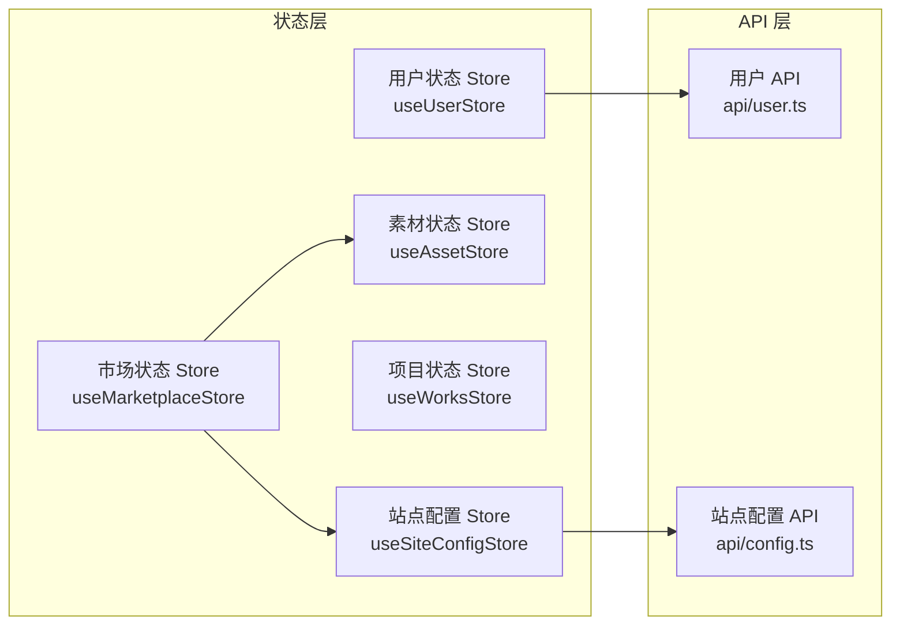
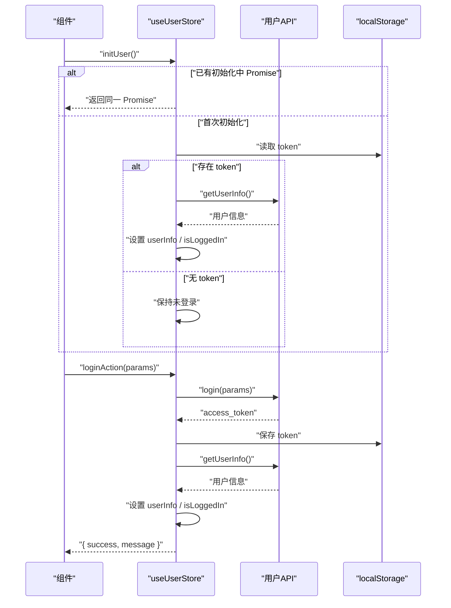
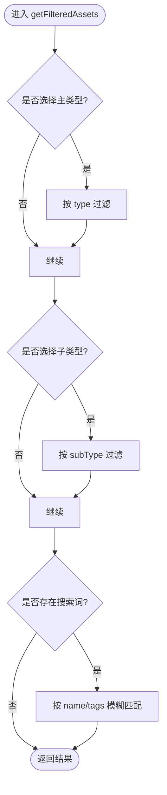
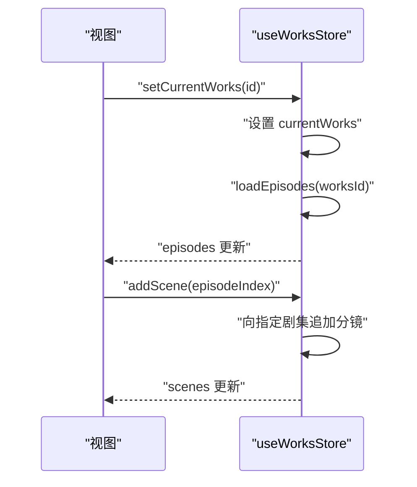
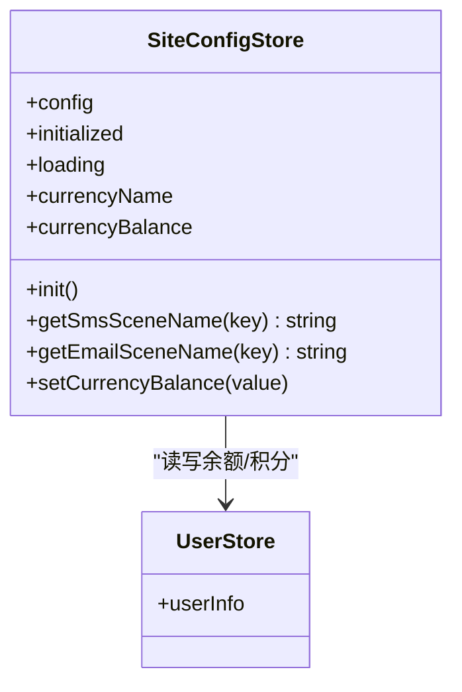
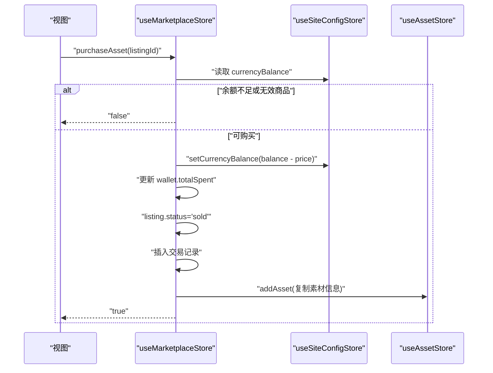
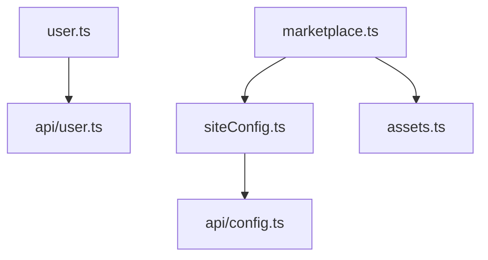

# 状态管理

<cite>
**本文引用的文件**
- [frontend/src/main.ts](file://frontend/src/main.ts)
- [frontend/src/stores/user.ts](file://frontend/src/stores/user.ts)
- [frontend/src/stores/assets.ts](file://frontend/src/stores/assets.ts)
- [frontend/src/stores/projects.ts](file://frontend/src/stores/projects.ts)
- [frontend/src/stores/siteConfig.ts](file://frontend/src/stores/siteConfig.ts)
- [frontend/src/stores/marketplace.ts](file://frontend/src/stores/marketplace.ts)
- [frontend/src/api/user.ts](file://frontend/src/api/user.ts)
- [frontend/src/api/config.ts](file://frontend/src/api/config.ts)
</cite>

## 目录
1. [简介](#简介)
2. [项目结构](#项目结构)
3. [核心组件](#核心组件)
4. [架构总览](#架构总览)
5. [详细组件分析](#详细组件分析)
6. [依赖关系分析](#依赖关系分析)
7. [性能与优化](#性能与优化)
8. [调试与排错](#调试与排错)
9. [结论](#结论)
10. [附录：最佳实践清单](#附录最佳实践清单)

## 简介
本文件围绕前端 Pinia 状态管理进行系统化说明，覆盖 Store 设计原则、模块化组织、异步处理、跨 Store 协作、状态持久化策略、性能优化与调试技巧。并结合用户状态、资产状态、项目（作品）状态、站点配置等具体 Store 的实现方式与数据流进行深入解析，帮助读者快速掌握在项目中如何正确、高效地使用 Pinia。

## 项目结构
本项目采用按领域划分的 Store 组织方式，每个业务域一个独立 Store 文件，便于维护与扩展。应用启动时通过 createPinia 注册全局状态容器，随后各模块按需引入使用。

图表来源
- [frontend/src/main.ts:8-11](file://frontend/src/main.ts#L8-L11)
- [frontend/src/stores/user.ts:1-10](file://frontend/src/stores/user.ts#L1-L10)
- [frontend/src/stores/assets.ts:1-10](file://frontend/src/stores/assets.ts#L1-L10)
- [frontend/src/stores/projects.ts:1-10](file://frontend/src/stores/projects.ts#L1-L10)
- [frontend/src/stores/siteConfig.ts:1-10](file://frontend/src/stores/siteConfig.ts#L1-L10)
- [frontend/src/stores/marketplace.ts:1-10](file://frontend/src/stores/marketplace.ts#L1-L10)
- [frontend/src/api/user.ts:1-10](file://frontend/src/api/user.ts#L1-L10)
- [frontend/src/api/config.ts:1-10](file://frontend/src/api/config.ts#L1-L10)

章节来源
- [frontend/src/main.ts:8-11](file://frontend/src/main.ts#L8-L11)

## 核心组件
- 用户状态 Store（useUserStore）
  - 职责：登录态、用户信息、绑定关系、头像与昵称更新、密码相关操作、初始化防重入。
  - 关键特性：
    - 使用 ref/computed 管理状态与方法。
    - initUser 防止并发重复拉取用户信息。
    - 登录成功后保存 token 并拉取用户信息；登出统一清理本地与内存状态。
    - 提供手机号/邮箱/微信绑定与解绑方法。
    - 头像上传后调用接口保存并同步到 userInfo。
- 素材状态 Store（useAssetStore）
  - 职责：素材列表、筛选与搜索、新增与删除。
  - 关键特性：
    - 类型系统完善（主类型、子类型联合）。
    - 过滤逻辑集中实现，支持多条件组合。
- 项目/作品状态 Store（useWorksStore）
  - 职责：作品 CRUD、当前作品选择、剧集与分镜的增删改查与排序。
  - 关键特性：
    - 提供批量新增分镜、调整顺序等复杂操作。
- 站点配置 Store（useSiteConfigStore）
  - 职责：站点配置加载、模板名称映射、货币名称与余额计算、写入目标字段。
  - 关键特性：
    - computed 根据充值类型动态决定显示与写入的字段。
    - 与 user Store 协作读写余额或积分。
- 市场状态 Store（useMarketplaceStore）
  - 职责：上架商品、交易记录、钱包统计、筛选排序、购买流程。
  - 关键特性：
    - 与 asset Store 联动：购买后将素材加入个人库。
    - 与 siteConfig Store 联动：依据充值类型扣减余额或积分。

章节来源
- [frontend/src/stores/user.ts:1-327](file://frontend/src/stores/user.ts#L1-L327)
- [frontend/src/stores/assets.ts:1-161](file://frontend/src/stores/assets.ts#L1-L161)
- [frontend/src/stores/projects.ts:1-279](file://frontend/src/stores/projects.ts#L1-L279)
- [frontend/src/stores/siteConfig.ts:1-100](file://frontend/src/stores/siteConfig.ts#L1-L100)
- [frontend/src/stores/marketplace.ts:1-334](file://frontend/src/stores/marketplace.ts#L1-L334)

## 架构总览
下图展示 Store 之间的依赖与数据流向，体现“单一职责、低耦合”的设计思想。

图表来源
- [frontend/src/stores/user.ts:1-10](file://frontend/src/stores/user.ts#L1-L10)
- [frontend/src/stores/assets.ts:1-10](file://frontend/src/stores/assets.ts#L1-L10)
- [frontend/src/stores/projects.ts:1-10](file://frontend/src/stores/projects.ts#L1-L10)
- [frontend/src/stores/siteConfig.ts:1-10](file://frontend/src/stores/siteConfig.ts#L1-L10)
- [frontend/src/stores/marketplace.ts:1-10](file://frontend/src/stores/marketplace.ts#L1-L10)
- [frontend/src/api/user.ts:1-10](file://frontend/src/api/user.ts#L1-L10)
- [frontend/src/api/config.ts:1-10](file://frontend/src/api/config.ts#L1-L10)

## 详细组件分析

### 用户状态 Store（useUserStore）
- 状态与方法概览
  - 状态：isLoggedIn、userInfo、initPromise、isPhoneBound/isEmailBound/isWechatBound 等。
  - 方法：saveToken/getToken/clearToken、initUser、loginAction/mobileLoginAction/emailLoginAction、logoutAction、registerAction、changePasswordAction/resetPasswordAction、bind/unbind 系列、updateAvatar/updateNickname。
- 关键流程：初始化与登录
  - 页面刷新时调用 initUser，若存在有效 token 则拉取用户信息并设置 isLoggedIn。
  - 登录成功后保存 token，再拉取用户信息并置为已登录。
- 错误处理
  - 登录失败、token 失效、退出接口异常均有兜底处理，确保本地状态一致。
- 与 API 的集成
  - 通过 api/user.ts 提供的 login、getUserInfo、editProfileField、logout 等方法完成服务端交互。

图表来源
- [frontend/src/stores/user.ts:54-105](file://frontend/src/stores/user.ts#L54-L105)
- [frontend/src/api/user.ts:160-169](file://frontend/src/api/user.ts#L160-L169)

章节来源
- [frontend/src/stores/user.ts:1-327](file://frontend/src/stores/user.ts#L1-L327)
- [frontend/src/api/user.ts:153-226](file://frontend/src/api/user.ts#L153-L226)

### 素材状态 Store（useAssetStore）
- 状态与方法概览
  - 状态：assets、searchQuery、activeFilter、activeSubFilter。
  - 方法：addAsset、deleteAsset、getFilteredAssets。
- 过滤逻辑
  - 支持主类型、子类型、关键词三维度组合过滤。
- 数据结构
  - 定义 Asset 及多种子类型联合类型，保证类型安全。

图表来源
- [frontend/src/stores/assets.ts:132-149](file://frontend/src/stores/assets.ts#L132-L149)

章节来源
- [frontend/src/stores/assets.ts:1-161](file://frontend/src/stores/assets.ts#L1-L161)

### 项目/作品状态 Store（useWorksStore）
- 状态与方法概览
  - 状态：works、currentWorks、episodes。
  - 方法：addWorks/deleteWorks/updateWorks、setCurrentWorks/loadEpisodes、addEpisode/updateEpisode、addScene/addScenesBatch/reorderScene/deleteScene。
- 典型场景
  - 选择作品后自动加载其剧集；对分镜进行增删改与拖拽排序。

图表来源
- [frontend/src/stores/projects.ts:165-221](file://frontend/src/stores/projects.ts#L165-L221)

章节来源
- [frontend/src/stores/projects.ts:1-279](file://frontend/src/stores/projects.ts#L1-L279)

### 站点配置 Store（useSiteConfigStore）
- 状态与方法概览
  - 状态：config、initialized、loading。
  - 方法：init、getSmsSceneName、getEmailSceneName、currencyName、currencyBalance、setCurrencyBalance。
- 跨 Store 协作
  - 根据充值类型动态决定显示与写入的字段（余额或积分），直接读写 user Store 的 userInfo 对应字段。
- 初始化防重
  - initialized 标记避免重复请求。

图表来源
- [frontend/src/stores/siteConfig.ts:17-86](file://frontend/src/stores/siteConfig.ts#L17-L86)
- [frontend/src/stores/user.ts:15-36](file://frontend/src/stores/user.ts#L15-L36)

章节来源
- [frontend/src/stores/siteConfig.ts:1-100](file://frontend/src/stores/siteConfig.ts#L1-L100)
- [frontend/src/api/config.ts:174-200](file://frontend/src/api/config.ts#L174-L200)

### 市场状态 Store（useMarketplaceStore）
- 状态与方法概览
  - 状态：listings、transactions、wallet、筛选与排序参数。
  - 方法：filteredListings/myListings/buyTransactions/sellTransactions、listAsset/listAssetsBatch/unlistAsset/purchaseAsset/updatePrice/toggleLike。
- 跨 Store 协作
  - 购买时：扣减 siteConfigStore.currencyBalance，记录交易，并将素材添加到 asset Store。
  - 上架/下架：与 asset Store 的 listingId 双向同步。

图表来源
- [frontend/src/stores/marketplace.ts:254-293](file://frontend/src/stores/marketplace.ts#L254-L293)
- [frontend/src/stores/siteConfig.ts:77-86](file://frontend/src/stores/siteConfig.ts#L77-L86)
- [frontend/src/stores/assets.ts:115-122](file://frontend/src/stores/assets.ts#L115-L122)

章节来源
- [frontend/src/stores/marketplace.ts:1-334](file://frontend/src/stores/marketplace.ts#L1-L334)

## 依赖关系分析
- 模块内聚性
  - 每个 Store 聚焦单一领域，职责清晰，方法命名直观。
- 外部依赖
  - user Store 依赖 api/user.ts；siteConfig Store 依赖 api/config.ts。
- 跨 Store 依赖
  - marketplace Store 同时依赖 assets Store 与 siteConfig Store，形成“业务编排型”依赖。
- 潜在风险
  - 跨 Store 读写需明确边界，避免循环依赖与隐式副作用。当前依赖方向单向，未见循环引用。

图表来源
- [frontend/src/stores/user.ts:1-10](file://frontend/src/stores/user.ts#L1-L10)
- [frontend/src/stores/siteConfig.ts:1-10](file://frontend/src/stores/siteConfig.ts#L1-L10)
- [frontend/src/stores/marketplace.ts:1-10](file://frontend/src/stores/marketplace.ts#L1-L10)
- [frontend/src/api/user.ts:1-10](file://frontend/src/api/user.ts#L1-L10)
- [frontend/src/api/config.ts:1-10](file://frontend/src/api/config.ts#L1-L10)

章节来源
- [frontend/src/stores/user.ts:1-327](file://frontend/src/stores/user.ts#L1-L327)
- [frontend/src/stores/siteConfig.ts:1-100](file://frontend/src/stores/siteConfig.ts#L1-L100)
- [frontend/src/stores/marketplace.ts:1-334](file://frontend/src/stores/marketplace.ts#L1-L334)
- [frontend/src/stores/assets.ts:1-161](file://frontend/src/stores/assets.ts#L1-L161)

## 性能与优化
- 计算属性优先
  - 使用 computed 做派生数据（如过滤列表、货币名称/余额），减少重复计算与不必要的响应式更新。
- 局部更新
  - 尽量只修改必要字段，避免整对象替换导致的大范围重渲染。
- 防重入与去抖
  - 初始化类操作使用 Promise 缓存（如 initUser）避免并发请求；高频输入可使用防抖。
- 大列表渲染
  - 结合虚拟滚动或分页，避免一次性渲染过多 DOM。
- 惰性加载
  - 仅在需要时拉取配置或用户信息，减少首屏开销。
- 序列化与持久化
  - 仅持久化必要字段，控制体积；注意敏感信息的安全存储策略。

[本节为通用指导，不直接分析具体文件]

## 调试与排错
- 浏览器插件
  - 使用 Vue Devtools 的 Pinia 面板查看状态变更与方法调用栈。
- 日志定位
  - 在关键方法前后打印入参与返回值，关注异常分支与兜底逻辑。
- 常见问题
  - 登录态不一致：检查 initUser 与 logoutAction 的清理路径。
  - 余额/积分不同步：确认 setCurrencyBalance 的充值类型分支是否正确。
  - 过滤结果异常：核对 activeFilter/activeSubFilter/searchQuery 的初始值与更新时机。

章节来源
- [frontend/src/stores/user.ts:54-170](file://frontend/src/stores/user.ts#L54-L170)
- [frontend/src/stores/siteConfig.ts:53-86](file://frontend/src/stores/siteConfig.ts#L53-L86)
- [frontend/src/stores/assets.ts:132-149](file://frontend/src/stores/assets.ts#L132-L149)

## 结论
本项目基于 Pinia 实现了清晰的领域化状态管理，Store 之间职责分明、依赖方向合理。通过 computed 派生数据、防重入初始化、跨 Store 协作等手段，既保证了可维护性，也兼顾了性能与用户体验。后续可在持久化、错误上报、单元测试等方面进一步完善。

[本节为总结性内容，不直接分析具体文件]

## 附录：最佳实践清单
- 设计原则
  - 单一职责：每个 Store 负责一个业务域。
  - 显式副作用：所有网络请求与副作用集中在 Store 方法中。
  - 不可变思维：尽量以新对象/数组替代原对象，便于追踪变更。
- 异步处理
  - 使用 async/await 包裹 API 调用，统一错误处理与用户反馈。
  - 对重复请求进行去重（如 initUser）。
- 状态持久化
  - 将 token 等必要信息存入 localStorage；谨慎持久化敏感数据。
  - 应用启动时恢复必要状态，保证刷新后的体验一致性。
- 与组件集成
  - 在组件中通过 useXxxStore 获取实例，使用 computed 订阅状态，在事件回调中调用方法。
- 调试技巧
  - 利用 Pinia Devtools 观察状态树与方法调用；在关键路径添加日志。

[本节为通用指导，不直接分析具体文件]