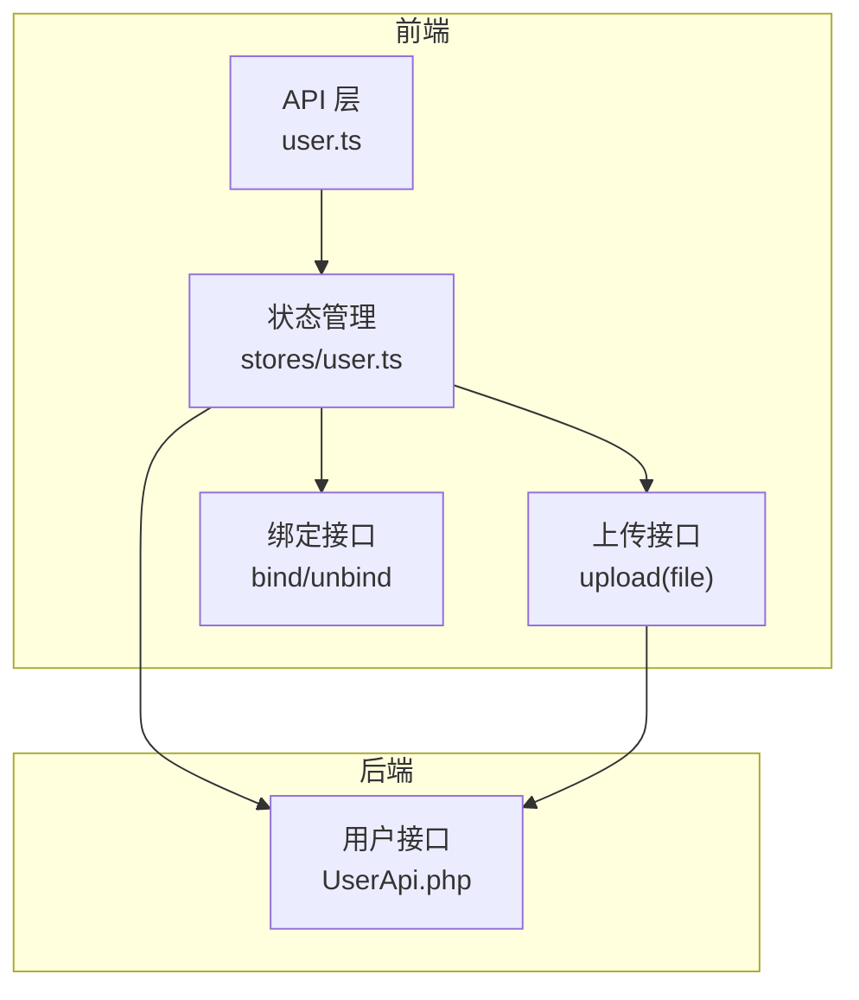
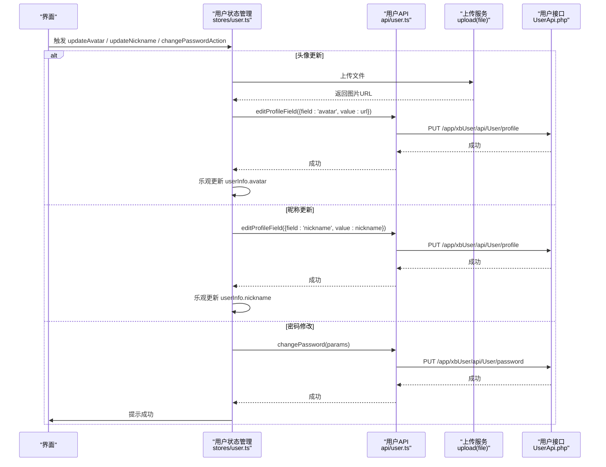
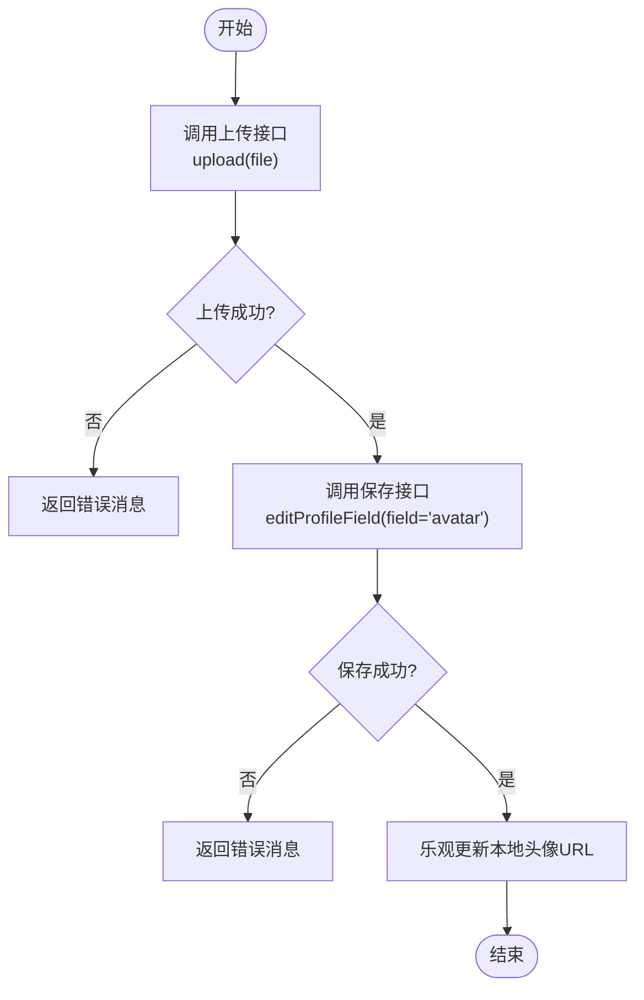
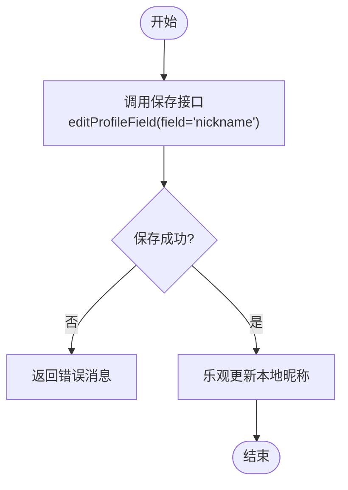
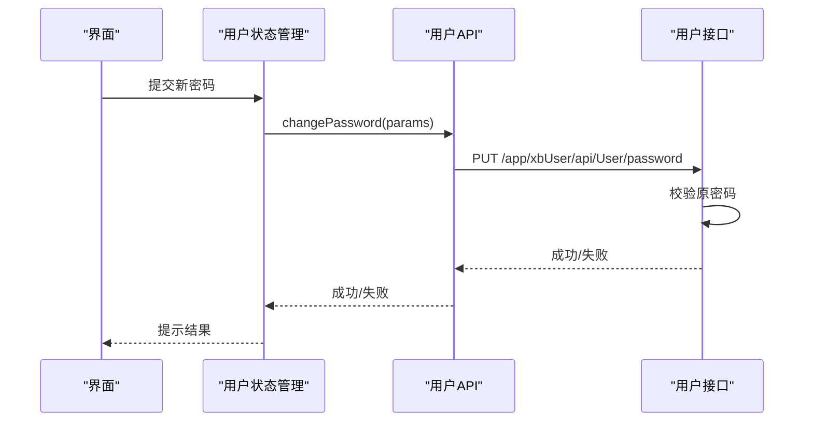
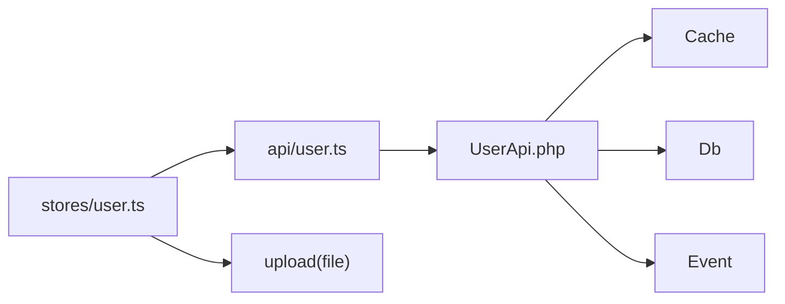

# 用户信息管理

<cite>
**本文引用的文件**   
- [frontend/src/api/user.ts](file://frontend/src/api/user.ts)
- [frontend/src/stores/user.ts](file://frontend/src/stores/user.ts)
- [server/plugin/xbUser/api/UserApi.php](file://server/plugin/xbUser/api/UserApi.php)
</cite>

## 目录
1. [简介](#简介)
2. [项目结构](#项目结构)
3. [核心组件](#核心组件)
4. [架构总览](#架构总览)
5. [详细组件分析](#详细组件分析)
6. [依赖分析](#依赖分析)
7. [性能考虑](#性能考虑)
8. [故障排查指南](#故障排查指南)
9. [结论](#结论)
10. [附录](#附录)

## 简介
本文件聚焦于“用户信息管理”的前后端实现与最佳实践，覆盖以下能力：
- 用户资料编辑（昵称、头像等字段）
- 头像上传与更新
- 密码修改
- 个人信息同步与缓存策略
- 表单验证、文件上传处理、数据一致性保证
- 乐观更新策略、用户体验优化、错误恢复与重试建议

重点方法包括：updateAvatar、updateNickname、changePasswordAction 及其前后端交互流程。

## 项目结构
围绕用户信息管理的代码主要分布在以下位置：
- 前端 API 层：封装用户相关接口调用与类型定义
- 前端状态管理：集中处理登录态、用户信息、操作结果与乐观更新
- 服务端插件：提供用户资料修改、密码修改、单字段更新等接口逻辑

图表来源
- [frontend/src/api/user.ts:150-226](file://frontend/src/api/user.ts#L150-L226)
- [frontend/src/stores/user.ts:273-298](file://frontend/src/stores/user.ts#L273-L298)
- [server/plugin/xbUser/api/UserApi.php:129-158](file://server/plugin/xbUser/api/UserApi.php#L129-L158)

章节来源
- [frontend/src/api/user.ts:150-226](file://frontend/src/api/user.ts#L150-L226)
- [frontend/src/stores/user.ts:1-327](file://frontend/src/stores/user.ts#L1-L327)
- [server/plugin/xbUser/api/UserApi.php:129-158](file://server/plugin/xbUser/api/UserApi.php#L129-L158)

## 核心组件
- 前端 API 层
  - 统一封装用户相关请求，包含获取用户信息、修改资料、修改密码、验证码、登录/登出等
  - 提供严格的数据类型定义，便于 TS 校验与提示
- 前端状态管理
  - 维护登录态、用户信息、绑定状态
  - 提供 updateAvatar、updateNickname、changePasswordAction 等方法，采用“先本地更新再回滚”的乐观更新模式
- 服务端用户接口
  - 提供 save（单字段更新）、password（密码修改）、userinfo（读取用户信息）等核心逻辑
  - 对敏感字段进行过滤，使用事件机制通知外部系统

章节来源
- [frontend/src/api/user.ts:150-226](file://frontend/src/api/user.ts#L150-L226)
- [frontend/src/stores/user.ts:8-327](file://frontend/src/stores/user.ts#L8-L327)
- [server/plugin/xbUser/api/UserApi.php:129-158](file://server/plugin/xbUser/api/UserApi.php#L129-L158)

## 架构总览
下图展示从前端到后端的完整调用链路，涵盖头像上传、昵称修改、密码修改等关键路径。

图表来源
- [frontend/src/stores/user.ts:273-298](file://frontend/src/stores/user.ts#L273-L298)
- [frontend/src/api/user.ts:174-190](file://frontend/src/api/user.ts#L174-L190)
- [server/plugin/xbUser/api/UserApi.php:129-158](file://server/plugin/xbUser/api/UserApi.php#L129-L158)
- [server/plugin/xbUser/api/UserApi.php:214-237](file://server/plugin/xbUser/api/UserApi.php#L214-L237)

## 详细组件分析

### 头像上传与更新（updateAvatar）
- 前端流程
  - 调用 upload(file) 获取服务端图片 URL
  - 调用 editProfileField({ field: 'avatar', value: url }) 持久化
  - 成功后立即在本地更新 userInfo.avatar（乐观更新）
  - 失败时抛出错误并返回消息，由上层 UI 提示
- 后端流程
  - 接收 PUT /app/xbUser/api/User/profile，参数为 { field, value }
  - 校验 field 白名单（当前允许 nickname、avatar）
  - 写入数据库并刷新缓存，触发事件
- 错误处理
  - 上传失败或保存失败均捕获异常，返回统一格式的错误消息
  - 若保存失败，前端不执行乐观更新，避免不一致

图表来源
- [frontend/src/stores/user.ts:273-286](file://frontend/src/stores/user.ts#L273-L286)
- [frontend/src/api/user.ts:174-176](file://frontend/src/api/user.ts#L174-L176)
- [server/plugin/xbUser/api/UserApi.php:129-158](file://server/plugin/xbUser/api/UserApi.php#L129-L158)

章节来源
- [frontend/src/stores/user.ts:273-286](file://frontend/src/stores/user.ts#L273-L286)
- [frontend/src/api/user.ts:174-176](file://frontend/src/api/user.ts#L174-L176)
- [server/plugin/xbUser/api/UserApi.php:129-158](file://server/plugin/xbUser/api/UserApi.php#L129-L158)

### 昵称更新（updateNickname）
- 前端流程
  - 直接调用 editProfileField({ field: 'nickname', value })
  - 成功后立即在本地更新 userInfo.nickname（乐观更新）
- 后端流程
  - 同头像更新，走同一保存接口，校验 field 白名单
- 错误处理
  - 网络或服务端错误均捕获并返回消息，不进行乐观更新

图表来源
- [frontend/src/stores/user.ts:288-298](file://frontend/src/stores/user.ts#L288-L298)
- [frontend/src/api/user.ts:174-176](file://frontend/src/api/user.ts#L174-L176)
- [server/plugin/xbUser/api/UserApi.php:129-158](file://server/plugin/xbUser/api/UserApi.php#L129-L158)

章节来源
- [frontend/src/stores/user.ts:288-298](file://frontend/src/stores/user.ts#L288-L298)
- [frontend/src/api/user.ts:174-176](file://frontend/src/api/user.ts#L174-L176)
- [server/plugin/xbUser/api/UserApi.php:129-158](file://server/plugin/xbUser/api/UserApi.php#L129-L158)

### 密码修改（changePasswordAction）
- 前端流程
  - 调用 changePassword(params)，参数包含原密码与新密码
  - 成功后返回统一的成功消息，由 UI 提示
- 后端流程
  - 校验原密码是否正确，使用安全工具生成哈希比对
  - 校验通过后更新密码，触发事件
- 错误处理
  - 原密码错误或保存失败均抛出异常，前端捕获并返回消息

图表来源
- [frontend/src/stores/user.ts:184-192](file://frontend/src/stores/user.ts#L184-L192)
- [frontend/src/api/user.ts:188-190](file://frontend/src/api/user.ts#L188-L190)
- [server/plugin/xbUser/api/UserApi.php:214-237](file://server/plugin/xbUser/api/UserApi.php#L214-L237)

章节来源
- [frontend/src/stores/user.ts:184-192](file://frontend/src/stores/user.ts#L184-L192)
- [frontend/src/api/user.ts:188-190](file://frontend/src/api/user.ts#L188-L190)
- [server/plugin/xbUser/api/UserApi.php:214-237](file://server/plugin/xbUser/api/UserApi.php#L214-L237)

### 个人信息同步与缓存
- 前端同步
  - 登录后通过 getUserInfo 拉取最新用户信息并写入 store
  - 页面刷新时 initUser 会尝试恢复登录态并拉取用户信息
- 后端缓存
  - 用户信息变更后会刷新缓存，确保后续读取一致
- 一致性保障
  - 前端采用乐观更新，但仅在保存成功后才生效；失败则保持旧值
  - 服务端在写库后刷新缓存，减少跨端不一致风险

章节来源
- [frontend/src/stores/user.ts:54-85](file://frontend/src/stores/user.ts#L54-L85)
- [frontend/src/api/user.ts:167-169](file://frontend/src/api/user.ts#L167-L169)
- [server/plugin/xbUser/api/UserApi.php:435-444](file://server/plugin/xbUser/api/UserApi.php#L435-L444)

## 依赖分析
- 前端依赖
  - stores/user.ts 依赖 api/user.ts 提供的接口函数
  - updateAvatar 额外依赖 upload(file) 用于图片上传
- 后端依赖
  - UserApi.php 依赖数据库、缓存、事件系统与密码工具类
  - 单字段更新接口受白名单限制，仅允许 nickname、avatar

图表来源
- [frontend/src/stores/user.ts:273-298](file://frontend/src/stores/user.ts#L273-L298)
- [frontend/src/api/user.ts:174-190](file://frontend/src/api/user.ts#L174-L190)
- [server/plugin/xbUser/api/UserApi.php:129-158](file://server/plugin/xbUser/api/UserApi.php#L129-L158)

章节来源
- [frontend/src/stores/user.ts:273-298](file://frontend/src/stores/user.ts#L273-L298)
- [frontend/src/api/user.ts:174-190](file://frontend/src/api/user.ts#L174-L190)
- [server/plugin/xbUser/api/UserApi.php:129-158](file://server/plugin/xbUser/api/UserApi.php#L129-L158)

## 性能考虑
- 乐观更新
  - 头像与昵称修改成功后立即更新本地状态，提升响应速度
- 并发控制
  - 初始化用户信息时使用 Promise 防抖，避免重复请求
- 缓存策略
  - 服务端在写库后刷新缓存，降低读放大
- 上传优化
  - 建议在客户端增加图片压缩与尺寸限制，减少带宽占用

[本节为通用指导，无需源码引用]

## 故障排查指南
- 常见错误
  - 原密码错误：检查输入的原密码与服务端哈希比对逻辑
  - 不允许修改的字段：确认 field 是否在白名单内
  - 上传失败：检查网络、文件大小与类型限制
- 定位步骤
  - 查看前端错误消息与返回值
  - 核对服务端日志与事件输出
  - 检查缓存是否及时刷新
- 恢复策略
  - 失败时保留旧值，提示用户重试
  - 对于网络抖动，可引入简单重试与超时控制

章节来源
- [frontend/src/stores/user.ts:184-192](file://frontend/src/stores/user.ts#L184-L192)
- [frontend/src/stores/user.ts:273-298](file://frontend/src/stores/user.ts#L273-L298)
- [server/plugin/xbUser/api/UserApi.php:129-158](file://server/plugin/xbUser/api/UserApi.php#L129-L158)
- [server/plugin/xbUser/api/UserApi.php:214-237](file://server/plugin/xbUser/api/UserApi.php#L214-L237)

## 结论
该用户信息管理模块在前端采用乐观更新与统一错误处理，在后端通过白名单校验、事务与缓存刷新保障数据一致性。整体设计简洁清晰，具备良好的可扩展性与用户体验。建议持续完善上传前处理、重试机制与更细粒度的错误码，以进一步提升稳定性与可用性。

[本节为总结性内容，无需源码引用]

## 附录
- 关键接口路径
  - 获取用户信息：GET /app/xbUser/api/User/info
  - 修改资料（单字段）：PUT /app/xbUser/api/User/profile
  - 修改密码：PUT /app/xbUser/api/User/password
- 关键方法
  - updateAvatar：上传并更新头像
  - updateNickname：更新昵称
  - changePasswordAction：修改密码

章节来源
- [frontend/src/api/user.ts:167-190](file://frontend/src/api/user.ts#L167-L190)
- [frontend/src/stores/user.ts:273-298](file://frontend/src/stores/user.ts#L273-L298)
- [server/plugin/xbUser/api/UserApi.php:129-158](file://server/plugin/xbUser/api/UserApi.php#L129-L158)
- [server/plugin/xbUser/api/UserApi.php:214-237](file://server/plugin/xbUser/api/UserApi.php#L214-L237)