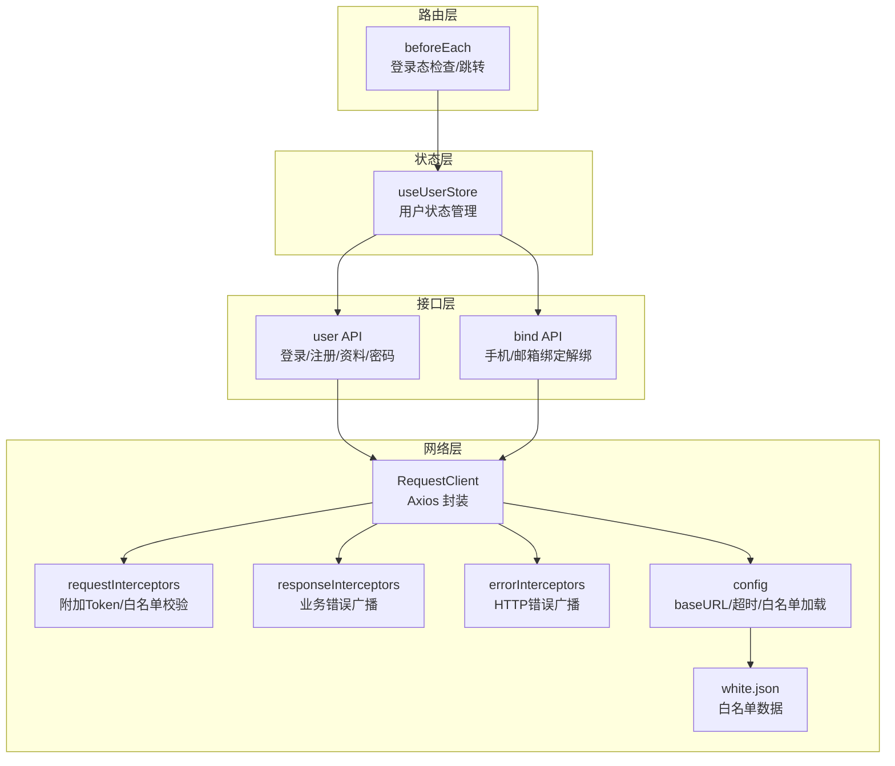
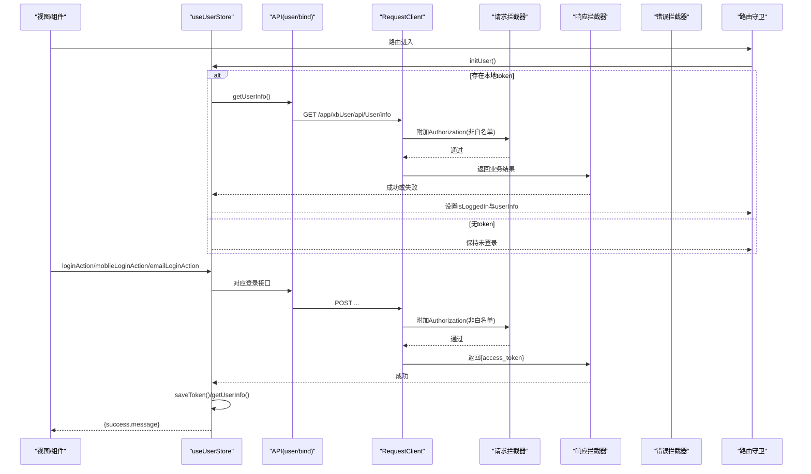
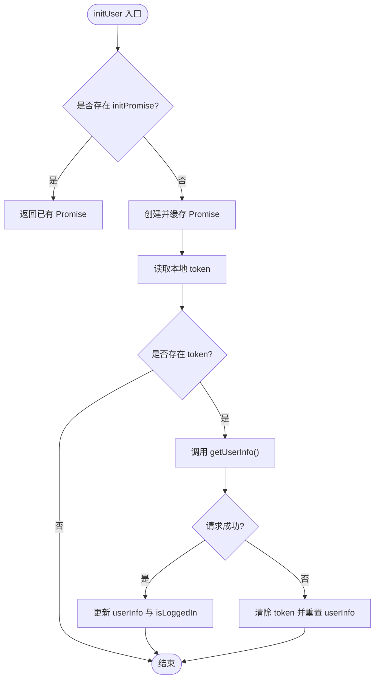
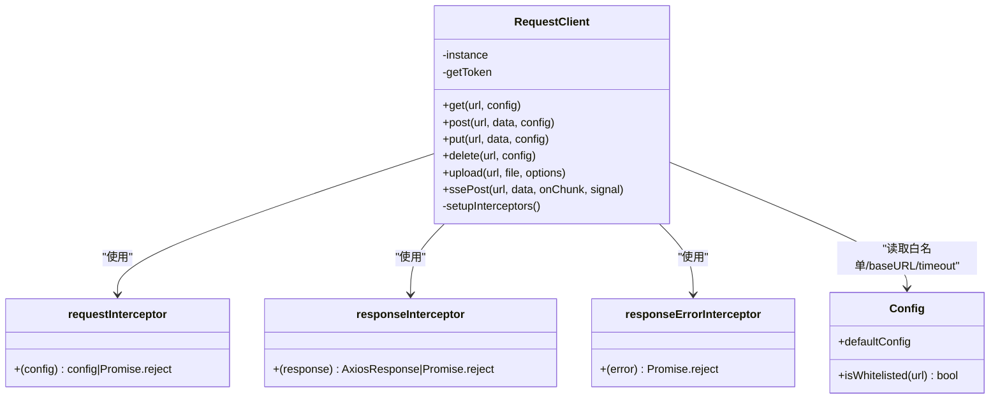
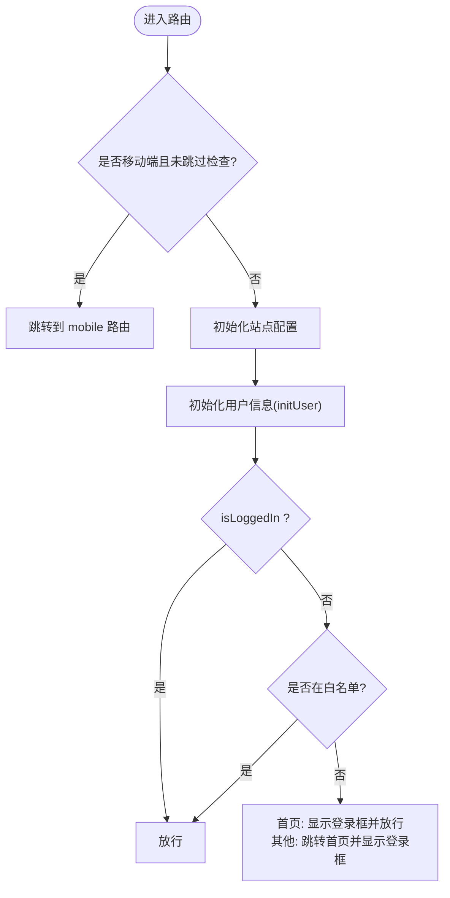
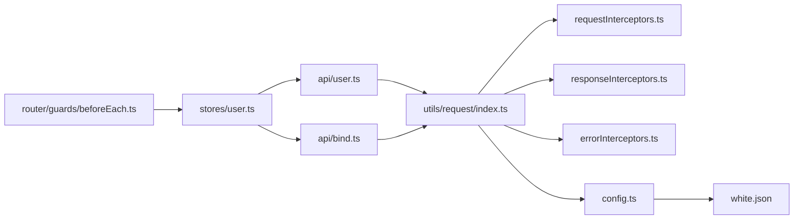
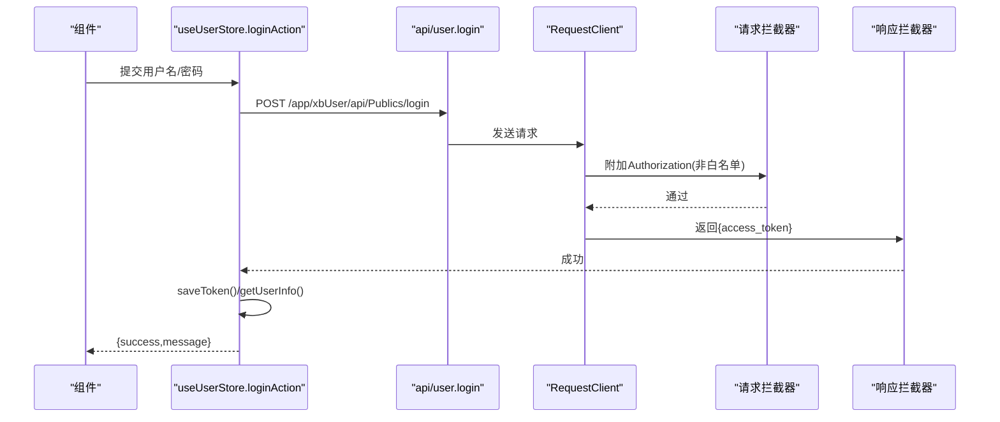
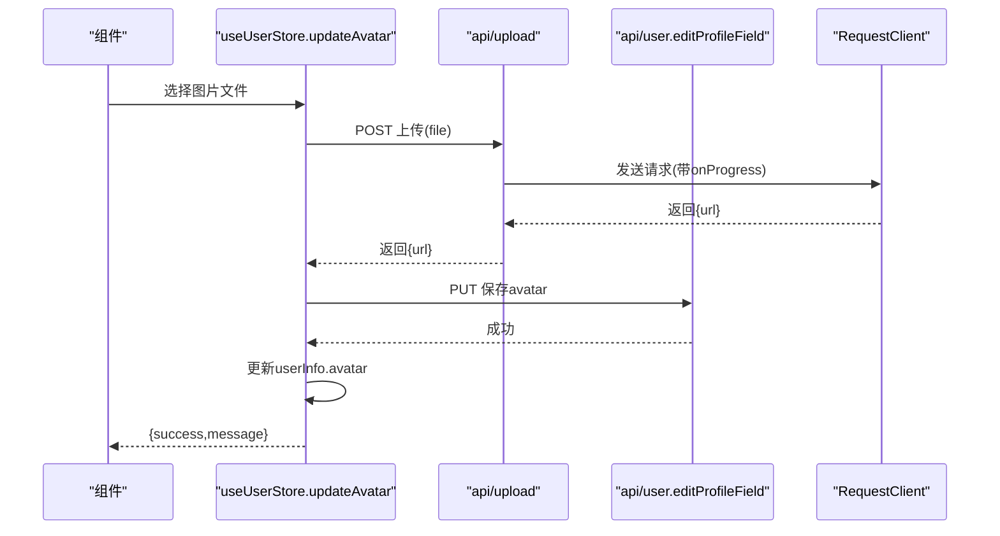

# 用户状态管理

<cite>
**本文引用的文件列表**
- [frontend/src/stores/user.ts](file://frontend/src/stores/user.ts)
- [frontend/src/api/user.ts](file://frontend/src/api/user.ts)
- [frontend/src/api/bind.ts](file://frontend/src/api/bind.ts)
- [frontend/src/utils/request/index.ts](file://frontend/src/utils/request/index.ts)
- [frontend/src/utils/request/config.ts](file://frontend/src/utils/request/config.ts)
- [frontend/src/utils/request/white.json](file://frontend/src/utils/request/white.json)
- [frontend/src/utils/request/requestInterceptors.ts](file://frontend/src/utils/request/requestInterceptors.ts)
- [frontend/src/utils/request/responseInterceptors.ts](file://frontend/src/utils/request/responseInterceptors.ts)
- [frontend/src/utils/request/errorInterceptors.ts](file://frontend/src/utils/request/errorInterceptors.ts)
- [frontend/src/router/guards/beforeEach.ts](file://frontend/src/router/guards/beforeEach.ts)
</cite>

## 更新摘要
**变更内容**
- 移除了VIP会员相关的状态管理逻辑，简化了用户状态管理代码
- 保持了核心用户认证和管理功能，包括登录、登出、用户信息维护等
- 代码量减少了14行，提升了代码简洁性和可维护性

## 目录
1. [简介](#简介)
2. [项目结构](#项目结构)
3. [核心组件](#核心组件)
4. [架构总览](#架构总览)
5. [详细组件分析](#详细组件分析)
6. [依赖关系分析](#依赖关系分析)
7. [性能与并发特性](#性能与并发特性)
8. [故障排查指南](#故障排查指南)
9. [结论](#结论)
10. [附录：关键流程时序图](#附录关键流程时序图)

## 简介
本文件围绕前端用户状态管理的核心实现展开，重点解析 useUserStore 的设计与实现细节。经过简化优化后，当前实现专注于核心用户认证和管理功能，涵盖：
- 用户认证状态管理（登录、登出、初始化）
- Token 持久化存储策略
- 并发请求防重入机制
- 错误处理与状态同步策略
- 第三方绑定管理（手机、邮箱、微信）
- 权限判断与路由守卫
- 头像上传更新等具体业务逻辑

## 项目结构
与用户状态管理相关的代码主要分布在以下模块：
- 状态层：stores/user.ts
- 接口层：api/user.ts、api/bind.ts
- 网络层：utils/request/*（封装 Axios、拦截器、白名单）
- 路由守卫：router/guards/beforeEach.ts

图表来源
- [frontend/src/stores/user.ts:1-327](file://frontend/src/stores/user.ts#L1-L327)
- [frontend/src/api/user.ts:1-226](file://frontend/src/api/user.ts#L1-L226)
- [frontend/src/api/bind.ts:1-58](file://frontend/src/api/bind.ts#L1-L58)
- [frontend/src/utils/request/index.ts:1-237](file://frontend/src/utils/request/index.ts#L1-L237)
- [frontend/src/utils/request/config.ts:1-39](file://frontend/src/utils/request/config.ts#L1-L39)
- [frontend/src/utils/request/white.json:1-28](file://frontend/src/utils/request/white.json#L1-L28)
- [frontend/src/utils/request/requestInterceptors.ts:1-47](file://frontend/src/utils/request/requestInterceptors.ts#L1-L47)
- [frontend/src/utils/request/responseInterceptors.ts:1-24](file://frontend/src/utils/request/responseInterceptors.ts#L1-L24)
- [frontend/src/utils/request/errorInterceptors.ts:1-57](file://frontend/src/utils/request/errorInterceptors.ts#L1-L57)
- [frontend/src/router/guards/beforeEach.ts:1-54](file://frontend/src/router/guards/beforeEach.ts#L1-L54)

章节来源
- [frontend/src/stores/user.ts:1-327](file://frontend/src/stores/user.ts#L1-L327)
- [frontend/src/api/user.ts:1-226](file://frontend/src/api/user.ts#L1-L226)
- [frontend/src/api/bind.ts:1-58](file://frontend/src/api/bind.ts#L1-L58)
- [frontend/src/utils/request/index.ts:1-237](file://frontend/src/utils/request/index.ts#L1-L237)
- [frontend/src/utils/request/config.ts:1-39](file://frontend/src/utils/request/config.ts#L1-L39)
- [frontend/src/utils/request/white.json:1-28](file://frontend/src/utils/request/white.json#L1-L28)
- [frontend/src/utils/request/requestInterceptors.ts:1-47](file://frontend/src/utils/request/requestInterceptors.ts#L1-L47)
- [frontend/src/utils/request/responseInterceptors.ts:1-24](file://frontend/src/utils/request/responseInterceptors.ts#L1-L24)
- [frontend/src/utils/request/errorInterceptors.ts:1-57](file://frontend/src/utils/request/errorInterceptors.ts#L1-L57)
- [frontend/src/router/guards/beforeEach.ts:1-54](file://frontend/src/router/guards/beforeEach.ts#L1-L54)

## 核心组件
- useUserStore：基于 Pinia 的用户状态管理，提供登录、登出、信息维护、第三方绑定、头像上传等功能。
- RequestClient：统一 HTTP 客户端，负责自动注入 Token、白名单校验、统一错误处理、SSE 流式请求、文件上传进度回调等。
- 路由前置守卫：在每次路由切换前完成站点配置与用户信息初始化，并根据登录态进行页面访问控制。

章节来源
- [frontend/src/stores/user.ts:1-327](file://frontend/src/stores/user.ts#L1-L327)
- [frontend/src/utils/request/index.ts:1-237](file://frontend/src/utils/request/index.ts#L1-L237)
- [frontend/src/router/guards/beforeEach.ts:1-54](file://frontend/src/router/guards/beforeEach.ts#L1-L54)

## 架构总览
下图展示了从视图到后端的核心调用链路，以及 Token 的注入与错误处理路径。

图表来源
- [frontend/src/router/guards/beforeEach.ts:19-52](file://frontend/src/router/guards/beforeEach.ts#L19-L52)
- [frontend/src/stores/user.ts:54-85](file://frontend/src/stores/user.ts#L54-L85)
- [frontend/src/stores/user.ts:88-105](file://frontend/src/stores/user.ts#L88-L105)
- [frontend/src/api/user.ts:160-169](file://frontend/src/api/user.ts#L160-L169)
- [frontend/src/utils/request/index.ts:46-58](file://frontend/src/utils/request/index.ts#L46-L58)
- [frontend/src/utils/request/requestInterceptors.ts:12-38](file://frontend/src/utils/request/requestInterceptors.ts#L12-L38)
- [frontend/src/utils/request/responseInterceptors.ts:10-23](file://frontend/src/utils/request/responseInterceptors.ts#L10-L23)

## 详细组件分析

### useUserStore 设计与实现
- 状态字段
  - isLoggedIn：是否已登录
  - userInfo：当前用户信息（含余额、积分、头像等）
  - isPhoneBound/isEmailBound/isWechatBound：计算属性，用于展示第三方绑定状态
  - initPromise：用于防止并发重复初始化用户信息
- Token 持久化
  - saveToken/getToken/clearToken：基于 localStorage 的存取与清理
- 初始化与并发控制
  - initUser：若存在 initPromise 则直接复用；否则发起 getUserInfo 并缓存 Promise，避免多次刷新时重复请求
  - 当获取用户信息失败（如 token 失效），会清除本地 token 并重置用户信息
- 登录流程
  - loginAction/mobileLoginAction/emailLoginAction：调用对应登录接口，成功后保存 token、拉取用户信息、设置 isLoggedIn
  - 异常捕获后返回统一的 { success, message }
- 登出流程
  - logoutAction：先尝试调用服务端退出接口，无论成功与否均在 finally 中清理本地 token 与用户信息
- 第三方绑定管理
  - 手机号：bindPhone/unbindPhone，成功后同步更新 userInfo.mobile
  - 邮箱：bindEmailAction/unbindEmailAction，成功后同步更新 userInfo.email
  - 微信：bindWechat/unbindWechat（示例实现为模拟延迟，实际可替换为真实接口）
- 个人资料修改
  - updateAvatar：先调用 upload 上传头像，再调用 editProfileField 保存 avatar，最后更新本地 userInfo.avatar
  - updateNickname：调用 editProfileField 更新昵称并同步本地状态
- 密码相关
  - changePasswordAction/resetPasswordAction：分别处理修改密码与找回密码

图表来源
- [frontend/src/stores/user.ts:54-85](file://frontend/src/stores/user.ts#L54-L85)

章节来源
- [frontend/src/stores/user.ts:1-327](file://frontend/src/stores/user.ts#L1-L327)

### 网络层与拦截器
- RequestClient
  - 构造时注入 getToken 函数，默认从 localStorage 读取 token
  - 统一封装 get/post/put/delete/upload/ssePost
  - upload 支持 onProgress 进度回调、额外表单字段、自定义 headers、AbortController 取消
  - ssePost 使用 XMLHttpRequest 实现 SSE 流式接收，自动附加 Authorization
- 请求拦截器
  - 自动设置 accept、X-Requested-With、Content-Type（FormData 除外）
  - 白名单接口无需 Token；非白名单若无 Token 则拒绝请求
  - 非白名单接口自动附加 Authorization: Bearer <token>
- 响应拦截器
  - 对业务错误（status !== 0）进行统一广播与 reject
- 错误拦截器
  - 根据 HTTP 状态码（403、301、302、其他）广播不同事件，便于全局统一处理
- 白名单配置
  - white.json 定义免登录接口列表，isWhitelisted 支持精确匹配与通配符匹配

图表来源
- [frontend/src/utils/request/index.ts:32-233](file://frontend/src/utils/request/index.ts#L32-L233)
- [frontend/src/utils/request/requestInterceptors.ts:12-38](file://frontend/src/utils/request/requestInterceptors.ts#L12-L38)
- [frontend/src/utils/request/responseInterceptors.ts:10-23](file://frontend/src/utils/request/responseInterceptors.ts#L10-L23)
- [frontend/src/utils/request/errorInterceptors.ts:10-56](file://frontend/src/utils/request/errorInterceptors.ts#L10-L56)
- [frontend/src/utils/request/config.ts:7-38](file://frontend/src/utils/request/config.ts#L7-L38)

章节来源
- [frontend/src/utils/request/index.ts:1-237](file://frontend/src/utils/request/index.ts#L1-L237)
- [frontend/src/utils/request/config.ts:1-39](file://frontend/src/utils/request/config.ts#L1-L39)
- [frontend/src/utils/request/white.json:1-28](file://frontend/src/utils/request/white.json#L1-L28)
- [frontend/src/utils/request/requestInterceptors.ts:1-47](file://frontend/src/utils/request/requestInterceptors.ts#L1-L47)
- [frontend/src/utils/request/responseInterceptors.ts:1-24](file://frontend/src/utils/request/responseInterceptors.ts#L1-L24)
- [frontend/src/utils/request/errorInterceptors.ts:1-57](file://frontend/src/utils/request/errorInterceptors.ts#L1-L57)

### 路由守卫与登录态检查
- beforeEach 前置拦截
  - 移动端设备检测与跳转
  - 初始化站点配置与用户信息（await userStore.initUser()）
  - 未登录时的策略：
    - 白名单路由直接放行
    - 首页弹出登录框并允许访问
    - 其他页面跳转到首页并弹出登录框
  - 已登录则放行

图表来源
- [frontend/src/router/guards/beforeEach.ts:19-52](file://frontend/src/router/guards/beforeEach.ts#L19-L52)
- [frontend/src/stores/user.ts:54-85](file://frontend/src/stores/user.ts#L54-L85)

章节来源
- [frontend/src/router/guards/beforeEach.ts:1-54](file://frontend/src/router/guards/beforeEach.ts#L1-L54)

### 第三方绑定管理
- 手机号绑定/解绑：调用 bind.ts 中的接口，成功后同步更新 userInfo.mobile
- 邮箱绑定/解绑：调用 bind.ts 中的接口，成功后同步更新 userInfo.email
- 微信绑定/解绑：当前为模拟实现，可在后续替换为真实接口

章节来源
- [frontend/src/stores/user.ts:205-271](file://frontend/src/stores/user.ts#L205-L271)
- [frontend/src/api/bind.ts:1-58](file://frontend/src/api/bind.ts#L1-L58)

### 头像上传与更新
- 流程：选择图片 -> 调用 upload 上传 -> 调用 editProfileField 保存 avatar -> 更新本地 userInfo.avatar
- 优点：上传与资料更新分离，便于扩展更多字段更新能力

章节来源
- [frontend/src/stores/user.ts:273-286](file://frontend/src/stores/user.ts#L273-286)
- [frontend/src/api/user.ts:174-176](file://frontend/src/api/user.ts#L174-176)
- [frontend/src/utils/request/index.ts:82-121](file://frontend/src/utils/request/index.ts#L82-121)

## 依赖关系分析
- useUserStore 依赖 api/user.ts 与 api/bind.ts 提供的接口
- api 层依赖 utils/request/index.ts 的 RequestClient
- RequestClient 依赖 requestInterceptors、responseInterceptors、errorInterceptors 与 config（含 white.json）
- 路由守卫依赖 useUserStore 的 initUser 与 isLoggedIn

图表来源
- [frontend/src/stores/user.ts:1-327](file://frontend/src/stores/user.ts#L1-L327)
- [frontend/src/api/user.ts:1-226](file://frontend/src/api/user.ts#L1-L226)
- [frontend/src/api/bind.ts:1-58](file://frontend/src/api/bind.ts#L1-L58)
- [frontend/src/utils/request/index.ts:1-237](file://frontend/src/utils/request/index.ts#L1-L237)
- [frontend/src/utils/request/config.ts:1-39](file://frontend/src/utils/request/config.ts#L1-L39)
- [frontend/src/utils/request/white.json:1-28](file://frontend/src/utils/request/white.json#L1-L28)
- [frontend/src/router/guards/beforeEach.ts:1-54](file://frontend/src/router/guards/beforeEach.ts#L1-L54)

章节来源
- [frontend/src/stores/user.ts:1-327](file://frontend/src/stores/user.ts#L1-L327)
- [frontend/src/api/user.ts:1-226](file://frontend/src/api/user.ts#L1-L226)
- [frontend/src/api/bind.ts:1-58](file://frontend/src/api/bind.ts#L1-L58)
- [frontend/src/utils/request/index.ts:1-237](file://frontend/src/utils/request/index.ts#L1-L237)
- [frontend/src/utils/request/config.ts:1-39](file://frontend/src/utils/request/config.ts#L1-L39)
- [frontend/src/utils/request/white.json:1-28](file://frontend/src/utils/request/white.json#L1-L28)
- [frontend/src/router/guards/beforeEach.ts:1-54](file://frontend/src/router/guards/beforeEach.ts#L1-L54)

## 性能与并发特性
- 并发防重入
  - initUser 使用 ref<Promise<void>> 缓存初始化 Promise，避免页面刷新或多处同时触发导致的重复请求
- 网络层优化
  - upload 支持 onProgress 回调，提升用户体验
  - ssePost 使用 XMLHttpRequest 实现流式接收，减少内存占用与解析开销
- 白名单机制
  - 免登录接口通过白名单快速放行，减少不必要的 Token 校验与鉴权开销

章节来源
- [frontend/src/stores/user.ts:54-85](file://frontend/src/stores/user.ts#L54-L85)
- [frontend/src/utils/request/index.ts:82-121](file://frontend/src/utils/request/index.ts#L82-121)
- [frontend/src/utils/request/index.ts:132-227](file://frontend/src/utils/request/index.ts#L132-227)
- [frontend/src/utils/request/config.ts:14-38](file://frontend/src/utils/request/config.ts#L14-L38)

## 故障排查指南
- 登录态丢失或频繁跳回首页
  - 检查 initUser 是否正确执行，确认 getUserInfo 是否因 token 失效被拒绝
  - 查看 requestInterceptors 是否对非白名单接口正确附加 Authorization
  - 确认 white.json 是否包含必要接口
- 业务错误提示不友好
  - 检查 responseInterceptors 是否正确广播业务错误
  - 检查 errorInterceptors 是否按 HTTP 状态码分发事件
- 上传失败或进度不更新
  - 检查 upload 的 onProgress 回调是否被触发
  - 确认 FormData 的 Content-Type 未被手动覆盖
- 路由守卫导致无法访问
  - 检查 beforeEach 中的移动端检测与白名单逻辑
  - 确认 initUser 是否成功设置 isLoggedIn

章节来源
- [frontend/src/stores/user.ts:54-85](file://frontend/src/stores/user.ts#L54-L85)
- [frontend/src/utils/request/requestInterceptors.ts:12-38](file://frontend/src/utils/request/requestInterceptors.ts#L12-L38)
- [frontend/src/utils/request/responseInterceptors.ts:10-23](file://frontend/src/utils/request/responseInterceptors.ts#L10-L23)
- [frontend/src/utils/request/errorInterceptors.ts:10-56](file://frontend/src/utils/request/errorInterceptors.ts#L10-L56)
- [frontend/src/router/guards/beforeEach.ts:19-52](file://frontend/src/router/guards/beforeEach.ts#L19-L52)

## 结论
useUserStore 以清晰的状态结构与完善的错误处理为核心，结合 RequestClient 的统一网络层与路由守卫的登录态检查，实现了稳定可靠的认证与用户信息管理方案。经过简化优化后，移除了VIP会员相关的复杂逻辑，代码更加简洁易维护。其并发防重入、白名单机制、上传进度与 SSE 流式支持，进一步提升了用户体验与系统健壮性。建议后续将微信绑定替换为真实接口，并在必要时引入 token 刷新机制以增强长期会话体验。

## 附录：关键流程时序图

### 登录流程（账号密码）

图表来源
- [frontend/src/stores/user.ts:88-105](file://frontend/src/stores/user.ts#L88-L105)
- [frontend/src/api/user.ts:160-169](file://frontend/src/api/user.ts#L160-L169)
- [frontend/src/utils/request/index.ts:46-58](file://frontend/src/utils/request/index.ts#L46-L58)
- [frontend/src/utils/request/requestInterceptors.ts:12-38](file://frontend/src/utils/request/requestInterceptors.ts#L12-L38)
- [frontend/src/utils/request/responseInterceptors.ts:10-23](file://frontend/src/utils/request/responseInterceptors.ts#L10-L23)

### 头像上传与更新

图表来源
- [frontend/src/stores/user.ts:273-286](file://frontend/src/stores/user.ts#L273-286)
- [frontend/src/api/user.ts:174-176](file://frontend/src/api/user.ts#L174-176)
- [frontend/src/utils/request/index.ts:82-121](file://frontend/src/utils/request/index.ts#L82-121)