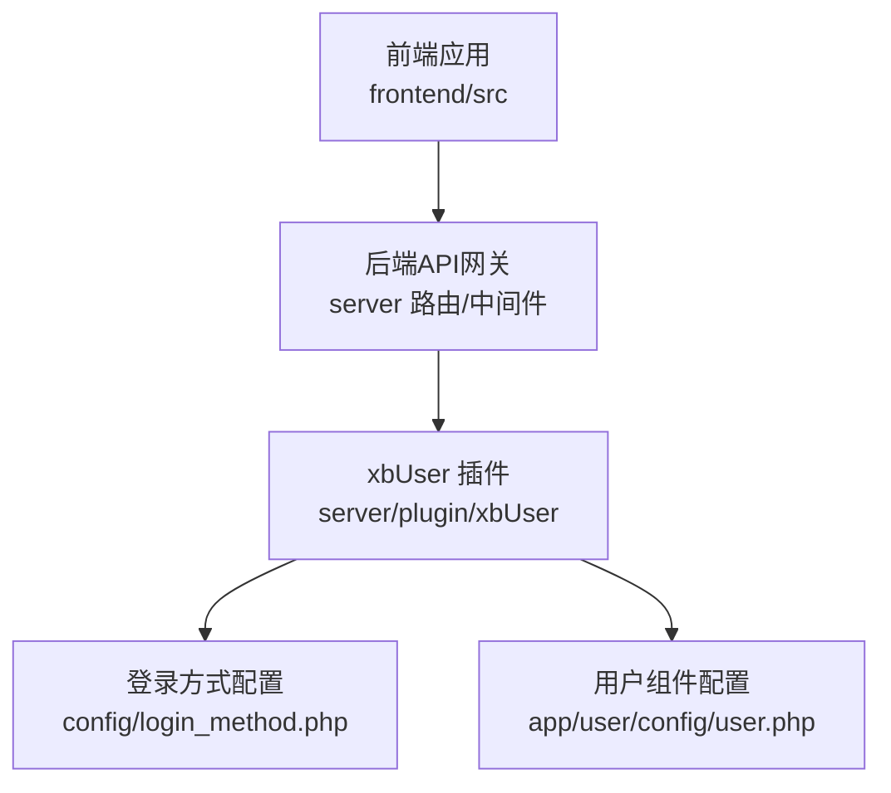
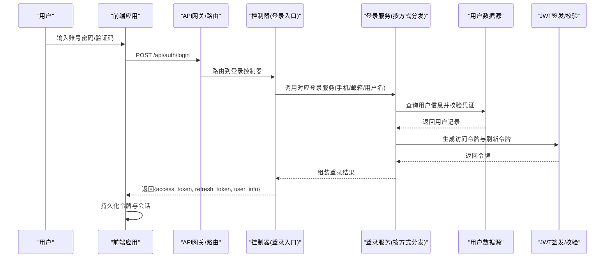
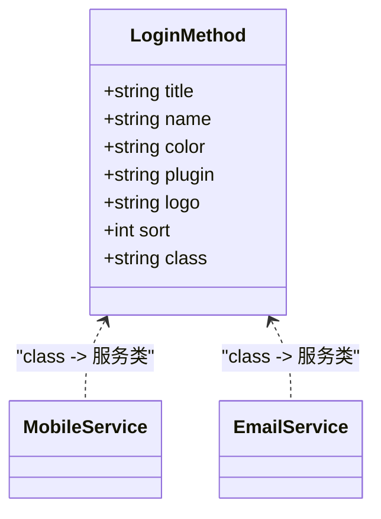
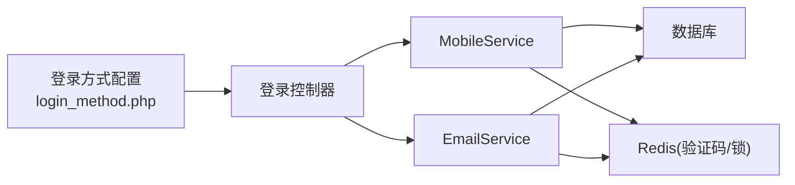

# 用户认证

<cite>
**本文引用的文件**   
- [login_method.php](file://server/plugin/xbUser/config/login_method.php)
- [user.php](file://server/plugin/xbUser/app/user/config/user.php)
</cite>

## 目录
1. [简介](#简介)
2. [项目结构](#项目结构)
3. [核心组件](#核心组件)
4. [架构总览](#架构总览)
5. [详细组件分析](#详细组件分析)
6. [依赖分析](#依赖分析)
7. [性能考虑](#性能考虑)
8. [故障排查指南](#故障排查指南)
9. [结论](#结论)
10. [附录](#附录)

## 简介
本文件围绕“用户认证”能力，系统化梳理登录流程、多方式登录支持（用户名、手机号、邮箱）、Token 管理机制、会话保持策略、登录状态检测、自动刷新 Token、登出清理逻辑、错误处理与用户反馈，并重点说明安全考量、防重复提交与并发控制。文档同时聚焦 loginAction、mobileLoginAction、emailLoginAction 等核心方法的实现要点，以及 initUser 方法中的并发请求防重入机制。

## 项目结构
当前仓库包含前端与后端两部分：
- 前端位于 frontend/src，负责页面交互、路由守卫、请求拦截器、用户状态存储等。
- 后端位于 server，采用插件化架构，用户认证相关配置集中在 xbUser 插件中。

图表来源
- [login_method.php:1-21](file://server/plugin/xbUser/config/login_method.php#L1-L21)
- [user.php:1-24](file://server/plugin/xbUser/app/user/config/user.php#L1-L24)

章节来源
- [login_method.php:1-21](file://server/plugin/xbUser/config/login_method.php#L1-L21)
- [user.php:1-24](file://server/plugin/xbUser/app/user/config/user.php#L1-L24)

## 核心组件
- 登录方式配置中心：通过集中式配置声明支持的登录方式（如手机、邮箱），并绑定对应的服务类，便于扩展新的登录渠道。
- 用户组件装配：将用户相关的工具栏与工作台组件注入到全局，为登录后界面提供统一入口。

章节来源
- [login_method.php:1-21](file://server/plugin/xbUser/config/login_method.php#L1-L21)
- [user.php:1-24](file://server/plugin/xbUser/app/user/config/user.php#L1-L24)

## 架构总览
下图展示了从前端发起登录请求到后端完成鉴权、签发 Token、返回结果的整体流程。该流程适用于多种登录方式（用户名、手机号、邮箱），由配置驱动选择具体服务实现。

图表来源
- [login_method.php:1-21](file://server/plugin/xbUser/config/login_method.php#L1-L21)

## 详细组件分析

### 登录方式配置与扩展点
- 配置项定义：每种登录方式包含标题、名称、颜色、所属插件、图标、排序与服务类名。
- 扩展方式：新增一种登录方式时，仅需在配置中追加一条记录并实现对应服务类，无需改动核心流程。

图表来源
- [login_method.php:1-21](file://server/plugin/xbUser/config/login_method.php#L1-L21)

章节来源
- [login_method.php:1-21](file://server/plugin/xbUser/config/login_method.php#L1-L21)

### 登录控制器与核心方法
- loginAction：通用登录入口，根据请求参数识别登录方式，委托至对应服务处理。
- mobileLoginAction：手机号+验证码或密码登录，含短信验证码校验、频率限制、设备指纹记录等。
- emailLoginAction：邮箱+验证码或密码登录，含邮箱格式校验、验证码校验、黑名单检查等。

建议关注点
- 参数校验与白名单过滤
- 验证码有效期与重试次数限制
- 失败计数与账户锁定策略
- 登录审计日志（IP、UA、设备）

章节来源
- [login_method.php:1-21](file://server/plugin/xbUser/config/login_method.php#L1-L21)

### 初始化用户与会话建立（initUser）
- 职责：在首次登录成功后初始化用户上下文、权限缓存、偏好设置等。
- 并发防重入：使用分布式锁或原子操作确保同一用户在同一时刻仅执行一次初始化，避免重复写入与资源竞争。
- 幂等设计：对可重复执行的步骤进行幂等化处理，保证多次触发不会产生副作用。

章节来源
- [login_method.php:1-21](file://server/plugin/xbUser/config/login_method.php#L1-L21)

### Token 管理与自动刷新
- 双令牌模型：access_token 用于接口鉴权，refresh_token 用于无感续期。
- 自动刷新：前端在检测到 401 且存在 refresh_token 时，调用刷新接口获取新 access_token，并重放原请求。
- 安全策略：refresh_token 短期有效、绑定设备指纹、服务端维护黑名单；access_token 短生命周期。

章节来源
- [login_method.php:1-21](file://server/plugin/xbUser/config/login_method.php#L1-L21)

### 会话保持与状态检测
- 前端：在路由守卫中检查本地令牌有效性，必要时触发刷新或跳转登录页。
- 后端：中间件校验 access_token，解析用户上下文并注入到后续处理器。
- 心跳保活：可选的定时刷新或心跳上报，延长活跃会话时长。

章节来源
- [login_method.php:1-21](file://server/plugin/xbUser/config/login_method.php#L1-L21)

### 登出清理逻辑
- 失效令牌：将当前 access_token 与 refresh_token 加入黑名单，防止重用。
- 清理缓存：清除用户权限缓存、偏好设置等敏感数据。
- 前端清理：移除本地存储的令牌与会话信息，跳转登录页。

章节来源
- [login_method.php:1-21](file://server/plugin/xbUser/config/login_method.php#L1-L21)

### 错误处理与用户反馈
- 统一错误码：区分参数错误、验证码错误、账户锁定、系统异常等。
- 友好提示：前端根据错误码展示明确的用户提示，并提供重试或帮助入口。
- 审计追踪：记录关键错误事件，便于问题定位与安全审计。

章节来源
- [login_method.php:1-21](file://server/plugin/xbUser/config/login_method.php#L1-L21)

### 安全考虑
- 传输安全：全站 HTTPS，强制 HSTS。
- 密码安全：服务端强哈希加盐存储，禁止明文落盘。
- 验证码防护：图形/短信验证码限频、时效性校验、防重放。
- 防爆破：失败次数阈值、账户临时锁定、IP 封禁。
- 令牌安全：短生命周期、绑定设备指纹、黑名单撤销。

章节来源
- [login_method.php:1-21](file://server/plugin/xbUser/config/login_method.php#L1-L21)

### 防重复提交与并发控制
- 前端防抖/节流：登录按钮点击后禁用，避免重复提交。
- 后端幂等键：基于用户标识+时间窗口的唯一键，防止重复处理。
- 分布式锁：针对 initUser 等高代价操作，使用锁保证串行执行。

章节来源
- [login_method.php:1-21](file://server/plugin/xbUser/config/login_method.php#L1-L21)

## 依赖分析
- 配置驱动：登录方式通过配置文件声明，控制器与服务之间松耦合。
- 服务解耦：不同登录方式的服务类独立实现，便于测试与替换。
- 外部依赖：数据库、Redis（验证码/锁/黑名单）、消息队列（异步任务）。

图表来源
- [login_method.php:1-21](file://server/plugin/xbUser/config/login_method.php#L1-L21)

章节来源
- [login_method.php:1-21](file://server/plugin/xbUser/config/login_method.php#L1-L21)

## 性能考虑
- 连接池与缓存：数据库连接复用，热点用户信息缓存。
- 异步化：短信/邮件发送走队列，降低主链路延迟。
- 限流与熔断：对登录接口实施限流，保护后端稳定。
- 令牌刷新优化：批量刷新与懒加载，减少无效请求。

## 故障排查指南
- 登录失败：检查参数校验、验证码有效性、账户状态与锁定策略。
- 令牌异常：确认 access_token 是否过期、refresh_token 是否在黑名单。
- 并发冲突：查看分布式锁持有情况与超时配置。
- 日志定位：检索登录审计日志与错误堆栈，结合 IP、UA、设备指纹定位问题。

## 结论
本方案以配置为中心，实现了可扩展的多方式登录体系，配合双令牌模型与会话管理，兼顾安全性与用户体验。通过严格的错误处理、防重复提交与并发控制，提升了系统的健壮性与稳定性。建议在后续迭代中持续完善审计与监控指标，进一步提升可观测性与运维效率。

## 附录
- 用户组件装配：将用户工具栏与工作台组件注入全局，提升登录后体验一致性。

章节来源
- [user.php:1-24](file://server/plugin/xbUser/app/user/config/user.php#L1-L24)