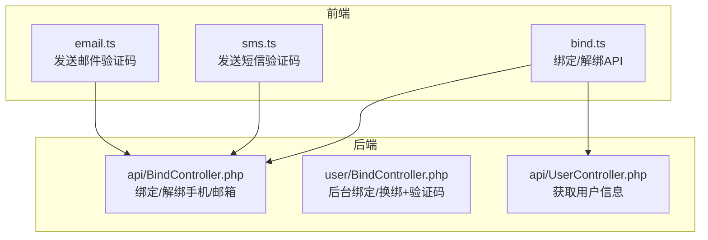
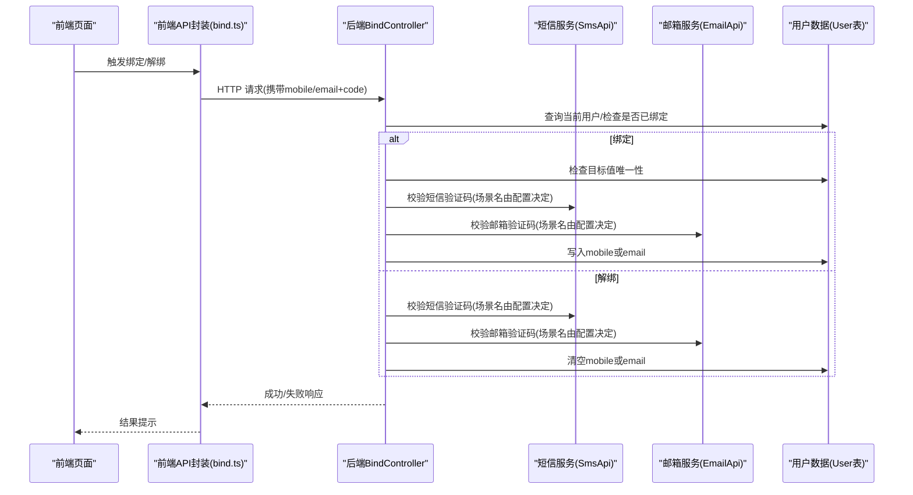
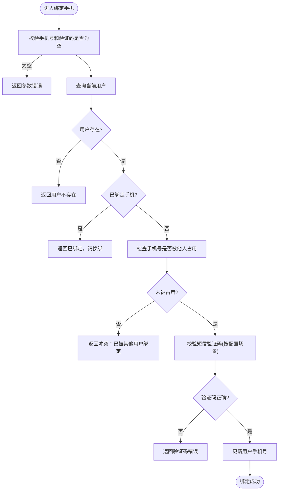
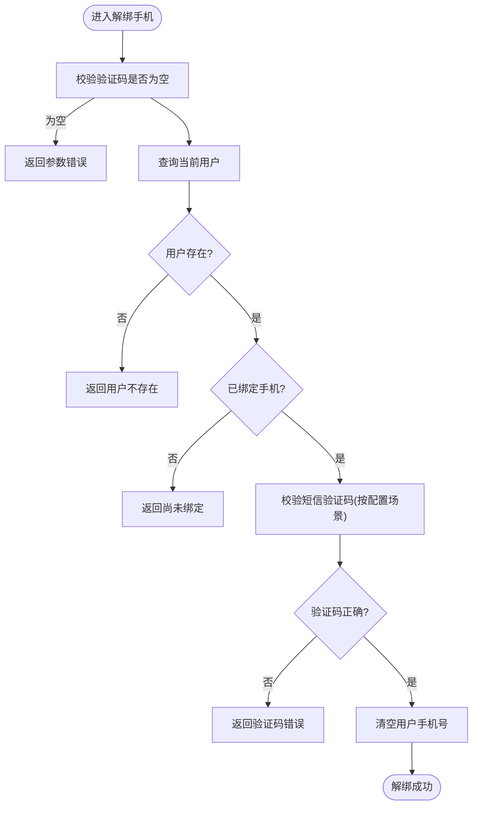
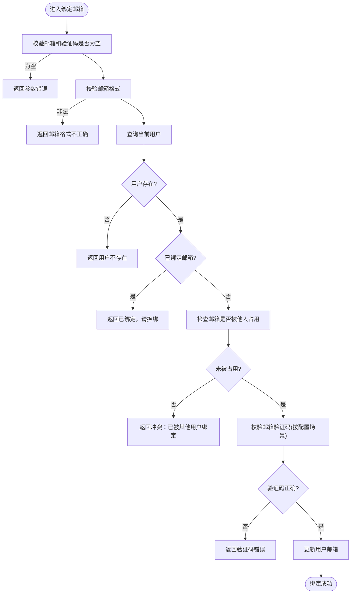
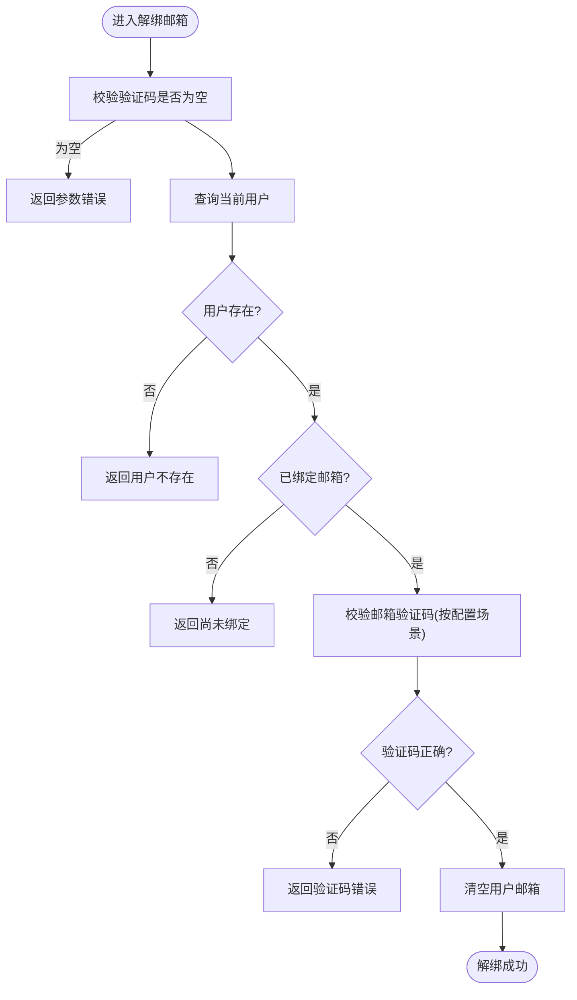
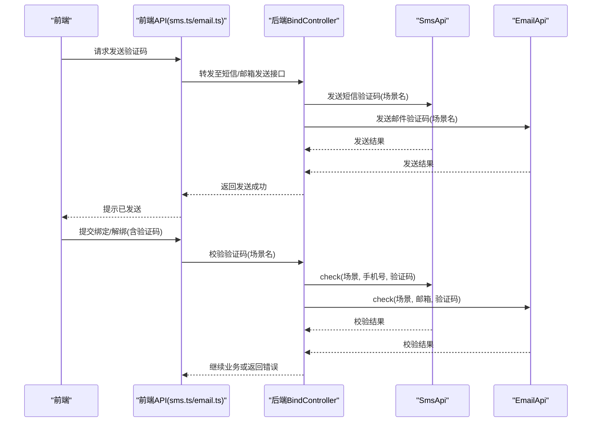
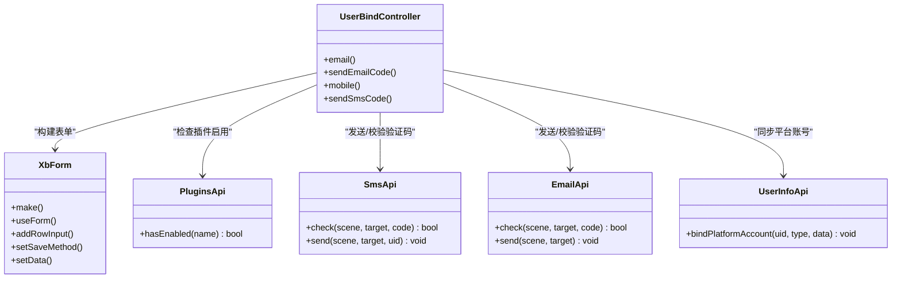
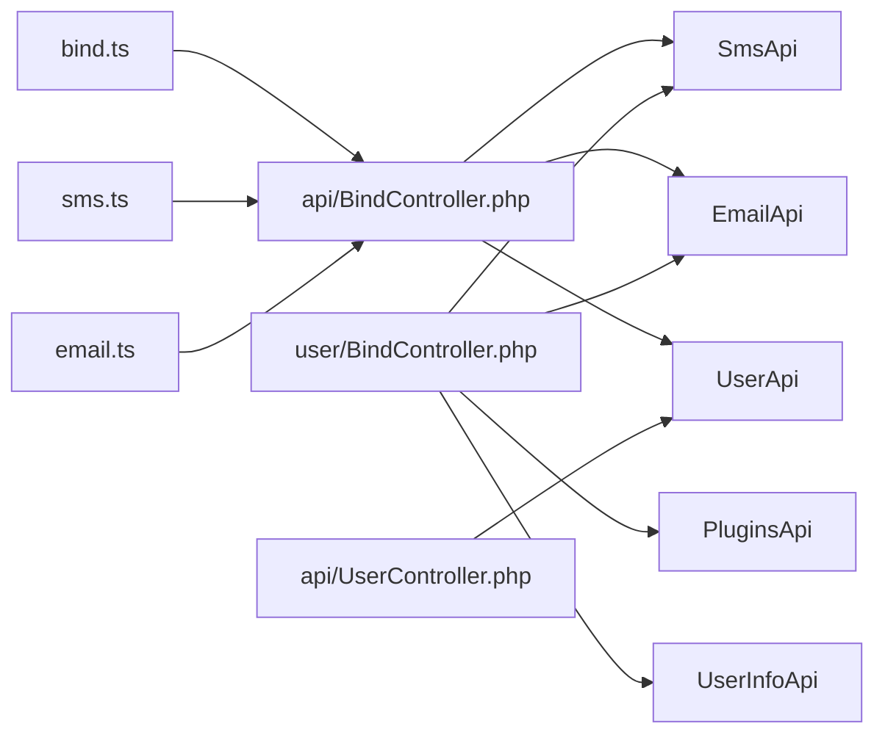

# 第三方绑定管理

<cite>
**本文引用的文件**   
- [frontend/src/api/bind.ts](file://frontend/src/api/bind.ts)
- [frontend/src/api/email.ts](file://frontend/src/api/email.ts)
- [frontend/src/api/sms.ts](file://frontend/src/api/sms.ts)
- [server/plugin/xbUser/app/api/controller/BindController.php](file://server/plugin/xbUser/app/api/controller/BindController.php)
- [server/plugin/xbUser/app/user/controller/BindController.php](file://server/plugin/xbUser/app/user/controller/BindController.php)
- [server/plugin/xbUser/app/api/controller/UserController.php](file://server/plugin/xbUser/app/api/controller/UserController.php)
</cite>

## 目录
1. [简介](#简介)
2. [项目结构](#项目结构)
3. [核心组件](#核心组件)
4. [架构总览](#架构总览)
5. [详细组件分析](#详细组件分析)
6. [依赖关系分析](#依赖关系分析)
7. [性能与一致性](#性能与一致性)
8. [安全性考虑](#安全性考虑)
9. [用户体验优化](#用户体验优化)
10. [错误处理策略](#错误处理策略)
11. [故障排查指南](#故障排查指南)
12. [结论](#结论)

## 简介
本文件聚焦“第三方绑定管理”，覆盖手机号绑定、邮箱绑定等账号关联能力，重点说明验证码流程、绑定状态管理、解绑操作、冲突处理机制，并深入分析 bindPhone（前端对应 bindMobile）、unbindPhone（前端对应 unlockBindMobile）、bindEmailAction（前端对应 bindMail）、unbindEmailAction（前端对应 unlockMail）等方法的前后端实现逻辑与状态同步机制。同时给出安全性、性能与用户体验方面的建议。

## 项目结构
围绕绑定功能，前后端关键文件如下：
- 前端 API 封装
  - 绑定接口：bind.ts
  - 短信验证码：sms.ts
  - 邮箱验证码：email.ts
- 后端控制器
  - 开放 API 绑定控制器：server/plugin/xbUser/app/api/controller/BindController.php
  - 后台表单绑定控制器：server/plugin/xbUser/app/user/controller/BindController.php
  - 用户信息接口：server/plugin/xbUser/app/api/controller/UserController.php

图表来源
- [frontend/src/api/bind.ts:1-58](file://frontend/src/api/bind.ts#L1-L58)
- [frontend/src/api/sms.ts:1-24](file://frontend/src/api/sms.ts#L1-L24)
- [frontend/src/api/email.ts:1-24](file://frontend/src/api/email.ts#L1-L24)
- [server/plugin/xbUser/app/api/controller/BindController.php:1-177](file://server/plugin/xbUser/app/api/controller/BindController.php#L1-L177)
- [server/plugin/xbUser/app/user/controller/BindController.php:1-300](file://server/plugin/xbUser/app/user/controller/BindController.php#L1-L300)
- [server/plugin/xbUser/app/api/controller/UserController.php:1-112](file://server/plugin/xbUser/app/api/controller/UserController.php#L1-L112)

章节来源
- [frontend/src/api/bind.ts:1-58](file://frontend/src/api/bind.ts#L1-L58)
- [frontend/src/api/sms.ts:1-24](file://frontend/src/api/sms.ts#L1-L24)
- [frontend/src/api/email.ts:1-24](file://frontend/src/api/email.ts#L1-L24)
- [server/plugin/xbUser/app/api/controller/BindController.php:1-177](file://server/plugin/xbUser/app/api/controller/BindController.php#L1-L177)
- [server/plugin/xbUser/app/user/controller/BindController.php:1-300](file://server/plugin/xbUser/app/user/controller/BindController.php#L1-L300)
- [server/plugin/xbUser/app/api/controller/UserController.php:1-112](file://server/plugin/xbUser/app/api/controller/UserController.php#L1-L112)

## 核心组件
- 前端绑定 API 封装
  - 绑定手机：bindMobile(params)
  - 解绑手机：unlockBindMobile(params)
  - 绑定邮箱：bindMail(params)
  - 解绑邮箱：unlockMail(params)
- 验证码发送
  - 短信：sendSms / sendAuthSms
  - 邮箱：sendEmailCode / sendAuthEmailCode
- 后端绑定控制器
  - PUT /app/xbUser/api/Bind/bindMobile
  - DELETE /app/xbUser/api/Bind/unlockBindMobile
  - PUT /app/xbUser/api/Bind/bindMail
  - DELETE /app/xbUser/api/Bind/unlockMail
- 用户信息接口
  - GET /app/xbUser/api/User/info

章节来源
- [frontend/src/api/bind.ts:31-58](file://frontend/src/api/bind.ts#L31-L58)
- [frontend/src/api/sms.ts:11-24](file://frontend/src/api/sms.ts#L11-L24)
- [frontend/src/api/email.ts:11-24](file://frontend/src/api/email.ts#L11-L24)
- [server/plugin/xbUser/app/api/controller/BindController.php:26-176](file://server/plugin/xbUser/app/api/controller/BindController.php#L26-L176)
- [server/plugin/xbUser/app/api/controller/UserController.php:23-49](file://server/plugin/xbUser/app/api/controller/UserController.php#L23-L49)

## 架构总览
从前端到后端的调用链路如下：
- 前端通过 axios 封装发起请求
- 后端 BindController 校验参数、验证码、唯一性，再更新用户资料
- 用户信息通过 UserController.info 返回，供前端刷新展示

图表来源
- [frontend/src/api/bind.ts:31-58](file://frontend/src/api/bind.ts#L31-L58)
- [server/plugin/xbUser/app/api/controller/BindController.php:33-175](file://server/plugin/xbUser/app/api/controller/BindController.php#L33-L175)

## 详细组件分析

### 绑定手机（bindPhone / bindMobile）
- 前端入口
  - bindMobile(params): 调用 PUT /app/xbUser/api/Bind/bindMobile
- 后端流程
  - 校验 mobile、code 非空
  - 查询当前用户，若不存在则失败
  - 若已绑定手机，拒绝重复绑定
  - 检测该手机号是否已被其他用户占用
  - 根据配置的场景名校验短信验证码
  - 使用 UserApi.edit 更新用户 mobile
  - 返回成功
- 状态同步
  - 前端可在成功后调用 getUserInfo 刷新用户信息，确保界面显示最新绑定状态

图表来源
- [frontend/src/api/bind.ts:31-36](file://frontend/src/api/bind.ts#L31-L36)
- [server/plugin/xbUser/app/api/controller/BindController.php:33-64](file://server/plugin/xbUser/app/api/controller/BindController.php#L33-L64)

章节来源
- [frontend/src/api/bind.ts:31-36](file://frontend/src/api/bind.ts#L31-L36)
- [server/plugin/xbUser/app/api/controller/BindController.php:33-64](file://server/plugin/xbUser/app/api/controller/BindController.php#L33-L64)

### 解绑手机（unbindPhone / unlockBindMobile）
- 前端入口
  - unlockBindMobile(params): 调用 DELETE /app/xbUser/api/Bind/unlockBindMobile
- 后端流程
  - 校验 code 非空
  - 查询当前用户，若不存在则失败
  - 若未绑定手机，拒绝解绑
  - 根据配置的场景名校验短信验证码
  - 清空用户 mobile
  - 返回成功
- 状态同步
  - 前端可刷新用户信息以反映解绑结果

图表来源
- [frontend/src/api/bind.ts:38-43](file://frontend/src/api/bind.ts#L38-L43)
- [server/plugin/xbUser/app/api/controller/BindController.php:73-95](file://server/plugin/xbUser/app/api/controller/BindController.php#L73-L95)

章节来源
- [frontend/src/api/bind.ts:38-43](file://frontend/src/api/bind.ts#L38-L43)
- [server/plugin/xbUser/app/api/controller/BindController.php:73-95](file://server/plugin/xbUser/app/api/controller/BindController.php#L73-L95)

### 绑定邮箱（bindEmailAction / bindMail）
- 前端入口
  - bindMail(params): 调用 PUT /app/xbUser/api/Bind/bindMail
- 后端流程
  - 校验 email、code 非空，且邮箱格式合法
  - 查询当前用户，若不存在则失败
  - 若已绑定邮箱，拒绝重复绑定
  - 检测该邮箱是否已被其他用户占用
  - 根据配置的场景名校验邮箱验证码
  - 使用 UserApi.edit 更新用户 email
  - 返回成功
- 状态同步
  - 前端可刷新用户信息以反映绑定结果

图表来源
- [frontend/src/api/bind.ts:45-50](file://frontend/src/api/bind.ts#L45-L50)
- [server/plugin/xbUser/app/api/controller/BindController.php:104-138](file://server/plugin/xbUser/app/api/controller/BindController.php#L104-L138)

章节来源
- [frontend/src/api/bind.ts:45-50](file://frontend/src/api/bind.ts#L45-L50)
- [server/plugin/xbUser/app/api/controller/BindController.php:104-138](file://server/plugin/xbUser/app/api/controller/BindController.php#L104-L138)

### 解绑邮箱（unbindEmailAction / unlockMail）
- 前端入口
  - unlockMail(params): 调用 DELETE /app/xbUser/api/Bind/unlockMail
- 后端流程
  - 校验 code 非空
  - 查询当前用户，若不存在则失败
  - 若未绑定邮箱，拒绝解绑
  - 根据配置的场景名校验邮箱验证码
  - 清空用户 email
  - 返回成功
- 状态同步
  - 前端可刷新用户信息以反映解绑结果

图表来源
- [frontend/src/api/bind.ts:52-57](file://frontend/src/api/bind.ts#L52-L57)
- [server/plugin/xbUser/app/api/controller/BindController.php:153-175](file://server/plugin/xbUser/app/api/controller/BindController.php#L153-L175)

章节来源
- [frontend/src/api/bind.ts:52-57](file://frontend/src/api/bind.ts#L52-L57)
- [server/plugin/xbUser/app/api/controller/BindController.php:153-175](file://server/plugin/xbUser/app/api/controller/BindController.php#L153-L175)

### 验证码流程（短信/邮箱）
- 发送验证码
  - 短信：sendSms / sendAuthSms
  - 邮箱：sendEmailCode / sendAuthEmailCode
- 验证验证码
  - 绑定/解绑时，后端根据配置的场景名调用 SmsApi.check / EmailApi.check 进行校验

图表来源
- [frontend/src/api/sms.ts:11-24](file://frontend/src/api/sms.ts#L11-L24)
- [frontend/src/api/email.ts:11-24](file://frontend/src/api/email.ts#L11-L24)
- [server/plugin/xbUser/app/api/controller/BindController.php:59-61](file://server/plugin/xbUser/app/api/controller/BindController.php#L59-L61)
- [server/plugin/xbUser/app/api/controller/BindController.php:133-134](file://server/plugin/xbUser/app/api/controller/BindController.php#L133-L134)

章节来源
- [frontend/src/api/sms.ts:11-24](file://frontend/src/api/sms.ts#L11-L24)
- [frontend/src/api/email.ts:11-24](file://frontend/src/api/email.ts#L11-L24)
- [server/plugin/xbUser/app/api/controller/BindController.php:59-61](file://server/plugin/xbUser/app/api/controller/BindController.php#L59-L61)
- [server/plugin/xbUser/app/api/controller/BindController.php:133-134](file://server/plugin/xbUser/app/api/controller/BindController.php#L133-L134)

### 后台绑定/换绑（用户中心）
- 提供邮箱/手机绑定与换绑的表单渲染与保存逻辑
- 支持验证码按钮倒计时与发送
- 绑定成功后尝试同步平台账号（不影响主流程）

图表来源
- [server/plugin/xbUser/app/user/controller/BindController.php:34-132](file://server/plugin/xbUser/app/user/controller/BindController.php#L34-L132)
- [server/plugin/xbUser/app/user/controller/BindController.php:168-268](file://server/plugin/xbUser/app/user/controller/BindController.php#L168-L268)

章节来源
- [server/plugin/xbUser/app/user/controller/BindController.php:34-132](file://server/plugin/xbUser/app/user/controller/BindController.php#L34-L132)
- [server/plugin/xbUser/app/user/controller/BindController.php:168-268](file://server/plugin/xbUser/app/user/controller/BindController.php#L168-L268)

## 依赖关系分析
- 前端依赖
  - bind.ts 依赖 request 封装
  - sms.ts/email.ts 依赖 request 封装
- 后端依赖
  - api/BindController 依赖 SmsApi、EmailApi、UserApi、User 模型
  - user/BindController 依赖 SmsApi、EmailApi、PluginsApi、UserInfoApi、XbForm
  - api/UserController 依赖 UserApi、User 模型

图表来源
- [frontend/src/api/bind.ts:1-58](file://frontend/src/api/bind.ts#L1-L58)
- [frontend/src/api/sms.ts:1-24](file://frontend/src/api/sms.ts#L1-L24)
- [frontend/src/api/email.ts:1-24](file://frontend/src/api/email.ts#L1-L24)
- [server/plugin/xbUser/app/api/controller/BindController.php:1-177](file://server/plugin/xbUser/app/api/controller/BindController.php#L1-L177)
- [server/plugin/xbUser/app/user/controller/BindController.php:1-300](file://server/plugin/xbUser/app/user/controller/BindController.php#L1-L300)
- [server/plugin/xbUser/app/api/controller/UserController.php:1-112](file://server/plugin/xbUser/app/api/controller/UserController.php#L1-L112)

章节来源
- [frontend/src/api/bind.ts:1-58](file://frontend/src/api/bind.ts#L1-L58)
- [frontend/src/api/sms.ts:1-24](file://frontend/src/api/sms.ts#L1-L24)
- [frontend/src/api/email.ts:1-24](file://frontend/src/api/email.ts#L1-L24)
- [server/plugin/xbUser/app/api/controller/BindController.php:1-177](file://server/plugin/xbUser/app/api/controller/BindController.php#L1-L177)
- [server/plugin/xbUser/app/user/controller/BindController.php:1-300](file://server/plugin/xbUser/app/user/controller/BindController.php#L1-L300)
- [server/plugin/xbUser/app/api/controller/UserController.php:1-112](file://server/plugin/xbUser/app/api/controller/UserController.php#L1-L112)

## 性能与一致性
- 数据库访问
  - 绑定/解绑前均进行用户查询与唯一性检查，注意在高并发下可能产生竞态条件；建议在应用层加锁或在数据库层面增加唯一约束与重试机制
- 验证码校验
  - 验证码通常基于缓存存储，需关注缓存命中率与过期时间设置，避免频繁失效导致体验下降
- 外部服务调用
  - 短信/邮箱发送为外部依赖，应设置超时与降级策略，避免阻塞主流程
- 状态同步
  - 绑定/解绑成功后，前端应刷新用户信息接口，保证 UI 与后端一致

[本节为通用指导，不直接分析具体文件]

## 安全性考虑
- 输入校验
  - 手机号/邮箱格式校验、非空校验已在后端执行
- 验证码安全
  - 使用独立场景名区分不同用途，防止复用
  - 验证码应短时效、一次性使用
- 防重放与限流
  - 对验证码发送与绑定/解绑接口实施频率限制，防止暴力攻击
- 权限控制
  - 绑定/解绑接口需鉴权，仅允许本人操作
- 敏感信息脱敏
  - 后台表单在展示原手机号/邮箱时应脱敏

章节来源
- [server/plugin/xbUser/app/api/controller/BindController.php:33-175](file://server/plugin/xbUser/app/api/controller/BindController.php#L33-L175)
- [server/plugin/xbUser/app/user/controller/BindController.php:96-132](file://server/plugin/xbUser/app/user/controller/BindController.php#L96-L132)
- [server/plugin/xbUser/app/user/controller/BindController.php:231-268](file://server/plugin/xbUser/app/user/controller/BindController.php#L231-L268)

## 用户体验优化
- 明确提示
  - 对“已绑定”“尚未绑定”“已被他人占用”等状态给出清晰提示
- 验证码倒计时
  - 后台表单内置倒计时与重发按钮，提升易用性
- 一键刷新
  - 绑定/解绑成功后自动刷新用户信息，减少手动刷新
- 错误聚合
  - 将多个校验错误合并返回，减少往返次数

章节来源
- [server/plugin/xbUser/app/user/controller/BindController.php:96-132](file://server/plugin/xbUser/app/user/controller/BindController.php#L96-L132)
- [server/plugin/xbUser/app/user/controller/BindController.php:231-268](file://server/plugin/xbUser/app/user/controller/BindController.php#L231-L268)

## 错误处理策略
- 参数缺失
  - 返回明确的字段级错误提示
- 业务冲突
  - 已绑定/尚未绑定/已被他人占用等场景分别返回不同错误码与消息
- 验证码错误
  - 统一返回验证码错误，避免泄露过多细节
- 外部服务异常
  - 短信/邮箱发送失败时返回友好提示，并记录日志

章节来源
- [server/plugin/xbUser/app/api/controller/BindController.php:33-175](file://server/plugin/xbUser/app/api/controller/BindController.php#L33-L175)

## 故障排查指南
- 绑定失败
  - 检查手机号/邮箱格式是否正确
  - 确认验证码是否有效且未过期
  - 查看是否已被其他用户占用
- 无法发送验证码
  - 检查短信/邮箱插件是否安装并启用
  - 核对场景名配置是否正确
- 状态不一致
  - 调用用户信息接口刷新本地状态
  - 检查是否存在并发修改导致的竞态问题

章节来源
- [server/plugin/xbUser/app/user/controller/BindController.php:140-160](file://server/plugin/xbUser/app/user/controller/BindController.php#L140-L160)
- [server/plugin/xbUser/app/user/controller/BindController.php:276-298](file://server/plugin/xbUser/app/user/controller/BindController.php#L276-L298)
- [server/plugin/xbUser/app/api/controller/UserController.php:27-49](file://server/plugin/xbUser/app/api/controller/UserController.php#L27-L49)

## 结论
本方案实现了手机号与邮箱的绑定与解绑闭环，包含完整的验证码流程、冲突检测与状态同步。为保证高可用与安全，建议加强并发保护、限流与审计日志，并在前端提供更友好的交互与错误提示。对于微信等第三方平台的绑定，可按相同模式扩展：新增第三方标识的唯一性校验、授权回调处理与平台账号同步逻辑。