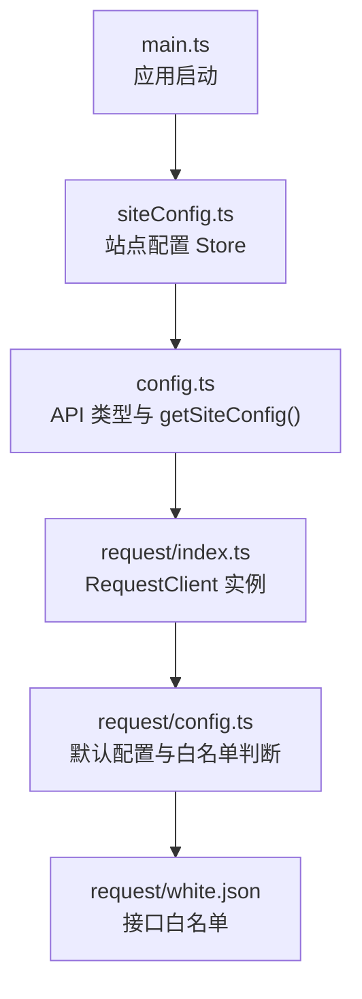
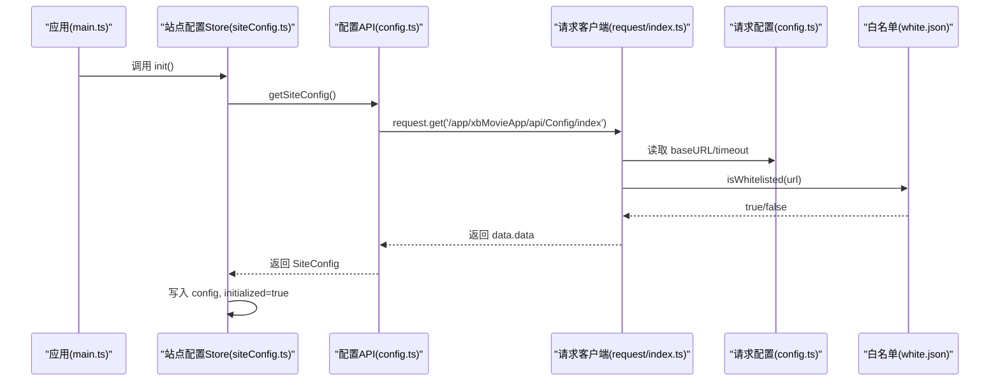
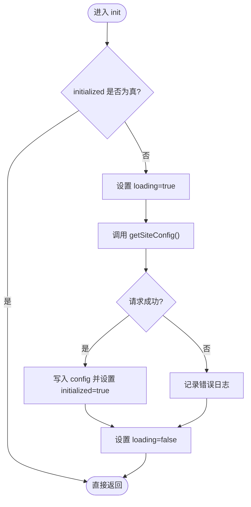
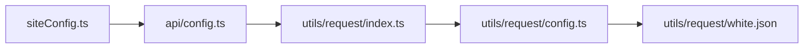

# 站点配置管理

<cite>
**本文引用的文件**
- [frontend/src/stores/siteConfig.ts](file://frontend/src/stores/siteConfig.ts)
- [frontend/src/api/config.ts](file://frontend/src/api/config.ts)
- [frontend/src/utils/request/index.ts](file://frontend/src/utils/request/index.ts)
- [frontend/src/utils/request/config.ts](file://frontend/src/utils/request/config.ts)
- [frontend/src/utils/request/white.json](file://frontend/src/utils/request/white.json)
- [frontend/src/main.ts](file://frontend/src/main.ts)
</cite>

## 目录
1. [简介](#简介)
2. [项目结构](#项目结构)
3. [核心组件](#核心组件)
4. [架构总览](#架构总览)
5. [详细组件分析](#详细组件分析)
6. [依赖关系分析](#依赖关系分析)
7. [性能考虑](#性能考虑)
8. [故障排查指南](#故障排查指南)
9. [结论](#结论)
10. [附录](#附录)

## 简介
本文件围绕“站点配置管理”展开，聚焦前端全局配置的状态管理实现与数据流。当前仓库中已实现的站点配置主要包含：系统信息、备案信息、短信/邮件模板、用户中心与充值提现策略、登录方式列表、资产市场开关、社区动态开关等。文档将详细说明配置的获取流程、状态存储、计算派生值、错误处理与扩展点，并给出迁移、版本兼容与性能优化的建议方案。

## 项目结构
与站点配置相关的前端代码主要集中在以下模块：
- 状态层：Pinia store 负责站点配置数据的加载、缓存与派生计算
- API 层：定义站点配置的数据结构与请求方法
- 网络层：统一的 Axios 客户端、拦截器、白名单机制
- 启动入口：应用初始化时注册事件处理器（为后续热更新预留）

图示来源
- [frontend/src/main.ts:1-21](file://frontend/src/main.ts#L1-L21)
- [frontend/src/stores/siteConfig.ts:1-100](file://frontend/src/stores/siteConfig.ts#L1-L100)
- [frontend/src/api/config.ts:1-200](file://frontend/src/api/config.ts#L1-L200)
- [frontend/src/utils/request/index.ts:1-237](file://frontend/src/utils/request/index.ts#L1-L237)
- [frontend/src/utils/request/config.ts:1-39](file://frontend/src/utils/request/config.ts#L1-L39)
- [frontend/src/utils/request/white.json:1-28](file://frontend/src/utils/request/white.json#L1-L28)

章节来源
- [frontend/src/main.ts:1-21](file://frontend/src/main.ts#L1-L21)
- [frontend/src/stores/siteConfig.ts:1-100](file://frontend/src/stores/siteConfig.ts#L1-L100)
- [frontend/src/api/config.ts:1-200](file://frontend/src/api/config.ts#L1-L200)
- [frontend/src/utils/request/index.ts:1-237](file://frontend/src/utils/request/index.ts#L1-L237)
- [frontend/src/utils/request/config.ts:1-39](file://frontend/src/utils/request/config.ts#L1-L39)
- [frontend/src/utils/request/white.json:1-28](file://frontend/src/utils/request/white.json#L1-L28)

## 核心组件
- 站点配置 Store（siteConfig.ts）
  - 职责：维护站点配置对象、初始化状态、加载状态；提供货币名称/余额的派生计算与设置；提供短信/邮件场景模板名称查找方法。
  - 关键状态与方法：
    - config：站点配置对象
    - initialized/loading：初始化与加载标志
    - init()：从后端拉取配置并标记完成
    - getSmsSceneName()/getEmailSceneName()：按场景 key 返回模板名
    - currencyName/currencyBalance/setCurrencyBalance：根据充值类型决定使用余额或积分
- API 类型与请求（api/config.ts）
  - 定义 SiteConfig 及其子结构（system、webIcp、sms、email、user、login_list、assets、community）
  - 暴露 getSiteConfig() 调用 /app/xbMovieApp/api/Config/index
- 网络层（utils/request/*）
  - RequestClient：封装 axios，统一拦截器、上传、SSE 流式请求
  - defaultConfig：基础 URL、超时等
  - isWhitelisted + white.json：免鉴权接口白名单

章节来源
- [frontend/src/stores/siteConfig.ts:1-100](file://frontend/src/stores/siteConfig.ts#L1-L100)
- [frontend/src/api/config.ts:1-200](file://frontend/src/api/config.ts#L1-L200)
- [frontend/src/utils/request/index.ts:1-237](file://frontend/src/utils/request/index.ts#L1-L237)
- [frontend/src/utils/request/config.ts:1-39](file://frontend/src/utils/request/config.ts#L1-L39)
- [frontend/src/utils/request/white.json:1-28](file://frontend/src/utils/request/white.json#L1-L28)

## 架构总览
站点配置在应用启动后由 Store 发起一次拉取，成功后写入 Pinia 状态，供各页面与组件通过 computed 访问。配置项中包含功能开关（如资产市场、社区动态）、用户中心策略、登录方式列表等，可作为“主题/语言/界面偏好/功能开关”的统一承载。

图示来源
- [frontend/src/main.ts:1-21](file://frontend/src/main.ts#L1-L21)
- [frontend/src/stores/siteConfig.ts:1-100](file://frontend/src/stores/siteConfig.ts#L1-L100)
- [frontend/src/api/config.ts:1-200](file://frontend/src/api/config.ts#L1-L200)
- [frontend/src/utils/request/index.ts:1-237](file://frontend/src/utils/request/index.ts#L1-L237)
- [frontend/src/utils/request/config.ts:1-39](file://frontend/src/utils/request/config.ts#L1-L39)
- [frontend/src/utils/request/white.json:1-28](file://frontend/src/utils/request/white.json#L1-L28)

## 详细组件分析

### 站点配置 Store（siteConfig.ts）
- 状态设计
  - config：保存完整站点配置对象
  - initialized：是否已完成首次初始化
  - loading：是否正在加载
- 初始化流程
  - 若未初始化则发起请求，成功则置 initialized=true，失败记录错误日志
- 派生计算
  - currencyName：根据 user.recharge.recharge_type 选择余额或积分货币名称
  - currencyBalance：根据 recharge_type 选择 user.balance 或 user.integral
  - setCurrencyBalance：根据 recharge_type 写入对应字段
- 辅助方法
  - getSmsSceneName()/getEmailSceneName()：按场景 key 返回模板 name，缺失回退到 key 本身

图示来源
- [frontend/src/stores/siteConfig.ts:17-29](file://frontend/src/stores/siteConfig.ts#L17-L29)

章节来源
- [frontend/src/stores/siteConfig.ts:1-100](file://frontend/src/stores/siteConfig.ts#L1-L100)

### 配置数据结构与校验（api/config.ts）
- 顶层结构 SiteConfig 包含：
  - system：网站基本信息、登录背景、验证码开关等
  - webIcp：备案与版权信息
  - sms/email：以场景名为键的模板字典（register/login/find_password/bind/unbind）
  - user：base/recharge/withdraw 三大用户域配置
  - login_list：第三方登录方式列表
  - assets：资产市场开关
  - community：社区动态菜单开关
- 类型约束
  - 多处使用字符串枚举（如 '10'/'20'）表示开关状态
  - 部分字段为可选（Partial），用于容错与渐进式上线
- 请求方法
  - getSiteConfig()：GET /app/xbMovieApp/api/Config/index

章节来源
- [frontend/src/api/config.ts:1-200](file://frontend/src/api/config.ts#L1-L200)

### 网络层与白名单（utils/request/*）
- RequestClient
  - 统一封装 GET/POST/PUT/DELETE/upload/ssePost
  - 自动附加 Token、统一响应解包、错误拦截
- 默认配置
  - baseURL 来自环境变量，默认 '/proxy'
  - timeout 默认 30s
- 白名单机制
  - isWhitelisted 支持精确匹配与通配符匹配
  - white.json 列出免鉴权接口，包括站点配置接口

章节来源
- [frontend/src/utils/request/index.ts:1-237](file://frontend/src/utils/request/index.ts#L1-L237)
- [frontend/src/utils/request/config.ts:1-39](file://frontend/src/utils/request/config.ts#L1-L39)
- [frontend/src/utils/request/white.json:1-28](file://frontend/src/utils/request/white.json#L1-L28)

## 依赖关系分析
- 模块耦合
  - siteConfig.ts 依赖 api/config.ts 的类型与 getSiteConfig
  - api/config.ts 依赖 utils/request/index.ts 的 request 实例
  - request/index.ts 依赖 request/config.ts 与 white.json
- 外部依赖
  - axios 作为 HTTP 客户端
  - Pinia 作为状态容器
- 潜在循环依赖
  - 当前链路单向，无循环依赖迹象

图示来源
- [frontend/src/stores/siteConfig.ts:1-100](file://frontend/src/stores/siteConfig.ts#L1-L100)
- [frontend/src/api/config.ts:1-200](file://frontend/src/api/config.ts#L1-L200)
- [frontend/src/utils/request/index.ts:1-237](file://frontend/src/utils/request/index.ts#L1-L237)
- [frontend/src/utils/request/config.ts:1-39](file://frontend/src/utils/request/config.ts#L1-L39)
- [frontend/src/utils/request/white.json:1-28](file://frontend/src/utils/request/white.json#L1-L28)

## 性能考虑
- 单次初始化
  - Store 内 initialized 标志避免重复拉取，减少不必要请求
- 计算属性
  - currencyName/currencyBalance 基于 Pinia computed，仅在依赖变化时重算
- 网络优化
  - 合理设置 baseURL 与超时
  - 白名单确保配置接口无需鉴权，降低额外开销
- 可扩展优化
  - 对大体积配置可引入本地缓存（localStorage/sessionStorage）与服务端 ETag/Last-Modified 协商
  - 按需懒加载：将非首屏配置拆分为独立接口，延迟获取

[本节为通用性能建议，不直接分析具体文件]

## 故障排查指南
- 配置未生效
  - 检查 initialized 是否为 true，确认 init() 是否被调用且成功
  - 查看控制台错误日志，定位网络或解析异常
- 接口鉴权问题
  - 确认站点配置接口是否在 white.json 中
  - 若非白名单，需确保携带有效 Token
- 字段缺失或类型不符
  - 由于部分类型为 Partial，前端应做好空值回退逻辑
  - 对字符串枚举进行边界检查，避免误用

章节来源
- [frontend/src/stores/siteConfig.ts:17-29](file://frontend/src/stores/siteConfig.ts#L17-L29)
- [frontend/src/utils/request/config.ts:1-39](file://frontend/src/utils/request/config.ts#L1-L39)
- [frontend/src/utils/request/white.json:1-28](file://frontend/src/utils/request/white.json#L1-L28)

## 结论
当前站点配置管理在前端实现了清晰的“类型定义 + 状态管理 + 网络封装”的分层结构，具备一次性初始化、派生计算与白名单鉴权能力。针对主题、语言、界面偏好与功能开关等需求，可在现有 SiteConfig 结构中扩展相应字段，并通过 computed 与 UI 层联动实现热更新体验。建议在后续迭代中补充持久化、增量更新与版本迁移机制，以提升鲁棒性与可维护性。

[本节为总结性内容，不直接分析具体文件]

## 附录

### 配置项清单与用途（示例）
- 系统信息（system）
  - 网站名称/标题/地址/关键词/描述/logo
  - 登录背景/广告
  - 验证码开关
- 备案信息（webIcp）
  - 关于我们、版权、ICP/公网安备号及编码
- 短信/邮件模板（sms/email）
  - 以场景名为键的模板字典，含标题、场景标识、类型
- 用户配置（user）
  - base：用户中心开关、注册方式、登录方式、图形验证码、默认头像
  - recharge：充值开关、币种转换、余额/积分换算、充值金额列表、说明
  - withdraw：提现开关、手续费、限额、每日限制、时间说明、说明
- 登录方式（login_list）
  - 第三方登录方式列表（名称、图标、插件、样式等）
- 资产市场（assets.market.market_status）
- 社区动态（community.community_status）

章节来源
- [frontend/src/api/config.ts:1-200](file://frontend/src/api/config.ts#L1-L200)

### 主题/语言/界面偏好/功能开关的落地建议
- 主题与语言
  - 在 system 或新增 theme/locale 节点下增加主题与语言配置，UI 层监听变化并切换资源
- 界面偏好
  - 在 user.base 或新增 ui_prefs 节点下增加布局、密度、侧边栏折叠等偏好
- 功能开关
  - 复用已有的开关模式（如 assets.market.market_status、community.community_status），新增功能开关字段并在路由/菜单/按钮处做条件渲染

[本节为概念性建议，不直接分析具体文件]

### 持久化、热更新、默认值与验证（建议方案）
- 持久化
  - 本地缓存：在 init 成功后将配置写入 localStorage，下次启动优先读取本地缓存再异步刷新
  - 失效策略：结合版本号或时间戳控制缓存失效
- 热更新
  - 后台推送：通过 SSE/WebSocket 接收配置变更事件，局部替换 store 中的字段并触发 re-render
  - 轮询降级：在无长连接环境下，定时拉取差异配置
- 默认值处理
  - 在 Store 初始化阶段合并服务端返回与本地默认值，保证缺失字段有安全回退
- 配置验证
  - 在 API 层或服务端进行强校验；前端在关键路径做二次校验（如必填字段、枚举范围）
- 迁移与版本兼容
  - 在 system 中增加配置版本字段，前端根据版本执行迁移脚本（补齐字段、重命名、格式转换）
  - 向后兼容：旧版字段在新版中保留一段时间并提供映射

[本节为通用方案建议，不直接分析具体文件]