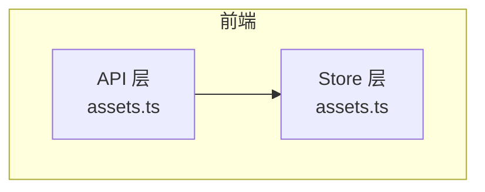
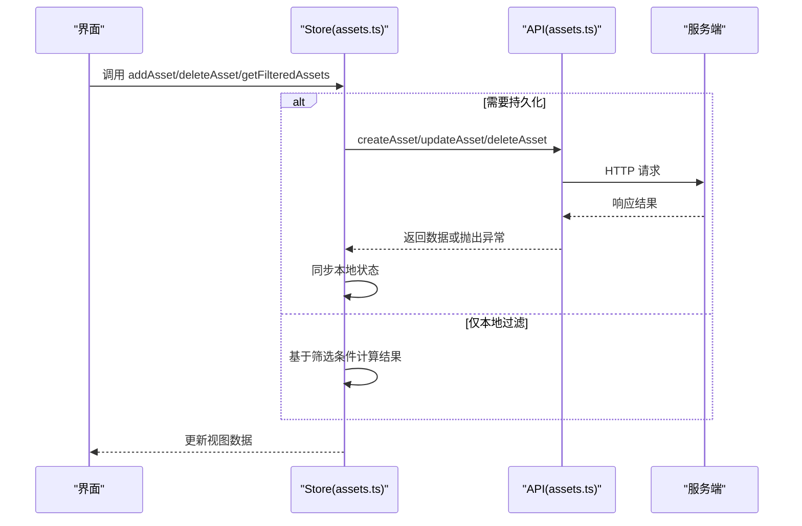
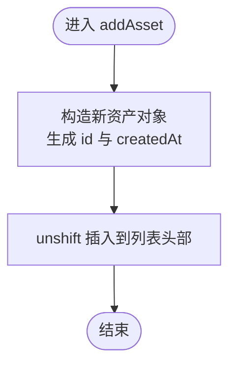
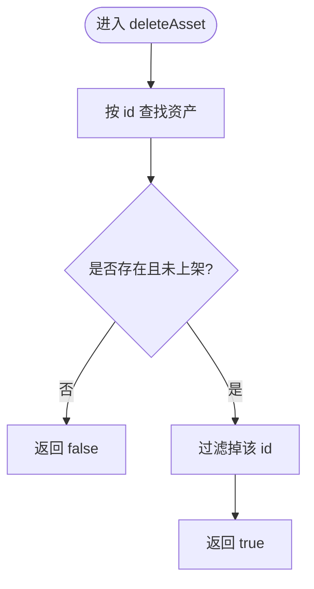
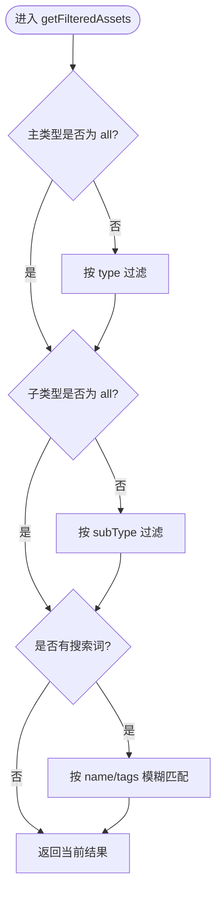
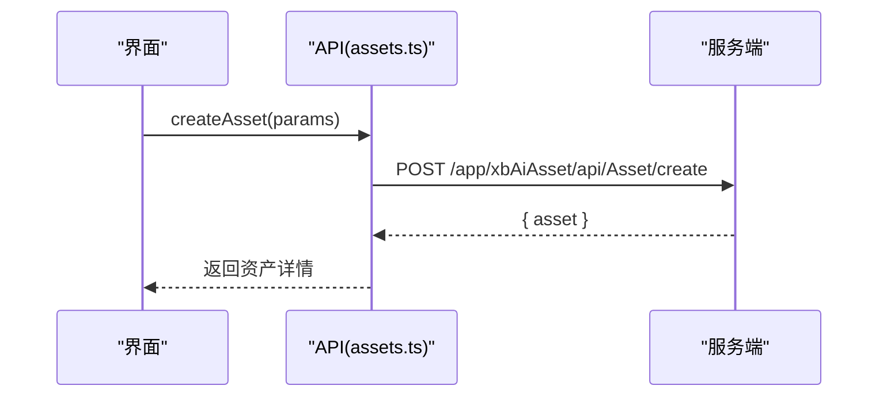
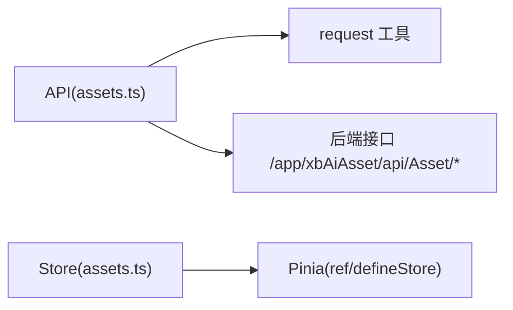

# 状态操作方法

<cite>
**本文引用的文件**   
- [frontend/src/api/assets.ts](file://frontend/src/api/assets.ts)
- [frontend/src/stores/assets.ts](file://frontend/src/stores/assets.ts)
</cite>

## 目录
1. [简介](#简介)
2. [项目结构](#项目结构)
3. [核心组件](#核心组件)
4. [架构总览](#架构总览)
5. [详细组件分析](#详细组件分析)
6. [依赖关系分析](#依赖关系分析)
7. [性能考虑](#性能考虑)
8. [故障排查指南](#故障排查指南)
9. [结论](#结论)
10. [附录](#附录)

## 简介
本文件聚焦资产状态操作方法，围绕前端侧的增删改查与过滤能力进行系统化说明。重点覆盖：
- addAsset 新增方法
- deleteAsset 删除方法
- getFilteredAssets 过滤方法
并深入解析参数校验、错误处理、状态更新机制、性能优化策略，以及批量操作、事务处理与并发控制等工程化实践建议。

## 项目结构
与资产状态相关的前端代码主要位于以下两个模块：
- API 层：定义类型、请求封装与接口调用
- Store 层：维护本地资产数据与筛选逻辑

图表来源
- [frontend/src/api/assets.ts:1-135](file://frontend/src/api/assets.ts#L1-L135)
- [frontend/src/stores/assets.ts:1-161](file://frontend/src/stores/assets.ts#L1-L161)

章节来源
- [frontend/src/api/assets.ts:1-135](file://frontend/src/api/assets.ts#L1-L135)
- [frontend/src/stores/assets.ts:1-161](file://frontend/src/stores/assets.ts#L1-L161)

## 核心组件
- API 层（assets.ts）
  - 定义资产类型、来源、列表查询参数、创建/更新参数等
  - 暴露获取列表、详情、创建、更新、删除等 HTTP 调用
- Store 层（assets.ts）
  - 维护本地资产数组与筛选条件
  - 提供 addAsset、deleteAsset、getFilteredAssets 等方法

章节来源
- [frontend/src/api/assets.ts:1-135](file://frontend/src/api/assets.ts#L1-L135)
- [frontend/src/stores/assets.ts:1-161](file://frontend/src/stores/assets.ts#L1-L161)

## 架构总览
从“用户交互”到“后端接口”的整体流程如下：

图表来源
- [frontend/src/api/assets.ts:98-135](file://frontend/src/api/assets.ts#L98-L135)
- [frontend/src/stores/assets.ts:115-149](file://frontend/src/stores/assets.ts#L115-L149)

## 详细组件分析

### 新增资产 addAsset
- 功能定位
  - 在 Store 中向本地资产列表插入一条新记录，并自动生成唯一 ID 与创建时间
- 输入参数
  - 使用 Omit<Asset, 'id' | 'createdAt'> 约束，确保 id 与 createdAt 由内部生成
- 处理逻辑
  - 将传入对象与生成的 id、createdAt 合并后插入到数组头部
- 输出结果
  - 无返回值；副作用为更新 assets 响应式数据
- 参数验证
  - 通过 TypeScript 类型系统保证必填字段存在
- 错误处理
  - 当前实现未包含显式错误分支
- 状态更新机制
  - 直接修改响应式数组，触发视图更新
- 性能考量
  - unshift 插入到头部，避免遍历查找；对大数据集可考虑按业务排序规则决定插入位置
- 并发与事务
  - 纯前端单线程，不存在并发问题；若后续对接后端，需结合网络重试与乐观更新策略

图表来源
- [frontend/src/stores/assets.ts:115-122](file://frontend/src/stores/assets.ts#L115-L122)

章节来源
- [frontend/src/stores/assets.ts:115-122](file://frontend/src/stores/assets.ts#L115-L122)

### 删除资产 deleteAsset
- 功能定位
  - 根据 id 删除本地资产；已上架资产不允许删除
- 输入参数
  - id: string
- 处理逻辑
  - 查找目标资产，若存在 listingId 则拒绝删除
  - 否则过滤掉该 id 的记录
- 输出结果
  - 成功返回 true，失败返回 false
- 参数验证
  - 通过类型约束 id 为字符串
- 错误处理
  - 以布尔值表示是否允许删除，调用方可据此提示
- 状态更新机制
  - 重新赋值 filtered 后的数组，触发响应式更新
- 性能考量
  - find + filter 两次线性扫描；对于超大数据集可考虑索引或 Map 加速
- 并发与事务
  - 纯前端单线程；若对接后端，应结合幂等性与乐观锁

图表来源
- [frontend/src/stores/assets.ts:124-130](file://frontend/src/stores/assets.ts#L124-L130)

章节来源
- [frontend/src/stores/assets.ts:124-130](file://frontend/src/stores/assets.ts#L124-L130)

### 过滤资产 getFilteredAssets
- 功能定位
  - 根据主类型、子类型与搜索关键词，返回过滤后的资产集合
- 输入参数
  - 无；读取 Store 中的 activeFilter、activeSubFilter、searchQuery
- 处理逻辑
  - 先按主类型过滤，再按子类型过滤，最后按名称或标签模糊匹配
- 输出结果
  - 返回过滤后的 Asset[]
- 参数验证
  - 通过 ref 的类型约束保障筛选条件合法
- 错误处理
  - 无显式异常；空结果时返回空数组
- 状态更新机制
  - 不修改原数组，返回新数组引用，便于视图渲染
- 性能考量
  - 多次 filter 链式调用；当数据量较大时可考虑：
    - 预构建索引（如按 type/subType 分组）
    - 搜索词去抖
    - 惰性求值或虚拟滚动
- 并发与事务
  - 纯前端只读操作，无需并发控制

图表来源
- [frontend/src/stores/assets.ts:132-149](file://frontend/src/stores/assets.ts#L132-L149)

章节来源
- [frontend/src/stores/assets.ts:132-149](file://frontend/src/stores/assets.ts#L132-L149)

### 关联 API 接口（用于持久化）
- 接口清单
  - 获取列表：GET /app/xbAiAsset/api/Asset/list
  - 获取详情：GET /app/xbAiAsset/api/Asset/detail
  - 创建资产：POST /app/xbAiAsset/api/Asset/create
  - 更新资产：PUT /app/xbAiAsset/api/Asset/update
  - 删除资产：DELETE /app/xbAiAsset/api/Asset/delete
- 参数与返回
  - 详见类型定义与函数签名
- 错误处理
  - 由上层 request 拦截器统一处理；调用方需捕获异常并给出反馈

图表来源
- [frontend/src/api/assets.ts:118-120](file://frontend/src/api/assets.ts#L118-L120)

章节来源
- [frontend/src/api/assets.ts:98-135](file://frontend/src/api/assets.ts#L98-L135)

## 依赖关系分析
- API 层依赖
  - 统一的请求工具（request），负责发送 HTTP 请求与拦截处理
- Store 层依赖
  - Pinia 的 defineStore、ref 等响应式 API
- 外部依赖
  - 后端 REST 接口（/app/xbAiAsset/api/Asset/*）

图表来源
- [frontend/src/api/assets.ts:1-135](file://frontend/src/api/assets.ts#L1-L135)
- [frontend/src/stores/assets.ts:1-161](file://frontend/src/stores/assets.ts#L1-L161)

章节来源
- [frontend/src/api/assets.ts:1-135](file://frontend/src/api/assets.ts#L1-L135)
- [frontend/src/stores/assets.ts:1-161](file://frontend/src/stores/assets.ts#L1-L161)

## 性能考虑
- 前端本地操作
  - addAsset 使用 unshift 插入头部，避免全表扫描
  - deleteAsset 采用 find + filter，适合中小规模数据；大规模场景建议引入索引或 Map
  - getFilteredAssets 支持多级过滤与模糊匹配，建议配合搜索去抖与分页/懒加载
- 网络请求
  - 列表接口支持分页参数（page、limit），应在 UI 层合理设置默认页大小
  - 对频繁触发的过滤建议在前端缓存中间结果，减少重复计算
- 渲染优化
  - 大列表建议使用虚拟滚动或分页展示
  - 对图片等资源启用懒加载与缩略图

[本节为通用性能建议，不直接分析具体文件]

## 故障排查指南
- 常见问题
  - 新增后未显示：确认 addAsset 是否被调用，检查响应式数据是否更新
  - 删除无效：检查资产是否已上架（listingId 非空），此时会拒绝删除
  - 过滤结果为空：核对 activeFilter、activeSubFilter 与 searchQuery 的值
- 调试建议
  - 打印 Store 中的 assets、activeFilter、activeSubFilter、searchQuery
  - 在 API 层增加日志，观察请求/响应体与错误信息
- 错误处理
  - 建议在调用 create/update/delete 时捕获异常，并向用户反馈明确原因

章节来源
- [frontend/src/stores/assets.ts:115-149](file://frontend/src/stores/assets.ts#L115-L149)
- [frontend/src/api/assets.ts:118-135](file://frontend/src/api/assets.ts#L118-L135)

## 结论
- addAsset、deleteAsset、getFilteredAssets 三个方法覆盖了本地资产管理的核心路径
- 通过 TypeScript 类型系统与响应式数据流，保证了操作的类型安全与视图一致性
- 针对大规模数据与高并发场景，可在索引、缓存、去抖、分页与虚拟滚动等方面进一步优化
- 若需与后端强一致，建议引入乐观更新、幂等性设计与事务边界管理

[本节为总结性内容，不直接分析具体文件]

## 附录

### 关键类型与接口速览
- 资产项与列表参数
  - 参见类型定义与函数签名
- 创建/更新参数
  - 参见类型定义与函数签名

章节来源
- [frontend/src/api/assets.ts:8-96](file://frontend/src/api/assets.ts#L8-L96)