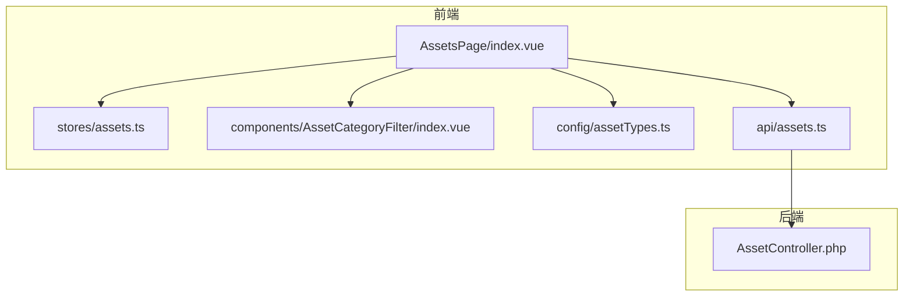
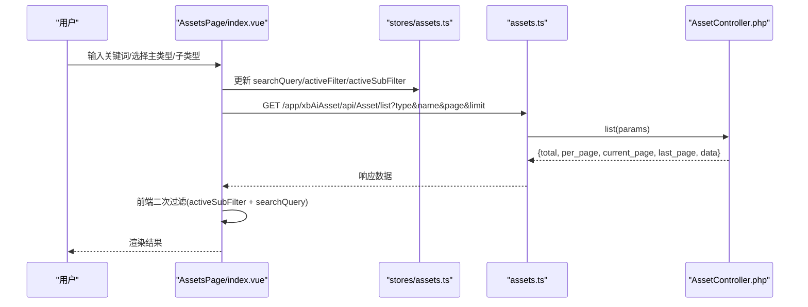
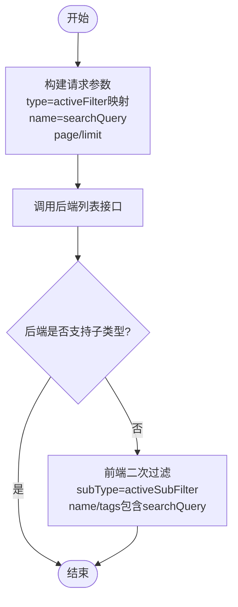
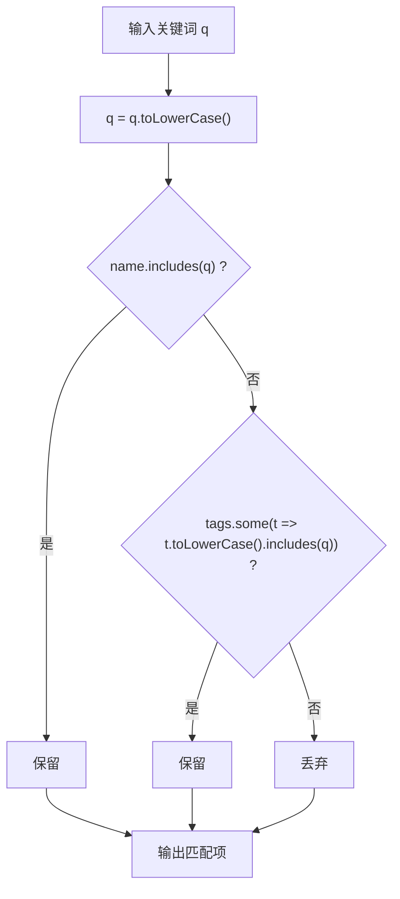
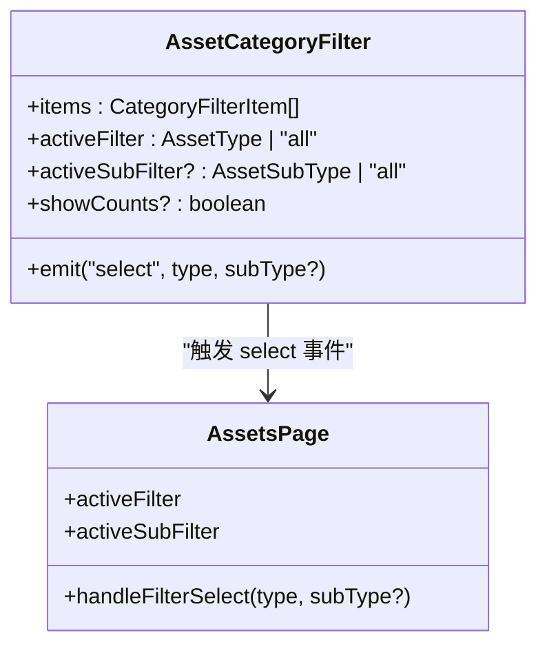
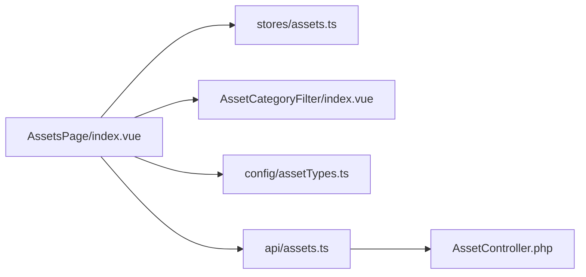

# 筛选搜索系统

<cite>
**本文引用的文件**   
- [frontend/src/stores/assets.ts](file://frontend/src/stores/assets.ts)
- [frontend/src/views/AssetsPage/index.vue](file://frontend/src/views/AssetsPage/index.vue)
- [frontend/src/components/AssetCategoryFilter/index.vue](file://frontend/src/components/AssetCategoryFilter/index.vue)
- [frontend/src/config/assetTypes.ts](file://frontend/src/config/assetTypes.ts)
- [frontend/src/api/assets.ts](file://frontend/src/api/assets.ts)
- [server/plugin/xbAiAsset/app/api/controller/AssetController.php](file://server/plugin/xbAiAsset/app/api/controller/AssetController.php)
</cite>

## 目录
1. [简介](#简介)
2. [项目结构](#项目结构)
3. [核心组件](#核心组件)
4. [架构总览](#架构总览)
5. [详细组件分析](#详细组件分析)
6. [依赖关系分析](#依赖关系分析)
7. [性能与索引策略](#性能与索引策略)
8. [故障排查指南](#故障排查指南)
9. [结论](#结论)

## 简介
本文件系统性地梳理资产筛选与搜索的前后端实现，重点覆盖：
- 多条件筛选逻辑：主类型 activeFilter、子类型 activeSubFilter、关键词 searchQuery 的组合查询
- 关键词搜索算法：名称与标签的模糊匹配
- 标签匹配机制：前端按标签过滤与常用标签快捷搜索
- 排序规则实现：当前未在后端或前端显式定义排序字段，默认保持数据源顺序
- 查询性能优化：分页、前后端协同过滤、前端二次过滤与防抖建议
- 索引策略：数据库层建议（全文索引、复合索引）与前端内存过滤策略

## 项目结构
前端采用 Vue + Pinia 状态管理，页面通过 API 调用后端插件接口；后端基于 Webman 插件架构，提供资产列表、详情、创建、更新、删除等能力。

图表来源
- [frontend/src/views/AssetsPage/index.vue:1-120](file://frontend/src/views/AssetsPage/index.vue#L1-L120)
- [frontend/src/stores/assets.ts:108-149](file://frontend/src/stores/assets.ts#L108-L149)
- [frontend/src/components/AssetCategoryFilter/index.vue:1-44](file://frontend/src/components/AssetCategoryFilter/index.vue#L1-L44)
- [frontend/src/config/assetTypes.ts:1-48](file://frontend/src/config/assetTypes.ts#L1-L48)
- [frontend/src/api/assets.ts:98-103](file://frontend/src/api/assets.ts#L98-L103)
- [server/plugin/xbAiAsset/app/api/controller/AssetController.php:32-55](file://server/plugin/xbAiAsset/app/api/controller/AssetController.php#L32-L55)

章节来源
- [frontend/src/views/AssetsPage/index.vue:1-120](file://frontend/src/views/AssetsPage/index.vue#L1-L120)
- [frontend/src/stores/assets.ts:108-149](file://frontend/src/stores/assets.ts#L108-L149)
- [frontend/src/components/AssetCategoryFilter/index.vue:1-44](file://frontend/src/components/AssetCategoryFilter/index.vue#L1-L44)
- [frontend/src/config/assetTypes.ts:1-48](file://frontend/src/config/assetTypes.ts#L1-L48)
- [frontend/src/api/assets.ts:98-103](file://frontend/src/api/assets.ts#L98-L103)
- [server/plugin/xbAiAsset/app/api/controller/AssetController.php:32-55](file://server/plugin/xbAiAsset/app/api/controller/AssetController.php#L32-L55)

## 核心组件
- 状态管理 store：维护 assets 列表、searchQuery、activeFilter、activeSubFilter，并提供 getFilteredAssets 进行前端过滤
- 页面控制器 AssetsPage：负责与后端交互、构建请求参数、处理分页与错误、组合前端二次过滤
- 分类筛选组件 AssetCategoryFilter：渲染主类型与子类型，触发 select 事件并联动 activeFilter/activeSubFilter
- 配置 assetTypes：定义子类型映射、类型标签、工具函数
- API 客户端 assets.ts：封装 /app/xbAiAsset/api/Asset/list 等接口
- 后端控制器 AssetController：接收 type/source/name/page/limit 等参数，返回分页结果

章节来源
- [frontend/src/stores/assets.ts:42-160](file://frontend/src/stores/assets.ts#L42-L160)
- [frontend/src/views/AssetsPage/index.vue:75-169](file://frontend/src/views/AssetsPage/index.vue#L75-L169)
- [frontend/src/components/AssetCategoryFilter/index.vue:1-44](file://frontend/src/components/AssetCategoryFilter/index.vue#L1-L44)
- [frontend/src/config/assetTypes.ts:1-48](file://frontend/src/config/assetTypes.ts#L1-L48)
- [frontend/src/api/assets.ts:98-103](file://frontend/src/api/assets.ts#L98-L103)
- [server/plugin/xbAiAsset/app/api/controller/AssetController.php:32-55](file://server/plugin/xbAiAsset/app/api/controller/AssetController.php#L32-L55)

## 架构总览
前端在页面层将 activeFilter 映射为后端 type 参数，同时传递 name 作为关键词；后端返回分页数据后，页面再根据 activeSubFilter 与 searchQuery 做前端二次过滤，最终展示到网格/列表视图。

图表来源
- [frontend/src/views/AssetsPage/index.vue:75-169](file://frontend/src/views/AssetsPage/index.vue#L75-L169)
- [frontend/src/api/assets.ts:98-103](file://frontend/src/api/assets.ts#L98-L103)
- [server/plugin/xbAiAsset/app/api/controller/AssetController.php:32-55](file://server/plugin/xbAiAsset/app/api/controller/AssetController.php#L32-L55)

## 详细组件分析

### 多条件筛选与组合查询逻辑
- 主类型筛选 activeFilter：
  - 前端将 activeFilter 映射为后端 type 参数，仅当存在对应映射时发送
  - 若 activeFilter 为 'all'，则不传 type，后端返回全部类型
- 子类型筛选 activeSubFilter：
  - 子类型不在后端支持，由前端对已获取的数据进行二次过滤
- 关键词搜索 searchQuery：
  - 前端将 searchQuery 映射为后端 name 参数，用于服务端名称模糊匹配
  - 同时在前端对 name 和 tags 进行包含匹配，形成双重保障

图表来源
- [frontend/src/views/AssetsPage/index.vue:75-169](file://frontend/src/views/AssetsPage/index.vue#L75-L169)
- [frontend/src/stores/assets.ts:132-149](file://frontend/src/stores/assets.ts#L132-L149)

章节来源
- [frontend/src/views/AssetsPage/index.vue:75-169](file://frontend/src/views/AssetsPage/index.vue#L75-L169)
- [frontend/src/stores/assets.ts:132-149](file://frontend/src/stores/assets.ts#L132-L149)

### 关键词搜索算法与标签匹配机制
- 关键词搜索：
  - 后端：接收 name 参数，用于名称字段的模糊匹配（具体 SQL 由服务层实现）
  - 前端：对 name 与 tags 数组进行小写化后的 includes 匹配
- 标签匹配：
  - 常用标签按钮会设置 searchQuery 并触发搜索
  - 前端以逗号分隔的 tags 字符串解析为数组后进行匹配

图表来源
- [frontend/src/stores/assets.ts:141-147](file://frontend/src/stores/assets.ts#L141-L147)
- [frontend/src/views/AssetsPage/index.vue:161-167](file://frontend/src/views/AssetsPage/index.vue#L161-L167)
- [frontend/src/views/AssetsPage/index.vue:114-120](file://frontend/src/views/AssetsPage/index.vue#L114-L120)

章节来源
- [frontend/src/stores/assets.ts:141-147](file://frontend/src/stores/assets.ts#L141-L147)
- [frontend/src/views/AssetsPage/index.vue:161-167](file://frontend/src/views/AssetsPage/index.vue#L161-L167)
- [frontend/src/views/AssetsPage/index.vue:114-120](file://frontend/src/views/AssetsPage/index.vue#L114-L120)

### 排序规则实现
- 当前未在页面或 store 中定义排序字段与排序方向
- 后端 list 接口也未暴露排序参数，默认排序行为取决于服务层实现
- 建议后续扩展：新增 sort_by/sort_order 参数，并在后端建立相应索引以提升排序性能

章节来源
- [frontend/src/views/AssetsPage/index.vue:75-105](file://frontend/src/views/AssetsPage/index.vue#L75-L105)
- [server/plugin/xbAiAsset/app/api/controller/AssetController.php:32-55](file://server/plugin/xbAiAsset/app/api/controller/AssetController.php#L32-L55)

### 分类筛选组件与联动
- AssetCategoryFilter 负责渲染主类型与子类型，点击主类型可展开/收起子类型
- 选择主类型时 emit('select', type)，选择子类型时 emit('select', parentValue, childValue)
- 父组件监听 select 事件，更新 activeFilter/activeSubFilter 并重置页码后重新拉取数据

图表来源
- [frontend/src/components/AssetCategoryFilter/index.vue:1-44](file://frontend/src/components/AssetCategoryFilter/index.vue#L1-L44)
- [frontend/src/views/AssetsPage/index.vue:147-153](file://frontend/src/views/AssetsPage/index.vue#L147-L153)

章节来源
- [frontend/src/components/AssetCategoryFilter/index.vue:1-44](file://frontend/src/components/AssetCategoryFilter/index.vue#L1-L44)
- [frontend/src/views/AssetsPage/index.vue:147-153](file://frontend/src/views/AssetsPage/index.vue#L147-L153)

### 类型映射与配置
- 前端使用映射表将后端数字型 type 转换为前端语义化类型
- 子类型定义集中在 config/assetTypes.ts，便于统一管理与扩展

章节来源
- [frontend/src/views/AssetsPage/index.vue:30-50](file://frontend/src/views/AssetsPage/index.vue#L30-L50)
- [frontend/src/config/assetTypes.ts:18-48](file://frontend/src/config/assetTypes.ts#L18-L48)

## 依赖关系分析
- 页面层依赖 store 的状态与方法，同时依赖 API 客户端与分类筛选组件
- API 客户端依赖通用请求封装，调用后端插件控制器
- 控制器依赖服务层（未在本文档范围内），完成数据访问与业务逻辑

图表来源
- [frontend/src/views/AssetsPage/index.vue:1-20](file://frontend/src/views/AssetsPage/index.vue#L1-L20)
- [frontend/src/api/assets.ts:98-103](file://frontend/src/api/assets.ts#L98-L103)
- [server/plugin/xbAiAsset/app/api/controller/AssetController.php:32-55](file://server/plugin/xbAiAsset/app/api/controller/AssetController.php#L32-L55)

章节来源
- [frontend/src/views/AssetsPage/index.vue:1-20](file://frontend/src/views/AssetsPage/index.vue#L1-L20)
- [frontend/src/api/assets.ts:98-103](file://frontend/src/api/assets.ts#L98-L103)
- [server/plugin/xbAiAsset/app/api/controller/AssetController.php:32-55](file://server/plugin/xbAiAsset/app/api/controller/AssetController.php#L32-L55)

## 性能与索引策略
- 分页与后端过滤
  - 前端每次切换主类型或关键词时重置 page=1 并请求后端，减少单次传输数据量
  - 后端支持 type、source、name 过滤，建议结合数据库索引提升查询效率
- 前端二次过滤
  - 针对子类型与标签匹配在前端进行，避免频繁请求后端
  - 建议在大数据量场景下引入虚拟滚动或懒加载
- 搜索体验优化
  - 建议对搜索输入增加防抖（如 300ms），减少重复请求
  - 建议对常用标签点击也走相同防抖流程
- 索引策略建议（数据库层）
  - 名称字段：建立全文索引或前缀索引，提升 LIKE '%keyword%' 的性能
  - 类型与来源：建立复合索引 (type, source) 或 (type, create_at) 以支持常见筛选与排序
  - 标签字段：若采用 JSON 存储，建议使用生成列或冗余字段配合索引；若采用关联表，确保外键与标签名索引完善
- 排序优化
  - 若未来支持排序，优先基于有索引的字段（如 create_at、id）
  - 避免对无索引字段进行大范围排序

[本节为通用性能指导，不涉及具体代码片段]

## 故障排查指南
- 列表为空
  - 检查 activeFilter 映射是否正确，确认是否向 type 传入了有效值
  - 检查 searchQuery 是否为空或过长导致无匹配
  - 查看网络请求参数与后端返回的 total/per_page/current_page/last_page 是否合理
- 子类型筛选无效
  - 确认当前数据类型是否存在子类型定义（voice/sound_effect/video）
  - 检查前端二次过滤逻辑是否生效
- 标签匹配异常
  - 确认 tags 字段格式为逗号分隔字符串，前端已正确解析为数组
  - 注意大小写与空格，前端已统一转小写并 trim
- 批量删除失败
  - 检查选中项 ID 是否有效，确认 delete 接口返回成功
  - 关注 Promise.allSettled 的错误聚合日志

章节来源
- [frontend/src/views/AssetsPage/index.vue:75-105](file://frontend/src/views/AssetsPage/index.vue#L75-L105)
- [frontend/src/views/AssetsPage/index.vue:155-169](file://frontend/src/views/AssetsPage/index.vue#L155-L169)
- [frontend/src/views/AssetsPage/index.vue:200-211](file://frontend/src/views/AssetsPage/index.vue#L200-L211)

## 结论
本系统通过“后端主类型+名称过滤 + 前端子类型+标签二次过滤”的组合方式，实现了灵活高效的资产检索。当前未定义排序规则，后续可在后端与前端共同扩展排序能力，并结合数据库索引与前端防抖、分页、懒加载等手段进一步提升性能与用户体验。