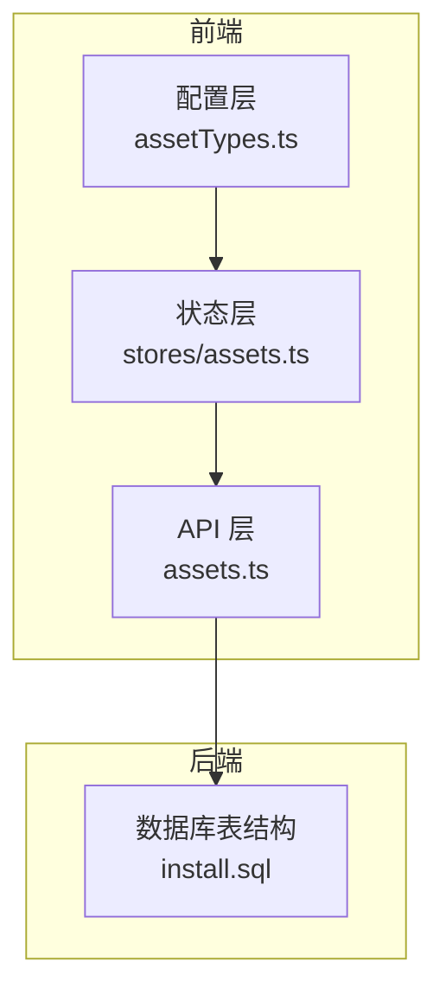
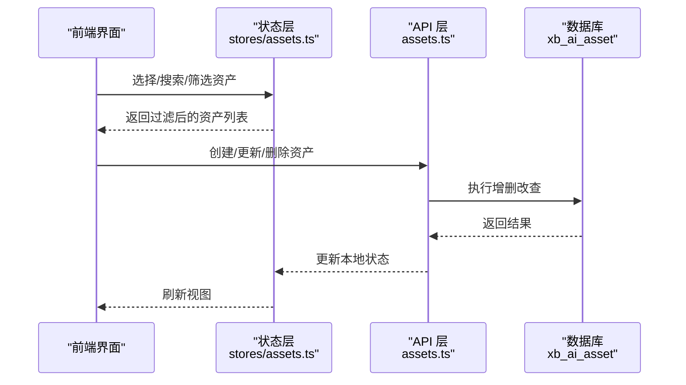
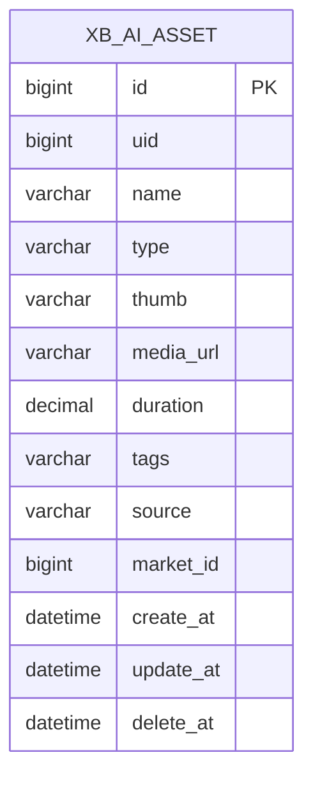
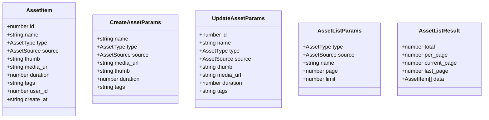
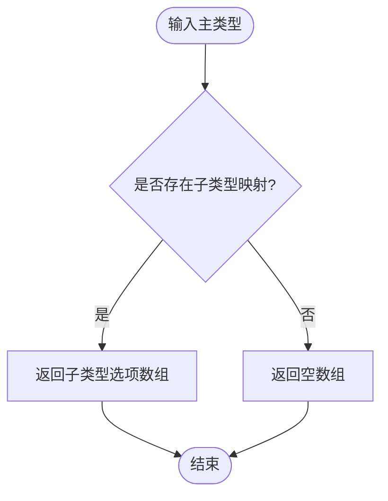
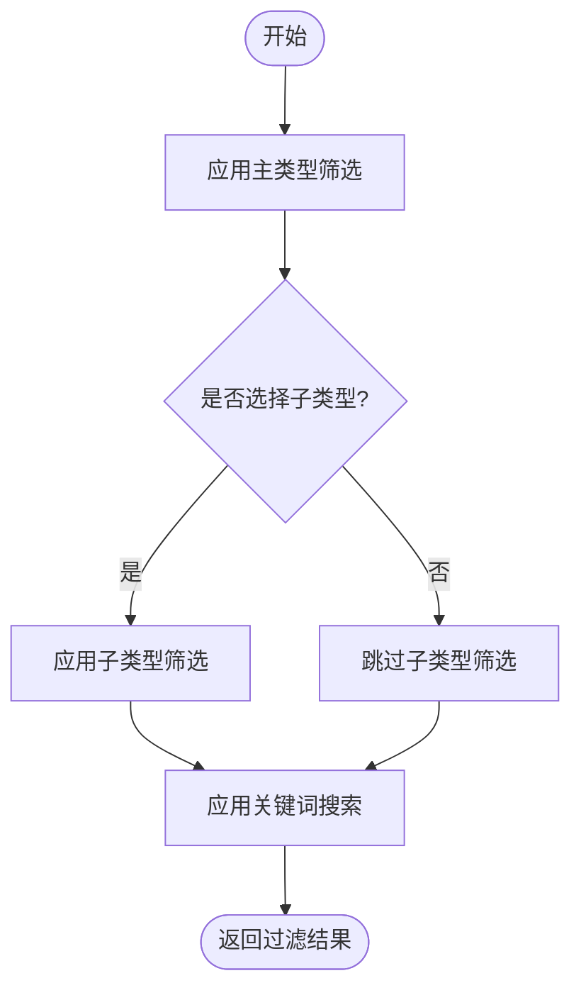
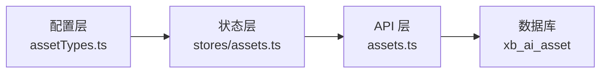

# 资产数据模型

<cite>
**本文引用的文件**   
- [install.sql](file://server/plugin/xbAiAsset/install.sql)
- [assets.ts](file://frontend/src/api/assets.ts)
- [assetTypes.ts](file://frontend/src/config/assetTypes.ts)
- [assets.ts（store）](file://frontend/src/stores/assets.ts)
</cite>

## 目录
1. [简介](#简介)
2. [项目结构](#项目结构)
3. [核心组件](#核心组件)
4. [架构总览](#架构总览)
5. [详细组件分析](#详细组件分析)
6. [依赖关系分析](#依赖关系分析)
7. [性能考虑](#性能考虑)
8. [故障排查指南](#故障排查指南)
9. [结论](#结论)
10. [附录](#附录)

## 简介
本文件围绕“资产数据模型”进行系统化说明，覆盖以下要点：
- Asset 接口定义与前后端字段映射
- 素材类型系统（角色/背景/表情/道具/动作/特效/音色/音效/视频）及子类型分类体系
- 数据结构设计原则、字段含义与数据类型约束
- 业务规则验证与扩展机制
- 类型安全设计、向后兼容性考虑与数据迁移策略

## 项目结构
与资产数据模型直接相关的代码分布在前后端：
- 后端数据库表结构与索引定义位于安装脚本中
- 前端 API 层定义了资源类型枚举、请求/响应结构
- 前端配置层提供主类型标签与子类型选项
- 前端 Store 层维护运行时资产对象模型与筛选逻辑

图表来源
- [assets.ts:1-135](file://frontend/src/api/assets.ts#L1-L135)
- [assetTypes.ts:1-69](file://frontend/src/config/assetTypes.ts#L1-L69)
- [assets.ts（store）:1-161](file://frontend/src/stores/assets.ts#L1-L161)
- [install.sql:1-105](file://server/plugin/xbAiAsset/install.sql#L1-L105)

章节来源
- [assets.ts:1-135](file://frontend/src/api/assets.ts#L1-L135)
- [assetTypes.ts:1-69](file://frontend/src/config/assetTypes.ts#L1-L69)
- [assets.ts（store）:1-161](file://frontend/src/stores/assets.ts#L1-L161)
- [install.sql:1-105](file://server/plugin/xbAiAsset/install.sql#L1-L105)

## 核心组件
本节聚焦于“资产数据模型”的核心要素：
- 资产主类型与子类型体系
- 前后端字段映射与约束
- 业务规则与校验点
- 可扩展性与兼容策略

### 资产主类型与子类型体系
- 主类型（前端强类型）：character、background、expression、prop、action、effect、voice、sound_effect、video
- 子类型（仅对 voice/sound_effect/video 生效）：
  - 音色：child_voice、teen_voice、youth_voice、middle_voice、elder_voice
  - 音效：event_sfx、character_sfx、animal_sfx、combat_sfx、weapon_sfx、atmosphere_sfx、environment_sfx、collision_sfx、explosion_sfx
  - 视频：intro_video、animation_video、transition_video、background_video、effect_video

这些类型在前端通过联合类型与映射表实现类型安全与 UI 展示。

章节来源
- [assets.ts（store）:1-161](file://frontend/src/stores/assets.ts#L1-L161)
- [assetTypes.ts:1-69](file://frontend/src/config/assetTypes.ts#L1-L69)

### 前后端字段映射与约束
- 后端持久化表 xb_ai_asset 包含 id、uid、name、type、thumb、media_url、duration、tags、source、market_id、时间戳等字段
- 前端 API 层定义了 AssetItem、CreateAssetParams、UpdateAssetParams 等结构，用于请求/响应建模
- 前端 Store 层定义了运行时 Asset 对象，包含 id、name、type、subType、thumbnail、mediaUrl、duration、tags、createdAt、listingId 等

映射要点：
- 标识：后端 id（bigint）对应前端 id（字符串或数字，视调用上下文而定）
- 名称：后端 name 对应前端 name
- 类型：后端 type（varchar）对应前端 type（强类型枚举）
- 媒体：后端 media_url 对应前端 mediaUrl；缩略图 thumb 对应 thumbnail
- 时长：后端 duration（decimal(10,2)）对应前端 duration（number）
- 标签：后端 tags（逗号分隔字符串）对应前端 tags（字符串数组）
- 来源：后端 source（10/AI生成、20/上传、30/市场购买）由前端 CreateAssetParams.source 传入
- 上架关联：后端 market_id 对应前端 listingId（已上架时有值）

章节来源
- [install.sql:1-105](file://server/plugin/xbAiAsset/install.sql#L1-L105)
- [assets.ts:1-135](file://frontend/src/api/assets.ts#L1-L135)
- [assets.ts（store）:1-161](file://frontend/src/stores/assets.ts#L1-L161)

### 业务规则与校验点
- 必填字段：name、type、source、media_url（创建时）
- 可选字段：thumb、duration、tags、market_id（source=30 有效）
- 软删除：delete_at 非空表示已删除
- 上架限制：Store 层禁止删除已上架的素材（listingId 存在）
- 标签格式：后端以逗号分隔存储，前端以数组形式使用，需在读写时做转换

章节来源
- [assets.ts（store）:124-130](file://frontend/src/stores/assets.ts#L124-L130)
- [assets.ts:60-96](file://frontend/src/api/assets.ts#L60-L96)
- [install.sql:1-21](file://server/plugin/xbAiAsset/install.sql#L1-L21)

### 扩展机制
- 新增主类型：在 store 与配置层同步扩展类型枚举与显示标签
- 新增子类型：在配置层 SUB_TYPE_MAP 中添加映射项，并在 store 中扩展联合类型
- 新增字段：后端通过 ALTER TABLE 扩展，前端在 API 与 Store 层增加字段并处理默认值与兼容逻辑

章节来源
- [assetTypes.ts:18-48](file://frontend/src/config/assetTypes.ts#L18-L48)
- [assets.ts（store）:1-161](file://frontend/src/stores/assets.ts#L1-L161)

## 架构总览
下图展示了从前端到后端的资产数据流与关键实体关系。

图表来源
- [assets.ts（store）:115-149](file://frontend/src/stores/assets.ts#L115-L149)
- [assets.ts:98-134](file://frontend/src/api/assets.ts#L98-L134)
- [install.sql:1-21](file://server/plugin/xbAiAsset/install.sql#L1-L21)

## 详细组件分析

### 数据库表结构：xb_ai_asset
- 主键：id（自增 bigint）
- 用户归属：uid（bigint）
- 基本信息：name（varchar）、type（varchar）、thumb（varchar）、media_url（varchar）、duration（decimal）、tags（varchar）
- 来源与关联：source（varchar，固定码）、market_id（bigint，source=30 有效）
- 时间戳：create_at、update_at、delete_at（软删除）
- 索引：idx_user_type、idx_market_id

图表来源
- [install.sql:1-21](file://server/plugin/xbAiAsset/install.sql#L1-L21)

章节来源
- [install.sql:1-21](file://server/plugin/xbAiAsset/install.sql#L1-L21)

### 前端 API 层：assets.ts
- 类型定义：AssetType、AssetSource 为字符串字面量联合类型，确保类型安全
- 数据结构：AssetItem、CreateAssetParams、UpdateAssetParams、AssetListParams、AssetListResult
- 接口方法：getAssetList、getAssetDetail、createAsset、updateAsset、deleteAsset

图表来源
- [assets.ts:1-135](file://frontend/src/api/assets.ts#L1-L135)

章节来源
- [assets.ts:1-135](file://frontend/src/api/assets.ts#L1-L135)

### 前端配置层：assetTypes.ts
- 子类型映射：SUB_TYPE_MAP 将主类型映射到子类型选项数组
- 工具函数：getSubTypes、hasSubTypes、getTypeLabel 提供类型安全的子类型获取与标签渲染

图表来源
- [assetTypes.ts:18-48](file://frontend/src/config/assetTypes.ts#L18-L48)

章节来源
- [assetTypes.ts:1-69](file://frontend/src/config/assetTypes.ts#L1-L69)

### 前端状态层：stores/assets.ts
- 运行时模型：Asset 对象包含 id、name、type、subType、thumbnail、mediaUrl、duration、tags、createdAt、listingId
- 业务逻辑：addAsset、deleteAsset（禁止删除已上架）、getFilteredAssets（按类型/子类型/关键词过滤）

图表来源
- [assets.ts（store）:132-149](file://frontend/src/stores/assets.ts#L132-L149)

章节来源
- [assets.ts（store）:1-161](file://frontend/src/stores/assets.ts#L1-L161)

## 依赖关系分析
- 前端 API 层依赖后端数据库表结构（字段名与语义一致）
- 前端配置层依赖 Store 层的类型定义，保证 UI 与数据模型一致
- Store 层依赖 API 层完成数据持久化操作

图表来源
- [assetTypes.ts:1-69](file://frontend/src/config/assetTypes.ts#L1-L69)
- [assets.ts（store）:1-161](file://frontend/src/stores/assets.ts#L1-L161)
- [assets.ts:1-135](file://frontend/src/api/assets.ts#L1-L135)
- [install.sql:1-21](file://server/plugin/xbAiAsset/install.sql#L1-L21)

章节来源
- [assetTypes.ts:1-69](file://frontend/src/config/assetTypes.ts#L1-L69)
- [assets.ts（store）:1-161](file://frontend/src/stores/assets.ts#L1-L161)
- [assets.ts:1-135](file://frontend/src/api/assets.ts#L1-L135)
- [install.sql:1-21](file://server/plugin/xbAiAsset/install.sql#L1-L21)

## 性能考虑
- 索引优化：基于 uid+type 的组合索引提升用户维度查询效率；market_id 索引支持市场相关查询
- 分页与过滤：前端按类型/子类型/关键词过滤，建议后端也提供相应参数以减少数据传输
- 大字段处理：media_url 与 thumb 为路径引用，避免在列表中加载实际媒体内容
- 标签存储：后端以逗号分隔字符串存储，读取时需转换为数组，写入时需序列化，注意长度限制

[本节为通用指导，不直接分析具体文件]

## 故障排查指南
- 类型不一致：前端 type 与后端 type 需保持语义一致，新增类型需同步更新前后端
- 子类型缺失：若主类型无子类型映射，getSubTypes 返回空数组，检查配置层映射
- 上架删除失败：Store 层禁止删除 listingId 存在的资产，需先下架再删除
- 标签格式错误：确保写入前将数组序列化为逗号分隔字符串，读取后反序列化为数组
- 时长精度：后端 duration 为 decimal(10,2)，前端 number 应保留两位小数

章节来源
- [assetTypes.ts:46-52](file://frontend/src/config/assetTypes.ts#L46-L52)
- [assets.ts（store）:124-130](file://frontend/src/stores/assets.ts#L124-L130)
- [install.sql:1-21](file://server/plugin/xbAiAsset/install.sql#L1-L21)

## 结论
本资产数据模型通过前后端类型系统与数据库表结构的协同，实现了清晰的类型划分、严格的字段约束与良好的扩展性。建议在后续迭代中：
- 持续完善子类型映射与标签库
- 强化后端校验与分页能力
- 建立完善的版本兼容与迁移流程

[本节为总结性内容，不直接分析具体文件]

## 附录

### 字段对照与约束清单
- 标识：id（后端 bigint，前端 number/string）
- 名称：name（必填，后端 varchar(100)）
- 类型：type（必填，后端 varchar(20)，前端强类型）
- 缩略图：thumb/thumbnail（可选，后端 varchar(500)）
- 媒体地址：media_url/mediaUrl（必填，后端 varchar(500)）
- 时长：duration（可选，后端 decimal(10,2)，前端 number）
- 标签：tags（可选，后端逗号分隔字符串，前端数组）
- 来源：source（必填，后端 varchar(20)，固定码）
- 上架关联：market_id/listingId（可选，后端 bigint，前端 string）
- 时间戳：create_at/update_at/delete_at（后端 datetime）

章节来源
- [install.sql:1-21](file://server/plugin/xbAiAsset/install.sql#L1-L21)
- [assets.ts:1-135](file://frontend/src/api/assets.ts#L1-L135)
- [assets.ts（store）:1-161](file://frontend/src/stores/assets.ts#L1-L161)

### 类型安全与向后兼容
- 类型安全：前端使用联合类型与映射表，避免非法类型进入业务逻辑
- 向后兼容：新增字段时设置默认值与可选标记，旧客户端可忽略新字段
- 数据迁移：新增字段采用 ALTER TABLE 增量变更，并提供回滚脚本

章节来源
- [assets.ts（store）:1-161](file://frontend/src/stores/assets.ts#L1-L161)
- [install.sql:1-21](file://server/plugin/xbAiAsset/install.sql#L1-L21)