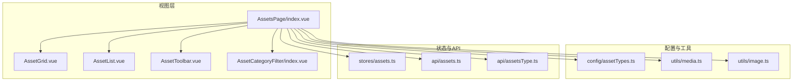
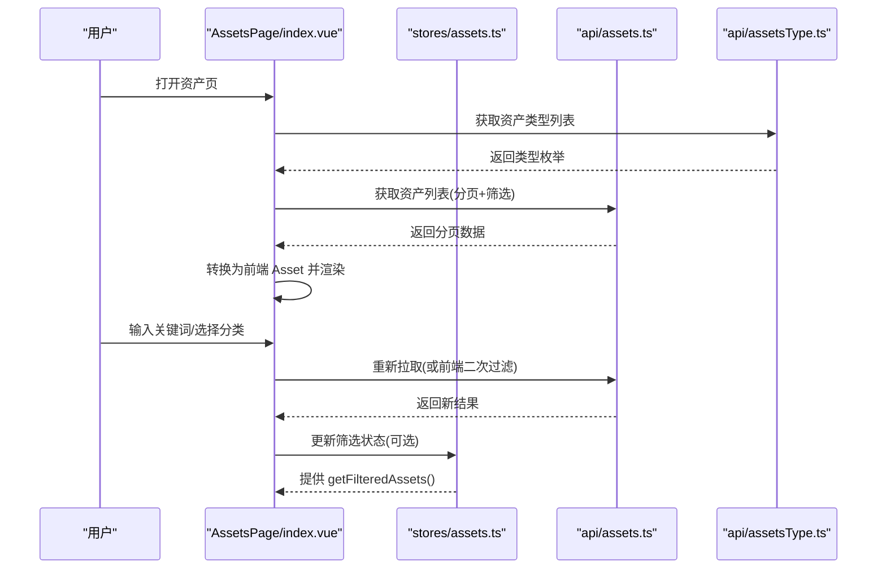
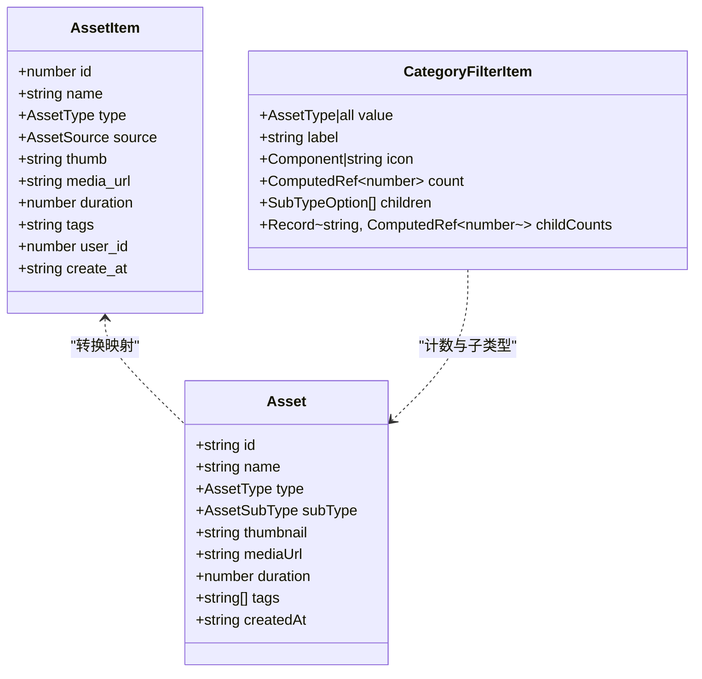
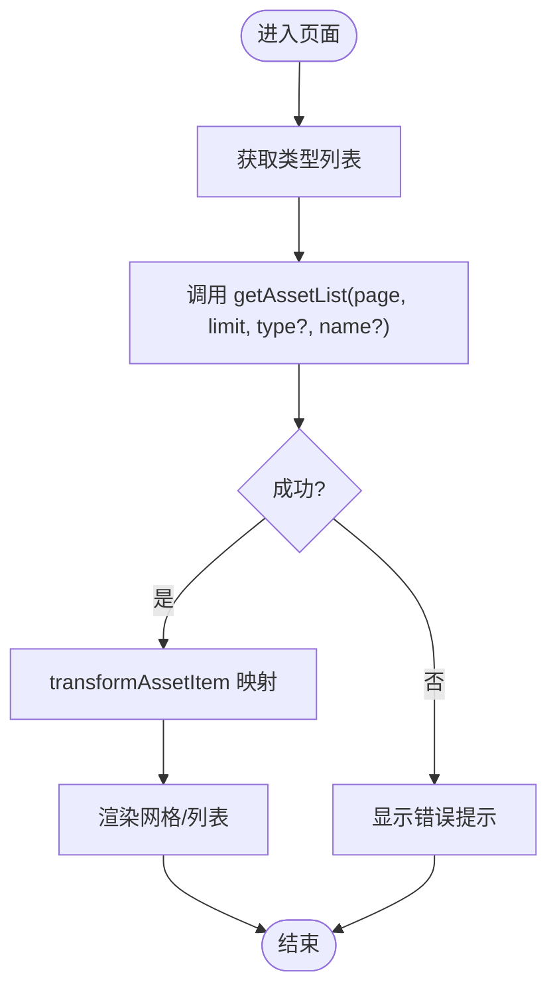
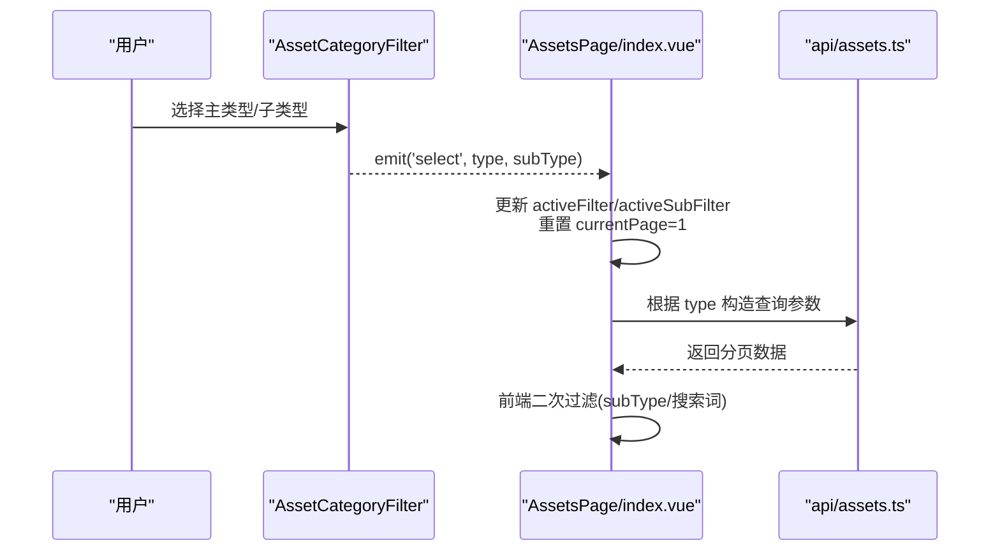
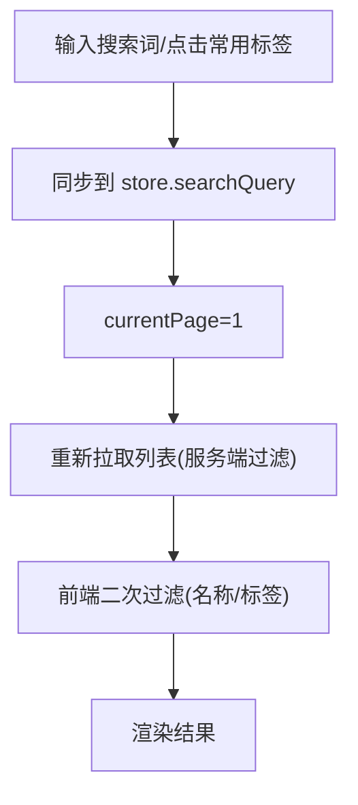
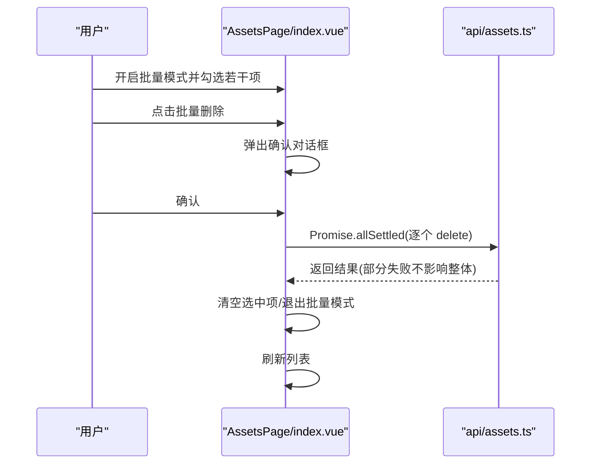
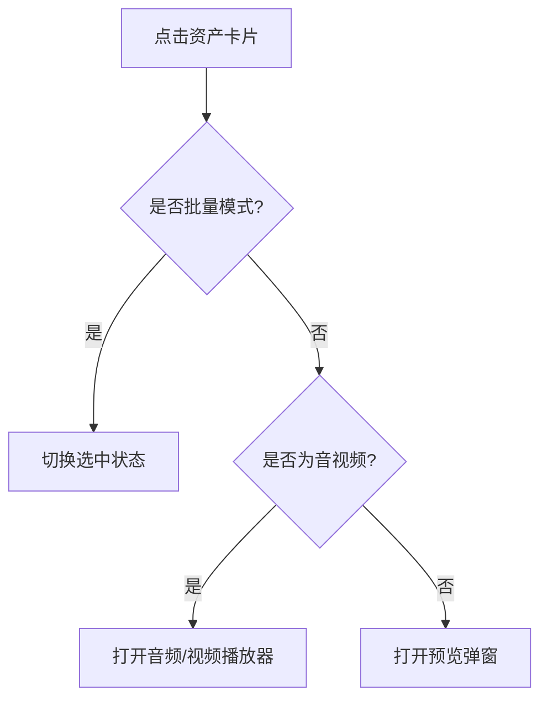
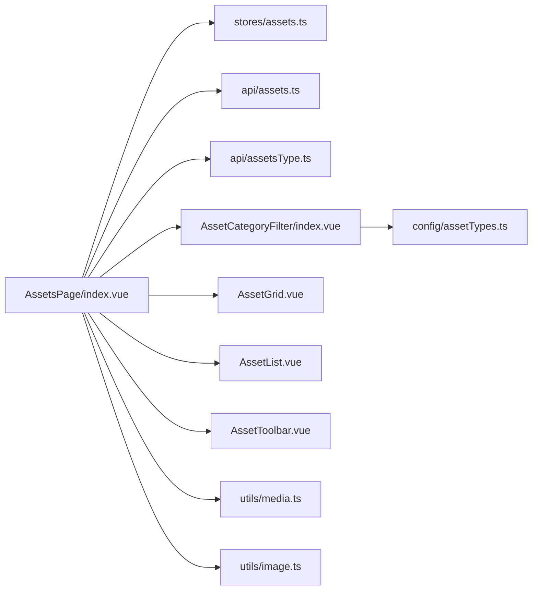

# 资产状态管理

<cite>
**本文引用的文件**   
- [frontend/src/stores/assets.ts](file://frontend/src/stores/assets.ts)
- [frontend/src/api/assets.ts](file://frontend/src/api/assets.ts)
- [frontend/src/api/assetsType.ts](file://frontend/src/api/assetsType.ts)
- [frontend/src/views/AssetsPage/index.vue](file://frontend/src/views/AssetsPage/index.vue)
- [frontend/src/components/AssetCategoryFilter/index.vue](file://frontend/src/components/AssetCategoryFilter/index.vue)
- [frontend/src/config/assetTypes.ts](file://frontend/src/config/assetTypes.ts)
- [frontend/src/utils/media.ts](file://frontend/src/utils/media.ts)
- [frontend/src/utils/image.ts](file://frontend/src/utils/image.ts)
- [frontend/src/views/AssetsPage/components/AssetGrid.vue](file://frontend/src/views/AssetsPage/components/AssetGrid.vue)
- [frontend/src/views/AssetsPage/components/AssetList.vue](file://frontend/src/views/AssetsPage/components/AssetList.vue)
- [frontend/src/views/AssetsPage/components/AssetToolbar.vue](file://frontend/src/views/AssetsPage/components/AssetToolbar.vue)
</cite>

## 目录
1. [简介](#简介)
2. [项目结构](#项目结构)
3. [核心组件](#核心组件)
4. [架构总览](#架构总览)
5. [详细组件分析](#详细组件分析)
6. [依赖关系分析](#依赖关系分析)
7. [性能与内存优化](#性能与内存优化)
8. [故障排查指南](#故障排查指南)
9. [结论](#结论)
10. [附录](#附录)

## 简介
本文件围绕“素材资源的状态管理”展开，系统性梳理前端在资产列表管理、分类标签系统、搜索过滤、批量操作、分页加载、缓存策略、实时更新机制、状态同步方案等方面的实现与最佳实践。文档同时给出性能优化、内存管理与大数据量处理建议，帮助读者在实际项目中构建稳定高效的资产管理体验。

## 项目结构
前端采用 Vue 3 + Pinia 的轻量状态管理模式，结合页面级组合式逻辑进行数据获取与交互控制；通过 API 层封装与后端插件 xbAiAsset 对接，完成资产的增删改查与类型枚举获取。

图表来源
- [frontend/src/views/AssetsPage/index.vue:1-473](file://frontend/src/views/AssetsPage/index.vue#L1-L473)
- [frontend/src/components/AssetCategoryFilter/index.vue:1-112](file://frontend/src/components/AssetCategoryFilter/index.vue#L1-L112)
- [frontend/src/config/assetTypes.ts:1-69](file://frontend/src/config/assetTypes.ts#L1-L69)
- [frontend/src/utils/media.ts:1-55](file://frontend/src/utils/media.ts#L1-L55)
- [frontend/src/utils/image.ts:1-106](file://frontend/src/utils/image.ts#L1-L106)
- [frontend/src/stores/assets.ts:1-161](file://frontend/src/stores/assets.ts#L1-L161)
- [frontend/src/api/assets.ts:1-135](file://frontend/src/api/assets.ts#L1-L135)
- [frontend/src/api/assetsType.ts:1-27](file://frontend/src/api/assetsType.ts#L1-L27)

章节来源
- [frontend/src/views/AssetsPage/index.vue:1-473](file://frontend/src/views/AssetsPage/index.vue#L1-L473)
- [frontend/src/stores/assets.ts:1-161](file://frontend/src/stores/assets.ts#L1-L161)
- [frontend/src/api/assets.ts:1-135](file://frontend/src/api/assets.ts#L1-L135)
- [frontend/src/api/assetsType.ts:1-27](file://frontend/src/api/assetsType.ts#L1-L27)

## 核心组件
- 资产状态存储（Pinia）：维护本地资产集合、筛选条件与基础 CRUD 方法，用于演示与快速开发场景。
- 页面级状态与数据流：在 AssetsPage 中集中管理分页、加载态、错误态、选中项、批量模式等，负责与 API 交互和前后端类型映射。
- 分类与标签：侧边栏分类筛选支持主类型与子类型联动，配合常用标签快捷搜索。
- 展示组件：网格与列表两种视图，统一事件冒泡至父组件处理业务逻辑。
- 工具函数：媒体类型判断、时长格式化、视频首帧截取、图片压缩与占位图回退。

章节来源
- [frontend/src/stores/assets.ts:1-161](file://frontend/src/stores/assets.ts#L1-L161)
- [frontend/src/views/AssetsPage/index.vue:1-473](file://frontend/src/views/AssetsPage/index.vue#L1-L473)
- [frontend/src/components/AssetCategoryFilter/index.vue:1-112](file://frontend/src/components/AssetCategoryFilter/index.vue#L1-L112)
- [frontend/src/views/AssetsPage/components/AssetGrid.vue:1-97](file://frontend/src/views/AssetsPage/components/AssetGrid.vue#L1-L97)
- [frontend/src/views/AssetsPage/components/AssetList.vue:1-108](file://frontend/src/views/AssetsPage/components/AssetList.vue#L1-L108)
- [frontend/src/views/AssetsPage/components/AssetToolbar.vue:1-98](file://frontend/src/views/AssetsPage/components/AssetToolbar.vue#L1-L98)
- [frontend/src/utils/media.ts:1-55](file://frontend/src/utils/media.ts#L1-L55)
- [frontend/src/utils/image.ts:1-106](file://frontend/src/utils/image.ts#L1-L106)

## 架构总览
整体采用“页面级状态为主、Pinia 状态为辅”的模式：
- 页面级 ref/computed 承担分页、请求态、错误态、选中项与批量操作等运行时状态。
- Pinia store 提供统一的资产模型与本地过滤能力，便于复用与扩展。
- API 层封装统一请求与类型定义，保证前后端契约一致。
- 分类与标签由配置与接口共同驱动，形成动态可维护的分类体系。

图表来源
- [frontend/src/views/AssetsPage/index.vue:1-473](file://frontend/src/views/AssetsPage/index.vue#L1-L473)
- [frontend/src/stores/assets.ts:1-161](file://frontend/src/stores/assets.ts#L1-L161)
- [frontend/src/api/assets.ts:1-135](file://frontend/src/api/assets.ts#L1-L135)
- [frontend/src/api/assetsType.ts:1-27](file://frontend/src/api/assetsType.ts#L1-L27)

## 详细组件分析

### 资产数据模型与类型映射
- 前端 Asset 模型包含 id、name、type、subType、thumbnail、mediaUrl、duration、tags、createdAt 等字段，适配图片、音频、视频等多模态资产。
- 后端 AssetItem 使用数字型 type/source 编码，页面层提供双向映射表，确保前后端类型一致性。
- 资产类型枚举通过接口动态获取，结合本地配置生成侧边栏分类树。

图表来源
- [frontend/src/stores/assets.ts:1-161](file://frontend/src/stores/assets.ts#L1-L161)
- [frontend/src/api/assets.ts:1-135](file://frontend/src/api/assets.ts#L1-L135)
- [frontend/src/config/assetTypes.ts:1-69](file://frontend/src/config/assetTypes.ts#L1-L69)

章节来源
- [frontend/src/stores/assets.ts:1-161](file://frontend/src/stores/assets.ts#L1-L161)
- [frontend/src/api/assets.ts:1-135](file://frontend/src/api/assets.ts#L1-L135)
- [frontend/src/config/assetTypes.ts:1-69](file://frontend/src/config/assetTypes.ts#L1-L69)

### 资产列表与分页加载
- 分页参数 page/limit 由页面级状态维护，切换页码时触发重新拉取。
- 响应体包含 total/per_page/current_page/last_page/data，用于计算总页数与当前页。
- 列表渲染前执行 transformAssetItem，将后端字段映射为前端模型。

图表来源
- [frontend/src/views/AssetsPage/index.vue:1-473](file://frontend/src/views/AssetsPage/index.vue#L1-L473)
- [frontend/src/api/assets.ts:1-135](file://frontend/src/api/assets.ts#L1-L135)

章节来源
- [frontend/src/views/AssetsPage/index.vue:1-473](file://frontend/src/views/AssetsPage/index.vue#L1-L473)
- [frontend/src/api/assets.ts:1-135](file://frontend/src/api/assets.ts#L1-L135)

### 分类标签系统与筛选
- 侧边栏分类支持主类型与子类型联动，点击主类型可展开子类型，支持“全部”重置子筛选。
- 子类型来源于配置 SUB_TYPE_MAP，按主类型动态生成选项。
- 筛选触发后，页面级会重置到第一页并重新拉取数据；同时可在前端对已加载数据进行二次过滤（如 subType 与名称/标签）。

图表来源
- [frontend/src/components/AssetCategoryFilter/index.vue:1-112](file://frontend/src/components/AssetCategoryFilter/index.vue#L1-L112)
- [frontend/src/views/AssetsPage/index.vue:1-473](file://frontend/src/views/AssetsPage/index.vue#L1-L473)
- [frontend/src/config/assetTypes.ts:1-69](file://frontend/src/config/assetTypes.ts#L1-L69)
- [frontend/src/api/assets.ts:1-135](file://frontend/src/api/assets.ts#L1-L135)

章节来源
- [frontend/src/components/AssetCategoryFilter/index.vue:1-112](file://frontend/src/components/AssetCategoryFilter/index.vue#L1-L112)
- [frontend/src/config/assetTypes.ts:1-69](file://frontend/src/config/assetTypes.ts#L1-L69)
- [frontend/src/views/AssetsPage/index.vue:1-473](file://frontend/src/views/AssetsPage/index.vue#L1-L473)

### 搜索与过滤
- 搜索框支持名称与标签模糊匹配，回车或点击按钮触发搜索。
- 常用标签快捷入口一键设置搜索词并刷新列表。
- 搜索词同步至 Pinia store，供其他模块复用。

图表来源
- [frontend/src/views/AssetsPage/components/AssetToolbar.vue:1-98](file://frontend/src/views/AssetsPage/components/AssetToolbar.vue#L1-L98)
- [frontend/src/views/AssetsPage/index.vue:1-473](file://frontend/src/views/AssetsPage/index.vue#L1-L473)
- [frontend/src/stores/assets.ts:1-161](file://frontend/src/stores/assets.ts#L1-L161)

章节来源
- [frontend/src/views/AssetsPage/components/AssetToolbar.vue:1-98](file://frontend/src/views/AssetsPage/components/AssetToolbar.vue#L1-L98)
- [frontend/src/views/AssetsPage/index.vue:1-473](file://frontend/src/views/AssetsPage/index.vue#L1-L473)
- [frontend/src/stores/assets.ts:1-161](file://frontend/src/stores/assets.ts#L1-L161)

### 批量操作
- 批量模式开关后，卡片显示复选框，支持多选。
- 批量删除通过 Promise.allSettled 并发发起，完成后清空选中项并刷新列表。
- 单个删除与重命名均走确认弹窗，避免误操作。

图表来源
- [frontend/src/views/AssetsPage/index.vue:1-473](file://frontend/src/views/AssetsPage/index.vue#L1-L473)
- [frontend/src/api/assets.ts:1-135](file://frontend/src/api/assets.ts#L1-L135)

章节来源
- [frontend/src/views/AssetsPage/index.vue:1-473](file://frontend/src/views/AssetsPage/index.vue#L1-L473)
- [frontend/src/api/assets.ts:1-135](file://frontend/src/api/assets.ts#L1-L135)

### 预览与播放器
- 非音视频资产点击打开预览弹窗；音视频资产点击打开对应播放器弹窗。
- 媒体类型判断与时长格式化由工具函数提供。

图表来源
- [frontend/src/views/AssetsPage/index.vue:1-473](file://frontend/src/views/AssetsPage/index.vue#L1-L473)
- [frontend/src/utils/media.ts:1-55](file://frontend/src/utils/media.ts#L1-L55)

章节来源
- [frontend/src/views/AssetsPage/index.vue:1-473](file://frontend/src/views/AssetsPage/index.vue#L1-L473)
- [frontend/src/utils/media.ts:1-55](file://frontend/src/utils/media.ts#L1-L55)

### 网格与列表视图
- 网格视图适合浏览缩略图，列表视图适合信息密度更高的场景。
- 两者均支持批量选择、重命名、删除、预览/播放等事件，统一向父组件上报。

章节来源
- [frontend/src/views/AssetsPage/components/AssetGrid.vue:1-97](file://frontend/src/views/AssetsPage/components/AssetGrid.vue#L1-L97)
- [frontend/src/views/AssetsPage/components/AssetList.vue:1-108](file://frontend/src/views/AssetsPage/components/AssetList.vue#L1-L108)

## 依赖关系分析
- 页面级组件依赖 API 层与工具函数，并通过 Pinia store 共享筛选状态。
- 分类筛选依赖配置与接口双源，保证可扩展性与可维护性。
- 媒体与图像处理工具被多处复用，降低重复代码。

图表来源
- [frontend/src/views/AssetsPage/index.vue:1-473](file://frontend/src/views/AssetsPage/index.vue#L1-L473)
- [frontend/src/stores/assets.ts:1-161](file://frontend/src/stores/assets.ts#L1-L161)
- [frontend/src/api/assets.ts:1-135](file://frontend/src/api/assets.ts#L1-L135)
- [frontend/src/api/assetsType.ts:1-27](file://frontend/src/api/assetsType.ts#L1-L27)
- [frontend/src/components/AssetCategoryFilter/index.vue:1-112](file://frontend/src/components/AssetCategoryFilter/index.vue#L1-L112)
- [frontend/src/config/assetTypes.ts:1-69](file://frontend/src/config/assetTypes.ts#L1-L69)
- [frontend/src/utils/media.ts:1-55](file://frontend/src/utils/media.ts#L1-L55)
- [frontend/src/utils/image.ts:1-106](file://frontend/src/utils/image.ts#L1-L106)

章节来源
- [frontend/src/views/AssetsPage/index.vue:1-473](file://frontend/src/views/AssetsPage/index.vue#L1-L473)
- [frontend/src/stores/assets.ts:1-161](file://frontend/src/stores/assets.ts#L1-L161)
- [frontend/src/api/assets.ts:1-135](file://frontend/src/api/assets.ts#L1-L135)
- [frontend/src/api/assetsType.ts:1-27](file://frontend/src/api/assetsType.ts#L1-L27)
- [frontend/src/components/AssetCategoryFilter/index.vue:1-112](file://frontend/src/components/AssetCategoryFilter/index.vue#L1-L112)
- [frontend/src/config/assetTypes.ts:1-69](file://frontend/src/config/assetTypes.ts#L1-L69)
- [frontend/src/utils/media.ts:1-55](file://frontend/src/utils/media.ts#L1-L55)
- [frontend/src/utils/image.ts:1-106](file://frontend/src/utils/image.ts#L1-L106)

## 性能与内存优化
- 分页优先：始终基于服务端分页拉取，避免一次性加载大量数据导致卡顿。
- 前端二次过滤：在已加载页内按 subType/名称/标签进行快速过滤，减少不必要的网络请求。
- 懒加载与占位图：图片加载失败时使用内联 SVG 占位，避免额外请求；必要时启用懒加载。
- 媒体首帧与压缩：视频首帧截图与图片压缩可减少传输体积，提升首屏速度。
- 并发与容错：批量删除使用 allSettled 避免单点失败阻塞整体流程。
- 去抖与节流：搜索输入建议增加防抖，避免频繁请求。
- 缓存策略：可对类型枚举与热门标签做短期缓存，减少重复请求。
- 大数据量处理：虚拟滚动/无限滚动适用于超大规模列表；按需渲染缩略图尺寸，避免大图占用内存。
- 内存管理：及时释放媒体对象引用，关闭播放器时停止播放并清理 DOM 引用。

[本节为通用指导，不直接分析具体文件]

## 故障排查指南
- 列表为空或报错：检查分页参数是否正确、网络拦截器是否正常、后端接口是否返回期望结构。
- 筛选无效：确认 activeFilter/activeSubFilter 是否同步更新，以及前端二次过滤逻辑是否生效。
- 图片加载失败：检查 onImgError 是否触发默认占位图；跨域图片需确保服务端允许跨域。
- 视频无法播放：检查 mediaUrl 是否有效、浏览器兼容性、CORS 配置。
- 批量删除部分失败：查看 allSettled 结果，定位失败项并重试。

章节来源
- [frontend/src/views/AssetsPage/index.vue:1-473](file://frontend/src/views/AssetsPage/index.vue#L1-L473)
- [frontend/src/utils/image.ts:1-106](file://frontend/src/utils/image.ts#L1-L106)
- [frontend/src/utils/media.ts:1-55](file://frontend/src/utils/media.ts#L1-L55)

## 结论
本项目以页面级状态为核心，结合 Pinia 提供的基础资产模型与过滤能力，实现了完整的资产列表管理、分类标签、搜索过滤与批量操作。通过分页加载与前端二次过滤，兼顾了用户体验与性能。后续可引入更完善的缓存、去抖、虚拟滚动与实时同步机制，进一步提升在大体量数据下的稳定性与流畅度。

## 附录
- 关键路径参考
  - 资产模型与本地过滤：[frontend/src/stores/assets.ts:1-161](file://frontend/src/stores/assets.ts#L1-L161)
  - 资产 API 与分页结构：[frontend/src/api/assets.ts:1-135](file://frontend/src/api/assets.ts#L1-135)
  - 类型枚举接口：[frontend/src/api/assetsType.ts:1-27](file://frontend/src/api/assetsType.ts#L1-27)
  - 页面级状态与交互：[frontend/src/views/AssetsPage/index.vue:1-473](file://frontend/src/views/AssetsPage/index.vue#L1-473)
  - 分类筛选组件：[frontend/src/components/AssetCategoryFilter/index.vue:1-112](file://frontend/src/components/AssetCategoryFilter/index.vue#L1-112)
  - 分类配置与子类型：[frontend/src/config/assetTypes.ts:1-69](file://frontend/src/config/assetTypes.ts#L1-69)
  - 媒体工具函数：[frontend/src/utils/media.ts:1-55](file://frontend/src/utils/media.ts#L1-55)
  - 图片工具函数：[frontend/src/utils/image.ts:1-106](file://frontend/src/utils/image.ts#L1-106)
  - 网格/列表视图：[frontend/src/views/AssetsPage/components/AssetGrid.vue:1-97](file://frontend/src/views/AssetsPage/components/AssetGrid.vue#L1-97)、[frontend/src/views/AssetsPage/components/AssetList.vue:1-108](file://frontend/src/views/AssetsPage/components/AssetList.vue#L1-108)
  - 工具栏与搜索：[frontend/src/views/AssetsPage/components/AssetToolbar.vue:1-98](file://frontend/src/views/AssetsPage/components/AssetToolbar.vue#L1-98)