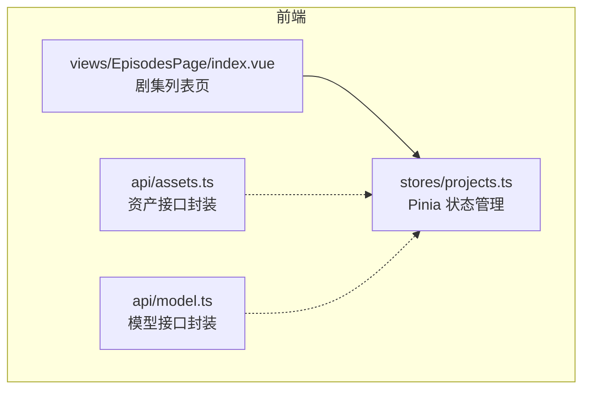
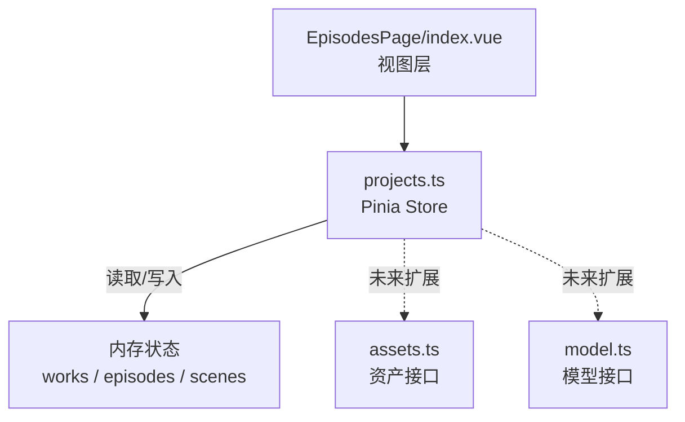
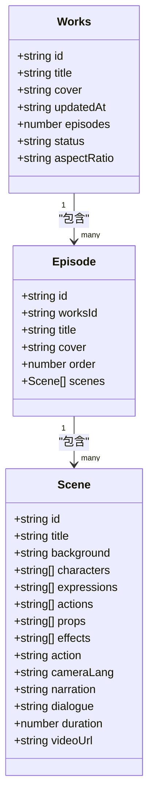
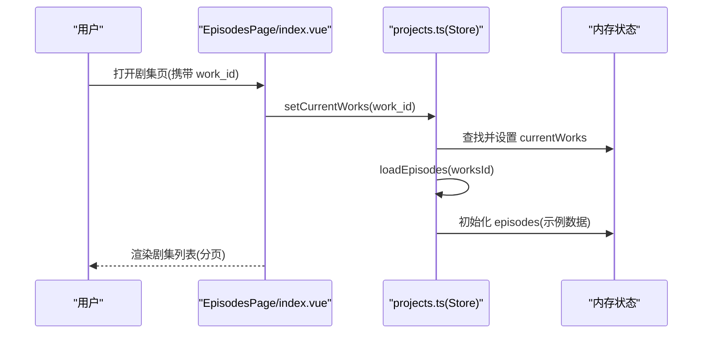
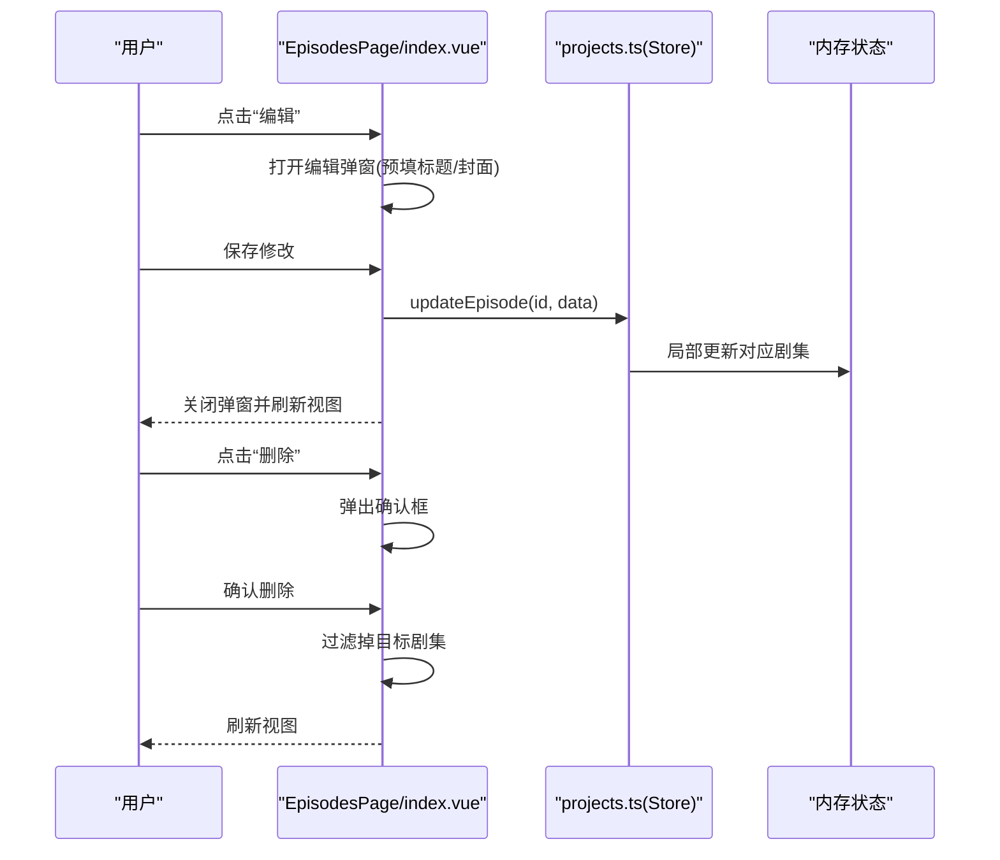
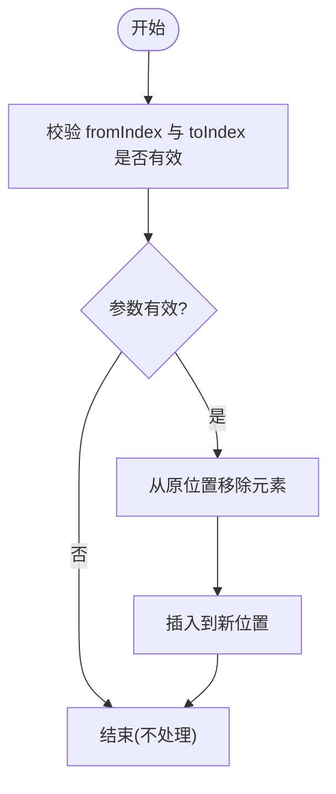
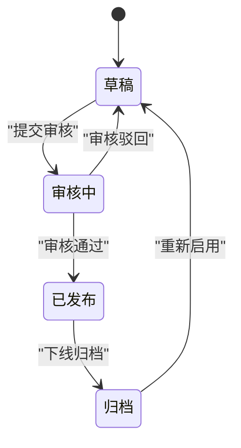
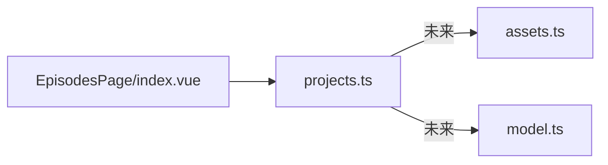

# 项目状态管理

<cite>
**本文引用的文件**   
- [frontend/src/stores/projects.ts](file://frontend/src/stores/projects.ts)
- [frontend/src/views/EpisodesPage/index.vue](file://frontend/src/views/EpisodesPage/index.vue)
- [frontend/src/api/assets.ts](file://frontend/src/api/assets.ts)
- [frontend/src/api/model.ts](file://frontend/src/api/model.ts)
</cite>

## 目录
1. [引言](#引言)
2. [项目结构](#项目结构)
3. [核心组件](#核心组件)
4. [架构总览](#架构总览)
5. [详细组件分析](#详细组件分析)
6. [依赖分析](#依赖分析)
7. [性能考虑](#性能考虑)
8. [故障排查指南](#故障排查指南)
9. [结论](#结论)
10. [附录](#附录)

## 引言
本文件围绕“项目状态管理”展开，聚焦于前端侧的项目（作品）与剧集、分镜等数据模型及其状态流转。当前实现以 Pinia Store 为核心，提供本地化的增删改查与分页展示能力；同时结合 API 层对资产与模型进行查询与操作。文档将系统梳理：
- 数据模型设计（作品、剧集、分镜）
- 状态转换逻辑（创建、更新、删除、排序）
- 页面交互流程（进入剧集页、编辑、删除）
- 扩展点与后续演进方向（协作同步、版本控制、离线支持、一致性保证）

## 项目结构
本项目采用前后端分离的常见结构。与“项目状态管理”直接相关的代码主要位于前端：
- 状态管理：Pinia Store 定义作品、剧集、分镜的数据结构与操作方法
- 视图层：剧集列表页负责加载当前作品、分页展示、触发编辑与删除
- API 层：资产与模型相关接口封装，为后续集成到项目工作流提供基础

图表来源
- [frontend/src/stores/projects.ts](file://frontend/src/stores/projects.ts)
- [frontend/src/views/EpisodesPage/index.vue](file://frontend/src/views/EpisodesPage/index.vue)
- [frontend/src/api/assets.ts](file://frontend/src/api/assets.ts)
- [frontend/src/api/model.ts](file://frontend/src/api/model.ts)

章节来源
- [frontend/src/stores/projects.ts](file://frontend/src/stores/projects.ts)
- [frontend/src/views/EpisodesPage/index.vue](file://frontend/src/views/EpisodesPage/index.vue)
- [frontend/src/api/assets.ts](file://frontend/src/api/assets.ts)
- [frontend/src/api/model.ts](file://frontend/src/api/model.ts)

## 核心组件
本节从数据模型与状态方法两个维度解析项目状态管理的核心。

- 数据模型
  - 作品 Works：标识、标题、封面、更新时间、集数、状态（草稿/已发布）、宽高比
  - 剧集 Episode：标识、所属作品ID、标题、封面、排序序号、分镜列表
  - 分镜 Scene：标识、标题、背景图、角色/表情/动作/道具/特效集合、镜头语言、旁白、对话、时长、视频地址等
- 状态与方法
  - 作品级：新增、删除、局部更新、设置当前作品并加载其剧集
  - 剧集级：新增、局部更新、分页展示
  - 分镜级：新增、批量新增、重排顺序、删除

这些能力共同构成“项目状态管理”的基础骨架，支撑后续的协作、版本与进度跟踪等高级特性。

章节来源
- [frontend/src/stores/projects.ts](file://frontend/src/stores/projects.ts)

## 架构总览
下图展示了“项目状态管理”在应用中的位置与交互关系：视图层通过 Store 读写状态，API 层作为扩展点用于持久化或协同。

图表来源
- [frontend/src/views/EpisodesPage/index.vue](file://frontend/src/views/EpisodesPage/index.vue)
- [frontend/src/stores/projects.ts](file://frontend/src/stores/projects.ts)
- [frontend/src/api/assets.ts](file://frontend/src/api/assets.ts)
- [frontend/src/api/model.ts](file://frontend/src/api/model.ts)

## 详细组件分析

### 数据模型与类关系

图表来源
- [frontend/src/stores/projects.ts](file://frontend/src/stores/projects.ts)

章节来源
- [frontend/src/stores/projects.ts](file://frontend/src/stores/projects.ts)

### 关键流程：进入剧集页并加载数据

图表来源
- [frontend/src/views/EpisodesPage/index.vue](file://frontend/src/views/EpisodesPage/index.vue)
- [frontend/src/stores/projects.ts](file://frontend/src/stores/projects.ts)

章节来源
- [frontend/src/views/EpisodesPage/index.vue](file://frontend/src/views/EpisodesPage/index.vue)
- [frontend/src/stores/projects.ts](file://frontend/src/stores/projects.ts)

### 关键流程：编辑与删除剧集

图表来源
- [frontend/src/views/EpisodesPage/index.vue](file://frontend/src/views/EpisodesPage/index.vue)
- [frontend/src/stores/projects.ts](file://frontend/src/stores/projects.ts)

章节来源
- [frontend/src/views/EpisodesPage/index.vue](file://frontend/src/views/EpisodesPage/index.vue)
- [frontend/src/stores/projects.ts](file://frontend/src/stores/projects.ts)

### 复杂逻辑：分镜场景重排算法

图表来源
- [frontend/src/stores/projects.ts](file://frontend/src/stores/projects.ts)

章节来源
- [frontend/src/stores/projects.ts](file://frontend/src/stores/projects.ts)

### 概念性总览：项目生命周期与协作状态（规划）
以下图示为面向未来的概念性规划，用于指导后续实现协作、版本与离线能力。

[此图为概念示意，不对应具体源码文件]

## 依赖分析
- 视图层依赖 Store：剧集页通过调用 Store 的方法完成数据加载与变更
- Store 内部维护内存状态：当前实现未直接持久化，适合原型与演示
- API 层独立封装：资产与模型接口可被 Store 在未来扩展时调用，以实现持久化与协同

图表来源
- [frontend/src/views/EpisodesPage/index.vue](file://frontend/src/views/EpisodesPage/index.vue)
- [frontend/src/stores/projects.ts](file://frontend/src/stores/projects.ts)
- [frontend/src/api/assets.ts](file://frontend/src/api/assets.ts)
- [frontend/src/api/model.ts](file://frontend/src/api/model.ts)

章节来源
- [frontend/src/views/EpisodesPage/index.vue](file://frontend/src/views/EpisodesPage/index.vue)
- [frontend/src/stores/projects.ts](file://frontend/src/stores/projects.ts)
- [frontend/src/api/assets.ts](file://frontend/src/api/assets.ts)
- [frontend/src/api/model.ts](file://frontend/src/api/model.ts)

## 性能考虑
- 列表分页：剧集列表使用前端分页，避免一次性渲染大量节点
- 局部更新：通过按 ID 定位并合并字段的方式减少不必要的重渲染
- 批量操作：分镜批量新增可减少多次响应式更新带来的开销
- 建议：
  - 当数据量增长时，引入虚拟滚动或懒加载
  - 对频繁更新的字段（如进度、状态）使用细粒度响应式更新策略
  - 将耗时计算移出主线程或使用 Web Worker

## 故障排查指南
- 问题：进入剧集页后无数据
  - 检查路由参数 work_id 是否正确传递
  - 确认 setCurrentWorks 是否成功设置 currentWorks 并触发 loadEpisodes
- 问题：编辑后未生效
  - 确认 updateEpisode 传入的 ID 是否存在
  - 检查视图层是否正确触发保存回调
- 问题：删除后页面异常
  - 确认删除逻辑是否正确过滤目标条目
  - 检查分页器是否需要修正当前页码

章节来源
- [frontend/src/views/EpisodesPage/index.vue](file://frontend/src/views/EpisodesPage/index.vue)
- [frontend/src/stores/projects.ts](file://frontend/src/stores/projects.ts)

## 结论
当前“项目状态管理”在前端实现了清晰的数据模型与状态操作方法，能够支撑作品、剧集与分镜的基本 CRUD 与分页展示。下一步可在现有基础上逐步引入：
- 分布式状态同步（WebSocket/CRDT）
- 版本控制（快照/差异合并）
- 离线支持（IndexedDB 缓存与冲突解决）
- 数据一致性（乐观更新与回滚机制）

## 附录
- 相关 API 参考（便于后续集成）
  - 资产接口：获取列表、详情、创建、更新、删除
  - 模型接口：获取全部模型列表、分页列表

章节来源
- [frontend/src/api/assets.ts](file://frontend/src/api/assets.ts)
- [frontend/src/api/model.ts](file://frontend/src/api/model.ts)