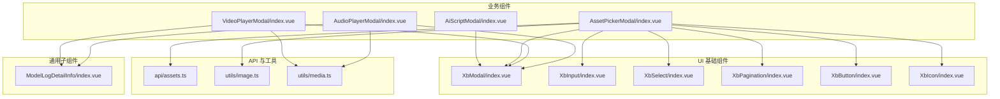
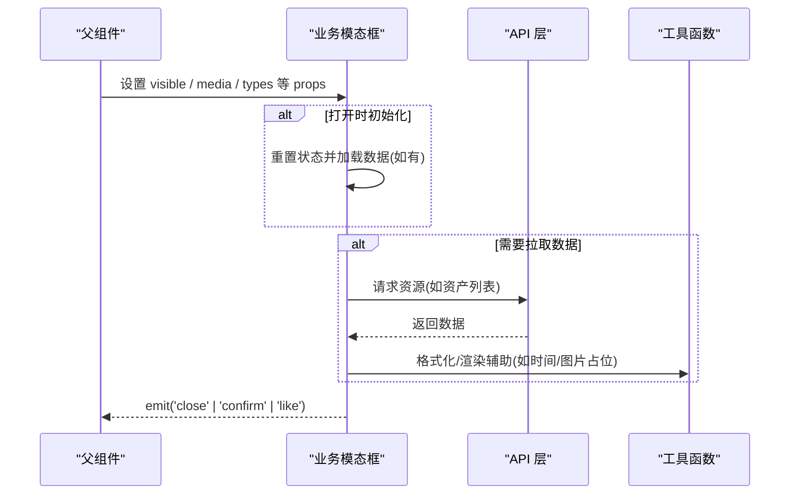
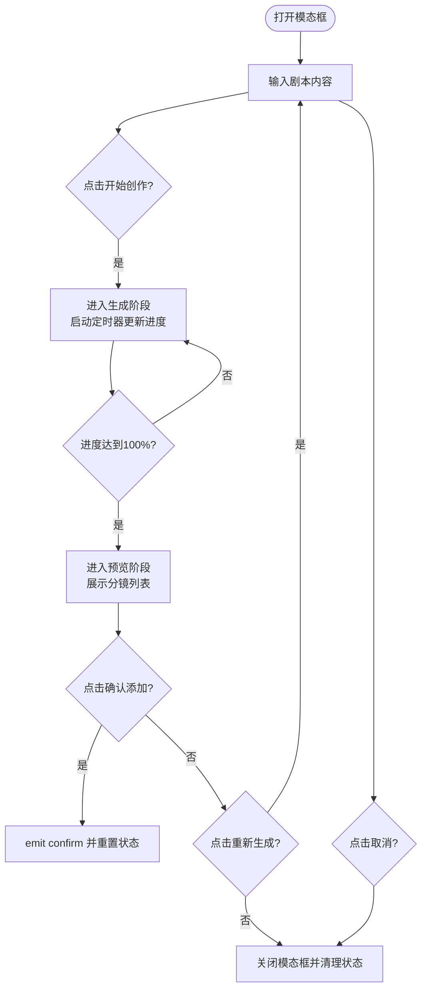
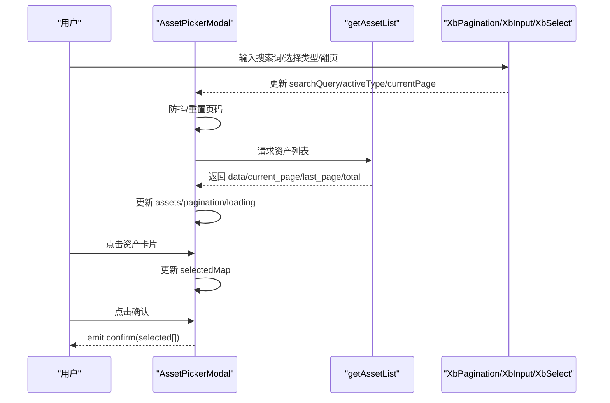
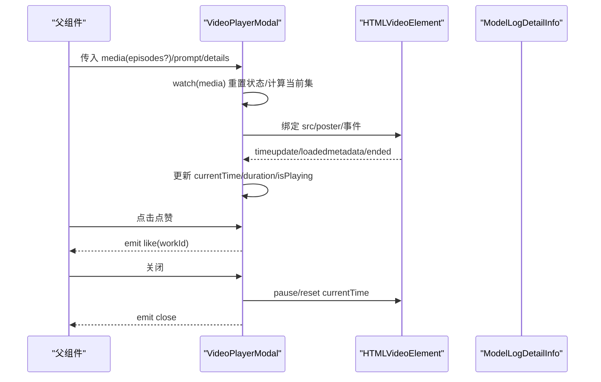
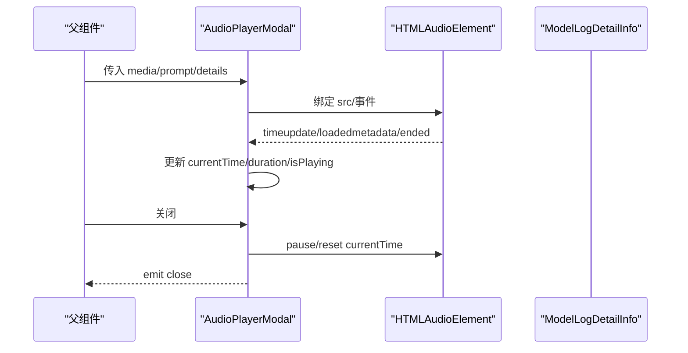
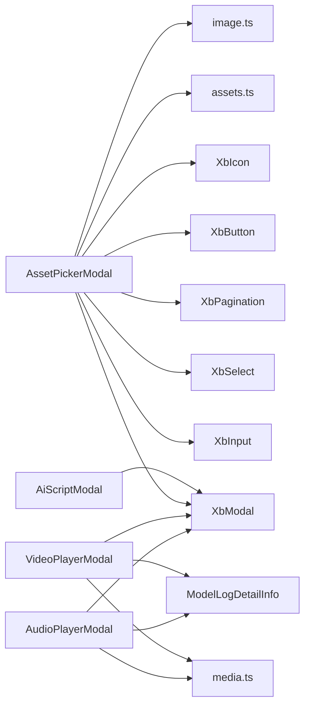

# 业务组件

<cite>
**本文引用的文件**   
- [AiScriptModal/index.vue](file://frontend/src/components/AiScriptModal/index.vue)
- [AssetPickerModal/index.vue](file://frontend/src/components/AssetPickerModal/index.vue)
- [VideoPlayerModal/index.vue](file://frontend/src/components/VideoPlayerModal/index.vue)
- [AudioPlayerModal/index.vue](file://frontend/src/components/AudioPlayerModal/index.vue)
- [assets.ts](file://frontend/src/api/assets.ts)
- [image.ts](file://frontend/src/utils/image.ts)
- [media.ts](file://frontend/src/utils/media.ts)
- [XbModal/index.vue](file://frontend/src/xbUi/XbModal/index.vue)
- [XbInput/index.vue](file://frontend/src/xbUi/XbInput/index.vue)
- [XbSelect/index.vue](file://frontend/src/xbUi/XbSelect/index.vue)
- [XbPagination/index.vue](file://frontend/src/xbUi/XbPagination/index.vue)
- [XbButton/index.vue](file://frontend/src/xbUi/XbButton/index.vue)
- [XbIcon/index.vue](file://frontend/src/xbUi/XbIcon/index.vue)
- [ModelLogDetailInfo/index.vue](file://frontend/src/components/ModelLogDetailInfo/index.vue)
</cite>

## 目录
1. [简介](#简介)
2. [项目结构](#项目结构)
3. [核心组件](#核心组件)
4. [架构总览](#架构总览)
5. [详细组件分析](#详细组件分析)
6. [依赖关系分析](#依赖关系分析)
7. [性能与体验优化](#性能与体验优化)
8. [故障排查指南](#故障排查指南)
9. [结论](#结论)
10. [附录：配置与事件参考](#附录配置与事件参考)

## 简介
本章节面向“特定业务场景”的前端业务组件，聚焦以下四个模态框组件：
- AiScriptModal：AI 剧本创作分镜生成流程（输入→生成→预览）
- AssetPickerModal：资产选择器（支持搜索、类型筛选、分页、多选/单选）
- VideoPlayerModal：视频播放器（支持选集、进度控制、全屏、点赞等）
- AudioPlayerModal：音频播放器（封面、进度、静音、播放控制）

文档将深入讲解各组件的业务逻辑封装、状态管理、数据流处理、用户交互设计，并提供配置项、事件回调、插槽扩展点与自定义化方案。

## 项目结构
这些业务组件位于前端 src/components 目录下，均基于统一的 UI 基础组件（如 XbModal、XbButton、XbInput、XbSelect、XbPagination、XbIcon）构建，并通过 API 层与工具函数完成数据获取与媒体时间格式化。

图表来源
- [AiScriptModal/index.vue:1-200](file://frontend/src/components/AiScriptModal/index.vue#L1-L200)
- [AssetPickerModal/index.vue:1-227](file://frontend/src/components/AssetPickerModal/index.vue#L1-L227)
- [VideoPlayerModal/index.vue:1-318](file://frontend/src/components/VideoPlayerModal/index.vue#L1-L318)
- [AudioPlayerModal/index.vue:1-181](file://frontend/src/components/AudioPlayerModal/index.vue#L1-L181)
- [XbModal/index.vue](file://frontend/src/xbUi/XbModal/index.vue)
- [XbInput/index.vue](file://frontend/src/xbUi/XbInput/index.vue)
- [XbSelect/index.vue](file://frontend/src/xbUi/XbSelect/index.vue)
- [XbPagination/index.vue](file://frontend/src/xbUi/XbPagination/index.vue)
- [XbButton/index.vue](file://frontend/src/xbUi/XbButton/index.vue)
- [XbIcon/index.vue](file://frontend/src/xbUi/XbIcon/index.vue)
- [assets.ts](file://frontend/src/api/assets.ts)
- [image.ts](file://frontend/src/utils/image.ts)
- [media.ts](file://frontend/src/utils/media.ts)
- [ModelLogDetailInfo/index.vue](file://frontend/src/components/ModelLogDetailInfo/index.vue)

章节来源
- [AiScriptModal/index.vue:1-200](file://frontend/src/components/AiScriptModal/index.vue#L1-L200)
- [AssetPickerModal/index.vue:1-227](file://frontend/src/components/AssetPickerModal/index.vue#L1-L227)
- [VideoPlayerModal/index.vue:1-318](file://frontend/src/components/VideoPlayerModal/index.vue#L1-L318)
- [AudioPlayerModal/index.vue:1-181](file://frontend/src/components/AudioPlayerModal/index.vue#L1-L181)

## 核心组件
本节对四个业务组件进行概览式说明，后续章节将逐一展开。

- AiScriptModal
  - 功能：接收剧本文本，模拟解析为多段分镜，提供进度反馈与结果预览，确认后回传分镜数组。
  - 关键状态：步骤 step（input/generating/preview）、进度 progress、进度文案 progressText、生成结果 generatedScenes。
  - 交互：开始创作、取消生成、重新生成、确认添加。
  - 外部依赖：资产库用于角色/表情/道具/动作池的随机抽取；基础弹窗 XbModal。

- AssetPickerModal
  - 功能：资产列表选择器，支持名称搜索、类型筛选、分页浏览、单选/多选、最大选择数限制。
  - 关键状态：搜索词 searchQuery、活跃类型 activeType、选中映射 selectedMap、分页信息 currentPage/totalPages/total。
  - 交互：切换选择、翻页、确认选择、关闭弹窗。
  - 外部依赖：资产列表 API、图片错误占位、基础表单与分页组件。

- VideoPlayerModal
  - 功能：视频播放模态框，支持单视频或选集列表播放、进度条拖拽、静音、全屏、点赞、详情与提示词展示。
  - 关键状态：播放状态 isPlaying、静音 isMuted、当前时间 currentTime、时长 duration、当前集 currentEpisodeId、是否已点赞 isLiked。
  - 交互：播放/暂停、静音切换、跳转进度、切换剧集、点赞、关闭。
  - 外部依赖：时间格式化、详情子组件 ModelLogDetailInfo。

- AudioPlayerModal
  - 功能：音频播放模态框，支持封面展示、进度条、静音、播放控制、详情与提示词展示。
  - 关键状态：播放状态 isPlaying、静音 isMuted、当前时间 currentTime、时长 duration。
  - 交互：播放/暂停、静音切换、跳转进度、关闭。
  - 外部依赖：时间格式化、详情子组件 ModelLogDetailInfo。

章节来源
- [AiScriptModal/index.vue:1-200](file://frontend/src/components/AiScriptModal/index.vue#L1-L200)
- [AssetPickerModal/index.vue:1-227](file://frontend/src/components/AssetPickerModal/index.vue#L1-L227)
- [VideoPlayerModal/index.vue:1-318](file://frontend/src/components/VideoPlayerModal/index.vue#L1-L318)
- [AudioPlayerModal/index.vue:1-181](file://frontend/src/components/AudioPlayerModal/index.vue#L1-L181)

## 架构总览
从调用链看，业务组件通过 props 接收可见性与数据，通过 emits 向父级上报事件；内部使用响应式状态驱动 UI，并在合适时机调用 API 或工具函数。

图表来源
- [AssetPickerModal/index.vue:66-87](file://frontend/src/components/AssetPickerModal/index.vue#L66-L87)
- [VideoPlayerModal/index.vue:58-83](file://frontend/src/components/VideoPlayerModal/index.vue#L58-L83)
- [AudioPlayerModal/index.vue:42-60](file://frontend/src/components/AudioPlayerModal/index.vue#L42-L60)

## 详细组件分析

### AiScriptModal（AI 脚本生成模态框）
- 职责边界
  - 负责“输入→生成→预览”三阶段流程编排与状态流转。
  - 在生成阶段提供进度与文案提示，在预览阶段允许重新生成与确认。
- 状态与数据流
  - 输入阶段：scriptContent 绑定到输入表单。
  - 生成阶段：step=generating，progress 与 progressText 随定时器更新。
  - 预览阶段：generatedScenes 保存生成的分镜数组，供 ScenePreview 展示。
- 关键算法与复杂度
  - 解析剧本为分镜：按段落分割后，结合资产池随机组合角色/表情/道具/动作，时间复杂度 O(n)，n 为段落数。
- 用户交互
  - 开始创作：校验非空后进入生成阶段。
  - 取消生成：清理定时器并回到输入阶段。
  - 重新生成：清空结果并回到输入阶段。
  - 确认添加：emit confirm 并重置状态。
- 生命周期与清理
  - 监听 visible 变化，关闭时清理定时器与状态。
  - onBeforeUnmount 确保卸载时清理定时器。

图表来源
- [AiScriptModal/index.vue:81-137](file://frontend/src/components/AiScriptModal/index.vue#L81-L137)
- [AiScriptModal/index.vue:139-151](file://frontend/src/components/AiScriptModal/index.vue#L139-L151)

章节来源
- [AiScriptModal/index.vue:1-200](file://frontend/src/components/AiScriptModal/index.vue#L1-L200)

### AssetPickerModal（资产选择器）
- 职责边界
  - 提供可搜索、可筛选、可分页的资产网格选择界面，支持单选/多选与最大选择数限制。
- 状态与数据流
  - 搜索防抖：searchQuery 变更触发 fetchAssets，重置到第一页。
  - 类型筛选：activeType 变更触发 fetchAssets。
  - 分页：currentPage 变更触发 fetchAssets。
  - 选择逻辑：selectedMap 维护 id → 完整对象映射，支持跨页持久化选中。
- 接口与类型
  - 类型选项 AssetTypeOption：label/value。
  - 默认 props：types、multiple、maxSelect、initialSelectedIds、width、contentHeight。
- 用户交互
  - 点击卡片切换选中状态；底部显示已选数量与上限提示；确认后将选中数组 emit confirm。
- 错误处理
  - 获取列表失败时清空 assets 并保留 loading=false。

图表来源
- [AssetPickerModal/index.vue:50-87](file://frontend/src/components/AssetPickerModal/index.vue#L50-L87)
- [AssetPickerModal/index.vue:100-134](file://frontend/src/components/AssetPickerModal/index.vue#L100-L134)

章节来源
- [AssetPickerModal/index.vue:1-227](file://frontend/src/components/AssetPickerModal/index.vue#L1-L227)
- [assets.ts](file://frontend/src/api/assets.ts)
- [image.ts](file://frontend/src/utils/image.ts)

### VideoPlayerModal（视频播放器）
- 职责边界
  - 提供视频播放能力，支持单视频与选集列表，附带进度控制、静音、全屏、点赞与详情/提示词面板。
- 状态与数据流
  - 媒体切换：watch media 重置播放状态并计算 currentEpisodeId。
  - 播放控制：togglePlay/toggleMute/seekTo/onTimeUpdate/onLoadedMetadata/onEnded。
  - 选集切换：switchEpisode 重置播放并 load 新源。
  - 点赞：toggleLike 切换本地状态并 emit like。
- 用户体验
  - 悬浮控制栏、进度条点击跳转、时间格式化显示、封面图 poster。
- 集成点
  - 右侧面板复用 ModelLogDetailInfo 展示模型/状态/分辨率等信息。

图表来源
- [VideoPlayerModal/index.vue:58-165](file://frontend/src/components/VideoPlayerModal/index.vue#L58-L165)
- [VideoPlayerModal/index.vue:173-316](file://frontend/src/components/VideoPlayerModal/index.vue#L173-L316)

章节来源
- [VideoPlayerModal/index.vue:1-318](file://frontend/src/components/VideoPlayerModal/index.vue#L1-L318)
- [media.ts](file://frontend/src/utils/media.ts)
- [ModelLogDetailInfo/index.vue](file://frontend/src/components/ModelLogDetailInfo/index.vue)

### AudioPlayerModal（音频播放器）
- 职责边界
  - 提供音频播放能力，包含封面、进度条、静音、播放控制与详情/提示词面板。
- 状态与数据流
  - 播放控制：togglePlay/toggleMute/seekTo/onTimeUpdate/onLoadedMetadata/onEnded。
  - 媒体切换：watch media 重置播放状态。
- 用户体验
  - 居中布局、大封面、简洁控制区、时间格式化显示。
- 集成点
  - 右侧面板复用 ModelLogDetailInfo 展示模型/状态/分辨率等信息。

图表来源
- [AudioPlayerModal/index.vue:42-107](file://frontend/src/components/AudioPlayerModal/index.vue#L42-L107)
- [AudioPlayerModal/index.vue:110-179](file://frontend/src/components/AudioPlayerModal/index.vue#L110-L179)

章节来源
- [AudioPlayerModal/index.vue:1-181](file://frontend/src/components/AudioPlayerModal/index.vue#L1-L181)
- [media.ts](file://frontend/src/utils/media.ts)
- [ModelLogDetailInfo/index.vue](file://frontend/src/components/ModelLogDetailInfo/index.vue)

## 依赖关系分析
- 组件耦合与内聚
  - 各模态框高度内聚于自身业务域，通过 props/emits 与父组件解耦。
  - 对 UI 基础组件的依赖明确且单一，便于替换与测试。
- 直接/间接依赖
  - AssetPickerModal 直接依赖 assets API 与 image 工具；Video/Audio 播放器依赖 media 工具与详情子组件。
- 外部依赖与集成点
  - 统一弹窗容器 XbModal；表单与分页由 XbInput/XbSelect/XbPagination 提供。
- 潜在循环依赖
  - 未发现循环引用；组件间通过事件与 props 单向通信。

图表来源
- [AiScriptModal/index.vue:1-200](file://frontend/src/components/AiScriptModal/index.vue#L1-L200)
- [AssetPickerModal/index.vue:1-227](file://frontend/src/components/AssetPickerModal/index.vue#L1-L227)
- [VideoPlayerModal/index.vue:1-318](file://frontend/src/components/VideoPlayerModal/index.vue#L1-L318)
- [AudioPlayerModal/index.vue:1-181](file://frontend/src/components/AudioPlayerModal/index.vue#L1-L181)
- [assets.ts](file://frontend/src/api/assets.ts)
- [image.ts](file://frontend/src/utils/image.ts)
- [media.ts](file://frontend/src/utils/media.ts)
- [XbModal/index.vue](file://frontend/src/xbUi/XbModal/index.vue)
- [XbInput/index.vue](file://frontend/src/xbUi/XbInput/index.vue)
- [XbSelect/index.vue](file://frontend/src/xbUi/XbSelect/index.vue)
- [XbPagination/index.vue](file://frontend/src/xbUi/XbPagination/index.vue)
- [XbButton/index.vue](file://frontend/src/xbUi/XbButton/index.vue)
- [XbIcon/index.vue](file://frontend/src/xbUi/XbIcon/index.vue)
- [ModelLogDetailInfo/index.vue](file://frontend/src/components/ModelLogDetailInfo/index.vue)

章节来源
- [AssetPickerModal/index.vue:1-227](file://frontend/src/components/AssetPickerModal/index.vue#L1-L227)
- [VideoPlayerModal/index.vue:1-318](file://frontend/src/components/VideoPlayerModal/index.vue#L1-L318)
- [AudioPlayerModal/index.vue:1-181](file://frontend/src/components/AudioPlayerModal/index.vue#L1-L181)

## 性能与体验优化
- 列表与分页
  - 使用分页减少首屏渲染压力；搜索与类型筛选采用防抖降低请求频率。
- 媒体播放
  - 仅在可见时加载媒体资源；切换剧集/媒体前主动 reset 时间与暂停，避免重复加载。
- 内存与定时器
  - 生成进度使用定时器，需在取消/关闭/卸载时清理，防止泄漏。
- 图片与占位
  - 图片加载失败时使用统一占位策略，提升视觉一致性。

[本节为通用建议，不直接分析具体文件]

## 故障排查指南
- 资产列表为空
  - 检查 API 返回结构与分页字段；确认搜索/筛选参数是否正确拼接。
- 选择状态丢失
  - 确认 selectedMap 是否在跨页切换时保持；注意 Map 引用更新以触发响应式。
- 媒体无法播放
  - 检查 mediaUrl 有效性；确认浏览器自动播放策略；必要时在用户手势后触发 play。
- 进度不同步
  - 确认 timeupdate 事件是否被正确绑定；duration 是否为 0 导致进度异常。
- 弹窗未关闭或资源未释放
  - 检查 visible 监听与关闭回调中是否执行了 pause/reset/clearInterval。

章节来源
- [AssetPickerModal/index.vue:66-87](file://frontend/src/components/AssetPickerModal/index.vue#L66-L87)
- [AssetPickerModal/index.vue:100-134](file://frontend/src/components/AssetPickerModal/index.vue#L100-L134)
- [VideoPlayerModal/index.vue:58-165](file://frontend/src/components/VideoPlayerModal/index.vue#L58-L165)
- [AudioPlayerModal/index.vue:42-107](file://frontend/src/components/AudioPlayerModal/index.vue#L42-L107)
- [AiScriptModal/index.vue:139-151](file://frontend/src/components/AiScriptModal/index.vue#L139-L151)

## 结论
上述四个业务组件围绕“内容生成—素材选择—媒体消费”的核心链路，提供了高内聚、低耦合、可扩展的解决方案。通过清晰的 props/emits 契约、稳健的状态管理与完善的交互细节，既满足现有业务需求，也为后续扩展（如更多媒体类型、更丰富的筛选维度、更强的自定义能力）预留了空间。

[本节为总结性内容，不直接分析具体文件]

## 附录：配置与事件参考

- AiScriptModal
  - Props
    - visible: boolean
  - Events
    - close: 无参
    - confirm(scenes): 返回生成的分镜数组（不含 id）
  - 插槽
    - header/footer：由 XbModal 提供，可在父级覆盖

- AssetPickerModal
  - Props
    - visible: boolean
    - types: AssetTypeOption[]（为空则隐藏类型筛选）
    - multiple: boolean（是否多选）
    - maxSelect: number（最大选择数）
    - initialSelectedIds: number[]（初始选中 ID 列表）
    - width: string（弹窗宽度类名）
    - contentHeight: string（内容区域最小高度类名）
  - Events
    - close: 无参
    - confirm(selected: AssetItem[]): 返回选中资产数组
  - 插槽
    - header/footer：由 XbModal 提供

- VideoPlayerModal
  - Props
    - visible: boolean
    - media: VideoPlayerInfo | null
    - showLike?: boolean
    - prompt?: string
    - details: VideoPlayerDetails
  - Events
    - close: 无参
    - like(workId: string): 点赞回调
  - 插槽
    - header/footer：由 XbModal 提供

- AudioPlayerModal
  - Props
    - visible: boolean
    - media: AudioPlayerInfo | null
    - prompt?: string
    - details: AudioPlayerDetails
  - Events
    - close: 无参
  - 插槽
    - header/footer：由 XbModal 提供

章节来源
- [AiScriptModal/index.vue:9-13](file://frontend/src/components/AiScriptModal/index.vue#L9-L13)
- [AssetPickerModal/index.vue:11-35](file://frontend/src/components/AssetPickerModal/index.vue#L11-L35)
- [VideoPlayerModal/index.vue:32-43](file://frontend/src/components/VideoPlayerModal/index.vue#L32-L43)
- [AudioPlayerModal/index.vue:20-29](file://frontend/src/components/AudioPlayerModal/index.vue#L20-L29)