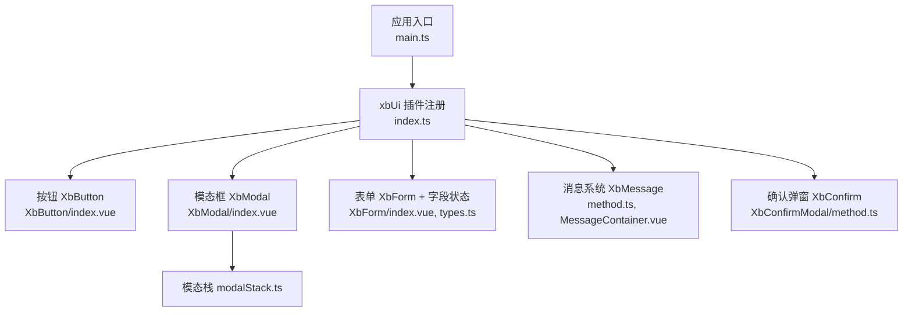
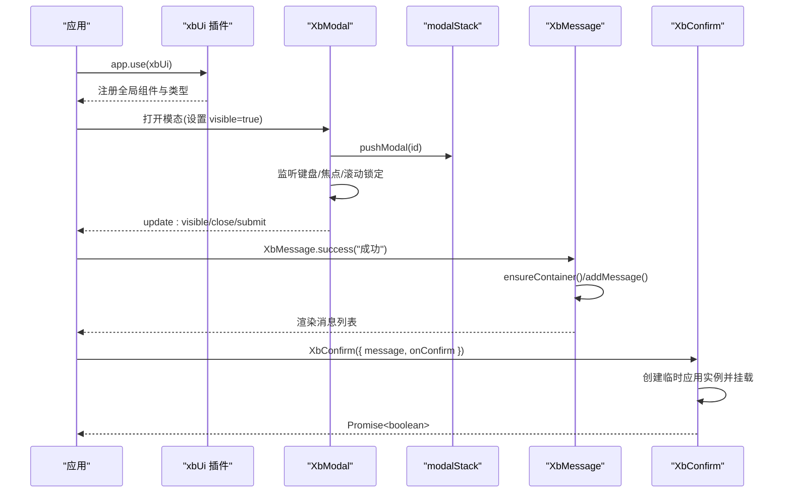
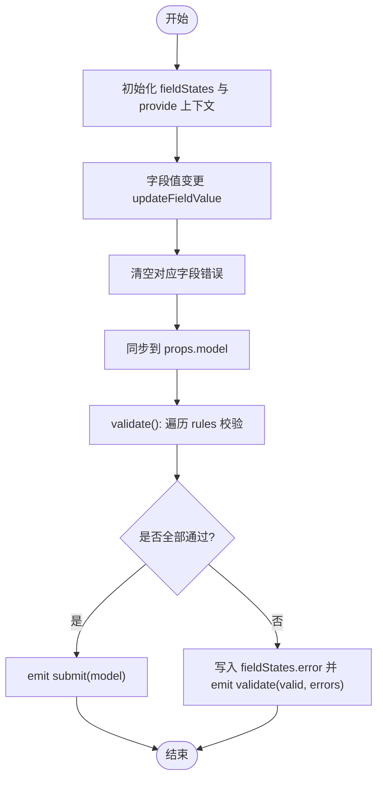
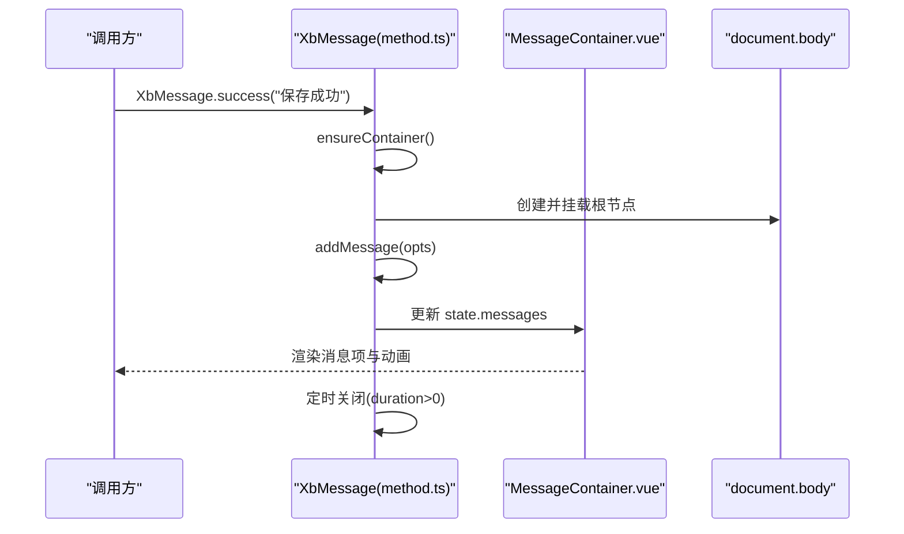
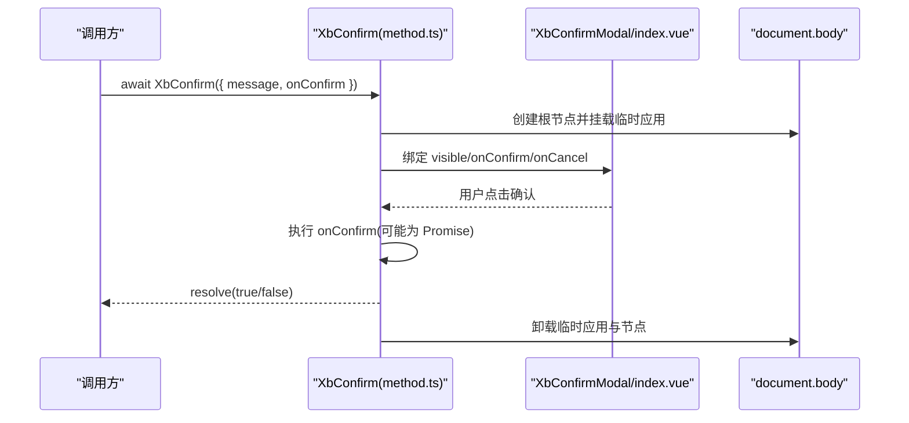
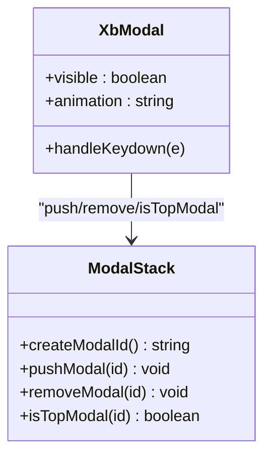
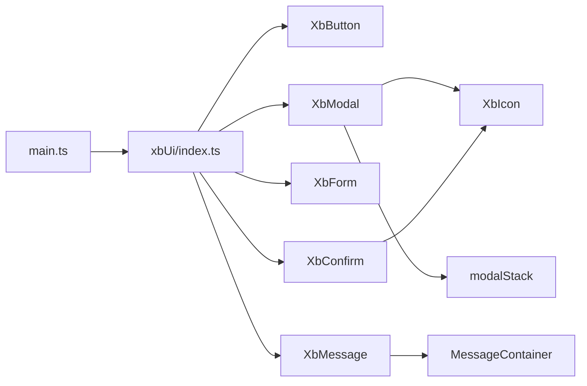

# 组件系统设计

<cite>
**本文引用的文件**   
- [frontend/src/main.ts](file://frontend/src/main.ts)
- [frontend/src/xbUi/index.ts](file://frontend/src/xbUi/index.ts)
- [frontend/src/xbUi/XbButton/index.vue](file://frontend/src/xbUi/XbButton/index.vue)
- [frontend/src/xbUi/XbModal/index.vue](file://frontend/src/xbUi/XbModal/index.vue)
- [frontend/src/xbUi/modalStack.ts](file://frontend/src/xbUi/modalStack.ts)
- [frontend/src/xbUi/XbForm/index.vue](file://frontend/src/xbUi/XbForm/index.vue)
- [frontend/src/xbUi/XbForm/types.ts](file://frontend/src/xbUi/XbForm/types.ts)
- [frontend/src/xbUi/XbMessage/method.ts](file://frontend/src/xbUi/XbMessage/method.ts)
- [frontend/src/xbUi/XbMessage/MessageContainer.vue](file://frontend/src/xbUi/XbMessage/MessageContainer.vue)
- [frontend/src/xbUi/XbConfirmModal/method.ts](file://frontend/src/xbUi/XbConfirmModal/method.ts)
</cite>

## 目录
1. [引言](#引言)
2. [项目结构](#项目结构)
3. [核心组件](#核心组件)
4. [架构总览](#架构总览)
5. [详细组件分析](#详细组件分析)
6. [依赖关系分析](#依赖关系分析)
7. [性能考量](#性能考量)
8. [故障排查指南](#故障排查指南)
9. [结论](#结论)
10. [附录](#附录)

## 引言
本文件围绕前端仓库中的 xbUi 自定义 UI 组件库与整体组件体系进行系统化文档化，覆盖 Vue 3 组件开发规范、组件分类（业务组件、通用组件、页面组件）、组件通信模式、插槽使用、事件处理等核心概念；并深入解析 xbUi 的设计与实现：组件注册、API 设计、样式隔离、主题定制、命令式调用（消息与确认弹窗）、模态栈管理等。同时提供最佳实践、性能优化策略、测试方法与常见问题解决方案，帮助团队在复杂项目中稳定扩展与维护组件生态。

## 项目结构
前端采用模块化组织方式，核心入口 main.ts 中统一安装路由、状态管理与 xbUi 插件；xbUi 通过 index.ts 集中导出插件与单组件，便于按需引入或全局注册。表单、消息、确认弹窗等具备“命令式 API”的组件通过独立 method 文件暴露函数式接口，配合容器组件完成挂载与渲染。

图表来源
- [frontend/src/main.ts:1-21](file://frontend/src/main.ts#L1-L21)
- [frontend/src/xbUi/index.ts:1-100](file://frontend/src/xbUi/index.ts#L1-L100)
- [frontend/src/xbUi/XbButton/index.vue:1-110](file://frontend/src/xbUi/XbButton/index.vue#L1-L110)
- [frontend/src/xbUi/XbModal/index.vue:1-620](file://frontend/src/xbUi/XbModal/index.vue#L1-L620)
- [frontend/src/xbUi/modalStack.ts:1-29](file://frontend/src/xbUi/modalStack.ts#L1-L29)
- [frontend/src/xbUi/XbForm/index.vue:1-164](file://frontend/src/xbUi/XbForm/index.vue#L1-L164)
- [frontend/src/xbUi/XbForm/types.ts:1-15](file://frontend/src/xbUi/XbForm/types.ts#L1-L15)
- [frontend/src/xbUi/XbMessage/method.ts:1-116](file://frontend/src/xbUi/XbMessage/method.ts#L1-L116)
- [frontend/src/xbUi/XbMessage/MessageContainer.vue:1-618](file://frontend/src/xbUi/XbMessage/MessageContainer.vue#L1-L618)
- [frontend/src/xbUi/XbConfirmModal/method.ts:1-150](file://frontend/src/xbUi/XbConfirmModal/method.ts#L1-L150)

章节来源
- [frontend/src/main.ts:1-21](file://frontend/src/main.ts#L1-L21)
- [frontend/src/xbUi/index.ts:1-100](file://frontend/src/xbUi/index.ts#L1-L100)

## 核心组件
本节聚焦 xbUi 的关键能力与交互范式，结合源码路径说明其职责边界与对外 API。

- 按钮 XbButton
  - 职责：基础操作触发控件，支持类型、尺寸、禁用/加载、块级、自定义主色与渐变、原生 type 透传。
  - 事件：click
  - 插槽：默认插槽、icon 插槽
  - 样式：通过 CSS 变量注入自定义颜色，支持 hover 动效与阴影
  - 参考路径
    - [frontend/src/xbUi/XbButton/index.vue:1-110](file://frontend/src/xbUi/XbButton/index.vue#L1-L110)

- 模态框 XbModal
  - 职责：可配置标题/副标题、宽度、关闭行为、遮罩点击关闭、持久化、无内边距、动画类型、随机动画、Enter 提交等。
  - 事件：update:visible、close、submit
  - 键盘：仅顶层模态响应 Esc 关闭、Enter/Space 提交（非可编辑元素）
  - 模态栈：push/remove/isTopModal 管理多模态层级
  - 参考路径
    - [frontend/src/xbUi/XbModal/index.vue:1-620](file://frontend/src/xbUi/XbModal/index.vue#L1-L620)
    - [frontend/src/xbUi/modalStack.ts:1-29](file://frontend/src/xbUi/modalStack.ts#L1-L29)

- 表单 XbForm
  - 职责：表单上下文提供、字段注册/注销、值同步、校验规则执行、错误状态维护、提交封装。
  - 事件：submit、validate
  - 方法：validate、resetFields、handleSubmit（defineExpose）
  - 规则：required/min/max/pattern/validator（同步/异步）
  - 参考路径
    - [frontend/src/xbUi/XbForm/index.vue:1-164](file://frontend/src/xbUi/XbForm/index.vue#L1-L164)
    - [frontend/src/xbUi/XbForm/types.ts:1-15](file://frontend/src/xbUi/XbForm/types.ts#L1-L15)

- 消息系统 XbMessage
  - 职责：命令式消息提示，支持多种类型、位置、动画、自动关闭、图标显示、关闭按钮。
  - API：XbMessage(options)、success/warning/error/info、close(id)、closeAll()
  - 容器：MessageContainer 负责分组、布局与过渡动画
  - 参考路径
    - [frontend/src/xbUi/XbMessage/method.ts:1-116](file://frontend/src/xbUi/XbMessage/method.ts#L1-L116)
    - [frontend/src/xbUi/XbMessage/MessageContainer.vue:1-618](file://frontend/src/xbUi/XbMessage/MessageContainer.vue#L1-L618)

- 确认弹窗 XbConfirm
  - 职责：命令式确认对话框，支持标题、内容、按钮文案、类型、宽度、动画、异步 onConfirm 与 loading 控制。
  - 返回：Promise<boolean>
  - 参考路径
    - [frontend/src/xbUi/XbConfirmModal/method.ts:1-150](file://frontend/src/xbUi/XbConfirmModal/method.ts#L1-L150)

章节来源
- [frontend/src/xbUi/XbButton/index.vue:1-110](file://frontend/src/xbUi/XbButton/index.vue#L1-L110)
- [frontend/src/xbUi/XbModal/index.vue:1-620](file://frontend/src/xbUi/XbModal/index.vue#L1-L620)
- [frontend/src/xbUi/modalStack.ts:1-29](file://frontend/src/xbUi/modalStack.ts#L1-L29)
- [frontend/src/xbUi/XbForm/index.vue:1-164](file://frontend/src/xbUi/XbForm/index.vue#L1-L164)
- [frontend/src/xbUi/XbForm/types.ts:1-15](file://frontend/src/xbUi/XbForm/types.ts#L1-L15)
- [frontend/src/xbUi/XbMessage/method.ts:1-116](file://frontend/src/xbUi/XbMessage/method.ts#L1-L116)
- [frontend/src/xbUi/XbMessage/MessageContainer.vue:1-618](file://frontend/src/xbUi/XbMessage/MessageContainer.vue#L1-L618)
- [frontend/src/xbUi/XbConfirmModal/method.ts:1-150](file://frontend/src/xbUi/XbConfirmModal/method.ts#L1-L150)

## 架构总览
xbUi 以插件形式集成到应用中，统一注册全局组件并提供命令式 API。命令式组件通过 createApp 动态挂载到 body，避免侵入现有 DOM 树；模态栈保证键盘事件与焦点管理的正确性；表单通过 provide/inject 建立父子上下文，实现字段状态与校验的统一管理。

图表来源
- [frontend/src/main.ts:1-21](file://frontend/src/main.ts#L1-L21)
- [frontend/src/xbUi/index.ts:1-100](file://frontend/src/xbUi/index.ts#L1-L100)
- [frontend/src/xbUi/XbModal/index.vue:1-620](file://frontend/src/xbUi/XbModal/index.vue#L1-L620)
- [frontend/src/xbUi/modalStack.ts:1-29](file://frontend/src/xbUi/modalStack.ts#L1-L29)
- [frontend/src/xbUi/XbMessage/method.ts:1-116](file://frontend/src/xbUi/XbMessage/method.ts#L1-L116)
- [frontend/src/xbUi/XbConfirmModal/method.ts:1-150](file://frontend/src/xbUi/XbConfirmModal/method.ts#L1-L150)

## 详细组件分析

### 组件分类体系与开发规范
- 分类
  - 业务组件：面向具体业务场景的组合型组件（如数据看板、筛选面板），位于 src/components 下，强调复用性与领域语义。
  - 通用组件：跨业务复用的原子/分子级 UI 组件，集中在 xbUi 中，强调稳定性、可配置性与一致性。
  - 页面组件：路由对应的视图层组合，主要编排业务与通用组件，保持薄逻辑。
- 命名与目录
  - 组件目录以 PascalCase 命名，每个组件一个文件夹，入口为 index.vue。
  - 类型定义与工具函数与组件同目录或就近 types.ts 文件。
- Props/Emits/Slots
  - 使用 defineProps/withDefaults 声明 props 与默认值；defineEmits 明确事件签名；合理使用具名插槽与默认插槽。
- 样式与主题
  - 优先使用 Tailwind 原子类，必要时用 scoped 样式；通过 CSS 变量实现主题定制（如品牌色、圆角、阴影）。
- 可访问性
  - 关注 focus-visible、键盘导航、ARIA 属性与对比度。

章节来源
- [frontend/src/xbUi/index.ts:1-100](file://frontend/src/xbUi/index.ts#L1-L100)
- [frontend/src/xbUi/XbButton/index.vue:1-110](file://frontend/src/xbUi/XbButton/index.vue#L1-L110)

### 组件通信模式
- 父向子：props 传递配置与初始值
- 子向父：emit 事件上报状态变化与用户操作
- 跨层级：provide/inject 共享上下文（如表单上下文）
- 全局：事件总线（项目内 events 模块）用于解耦全局通知
- 命令式：createApp 动态挂载，返回 Promise 或句柄（消息、确认弹窗）

章节来源
- [frontend/src/xbUi/XbForm/index.vue:1-164](file://frontend/src/xbUi/XbForm/index.vue#L1-L164)
- [frontend/src/xbUi/XbMessage/method.ts:1-116](file://frontend/src/xbUi/XbMessage/method.ts#L1-L116)
- [frontend/src/xbUi/XbConfirmModal/method.ts:1-150](file://frontend/src/xbUi/XbConfirmModal/method.ts#L1-L150)

### 插槽使用与事件处理
- 插槽
  - 默认插槽承载主体内容；具名插槽用于头部/尾部/图标等区域扩展。
- 事件
  - 按钮 click、模态框 update:visible/close/submit、表单 submit/validate 等。
- 键盘与焦点
  - 模态框仅在顶层响应键盘事件；进入时聚焦内容区，退出时恢复滚动。

章节来源
- [frontend/src/xbUi/XbButton/index.vue:1-110](file://frontend/src/xbUi/XbButton/index.vue#L1-L110)
- [frontend/src/xbUi/XbModal/index.vue:1-620](file://frontend/src/xbUi/XbModal/index.vue#L1-L620)

### 表单子系统（XbForm）
- 上下文提供
  - 通过 provide('xbFormContext') 暴露 registerField/unregisterField/updateFieldValue/validateField/getFieldError/isFieldTouched 等方法。
- 校验流程
  - 支持 required/min/max/pattern/validator（同步/异步），遍历 rules 生成 errors 并更新 fieldStates。
- 生命周期
  - 字段值变更时清除错误并同步至 model；提交前统一 validate，成功后 emit submit。

图表来源
- [frontend/src/xbUi/XbForm/index.vue:1-164](file://frontend/src/xbUi/XbForm/index.vue#L1-L164)
- [frontend/src/xbUi/XbForm/types.ts:1-15](file://frontend/src/xbUi/XbForm/types.ts#L1-L15)

章节来源
- [frontend/src/xbUi/XbForm/index.vue:1-164](file://frontend/src/xbUi/XbForm/index.vue#L1-L164)
- [frontend/src/xbUi/XbForm/types.ts:1-15](file://frontend/src/xbUi/XbForm/types.ts#L1-L15)

### 消息系统（XbMessage）
- 命令式 API
  - XbMessage(options|string)，以及 success/warning/error/info/close/closeAll。
- 容器与状态
  - ensureContainer 首次调用时创建根节点与应用实例，渲染 MessageContainer；state.messages 驱动列表渲染。
- 动画与位置
  - 支持多种入场动画与六宫格位置，按位置分组渲染。

图表来源
- [frontend/src/xbUi/XbMessage/method.ts:1-116](file://frontend/src/xbUi/XbMessage/method.ts#L1-L116)
- [frontend/src/xbUi/XbMessage/MessageContainer.vue:1-618](file://frontend/src/xbUi/XbMessage/MessageContainer.vue#L1-L618)

章节来源
- [frontend/src/xbUi/XbMessage/method.ts:1-116](file://frontend/src/xbUi/XbMessage/method.ts#L1-L116)
- [frontend/src/xbUi/XbMessage/MessageContainer.vue:1-618](file://frontend/src/xbUi/XbMessage/MessageContainer.vue#L1-L618)

### 确认弹窗（XbConfirm）
- 命令式调用
  - XbConfirm(options|string) 返回 Promise<boolean>，支持异步 onConfirm 与 loading 控制。
- 生命周期
  - 创建临时应用实例并挂载到 body，nextTick 后显示；关闭时清理实例与 DOM。

图表来源
- [frontend/src/xbUi/XbConfirmModal/method.ts:1-150](file://frontend/src/xbUi/XbConfirmModal/method.ts#L1-L150)

章节来源
- [frontend/src/xbUi/XbConfirmModal/method.ts:1-150](file://frontend/src/xbUi/XbConfirmModal/method.ts#L1-L150)

### 模态栈（modalStack）
- 职责：维护当前打开的模态 ID 栈，判断是否为顶层模态，确保键盘事件与焦点只作用于最上层。
- 关键方法：createModalId、pushModal、removeModal、isTopModal。

图表来源
- [frontend/src/xbUi/modalStack.ts:1-29](file://frontend/src/xbUi/modalStack.ts#L1-L29)
- [frontend/src/xbUi/XbModal/index.vue:1-620](file://frontend/src/xbUi/XbModal/index.vue#L1-L620)

章节来源
- [frontend/src/xbUi/modalStack.ts:1-29](file://frontend/src/xbUi/modalStack.ts#L1-L29)
- [frontend/src/xbUi/XbModal/index.vue:1-620](file://frontend/src/xbUi/XbModal/index.vue#L1-L620)

## 依赖关系分析
- 插件注册
  - main.ts 通过 app.use(xbUi) 将 xbUi 作为插件安装，批量注册全局组件。
- 组件导出
  - xbUi/index.ts 集中导入各组件与类型，并分别导出供按需引入。
- 内部依赖
  - XbModal 依赖 XbIcon 与 modalStack；XbMessage 依赖 MessageContainer；XbConfirm 依赖 XbConfirmModal 与 XbIcon。

图表来源
- [frontend/src/main.ts:1-21](file://frontend/src/main.ts#L1-L21)
- [frontend/src/xbUi/index.ts:1-100](file://frontend/src/xbUi/index.ts#L1-L100)
- [frontend/src/xbUi/XbModal/index.vue:1-620](file://frontend/src/xbUi/XbModal/index.vue#L1-L620)
- [frontend/src/xbUi/modalStack.ts:1-29](file://frontend/src/xbUi/modalStack.ts#L1-L29)
- [frontend/src/xbUi/XbMessage/method.ts:1-116](file://frontend/src/xbUi/XbMessage/method.ts#L1-L116)
- [frontend/src/xbUi/XbMessage/MessageContainer.vue:1-618](file://frontend/src/xbUi/XbMessage/MessageContainer.vue#L1-L618)
- [frontend/src/xbUi/XbConfirmModal/method.ts:1-150](file://frontend/src/xbUi/XbConfirmModal/method.ts#L1-L150)

章节来源
- [frontend/src/main.ts:1-21](file://frontend/src/main.ts#L1-L21)
- [frontend/src/xbUi/index.ts:1-100](file://frontend/src/xbUi/index.ts#L1-L100)

## 性能考量
- 按需引入
  - 通过单独导出组件，打包时可做 Tree-shaking，减少体积。
- 懒挂载与销毁
  - 命令式组件在关闭后及时 unmount 与移除 DOM，避免内存泄漏。
- 动画与重排
  - 合理选择动画类型，避免频繁触发 layout；对大量消息列表考虑虚拟滚动。
- 表单校验
  - 异步 validator 注意并发与取消；校验失败时最小化 re-render。
- 样式与主题
  - 使用 CSS 变量与 Tailwind 原子类，减少重复样式与计算开销。

[本节为通用指导，不直接分析具体文件]

## 故障排查指南
- 模态框无法关闭
  - 检查 closeOnOverlay 与 persistent 配置；确认 isTopModal 判断是否正确。
  - 参考路径
    - [frontend/src/xbUi/XbModal/index.vue:1-620](file://frontend/src/xbUi/XbModal/index.vue#L1-L620)
    - [frontend/src/xbUi/modalStack.ts:1-29](file://frontend/src/xbUi/modalStack.ts#L1-L29)
- 键盘事件误触发
  - 确认目标是否为顶层模态；区分可编辑元素与非可编辑元素。
  - 参考路径
    - [frontend/src/xbUi/XbModal/index.vue:1-620](file://frontend/src/xbUi/XbModal/index.vue#L1-L620)
- 表单校验不生效
  - 检查 rules 配置与字段名一致；validator 返回值类型与 Promise 处理。
  - 参考路径
    - [frontend/src/xbUi/XbForm/index.vue:1-164](file://frontend/src/xbUi/XbForm/index.vue#L1-L164)
    - [frontend/src/xbUi/XbForm/types.ts:1-15](file://frontend/src/xbUi/XbForm/types.ts#L1-L15)
- 消息未显示或重复挂载
  - 确认 ensureContainer 是否被多次调用；检查 state.messages 更新与动画名称。
  - 参考路径
    - [frontend/src/xbUi/XbMessage/method.ts:1-116](file://frontend/src/xbUi/XbMessage/method.ts#L1-L116)
    - [frontend/src/xbUi/XbMessage/MessageContainer.vue:1-618](file://frontend/src/xbUi/XbMessage/MessageContainer.vue#L1-L618)
- 确认弹窗未返回结果
  - 检查 onConfirm 是否返回 Promise；确认 cleanup 时机与 resolve 分支。
  - 参考路径
    - [frontend/src/xbUi/XbConfirmModal/method.ts:1-150](file://frontend/src/xbUi/XbConfirmModal/method.ts#L1-L150)

章节来源
- [frontend/src/xbUi/XbModal/index.vue:1-620](file://frontend/src/xbUi/XbModal/index.vue#L1-L620)
- [frontend/src/xbUi/modalStack.ts:1-29](file://frontend/src/xbUi/modalStack.ts#L1-L29)
- [frontend/src/xbUi/XbForm/index.vue:1-164](file://frontend/src/xbUi/XbForm/index.vue#L1-L164)
- [frontend/src/xbUi/XbForm/types.ts:1-15](file://frontend/src/xbUi/XbForm/types.ts#L1-L15)
- [frontend/src/xbUi/XbMessage/method.ts:1-116](file://frontend/src/xbUi/XbMessage/method.ts#L1-L116)
- [frontend/src/xbUi/XbMessage/MessageContainer.vue:1-618](file://frontend/src/xbUi/XbMessage/MessageContainer.vue#L1-L618)
- [frontend/src/xbUi/XbConfirmModal/method.ts:1-150](file://frontend/src/xbUi/XbConfirmModal/method.ts#L1-L150)

## 结论
xbUi 以插件化与命令式 API 为核心，构建了高内聚、低耦合的通用组件体系。通过统一的注册机制、清晰的通信模式与完善的样式/主题方案，既满足快速迭代需求，又具备良好的可维护性与可扩展性。建议在实际项目中遵循本文的分类与规范，持续完善组件文档与测试用例，保障质量与体验。

[本节为总结性内容，不直接分析具体文件]

## 附录
- 组件注册与使用
  - 全局注册：在 main.ts 中 app.use(xbUi)
  - 按需引入：从 xbUi 单独导入组件与类型
  - 参考路径
    - [frontend/src/main.ts:1-21](file://frontend/src/main.ts#L1-L21)
    - [frontend/src/xbUi/index.ts:1-100](file://frontend/src/xbUi/index.ts#L1-L100)
- 主题定制
  - 通过 CSS 变量覆盖品牌色、圆角、阴影等；按钮支持 color 与 gradient 参数。
  - 参考路径
    - [frontend/src/xbUi/XbButton/index.vue:1-110](file://frontend/src/xbUi/XbButton/index.vue#L1-L110)
- 测试建议
  - 单元测试：对表单校验、消息/确认弹窗 API 进行断言。
  - 视觉回归：对模态动画与消息动画进行截图对比。
  - 可访问性：键盘导航与焦点顺序验证。

[本节为补充信息，不直接分析具体文件]