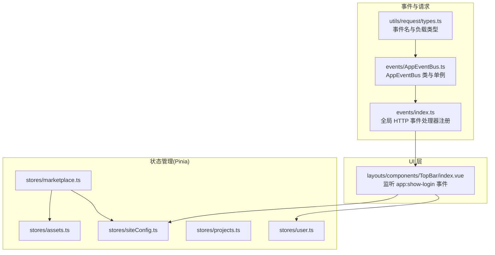
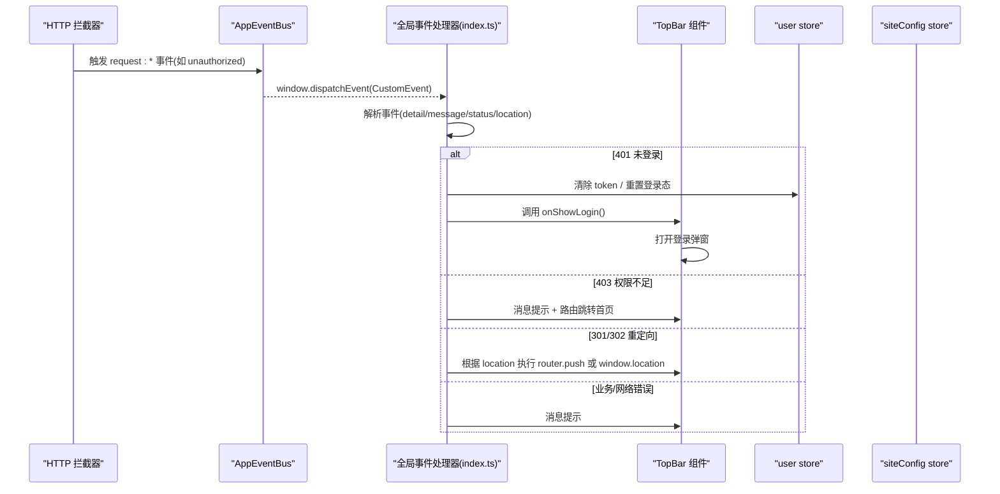
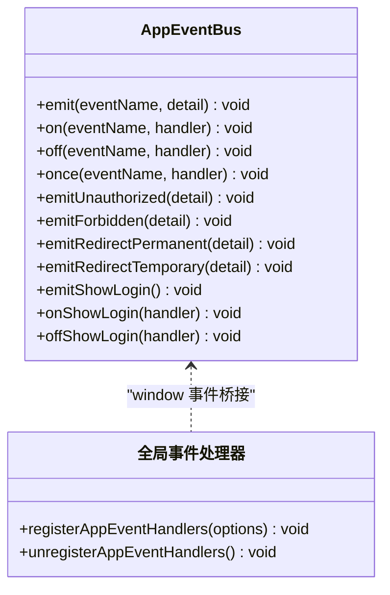
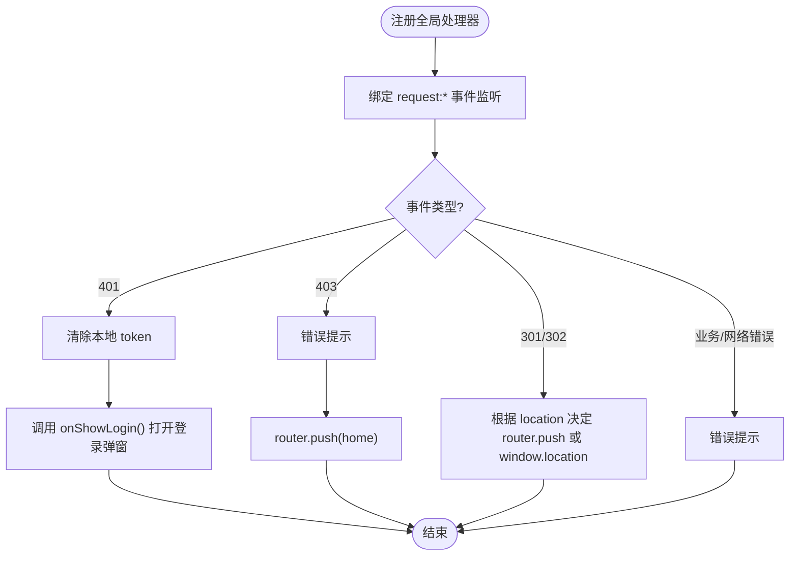
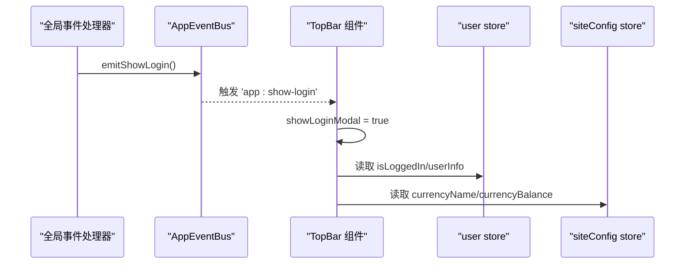
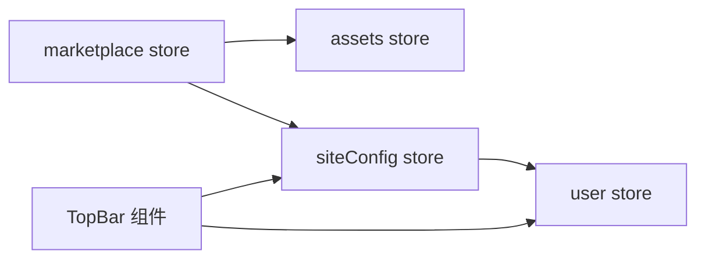
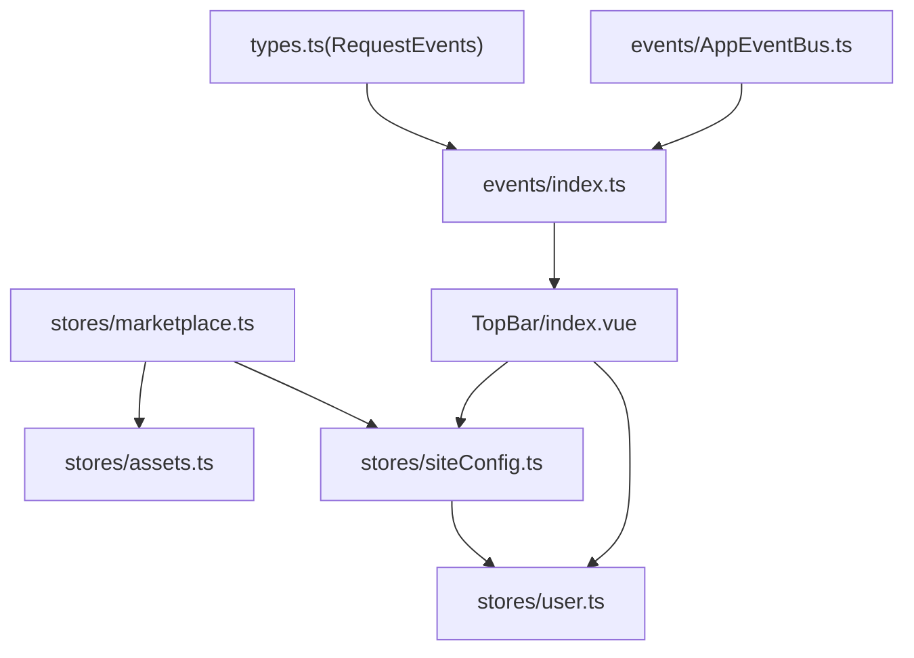

# 组件通信机制

<cite>
**本文引用的文件**   
- [AppEventBus.ts](file://frontend/src/events/AppEventBus.ts)
- [index.ts](file://frontend/src/events/index.ts)
- [types.ts](file://frontend/src/utils/request/types.ts)
- [TopBar/index.vue](file://frontend/src/layouts/components/TopBar/index.vue)
- [user.ts](file://frontend/src/stores/user.ts)
- [assets.ts](file://frontend/src/stores/assets.ts)
- [projects.ts](file://frontend/src/stores/projects.ts)
- [siteConfig.ts](file://frontend/src/stores/siteConfig.ts)
- [marketplace.ts](file://frontend/src/stores/marketplace.ts)
</cite>

## 目录
1. [引言](#引言)
2. [项目结构](#项目结构)
3. [核心组件](#核心组件)
4. [架构总览](#架构总览)
5. [详细组件分析](#详细组件分析)
6. [依赖分析](#依赖分析)
7. [性能考虑](#性能考虑)
8. [故障排查指南](#故障排查指南)
9. [结论](#结论)
10. [附录](#附录)

## 引言
本文件围绕前端应用中的“组件通信机制”展开，系统梳理并落地以下模式：
- 父子组件通信（props/emits）：在 UI 组件内部通过属性与事件完成数据与动作的传递。
- 兄弟组件通信（EventBus）：基于全局事件总线进行跨分支、非层级组件间的解耦通信。
- 跨层级组件通信（Provide/Inject）：适合深层嵌套场景下的主题、配置等上下文共享。
- 全局状态管理（Pinia）：集中式状态，支撑跨模块、跨页面数据同步与业务编排。

本项目已实现的事件总线与 Pinia 状态管理如下：
- AppEventBus：封装 window CustomEvent，提供 emit/on/off/once 及便捷方法，并与 HTTP 拦截器事件体系互通。
- Pinia Store：用户、素材、作品、站点配置、市场等模块的状态管理与业务编排。

## 项目结构
与组件通信相关的核心目录与文件：
- events：事件总线与全局 HTTP 事件处理器注册
- stores：Pinia 状态管理模块
- utils/request/types：HTTP 事件名称常量与负载类型定义
- layouts/components/TopBar：顶层布局中监听登录弹窗事件，驱动 UI 展示

图表来源
- [types.ts:1-40](file://frontend/src/utils/request/types.ts#L1-L40)
- [AppEventBus.ts:1-109](file://frontend/src/events/AppEventBus.ts#L1-L109)
- [index.ts:1-119](file://frontend/src/events/index.ts#L1-L119)
- [TopBar/index.vue:1-122](file://frontend/src/layouts/components/TopBar/index.vue#L1-L122)
- [user.ts:1-327](file://frontend/src/stores/user.ts#L1-L327)
- [assets.ts:1-161](file://frontend/src/stores/assets.ts#L1-L161)
- [projects.ts:1-279](file://frontend/src/stores/projects.ts#L1-L279)
- [siteConfig.ts:1-100](file://frontend/src/stores/siteConfig.ts#L1-L100)
- [marketplace.ts:1-334](file://frontend/src/stores/marketplace.ts#L1-L334)

章节来源
- [AppEventBus.ts:1-109](file://frontend/src/events/AppEventBus.ts#L1-L109)
- [index.ts:1-119](file://frontend/src/events/index.ts#L1-L119)
- [types.ts:1-40](file://frontend/src/utils/request/types.ts#L1-L40)
- [TopBar/index.vue:1-122](file://frontend/src/layouts/components/TopBar/index.vue#L1-L122)
- [user.ts:1-327](file://frontend/src/stores/user.ts#L1-L327)
- [assets.ts:1-161](file://frontend/src/stores/assets.ts#L1-L161)
- [projects.ts:1-279](file://frontend/src/stores/projects.ts#L1-L279)
- [siteConfig.ts:1-100](file://frontend/src/stores/siteConfig.ts#L1-L100)
- [marketplace.ts:1-334](file://frontend/src/stores/marketplace.ts#L1-L334)

## 核心组件
- AppEventBus：统一封装 window CustomEvent，提供 emit/on/off/once 以及针对 401/403/重定向/显示登录弹窗等快捷方法；导出单例 appEventBus 供全应用使用。
- 全局 HTTP 事件处理器：将 HTTP 拦截器抛出的错误事件映射为统一的 window 事件，集中处理未登录、权限不足、重定向与通用错误提示。
- Pinia Store：
  - user：登录态、用户信息、Token 持久化、绑定/解绑、头像与昵称更新等。
  - assets：素材列表、筛选与搜索、增删操作。
  - projects：作品与剧集、分镜场景的增删改查与排序。
  - siteConfig：站点配置初始化、货币名称与余额计算、与 user store 联动。
  - marketplace：市场上架、交易记录、钱包、筛选排序、购买流程与资产入库。

章节来源
- [AppEventBus.ts:1-109](file://frontend/src/events/AppEventBus.ts#L1-L109)
- [index.ts:1-119](file://frontend/src/events/index.ts#L1-L119)
- [user.ts:1-327](file://frontend/src/stores/user.ts#L1-L327)
- [assets.ts:1-161](file://frontend/src/stores/assets.ts#L1-L161)
- [projects.ts:1-279](file://frontend/src/stores/projects.ts#L1-L279)
- [siteConfig.ts:1-100](file://frontend/src/stores/siteConfig.ts#L1-L100)
- [marketplace.ts:1-334](file://frontend/src/stores/marketplace.ts#L1-L334)

## 架构总览
下图展示了“HTTP 错误 → 事件总线 → 全局处理器 → UI 响应”的完整链路，以及与 Pinia 状态的协同关系。

图表来源
- [index.ts:1-119](file://frontend/src/events/index.ts#L1-L119)
- [AppEventBus.ts:1-109](file://frontend/src/events/AppEventBus.ts#L1-L109)
- [TopBar/index.vue:1-122](file://frontend/src/layouts/components/TopBar/index.vue#L1-L122)
- [user.ts:1-327](file://frontend/src/stores/user.ts#L1-L327)
- [siteConfig.ts:1-100](file://frontend/src/stores/siteConfig.ts#L1-L100)

## 详细组件分析

### AppEventBus 事件总线
- 能力概览
  - 通用事件：emit/on/off/once，基于 window CustomEvent。
  - 快捷方法：emitUnauthorized/emitForbidden/emitRedirectPermanent/emitRedirectTemporary/emitShowLogin/onShowLogin/offShowLogin。
  - 单例导出：appEventBus，避免重复实例化。
- 与 HTTP 事件互通
  - 事件名常量集中在 types.ts 的 RequestEvents，确保事件命名一致。
  - 全局处理器 index.ts 统一订阅这些事件，做路由跳转、消息提示、登录态清理等。
- 典型用法
  - 在任意位置触发“显示登录弹窗”：appEventBus.emitShowLogin()。
  - 在需要响应的组件生命周期内注册/移除监听：onMounted/onUnmounted。

图表来源
- [AppEventBus.ts:1-109](file://frontend/src/events/AppEventBus.ts#L1-L109)
- [index.ts:1-119](file://frontend/src/events/index.ts#L1-L119)

章节来源
- [AppEventBus.ts:1-109](file://frontend/src/events/AppEventBus.ts#L1-L109)
- [index.ts:1-119](file://frontend/src/events/index.ts#L1-L119)
- [types.ts:1-40](file://frontend/src/utils/request/types.ts#L1-L40)

### 全局 HTTP 事件处理器
- 职责
  - 将 request:* 事件分类处理：401 清理 token 并弹出登录框；403 提示并跳转首页；301/302 按 location 跳转；业务/网络错误统一提示。
  - 维护监听器引用 Map，支持卸载时批量移除，避免内存泄漏。
- 集成点
  - 在应用启动阶段注册，传入 Router 实例与 onShowLogin/onMessage 回调，解耦 UI 实现。
- 与 AppEventBus 的关系
  - 两者都基于 window CustomEvent，但侧重点不同：AppEventBus 面向业务事件；全局处理器面向 HTTP 错误事件。

图表来源
- [index.ts:1-119](file://frontend/src/events/index.ts#L1-L119)
- [types.ts:1-40](file://frontend/src/utils/request/types.ts#L1-L40)

章节来源
- [index.ts:1-119](file://frontend/src/events/index.ts#L1-L119)
- [types.ts:1-40](file://frontend/src/utils/request/types.ts#L1-L40)

### TopBar 组件：登录弹窗事件监听
- 行为
  - 在 mounted 时注册 app:show-login 监听，收到后打开登录弹窗；在 unmounted 时移除监听，防止内存泄漏。
  - 结合 Pinia 的用户信息与站点配置，控制充值按钮可见性与文案。
- 与其他模块的协作
  - 通过 appEventBus.onShowLogin/offShowLogin 与全局处理器联动。
  - 读取 user store 的 isLoggedIn 与 userInfo，渲染用户名与头像。
  - 读取 siteConfig store 的 currencyName/currencyBalance，展示货币信息。

图表来源
- [TopBar/index.vue:1-122](file://frontend/src/layouts/components/TopBar/index.vue#L1-L122)
- [AppEventBus.ts:1-109](file://frontend/src/events/AppEventBus.ts#L1-L109)
- [user.ts:1-327](file://frontend/src/stores/user.ts#L1-L327)
- [siteConfig.ts:1-100](file://frontend/src/stores/siteConfig.ts#L1-L100)

章节来源
- [TopBar/index.vue:1-122](file://frontend/src/layouts/components/TopBar/index.vue#L1-L122)
- [AppEventBus.ts:1-109](file://frontend/src/events/AppEventBus.ts#L1-L109)
- [user.ts:1-327](file://frontend/src/stores/user.ts#L1-L327)
- [siteConfig.ts:1-100](file://frontend/src/stores/siteConfig.ts#L1-L100)

### Pinia 状态管理架构设计
- 模块划分
  - user：登录态、用户信息、Token 持久化、绑定/解绑、头像与昵称更新。
  - assets：素材主数据与筛选逻辑。
  - projects：作品、剧集、分镜场景的数据与操作。
  - siteConfig：站点配置初始化、货币名称与余额计算，与 user store 联动。
  - marketplace：市场上架、交易记录、钱包、筛选排序、购买流程与资产入库。
- 关键交互
  - marketplace.purchaseAsset 会扣减 siteConfig.currencyBalance，并将素材添加到 assets.store。
  - siteConfig.currencyBalance 与 setCurrencyBalance 会根据 recharge_type 选择写入 user.balance 或 user.integral。
  - TopBar 直接消费 user 与 siteConfig 的响应式数据，驱动 UI。

图表来源
- [marketplace.ts:1-334](file://frontend/src/stores/marketplace.ts#L1-L334)
- [assets.ts:1-161](file://frontend/src/stores/assets.ts#L1-L161)
- [siteConfig.ts:1-100](file://frontend/src/stores/siteConfig.ts#L1-L100)
- [user.ts:1-327](file://frontend/src/stores/user.ts#L1-L327)
- [TopBar/index.vue:1-122](file://frontend/src/layouts/components/TopBar/index.vue#L1-L122)

章节来源
- [marketplace.ts:1-334](file://frontend/src/stores/marketplace.ts#L1-L334)
- [assets.ts:1-161](file://frontend/src/stores/assets.ts#L1-L161)
- [projects.ts:1-279](file://frontend/src/stores/projects.ts#L1-L279)
- [siteConfig.ts:1-100](file://frontend/src/stores/siteConfig.ts#L1-L100)
- [user.ts:1-327](file://frontend/src/stores/user.ts#L1-L327)

### 组件间数据同步策略
- 父子组件
  - 使用 props 向下传递数据，使用 emits 向上传递事件，保持单向数据流清晰。
- 兄弟组件
  - 通过 AppEventBus 发布/订阅事件，避免层层透传 props。
- 跨层级组件
  - 使用 Provide/Inject 注入主题、语言、全局开关等上下文。
- 全局状态
  - 使用 Pinia 管理跨模块共享状态，配合 computed 派生视图数据，减少冗余同步逻辑。
- 事件与状态协同
  - 将“副作用型”动作（如打开弹窗、跳转路由）放在事件处理器中；将“可观测数据”放在 Pinia 中，由组件订阅。

[本节为概念性说明，不直接分析具体文件]

## 依赖分析
- 事件相关
  - AppEventBus 依赖 window CustomEvent；全局处理器依赖 RequestEvents 常量；TopBar 依赖 appEventBus 的单例方法。
- 状态相关
  - marketplace 依赖 assets 与 siteConfig；siteConfig 依赖 user；TopBar 依赖 user 与 siteConfig。
- 潜在耦合点
  - 全局处理器对 Router 与 UI 回调存在依赖，需通过 options 注入，降低耦合。
  - marketplace 与 assets 之间存在双向影响（上架/下架），应保证数据一致性校验。

图表来源
- [types.ts:1-40](file://frontend/src/utils/request/types.ts#L1-L40)
- [index.ts:1-119](file://frontend/src/events/index.ts#L1-L119)
- [AppEventBus.ts:1-109](file://frontend/src/events/AppEventBus.ts#L1-L109)
- [TopBar/index.vue:1-122](file://frontend/src/layouts/components/TopBar/index.vue#L1-L122)
- [marketplace.ts:1-334](file://frontend/src/stores/marketplace.ts#L1-L334)
- [assets.ts:1-161](file://frontend/src/stores/assets.ts#L1-L161)
- [siteConfig.ts:1-100](file://frontend/src/stores/siteConfig.ts#L1-L100)
- [user.ts:1-327](file://frontend/src/stores/user.ts#L1-L327)

章节来源
- [types.ts:1-40](file://frontend/src/utils/request/types.ts#L1-L40)
- [index.ts:1-119](file://frontend/src/events/index.ts#L1-L119)
- [AppEventBus.ts:1-109](file://frontend/src/events/AppEventBus.ts#L1-L109)
- [TopBar/index.vue:1-122](file://frontend/src/layouts/components/TopBar/index.vue#L1-L122)
- [marketplace.ts:1-334](file://frontend/src/stores/marketplace.ts#L1-L334)
- [assets.ts:1-161](file://frontend/src/stores/assets.ts#L1-L161)
- [siteConfig.ts:1-100](file://frontend/src/stores/siteConfig.ts#L1-L100)
- [user.ts:1-327](file://frontend/src/stores/user.ts#L1-L327)

## 性能考虑
- 事件总线
  - 避免在高频路径上频繁 emit；必要时合并事件或使用节流/防抖。
  - 及时 off 监听，防止内存泄漏（已在 TopBar 中体现）。
- Pinia
  - 合理使用 computed 派生数据，避免在模板中进行复杂计算。
  - 大列表数据按需加载与分页，减少一次性渲染压力。
- 状态同步
  - 尽量在 Store 中集中处理副作用，组件只负责订阅与触发，避免多处重复同步逻辑。
- 路由与重定向
  - 301/302 处理区分站内与站外路径，减少不必要的重绘与跳转开销。

[本节为通用指导，不直接分析具体文件]

## 故障排查指南
- 登录弹窗未出现
  - 检查是否已注册 app:show-login 监听，并在组件卸载时移除。
  - 确认全局处理器是否正确注册，且 onShowLogin 回调有效。
- 401/403 无响应
  - 确认 HTTP 拦截器是否正确派发 request:* 事件。
  - 检查全局处理器是否已绑定对应事件，且 message 提示正常。
- 余额不一致
  - 核对 marketplace.purchaseAsset 与 siteConfig.setCurrencyBalance 的调用顺序与条件判断。
  - 确认 recharge_type 分支逻辑与 user.balance/integral 的写入目标正确。
- 内存泄漏
  - 检查所有 window.addEventListener 是否在合适时机 removeEventListener。
  - 全局处理器提供 unregisterAppEventHandlers，用于测试或应用卸载时的清理。

章节来源
- [index.ts:1-119](file://frontend/src/events/index.ts#L1-L119)
- [AppEventBus.ts:1-109](file://frontend/src/events/AppEventBus.ts#L1-L109)
- [TopBar/index.vue:1-122](file://frontend/src/layouts/components/TopBar/index.vue#L1-L122)
- [marketplace.ts:1-334](file://frontend/src/stores/marketplace.ts#L1-L334)
- [siteConfig.ts:1-100](file://frontend/src/stores/siteConfig.ts#L1-L100)
- [user.ts:1-327](file://frontend/src/stores/user.ts#L1-L327)

## 结论
本项目以 AppEventBus 与 Pinia 为核心，构建了清晰的组件通信与状态管理机制：
- 事件总线负责“动作型”通信（如打开弹窗、重定向），与 HTTP 拦截器事件无缝衔接。
- Pinia 负责“数据型”共享，提供可预测的状态变更与派生视图。
- 通过合理的职责划分与生命周期管理，实现了低耦合、高内聚、易维护的前端架构。

[本节为总结性内容，不直接分析具体文件]

## 附录
- 最佳实践
  - 优先使用 props/emits 进行父子通信；兄弟与跨层级使用 EventBus 或 Provide/Inject；全局状态使用 Pinia。
  - 事件命名采用前缀约定（如 app:*、request:*），避免冲突。
  - 在组件销毁时务必移除事件监听，避免内存泄漏。
- 调试技巧
  - 在浏览器控制台监听 window 自定义事件，观察 payload 与触发时机。
  - 使用 Pinia Devtools 追踪状态变化与 action 调用链。
  - 在全局处理器中添加日志，定位 401/403/重定向等异常路径。

[本节为通用指导，不直接分析具体文件]