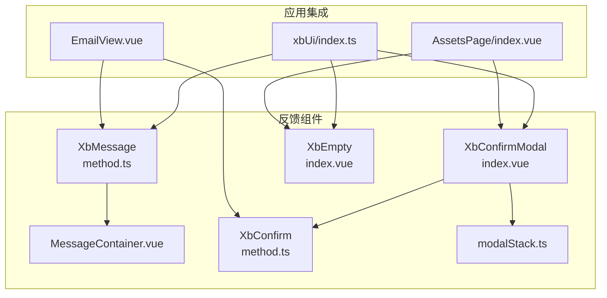
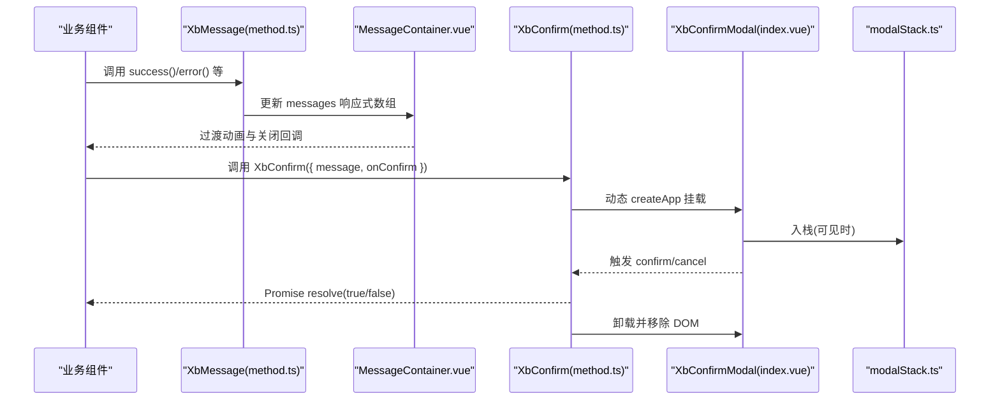
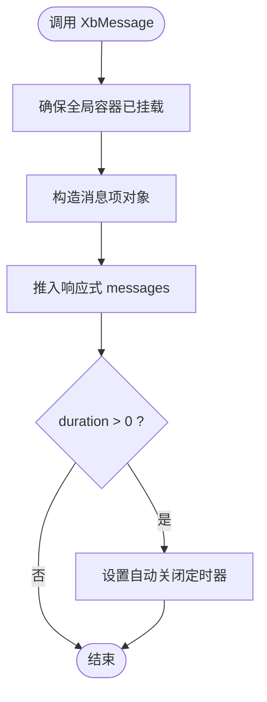
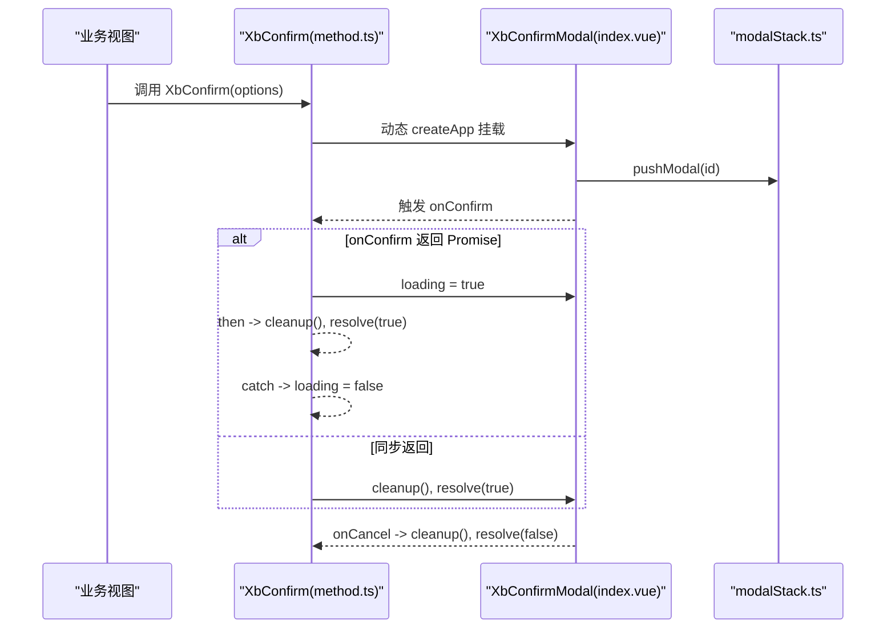
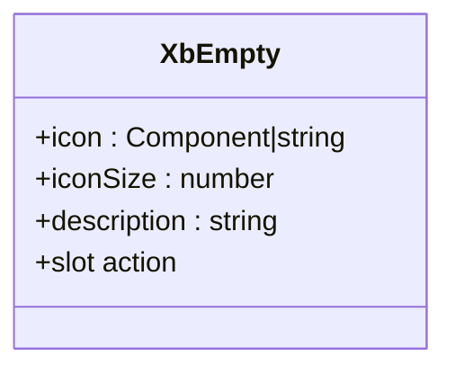
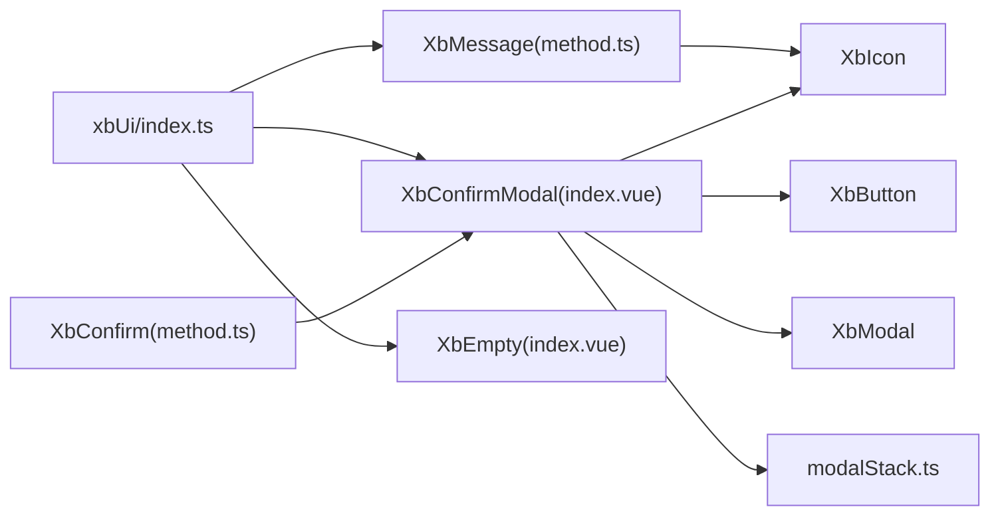

# 反馈组件

<cite>
**本文引用的文件列表**
- [frontend/src/xbUi/XbMessage/method.ts](file://frontend/src/xbUi/XbMessage/method.ts)
- [frontend/src/xbUi/XbMessage/MessageContainer.vue](file://frontend/src/xbUi/XbMessage/MessageContainer.vue)
- [frontend/src/xbUi/XbConfirmModal/index.vue](file://frontend/src/xbUi/XbConfirmModal/index.vue)
- [frontend/src/xbUi/XbConfirmModal/method.ts](file://frontend/src/xbUi/XbConfirmModal/method.ts)
- [frontend/src/xbUi/XbEmpty/index.vue](file://frontend/src/xbUi/XbEmpty/index.vue)
- [frontend/src/xbUi/modalStack.ts](file://frontend/src/xbUi/modalStack.ts)
- [frontend/src/xbUi/index.ts](file://frontend/src/xbUi/index.ts)
- [frontend/src/layouts/components/TopBar/LoginModal/EmailView.vue](file://frontend/src/layouts/components/TopBar/LoginModal/EmailView.vue)
- [frontend/src/views/AssetsPage/index.vue](file://frontend/src/views/AssetsPage/index.vue)
</cite>

## 目录
1. [简介](#简介)
2. [项目结构](#项目结构)
3. [核心组件](#核心组件)
4. [架构总览](#架构总览)
5. [详细组件分析](#详细组件分析)
6. [依赖关系分析](#依赖关系分析)
7. [性能与可访问性](#性能与可访问性)
8. [使用规范与最佳实践](#使用规范与最佳实践)
9. [常见问题排查](#常见问题排查)
10. [结论](#结论)

## 简介
本文件聚焦于前端 UI 库中的三类反馈组件：XbMessage 消息提示、XbConfirmModal 确认对话框、XbEmpty 空状态。文档从设计模式、实现细节、交互流程、动画配置、错误处理、国际化支持、可访问性与性能等维度进行系统化说明，并提供实际使用示例路径与优化建议，帮助开发者在业务中高效、一致地构建用户反馈体验。

## 项目结构
反馈组件位于 xbUi 包内，采用“命令式 API + 渲染容器”的解耦模式：
- XbMessage：通过 method.ts 暴露命令式 API，内部动态挂载 MessageContainer.vue 作为全局容器，集中管理消息队列与动画。
- XbConfirmModal：提供声明式组件与命令式方法（XbConfirm），后者基于 createApp 动态挂载并返回 Promise，支持异步 onConfirm 自动 loading。
- XbEmpty：纯展示型组件，用于无数据场景，支持自定义图标与插槽扩展。
- modalStack.ts：维护弹窗栈，确保键盘事件仅作用于最顶层弹窗。
- index.ts：统一导出组件与类型，便于按需引入或插件安装。

图表来源
- [frontend/src/xbUi/XbMessage/method.ts:1-116](file://frontend/src/xbUi/XbMessage/method.ts#L1-L116)
- [frontend/src/xbUi/XbMessage/MessageContainer.vue:1-618](file://frontend/src/xbUi/XbMessage/MessageContainer.vue#L1-L618)
- [frontend/src/xbUi/XbConfirmModal/index.vue:1-101](file://frontend/src/xbUi/XbConfirmModal/index.vue#L1-L101)
- [frontend/src/xbUi/XbConfirmModal/method.ts:1-150](file://frontend/src/xbUi/XbConfirmModal/method.ts#L1-L150)
- [frontend/src/xbUi/XbEmpty/index.vue:1-32](file://frontend/src/xbUi/XbEmpty/index.vue#L1-L32)
- [frontend/src/xbUi/modalStack.ts:1-29](file://frontend/src/xbUi/modalStack.ts#L1-L29)
- [frontend/src/xbUi/index.ts:1-100](file://frontend/src/xbUi/index.ts#L1-L100)
- [frontend/src/layouts/components/TopBar/LoginModal/EmailView.vue:75-85](file://frontend/src/layouts/components/TopBar/LoginModal/EmailView.vue#L75-L85)
- [frontend/src/views/AssetsPage/index.vue:390-473](file://frontend/src/views/AssetsPage/index.vue#L390-L473)

章节来源
- [frontend/src/xbUi/index.ts:1-100](file://frontend/src/xbUi/index.ts#L1-L100)

## 核心组件
- XbMessage
  - 能力：成功/警告/错误/信息四类消息；支持标题、内容、关闭按钮、图标开关、入场动画、出现位置、自动关闭时长；支持编程式调用与便捷方法（success/warning/error/info/close/closeAll）。
  - 数据结构：消息项包含 id、type、title、message、closable、showIcon、animation、position。
  - 渲染：按位置分组渲染，底部位置反向排列，Transition 驱动动画。
- XbConfirmModal
  - 能力：标题、消息、确认/取消文案、确认按钮类型、宽度、是否显示按钮、动画、遮罩关闭、Enter 提交控制；支持 loading 态；支持 slot 自定义内容。
  - 命令式：XbConfirm 返回 Promise，onConfirm 若返回 Promise 则自动进入 loading，完成后清理 DOM 并 resolve。
- XbEmpty
  - 能力：默认图标、自定义图标（字符串或 Vue 组件）、描述文本、action 插槽扩展操作。
- modalStack
  - 能力：维护弹窗 ID 栈，提供 push/remove/isTopModal 方法，保证键盘事件作用域正确。

章节来源
- [frontend/src/xbUi/XbMessage/method.ts:1-116](file://frontend/src/xbUi/XbMessage/method.ts#L1-L116)
- [frontend/src/xbUi/XbMessage/MessageContainer.vue:1-618](file://frontend/src/xbUi/XbMessage/MessageContainer.vue#L1-L618)
- [frontend/src/xbUi/XbConfirmModal/index.vue:1-101](file://frontend/src/xbUi/XbConfirmModal/index.vue#L1-L101)
- [frontend/src/xbUi/XbConfirmModal/method.ts:1-150](file://frontend/src/xbUi/XbConfirmModal/method.ts#L1-L150)
- [frontend/src/xbUi/XbEmpty/index.vue:1-32](file://frontend/src/xbUi/XbEmpty/index.vue#L1-L32)
- [frontend/src/xbUi/modalStack.ts:1-29](file://frontend/src/xbUi/modalStack.ts#L1-L29)

## 架构总览
反馈组件整体遵循“命令式入口 + 轻量渲染容器”的模式：
- 命令式 API 负责创建/销毁实例、管理生命周期与状态。
- 渲染容器负责布局、样式与动画，保持与业务逻辑解耦。
- 全局栈管理确保多弹窗时的焦点与键盘行为正确。

图表来源
- [frontend/src/xbUi/XbMessage/method.ts:1-116](file://frontend/src/xbUi/XbMessage/method.ts#L1-L116)
- [frontend/src/xbUi/XbMessage/MessageContainer.vue:1-618](file://frontend/src/xbUi/XbMessage/MessageContainer.vue#L1-L618)
- [frontend/src/xbUi/XbConfirmModal/method.ts:1-150](file://frontend/src/xbUi/XbConfirmModal/method.ts#L1-L150)
- [frontend/src/xbUi/XbConfirmModal/index.vue:1-101](file://frontend/src/xbUi/XbConfirmModal/index.vue#L1-L101)
- [frontend/src/xbUi/modalStack.ts:1-29](file://frontend/src/xbUi/modalStack.ts#L1-L29)

## 详细组件分析

### XbMessage 消息提示
- 设计模式
  - 命令式 API：对外暴露 XbMessage 及其便捷方法，内部维护响应式消息队列。
  - 全局挂载：首次调用时动态创建根节点并挂载到 body，避免侵入业务模板。
  - 分组渲染：按 position 分组，底部位置反向排列，提升可读性。
- 关键实现要点
  - 消息项字段：id、type、title、message、closable、showIcon、animation、position。
  - 动画系统：内置 slide-down/slide-up/slide-left/slide-right/fade/scale/bounce/flip/zoom/swing/elastic/rotate/blur/backdrop 等多类动画，通过 Transition name 绑定。
  - 自动关闭：duration > 0 时设置定时器自动移除。
  - 关闭策略：支持单条关闭与全部关闭。
- 使用示例路径
  - 登录成功后提示：[frontend/src/layouts/components/TopBar/LoginModal/EmailView.vue:75-85](file://frontend/src/layouts/components/TopBar/LoginModal/EmailView.vue#L75-L85)
- 可访问性
  - 关闭按钮具备 focus-visible 样式，利于键盘导航。
  - 建议为消息容器添加 aria-live 区域以辅助读屏器播报（可在容器层扩展）。
- 国际化支持
  - 当前默认标题为中文“温馨提示”，建议在业务层传入 title 或使用 i18n 函数生成，避免硬编码。
- 动画配置
  - 通过 animation 属性选择动画类型；position 决定出现位置。
- 错误处理
  - 自动关闭基于 duration，若设为 0 需手动 close/closeAll。
  - 建议对频繁触发的错误消息做节流或合并策略，避免刷屏。

图表来源
- [frontend/src/xbUi/XbMessage/method.ts:1-116](file://frontend/src/xbUi/XbMessage/method.ts#L1-L116)
- [frontend/src/xbUi/XbMessage/MessageContainer.vue:1-618](file://frontend/src/xbUi/XbMessage/MessageContainer.vue#L1-L618)

章节来源
- [frontend/src/xbUi/XbMessage/method.ts:1-116](file://frontend/src/xbUi/XbMessage/method.ts#L1-L116)
- [frontend/src/xbUi/XbMessage/MessageContainer.vue:1-618](file://frontend/src/xbUi/XbMessage/MessageContainer.vue#L1-L618)
- [frontend/src/layouts/components/TopBar/LoginModal/EmailView.vue:75-85](file://frontend/src/layouts/components/TopBar/LoginModal/EmailView.vue#L75-L85)

### XbConfirmModal 确认对话框
- 设计模式
  - 声明式组件：通过 v-model:visible 控制显隐，支持 slot 自定义内容，footer 固定按钮区。
  - 命令式方法：XbConfirm 返回 Promise，支持 onConfirm 返回 Promise 自动 loading，并在完成或失败后清理 DOM。
- 关键实现要点
  - 生命周期：createApp 动态挂载，nextTick 后设置 visible=true，关闭时等待过渡动画结束后 unmount 并移除 DOM。
  - 交互：支持 Enter 提交（受 showConfirm 与 loading 控制），点击遮罩关闭（closeOnOverlay）。
  - 弹窗栈：pushModal/removeModal/isTopModal 配合键盘事件，确保只响应最顶层弹窗。
- 使用示例路径
  - 表单校验提示与错误提示：[frontend/src/layouts/components/TopBar/LoginModal/EmailView.vue:75-85](file://frontend/src/layouts/components/TopBar/LoginModal/EmailView.vue#L75-L85)
  - 重命名与批量删除确认：[frontend/src/views/AssetsPage/index.vue:390-473](file://frontend/src/views/AssetsPage/index.vue#L390-L473)
- 可访问性
  - 建议为弹窗容器设置 role="dialog" 与 aria-modal="true"，并将焦点初始聚焦到确认按钮或标题。
  - 关闭时应将焦点归还至触发元素（可在上层封装中实现）。
- 国际化支持
  - 所有文案（title、message、confirmText、cancelText）均通过 props 传入，建议在业务层使用 i18n 函数生成。
- 动画配置
  - 支持 fade/scale/slide-up/slide-down/slide-left/slide-right/zoom/bounce/flip/rotate/blur/elastic/wobble/tada/jello/roll-in/drop 等多种动画。
- 错误处理
  - onConfirm 抛出异常时，loading 会重置为 false，但不会自动关闭弹窗；建议在 catch 分支中给出错误提示（如 XbMessage.error）。

图表来源
- [frontend/src/xbUi/XbConfirmModal/method.ts:1-150](file://frontend/src/xbUi/XbConfirmModal/method.ts#L1-L150)
- [frontend/src/xbUi/XbConfirmModal/index.vue:1-101](file://frontend/src/xbUi/XbConfirmModal/index.vue#L1-L101)
- [frontend/src/xbUi/modalStack.ts:1-29](file://frontend/src/xbUi/modalStack.ts#L1-L29)

章节来源
- [frontend/src/xbUi/XbConfirmModal/method.ts:1-150](file://frontend/src/xbUi/XbConfirmModal/method.ts#L1-L150)
- [frontend/src/xbUi/XbConfirmModal/index.vue:1-101](file://frontend/src/xbUi/XbConfirmModal/index.vue#L1-L101)
- [frontend/src/xbUi/modalStack.ts:1-29](file://frontend/src/xbUi/modalStack.ts#L1-L29)
- [frontend/src/views/AssetsPage/index.vue:390-473](file://frontend/src/views/AssetsPage/index.vue#L390-L473)

### XbEmpty 空状态
- 设计模式
  - 纯展示组件：props 控制图标与描述，slot 扩展 action 操作。
- 关键实现要点
  - icon 支持字符串（走 XbIcon）或 Vue 组件（动态渲染），iconSize 控制尺寸。
  - 默认图标为 inbox，可通过 props 覆盖。
- 使用示例路径
  - 资产列表为空时展示：[frontend/src/views/AssetsPage/index.vue:390-473](file://frontend/src/views/AssetsPage/index.vue#L390-L473)
- 可访问性
  - 建议为容器添加 aria-label 或 role="status"，以便读屏器传达“暂无数据”的状态。
- 国际化支持
  - description 由业务传入，建议使用 i18n 函数生成。
- 动画配置
  - 当前未内置动画，可在外层包裹 Transition 或在 slot 中扩展动效。

图表来源
- [frontend/src/xbUi/XbEmpty/index.vue:1-32](file://frontend/src/xbUi/XbEmpty/index.vue#L1-L32)

章节来源
- [frontend/src/xbUi/XbEmpty/index.vue:1-32](file://frontend/src/xbUi/XbEmpty/index.vue#L1-L32)
- [frontend/src/views/AssetsPage/index.vue:390-473](file://frontend/src/views/AssetsPage/index.vue#L390-L473)

## 依赖关系分析
- 组件导出
  - xbUi/index.ts 统一导出各组件与命令式 API，支持插件安装与按需引入。
- 组件间依赖
  - XbMessage 依赖 XbIcon 渲染类型图标。
  - XbConfirmModal 依赖 XbButton、XbModal 与 XbIcon。
  - XbConfirm 命令式方法依赖 createApp/h/nextTick 动态挂载。
  - modalStack 被弹窗相关逻辑使用，确保键盘事件作用域。

图表来源
- [frontend/src/xbUi/index.ts:1-100](file://frontend/src/xbUi/index.ts#L1-L100)
- [frontend/src/xbUi/XbMessage/method.ts:1-116](file://frontend/src/xbUi/XbMessage/method.ts#L1-L116)
- [frontend/src/xbUi/XbConfirmModal/index.vue:1-101](file://frontend/src/xbUi/XbConfirmModal/index.vue#L1-L101)
- [frontend/src/xbUi/XbConfirmModal/method.ts:1-150](file://frontend/src/xbUi/XbConfirmModal/method.ts#L1-L150)
- [frontend/src/xbUi/XbEmpty/index.vue:1-32](file://frontend/src/xbUi/XbEmpty/index.vue#L1-L32)
- [frontend/src/xbUi/modalStack.ts:1-29](file://frontend/src/xbUi/modalStack.ts#L1-L29)

章节来源
- [frontend/src/xbUi/index.ts:1-100](file://frontend/src/xbUi/index.ts#L1-L100)

## 性能与可访问性
- 性能
  - XbMessage 使用响应式数组与分组渲染，避免重复计算；动画使用 CSS transition/keyframes，GPU 友好。
  - XbConfirm 在关闭时延迟卸载，等待过渡动画结束，避免闪烁与布局抖动。
  - 建议对高频消息进行去抖/合并，减少 DOM 更新压力。
- 可访问性
  - 消息关闭按钮具备 focus-visible 样式；弹窗建议增加 role/aria-modal 与焦点管理。
  - 空状态建议添加 aria-label 或 role="status"，提升无障碍语义。
- 国际化
  - 所有用户可见文案应通过 props 或 i18n 注入，避免在组件内部硬编码。
  - 默认标题“温馨提示”应在业务层替换为本地化文案。

## 使用规范与最佳实践
- 消息提示
  - 成功/信息类使用短小精悍文案，必要时带标题；错误类建议附带原因与下一步指引。
  - 合理设置 duration，避免过长打扰或过短无法阅读。
  - 同一位置的消息数量过多时，考虑折叠或合并。
- 确认对话框
  - 明确区分“确认”与“取消”的语义，危险操作使用 confirmType="danger"。
  - 异步操作务必返回 Promise，利用自动 loading 提升感知。
  - 关闭后应将焦点归还触发元素，避免键盘流中断。
- 空状态
  - 提供明确的描述与行动点（如“用AI生成素材”），引导用户继续操作。
  - 图标与文案应与产品风格一致，必要时加入微动效增强反馈。
- 国际化
  - 所有文案通过 i18n 函数生成，避免硬编码。
  - 日期、数字、单位等格式也应本地化。
- 可访问性
  - 为重要反馈区域添加 aria-live，确保读屏器及时播报。
  - 键盘导航顺序符合视觉顺序，焦点清晰可见。

## 常见问题排查
- 消息不显示
  - 检查 ensureContainer 是否执行，确认 mountNode 已插入 body。
  - 检查 position 与动画名称是否正确。
- 消息不自动关闭
  - 确认 duration 设置为大于 0 的值。
- 确认弹窗不关闭
  - 检查 onConfirm 是否返回 Promise 且 resolve/reject 正常。
  - 检查 closeOnOverlay 与 submit-on-enter 配置是否符合预期。
- 空状态不显示
  - 检查条件渲染逻辑（loading、error、数据长度）是否正确。
- 键盘事件误触发
  - 确认弹窗栈 push/remove 时机正确，isTopModal 判断生效。

章节来源
- [frontend/src/xbUi/XbMessage/method.ts:1-116](file://frontend/src/xbUi/XbMessage/method.ts#L1-L116)
- [frontend/src/xbUi/XbConfirmModal/method.ts:1-150](file://frontend/src/xbUi/XbConfirmModal/method.ts#L1-L150)
- [frontend/src/xbUi/modalStack.ts:1-29](file://frontend/src/xbUi/modalStack.ts#L1-L29)

## 结论
XbMessage、XbConfirmModal、XbEmpty 构成了完整的用户反馈体系：即时通知、决策确认与空状态引导。通过命令式 API 与声明式组件的结合，既保证了易用性，又保持了良好的可维护性与可扩展性。结合动画、可访问性与国际化支持，能够在复杂业务场景中提供一致、流畅的用户体验。建议在实际项目中遵循本文的使用规范与最佳实践，持续优化反馈质量与性能表现。