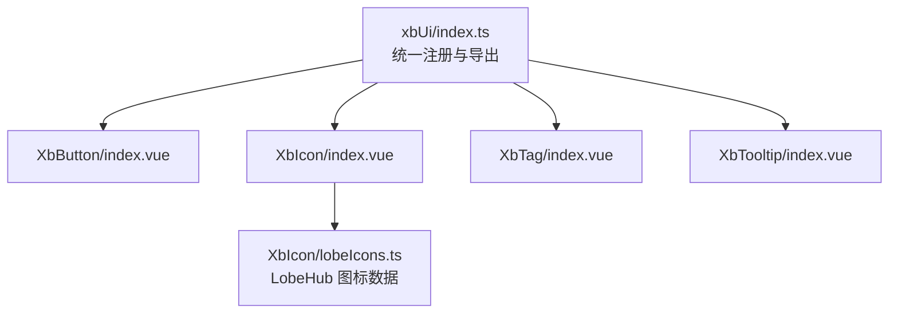
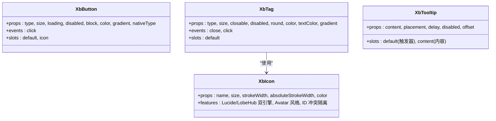
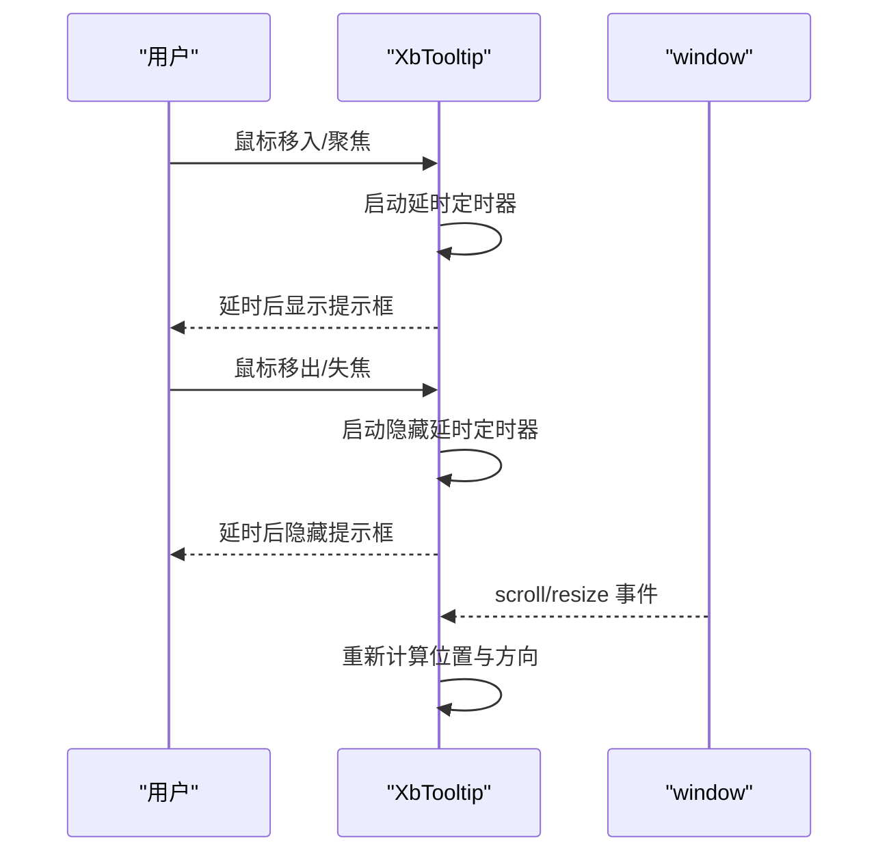
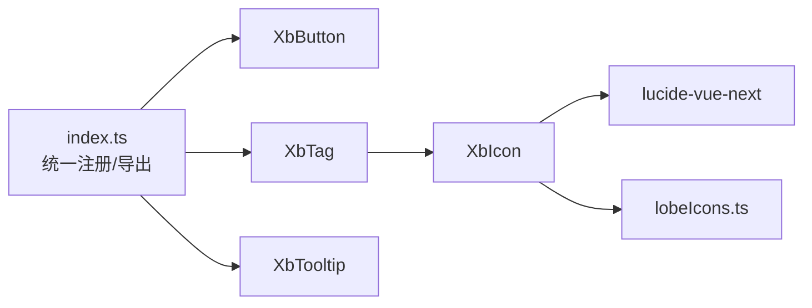

# 基础UI组件

<cite>
**本文引用的文件**
- [XbButton/index.vue](file://frontend/src/xbUi/XbButton/index.vue)
- [XbIcon/index.vue](file://frontend/src/xbUi/XbIcon/index.vue)
- [XbTag/index.vue](file://frontend/src/xbUi/XbTag/index.vue)
- [XbTooltip/index.vue](file://frontend/src/xbUi/XbTooltip/index.vue)
- [XbIcon/lobeIcons.ts](file://frontend/src/xbUi/XbIcon/lobeIcons.ts)
- [xbUi/index.ts](file://frontend/src/xbUi/index.ts)
</cite>

## 目录
1. [简介](#简介)
2. [项目结构](#项目结构)
3. [核心组件](#核心组件)
4. [架构总览](#架构总览)
5. [详细组件分析](#详细组件分析)
6. [依赖关系分析](#依赖关系分析)
7. [性能与可访问性建议](#性能与可访问性建议)
8. [故障排查指南](#故障排查指南)
9. [结论](#结论)
10. [附录：使用示例与组合模式](#附录使用示例与组合模式)

## 简介
本文件面向前端开发者，系统化梳理 xbUi 基础 UI 组件库中的四个核心组件：XbButton 按钮、XbIcon 图标、XbTag 标签、XbTooltip 提示框。文档覆盖设计模式、实现细节、Props 属性、事件处理、插槽用法、样式定制与主题支持方式，并提供组合使用模式与性能优化建议，帮助读者在项目中高效复用与扩展这些基础能力。

## 项目结构
xbUi 采用“按功能分目录”的组织方式，每个组件独立一个文件夹，包含 index.vue 主实现与必要的类型或数据文件。入口通过统一插件进行全局注册，同时提供按需导出。

图表来源
- [xbUi/index.ts:1-100](file://frontend/src/xbUi/index.ts#L1-L100)
- [XbButton/index.vue:1-110](file://frontend/src/xbUi/XbButton/index.vue#L1-L110)
- [XbIcon/index.vue:1-148](file://frontend/src/xbUi/XbIcon/index.vue#L1-L148)
- [XbTag/index.vue:1-103](file://frontend/src/xbUi/XbTag/index.vue#L1-L103)
- [XbTooltip/index.vue:1-207](file://frontend/src/xbUi/XbTooltip/index.vue#L1-L207)
- [XbIcon/lobeIcons.ts:1-34](file://frontend/src/xbUi/XbIcon/lobeIcons.ts#L1-L34)

章节来源
- [xbUi/index.ts:1-100](file://frontend/src/xbUi/index.ts#L1-L100)

## 核心组件
本节对四个基础组件进行概览式说明，后续章节将深入剖析其实现与最佳实践。

- XbButton：提供多种视觉类型、尺寸、加载态、禁用态、块级布局、自定义颜色与渐变背景；支持原生 button type 控制表单行为；透传点击事件。
- XbIcon：统一封装 Lucide 图标与 LobeHub 品牌图标（含彩色与 Mono 两种渲染路径），支持 Avatar 风格展示、尺寸与描边控制、ID 冲突隔离等。
- XbTag：提供多语义类型、尺寸、圆角、关闭按钮、自定义颜色与渐变；支持点击与关闭事件。
- XbTooltip：基于 Teleport 的轻量提示框，支持四向定位、自动防溢出、延迟显示、过渡动画与箭头指示。

章节来源
- [XbButton/index.vue:1-110](file://frontend/src/xbUi/XbButton/index.vue#L1-L110)
- [XbIcon/index.vue:1-148](file://frontend/src/xbUi/XbIcon/index.vue#L1-L148)
- [XbTag/index.vue:1-103](file://frontend/src/xbUi/XbTag/index.vue#L1-L103)
- [XbTooltip/index.vue:1-207](file://frontend/src/xbUi/XbTooltip/index.vue#L1-L207)

## 架构总览
组件间无强耦合，均通过 props/events/slots 暴露接口，遵循单向数据流与职责单一原则。XbIcon 作为通用原子能力被 XbTag 复用。XbTooltip 通过 Teleport 挂载到 body，避免父级 overflow 影响定位。

图表来源
- [XbButton/index.vue:1-110](file://frontend/src/xbUi/XbButton/index.vue#L1-L110)
- [XbIcon/index.vue:1-148](file://frontend/src/xbUi/XbIcon/index.vue#L1-L148)
- [XbTag/index.vue:1-103](file://frontend/src/xbUi/XbTag/index.vue#L1-L103)
- [XbTooltip/index.vue:1-207](file://frontend/src/xbUi/XbTooltip/index.vue#L1-L207)

## 详细组件分析

### XbButton 按钮
- 设计要点
  - 通过 computed 动态拼接类名，根据 type/size/customColor/gradient/block/loading/disabled 组合出最终样式。
  - 支持自定义主色与渐变，优先于内置 type 配色。
  - 默认阻止 loading/disabled 状态下的点击冒泡与交互。
- Props
  - type: primary | secondary | ghost | danger | outline
  - size: sm | md | lg
  - loading: boolean
  - disabled: boolean
  - block: boolean
  - color: string（CSS 颜色值）
  - gradient: boolean（需配合 color）
  - nativeType: button | submit | reset
- Events
  - click(event: MouseEvent)
- Slots
  - 默认插槽：按钮文本
  - icon 插槽：用于插入图标
- 样式与主题
  - 通过 CSS 变量 --xb-btn-color 注入自定义颜色，并计算阴影与 hover 效果。
  - 支持渐变背景类 xb-btn-gradient。
- 使用示例（示意）
  - 基本按钮、带图标、加载态、禁用态、块级、自定义颜色与渐变、表单提交型按钮。
- 参考路径
  - [XbButton/index.vue:1-110](file://frontend/src/xbUi/XbButton/index.vue#L1-L110)

章节来源
- [XbButton/index.vue:1-110](file://frontend/src/xbUi/XbButton/index.vue#L1-L110)

### XbIcon 图标
- 设计要点
  - 双引擎：Lucide 图标与 LobeHub 品牌图标。
  - LobeHub 彩色图标通过 v-html 渲染 SVG paths，并通过实例唯一后缀替换 defs 中 id 引用，避免同页面重复导致的 ID 冲突。
  - Mono 图标以 Avatar 风格呈现：圆形品牌背景 + 缩放后的单色图标。
  - 支持 kebab-case 名称自动转 PascalCase 以匹配 Lucide 组件名。
- Props
  - name: string（支持 lobe: 前缀或直接传入 LobeHub 图标名）
  - size: number（px）
  - strokeWidth: number（Lucide 线宽）
  - absoluteStrokeWidth: boolean（Lucide 绝对线宽）
  - color: string（Mono 图标颜色，覆盖 avatarColor）
- 内部逻辑
  - isLobeIcon / lobeIconName / lobeIconData 判断与解析 LobeHub 图标数据。
  - processedLobePaths 生成唯一 ID 的 SVG 片段。
  - avatarStyle/iconSizeStyle/lobeAvatarIconColor 控制 Avatar 外观。
- 数据源
  - lobeIcons.ts 提供大量品牌图标的 viewBox、paths、hasColor、avatarBg/avatarColor/avatarMultiple 等元信息。
- 使用示例（示意）
  - 使用 Lucide 图标、LobeHub 彩色图标、LobeHub Mono 图标（Avatar 风格）、自定义大小与描边。
- 参考路径
  - [XbIcon/index.vue:1-148](file://frontend/src/xbUi/XbIcon/index.vue#L1-L148)
  - [XbIcon/lobeIcons.ts:1-34](file://frontend/src/xbUi/XbIcon/lobeIcons.ts#L1-L34)

章节来源
- [XbIcon/index.vue:1-148](file://frontend/src/xbUi/XbIcon/index.vue#L1-L148)
- [XbIcon/lobeIcons.ts:1-34](file://frontend/src/xbUi/XbIcon/lobeIcons.ts#L1-L34)

### XbTag 标签
- 设计要点
  - 多语义类型（default/brand/success/warning/danger/info）与尺寸（sm/md/lg）。
  - 支持圆角、关闭按钮、禁用态、自定义背景与文字色、渐变背景。
  - 关闭按钮内嵌 XbIcon 的 x 图标，尺寸随 Tag 尺寸自适应。
- Props
  - type: default | brand | success | warning | danger | info
  - size: sm | md | lg
  - closable: boolean
  - disabled: boolean
  - round: boolean
  - color: string（背景色）
  - textColor: string（文字色，默认 white）
  - gradient: boolean（需配合 color）
- Events
  - close()
  - click(event: MouseEvent)
- Slots
  - 默认插槽：标签内容
- 样式与主题
  - 通过 CSS 变量 --xb-tag-color/--xb-tag-text 注入自定义颜色，支持渐变。
- 使用示例（示意）
  - 不同语义类型、可关闭标签、禁用态、自定义颜色与渐变、圆角标签。
- 参考路径
  - [XbTag/index.vue:1-103](file://frontend/src/xbUi/XbTag/index.vue#L1-L103)

章节来源
- [XbTag/index.vue:1-103](file://frontend/src/xbUi/XbTag/index.vue#L1-L103)

### XbTooltip 提示框
- 设计要点
  - 基于 Teleport 将提示框挂载至 body，避免父容器 overflow 影响定位。
  - 支持 top/bottom/left/right 四种方向，自动检测视口边界并回退到合适方向。
  - 支持延迟显示与隐藏、鼠标悬停与焦点可见性、滚动与窗口 resize 时重新计算位置。
  - 提供箭头指示与进入/离开过渡动画。
- Props
  - content: string
  - placement: top | bottom | left | right
  - delay: number（毫秒）
  - disabled: boolean
  - offset: number（触发器与提示框间距）
- Slots
  - 默认插槽：触发器元素
  - content 插槽：提示内容（优先级高于 content prop）
- 交互流程

图表来源
- [XbTooltip/index.vue:1-207](file://frontend/src/xbUi/XbTooltip/index.vue#L1-L207)

章节来源
- [XbTooltip/index.vue:1-207](file://frontend/src/xbUi/XbTooltip/index.vue#L1-L207)

## 依赖关系分析
- 组件注册与导出
  - 统一入口集中导入各组件，注册为全局组件，并单独导出供按需引入。
- 组件间依赖
  - XbTag 依赖 XbIcon 用于关闭按钮图标。
  - XbIcon 依赖 lucide-vue-next 与本地 lobeIcons.ts 数据。
- 外部依赖
  - Tailwind 工具类用于快速构建样式。
  - Vue 3 Composition API（ref/computed/watch/onMounted/onBeforeUnmount/Teleport/Transition）。

图表来源
- [xbUi/index.ts:1-100](file://frontend/src/xbUi/index.ts#L1-L100)
- [XbTag/index.vue:1-103](file://frontend/src/xbUi/XbTag/index.vue#L1-L103)
- [XbIcon/index.vue:1-148](file://frontend/src/xbUi/XbIcon/index.vue#L1-L148)
- [XbIcon/lobeIcons.ts:1-34](file://frontend/src/xbUi/XbIcon/lobeIcons.ts#L1-L34)

章节来源
- [xbUi/index.ts:1-100](file://frontend/src/xbUi/index.ts#L1-L100)

## 性能与可访问性建议
- 渲染与定位
  - Tooltip 使用 Teleport 减少 DOM 层级嵌套带来的重排开销；在滚动/resize 时仅更新必要节点。
  - Icon 的彩色 SVG 通过唯一 ID 替换避免多次渲染时的 defs 冲突，提升稳定性。
- 交互与事件
  - Button 在 loading/disabled 时直接拦截点击，避免无效事件传播。
  - Tag 关闭按钮阻止冒泡，防止误触外层点击。
- 可访问性
  - Tooltip 支持 focus/blur 触发，便于键盘导航；建议为触发器设置 aria-describedby 指向提示内容。
  - Button 的 nativeType 默认 button，避免意外提交表单。
- 样式与主题
  - 通过 CSS 变量注入主题色，便于全局主题切换与深色模式适配。
  - 合理使用 transition-all 与 transform 提升动效流畅度。

[本节为通用建议，不直接分析具体文件]

## 故障排查指南
- Tooltip 定位异常
  - 检查触发器是否为绝对定位且尺寸为 0，组件已尝试取第一个子元素进行定位；若仍异常，请确保触发器有可视尺寸。
  - 确认父容器未设置 overflow 导致裁剪；Tooltip 已 Teleport 到 body，但仍需保证视口空间足够。
- Icon 彩色图标重叠或丢失
  - 同一页面多个相同彩色图标会因 defs id 冲突导致渲染异常；组件已通过实例唯一后缀解决，如仍出现，请检查是否直接使用了原始 SVG 而非组件。
- Button 点击无效
  - 确认未处于 loading/disabled 状态；如需禁用点击但保持外观，请使用 disabled。
- Tag 关闭事件未触发
  - 确认 closable 为 true；关闭按钮会阻止事件冒泡，外层监听 click 不会触发。

章节来源
- [XbTooltip/index.vue:1-207](file://frontend/src/xbUi/XbTooltip/index.vue#L1-L207)
- [XbIcon/index.vue:1-148](file://frontend/src/xbUi/XbIcon/index.vue#L1-L148)
- [XbButton/index.vue:1-110](file://frontend/src/xbUi/XbButton/index.vue#L1-L110)
- [XbTag/index.vue:1-103](file://frontend/src/xbUi/XbTag/index.vue#L1-L103)

## 结论
这四个基础组件覆盖了常见的交互与表达需求，具备清晰的 Props/Events/Slots 契约与良好的可扩展性。通过 CSS 变量与 Tailwind 工具类，实现了灵活的主题与样式定制；通过 Teleport 与唯一 ID 策略，提升了复杂场景下的稳定性与性能。建议在业务中优先复用这些原子能力，并在需要时通过插槽与样式变量进行二次定制。

[本节为总结性内容，不直接分析具体文件]

## 附录：使用示例与组合模式
- 按钮与图标组合
  - 在按钮的 icon 插槽中放入 XbIcon，形成“图标+文案”的标准操作按钮。
- 标签与提示组合
  - 将 XbTag 置于 XbTooltip 的默认插槽中，为标签提供上下文说明。
- 主题定制
  - 通过 color/gradient 为 Button/Tag 注入品牌色；在 Tooltip 中使用 content 插槽渲染富文本或链接。
- 表单集成
  - 使用 nativeType="submit" 的 Button 作为表单提交按钮，结合 Loading 态反馈异步请求。

[本节为概念性示例，不直接分析具体文件]