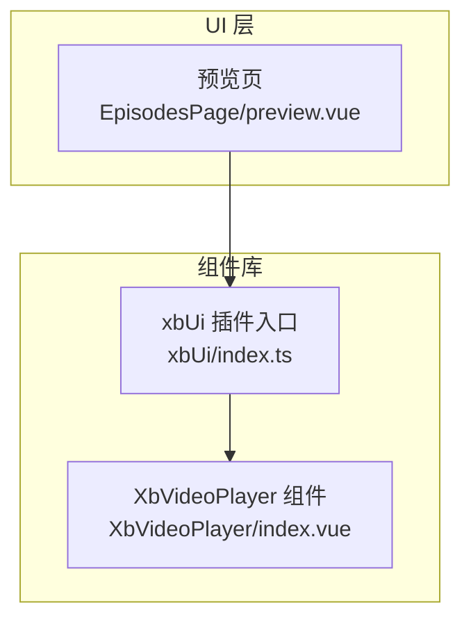
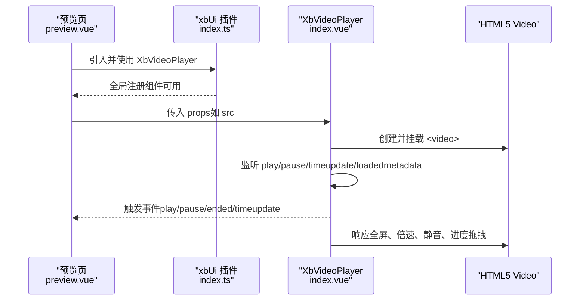
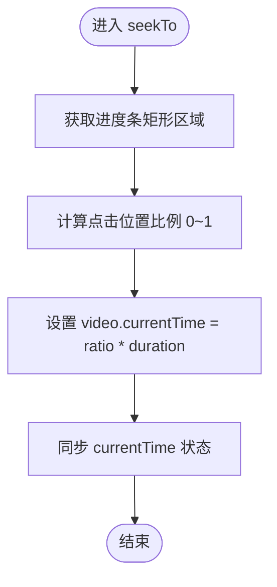
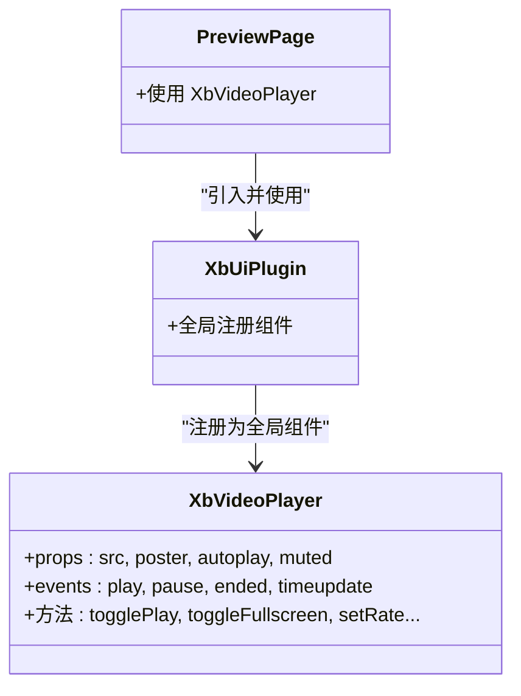

# 媒体组件

<cite>
**本文引用的文件**   
- [XbVideoPlayer/index.vue](file://frontend/src/xbUi/XbVideoPlayer/index.vue)
- [xbUi/index.ts](file://frontend/src/xbUi/index.ts)
- [EpisodesPage/preview.vue](file://frontend/src/views/EpisodesPage/preview.vue)
</cite>

## 目录
1. [简介](#简介)
2. [项目结构](#项目结构)
3. [核心组件](#核心组件)
4. [架构总览](#架构总览)
5. [详细组件分析](#详细组件分析)
6. [依赖关系分析](#依赖关系分析)
7. [性能与兼容性](#性能与兼容性)
8. [移动端适配方案](#移动端适配方案)
9. [扩展与自定义控制器指南](#扩展与自定义控制器指南)
10. [故障排查](#故障排查)
11. [结论](#结论)

## 简介
本章节聚焦于前端 UI 库中的媒体播放能力，重点围绕 XbVideoPlayer 视频播放器组件的设计模式、实现细节与使用方式。该组件基于原生 HTML5 Video 封装，提供播放控制、进度管理、全屏切换、倍速播放、静音控制等常用功能，并通过事件向父组件暴露关键状态变化，便于上层业务集成。

## 项目结构
XbVideoPlayer 作为 xbUi 组件库的一部分，通过统一插件机制注册为全局组件，并在页面中直接使用。

图表来源
- [xbUi/index.ts:25-51](file://frontend/src/xbUi/index.ts#L25-L51)
- [EpisodesPage/preview.vue:31-33](file://frontend/src/views/EpisodesPage/preview.vue#L31-L33)

章节来源
- [xbUi/index.ts:1-100](file://frontend/src/xbUi/index.ts#L1-L100)
- [EpisodesPage/preview.vue:1-52](file://frontend/src/views/EpisodesPage/preview.vue#L1-L52)

## 核心组件
- 组件名称：XbVideoPlayer
- 技术栈：Vue 3 + TypeScript + 原生 HTML5 Video
- 主要职责：
  - 渲染 video 元素并管理其生命周期
  - 提供播放/暂停、进度拖拽、音量/静音、倍速、全屏等交互
  - 自动隐藏控制栏以提升观看体验
  - 通过事件向外暴露播放状态与时间更新

章节来源
- [XbVideoPlayer/index.vue:1-207](file://frontend/src/xbUi/XbVideoPlayer/index.vue#L1-L207)

## 架构总览
从调用方到组件内部的数据与控制流如下：

图表来源
- [xbUi/index.ts:25-51](file://frontend/src/xbUi/index.ts#L25-L51)
- [XbVideoPlayer/index.vue:186-206](file://frontend/src/xbUi/XbVideoPlayer/index.vue#L186-L206)
- [XbVideoPlayer/index.vue:219-232](file://frontend/src/xbUi/XbVideoPlayer/index.vue#L219-L232)

## 详细组件分析

### 属性与事件契约
- 输入属性（Props）
  - src: 视频源地址
  - poster: 封面图
  - autoplay: 是否自动播放
  - muted: 是否默认静音
- 输出事件（Emits）
  - play: 开始播放
  - pause: 暂停播放
  - ended: 播放结束
  - timeupdate: 当前播放时间（秒）

章节来源
- [XbVideoPlayer/index.vue:3-21](file://frontend/src/xbUi/XbVideoPlayer/index.vue#L3-L21)

### 状态与计算
- 内部状态
  - isPlaying、currentTime、duration、volume、isMuted、isFullscreen、showControls、isDragging、playbackRate、isLoaded
- 计算属性
  - progress: 根据 currentTime/duration 计算的百分比

章节来源
- [XbVideoPlayer/index.vue:27-57](file://frontend/src/xbUi/XbVideoPlayer/index.vue#L27-L57)

### 播放控制流程
- 播放/暂停
  - 点击容器或中心大按钮触发 togglePlay
  - 同步更新 isPlaying 并派发 play/pause 事件
- 加载完成
  - loadedmetadata 时设置 duration 与 isLoaded
  - 若开启 autoplay，则尝试自动播放
- 播放结束
  - ended 时重置播放状态并派发 ended 事件

章节来源
- [XbVideoPlayer/index.vue:85-123](file://frontend/src/xbUi/XbVideoPlayer/index.vue#L85-L123)
- [XbVideoPlayer/index.vue:219-232](file://frontend/src/xbUi/XbVideoPlayer/index.vue#L219-L232)

### 进度条与拖拽
- 进度条由背景轨道、填充条与拖拽点组成
- 支持鼠标按下移动进行拖动跳转
- 在拖动期间屏蔽 timeupdate 的覆盖写入，避免冲突

图表来源
- [XbVideoPlayer/index.vue:59-68](file://frontend/src/xbUi/XbVideoPlayer/index.vue#L59-L68)
- [XbVideoPlayer/index.vue:70-82](file://frontend/src/xbUi/XbVideoPlayer/index.vue#L70-L82)

章节来源
- [XbVideoPlayer/index.vue:54-82](file://frontend/src/xbUi/XbVideoPlayer/index.vue#L54-L82)

### 音量与静音
- 提供静音切换按钮，直接修改 video.muted
- 图标随静音状态切换

章节来源
- [XbVideoPlayer/index.vue:126-129](file://frontend/src/xbUi/XbVideoPlayer/index.vue#L126-L129)

### 倍速播放
- 内置多档倍速选项
- 选择后更新 playbackRate 并应用到 video.playbackRate

章节来源
- [XbVideoPlayer/index.vue:131-140](file://frontend/src/xbUi/XbVideoPlayer/index.vue#L131-L140)

### 全屏切换
- 使用 Fullscreen API 对容器元素进行全屏切换
- 监听 document.fullscreenchange 同步 isFullscreen 状态

章节来源
- [XbVideoPlayer/index.vue:143-155](file://frontend/src/xbUi/XbVideoPlayer/index.vue#L143-L155)

### 控制栏自动隐藏
- 播放状态下，鼠标移动显示控制栏，3 秒无操作自动隐藏
- 离开容器时立即隐藏

章节来源
- [XbVideoPlayer/index.vue:157-174](file://frontend/src/xbUi/XbVideoPlayer/index.vue#L157-L174)

### 键盘快捷键
- 空格键可触发播放/暂停（排除输入框场景）

章节来源
- [XbVideoPlayer/index.vue:177-183](file://frontend/src/xbUi/XbVideoPlayer/index.vue#L177-L183)

### 生命周期与资源清理
- 挂载时注册全屏、鼠标、键盘事件监听
- 卸载时移除所有监听并清理定时器

章节来源
- [XbVideoPlayer/index.vue:186-199](file://frontend/src/xbUi/XbVideoPlayer/index.vue#L186-L199)

### 数据绑定与模板结构
- 将 props 映射至 video 元素属性
- 绑定各类事件回调以驱动状态更新
- 提供占位符与过渡动画提升用户体验

章节来源
- [XbVideoPlayer/index.vue:209-357](file://frontend/src/xbUi/XbVideoPlayer/index.vue#L209-L357)

### 样式与布局
- 容器采用 16:9 宽高比，全屏时自适应视口
- 控制栏渐变遮罩、进度条高亮、按钮悬停反馈
- 使用 Transition 实现淡入淡出与滑入滑出效果

章节来源
- [XbVideoPlayer/index.vue:360-616](file://frontend/src/xbUi/XbVideoPlayer/index.vue#L360-L616)

## 依赖关系分析
- 组件注册
  - xbUi 插件集中导入并全局注册 XbVideoPlayer
- 页面使用
  - 预览页通过标签方式使用 XbVideoPlayer，并可通过 props 注入视频源

图表来源
- [xbUi/index.ts:25-51](file://frontend/src/xbUi/index.ts#L25-L51)
- [EpisodesPage/preview.vue:31-33](file://frontend/src/views/EpisodesPage/preview.vue#L31-L33)

章节来源
- [xbUi/index.ts:1-100](file://frontend/src/xbUi/index.ts#L1-L100)
- [EpisodesPage/preview.vue:1-52](file://frontend/src/views/EpisodesPage/preview.vue#L1-L52)

## 性能与兼容性
- 预加载策略
  - 使用 preload="metadata" 仅加载元信息，减少首屏带宽占用
- 自动播放限制
  - 浏览器通常要求静音才能自动播放；组件提供 muted 属性配合 autoplay 使用
- 事件节流
  - timeupdate 仅在非拖拽状态下更新，避免频繁重绘
- 内存与事件清理
  - 组件卸载时移除全屏、鼠标、键盘事件监听，防止泄漏
- 兼容性与回退
  - 使用标准 Fullscreen API；在不支持的浏览器上应提供降级提示
  - 建议在上层提供多格式源（如 mp4/webm）以提升跨端兼容

章节来源
- [XbVideoPlayer/index.vue:219-232](file://frontend/src/xbUi/XbVideoPlayer/index.vue#L219-L232)
- [XbVideoPlayer/index.vue:110-115](file://frontend/src/xbUi/XbVideoPlayer/index.vue#L110-L115)
- [XbVideoPlayer/index.vue:186-199](file://frontend/src/xbUi/XbVideoPlayer/index.vue#L186-L199)

## 移动端适配方案
- 触摸交互
  - 进度条拖拽同时处理 mouse 与 touch 事件，确保移动端可拖动
- 手势与全屏
  - 全屏切换使用标准 API，移动端需考虑系统全屏行为差异
- 自动播放与静音
  - 移动端普遍要求静音自动播放，建议默认 muted=true 或在用户首次交互后再启用声音
- 控制栏可见性
  - 播放时自动隐藏控制栏，减少误触；触摸屏幕任意位置可恢复显示

章节来源
- [XbVideoPlayer/index.vue:59-68](file://frontend/src/xbUi/XbVideoPlayer/index.vue#L59-L68)
- [XbVideoPlayer/index.vue:157-174](file://frontend/src/xbUi/XbVideoPlayer/index.vue#L157-L174)

## 扩展与自定义控制器指南
- 通过事件扩展
  - 监听 timeupdate 可在外部实现字幕时间轴、广告插播、统计上报等逻辑
  - 监听 play/pause/ended 可实现播放列表联动、断点续播、埋点统计
- 通过 props 扩展
  - 在组件外层包裹一层自定义控制器，通过 ref 访问内部 video 实例（如需），再结合事件进行二次封装
- 自定义全屏与倍速
  - 可在父组件中监听 isFullscreen 与 playbackRate 的变化，实现更丰富的 UI 或业务逻辑
- 字幕支持
  - 当前组件未内置字幕渲染；可在父组件中根据 timeupdate 事件动态显示/隐藏字幕层
- 错误处理
  - 建议在父组件中监听 video 的错误事件（如 error），并提供重试或提示

章节来源
- [XbVideoPlayer/index.vue:16-21](file://frontend/src/xbUi/XbVideoPlayer/index.vue#L16-L21)
- [XbVideoPlayer/index.vue:110-115](file://frontend/src/xbUi/XbVideoPlayer/index.vue#L110-L115)

## 故障排查
- 无法自动播放
  - 检查是否设置了 muted；部分浏览器不允许非静音自动播放
- 全屏无效
  - 确认容器元素可进入全屏；某些 iframe 或受限环境可能禁止全屏
- 进度拖拽不生效
  - 检查是否在拖拽过程中被其他事件拦截；确认鼠标/触摸事件绑定正常
- 时间不同步
  - 确认未在拖拽时覆盖 timeupdate 的写入；必要时在父组件侧做去抖

章节来源
- [XbVideoPlayer/index.vue:110-115](file://frontend/src/xbUi/XbVideoPlayer/index.vue#L110-L115)
- [XbVideoPlayer/index.vue:143-155](file://frontend/src/xbUi/XbVideoPlayer/index.vue#L143-L155)
- [XbVideoPlayer/index.vue:59-82](file://frontend/src/xbUi/XbVideoPlayer/index.vue#L59-L82)

## 结论
XbVideoPlayer 以最小依赖实现了常用的视频播放能力，并通过清晰的事件契约与 props 设计，便于上层业务快速集成与扩展。结合合理的预加载、事件管理与移动端适配策略，可在多数现代浏览器与设备上获得稳定体验。对于字幕、错误处理、多源兼容等高级需求，可在父组件中基于现有事件与状态进行二次封装，形成更贴合业务的媒体解决方案。