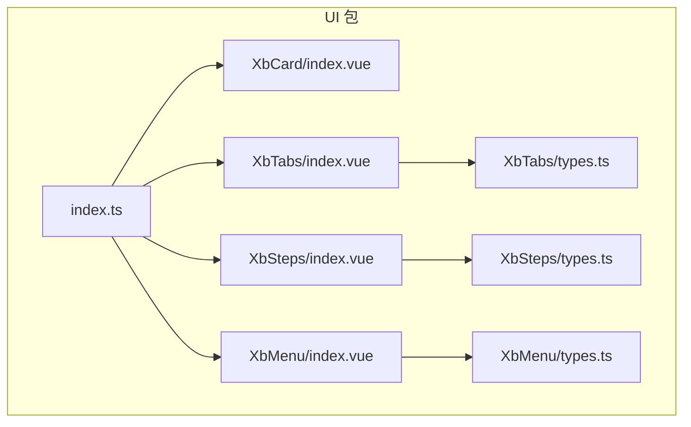
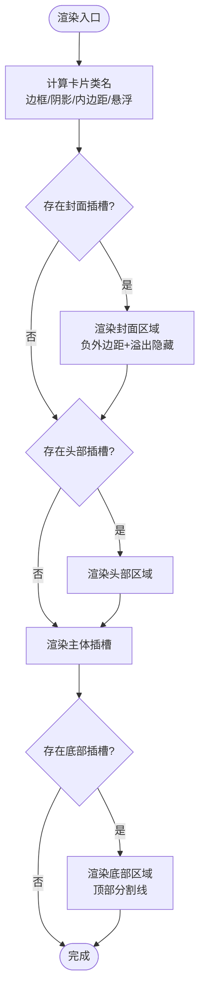
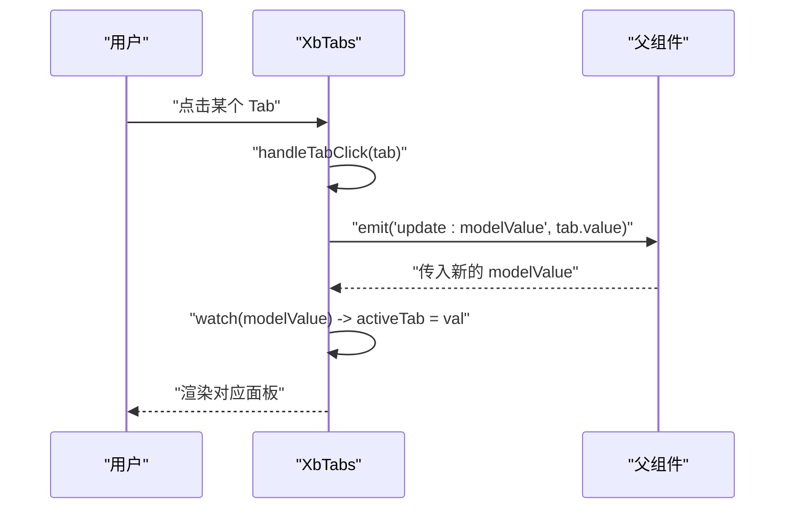
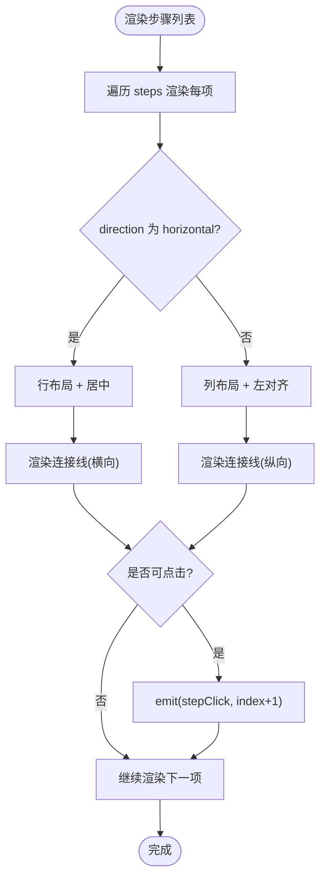
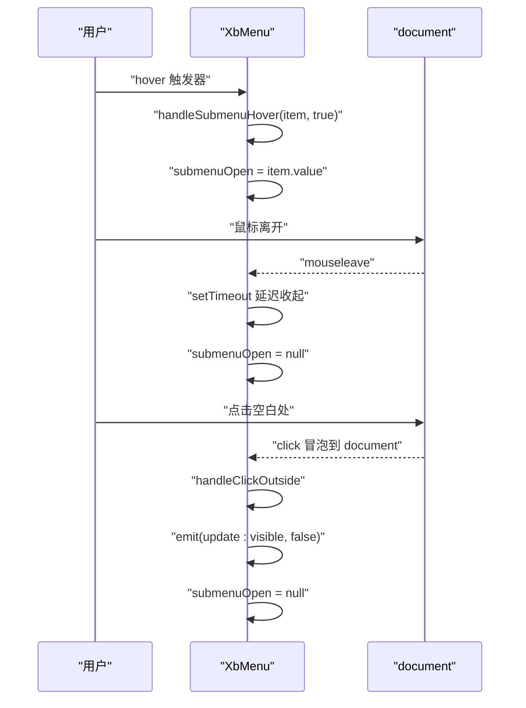
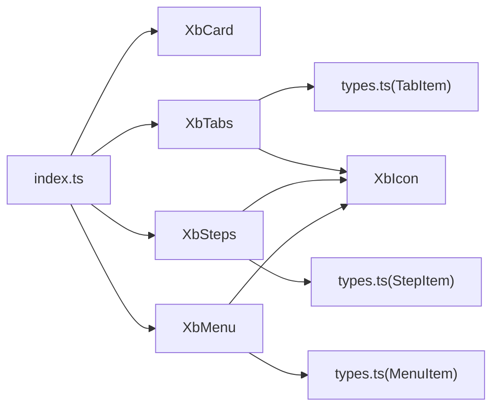

# 布局组件

<cite>
**本文引用的文件**   
- [XbCard/index.vue](file://frontend/src/xbUi/XbCard/index.vue)
- [XbTabs/index.vue](file://frontend/src/xbUi/XbTabs/index.vue)
- [XbTabs/types.ts](file://frontend/src/xbUi/XbTabs/types.ts)
- [XbSteps/index.vue](file://frontend/src/xbUi/XbSteps/index.vue)
- [XbSteps/types.ts](file://frontend/src/xbUi/XbSteps/types.ts)
- [XbMenu/index.vue](file://frontend/src/xbUi/XbMenu/index.vue)
- [XbMenu/types.ts](file://frontend/src/xbUi/XbMenu/types.ts)
- [index.ts](file://frontend/src/xbUi/index.ts)
</cite>

## 目录
1. [简介](#简介)
2. [项目结构](#项目结构)
3. [核心组件](#核心组件)
4. [架构总览](#架构总览)
5. [详细组件分析](#详细组件分析)
6. [依赖关系分析](#依赖关系分析)
7. [性能考量](#性能考量)
8. [故障排查指南](#故障排查指南)
9. [结论](#结论)
10. [附录](#附录)

## 简介
本章节聚焦于前端 UI 库中的布局类组件：XbCard（卡片）、XbTabs（标签页）、XbSteps（步骤条）、XbMenu（菜单）。文档从设计模式、实现细节、布局算法、响应式适配、交互逻辑与状态管理等方面展开，并提供复杂场景的组合示例、嵌套处理策略与性能优化建议，帮助读者高效构建可维护、可扩展的页面布局。

## 项目结构
这些布局组件位于统一的前端 UI 包中，采用“按功能分目录”的组织方式，每个组件包含自身实现与类型定义，并通过统一的入口进行全局注册与按需导出。



图示来源
- [index.ts:1-100](file://frontend/src/xbUi/index.ts#L1-L100)
- [XbCard/index.vue:1-48](file://frontend/src/xbUi/XbCard/index.vue#L1-L48)
- [XbTabs/index.vue:1-83](file://frontend/src/xbUi/XbTabs/index.vue#L1-L83)
- [XbTabs/types.ts:1-7](file://frontend/src/xbUi/XbTabs/types.ts#L1-L7)
- [XbSteps/index.vue:1-90](file://frontend/src/xbUi/XbSteps/index.vue#L1-L90)
- [XbSteps/types.ts:1-6](file://frontend/src/xbUi/XbSteps/types.ts#L1-L6)
- [XbMenu/index.vue:1-170](file://frontend/src/xbUi/XbMenu/index.vue#L1-L170)
- [XbMenu/types.ts:1-10](file://frontend/src/xbUi/XbMenu/types.ts#L1-L10)

章节来源
- [index.ts:1-100](file://frontend/src/xbUi/index.ts#L1-L100)

## 核心组件
本节对四个布局组件的职责、属性、事件与内部状态进行概览，并指出其布局与交互的关键点。

- XbCard（卡片）
  - 职责：提供带可选边框、内边距、阴影与悬浮效果的容器，支持封面、头部、主体、底部插槽。
  - 关键属性：hoverable、bordered、padding、shadow。
  - 布局要点：通过计算类名组合 Tailwind 样式；封面区域使用负外边距以突破父级圆角，保持视觉一致性。
  - 交互：仅样式态变化（悬浮提升、边框高亮），无业务状态。

- XbTabs（标签页）
  - 职责：提供线型或卡片型两种变体的标签导航与内容面板切换。
  - 关键属性：modelValue、tabs、variant、size。
  - 状态管理：内部 activeTab 同步外部 modelValue；点击触发 update:modelValue。
  - 布局要点：根据 size 动态调整间距与字号；line 模式下激活项底部显示品牌色指示条。

- XbSteps（步骤条）
  - 职责：展示流程进度，支持水平/垂直方向与点击回退。
  - 关键属性：current、steps、direction、clickable。
  - 交互逻辑：仅允许点击已完成步骤或开启 clickable 时点击任意步骤；点击后发出 stepClick。
  - 布局要点：通过 direction 控制 flex 排列；连接线颜色随进度变化。

- XbMenu（菜单）
  - 职责：提供下拉菜单与子菜单，支持 click/hover 触发与多方位定位。
  - 关键属性：visible、items、trigger、placement。
  - 状态管理：submenuOpen 控制子菜单展开；watch visible 重置子菜单。
  - 交互逻辑：点击空白处关闭；hover 模式使用定时器延迟收起，避免抖动。
  - 布局要点：placementClasses 映射不同定位偏移；Transition 提供入场动画。

章节来源
- [XbCard/index.vue:1-48](file://frontend/src/xbUi/XbCard/index.vue#L1-L48)
- [XbTabs/index.vue:1-83](file://frontend/src/xbUi/XbTabs/index.vue#L1-L83)
- [XbTabs/types.ts:1-7](file://frontend/src/xbUi/XbTabs/types.ts#L1-L7)
- [XbSteps/index.vue:1-90](file://frontend/src/xbUi/XbSteps/index.vue#L1-L90)
- [XbSteps/types.ts:1-6](file://frontend/src/xbUi/XbSteps/types.ts#L1-L6)
- [XbMenu/index.vue:1-170](file://frontend/src/xbUi/XbMenu/index.vue#L1-L170)
- [XbMenu/types.ts:1-10](file://frontend/src/xbUi/XbMenu/types.ts#L1-L10)

## 架构总览
整体采用“轻量组件 + 类型约束 + 插件注册”的模式：
- 组件层：各布局组件独立实现，遵循 props/emits 契约。
- 类型层：为 Tabs、Steps、Menu 等提供 TS 类型定义，保证数据驱动的一致性。
- 注册层：统一入口将组件注册为全局组件，同时支持单独导出。

```mermaid
classDiagram
class XbCard {
+props hoverable
+props bordered
+props padding
+props shadow
+slots cover/header/body/footer
}
class XbTabs {
+props modelValue
+props tabs
+props variant
+props size
+emits update : modelValue
-ref activeTab
}
class XbSteps {
+props current
+props steps
+props direction
+props clickable
+emits stepClick
}
class XbMenu {
+props visible
+props items
+props trigger
+props placement
+emits update : visible
+emits select
-ref submenuOpen
-ref menuRef
}
XbTabs --> "TabItem[]" : "依赖类型"
XbSteps --> "StepItem[]" : "依赖类型"
XbMenu --> "MenuItem[]" : "依赖类型"
```

图示来源
- [XbCard/index.vue:1-48](file://frontend/src/xbUi/XbCard/index.vue#L1-L48)
- [XbTabs/index.vue:1-83](file://frontend/src/xbUi/XbTabs/index.vue#L1-L83)
- [XbTabs/types.ts:1-7](file://frontend/src/xbUi/XbTabs/types.ts#L1-L7)
- [XbSteps/index.vue:1-90](file://frontend/src/xbUi/XbSteps/index.vue#L1-L90)
- [XbSteps/types.ts:1-6](file://frontend/src/xbUi/XbSteps/types.ts#L1-L6)
- [XbMenu/index.vue:1-170](file://frontend/src/xbUi/XbMenu/index.vue#L1-L170)
- [XbMenu/types.ts:1-10](file://frontend/src/xbUi/XbMenu/types.ts#L1-L10)

## 详细组件分析

### XbCard 卡片组件
- 设计模式
  - 容器化插槽：cover/header/body/footer 四段式插槽，便于组合复杂内容。
  - 样式组合：computed 生成类名集合，集中管理边框、阴影、内边距与悬浮效果。
- 布局算法
  - 封面区域使用负外边距覆盖父容器圆角，确保图片铺满且圆角一致。
  - body 作为默认内容区，footer 顶部添加分割线与上内边距。
- 响应式适配
  - 基于 Tailwind 原子类，自动适配不同屏幕尺寸。
- 交互逻辑
  - 纯样式交互：hoverable 启用悬浮提升与边框高亮。
- 状态管理
  - 无业务状态，仅样式类名计算。



图示来源
- [XbCard/index.vue:15-21](file://frontend/src/xbUi/XbCard/index.vue#L15-L21)
- [XbCard/index.vue:24-38](file://frontend/src/xbUi/XbCard/index.vue#L24-L38)

章节来源
- [XbCard/index.vue:1-48](file://frontend/src/xbUi/XbCard/index.vue#L1-L48)

### XbTabs 标签页组件
- 设计模式
  - 受控模式：通过 modelValue 与 update:modelValue 实现双向绑定。
  - 变体与尺寸：variant 支持 line/card；size 控制间距与字号。
- 布局算法
  - nav 区域根据 variant 切换下划线或卡片背景容器。
  - 激活项在 line 模式下显示底部品牌色指示条。
- 响应式适配
  - 通过 size 映射不同间距与字号，适配不同密度需求。
- 交互逻辑
  - 点击 tab 时若未禁用则更新 activeTab 并向上抛出更新事件。
- 状态管理
  - 内部 ref activeTab 同步外部 modelValue；watch 监听外部变更。



图示来源
- [XbTabs/index.vue:24-28](file://frontend/src/xbUi/XbTabs/index.vue#L24-L28)
- [XbTabs/index.vue:18-22](file://frontend/src/xbUi/XbTabs/index.vue#L18-L22)
- [XbTabs/index.vue:40-82](file://frontend/src/xbUi/XbTabs/index.vue#L40-L82)

章节来源
- [XbTabs/index.vue:1-83](file://frontend/src/xbUi/XbTabs/index.vue#L1-L83)
- [XbTabs/types.ts:1-7](file://frontend/src/xbUi/XbTabs/types.ts#L1-L7)

### XbSteps 步骤条组件
- 设计模式
  - 数据驱动：steps 数组描述每一步的 label 与可选 icon。
  - 方向控制：direction 控制水平/垂直布局。
- 布局算法
  - 水平：flex-row 居中；垂直：flex-col 左对齐。
  - 连接线：根据当前步骤与索引判断颜色与方向。
- 响应式适配
  - 基于 Flex 与 Tailwind 原子类，自适应不同宽度与高度。
- 交互逻辑
  - 仅当 clickable 为真或步骤已完成后才可点击；点击后发出 stepClick。
- 状态管理
  - 无内部状态，完全由 current 驱动。



图示来源
- [XbSteps/index.vue:31-37](file://frontend/src/xbUi/XbSteps/index.vue#L31-L37)
- [XbSteps/index.vue:22-27](file://frontend/src/xbUi/XbSteps/index.vue#L22-L27)
- [XbSteps/index.vue:76-87](file://frontend/src/xbUi/XbSteps/index.vue#L76-L87)

章节来源
- [XbSteps/index.vue:1-90](file://frontend/src/xbUi/XbSteps/index.vue#L1-L90)
- [XbSteps/types.ts:1-6](file://frontend/src/xbUi/XbSteps/types.ts#L1-L6)

### XbMenu 菜单组件
- 设计模式
  - 受控可见性：visible 控制弹出层显隐，配合 update:visible 与父组件联动。
  - 子菜单状态：submenuOpen 记录当前展开的子菜单值。
- 布局算法
  - placementClasses 映射四种定位位置，结合绝对定位与偏移量。
  - 子菜单相对父项 left-full 定位，形成层级展开。
- 响应式适配
  - 最小宽度与过渡动画保障在不同屏幕下的可读性与流畅度。
- 交互逻辑
  - trigger=click：点击触发器切换 visible。
  - trigger=hover：mouseenter/mouseleave 控制 visible，并使用定时器延迟收起，避免误触抖动。
  - 点击空白处关闭菜单并重置子菜单。
- 状态管理
  - watch(visible) 重置子菜单；onMounted/onBeforeUnmount 注册/移除全局点击监听。



图示来源
- [XbMenu/index.vue:30-40](file://frontend/src/xbUi/XbMenu/index.vue#L30-L40)
- [XbMenu/index.vue:47-52](file://frontend/src/xbUi/XbMenu/index.vue#L47-L52)
- [XbMenu/index.vue:54-58](file://frontend/src/xbUi/XbMenu/index.vue#L54-L58)
- [XbMenu/index.vue:60-66](file://frontend/src/xbUi/XbMenu/index.vue#L60-L66)
- [XbMenu/index.vue:68-73](file://frontend/src/xbUi/XbMenu/index.vue#L68-L73)

章节来源
- [XbMenu/index.vue:1-170](file://frontend/src/xbUi/XbMenu/index.vue#L1-L170)
- [XbMenu/types.ts:1-10](file://frontend/src/xbUi/XbMenu/types.ts#L1-L10)

## 依赖关系分析
- 组件间耦合
  - 布局组件彼此解耦，均通过 props/emits 与父组件通信。
  - 类型定义与实现分离，降低耦合度，提高复用性。
- 外部依赖
  - 图标组件 XbIcon 被 Tabs/Steps/Menu 复用，用于展示图标。
  - 样式体系基于 Tailwind 原子类，统一主题与响应式行为。
- 注册与导出
  - 统一入口 index.ts 将组件注册为全局组件，同时支持单独导入。



图示来源
- [index.ts:1-100](file://frontend/src/xbUi/index.ts#L1-L100)
- [XbTabs/types.ts:1-7](file://frontend/src/xbUi/XbTabs/types.ts#L1-L7)
- [XbSteps/types.ts:1-6](file://frontend/src/xbUi/XbSteps/types.ts#L1-L6)
- [XbMenu/types.ts:1-10](file://frontend/src/xbUi/XbMenu/types.ts#L1-L10)

章节来源
- [index.ts:1-100](file://frontend/src/xbUi/index.ts#L1-L100)

## 性能考量
- 减少不必要的重渲染
  - Tabs 使用 computed 计算尺寸类名，避免每次渲染重复计算。
  - Steps 与 Menu 的状态均为简单引用类型，变更开销小。
- 事件监听优化
  - Menu 在挂载时注册全局点击监听，卸载时移除，避免内存泄漏。
  - hover 模式使用定时器延迟收起，降低频繁切换导致的抖动与重排。
- 样式与布局
  - 大量使用 Tailwind 原子类，减少自定义 CSS 体积与复杂度。
  - 卡片封面使用 object-fit 与固定宽高，避免图片加载时的布局抖动。
- 大型列表与嵌套
  - 对于大量 Tabs/Steps，建议在父组件中进行分页或虚拟滚动（概念性建议）。
  - 菜单项过多时可考虑懒加载子菜单或分组折叠。

[本节为通用性能建议，不直接分析具体文件]

## 故障排查指南
- Tabs 无法切换
  - 检查父组件是否正确监听 update:modelValue 并回写 modelValue。
  - 确认 tab.disabled 未阻止点击。
- Steps 不可点击
  - 确认 current 与 index 的关系：仅 completed 步骤可点击，或设置 clickable=true。
- Menu 无法关闭
  - 检查 visible 是否被父组件正确更新。
  - 确认 handleClickOutside 能捕获到点击事件（注意事件捕获阶段）。
- 子菜单抖动
  - hover 模式下适当调整定时器时长，避免快速移动导致闪烁。

章节来源
- [XbTabs/index.vue:24-28](file://frontend/src/xbUi/XbTabs/index.vue#L24-L28)
- [XbSteps/index.vue:22-27](file://frontend/src/xbUi/XbSteps/index.vue#L22-L27)
- [XbMenu/index.vue:47-52](file://frontend/src/xbUi/XbMenu/index.vue#L47-L52)
- [XbMenu/index.vue:30-40](file://frontend/src/xbUi/XbMenu/index.vue#L30-L40)

## 结论
这四个布局组件以简洁的 props/emits 契约与清晰的布局算法为基础，提供了高内聚、低耦合的可复用能力。通过类型约束与统一注册机制，既保证了开发体验，也提升了团队协作效率。在实际项目中，建议结合业务场景选择合适的变体与尺寸，并注意状态管理与事件处理的边界，以获得更稳定的交互与更好的性能表现。

[本节为总结性内容，不直接分析具体文件]

## 附录
- 组合使用模式与最佳实践
  - 卡片 + 标签页：用 XbCard 包裹 XbTabs，header 放置标题与操作按钮，body 承载标签内容。
  - 步骤条 + 表单：在 XbSteps 的每个步骤中嵌入 XbForm，利用 current 控制流程推进。
  - 菜单 + 卡片：在卡片右上角放置 XbMenu，提供编辑、删除等操作入口。
  - 嵌套处理：子菜单与子步骤之间保持状态隔离，避免相互影响；必要时在父组件集中管理状态。
  - 响应式适配：优先使用 Tailwind 原子类与 Flex 布局，避免硬编码尺寸；在大屏与小屏下分别测试交互体验。

[本节为概念性指导，不直接分析具体文件]