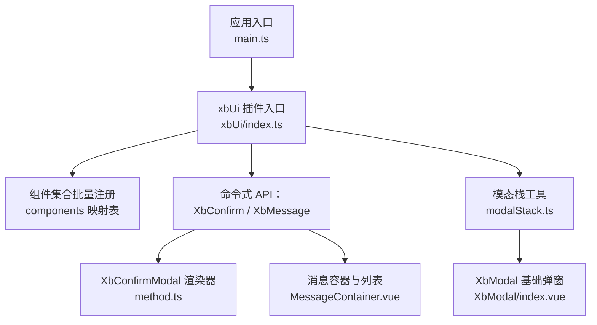
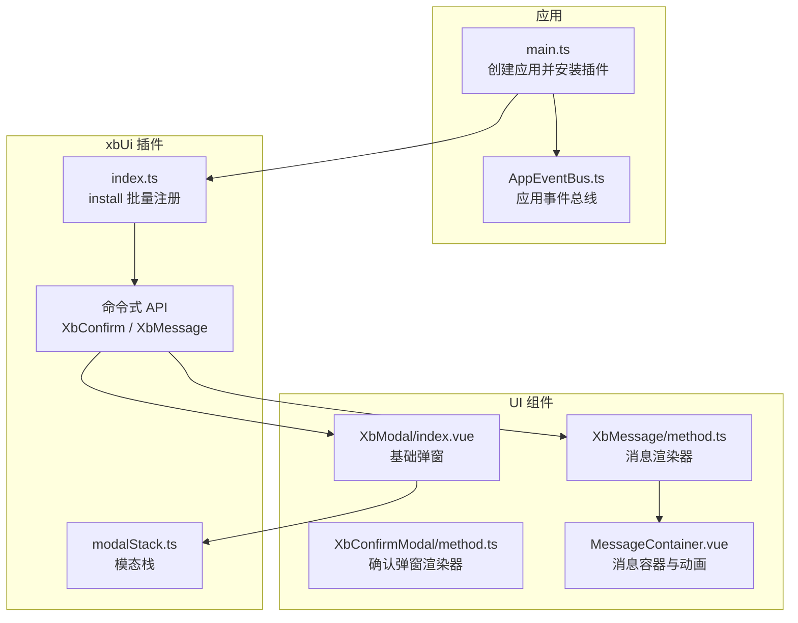
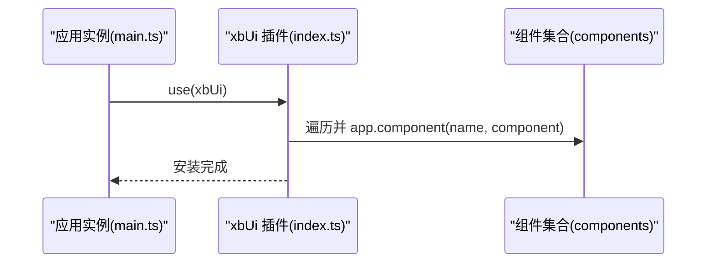
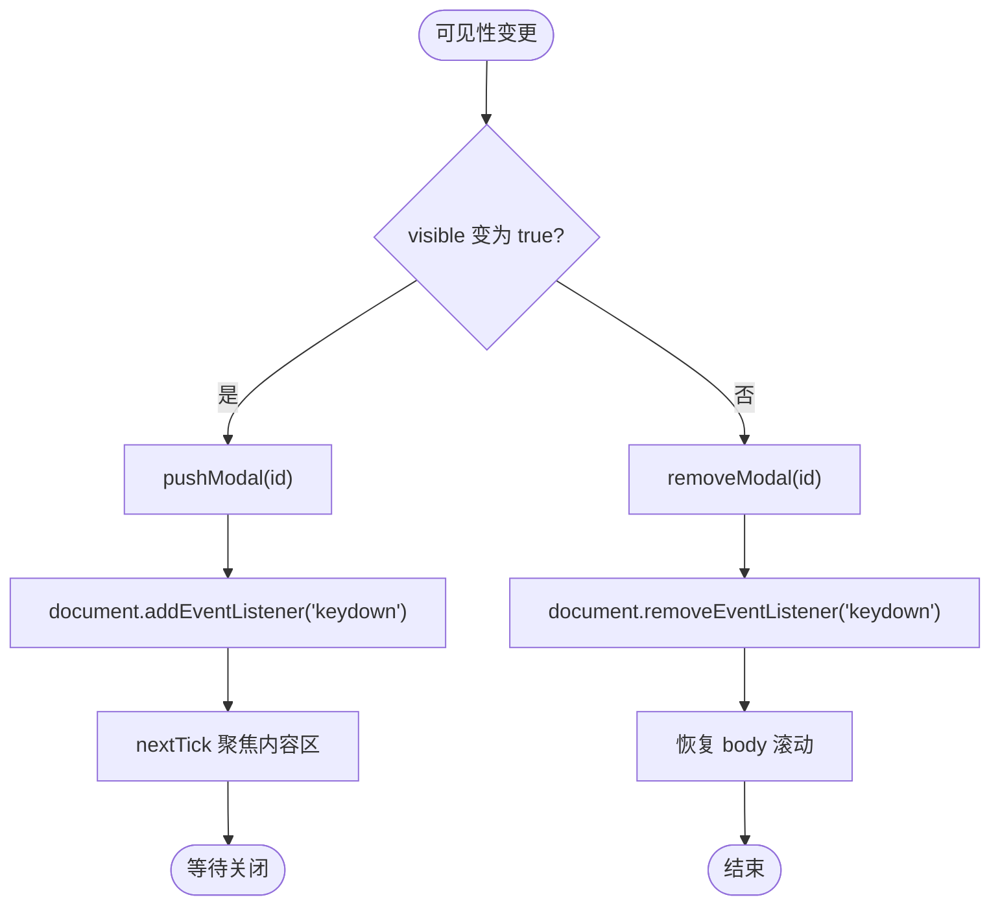
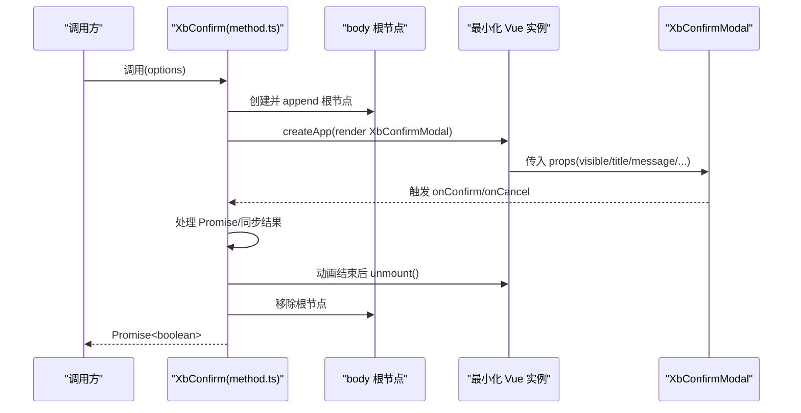
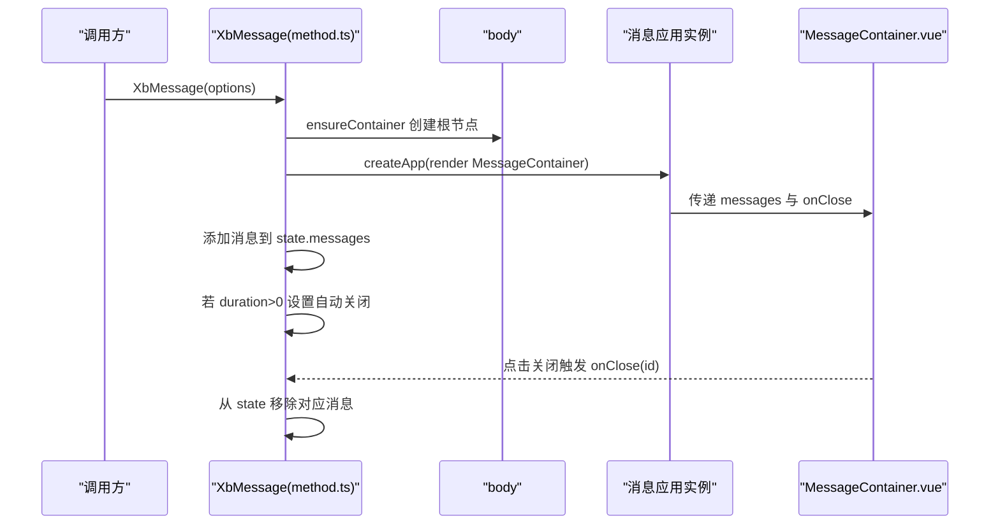
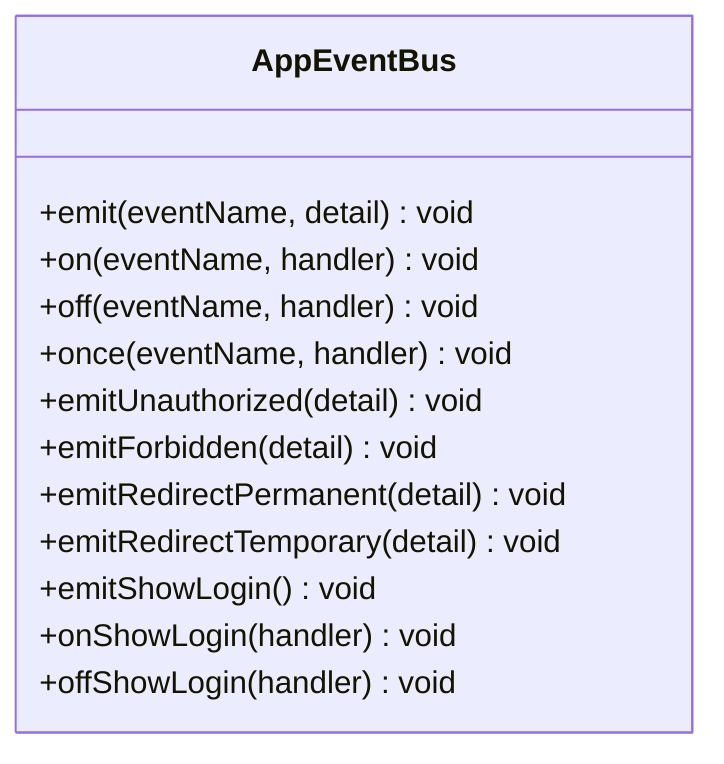
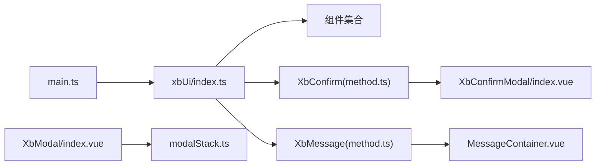

# 组件架构设计

<cite>
**本文引用的文件**
- [frontend/src/xbUi/index.ts](file://frontend/src/xbUi/index.ts)
- [frontend/src/main.ts](file://frontend/src/main.ts)
- [frontend/src/xbUi/modalStack.ts](file://frontend/src/xbUi/modalStack.ts)
- [frontend/src/xbUi/XbModal/index.vue](file://frontend/src/xbUi/XbModal/index.vue)
- [frontend/src/xbUi/XbConfirmModal/method.ts](file://frontend/src/xbUi/XbConfirmModal/method.ts)
- [frontend/src/xbUi/XbMessage/method.ts](file://frontend/src/xbUi/XbMessage/method.ts)
- [frontend/src/xbUi/XbMessage/MessageContainer.vue](file://frontend/src/xbUi/XbMessage/MessageContainer.vue)
- [frontend/src/events/AppEventBus.ts](file://frontend/src/events/AppEventBus.ts)
</cite>

## 目录
1. [引言](#引言)
2. [项目结构](#项目结构)
3. [核心组件](#核心组件)
4. [架构总览](#架构总览)
5. [详细组件分析](#详细组件分析)
6. [依赖关系分析](#依赖关系分析)
7. [性能与可维护性](#性能与可维护性)
8. [故障排查指南](#故障排查指南)
9. [结论](#结论)
10. [附录：开发规范与扩展指南](#附录开发规范与扩展指南)

## 引言
本文件面向 xbUi 组件库的架构设计与实现，系统性阐述整体架构模式、组件注册机制、全局 API 设计、初始化流程、插件化架构、依赖管理策略、模态框栈管理、事件总线、样式隔离方案，并给出组件开发规范、命名约定、目录结构设计原则以及扩展指南与最佳实践。文档以源码为依据，结合可视化图示帮助读者快速理解与落地。

## 项目结构
xbUi 位于前端工程 src/xbUi 下，采用“按功能域组织”的结构：每个组件一个目录，包含 index.vue 与可选的类型/方法文件；同时提供统一的入口 index.ts 作为 Vue 插件与按需导出。

图表来源
- [frontend/src/main.ts:1-21](file://frontend/src/main.ts#L1-L21)
- [frontend/src/xbUi/index.ts:1-100](file://frontend/src/xbUi/index.ts#L1-L100)
- [frontend/src/xbUi/modalStack.ts:1-29](file://frontend/src/xbUi/modalStack.ts#L1-L29)
- [frontend/src/xbUi/XbModal/index.vue:1-120](file://frontend/src/xbUi/XbModal/index.vue#L1-L120)
- [frontend/src/xbUi/XbConfirmModal/method.ts:1-150](file://frontend/src/xbUi/XbConfirmModal/method.ts#L1-L150)
- [frontend/src/xbUi/XbMessage/method.ts:1-116](file://frontend/src/xbUi/XbMessage/method.ts#L1-L116)
- [frontend/src/xbUi/XbMessage/MessageContainer.vue:1-114](file://frontend/src/xbUi/XbMessage/MessageContainer.vue#L1-L114)

章节来源
- [frontend/src/main.ts:1-21](file://frontend/src/main.ts#L1-L21)
- [frontend/src/xbUi/index.ts:1-100](file://frontend/src/xbUi/index.ts#L1-L100)

## 核心组件
- 插件与注册
  - 通过 Vue 插件 install 将组件批量注册为全局组件，并提供独立导出用于按需引入。
- 命令式 API
  - XbConfirm：返回 Promise 的命令式确认弹窗，支持异步回调与 loading 状态。
  - XbMessage：编程式消息提示，支持多种类型、位置与动画，自动清理。
- 基础能力
  - XbModal：通用弹窗容器，内置键盘交互、遮罩关闭、焦点管理与丰富动画。
  - modalStack：模态框栈，保证仅顶层弹窗响应键盘快捷键。

章节来源
- [frontend/src/xbUi/index.ts:1-100](file://frontend/src/xbUi/index.ts#L1-L100)
- [frontend/src/xbUi/XbConfirmModal/method.ts:1-150](file://frontend/src/xbUi/XbConfirmModal/method.ts#L1-L150)
- [frontend/src/xbUi/XbMessage/method.ts:1-116](file://frontend/src/xbUi/XbMessage/method.ts#L1-L116)
- [frontend/src/xbUi/XbModal/index.vue:1-120](file://frontend/src/xbUi/XbModal/index.vue#L1-L120)
- [frontend/src/xbUi/modalStack.ts:1-29](file://frontend/src/xbUi/modalStack.ts#L1-L29)

## 架构总览
xbUi 采用“Vue 插件 + 命令式 API + 模态栈 + 事件总线”的组合式架构：
- 插件层：统一安装与全局注册，暴露类型定义与子模块 API。
- 命令式层：在 body 中动态挂载最小化的 Vue 实例，渲染对应 UI 组件。
- 模态栈层：集中管理多弹窗层级，确保键盘事件与焦点行为正确。
- 事件层：基于 window CustomEvent 的应用级事件总线，与 HTTP 拦截器互通。

图表来源
- [frontend/src/main.ts:1-21](file://frontend/src/main.ts#L1-L21)
- [frontend/src/xbUi/index.ts:1-100](file://frontend/src/xbUi/index.ts#L1-L100)
- [frontend/src/xbUi/modalStack.ts:1-29](file://frontend/src/xbUi/modalStack.ts#L1-L29)
- [frontend/src/xbUi/XbModal/index.vue:1-120](file://frontend/src/xbUi/XbModal/index.vue#L1-L120)
- [frontend/src/xbUi/XbConfirmModal/method.ts:1-150](file://frontend/src/xbConfirmModal/method.ts#L1-L150)
- [frontend/src/xbUi/XbMessage/method.ts:1-116](file://frontend/src/xbUi/XbMessage/method.ts#L1-L116)
- [frontend/src/xbUi/XbMessage/MessageContainer.vue:1-114](file://frontend/src/xbUi/XbMessage/MessageContainer.vue#L1-L114)
- [frontend/src/events/AppEventBus.ts:1-109](file://frontend/src/events/AppEventBus.ts#L1-L109)

## 详细组件分析

### 插件与初始化流程
- 初始化顺序
  - main.ts 创建应用实例，安装 Pinia、路由后安装 xbUi 插件。
  - xbUi 插件在 install 中遍历组件映射表，调用 app.component 完成全局注册。
- 按需使用
  - 除插件外，还提供各组件与命令式 API 的独立导出，便于按需引入。

图表来源
- [frontend/src/main.ts:1-21](file://frontend/src/main.ts#L1-L21)
- [frontend/src/xbUi/index.ts:1-100](file://frontend/src/xbUi/index.ts#L1-L100)

章节来源
- [frontend/src/main.ts:1-21](file://frontend/src/main.ts#L1-L21)
- [frontend/src/xbUi/index.ts:1-100](file://frontend/src/xbUi/index.ts#L1-L100)

### 模态框栈管理机制
- 栈结构
  - 使用响应式数组维护已打开的模态 ID 序列，顶部为最后打开的模态。
- 生命周期
  - 打开时 pushModal，关闭或卸载时 removeModal。
  - isTopModal 判断当前模态是否处于栈顶，从而决定是否响应键盘事件。
- 与 XbModal 集成
  - XbModal 在 visible 变化时进行入栈/出栈、绑定/解绑 keydown、控制 body 滚动锁定与焦点转移。

图表来源
- [frontend/src/xbUi/modalStack.ts:1-29](file://frontend/src/xbUi/modalStack.ts#L1-L29)
- [frontend/src/xbUi/XbModal/index.vue:1-120](file://frontend/src/xbUi/XbModal/index.vue#L1-L120)

章节来源
- [frontend/src/xbUi/modalStack.ts:1-29](file://frontend/src/xbUi/modalStack.ts#L1-L29)
- [frontend/src/xbUi/XbModal/index.vue:1-120](file://frontend/src/xbUi/XbModal/index.vue#L1-L120)

### 命令式确认弹窗（XbConfirm）
- 调用方式
  - 直接调用返回 Promise<boolean>，支持字符串简写与完整选项对象。
- 渲染策略
  - 首次调用时在 body 下创建根节点与最小化 Vue 实例，渲染 XbConfirmModal。
  - 关闭时延迟卸载，确保过渡动画播放完毕。
- 异步处理
  - onConfirm 返回 Promise 时自动显示 loading，成功则 resolve(true)，失败保持 loading 并 resolve(false)。

图表来源
- [frontend/src/xbUi/XbConfirmModal/method.ts:1-150](file://frontend/src/xbUi/XbConfirmModal/method.ts#L1-L150)

章节来源
- [frontend/src/xbUi/XbConfirmModal/method.ts:1-150](file://frontend/src/xbUi/XbConfirmModal/method.ts#L1-L150)

### 消息系统（XbMessage）
- 调用方式
  - 支持函数式调用与便捷方法 success/warning/error/info/close/closeAll。
- 渲染策略
  - 首次调用 ensureContainer 在 body 下挂载 MessageContainer，并通过响应式 state.messages 驱动渲染。
  - 每条消息支持自定义动画与出现位置，默认自动关闭。
- 生命周期
  - 根据 duration 设置定时器自动移除；手动 close/closeAll 立即更新状态。

图表来源
- [frontend/src/xbUi/XbMessage/method.ts:1-116](file://frontend/src/xbUi/XbMessage/method.ts#L1-L116)
- [frontend/src/xbUi/XbMessage/MessageContainer.vue:1-114](file://frontend/src/xbUi/XbMessage/MessageContainer.vue#L1-L114)

章节来源
- [frontend/src/xbUi/XbMessage/method.ts:1-116](file://frontend/src/xbUi/XbMessage/method.ts#L1-L116)
- [frontend/src/xbUi/XbMessage/MessageContainer.vue:1-114](file://frontend/src/xbUi/XbMessage/MessageContainer.vue#L1-L114)

### 事件总线设计（AppEventBus）
- 设计目标
  - 提供程序化触发 window CustomEvent 的能力，与 HTTP 拦截器的事件体系互通。
- 能力清单
  - emit/on/off/once 基础事件操作；emitUnauthorized/emitForbidden/emitRedirectPermanent/emitRedirectTemporary 快捷方法；登录弹窗相关事件。
- 典型用法
  - 在请求拦截器中触发认证相关事件，在页面或布局中监听并执行跳转或展示登录弹窗等动作。

图表来源
- [frontend/src/events/AppEventBus.ts:1-109](file://frontend/src/events/AppEventBus.ts#L1-L109)

章节来源
- [frontend/src/events/AppEventBus.ts:1-109](file://frontend/src/events/AppEventBus.ts#L1-L109)

## 依赖关系分析
- 组件与工具
  - XbModal 依赖 modalStack 进行层级与键盘事件管理。
  - XbConfirmModal 与 XbMessage 均依赖各自 method.ts 中的渲染逻辑，并在 body 下挂载最小化实例。
- 插件与入口
  - main.ts 负责安装 xbUi 插件，插件内部集中管理组件注册与类型导出。

图表来源
- [frontend/src/main.ts:1-21](file://frontend/src/main.ts#L1-L21)
- [frontend/src/xbUi/index.ts:1-100](file://frontend/src/xbUi/index.ts#L1-L100)
- [frontend/src/xbUi/XbConfirmModal/method.ts:1-150](file://frontend/src/xbUi/XbConfirmModal/method.ts#L1-L150)
- [frontend/src/xbUi/XbMessage/method.ts:1-116](file://frontend/src/xbUi/XbMessage/method.ts#L1-L116)
- [frontend/src/xbUi/XbModal/index.vue:1-120](file://frontend/src/xbUi/XbModal/index.vue#L1-L120)
- [frontend/src/xbUi/modalStack.ts:1-29](file://frontend/src/xbUi/modalStack.ts#L1-L29)

章节来源
- [frontend/src/xbUi/index.ts:1-100](file://frontend/src/xbUi/index.ts#L1-L100)
- [frontend/src/xbUi/modalStack.ts:1-29](file://frontend/src/xbUi/modalStack.ts#L1-L29)
- [frontend/src/xbUi/XbModal/index.vue:1-120](file://frontend/src/xbUi/XbModal/index.vue#L1-L120)
- [frontend/src/xbUi/XbConfirmModal/method.ts:1-150](file://frontend/src/xbUi/XbConfirmModal/method.ts#L1-L150)
- [frontend/src/xbUi/XbMessage/method.ts:1-116](file://frontend/src/xbUi/XbMessage/method.ts#L1-L116)

## 性能与可维护性
- 渲染优化
  - 命令式 API 仅在首次调用时创建最小化实例与 DOM 节点，避免重复开销。
  - 消息与弹窗使用 Transition/动画类名，利用 CSS 硬件加速提升体验。
- 内存管理
  - 关闭弹窗与消息后及时卸载实例与移除 DOM，防止泄漏。
- 可维护性
  - 插件集中注册，新增组件只需在映射表中登记即可全局可用。
  - 类型定义集中导出，利于 IDE 提示与静态检查。

[本节为通用建议，不直接分析具体文件]

## 故障排查指南
- 键盘事件未生效
  - 检查是否为顶层模态（isTopModal），非顶层不会响应 Escape/Enter。
  - 确认 visible 变化时是否正确绑定/解绑 keydown 事件。
- 弹窗无法关闭
  - 检查 closeOnOverlay/persistent 配置组合，persistent 会阻止遮罩关闭。
  - 确认 onUnmounted 中是否执行 removeModal。
- 消息未自动消失
  - 检查 duration 是否大于 0，确认 addMessage 中定时器是否设置。
- 事件未触发
  - 确认事件名称一致，监听器引用相同，必要时使用 once 避免重复监听。

章节来源
- [frontend/src/xbUi/modalStack.ts:1-29](file://frontend/src/xbUi/modalStack.ts#L1-L29)
- [frontend/src/xbUi/XbModal/index.vue:1-120](file://frontend/src/xbUi/XbModal/index.vue#L1-L120)
- [frontend/src/xbUi/XbMessage/method.ts:1-116](file://frontend/src/xbUi/XbMessage/method.ts#L1-L116)
- [frontend/src/events/AppEventBus.ts:1-109](file://frontend/src/events/AppEventBus.ts#L1-L109)

## 结论
xbUi 以插件为核心，结合命令式 API 与模态栈，提供了开箱即用且可扩展的前端 UI 能力。其清晰的职责划分、良好的生命周期管理与丰富的动画支持，使其既适合快速集成，也便于长期演进与维护。

[本节为总结性内容，不直接分析具体文件]

## 附录：开发规范与扩展指南

### 组件开发规范
- 目录结构
  - 每个组件独立目录，包含 index.vue 与必要的 types.ts 或 method.ts。
  - 公共能力（如 modalStack）置于 xbUi 根目录，供多个组件复用。
- 命名约定
  - 组件前缀统一为 Xb，文件名与导出名保持一致，便于全局注册与按需导入。
  - 类型定义使用 PascalCase，接口以 Options/Item/Handler 等后缀明确语义。
- Props 与 Emits
  - 使用 withDefaults 提供默认值，显式声明 emits 类型，确保 TS 推断准确。
- 样式隔离
  - 组件样式使用 scoped，避免污染全局；命令式渲染的根节点使用唯一 class 前缀（如 xb-message-root、xb-confirm-modal-root）。
- 可访问性
  - 弹窗内容区域设置 tabindex 与 focus 管理，Escape 关闭，Enter/Space 提交需可配置。

章节来源
- [frontend/src/xbUi/index.ts:1-100](file://frontend/src/xbUi/index.ts#L1-L100)
- [frontend/src/xbUi/XbModal/index.vue:1-120](file://frontend/src/xbUi/XbModal/index.vue#L1-L120)
- [frontend/src/xbUi/XbMessage/method.ts:1-116](file://frontend/src/xbUi/XbMessage/method.ts#L1-L116)
- [frontend/src/xbUi/XbConfirmModal/method.ts:1-150](file://frontend/src/xbUi/XbConfirmModal/method.ts#L1-L150)

### 插件化与依赖管理策略
- 插件化
  - 通过 install 批量注册组件，新增组件无需改动业务代码，仅需在映射表登记。
- 依赖管理
  - 命令式 API 内聚渲染逻辑，外部仅暴露简洁函数；组件间尽量通过工具模块（如 modalStack）协作，降低耦合。
- 类型导出
  - 在 index.ts 集中导出类型，便于使用者获得良好 DX。

章节来源
- [frontend/src/xbUi/index.ts:1-100](file://frontend/src/xbUi/index.ts#L1-L100)
- [frontend/src/xbUi/modalStack.ts:1-29](file://frontend/src/xbUi/modalStack.ts#L1-L29)

### 扩展指南与最佳实践
- 新增组件步骤
  - 在 xbUi 下新建组件目录，编写 index.vue 与必要类型/方法。
  - 在 index.ts 的 components 映射表中登记，并在 export 中补充按需导出与类型导出。
- 命令式 API 扩展
  - 参考 XbConfirm/XbMessage 的实现模式：在 body 下创建根节点与最小化实例，使用响应式数据驱动渲染，注意卸载时机。
- 样式与主题
  - 使用 CSS 变量与 Tailwind 类名组合，保持风格一致与可定制性。
- 测试建议
  - 对命令式 API 进行单元测试，覆盖加载、错误与清理路径；对模态栈进行边界用例验证（多层叠加、键盘事件优先级）。

[本节为通用指导，不直接分析具体文件]