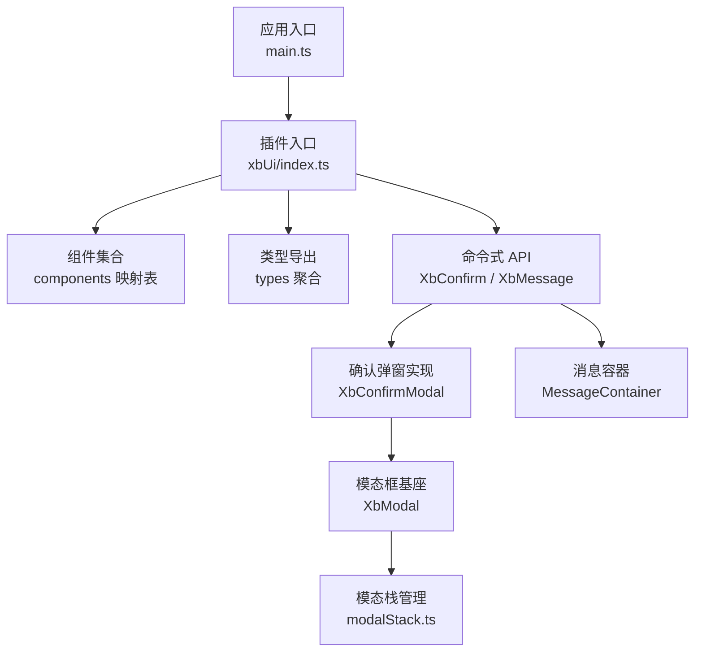
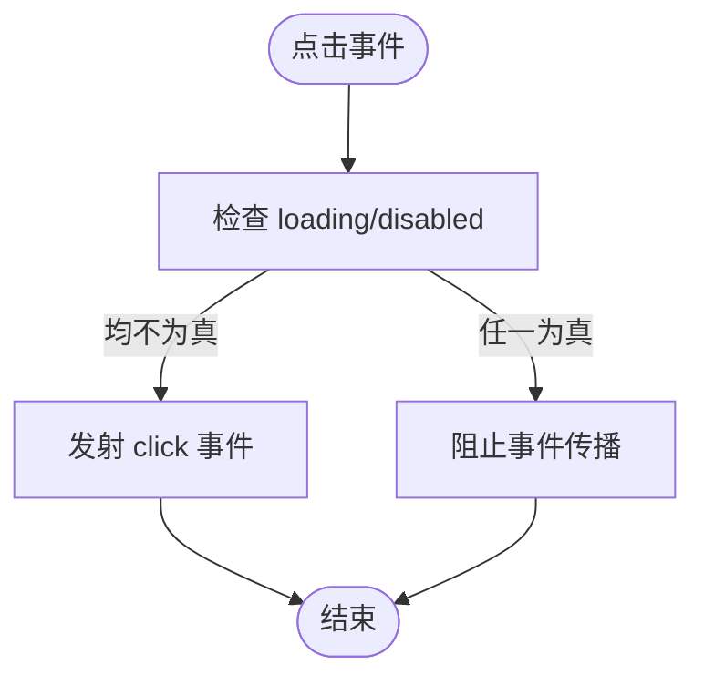
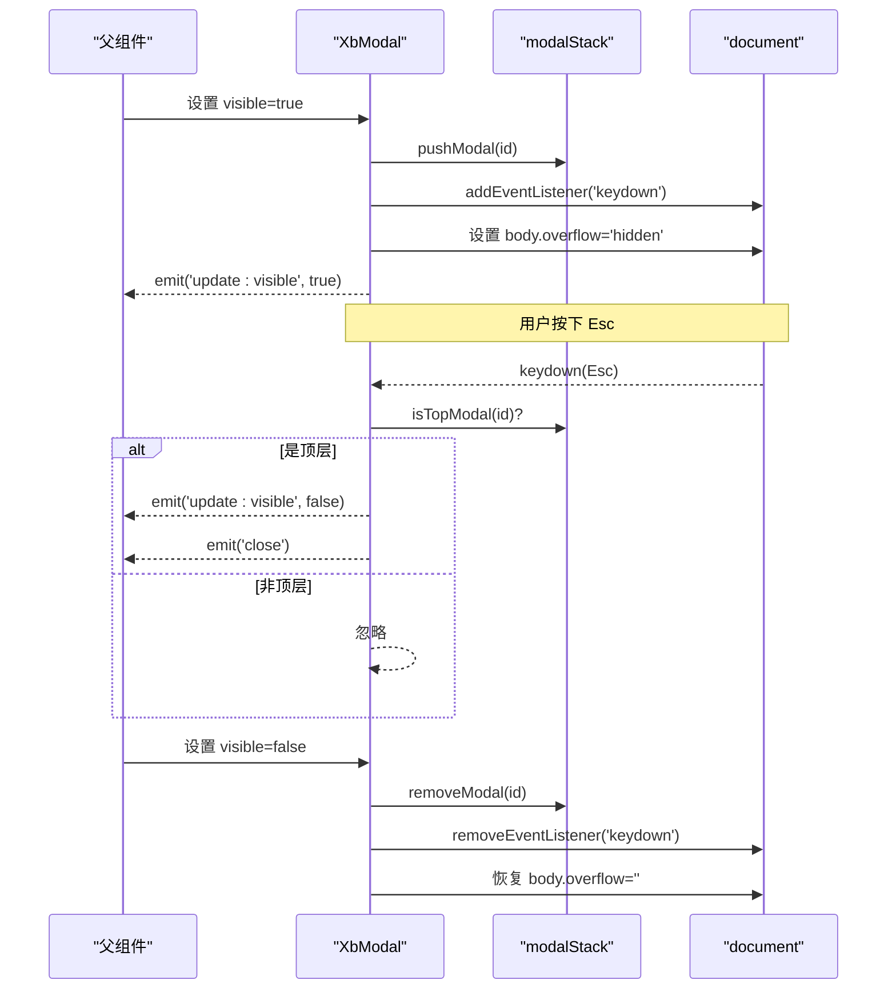
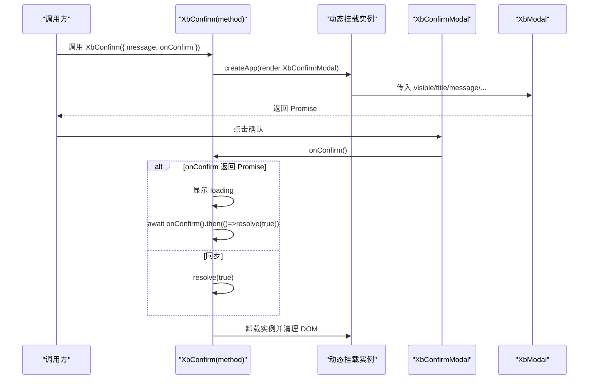
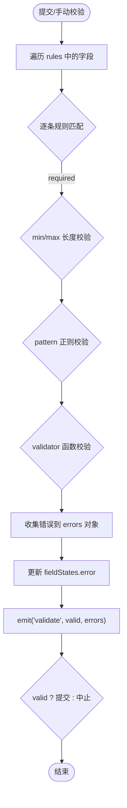
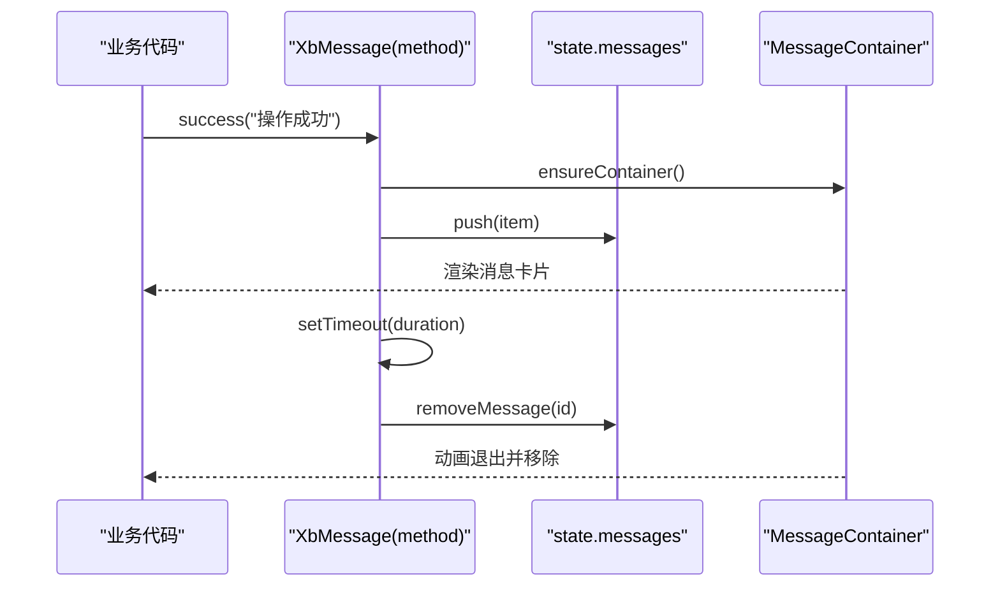
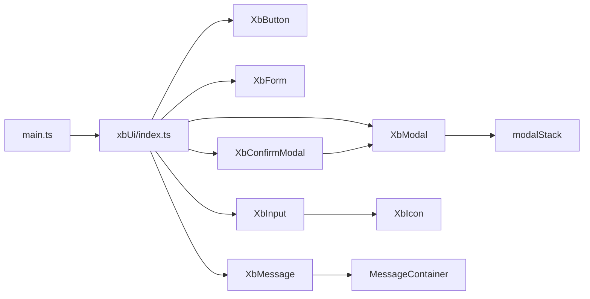

# 自定义UI组件库(xbUi)

<cite>
**本文引用的文件列表**
- [frontend/src/main.ts](file://frontend/src/main.ts)
- [frontend/src/xbUi/index.ts](file://frontend/src/xbUi/index.ts)
- [frontend/src/xbUi/XbButton/index.vue](file://frontend/src/xbUi/XbButton/index.vue)
- [frontend/src/xbUi/XbModal/index.vue](file://frontend/src/xbUi/XbModal/index.vue)
- [frontend/src/xbUi/modalStack.ts](file://frontend/src/xbUi/modalStack.ts)
- [frontend/src/xbUi/XbConfirmModal/index.vue](file://frontend/src/xbUi/XbConfirmModal/index.vue)
- [frontend/src/xbUi/XbConfirmModal/method.ts](file://frontend/src/xbUi/XbConfirmModal/method.ts)
- [frontend/src/xbUi/XbForm/index.vue](file://frontend/src/xbUi/XbForm/index.vue)
- [frontend/src/xbUi/XbForm/types.ts](file://frontend/src/xbUi/XbForm/types.ts)
- [frontend/src/xbUi/XbInput/index.vue](file://frontend/src/xbUi/XbInput/index.vue)
- [frontend/src/xbUi/XbMessage/method.ts](file://frontend/src/xbUi/XbMessage/method.ts)
- [frontend/src/xbUi/XbMessage/MessageContainer.vue](file://frontend/src/xbUi/XbMessage/MessageContainer.vue)
</cite>

## 目录
1. [简介](#简介)
2. [项目结构](#项目结构)
3. [核心组件](#核心组件)
4. [架构总览](#架构总览)
5. [详细组件分析](#详细组件分析)
6. [依赖关系分析](#依赖关系分析)
7. [性能与可访问性](#性能与可访问性)
8. [开发规范与最佳实践](#开发规范与最佳实践)
9. [故障排查指南](#故障排查指南)
10. [结论](#结论)

## 简介
本文件为 xbUi 自定义 UI 组件库的详细技术文档。内容覆盖整体架构、组件注册机制、API 设计规范，并对 XbButton、XbModal、XbForm、XbInput 等基础组件的实现原理进行深入解析。同时提供 props 设计、事件系统、插槽使用、样式定制与主题支持说明，以及组件开发规范、最佳实践和性能优化策略。

## 项目结构
xbUi 位于前端工程 src/xbUi 目录下，采用“按功能模块组织”的目录结构：每个组件一个独立文件夹，包含 index.vue 与可选的类型定义或命令式方法文件。入口文件统一导出插件与单个组件，便于按需引入与全局注册。



图表来源
- [frontend/src/main.ts:1-21](file://frontend/src/main.ts#L1-L21)
- [frontend/src/xbUi/index.ts:1-100](file://frontend/src/xbUi/index.ts#L1-L100)
- [frontend/src/xbUi/XbConfirmModal/method.ts:1-150](file://frontend/src/xbUi/XbConfirmModal/method.ts#L1-L150)
- [frontend/src/xbUi/XbMessage/method.ts:1-116](file://frontend/src/xbUi/XbMessage/method.ts#L1-L116)
- [frontend/src/xbUi/XbModal/index.vue:1-120](file://frontend/src/xbUi/XbModal/index.vue#L1-L120)
- [frontend/src/xbUi/modalStack.ts:1-29](file://frontend/src/xbUi/modalStack.ts#L1-L29)

章节来源
- [frontend/src/main.ts:1-21](file://frontend/src/main.ts#L1-L21)
- [frontend/src/xbUi/index.ts:1-100](file://frontend/src/xbUi/index.ts#L1-L100)

## 核心组件
本节聚焦于按钮、模态框、表单、输入框等基础组件的设计模式与实现细节。

- XbButton 按钮
  - 设计要点：通过 props 控制 type、size、loading、disabled、block、color、gradient、nativeType；内部以 computed 组合 Tailwind 类名，支持自定义主色与渐变；默认阻止表单误提交（nativeType=button）。
  - 事件：click 透传原生 MouseEvent。
  - 插槽：icon 前置图标、默认插槽承载文本。
  - 样式：CSS 变量 --xb-btn-color 支持主题化；hover 提升阴影与位移。
  - 参考路径
    - [XbButton 实现:1-110](file://frontend/src/xbUi/XbButton/index.vue#L1-L110)

- XbModal 模态框
  - 设计要点：基于 Teleport 渲染至 body；支持多种动画（fade/scale/slide-* 等）；键盘交互（Esc 关闭、Enter/Space 触发 submit）；仅顶层模态响应键盘；自动锁定滚动并聚焦内容区。
  - 事件：update:visible、close、submit。
  - 插槽：header、default（body）、footer。
  - 依赖：modalStack 维护打开顺序，确保键盘事件只作用于最上层。
  - 参考路径
    - [XbModal 实现:1-120](file://frontend/src/xbUi/XbModal/index.vue#L1-L120)
    - [模态栈管理:1-29](file://frontend/src/xbUi/modalStack.ts#L1-L29)

- XbForm 表单
  - 设计要点：集中校验规则 rules，暴露 validate/resetFields 等方法；通过 provide/inject 向子项传递上下文，维护字段状态 fieldStates（value/error/touched）；支持 required/min/max/pattern/validator 规则；提交前执行全量校验。
  - 事件：submit、validate。
  - 参考路径
    - [XbForm 实现:1-164](file://frontend/src/xbUi/XbForm/index.vue#L1-L164)
    - [表单类型定义:1-15](file://frontend/src/xbUi/XbForm/types.ts#L1-L15)

- XbInput 输入框
  - 设计要点：双向绑定 modelValue；支持 type/password/clearable/maxlength/size 等；密码可见切换；prefix/suffix/hint 插槽扩展；错误提示 error 文案；focus/blur/input/clear/keydown 事件。
  - 参考路径
    - [XbInput 实现:1-177](file://frontend/src/xbUi/XbInput/index.vue#L1-L177)

章节来源
- [frontend/src/xbUi/XbButton/index.vue:1-110](file://frontend/src/xbUi/XbButton/index.vue#L1-L110)
- [frontend/src/xbUi/XbModal/index.vue:1-120](file://frontend/src/xbUi/XbModal/index.vue#L1-L120)
- [frontend/src/xbUi/modalStack.ts:1-29](file://frontend/src/xbUi/modalStack.ts#L1-L29)
- [frontend/src/xbUi/XbForm/index.vue:1-164](file://frontend/src/xbUi/XbForm/index.vue#L1-L164)
- [frontend/src/xbUi/XbForm/types.ts:1-15](file://frontend/src/xbUi/XbForm/types.ts#L1-L15)
- [frontend/src/xbUi/XbInput/index.vue:1-177](file://frontend/src/xbUi/XbInput/index.vue#L1-L177)

## 架构总览
xbUi 采用 Vue 插件模式进行全局注册，并提供命令式 API（XbConfirm、XbMessage）用于非模板场景调用。组件之间职责清晰：XbModal 作为通用容器，XbConfirmModal 在其基础上封装确认交互；XbForm 提供表单上下文与校验能力；XbInput 作为基础输入控件。

```mermaid
classDiagram
class Plugin {
+install(app)
}
class XbButton {
+props : type,size,loading,disabled,block,color,gradient,nativeType
+emits : click
+slots : icon, default
}
class XbModal {
+props : visible,title,width,showClose,closeOnOverlay,persistent,noPadding,animation,randomAnimation,submitOnEnter
+emits : update : visible, close, submit
+slots : header, default, footer
}
class XbConfirmModal {
+props : visible,title,message,confirmText,cancelText,confirmType,loading,width,showCancel,showConfirm,animation,closeOnOverlay
+emits : update : visible, confirm, cancel
}
class XbForm {
+props : model,rules,labelWidth,labelPosition,disabled
+methods : validate(), resetFields(), handleSubmit()
+emits : submit, validate
}
class XbInput {
+props : modelValue,type,placeholder,disabled,readonly,error,label,clearable,maxlength,tabindex,size,showPasswordToggle
+emits : update : modelValue,focus,blur,input,clear,keydown
+slots : prefix,suffix,hint
}
class ModalStack {
+createModalId()
+pushModal(id)
+removeModal(id)
+isTopModal(id)
}
class XbConfirm {
+call(options) : Promise<boolean>
}
class XbMessage {
+success/warning/error/info/close/closeAll()
}
Plugin --> XbButton
Plugin --> XbModal
Plugin --> XbConfirmModal
Plugin --> XbForm
Plugin --> XbInput
XbConfirmModal --> XbModal
XbModal --> ModalStack
XbForm --> XbFormItem* : "provide/inject"
XbInput --> XbIcon* : "使用图标"
XbConfirm --> XbConfirmModal
XbMessage --> MessageContainer*
```

图表来源
- [frontend/src/xbUi/index.ts:1-100](file://frontend/src/xbUi/index.ts#L1-L100)
- [frontend/src/xbUi/XbButton/index.vue:1-110](file://frontend/src/xbUi/XbButton/index.vue#L1-L110)
- [frontend/src/xbUi/XbModal/index.vue:1-120](file://frontend/src/xbUi/XbModal/index.vue#L1-L120)
- [frontend/src/xbUi/modalStack.ts:1-29](file://frontend/src/xbUi/modalStack.ts#L1-L29)
- [frontend/src/xbUi/XbConfirmModal/index.vue:1-101](file://frontend/src/xbUi/XbConfirmModal/index.vue#L1-L101)
- [frontend/src/xbUi/XbConfirmModal/method.ts:1-150](file://frontend/src/xbUi/XbConfirmModal/method.ts#L1-L150)
- [frontend/src/xbUi/XbForm/index.vue:1-164](file://frontend/src/xbUi/XbForm/index.vue#L1-L164)
- [frontend/src/xbUi/XbInput/index.vue:1-177](file://frontend/src/xbUi/XbInput/index.vue#L1-L177)
- [frontend/src/xbUi/XbMessage/method.ts:1-116](file://frontend/src/xbUi/XbMessage/method.ts#L1-L116)
- [frontend/src/xbUi/XbMessage/MessageContainer.vue:1-618](file://frontend/src/xbUi/XbMessage/MessageContainer.vue#L1-L618)

## 详细组件分析

### XbButton 按钮组件
- Props 设计
  - type: primary/secondary/ghost/danger/outline，控制视觉风格
  - size: sm/md/lg，控制尺寸
  - loading/disabled/block/nativeType/color/gradient：行为与外观扩展
- 事件系统
  - click：透传原生点击事件，在 loading/disabled 时拦截
- 插槽
  - icon：用于放置图标
  - 默认：按钮文本
- 样式与主题
  - 通过 CSS 变量 --xb-btn-color 注入自定义颜色
  - 支持渐变背景（配合 gradient）
- 复杂度与性能
  - 计算类名 O(1)，无重排风险
- 参考路径
  - [XbButton 实现:1-110](file://frontend/src/xbUi/XbButton/index.vue#L1-L110)



图表来源
- [frontend/src/xbUi/XbButton/index.vue:56-59](file://frontend/src/xbUi/XbButton/index.vue#L56-L59)

章节来源
- [frontend/src/xbUi/XbButton/index.vue:1-110](file://frontend/src/xbUi/XbButton/index.vue#L1-L110)

### XbModal 模态框组件
- 生命周期与焦点管理
  - visible 变为 true 时：入栈、选择动画、监听键盘、锁定滚动、将焦点移至内容区
  - visible 变为 false 时：出栈、移除监听、恢复滚动
- 键盘交互
  - 仅当该模态为栈顶时响应 Esc 关闭与 Enter/Space 触发 submit
- 动画系统
  - 内置 fade/scale/slide-up/down/left/right/zoom/bounce/flip/rotate/blur/elastic/wobble/tada/jello/roll-in/drop 等多套动画
- 事件与插槽
  - 事件：update:visible、close、submit
  - 插槽：header、default、footer
- 参考路径
  - [XbModal 实现:1-120](file://frontend/src/xbUi/XbModal/index.vue#L1-L120)
  - [模态栈管理:1-29](file://frontend/src/xbUi/modalStack.ts#L1-L29)



图表来源
- [frontend/src/xbUi/XbModal/index.vue:94-116](file://frontend/src/xbUi/XbModal/index.vue#L94-L116)
- [frontend/src/xbUi/modalStack.ts:1-29](file://frontend/src/xbUi/modalStack.ts#L1-L29)

章节来源
- [frontend/src/xbUi/XbModal/index.vue:1-120](file://frontend/src/xbUi/XbModal/index.vue#L1-L120)
- [frontend/src/xbUi/modalStack.ts:1-29](file://frontend/src/xbUi/modalStack.ts#L1-L29)

### XbConfirmModal 确认弹窗
- 命令式 API
  - XbConfirm(options|string) 返回 Promise<boolean>，支持 onConfirm 异步处理并自动显示 loading
- 组件封装
  - 基于 XbModal 构建，提供标题、消息、确认/取消按钮、宽度、动画等配置
- 参考路径
  - [命令式方法:1-150](file://frontend/src/xbUi/XbConfirmModal/method.ts#L1-L150)
  - [确认弹窗组件:1-101](file://frontend/src/xbUi/XbConfirmModal/index.vue#L1-L101)



图表来源
- [frontend/src/xbUi/XbConfirmModal/method.ts:68-149](file://frontend/src/xbUi/XbConfirmModal/method.ts#L68-L149)
- [frontend/src/xbUi/XbConfirmModal/index.vue:1-101](file://frontend/src/xbUi/XbConfirmModal/index.vue#L1-L101)

章节来源
- [frontend/src/xbUi/XbConfirmModal/method.ts:1-150](file://frontend/src/xbUi/XbConfirmModal/method.ts#L1-L150)
- [frontend/src/xbUi/XbConfirmModal/index.vue:1-101](file://frontend/src/xbUi/XbConfirmModal/index.vue#L1-L101)

### XbForm 表单与校验
- 数据与状态
  - 通过 provide 注入 formContext，子项可 registerField/updateFieldValue/validateField 等
  - 维护 fieldStates[name] = { value, error, touched }
- 校验流程
  - 支持 required/min/max/pattern/validator（同步或异步），validate() 遍历所有规则收集错误
- 事件与暴露方法
  - 事件：submit、validate
  - 方法：validate、resetFields、handleSubmit
- 参考路径
  - [表单实现:1-164](file://frontend/src/xbUi/XbForm/index.vue#L1-L164)
  - [表单类型:1-15](file://frontend/src/xbUi/XbForm/types.ts#L1-L15)



图表来源
- [frontend/src/xbUi/XbForm/index.vue:81-134](file://frontend/src/xbUi/XbForm/index.vue#L81-L134)

章节来源
- [frontend/src/xbUi/XbForm/index.vue:1-164](file://frontend/src/xbUi/XbForm/index.vue#L1-L164)
- [frontend/src/xbUi/XbForm/types.ts:1-15](file://frontend/src/xbUi/XbForm/types.ts#L1-L15)

### XbInput 输入框
- 双向绑定与事件
  - v-model 兼容：modelValue + update:modelValue
  - 事件：focus、blur、input、clear、keydown
- 功能特性
  - 密码可见切换、清除按钮、前缀/后缀/提示插槽、错误提示、大小尺寸
- 参考路径
  - [输入框实现:1-177](file://frontend/src/xbUi/XbInput/index.vue#L1-L177)

章节来源
- [frontend/src/xbUi/XbInput/index.vue:1-177](file://frontend/src/xbUi/XbInput/index.vue#L1-L177)

### XbMessage 消息通知
- 命令式 API
  - XbMessage.success/warning/error/info/close/closeAll
  - 支持 position（top-left/top/top-right/bottom-left/bottom/bottom-right）与 animation
- 实现方式
  - 首次调用 ensureContainer 创建根节点并挂载 MessageContainer
  - 使用响应式 state.messages 驱动列表渲染与过渡动画
- 参考路径
  - [消息方法:1-116](file://frontend/src/xbUi/XbMessage/method.ts#L1-L116)
  - [消息容器:1-618](file://frontend/src/xbUi/XbMessage/MessageContainer.vue#L1-L618)



图表来源
- [frontend/src/xbUi/XbMessage/method.ts:36-79](file://frontend/src/xbUi/XbMessage/method.ts#L36-L79)
- [frontend/src/xbUi/XbMessage/MessageContainer.vue:90-114](file://frontend/src/xbUi/XbMessage/MessageContainer.vue#L90-L114)

章节来源
- [frontend/src/xbUi/XbMessage/method.ts:1-116](file://frontend/src/xbUi/XbMessage/method.ts#L1-L116)
- [frontend/src/xbUi/XbMessage/MessageContainer.vue:1-618](file://frontend/src/xbUi/XbMessage/MessageContainer.vue#L1-L618)

## 依赖关系分析
- 插件注册
  - main.ts 中 app.use(xbUi) 完成全局组件注册
  - xbUi/index.ts 内维护 components 映射表，遍历 app.component(name, component) 完成注册
- 组件间依赖
  - XbConfirmModal 依赖 XbModal 与 XbButton
  - XbModal 依赖 modalStack 管理层级
  - XbInput 依赖 XbIcon 展示图标
  - XbMessage 依赖 MessageContainer 渲染消息列表
- 外部依赖
  - Vue 3 运行时（createApp、h、ref、reactive、nextTick、Transition、Teleport）
  - Tailwind 类名与 CSS 变量体系



图表来源
- [frontend/src/main.ts:1-21](file://frontend/src/main.ts#L1-L21)
- [frontend/src/xbUi/index.ts:1-100](file://frontend/src/xbUi/index.ts#L1-L100)
- [frontend/src/xbUi/XbConfirmModal/index.vue:1-101](file://frontend/src/xbUi/XbConfirmModal/index.vue#L1-L101)
- [frontend/src/xbUi/XbModal/index.vue:1-120](file://frontend/src/xbUi/XbModal/index.vue#L1-L120)
- [frontend/src/xbUi/modalStack.ts:1-29](file://frontend/src/xbUi/modalStack.ts#L1-L29)
- [frontend/src/xbUi/XbInput/index.vue:1-177](file://frontend/src/xbUi/XbInput/index.vue#L1-L177)
- [frontend/src/xbUi/XbMessage/method.ts:1-116](file://frontend/src/xbUi/XbMessage/method.ts#L1-L116)
- [frontend/src/xbUi/XbMessage/MessageContainer.vue:1-618](file://frontend/src/xbUi/XbMessage/MessageContainer.vue#L1-L618)

章节来源
- [frontend/src/main.ts:1-21](file://frontend/src/main.ts#L1-L21)
- [frontend/src/xbUi/index.ts:1-100](file://frontend/src/xbUi/index.ts#L1-L100)

## 性能与可访问性
- 性能优化建议
  - 避免在模板中进行复杂计算，尽量使用 computed 缓存（如按钮类名、输入框实际类型）
  - 大量消息时使用去抖/节流合并渲染，减少频繁 push/splice
  - 模态框动画尽量使用 transform/opacity，避免触发布局重排
  - 按需引入组件，减少打包体积
- 可访问性
  - 模态框打开后锁定滚动并将焦点移入内容区域，关闭后恢复
  - 键盘导航：Esc 关闭、Enter/Space 触发提交（仅在顶层模态生效）
  - 按钮与输入框保留原生语义与 focus-visible 样式

[本节为通用指导，不直接分析具体文件]

## 开发规范与最佳实践
- 组件命名与导出
  - 组件以 Xb 前缀命名，统一从 index.ts 导出，既支持全局注册也支持按需导入
- Props 设计
  - 使用 withDefaults 提供合理默认值
  - 明确类型约束，必要时拆分 types.ts 文件
- 事件系统
  - 使用 defineEmits 声明事件，保持事件名与语义一致（如 update:visible、submit、click）
- 插槽使用
  - 对可变内容提供具名插槽（header/footer/icon/prefix/suffix/hint），增强扩展性
- 样式与主题
  - 优先使用 Tailwind 原子类，辅以少量 scoped 样式
  - 通过 CSS 变量（如 --xb-btn-color）暴露主题钩子
- 命令式 API
  - 使用 createApp + h 动态挂载，注意在动画结束后 unmount 与清理 DOM
  - 返回 Promise 以便调用方 await 结果
- 表单校验
  - 将规则集中在 rules 中，支持同步/异步 validator
  - 提供 validate/resetFields 方法，便于父组件控制

[本节为通用指导，不直接分析具体文件]

## 故障排查指南
- 模态框无法关闭
  - 检查是否设置了 persistent 或 closeOnOverlay=false
  - 确认键盘事件是否被其他元素拦截
  - 参考路径
    - [XbModal 键盘处理:79-92](file://frontend/src/xbUi/XbModal/index.vue#L79-L92)
- 确认弹窗未正确返回 Promise
  - 确保 onConfirm 返回 Promise 或在 then 中 resolve
  - 参考路径
    - [XbConfirm 方法:93-109](file://frontend/src/xbUi/XbConfirmModal/method.ts#L93-L109)
- 表单校验无效
  - 检查 rules 键名是否与 model 字段一致
  - 确认 validator 返回值类型（string/false 表示失败）
  - 参考路径
    - [XbForm 校验逻辑:81-134](file://frontend/src/xbUi/XbForm/index.vue#L81-L134)
- 输入框 clear 无效
  - 确认 clearable 为 true 且未 disabled/readonly
  - 参考路径
    - [XbInput 清除逻辑:85-88](file://frontend/src/xbUi/XbInput/index.vue#L85-L88)

章节来源
- [frontend/src/xbUi/XbModal/index.vue:79-92](file://frontend/src/xbUi/XbModal/index.vue#L79-L92)
- [frontend/src/xbUi/XbConfirmModal/method.ts:93-109](file://frontend/src/xbUi/XbConfirmModal/method.ts#L93-L109)
- [frontend/src/xbUi/XbForm/index.vue:81-134](file://frontend/src/xbUi/XbForm/index.vue#L81-L134)
- [frontend/src/xbUi/XbInput/index.vue:85-88](file://frontend/src/xbUi/XbInput/index.vue#L85-L88)

## 结论
xbUi 以清晰的插件注册机制与模块化目录结构为基础，提供了完善的按钮、模态框、表单、输入框等基础组件，并通过命令式 API 满足非模板场景需求。其设计遵循 Vue 3 最佳实践，具备良好可扩展性与主题化能力。建议在后续迭代中持续完善类型定义、单元测试与国际化支持，进一步提升组件库的健壮性与易用性。