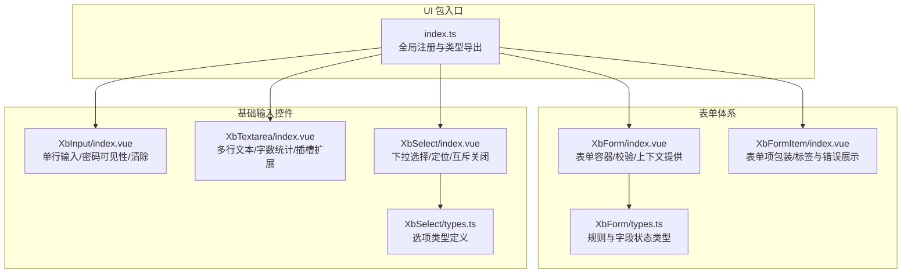
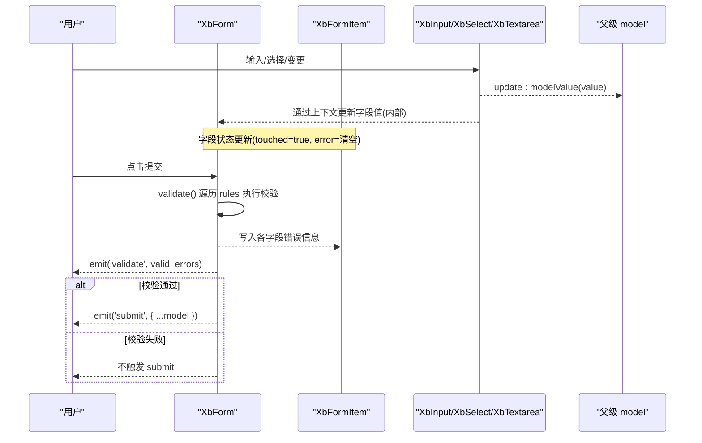
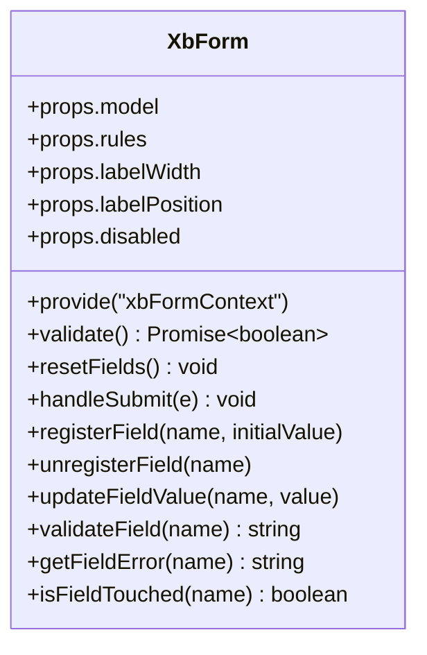
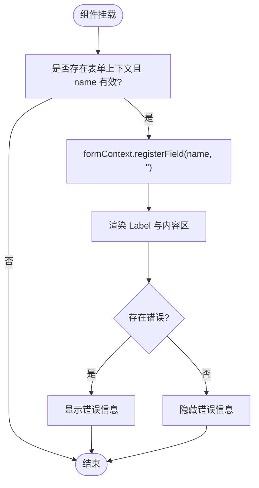
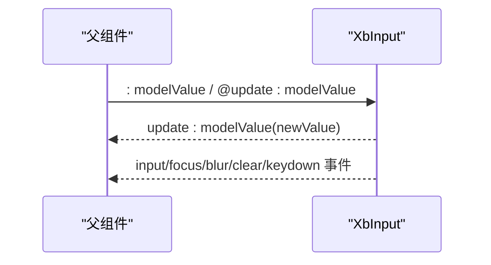
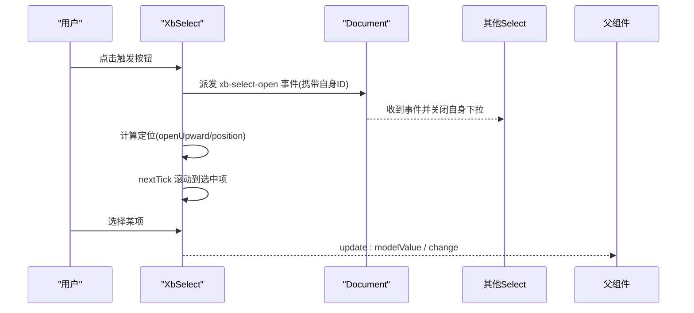
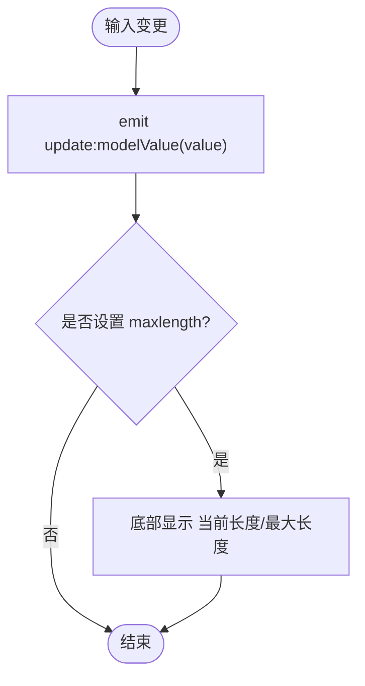
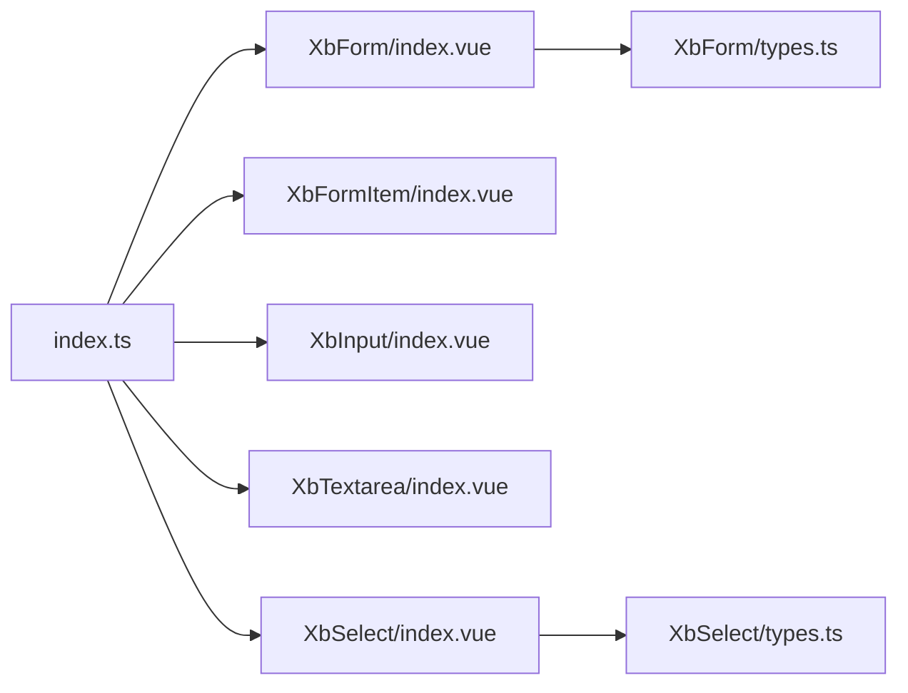

# 表单组件

<cite>
**本文引用的文件**
- [frontend/src/xbUi/index.ts](file://frontend/src/xbUi/index.ts)
- [frontend/src/xbUi/XbForm/index.vue](file://frontend/src/xbUi/XbForm/index.vue)
- [frontend/src/xbUi/XbForm/types.ts](file://frontend/src/xbUi/XbForm/types.ts)
- [frontend/src/xbUi/XbFormItem/index.vue](file://frontend/src/xbUi/XbFormItem/index.vue)
- [frontend/src/xbUi/XbInput/index.vue](file://frontend/src/xbUi/XbInput/index.vue)
- [frontend/src/xbUi/XbSelect/index.vue](file://frontend/src/xbUi/XbSelect/index.vue)
- [frontend/src/xbUi/XbSelect/types.ts](file://frontend/src/xbUi/XbSelect/types.ts)
- [frontend/src/xbUi/XbTextarea/index.vue](file://frontend/src/xbUi/XbTextarea/index.vue)
</cite>

## 目录
1. [简介](#简介)
2. [项目结构](#项目结构)
3. [核心组件](#核心组件)
4. [架构总览](#架构总览)
5. [详细组件分析](#详细组件分析)
6. [依赖关系分析](#依赖关系分析)
7. [性能与体验优化](#性能与体验优化)
8. [故障排查指南](#故障排查指南)
9. [结论](#结论)
10. [附录：使用示例与最佳实践](#附录使用示例与最佳实践)

## 简介
本文件面向前端开发者，系统化梳理 XbForm 表单容器、XbFormItem 表单项、XbInput 输入框、XbSelect 选择器、XbTextarea 文本域等组件的设计模式与实现细节。文档覆盖表单验证机制、数据绑定方式、错误处理策略、布局适配方案，并提供复杂表单场景的实现思路、自定义验证规则、动态表单生成方法，以及性能优化与用户体验改进建议。

## 项目结构
表单相关组件位于统一 UI 包中，通过插件形式全局注册，便于在任意页面直接使用。

图表来源
- [frontend/src/xbUi/index.ts:1-100](file://frontend/src/xbUi/index.ts#L1-L100)
- [frontend/src/xbUi/XbForm/index.vue:1-164](file://frontend/src/xbUi/XbForm/index.vue#L1-L164)
- [frontend/src/xbUi/XbForm/types.ts:1-15](file://frontend/src/xbUi/XbForm/types.ts#L1-L15)
- [frontend/src/xbUi/XbFormItem/index.vue:1-80](file://frontend/src/xbUi/XbFormItem/index.vue#L1-L80)
- [frontend/src/xbUi/XbInput/index.vue:1-177](file://frontend/src/xbUi/XbInput/index.vue#L1-L177)
- [frontend/src/xbUi/XbTextarea/index.vue:1-168](file://frontend/src/xbUi/XbTextarea/index.vue#L1-L168)
- [frontend/src/xbUi/XbSelect/index.vue:1-271](file://frontend/src/xbUi/XbSelect/index.vue#L1-L271)
- [frontend/src/xbUi/XbSelect/types.ts:1-9](file://frontend/src/xbUi/XbSelect/types.ts#L1-L9)

章节来源
- [frontend/src/xbUi/index.ts:1-100](file://frontend/src/xbUi/index.ts#L1-L100)

## 核心组件
- XbForm：表单容器，负责提供表单上下文（字段注册/更新/校验）、统一提交与重置、暴露 validate/resetFields 等方法。
- XbFormItem：表单项包装，负责渲染 label、必填标记、错误信息，并与表单上下文联动。
- XbInput：通用输入框，支持多种类型、大小、前缀/后缀插槽、密码可见切换、清空、聚焦/失焦事件。
- XbSelect：下拉选择器，支持尺寸、清空、向上/向下展开、多实例互斥关闭、滚动定位到选中项。
- XbTextarea：多行文本域，支持行数、最大长度计数、四角插槽、清空、聚焦/失焦事件。

章节来源
- [frontend/src/xbUi/XbForm/index.vue:1-164](file://frontend/src/xbUi/XbForm/index.vue#L1-L164)
- [frontend/src/xbUi/XbFormItem/index.vue:1-80](file://frontend/src/xbUi/XbFormItem/index.vue#L1-L80)
- [frontend/src/xbUi/XbInput/index.vue:1-177](file://frontend/src/xbUi/XbInput/index.vue#L1-L177)
- [frontend/src/xbUi/XbSelect/index.vue:1-271](file://frontend/src/xbUi/XbSelect/index.vue#L1-L271)
- [frontend/src/xbUi/XbTextarea/index.vue:1-168](file://frontend/src/xbUi/XbTextarea/index.vue#L1-L168)

## 架构总览
表单采用“容器 + 子项”的上下文注入模式：XbForm 通过 provide 暴露表单上下文，XbFormItem 通过 inject 获取上下文并注册字段；具体输入控件通过 v-model 双向绑定至父级 model，并在需要时触发表单校验或错误提示。

图表来源
- [frontend/src/xbUi/XbForm/index.vue:24-79](file://frontend/src/xbUi/XbForm/index.vue#L24-L79)
- [frontend/src/xbUi/XbForm/index.vue:81-156](file://frontend/src/xbUi/XbForm/index.vue#L81-L156)
- [frontend/src/xbUi/XbFormItem/index.vue:13-39](file://frontend/src/xbUi/XbFormItem/index.vue#L13-L39)
- [frontend/src/xbUi/XbInput/index.vue:69-88](file://frontend/src/xbUi/XbInput/index.vue#L69-L88)
- [frontend/src/xbUi/XbSelect/index.vue:115-124](file://frontend/src/xbUi/XbSelect/index.vue#L115-L124)
- [frontend/src/xbUi/XbTextarea/index.vue:58-77](file://frontend/src/xbUi/XbTextarea/index.vue#L58-L77)

## 详细组件分析

### XbForm 表单容器
- 设计要点
  - 通过 provide 暴露表单上下文，包含字段注册/注销、值更新、单字段校验、错误读取、是否已触碰等能力。
  - 内置同步与异步校验：required/min/max/pattern/validator，支持返回字符串作为错误消息或布尔值表示通过与否。
  - 提供 validate/resetFields/handleSubmit 方法，供外部调用。
  - 支持 labelWidth/labelPosition/disabled 等布局与交互控制。
- 数据结构与复杂度
  - 字段状态 fieldStates 为 Record<string, FormFieldState>，单次全量校验时间复杂度 O(N*M)，N 为规则数量，M 为每个规则的校验次数。
- 错误处理策略
  - 首次校验失败后，将错误写入对应字段的 error 状态；字段值变化时自动清空该字段错误，提升交互友好度。
- 布局适配
  - labelPosition 支持 left/top；labelWidth 可配置，配合 Flex 布局自适应。

图表来源
- [frontend/src/xbUi/XbForm/index.vue:1-164](file://frontend/src/xbUi/XbForm/index.vue#L1-L164)
- [frontend/src/xbUi/XbForm/types.ts:1-15](file://frontend/src/xbUi/XbForm/types.ts#L1-L15)

章节来源
- [frontend/src/xbUi/XbForm/index.vue:1-164](file://frontend/src/xbUi/XbForm/index.vue#L1-L164)
- [frontend/src/xbUi/XbForm/types.ts:1-15](file://frontend/src/xbUi/XbForm/types.ts#L1-L15)

### XbFormItem 表单项
- 设计要点
  - 挂载时向表单上下文注册字段，卸载时注销，避免内存泄漏。
  - 根据 labelPosition 与 labelWidth 渲染标签与内容区域，支持必填星号与错误信息展示。
- 与表单上下文协作
  - 通过 getFieldError/isFieldTouched 读取状态，结合样式类名呈现错误态。

图表来源
- [frontend/src/xbUi/XbFormItem/index.vue:15-39](file://frontend/src/xbUi/XbFormItem/index.vue#L15-L39)
- [frontend/src/xbUi/XbFormItem/index.vue:41-69](file://frontend/src/xbUi/XbFormItem/index.vue#L41-L69)

章节来源
- [frontend/src/xbUi/XbFormItem/index.vue:1-80](file://frontend/src/xbUi/XbFormItem/index.vue#L1-L80)

### XbInput 输入框
- 设计要点
  - 支持 type/password 切换、clearable、prefix/suffix/hint 插槽、size 尺寸、maxlength 限制、focus/blur/input/clear/keydown 事件。
  - 错误态通过 error 属性驱动，样式上以边框与阴影区分。
- 数据绑定
  - 通过 v-model 与父级 model 双向绑定，内部触发 update:modelValue 事件。

图表来源
- [frontend/src/xbUi/XbInput/index.vue:29-88](file://frontend/src/xbUi/XbInput/index.vue#L29-L88)
- [frontend/src/xbUi/XbInput/index.vue:91-154](file://frontend/src/xbUi/XbInput/index.vue#L91-L154)

章节来源
- [frontend/src/xbUi/XbInput/index.vue:1-177](file://frontend/src/xbUi/XbInput/index.vue#L1-L177)

### XbSelect 选择器
- 设计要点
  - 下拉面板通过 Teleport 渲染到 body，计算定位并支持向上/向下展开；多实例间通过自定义事件互斥关闭。
  - 支持 size、clearable、selected/custom option 插槽、change/clear 事件。
- 定位与滚动
  - 打开时计算距视口上下空间，决定展开方向；滚动/窗口变化时实时更新位置；自动滚动到选中项居中。

图表来源
- [frontend/src/xbUi/XbSelect/index.vue:66-113](file://frontend/src/xbUi/XbSelect/index.vue#L66-L113)
- [frontend/src/xbUi/XbSelect/index.vue:126-157](file://frontend/src/xbUi/XbSelect/index.vue#L126-L157)
- [frontend/src/xbUi/XbSelect/index.vue:160-228](file://frontend/src/xbUi/XbSelect/index.vue#L160-L228)

章节来源
- [frontend/src/xbUi/XbSelect/index.vue:1-271](file://frontend/src/xbUi/XbSelect/index.vue#L1-L271)
- [frontend/src/xbUi/XbSelect/types.ts:1-9](file://frontend/src/xbUi/XbSelect/types.ts#L1-L9)

### XbTextarea 文本域
- 设计要点
  - 支持 rows、resize、maxlength 字数统计、top-left/top-right/bottom-left/bottom-right 插槽、clearable、error 提示。
  - 与 XbInput 一致的 v-model 与事件模型，便于统一接入表单上下文。

图表来源
- [frontend/src/xbUi/XbTextarea/index.vue:58-77](file://frontend/src/xbUi/XbTextarea/index.vue#L58-L77)
- [frontend/src/xbUi/XbTextarea/index.vue:124-137](file://frontend/src/xbUi/XbTextarea/index.vue#L124-L137)

章节来源
- [frontend/src/xbUi/XbTextarea/index.vue:1-168](file://frontend/src/xbUi/XbTextarea/index.vue#L1-L168)

## 依赖关系分析
- 组件注册与导出
  - index.ts 集中导入并全局注册所有组件，同时导出类型，便于外部使用。
- 组件内依赖
  - XbForm 依赖 types.ts 中的规则与状态类型。
  - XbSelect 依赖 types.ts 中的选项类型。
  - 输入控件均依赖图标组件进行视觉增强（如 XbIcon）。

图表来源
- [frontend/src/xbUi/index.ts:1-100](file://frontend/src/xbUi/index.ts#L1-L100)
- [frontend/src/xbUi/XbForm/index.vue:1-10](file://frontend/src/xbUi/XbForm/index.vue#L1-L10)
- [frontend/src/xbUi/XbSelect/index.vue:1-10](file://frontend/src/xbUi/XbSelect/index.vue#L1-L10)

章节来源
- [frontend/src/xbUi/index.ts:1-100](file://frontend/src/xbUi/index.ts#L1-L100)

## 性能与体验优化
- 表单校验
  - 优先使用同步规则（required/min/max/pattern），将耗时逻辑放入 validator 并使用异步返回，避免阻塞主线程。
  - 对大型表单可按需延迟校验，或在用户交互后再触发（例如 blur 时校验单个字段）。
- 渲染与定位
  - XbSelect 的下拉面板使用 Teleport 减少层级影响；仅在打开时计算定位，监听 resize/scroll 时按需更新，避免频繁重排。
- 事件与状态
  - 输入控件仅发出必要事件，避免重复计算；字段值变化时及时清空错误，降低用户挫败感。
- 可访问性与交互
  - 提供 tabindex、键盘事件透传；密码可见切换、清空按钮提升易用性；错误信息就近展示，符合直觉。

[本节为通用指导，无需源码引用]

## 故障排查指南
- 字段未生效或未注册
  - 检查是否在 XbFormItem 中正确设置 name，并确保其唯一。
  - 确认 XbForm 的 model 对象中存在对应键。
- 校验不触发或错误不显示
  - 确保 rules 配置与 model 字段一致；validator 返回值需为 boolean|string|Promise<boolean|string>。
  - 若使用异步校验，注意 await 与错误消息返回。
- 选择器定位异常
  - 当页面存在固定定位或滚动容器时，确保滚动监听生效；必要时在父容器滚动时手动触发重新定位。
- 多选择器冲突
  - 组件已实现多实例互斥关闭；若仍出现异常，检查是否被第三方库拦截了自定义事件。

章节来源
- [frontend/src/xbUi/XbForm/index.vue:81-156](file://frontend/src/xbUi/XbForm/index.vue#L81-L156)
- [frontend/src/xbUi/XbSelect/index.vue:145-157](file://frontend/src/xbUi/XbSelect/index.vue#L145-L157)

## 结论
XbForm 表单体系通过上下文注入实现了松耦合的字段管理与校验流程，配合 XbInput/XbSelect/XbTextarea 等基础控件，覆盖了常见表单场景。其验证机制兼顾同步与异步，错误提示直观友好，布局灵活可扩展。建议在复杂场景中结合懒校验、异步校验与按需渲染，以获得更佳的性能与体验。

[本节为总结，无需源码引用]

## 附录：使用示例与最佳实践

- 基本用法
  - 使用 XbForm 包裹多个 XbFormItem，并为每个表单项设置 name 与 label。
  - 在 XbForm 上绑定 model 与 rules，提交时调用 validate 或 handleSubmit。
- 复杂表单场景
  - 条件字段：根据某个字段值动态增减 rules 或禁用/启用特定字段。
  - 跨字段校验：在 validator 中读取 model 的其他字段进行联合校验。
- 自定义验证规则
  - 在 rules 中为字段添加 validator，返回字符串作为错误消息，或返回 false 表示失败。
  - 异步校验：发起网络请求（如用户名唯一性）后返回 Promise<boolean|string>。
- 动态表单生成
  - 基于 JSON Schema 或后端返回的配置，动态生成 rules 与表单项列表，循环渲染 XbFormItem 与对应输入控件。
- 布局适配
  - labelPosition="left" 时，合理设置 labelWidth，保证长标签不换行；移动端建议使用 top 布局。
- 性能优化
  - 大表单分步校验：按步骤或区块组织表单，逐步校验并提交。
  - 选择器大数据集：分页加载或虚拟滚动（可在外层封装）。
- 用户体验改进
  - 为关键操作提供即时反馈（如 loading、成功/失败提示）。
  - 错误信息尽量具体，给出修正建议；支持一键清空与快速跳转至首个错误字段。

[本节为概念性指导，无需源码引用]