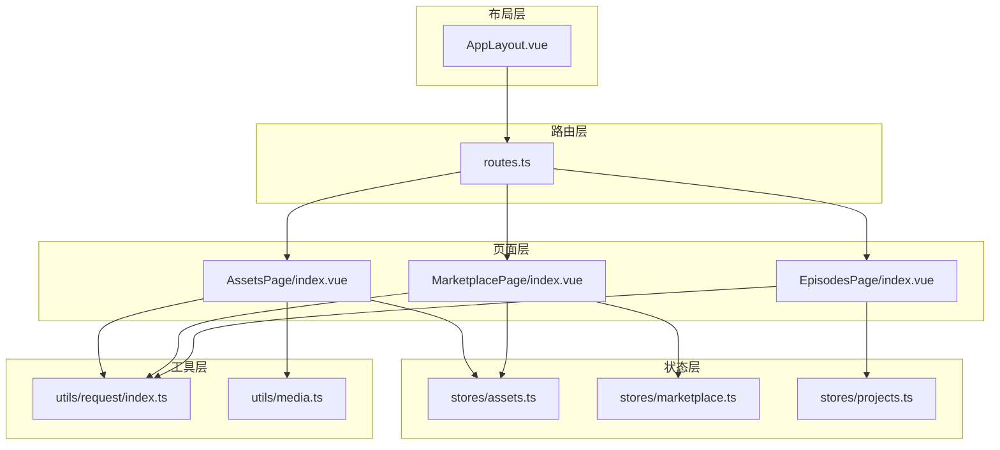
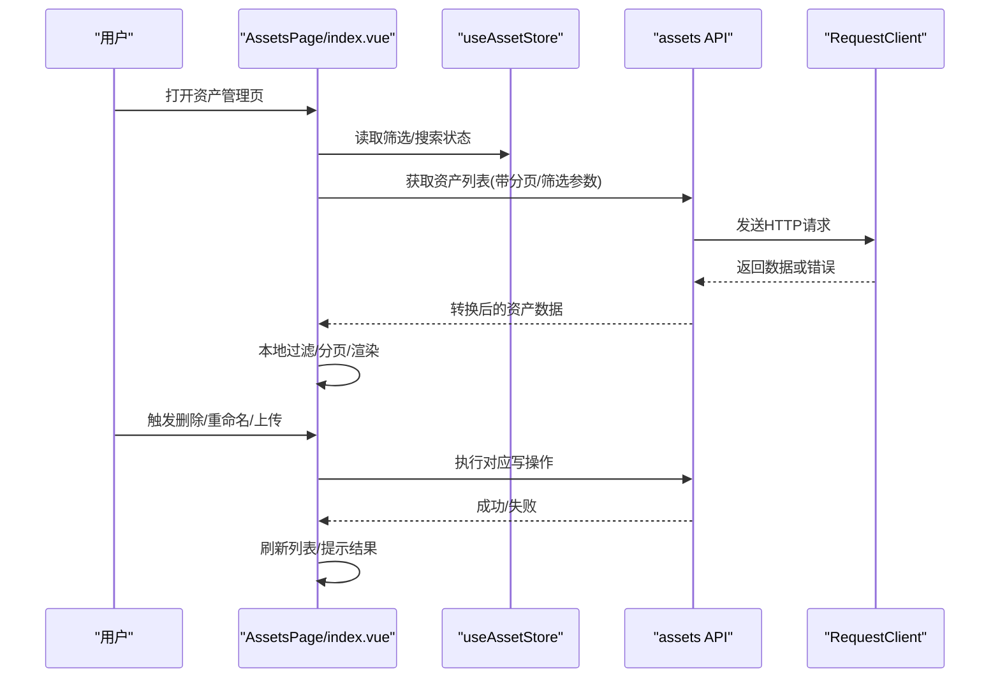
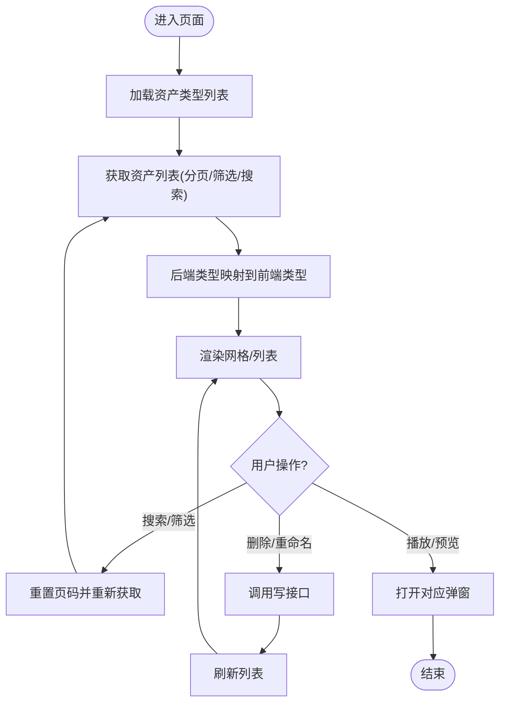
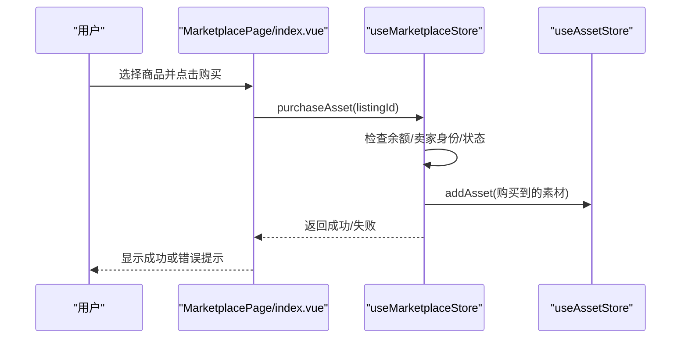
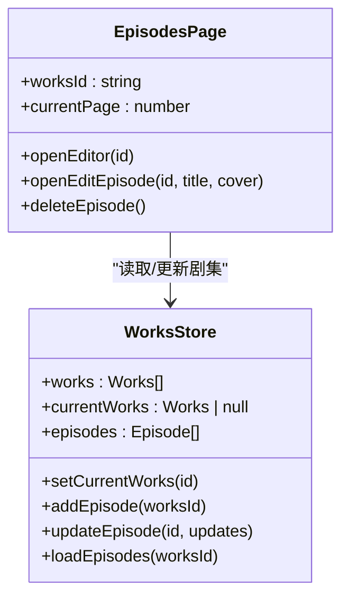
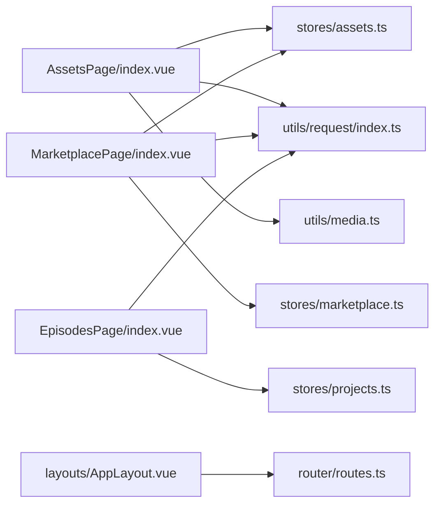

# 页面级组件

<cite>
**本文引用的文件**   
- [frontend/src/views/AssetsPage/index.vue](file://frontend/src/views/AssetsPage/index.vue)
- [frontend/src/views/MarketplacePage/index.vue](file://frontend/src/views/MarketplacePage/index.vue)
- [frontend/src/views/EpisodesPage/index.vue](file://frontend/src/views/EpisodesPage/index.vue)
- [frontend/src/layouts/AppLayout.vue](file://frontend/src/layouts/AppLayout.vue)
- [frontend/src/router/routes.ts](file://frontend/src/router/routes.ts)
- [frontend/src/stores/assets.ts](file://frontend/src/stores/assets.ts)
- [frontend/src/stores/marketplace.ts](file://frontend/src/stores/marketplace.ts)
- [frontend/src/stores/projects.ts](file://frontend/src/stores/projects.ts)
- [frontend/src/utils/request/index.ts](file://frontend/src/utils/request/index.ts)
- [frontend/src/utils/media.ts](file://frontend/src/utils/media.ts)
- [frontend/src/views/AssetsPage/components/AssetGrid.vue](file://frontend/src/views/AssetsPage/components/AssetGrid.vue)
- [frontend/src/views/AssetsPage/components/AssetList.vue](file://frontend/src/views/AssetsPage/components/AssetList.vue)
- [frontend/src/views/MarketplacePage/components/MarketListingsGrid.vue](file://frontend/src/views/MarketplacePage/components/MarketListingsGrid.vue)
- [frontend/src/views/EpisodesPage/components/EpisodeGrid.vue](file://frontend/src/views/EpisodesPage/components/EpisodeGrid.vue)
</cite>

## 目录
1. [简介](#简介)
2. [项目结构](#项目结构)
3. [核心组件](#核心组件)
4. [架构总览](#架构总览)
5. [详细组件分析](#详细组件分析)
6. [依赖关系分析](#依赖关系分析)
7. [性能与优化](#性能与优化)
8. [故障排查指南](#故障排查指南)
9. [结论](#结论)

## 简介
本文件聚焦于大型页面级组件的架构设计与实现，覆盖以下关键页面：
- AssetsPage 资产管理页面
- MarketplacePage 市场页面
- EpisodesPage 剧集管理页面
- AppLayout 应用布局

文档从数据获取、状态管理、路由集成、权限控制、响应式适配等维度深入解析，并给出性能优化策略（懒加载、缓存、错误处理）与可视化架构图。

## 项目结构
前端采用 Vue 3 + TypeScript + Pinia + Vue Router 的组合，页面按功能域组织在 views 目录下，布局位于 layouts，状态集中在 stores，网络请求封装在 utils/request。

图表来源
- [frontend/src/layouts/AppLayout.vue:1-50](file://frontend/src/layouts/AppLayout.vue#L1-L50)
- [frontend/src/router/routes.ts:1-110](file://frontend/src/router/routes.ts#L1-L110)
- [frontend/src/views/AssetsPage/index.vue:1-473](file://frontend/src/views/AssetsPage/index.vue#L1-L473)
- [frontend/src/views/MarketplacePage/index.vue:1-196](file://frontend/src/views/MarketplacePage/index.vue#L1-L196)
- [frontend/src/views/EpisodesPage/index.vue:1-115](file://frontend/src/views/EpisodesPage/index.vue#L1-L115)
- [frontend/src/stores/assets.ts:1-161](file://frontend/src/stores/assets.ts#L1-L161)
- [frontend/src/stores/marketplace.ts:1-334](file://frontend/src/stores/marketplace.ts#L1-L334)
- [frontend/src/stores/projects.ts:1-279](file://frontend/src/stores/projects.ts#L1-L279)
- [frontend/src/utils/request/index.ts:1-237](file://frontend/src/utils/request/index.ts#L1-L237)
- [frontend/src/utils/media.ts:1-55](file://frontend/src/utils/media.ts#L1-L55)

章节来源
- [frontend/src/router/routes.ts:1-110](file://frontend/src/router/routes.ts#L1-L110)
- [frontend/src/layouts/AppLayout.vue:1-50](file://frontend/src/layouts/AppLayout.vue#L1-L50)

## 核心组件
- AssetsPage：资产列表、筛选、搜索、批量操作、预览与媒体播放、上传与重命名、分页。
- MarketplacePage：商品展示、筛选与排序、购买流程、交易记录、价格编辑、我的上架。
- EpisodesPage：作品与剧集管理、分页、编辑与删除、跳转至创建流程。
- AppLayout：侧边栏、顶栏、主内容区滚动重置、页面过渡动画。

章节来源
- [frontend/src/views/AssetsPage/index.vue:1-473](file://frontend/src/views/AssetsPage/index.vue#L1-L473)
- [frontend/src/views/MarketplacePage/index.vue:1-196](file://frontend/src/views/MarketplacePage/index.vue#L1-L196)
- [frontend/src/views/EpisodesPage/index.vue:1-115](file://frontend/src/views/EpisodesPage/index.vue#L1-L115)
- [frontend/src/layouts/AppLayout.vue:1-50](file://frontend/src/layouts/AppLayout.vue#L1-L50)

## 架构总览
页面级组件遵循“视图-状态-服务”分层：
- 视图层：负责 UI 渲染与用户交互，通过事件与 props 与子组件通信。
- 状态层：Pinia store 集中管理业务状态与计算属性，提供增删改查方法。
- 服务层：API 调用封装在 api 模块，统一由 request 客户端发起，附带拦截器与错误处理。

图表来源
- [frontend/src/views/AssetsPage/index.vue:76-105](file://frontend/src/views/AssetsPage/index.vue#L76-L105)
- [frontend/src/utils/request/index.ts:32-80](file://frontend/src/utils/request/index.ts#L32-L80)

## 详细组件分析

### AssetsPage 资产管理页面
- 数据获取
  - 使用 getAssetList 接口拉取分页数据，结合 activeFilter 与 searchQuery 构建查询参数。
  - 将后端类型映射为前端 AssetType，统一数据结构。
- 状态管理
  - 使用 useAssetStore 维护筛选条件与搜索词；页面内维护本地分页与选中项。
- 路由集成
  - 跳转到生成资产页 assets-generate。
- 权限控制
  - 当前未实现显式鉴权逻辑，可在路由守卫或请求拦截器中补充。
- 响应式适配
  - 网格/列表双视图切换，标签与缩略图在小屏下自适应。
- 交互与弹窗
  - 预览、音频/视频播放器、上传、重命名、批量删除确认。

图表来源
- [frontend/src/views/AssetsPage/index.vue:127-145](file://frontend/src/views/AssetsPage/index.vue#L127-L145)
- [frontend/src/views/AssetsPage/index.vue:76-105](file://frontend/src/views/AssetsPage/index.vue#L76-L105)
- [frontend/src/views/AssetsPage/index.vue:226-275](file://frontend/src/views/AssetsPage/index.vue#L226-L275)

章节来源
- [frontend/src/views/AssetsPage/index.vue:1-473](file://frontend/src/views/AssetsPage/index.vue#L1-L473)
- [frontend/src/views/AssetsPage/components/AssetGrid.vue:1-97](file://frontend/src/views/AssetsPage/components/AssetGrid.vue#L1-L97)
- [frontend/src/views/AssetsPage/components/AssetList.vue:1-108](file://frontend/src/views/AssetsPage/components/AssetList.vue#L1-L108)
- [frontend/src/stores/assets.ts:1-161](file://frontend/src/stores/assets.ts#L1-L161)
- [frontend/src/utils/media.ts:1-55](file://frontend/src/utils/media.ts#L1-L55)

### MarketplacePage 市场页面
- 数据与状态
  - 使用 marketplace store 管理 listings、transactions、wallet 与筛选/排序/价格区间。
  - filteredListings 计算属性综合多条件过滤与排序。
- 交互流程
  - 搜索、排序、筛选后重置页码；点击商品进入预览/购买；支持点赞与价格编辑。
- 购买流程
  - 校验余额与卖家身份，扣减余额、更新交易记录、将素材加入个人资产库。

图表来源
- [frontend/src/views/MarketplacePage/index.vue:69-81](file://frontend/src/views/MarketplacePage/index.vue#L69-L81)
- [frontend/src/stores/marketplace.ts:254-293](file://frontend/src/stores/marketplace.ts#L254-L293)
- [frontend/src/stores/assets.ts:115-122](file://frontend/src/stores/assets.ts#L115-L122)

章节来源
- [frontend/src/views/MarketplacePage/index.vue:1-196](file://frontend/src/views/MarketplacePage/index.vue#L1-L196)
- [frontend/src/views/MarketplacePage/components/MarketListingsGrid.vue:1-87](file://frontend/src/views/MarketplacePage/components/MarketListingsGrid.vue#L1-L87)
- [frontend/src/stores/marketplace.ts:1-334](file://frontend/src/stores/marketplace.ts#L1-L334)

### EpisodesPage 剧集管理页面
- 路由与上下文
  - 从 query.work_id 设置当前作品，加载其剧集列表。
- 状态管理
  - 使用 projects store 管理 works 与 episodes，提供新增/更新/删除等方法。
- 分页与交互
  - 本地分页，当总页数减少时自动修正当前页；支持编辑标题与封面、删除确认。

图表来源
- [frontend/src/stores/projects.ts:165-185](file://frontend/src/stores/projects.ts#L165-L185)
- [frontend/src/views/EpisodesPage/index.vue:20-22](file://frontend/src/views/EpisodesPage/index.vue#L20-L22)
- [frontend/src/views/EpisodesPage/components/EpisodeGrid.vue:1-35](file://frontend/src/views/EpisodesPage/components/EpisodeGrid.vue#L1-L35)

章节来源
- [frontend/src/views/EpisodesPage/index.vue:1-115](file://frontend/src/views/EpisodesPage/index.vue#L1-L115)
- [frontend/src/stores/projects.ts:1-279](file://frontend/src/stores/projects.ts#L1-L279)

### AppLayout 应用布局
- 布局结构
  - 左侧导航、顶部栏、主内容区滚动容器。
- 路由联动
  - 监听路由变化，切换页面时将主内容区滚动至顶部。
- 页面过渡
  - 使用 transition 包裹 router-view，实现淡入淡出与位移效果。

章节来源
- [frontend/src/layouts/AppLayout.vue:1-50](file://frontend/src/layouts/AppLayout.vue#L1-L50)
- [frontend/src/router/routes.ts:11-68](file://frontend/src/router/routes.ts#L11-L68)

## 依赖关系分析
- 页面与 Store 的耦合
  - AssetsPage 依赖 assets store 与 assets API；MarketplacePage 依赖 marketplace store 与 assets store；EpisodesPage 依赖 projects store。
- 页面与工具
  - 媒体类型判断与时间格式化在 media.ts；网络请求通过 RequestClient 统一封装。
- 路由与布局
  - routes.ts 定义所有页面路由，AppLayout 作为根布局承载子路由。

图表来源
- [frontend/src/views/AssetsPage/index.vue:1-473](file://frontend/src/views/AssetsPage/index.vue#L1-L473)
- [frontend/src/views/MarketplacePage/index.vue:1-196](file://frontend/src/views/MarketplacePage/index.vue#L1-L196)
- [frontend/src/views/EpisodesPage/index.vue:1-115](file://frontend/src/views/EpisodesPage/index.vue#L1-L115)
- [frontend/src/layouts/AppLayout.vue:1-50](file://frontend/src/layouts/AppLayout.vue#L1-L50)
- [frontend/src/router/routes.ts:1-110](file://frontend/src/router/routes.ts#L1-L110)
- [frontend/src/stores/assets.ts:1-161](file://frontend/src/stores/assets.ts#L1-L161)
- [frontend/src/stores/marketplace.ts:1-334](file://frontend/src/stores/marketplace.ts#L1-L334)
- [frontend/src/stores/projects.ts:1-279](file://frontend/src/stores/projects.ts#L1-L279)
- [frontend/src/utils/request/index.ts:1-237](file://frontend/src/utils/request/index.ts#L1-L237)
- [frontend/src/utils/media.ts:1-55](file://frontend/src/utils/media.ts#L1-L55)

## 性能与优化
- 懒加载
  - 路由级按需加载：routes.ts 中使用动态 import 实现页面级懒加载，降低首屏体积。
- 图片与媒体
  - 图片加载失败统一处理 onImgError；视频首帧截图使用 getVideoFirstFrame 生成预览，避免直接播放大资源。
- 分页与虚拟滚动
  - 当前使用服务端分页（AssetsPage）与前端分页（MarketplacePage、EpisodesPage）。建议在大列表场景引入虚拟滚动以优化渲染性能。
- 缓存机制
  - 建议在请求层增加基于 key 的内存缓存（如 LRU），对热点数据（如资产类型列表）进行短期缓存，减少重复请求。
- 防抖与节流
  - 搜索输入可加防抖，避免频繁触发过滤与请求。
- 错误处理
  - 使用 RequestClient 的拦截器统一处理错误；页面层对异常进行友好提示并提供重试入口。

[本节为通用指导，不直接分析具体文件]

## 故障排查指南
- 网络请求失败
  - 检查 RequestClient 的拦截器配置与白名单规则；确认 Token 是否注入。
- 媒体无法播放
  - 检查 isAudioAsset/isVideoAsset 判断逻辑与媒体 URL 有效性；跨域问题需确保服务端允许 CORS。
- 列表为空
  - 检查筛选条件与搜索词是否正确传递；确认后端返回的分页字段与前端期望一致。
- 路由跳转异常
  - 核对 routes.ts 中的 name 与 path 是否与 router.push 一致；注意嵌套路由的 children 层级。

章节来源
- [frontend/src/utils/request/index.ts:46-58](file://frontend/src/utils/request/index.ts#L46-L58)
- [frontend/src/utils/media.ts:9-15](file://frontend/src/utils/media.ts#L9-L15)
- [frontend/src/views/AssetsPage/index.vue:76-105](file://frontend/src/views/AssetsPage/index.vue#L76-L105)
- [frontend/src/router/routes.ts:1-110](file://frontend/src/router/routes.ts#L1-L110)

## 结论
本仓库的页面级组件采用清晰的“视图-状态-服务”分层，配合 Pinia 与 Vue Router 实现了良好的可维护性与扩展性。AssetsPage、MarketplacePage、EpisodesPage 均具备完善的筛选、搜索、分页与交互能力；AppLayout 提供了统一的布局与页面过渡体验。后续可在权限控制、缓存与虚拟滚动等方面进一步增强，以提升安全性与大规模数据的渲染性能。