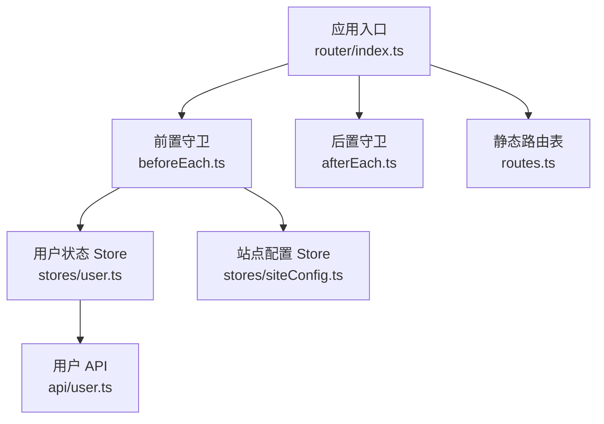
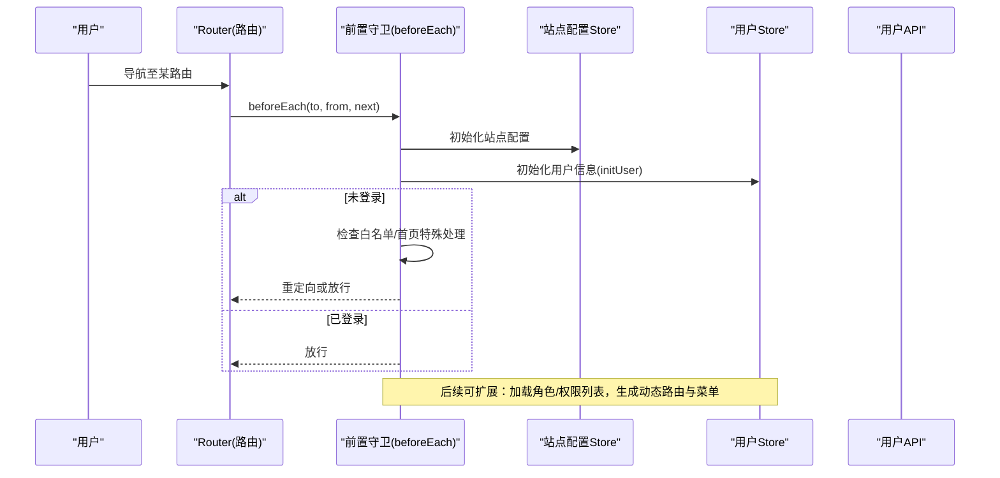
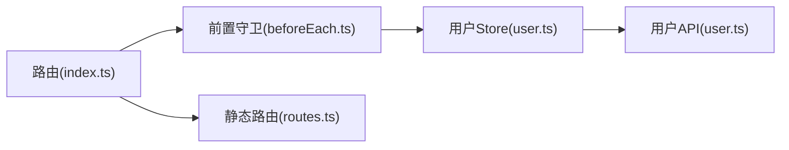
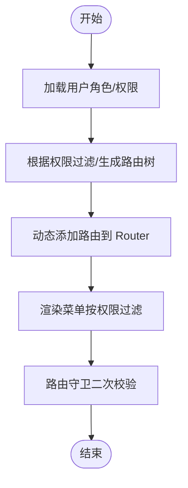

# 权限控制

<cite>
**本文引用的文件**   
- [frontend/src/router/guards/beforeEach.ts](file://frontend/src/router/guards/beforeEach.ts)
- [frontend/src/router/index.ts](file://frontend/src/router/index.ts)
- [frontend/src/router/routes.ts](file://frontend/src/router/routes.ts)
- [frontend/src/stores/user.ts](file://frontend/src/stores/user.ts)
- [frontend/src/api/user.ts](file://frontend/src/api/user.ts)
</cite>

## 目录
1. [简介](#简介)
2. [项目结构](#项目结构)
3. [核心组件](#核心组件)
4. [架构总览](#架构总览)
5. [详细组件分析](#详细组件分析)
6. [依赖分析](#依赖分析)
7. [性能考虑](#性能考虑)
8. [故障排查指南](#故障排查指南)
9. [结论](#结论)
10. [附录](#附录)

## 简介
本文件围绕前端侧的“权限控制”进行系统化说明，聚焦以下目标：
- 基于角色的访问控制（RBAC）落地方案与数据结构设计
- 动态路由生成与菜单权限过滤
- 按钮级权限控制
- 用户权限数据的获取、缓存与持久化
- 权限判断逻辑与变更响应式更新
- 多级权限与细粒度访问控制的实现示例路径

当前仓库已具备登录态校验、白名单放行、移动端分流等基础能力。RBAC 的完整链路（后端角色/权限数据 + 前端动态路由/菜单/按钮控制）尚未完全实现，本文在现有代码基础上给出可落地的扩展设计与集成点，并标注具体源码位置以便对照实现。

## 项目结构
前端权限相关的关键位置如下：
- 路由守卫：负责未登录拦截、白名单放行、移动端分流、初始化站点配置与用户信息
- 路由表：静态路由定义，包含 meta 字段用于标题、是否隐藏导航等
- 用户状态管理：维护登录态、用户信息、Token 持久化、用户资料操作
- API 层：封装用户认证与信息接口

图表来源
- [frontend/src/router/index.ts:1-15](file://frontend/src/router/index.ts#L1-L15)
- [frontend/src/router/guards/beforeEach.ts:1-54](file://frontend/src/router/guards/beforeEach.ts#L1-L54)
- [frontend/src/stores/user.ts:1-327](file://frontend/src/stores/user.ts#L1-L327)
- [frontend/src/api/user.ts:1-226](file://frontend/src/api/user.ts#L1-L226)
- [frontend/src/router/routes.ts:1-110](file://frontend/src/router/routes.ts#L1-L110)

章节来源
- [frontend/src/router/index.ts:1-15](file://frontend/src/router/index.ts#L1-L15)
- [frontend/src/router/guards/beforeEach.ts:1-54](file://frontend/src/router/guards/beforeEach.ts#L1-L54)
- [frontend/src/router/routes.ts:1-110](file://frontend/src/router/routes.ts#L1-L110)
- [frontend/src/stores/user.ts:1-327](file://frontend/src/stores/user.ts#L1-L327)
- [frontend/src/api/user.ts:1-226](file://frontend/src/api/user.ts#L1-L226)

## 核心组件
- 路由前置守卫
  - 功能：移动端分流、白名单放行、未登录拦截、初始化站点配置与用户信息
  - 关键点：NO_AUTH_ROUTES 白名单集合；isLoggedIn 判定；事件总线触发登录弹窗
- 用户状态管理
  - 功能：Token 存取、initUser 初始化、登录/登出、用户信息更新
  - 关键点：localStorage 持久化 token；并发 initPromise 防抖；错误时清理本地状态
- 用户 API
  - 功能：登录、注册、获取用户信息、修改资料、退出登录等
  - 关键点：统一通过 request 发起请求，返回类型明确

章节来源
- [frontend/src/router/guards/beforeEach.ts:15-52](file://frontend/src/router/guards/beforeEach.ts#L15-L52)
- [frontend/src/stores/user.ts:38-85](file://frontend/src/stores/user.ts#L38-L85)
- [frontend/src/stores/user.ts:87-170](file://frontend/src/stores/user.ts#L87-L170)
- [frontend/src/api/user.ts:150-226](file://frontend/src/api/user.ts#L150-L226)

## 架构总览
下图展示从路由导航到用户鉴权的核心流程，以及后续可扩展的 RBAC 接入点。

图表来源
- [frontend/src/router/index.ts:1-15](file://frontend/src/router/index.ts#L1-L15)
- [frontend/src/router/guards/beforeEach.ts:19-52](file://frontend/src/router/guards/beforeEach.ts#L19-L52)
- [frontend/src/stores/user.ts:54-85](file://frontend/src/stores/user.ts#L54-L85)
- [frontend/src/api/user.ts:160-169](file://frontend/src/api/user.ts#L160-L169)

## 详细组件分析

### 路由前置守卫（登录态与白名单）
- 行为要点
  - 移动端设备检测与跳转
  - NO_AUTH_ROUTES 白名单直接放行
  - 未登录时：首页弹出登录框并允许进入；其他页面跳转到首页并弹出登录框
  - 已登录则放行
- 扩展建议（RBAC）
  - 在已登录后增加“加载角色/权限”步骤，再根据权限生成动态路由与菜单
  - 将白名单策略与权限规则解耦，便于后期按角色/资源维度控制

章节来源
- [frontend/src/router/guards/beforeEach.ts:7-13](file://frontend/src/router/guards/beforeEach.ts#L7-L13)
- [frontend/src/router/guards/beforeEach.ts:15-52](file://frontend/src/router/guards/beforeEach.ts#L15-L52)

### 用户状态管理（登录态、Token 与用户信息）
- 关键职责
  - Token 持久化：saveToken/getToken/clearToken 使用 localStorage
  - 初始化：initUser 读取 token 并拉取用户信息，失败则清理本地状态
  - 登录/登出：成功后保存 token 并刷新用户信息；登出后清理本地状态
- 响应式更新
  - isLoggedIn、userInfo 均为响应式 ref，配合 computed 派生绑定状态
- 并发安全
  - initPromise 防止重复初始化

章节来源
- [frontend/src/stores/user.ts:38-85](file://frontend/src/stores/user.ts#L38-L85)
- [frontend/src/stores/user.ts:87-170](file://frontend/src/stores/user.ts#L87-L170)
- [frontend/src/stores/user.ts:300-326](file://frontend/src/stores/user.ts#L300-L326)

### 用户 API（认证与信息）
- 主要接口
  - 登录、手机/邮箱验证码登录、获取用户信息、退出登录、修改资料等
- 类型定义
  - LoginResult、UserInfo 等明确前后端契约

章节来源
- [frontend/src/api/user.ts:150-226](file://frontend/src/api/user.ts#L150-L226)
- [frontend/src/api/user.ts:4-42](file://frontend/src/api/user.ts#L4-L42)

### 静态路由表（meta 与布局）
- 特点
  - 使用 meta 描述页面标题、是否隐藏导航等
  - 子路由组织清晰，便于后续按模块拆分
- 扩展建议（RBAC）
  - 为每个路由增加权限标识（如 requiredRoles、requiredPermissions），由守卫或路由生成器统一解析

章节来源
- [frontend/src/router/routes.ts:1-110](file://frontend/src/router/routes.ts#L1-L110)

## 依赖分析
- 耦合关系
  - 路由守卫依赖用户 Store 与站点配置 Store
  - 用户 Store 依赖用户 API
  - 路由表提供静态路由元信息
- 潜在循环
  - 当前无循环依赖迹象
- 外部依赖
  - vue-router、pinia、request 封装

图表来源
- [frontend/src/router/index.ts:1-15](file://frontend/src/router/index.ts#L1-L15)
- [frontend/src/router/guards/beforeEach.ts:1-54](file://frontend/src/router/guards/beforeEach.ts#L1-L54)
- [frontend/src/stores/user.ts:1-327](file://frontend/src/stores/user.ts#L1-L327)
- [frontend/src/api/user.ts:1-226](file://frontend/src/api/user.ts#L1-L226)
- [frontend/src/router/routes.ts:1-110](file://frontend/src/router/routes.ts#L1-L110)

章节来源
- [frontend/src/router/index.ts:1-15](file://frontend/src/router/index.ts#L1-L15)
- [frontend/src/router/guards/beforeEach.ts:1-54](file://frontend/src/router/guards/beforeEach.ts#L1-L54)
- [frontend/src/stores/user.ts:1-327](file://frontend/src/stores/user.ts#L1-L327)
- [frontend/src/api/user.ts:1-226](file://frontend/src/api/user.ts#L1-L226)
- [frontend/src/router/routes.ts:1-110](file://frontend/src/router/routes.ts#L1-L110)

## 性能考虑
- 减少重复初始化：initPromise 避免并发多次拉取用户信息
- 路由懒加载：路由表已采用按需 import，降低首屏体积
- 权限数据缓存：建议在用户 Store 中缓存角色/权限列表，并在登录成功、权限变更后主动刷新
- 指令与计算属性：按钮级权限建议使用计算属性或自定义指令，避免频繁函数调用

[本节为通用建议，不直接分析具体文件]

## 故障排查指南
- 未登录被重定向
  - 检查 NO_AUTH_ROUTES 白名单是否包含目标路由 name
  - 确认用户 Store 的 isLoggedIn 是否为 true
- 登录后仍提示未登录
  - 检查 getToken 是否正确读取 localStorage
  - 检查 getUserInfo 是否成功返回用户信息
- 移动端误判
  - 检查 UA 与屏幕宽度、触摸能力检测逻辑
- 登出后状态未清理
  - 确认 logoutAction 是否执行 clearToken 与重置 userInfo

章节来源
- [frontend/src/router/guards/beforeEach.ts:15-52](file://frontend/src/router/guards/beforeEach.ts#L15-L52)
- [frontend/src/stores/user.ts:38-85](file://frontend/src/stores/user.ts#L38-L85)
- [frontend/src/stores/user.ts:144-170](file://frontend/src/stores/user.ts#L144-L170)

## 结论
当前前端已具备完善的登录态校验与基础路由守卫能力。为实现完整的 RBAC，建议在后端提供角色与权限数据，在前端完成：
- 登录后加载角色/权限并缓存
- 基于权限生成动态路由与菜单
- 在按钮级通过指令或计算属性控制可见/可用
- 在路由守卫中结合权限进行二次校验

以上扩展点均已在现有结构中预留了清晰的接入位置。

[本节为总结性内容，不直接分析具体文件]

## 附录

### RBAC 数据结构设计（建议）
- 角色与权限模型
  - 角色：id、name、code、description
  - 权限：id、name、code、type（menu/button/api）、resource、action
  - 用户-角色映射：user_id、role_id
  - 角色-权限映射：role_id、permission_id
- 用户信息扩展
  - 在 UserInfo 中增加 roles、permissions 字段，供前端直接使用
- 路由 meta 扩展
  - requiredRoles：数组，匹配任一即可
  - requiredPermissions：数组，需同时满足
  - hideInMenu：布尔值，用于菜单过滤

[本节为概念性设计，不直接分析具体文件]

### 动态路由生成流程（建议）

[本节为概念性流程图，不直接分析具体文件]

### 按钮级权限控制（建议）
- 自定义指令 v-permission
  - 支持传入单个权限码或权限码数组
  - 内部根据用户 permissions 集合判断显示/隐藏
- 计算属性方式
  - 在组件内暴露 hasPermission(code) 方法，结合 v-if/v-show 控制

[本节为概念性实现建议，不直接分析具体文件]

### 权限变更的响应式更新（建议）
- 在用户 Store 中暴露 refreshPermissions()
- 当后台权限变更时，调用该函数重新拉取并缓存
- 所有依赖权限的 UI 自动响应式更新

[本节为概念性实现建议，不直接分析具体文件]

### 权限状态持久化存储（建议）
- 仅持久化 token
- 角色/权限数据仅在内存缓存，避免与本地不同步问题
- 若确需持久化，建议以加密形式写入 sessionStorage/localStorage，并在每次登录成功后强制刷新

[本节为概念性实现建议，不直接分析具体文件]

### 多级权限与细粒度访问控制（示例路径）
- 路由级
  - 参考：[frontend/src/router/routes.ts:1-110](file://frontend/src/router/routes.ts#L1-L110)
  - 在 meta 中增加 requiredRoles/requiredPermissions，由守卫或路由生成器解析
- 菜单级
  - 在侧边栏组件中根据权限过滤菜单项
- 按钮级
  - 在业务组件中使用 v-permission 或 hasPermission 控制操作按钮

章节来源
- [frontend/src/router/routes.ts:1-110](file://frontend/src/router/routes.ts#L1-L110)