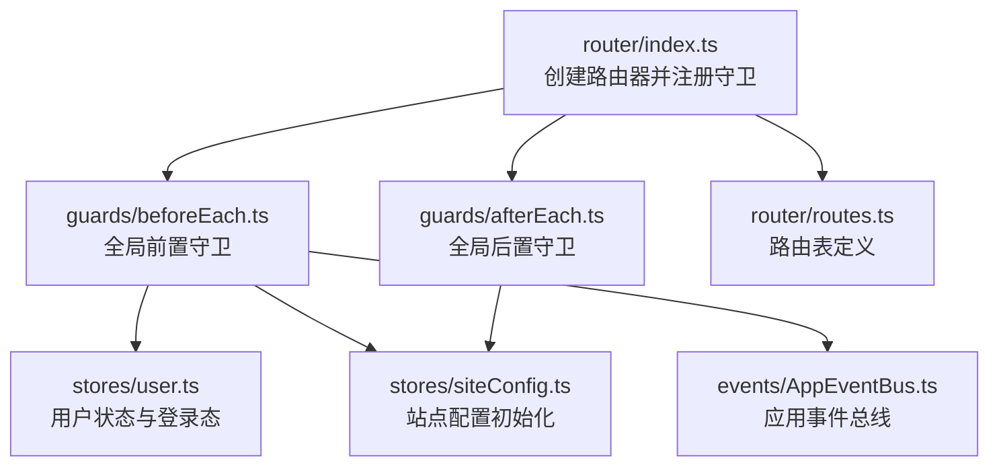
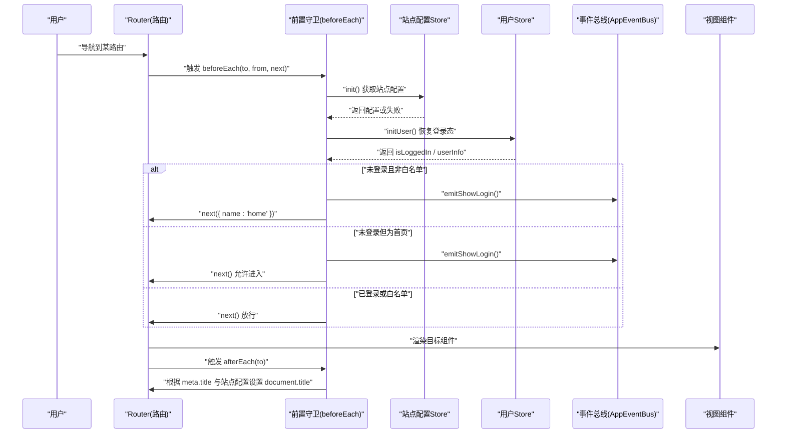
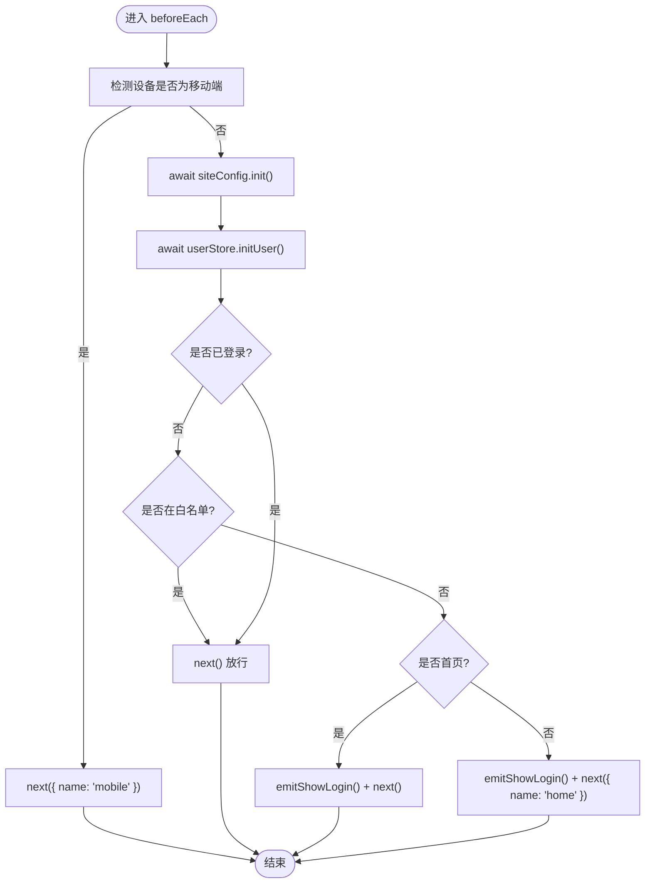
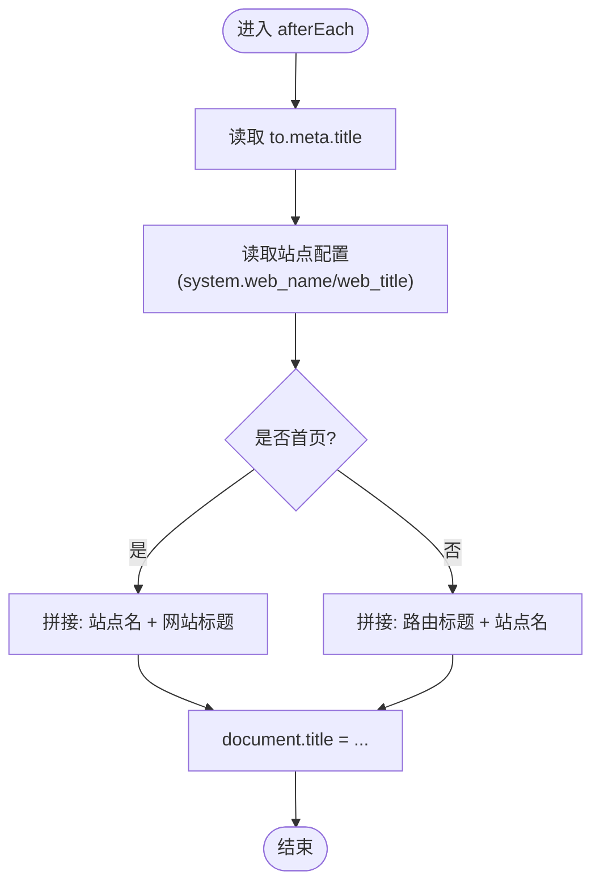
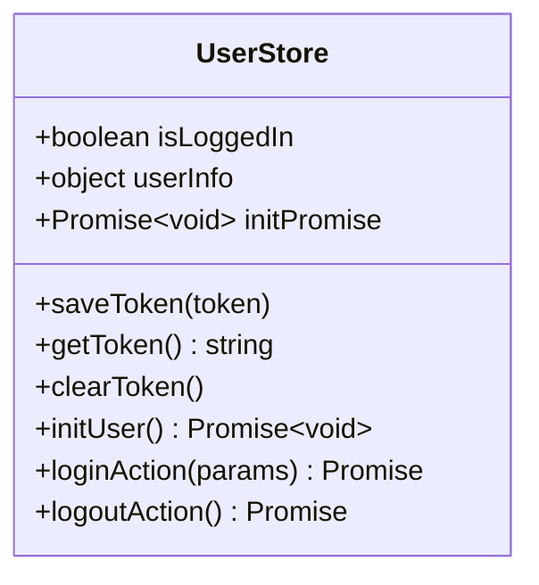
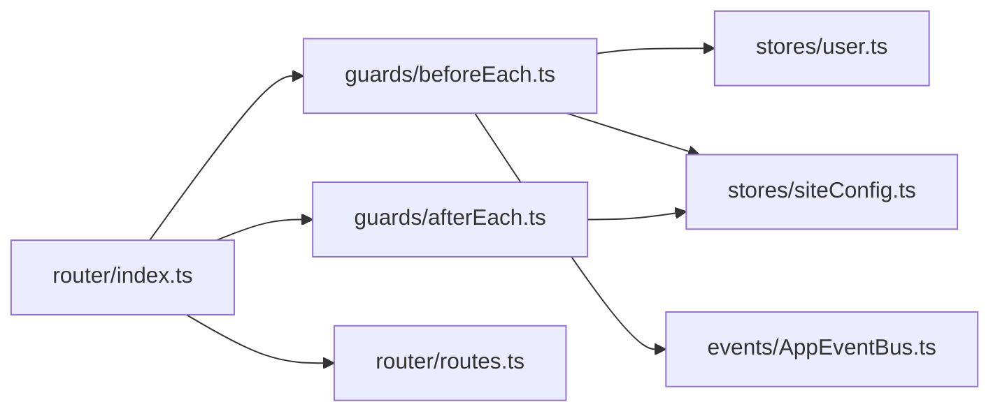

# 路由守卫

<cite>
**本文引用的文件**   
- [frontend/src/router/index.ts](file://frontend/src/router/index.ts)
- [frontend/src/router/guards/beforeEach.ts](file://frontend/src/router/guards/beforeEach.ts)
- [frontend/src/router/guards/afterEach.ts](file://frontend/src/router/guards/afterEach.ts)
- [frontend/src/router/routes.ts](file://frontend/src/router/routes.ts)
- [frontend/src/stores/user.ts](file://frontend/src/stores/user.ts)
- [frontend/src/stores/siteConfig.ts](file://frontend/src/stores/siteConfig.ts)
- [frontend/src/events/AppEventBus.ts](file://frontend/src/events/AppEventBus.ts)
</cite>

## 目录
1. [简介](#简介)
2. [项目结构](#项目结构)
3. [核心组件](#核心组件)
4. [架构总览](#架构总览)
5. [详细组件分析](#详细组件分析)
6. [依赖关系分析](#依赖关系分析)
7. [性能与并发特性](#性能与并发特性)
8. [故障排查指南](#故障排查指南)
9. [结论](#结论)
10. [附录：扩展实践示例](#附录扩展实践示例)

## 简介
本文件围绕前端路由守卫展开，聚焦全局前置守卫（beforeEach）与全局后置守卫（afterEach）的实现原理、执行顺序、异步处理与错误处理机制。结合本项目代码，说明登录状态检查、页面访问控制、导航拦截等核心能力，并给出可扩展的实践建议（如角色权限控制、页面访问日志记录）。

## 项目结构
路由相关代码集中在 router 目录下，包含路由配置、全局守卫注册以及具体守卫逻辑；用户状态与站点配置通过 Pinia store 提供；事件总线用于跨模块通信（例如触发登录弹窗）。

图表来源
- [frontend/src/router/index.ts:1-15](file://frontend/src/router/index.ts#L1-L15)
- [frontend/src/router/guards/beforeEach.ts:1-54](file://frontend/src/router/guards/beforeEach.ts#L1-L54)
- [frontend/src/router/guards/afterEach.ts:1-19](file://frontend/src/router/guards/afterEach.ts#L1-L19)
- [frontend/src/router/routes.ts:1-110](file://frontend/src/router/routes.ts#L1-L110)
- [frontend/src/stores/user.ts:1-327](file://frontend/src/stores/user.ts#L1-L327)
- [frontend/src/stores/siteConfig.ts:1-100](file://frontend/src/stores/siteConfig.ts#L1-L100)
- [frontend/src/events/AppEventBus.ts:1-109](file://frontend/src/events/AppEventBus.ts#L1-L109)

章节来源
- [frontend/src/router/index.ts:1-15](file://frontend/src/router/index.ts#L1-L15)
- [frontend/src/router/routes.ts:1-110](file://frontend/src/router/routes.ts#L1-L110)

## 核心组件
- 全局前置守卫（beforeEach）
  - 负责移动端设备检测与跳转、站点配置与用户信息初始化、未登录时的白名单放行与首页提示登录、其他页面重定向至首页并弹出登录框。
- 全局后置守卫（afterEach）
  - 负责根据目标路由 meta.title 与站点配置动态设置浏览器标题。
- 用户状态管理（user store）
  - 维护 isLoggedIn、userInfo、token 持久化、用户信息初始化与登录/登出流程。
- 站点配置管理（siteConfig store）
  - 负责从后端拉取站点配置，提供系统名称、网站标题等元数据。
- 应用事件总线（AppEventBus）
  - 提供 emitShowLogin 等方法，用于在任意位置触发“显示登录弹窗”的全局事件。

章节来源
- [frontend/src/router/guards/beforeEach.ts:1-54](file://frontend/src/router/guards/beforeEach.ts#L1-L54)
- [frontend/src/router/guards/afterEach.ts:1-19](file://frontend/src/router/guards/afterEach.ts#L1-L19)
- [frontend/src/stores/user.ts:1-327](file://frontend/src/stores/user.ts#L1-L327)
- [frontend/src/stores/siteConfig.ts:1-100](file://frontend/src/stores/siteConfig.ts#L1-L100)
- [frontend/src/events/AppEventBus.ts:1-109](file://frontend/src/events/AppEventBus.ts#L1-L109)

## 架构总览
以下时序图展示了首次进入受保护页面的完整流程：路由解析 -> 前置守卫 -> 初始化站点配置与用户信息 -> 登录态判断 -> 导航决策 -> 渲染页面 -> 后置守卫更新标题。

图表来源
- [frontend/src/router/guards/beforeEach.ts:19-52](file://frontend/src/router/guards/beforeEach.ts#L19-L52)
- [frontend/src/router/guards/afterEach.ts:5-17](file://frontend/src/router/guards/afterEach.ts#L5-L17)
- [frontend/src/stores/siteConfig.ts:17-29](file://frontend/src/stores/siteConfig.ts#L17-L29)
- [frontend/src/stores/user.ts:53-85](file://frontend/src/stores/user.ts#L53-L85)
- [frontend/src/events/AppEventBus.ts:91-94](file://frontend/src/events/AppEventBus.ts#L91-L94)

## 详细组件分析

### 全局前置守卫（beforeEach）
- 功能要点
  - 移动端设备检测：若命中移动端条件，则统一跳转到名为 mobile 的路由。
  - 站点配置与用户信息初始化：在每次导航前确保站点配置与用户信息可用。
  - 未登录策略：
    - 白名单路由直接放行。
    - 首页允许进入并弹出登录框。
    - 其他页面重定向至首页并弹出登录框。
  - 已登录或白名单：正常放行。
- 关键实现点
  - 使用 Set 维护无需登录的白名单路由名集合。
  - 通过 appEventBus.emitShowLogin() 触发登录弹窗事件。
  - 使用 next() 与 next({ name: '...' }) 控制导航行为。
- 执行顺序
  - 先进行移动端检测与跳过标记判断，再进行站点配置与用户信息初始化，最后进行登录态与白名单判断。
- 异步与错误处理
  - init() 与 initUser() 均为异步操作，守卫函数本身是 async，await 等待完成后再做后续判断。
  - 站点配置获取失败会打印错误但不中断流程；用户信息初始化失败会清除本地 token 并重置登录态。

图表来源
- [frontend/src/router/guards/beforeEach.ts:7-13](file://frontend/src/router/guards/beforeEach.ts#L7-L13)
- [frontend/src/router/guards/beforeEach.ts:15-52](file://frontend/src/router/guards/beforeEach.ts#L15-L52)
- [frontend/src/events/AppEventBus.ts:91-94](file://frontend/src/events/AppEventBus.ts#L91-L94)

章节来源
- [frontend/src/router/guards/beforeEach.ts:1-54](file://frontend/src/router/guards/beforeEach.ts#L1-L54)
- [frontend/src/stores/siteConfig.ts:17-29](file://frontend/src/stores/siteConfig.ts#L17-L29)
- [frontend/src/stores/user.ts:53-85](file://frontend/src/stores/user.ts#L53-L85)
- [frontend/src/events/AppEventBus.ts:91-94](file://frontend/src/events/AppEventBus.ts#L91-L94)

### 全局后置守卫（afterEach）
- 功能要点
  - 根据目标路由 meta.title 与站点配置中的系统名称、网站标题，组合生成最终 document.title。
  - 对首页与非首页采用不同的拼接规则，保证品牌一致性。
- 执行时机
  - 在路由成功解析并完成组件渲染后触发，适合用于副作用操作（如修改页面标题、埋点上报等）。
- 注意事项
  - 读取站点配置时注意可能为空的情况，需做降级处理。

图表来源
- [frontend/src/router/guards/afterEach.ts:5-17](file://frontend/src/router/guards/afterEach.ts#L5-L17)
- [frontend/src/stores/siteConfig.ts:17-29](file://frontend/src/stores/siteConfig.ts#L17-L29)

章节来源
- [frontend/src/router/guards/afterEach.ts:1-19](file://frontend/src/router/guards/afterEach.ts#L1-L19)
- [frontend/src/stores/siteConfig.ts:17-29](file://frontend/src/stores/siteConfig.ts#L17-L29)

### 用户状态管理（user store）
- 职责
  - 维护登录态（isLoggedIn）、用户信息（userInfo）、token 的持久化与清理。
  - 提供 initUser 方法，在页面刷新时尝试恢复登录态。
  - 提供登录、登出、绑定手机/邮箱、修改头像昵称等业务方法。
- 并发与幂等
  - initUser 内部使用 Promise 引用防止重复并发请求，提升性能与稳定性。
- 错误处理
  - 获取用户信息失败时，清除本地 token 并重置登录态，避免脏状态。

图表来源
- [frontend/src/stores/user.ts:8-85](file://frontend/src/stores/user.ts#L8-L85)
- [frontend/src/stores/user.ts:87-170](file://frontend/src/stores/user.ts#L87-L170)

章节来源
- [frontend/src/stores/user.ts:1-327](file://frontend/src/stores/user.ts#L1-L327)

### 站点配置管理（siteConfig store）
- 职责
  - 从后端拉取站点配置，缓存结果并提供便捷方法（如获取短信/邮件模板名称、货币名称与余额计算）。
- 初始化
  - init 方法在首次调用时发起请求，后续调用直接返回缓存结果。
- 错误处理
  - 请求失败仅记录错误日志，不阻断主流程。

章节来源
- [frontend/src/stores/siteConfig.ts:1-100](file://frontend/src/stores/siteConfig.ts#L1-L100)

### 应用事件总线（AppEventBus）
- 职责
  - 封装 window CustomEvent，提供通用 emit/on/off/once 方法与快捷方法（如 emitShowLogin）。
- 使用场景
  - 在路由守卫中触发“显示登录弹窗”，在 UI 层监听该事件以打开登录对话框。

章节来源
- [frontend/src/events/AppEventBus.ts:1-109](file://frontend/src/events/AppEventBus.ts#L1-L109)

## 依赖关系分析
- 路由入口 index.ts 负责创建路由器并注册两个全局守卫。
- beforeEach 依赖 user store、siteConfig store 与 AppEventBus。
- afterEach 依赖 siteConfig store。
- routes.ts 定义所有路由及 meta 字段，供守卫与后置守卫消费。

图表来源
- [frontend/src/router/index.ts:1-15](file://frontend/src/router/index.ts#L1-L15)
- [frontend/src/router/guards/beforeEach.ts:1-54](file://frontend/src/router/guards/beforeEach.ts#L1-L54)
- [frontend/src/router/guards/afterEach.ts:1-19](file://frontend/src/router/guards/afterEach.ts#L1-L19)
- [frontend/src/router/routes.ts:1-110](file://frontend/src/router/routes.ts#L1-L110)
- [frontend/src/stores/user.ts:1-327](file://frontend/src/stores/user.ts#L1-L327)
- [frontend/src/stores/siteConfig.ts:1-100](file://frontend/src/stores/siteConfig.ts#L1-L100)
- [frontend/src/events/AppEventBus.ts:1-109](file://frontend/src/events/AppEventBus.ts#L1-L109)

章节来源
- [frontend/src/router/index.ts:1-15](file://frontend/src/router/index.ts#L1-L15)
- [frontend/src/router/routes.ts:1-110](file://frontend/src/router/routes.ts#L1-L110)

## 性能与并发特性
- 站点配置与用户信息初始化
  - 使用 await 串行执行，确保后续判断基于最新状态。
  - user store 的 initUser 使用 Promise 引用去重，避免多次并发请求导致的状态不一致。
- 移动端检测
  - 纯前端判断，无网络开销，优先执行以减少不必要的初始化。
- 建议
  - 对于高频触发的复杂校验，可考虑将结果缓存或使用惰性加载。
  - 对耗时操作（如统计上报）建议使用微任务或 requestIdleCallback 降低阻塞。

[本节为通用性能建议，不直接分析具体文件]

## 故障排查指南
- 登录后仍被重定向到首页
  - 检查 user store 的 initUser 是否正确恢复 isLoggedIn 与 userInfo。
  - 确认 token 是否持久化成功，以及 getUserInfo 接口是否返回有效数据。
- 白名单路由无法访问
  - 核对 NO_AUTH_ROUTES 集合中是否包含目标路由 name。
  - 确认 routes.ts 中对应路由的 name 是否与白名单一致。
- 页面标题不正确
  - 检查 routes.ts 中 meta.title 是否设置。
  - 检查站点配置 system.web_name 与 system.web_title 是否存在。
- 移动端误判
  - 调整 isMobileDevice 的判断条件（UA、屏幕宽度、触摸支持）。
- 登录弹窗未出现
  - 确认 AppEventBus.emitShowLogin() 已被调用。
  - 确认 UI 层是否正确监听 app:show-login 事件。

章节来源
- [frontend/src/router/guards/beforeEach.ts:15-52](file://frontend/src/router/guards/beforeEach.ts#L15-L52)
- [frontend/src/stores/user.ts:53-85](file://frontend/src/stores/user.ts#L53-L85)
- [frontend/src/router/guards/afterEach.ts:5-17](file://frontend/src/router/guards/afterEach.ts#L5-L17)
- [frontend/src/events/AppEventBus.ts:91-94](file://frontend/src/events/AppEventBus.ts#L91-L94)

## 结论
本项目的前置守卫实现了移动端分流、站点配置与用户信息初始化、登录态校验与白名单放行、首页提示登录与重定向等核心能力；后置守卫负责页面标题的动态设置。整体设计清晰、职责单一，具备良好的扩展性。建议在需要时进一步引入角色权限控制与访问日志记录，以满足更复杂的业务需求。

[本节为总结性内容，不直接分析具体文件]

## 附录：扩展实践示例
以下为常见扩展能力的思路与落地建议（概念性说明，便于按需实现）：

- 用户认证增强
  - 在 beforeEach 中增加 token 过期时间校验，必要时主动刷新 token 或强制重新登录。
  - 参考路径：[frontend/src/stores/user.ts:53-85](file://frontend/src/stores/user.ts#L53-L85)

- 角色权限控制
  - 在 routes.ts 的 meta 中新增 roles 字段，在 beforeEach 中比对当前用户角色与路由要求，不满足则拒绝访问并重定向到“无权限页”。
  - 参考路径：[frontend/src/router/routes.ts:1-110](file://frontend/src/router/routes.ts#L1-L110)

- 页面访问日志记录
  - 在 afterEach 中收集 to/from 信息、时间戳、用户标识等，异步上报至日志服务。
  - 参考路径：[frontend/src/router/guards/afterEach.ts:5-17](file://frontend/src/router/guards/afterEach.ts#L5-L17)

- 导航拦截与二次确认
  - 在离开敏感页面（如编辑表单）时，使用 beforeRouteLeave 或全局守卫进行二次确认，防止误操作。
  - 参考路径：[frontend/src/router/guards/beforeEach.ts:19-52](file://frontend/src/router/guards/beforeEach.ts#L19-L52)

[本节为概念性指导，不直接分析具体文件]