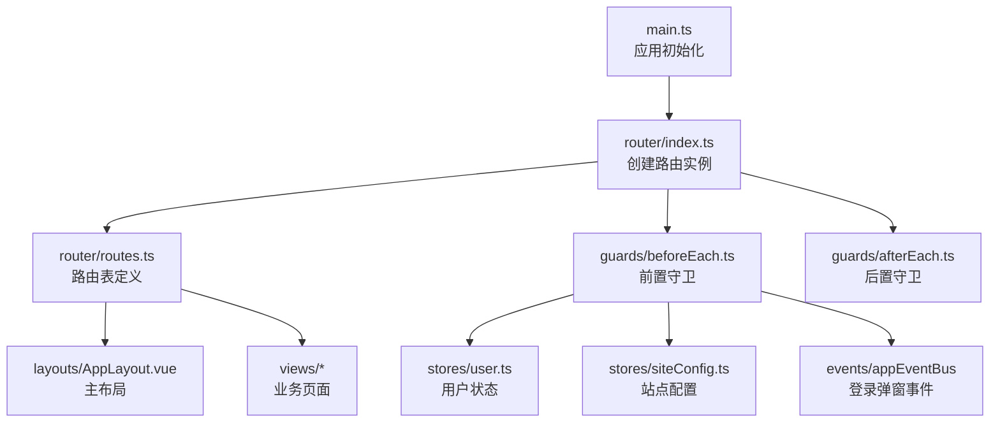
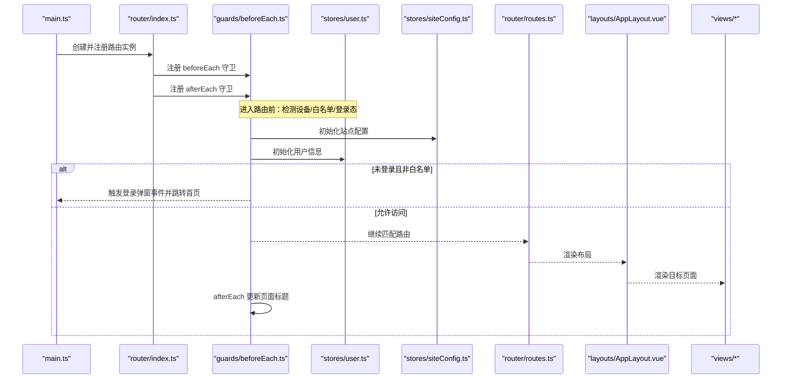
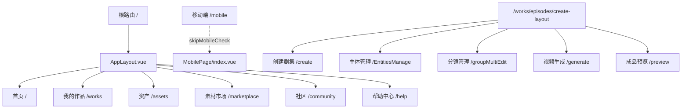
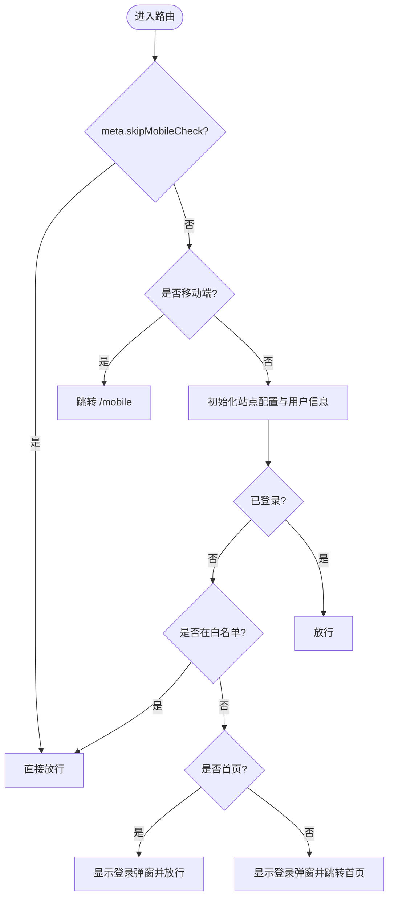
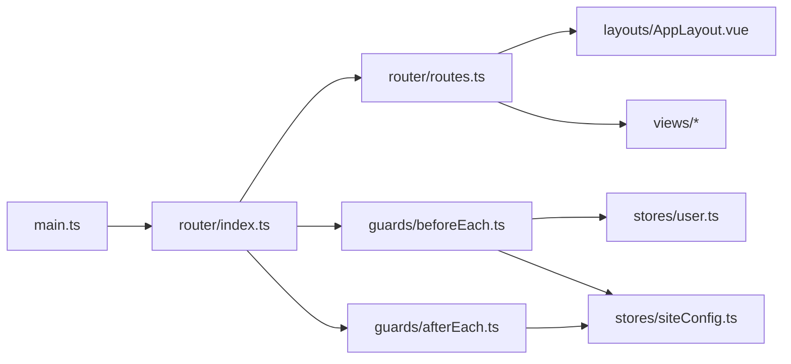

# 路由系统

<cite>
**本文引用的文件**   
- [frontend/src/router/index.ts](file://frontend/src/router/index.ts)
- [frontend/src/router/routes.ts](file://frontend/src/router/routes.ts)
- [frontend/src/router/guards/beforeEach.ts](file://frontend/src/router/guards/beforeEach.ts)
- [frontend/src/router/guards/afterEach.ts](file://frontend/src/router/guards/afterEach.ts)
- [frontend/src/layouts/AppLayout.vue](file://frontend/src/layouts/AppLayout.vue)
- [frontend/src/views/MobilePage/index.vue](file://frontend/src/views/MobilePage/index.vue)
- [frontend/src/stores/user.ts](file://frontend/src/stores/user.ts)
- [frontend/src/stores/siteConfig.ts](file://frontend/src/stores/siteConfig.ts)
- [frontend/src/main.ts](file://frontend/src/main.ts)
</cite>

## 目录
1. [简介](#简介)
2. [项目结构](#项目结构)
3. [核心组件](#核心组件)
4. [架构总览](#架构总览)
5. [详细组件分析](#详细组件分析)
6. [依赖关系分析](#依赖关系分析)
7. [性能与优化](#性能与优化)
8. [SEO 友好配置](#seo-友好配置)
9. [移动端适配](#移动端适配)
10. [调试技巧](#调试技巧)
11. [故障排查](#故障排查)
12. [结论](#结论)

## 简介
本文件围绕前端 Vue Router 的路由系统进行系统化文档化，覆盖路由配置、动态路由、嵌套路由、导航守卫、懒加载、权限控制、参数传递、元信息、页面标题策略、性能优化、SEO 友好、移动端适配与调试等主题。所有分析与建议均基于仓库中实际实现进行提炼与扩展说明。

## 项目结构
前端路由相关代码集中在 src/router 目录下，采用“入口 + 路由表 + 守卫”的清晰分层：
- 入口：创建 router 实例并挂载全局守卫
- 路由表：集中声明静态路由与懒加载组件
- 守卫：前置拦截（beforeEach）与后置处理（afterEach）
- 布局与视图：AppLayout 作为主布局容器，MobilePage 作为移动端兜底页

图表来源
- [frontend/src/main.ts:1-21](file://frontend/src/main.ts#L1-L21)
- [frontend/src/router/index.ts:1-15](file://frontend/src/router/index.ts#L1-L15)
- [frontend/src/router/routes.ts:1-110](file://frontend/src/router/routes.ts#L1-L110)
- [frontend/src/router/guards/beforeEach.ts:1-54](file://frontend/src/router/guards/beforeEach.ts#L1-L54)
- [frontend/src/router/guards/afterEach.ts:1-19](file://frontend/src/router/guards/afterEach.ts#L1-L19)
- [frontend/src/layouts/AppLayout.vue:1-50](file://frontend/src/layouts/AppLayout.vue#L1-L50)
- [frontend/src/stores/user.ts:1-327](file://frontend/src/stores/user.ts#L1-L327)
- [frontend/src/stores/siteConfig.ts:1-100](file://frontend/src/stores/siteConfig.ts#L1-L100)

章节来源
- [frontend/src/router/index.ts:1-15](file://frontend/src/router/index.ts#L1-L15)
- [frontend/src/router/routes.ts:1-110](file://frontend/src/router/routes.ts#L1-L110)
- [frontend/src/router/guards/beforeEach.ts:1-54](file://frontend/src/router/guards/beforeEach.ts#L1-L54)
- [frontend/src/router/guards/afterEach.ts:1-19](file://frontend/src/router/guards/afterEach.ts#L1-L19)
- [frontend/src/layouts/AppLayout.vue:1-50](file://frontend/src/layouts/AppLayout.vue#L1-L50)
- [frontend/src/views/MobilePage/index.vue:1-260](file://frontend/src/views/MobilePage/index.vue#L1-L260)
- [frontend/src/stores/user.ts:1-327](file://frontend/src/stores/user.ts#L1-L327)
- [frontend/src/stores/siteConfig.ts:1-100](file://frontend/src/stores/siteConfig.ts#L1-L100)
- [frontend/src/main.ts:1-21](file://frontend/src/main.ts#L1-L21)

## 核心组件
- 路由实例与历史模式
  - 使用 Hash 模式，便于部署到静态托管环境且无需服务端重写规则。
- 路由表组织
  - 根路径下包含多个子路由，统一由 AppLayout 包裹；另有独立移动端路由 /mobile 以及一个独立的 CreateLayout 流程路由组。
- 导航守卫
  - beforeEach：设备类型判断、白名单放行、未登录态处理、站点配置与用户信息预取。
  - afterEach：根据 meta.title 与站点配置动态设置 document.title。
- 懒加载
  - 所有页面组件均采用函数式 import() 按需加载，减少首屏体积。
- 布局与过渡
  - AppLayout 内使用 <transition mode="out-in"> 提供平滑切换体验，并在路由变化时滚动至顶部。

章节来源
- [frontend/src/router/index.ts:1-15](file://frontend/src/router/index.ts#L1-L15)
- [frontend/src/router/routes.ts:1-110](file://frontend/src/router/routes.ts#L1-L110)
- [frontend/src/router/guards/beforeEach.ts:1-54](file://frontend/src/router/guards/beforeEach.ts#L1-L54)
- [frontend/src/router/guards/afterEach.ts:1-19](file://frontend/src/router/guards/afterEach.ts#L1-L19)
- [frontend/src/layouts/AppLayout.vue:1-50](file://frontend/src/layouts/AppLayout.vue#L1-L50)

## 架构总览
下图展示了从应用启动到路由渲染的关键调用链与数据流。

图表来源
- [frontend/src/main.ts:1-21](file://frontend/src/main.ts#L1-L21)
- [frontend/src/router/index.ts:1-15](file://frontend/src/router/index.ts#L1-L15)
- [frontend/src/router/guards/beforeEach.ts:1-54](file://frontend/src/router/guards/beforeEach.ts#L1-L54)
- [frontend/src/router/guards/afterEach.ts:1-19](file://frontend/src/router/guards/afterEach.ts#L1-L19)
- [frontend/src/router/routes.ts:1-110](file://frontend/src/router/routes.ts#L1-L110)
- [frontend/src/layouts/AppLayout.vue:1-50](file://frontend/src/layouts/AppLayout.vue#L1-L50)

## 详细组件分析

### 路由实例与历史模式
- 使用 createWebHashHistory，适合静态部署场景，避免服务端重定向配置。
- 在实例化后统一注册前置与后置守卫，保证全局行为一致。

章节来源
- [frontend/src/router/index.ts:1-15](file://frontend/src/router/index.ts#L1-L15)

### 路由表与嵌套路由
- 根路由 / 下包含多个子路由，统一由 AppLayout 包裹，形成“框架+内容”的布局模式。
- 独立路由 /mobile 用于移动端提示与引导，通过 meta.skipMobileCheck 跳过设备检查。
- 独立路由组 /works/episodes/create-layout 作为多步骤流程的布局容器，子路由共享该布局并通过 meta.currentStep/pageTitle/backPath 管理步骤与返回逻辑。

图表来源
- [frontend/src/router/routes.ts:1-110](file://frontend/src/router/routes.ts#L1-L110)
- [frontend/src/layouts/AppLayout.vue:1-50](file://frontend/src/layouts/AppLayout.vue#L1-L50)
- [frontend/src/views/MobilePage/index.vue:1-260](file://frontend/src/views/MobilePage/index.vue#L1-L260)

章节来源
- [frontend/src/router/routes.ts:1-110](file://frontend/src/router/routes.ts#L1-L110)

### 前置守卫（权限与设备判断）
- 设备判断：综合 UA、屏幕宽度与触摸能力判定移动端，若命中则强制跳转到 /mobile。
- 白名单：help 路由无需登录即可访问。
- 未登录态：
  - 白名单直接放行；
  - 首页弹出登录框但允许访问；
  - 其他页面弹出登录框并跳转首页。
- 预取数据：在进入路由前异步初始化站点配置与用户信息，确保后续逻辑可用。

图表来源
- [frontend/src/router/guards/beforeEach.ts:1-54](file://frontend/src/router/guards/beforeEach.ts#L1-L54)
- [frontend/src/stores/siteConfig.ts:1-100](file://frontend/src/stores/siteConfig.ts#L1-L100)
- [frontend/src/stores/user.ts:1-327](file://frontend/src/stores/user.ts#L1-L327)

章节来源
- [frontend/src/router/guards/beforeEach.ts:1-54](file://frontend/src/router/guards/beforeEach.ts#L1-L54)

### 后置守卫（页面标题）
- 根据 to.meta.title 与站点配置中的 web_name/web_title 组合生成最终 document.title。
- 首页与非首页采用不同拼接策略，提升 SEO 与用户体验一致性。

章节来源
- [frontend/src/router/guards/afterEach.ts:1-19](file://frontend/src/router/guards/afterEach.ts#L1-L19)
- [frontend/src/stores/siteConfig.ts:1-100](file://frontend/src/stores/siteConfig.ts#L1-L100)

### 布局与页面过渡
- AppLayout 内部使用 <router-view v-slot="{ Component }"> 配合 <transition mode="out-in"> 实现页面切换动画。
- 监听 route.path 变化，将主内容区滚动至顶部，保持阅读体验一致。

章节来源
- [frontend/src/layouts/AppLayout.vue:1-50](file://frontend/src/layouts/AppLayout.vue#L1-L50)

### 移动端适配与兜底
- 路由层：对非 skipMobileCheck 的路由进行设备判断并跳转 /mobile。
- 页面层：MobilePage 在 mounted 中再次校验设备，若非移动端则替换为 home，防止误入。

章节来源
- [frontend/src/router/guards/beforeEach.ts:1-54](file://frontend/src/router/guards/beforeEach.ts#L1-L54)
- [frontend/src/views/MobilePage/index.vue:1-260](file://frontend/src/views/MobilePage/index.vue#L1-L260)

### 路由权限控制与白名单
- 白名单机制：通过 Set 维护无需登录的路由名集合，当前仅 help。
- 未登录态分流：首页允许访问并弹出登录框；其他页面先弹登录框再跳转首页。
- 可扩展点：可在 beforeEach 中接入角色/菜单权限校验，结合后端返回的权限列表进行细粒度控制。

章节来源
- [frontend/src/router/guards/beforeEach.ts:1-54](file://frontend/src/router/guards/beforeEach.ts#L1-L54)

### 参数传递与路由元信息
- 元信息 meta：
  - title：用于页面标题与 SEO。
  - currentStep/pageTitle/backPath：用于多步骤流程的 UI 展示与导航。
  - hideNav/skipMobileCheck：控制布局与设备检查行为。
- 参数传递：
  - 当前路由表未使用动态段或 query，如需支持可按需引入 params/query 方式。
  - 建议在 meta 中补充 requiredParams/validate 等字段以增强可维护性。

章节来源
- [frontend/src/router/routes.ts:1-110](file://frontend/src/router/routes.ts#L1-L110)

### 懒加载与首屏优化
- 所有页面组件使用函数式 import() 进行按需加载，显著降低首屏包体。
- 建议：
  - 对大型第三方库进一步拆分与延迟加载。
  - 对首屏关键资源进行预加载或预获取。

章节来源
- [frontend/src/router/routes.ts:1-110](file://frontend/src/router/routes.ts#L1-L110)

## 依赖关系分析
- main.ts 负责应用初始化，注册 Pinia、UI 组件库与路由。
- router/index.ts 导入路由表与守卫，创建实例并挂载。
- guards/beforeEach.ts 依赖 user 与 siteConfig store，必要时通过事件总线触发登录弹窗。
- guards/afterEach.ts 依赖 siteConfig store 读取站点名称与标题。
- routes.ts 通过懒加载引用各视图与布局。

图表来源
- [frontend/src/main.ts:1-21](file://frontend/src/main.ts#L1-L21)
- [frontend/src/router/index.ts:1-15](file://frontend/src/router/index.ts#L1-L15)
- [frontend/src/router/routes.ts:1-110](file://frontend/src/router/routes.ts#L1-L110)
- [frontend/src/router/guards/beforeEach.ts:1-54](file://frontend/src/router/guards/beforeEach.ts#L1-L54)
- [frontend/src/router/guards/afterEach.ts:1-19](file://frontend/src/router/guards/afterEach.ts#L1-L19)
- [frontend/src/stores/user.ts:1-327](file://frontend/src/stores/user.ts#L1-L327)
- [frontend/src/stores/siteConfig.ts:1-100](file://frontend/src/stores/siteConfig.ts#L1-L100)
- [frontend/src/layouts/AppLayout.vue:1-50](file://frontend/src/layouts/AppLayout.vue#L1-L50)

章节来源
- [frontend/src/main.ts:1-21](file://frontend/src/main.ts#L1-L21)
- [frontend/src/router/index.ts:1-15](file://frontend/src/router/index.ts#L1-L15)
- [frontend/src/router/routes.ts:1-110](file://frontend/src/router/routes.ts#L1-L110)
- [frontend/src/router/guards/beforeEach.ts:1-54](file://frontend/src/router/guards/beforeEach.ts#L1-L54)
- [frontend/src/router/guards/afterEach.ts:1-19](file://frontend/src/router/guards/afterEach.ts#L1-L19)
- [frontend/src/stores/user.ts:1-327](file://frontend/src/stores/user.ts#L1-L327)
- [frontend/src/stores/siteConfig.ts:1-100](file://frontend/src/stores/siteConfig.ts#L1-L100)
- [frontend/src/layouts/AppLayout.vue:1-50](file://frontend/src/layouts/AppLayout.vue#L1-L50)

## 性能与优化
- 路由层面
  - 继续使用函数式 import() 懒加载页面组件，避免一次性加载全部模块。
  - 对大型公共组件考虑按功能域拆分，进一步减小单包体积。
- 网络与数据
  - 在 beforeEach 中预取站点配置与用户信息，可减少页面首次渲染时的二次请求，但需注意并发与错误降级。
  - 对频繁访问的静态资源启用缓存策略。
- 交互体验
  - 利用 transition mode="out-in" 提供平滑过渡，注意避免过度动画导致卡顿。
  - 路由切换时自动滚动到顶部，提升长页面浏览体验。

[本节为通用优化建议，不直接分析具体文件]

## SEO 友好配置
- 当前使用 Hash 模式，不利于搜索引擎抓取完整 URL。若需要更好的 SEO：
  - 切换到 History 模式，并在服务端配置将所有未知路径回退到 index.html。
  - 在 afterEach 中根据 meta.title 与站点配置动态设置 document.title，当前已实现。
  - 为重要页面补充 meta description、canonical、Open Graph 等标签（可在布局或页面级注入）。
- 当前实现参考：
  - 页面标题动态拼接策略已在 afterEach 中实现。

章节来源
- [frontend/src/router/index.ts:1-15](file://frontend/src/router/index.ts#L1-L15)
- [frontend/src/router/guards/afterEach.ts:1-19](file://frontend/src/router/guards/afterEach.ts#L1-L19)

## 移动端适配
- 路由层设备判断：综合 UA、屏幕宽度与触摸能力，命中则跳转 /mobile。
- 页面层兜底：MobilePage 在 mounted 中再次校验，非移动端则替换为 home。
- 建议：
  - 将设备判断逻辑抽取为工具函数，便于复用与测试。
  - 针对移动端新增路由时，务必在 meta 中标注 skipMobileCheck 或合理设计跳转策略。

章节来源
- [frontend/src/router/guards/beforeEach.ts:1-54](file://frontend/src/router/guards/beforeEach.ts#L1-L54)
- [frontend/src/views/MobilePage/index.vue:1-260](file://frontend/src/views/MobilePage/index.vue#L1-L260)

## 调试技巧
- 浏览器开发者工具
  - Network：观察路由切换时懒加载模块的请求与耗时。
  - Performance：录制页面切换过程，定位卡顿点。
  - Application：查看 localStorage 中的 token 与用户信息，验证登录态流转。
- 日志与埋点
  - 在 beforeEach/afterEach 中打印 to/from.name、meta 关键字段，辅助定位跳转问题。
  - 对异常分支（如未登录、接口失败）增加告警或上报。
- 单元测试
  - 对设备判断函数、白名单逻辑、标题拼接逻辑编写用例，保障回归稳定性。

[本节为通用调试建议，不直接分析具体文件]

## 故障排查
- 常见问题
  - 移动端无法进入正常页面：检查路由 meta.skipMobileCheck 是否正确设置，确认设备判断条件是否符合预期。
  - 未登录被反复重定向：确认白名单是否包含目标路由名，检查用户初始化是否成功。
  - 页面标题不正确：检查 to.meta.title 是否存在，站点配置是否加载完成。
- 快速定位
  - 在 beforeEach 中打印 to.name 与 isLoggedIn 状态，确认守卫分支。
  - 在 afterEach 中打印最终 document.title，确认拼接结果。

章节来源
- [frontend/src/router/guards/beforeEach.ts:1-54](file://frontend/src/router/guards/beforeEach.ts#L1-L54)
- [frontend/src/router/guards/afterEach.ts:1-19](file://frontend/src/router/guards/afterEach.ts#L1-L19)
- [frontend/src/stores/user.ts:1-327](file://frontend/src/stores/user.ts#L1-L327)
- [frontend/src/stores/siteConfig.ts:1-100](file://frontend/src/stores/siteConfig.ts#L1-L100)

## 结论
本项目的前端路由系统采用清晰的“入口 + 路由表 + 守卫”分层，结合懒加载与布局过渡，具备良好的可维护性与扩展性。当前已实现设备判断、白名单放行、未登录态处理与动态标题等功能。后续可根据业务需求逐步引入动态路由、更细粒度的权限控制、SEO 友好的 History 模式与更完善的监控与调试体系。