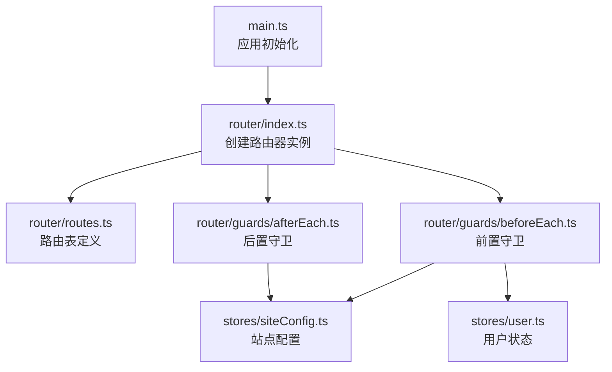
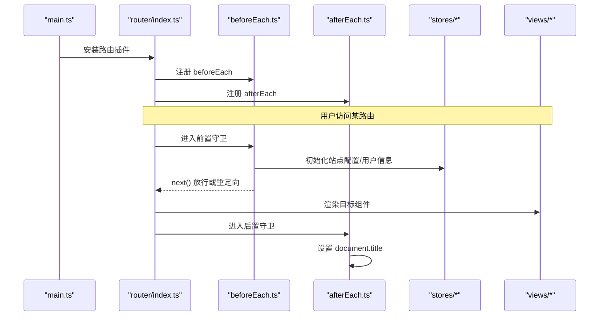
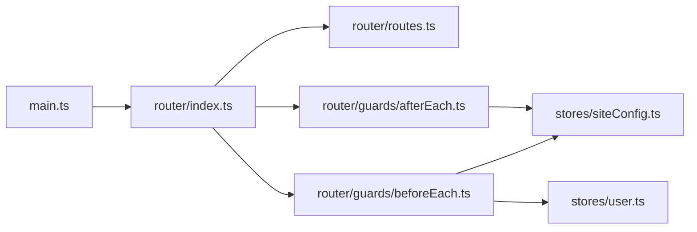

# 路由配置

<cite>
**本文引用的文件**   
- [frontend/src/router/index.ts](file://frontend/src/router/index.ts)
- [frontend/src/router/routes.ts](file://frontend/src/router/routes.ts)
- [frontend/src/router/guards/beforeEach.ts](file://frontend/src/router/guards/beforeEach.ts)
- [frontend/src/router/guards/afterEach.ts](file://frontend/src/router/guards/afterEach.ts)
- [frontend/src/main.ts](file://frontend/src/main.ts)
</cite>

## 目录
1. [简介](#简介)
2. [项目结构](#项目结构)
3. [核心组件](#核心组件)
4. [架构总览](#架构总览)
5. [详细组件分析](#详细组件分析)
6. [依赖关系分析](#依赖关系分析)
7. [性能与最佳实践](#性能与最佳实践)
8. [故障排查指南](#故障排查指南)
9. [结论](#结论)

## 简介
本文件聚焦前端 Vue Router 的路由配置与实现，围绕以下主题展开：
- 基础配置与历史模式
- 路由表结构与命名规范
- 嵌套路由与布局复用
- 动态路由参数（概念与示例）
- 路由元信息 meta 的使用
- 懒加载组件的实现方式
- 路由别名与重定向（概念与示例）
- 移动端适配与隐藏导航
- 全局守卫与页面标题设置
- 常见问题的定位与优化建议

## 项目结构
前端路由相关代码集中在 router 目录下，采用“入口 + 路由表 + 守卫”的清晰分层：
- 入口：创建路由器实例、注册历史模式、挂载守卫
- 路由表：集中定义所有路由、嵌套、元信息与懒加载
- 守卫：前置拦截（鉴权、设备检测）、后置处理（标题更新）
- 应用启动：在 main.ts 中安装路由插件并注册事件处理器

图表来源
- [frontend/src/main.ts:1-21](file://frontend/src/main.ts#L1-L21)
- [frontend/src/router/index.ts:1-15](file://frontend/src/router/index.ts#L1-L15)
- [frontend/src/router/routes.ts:1-110](file://frontend/src/router/routes.ts#L1-L110)
- [frontend/src/router/guards/beforeEach.ts:1-54](file://frontend/src/router/guards/beforeEach.ts#L1-L54)
- [frontend/src/router/guards/afterEach.ts:1-19](file://frontend/src/router/guards/afterEach.ts#L1-L19)

章节来源
- [frontend/src/main.ts:1-21](file://frontend/src/main.ts#L1-L21)
- [frontend/src/router/index.ts:1-15](file://frontend/src/router/index.ts#L1-L15)

## 核心组件
- 路由器实例与历史模式
  - 使用 Hash 历史模式，适合静态部署与简单场景。
  - 通过 createWebHashHistory 创建 history 对象并注入到路由器。
- 路由表
  - 以数组形式声明式定义路由，包含根级路由与子路由。
  - 大量使用函数式 import 实现组件懒加载。
  - 使用 meta 字段承载页面标题、步骤、是否隐藏导航等元信息。
- 前置守卫
  - 移动端设备检测与跳转至移动端页面。
  - 白名单免登录访问；未登录时首页弹出登录框，其他页跳转首页并弹出登录框。
  - 初始化站点配置与用户信息。
- 后置守卫
  - 根据当前路由 meta.title 与站点配置动态设置 document.title。

章节来源
- [frontend/src/router/index.ts:1-15](file://frontend/src/router/index.ts#L1-L15)
- [frontend/src/router/routes.ts:1-110](file://frontend/src/router/routes.ts#L1-L110)
- [frontend/src/router/guards/beforeEach.ts:1-54](file://frontend/src/router/guards/beforeEach.ts#L1-L54)
- [frontend/src/router/guards/afterEach.ts:1-19](file://frontend/src/router/guards/afterEach.ts#L1-L19)

## 架构总览
下图展示了从应用启动到路由匹配、守卫执行、页面渲染的整体流程。

图表来源
- [frontend/src/main.ts:1-21](file://frontend/src/main.ts#L1-L21)
- [frontend/src/router/index.ts:1-15](file://frontend/src/router/index.ts#L1-L15)
- [frontend/src/router/guards/beforeEach.ts:1-54](file://frontend/src/router/guards/beforeEach.ts#L1-L54)
- [frontend/src/router/guards/afterEach.ts:1-19](file://frontend/src/router/guards/afterEach.ts#L1-L19)

## 详细组件分析

### 路由器实例与历史模式
- 使用 createWebHashHistory 作为历史模式，便于静态托管与避免服务端配置。
- 将 routes 与 history 传入 createRouter，随后注册前后置守卫。

章节来源
- [frontend/src/router/index.ts:1-15](file://frontend/src/router/index.ts#L1-L15)

### 路由表结构与命名规范
- 根级路由
  - /mobile：移动端入口，跳过移动端检查，用于统一入口。
  - /：主布局容器，children 下为各功能模块。
- 子路由
  - 首页、我的作品、剧集管理、资产、生成资产、素材市场、社区、帮助中心等。
  - 发布成功页位于 works/episodes/publish-success 路径下。
- 独立工作流路由
  - /works/episodes/create-layout 作为独立布局，hideNav 隐藏导航，内部包含多步流程子路由。
- 命名规范
  - name 使用小写英文与短横线分隔，语义化表达业务含义，如 assets-generate、group-multi-edit。
  - path 使用小写英文与短横线，层级清晰，避免冗余前缀。

章节来源
- [frontend/src/router/routes.ts:1-110](file://frontend/src/router/routes.ts#L1-L110)

### 嵌套路由与布局复用
- 主布局 AppLayout.vue 包裹首页及主要功能模块，提供统一的顶部栏与侧边栏。
- 独立布局 CreateLayout.vue 用于剧集创建的完整流程，配合 hideNav 隐藏全局导航，突出步骤式体验。

章节来源
- [frontend/src/router/routes.ts:1-110](file://frontend/src/router/routes.ts#L1-L110)

### 动态路由参数（概念与示例）
- 当需要按 ID 展示详情时，可在 path 中使用 :id 占位符，并在组件内通过 route.params.id 获取。
- 示例（概念性）：
  - 路由定义：path: '/assets/:id'
  - 组件取值：const id = route.params.id
- 注意：若需对参数进行校验或类型转换，建议在守卫或组件初始化阶段完成。

[本节为通用概念说明，不直接分析具体文件]

### 路由元信息 meta 的使用
- title：用于页面标题显示，结合站点名称拼接。
- skipMobileCheck：跳过移动端检查，允许在移动端设备上直接访问特定路由。
- hideNav：隐藏全局导航，适用于全屏工作流或弹窗式页面。
- currentStep/pageTitle/backPath：用于多步流程的状态与导航控制。

章节来源
- [frontend/src/router/routes.ts:1-110](file://frontend/src/router/routes.ts#L1-L110)
- [frontend/src/router/guards/afterEach.ts:1-19](file://frontend/src/router/guards/afterEach.ts#L1-L19)

### 懒加载组件的实现方式
- 使用函数式 import 按需加载组件，减少首屏体积。
- 示例（概念性）：component: () => import('@/views/HomePage/index.vue')
- 优势：提升首屏性能，降低初始包大小。

章节来源
- [frontend/src/router/routes.ts:1-110](file://frontend/src/router/routes.ts#L1-L110)

### 路由别名与重定向（概念与示例）
- 别名 alias：为同一组件提供多个 URL 入口，便于兼容旧链接或 SEO。
  - 示例（概念性）：{ path: '/help', alias: '/support' }
- 重定向 redirect：将请求跳转到另一个路由，常用于版本迁移或统一入口。
  - 示例（概念性）：{ path: '/old-path', redirect: '/new-path' }
- 注意：重定向会触发新的路由解析与守卫流程，请谨慎使用以避免循环重定向。

[本节为通用概念说明，不直接分析具体文件]

### 移动端路由适配与隐藏导航
- 移动端适配
  - 前置守卫中检测设备 UA、屏幕宽度与触摸能力，满足条件则重定向到 /mobile。
  - 移动端路由 meta.skipMobileCheck 可跳过该检查。
- 隐藏导航
  - 在路由 meta.hideNav 为 true 时，布局层可根据该标志隐藏导航区域，提升沉浸感。

章节来源
- [frontend/src/router/guards/beforeEach.ts:1-54](file://frontend/src/router/guards/beforeEach.ts#L1-L54)
- [frontend/src/router/routes.ts:1-110](file://frontend/src/router/routes.ts#L1-L110)

### 鉴权与白名单策略
- 白名单：无需登录即可访问的路由集合，例如 help。
- 未登录行为：
  - 白名单路由：直接放行。
  - 首页：弹出登录框并允许访问。
  - 其他路由：弹出登录框并重定向到首页。
- 初始化顺序：先初始化站点配置，再初始化用户信息，确保后续逻辑可用。

章节来源
- [frontend/src/router/guards/beforeEach.ts:1-54](file://frontend/src/router/guards/beforeEach.ts#L1-54)

### 页面标题设置
- 后置守卫根据 to.meta.title 与站点配置拼接文档标题。
- 首页与非首页采用不同拼接规则，保证品牌名与页面名的合理组合。

章节来源
- [frontend/src/router/guards/afterEach.ts:1-19](file://frontend/src/router/guards/afterEach.ts#L1-19)

## 依赖关系分析
- 入口依赖
  - main.ts 引入 router 并安装，同时注册全局事件处理器。
- 路由实例依赖
  - index.ts 引入 routes 与两个守卫，创建路由器后注册守卫。
- 守卫依赖
  - beforeEach 依赖站点配置与用户状态 store，以及事件总线。
  - afterEach 依赖站点配置 store 以读取系统名称与标题。

图表来源
- [frontend/src/main.ts:1-21](file://frontend/src/main.ts#L1-L21)
- [frontend/src/router/index.ts:1-15](file://frontend/src/router/index.ts#L1-L15)
- [frontend/src/router/routes.ts:1-110](file://frontend/src/router/routes.ts#L1-L110)
- [frontend/src/router/guards/beforeEach.ts:1-54](file://frontend/src/router/guards/beforeEach.ts#L1-L54)
- [frontend/src/router/guards/afterEach.ts:1-19](file://frontend/src/router/guards/afterEach.ts#L1-L19)

章节来源
- [frontend/src/main.ts:1-21](file://frontend/src/main.ts#L1-L21)
- [frontend/src/router/index.ts:1-15](file://frontend/src/router/index.ts#L1-L15)

## 性能与最佳实践
- 首屏性能
  - 使用函数式 import 懒加载组件，减少初始包体积。
  - 将非关键路由拆分到独立布局或异步加载。
- 路由设计
  - 保持 path 与 name 的语义化与一致性，便于维护与测试。
  - 合理使用 meta 传递页面级元数据，避免在组件内硬编码。
- 鉴权与用户体验
  - 白名单最小化，仅开放必要公开路由。
  - 未登录时的提示与重定向应友好且可逆，避免死循环。
- 移动端适配
  - 设备检测应兼顾 UA、屏幕尺寸与触摸能力，避免误判。
  - 移动端路由尽量精简，减少不必要的资源加载。
- 标题与 SEO
  - 在 afterEach 中统一设置标题，结合站点配置提升品牌一致性。

[本节为通用指导，不直接分析具体文件]

## 故障排查指南
- 移动端无法访问桌面路由
  - 检查 isMobileDevice 判断逻辑与 skipMobileCheck 配置是否正确。
  - 确认浏览器 UA 与窗口尺寸是否符合预期。
- 未登录被反复重定向
  - 检查白名单是否包含目标路由 name。
  - 确认用户初始化是否成功，避免 store 状态不一致。
- 页面标题不正确
  - 检查 to.meta.title 是否存在。
  - 确认站点配置中的 web_name 与 web_title 是否已正确加载。
- 路由循环重定向
  - 检查是否有重复或冲突的重定向配置。
  - 避免在 beforeEach 中对同一路由进行多次重定向。

章节来源
- [frontend/src/router/guards/beforeEach.ts:1-54](file://frontend/src/router/guards/beforeEach.ts#L1-54)
- [frontend/src/router/guards/afterEach.ts:1-19](file://frontend/src/router/guards/afterEach.ts#L1-L19)

## 结论
本项目的前端路由采用清晰的模块化组织：入口负责实例化与装配，路由表集中管理路径与元信息，守卫负责鉴权与设备检测，后置守卫统一处理标题。通过懒加载与合理的 meta 设计，项目在可维护性与性能之间取得良好平衡。对于复杂场景，建议继续完善动态参数校验、别名与重定向策略，并结合埋点与日志进一步提升可观测性。