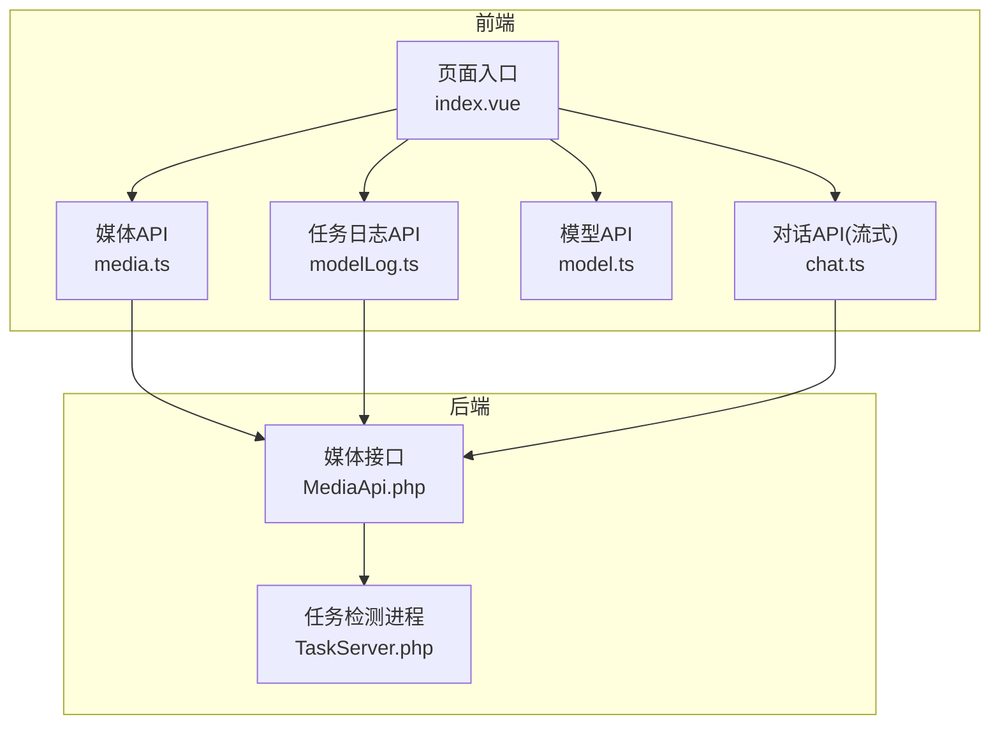
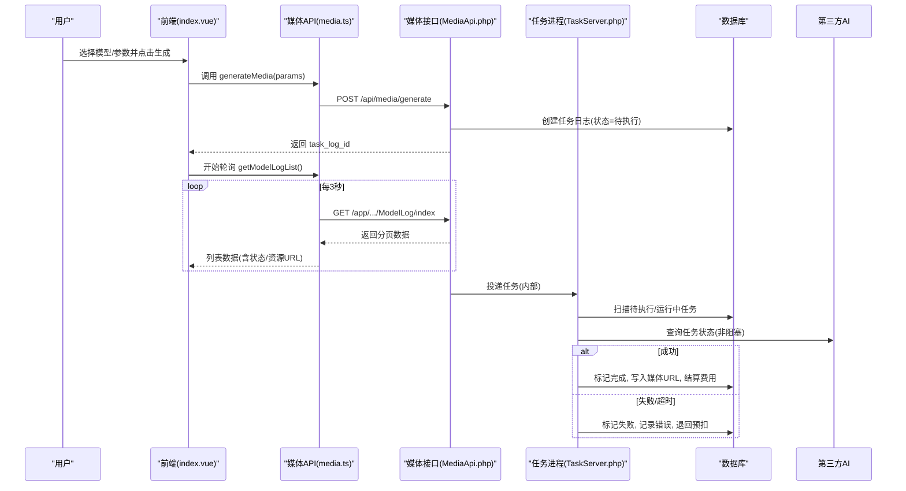
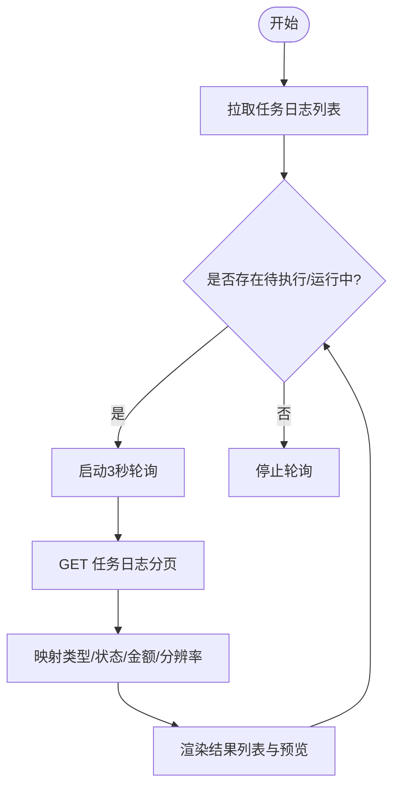
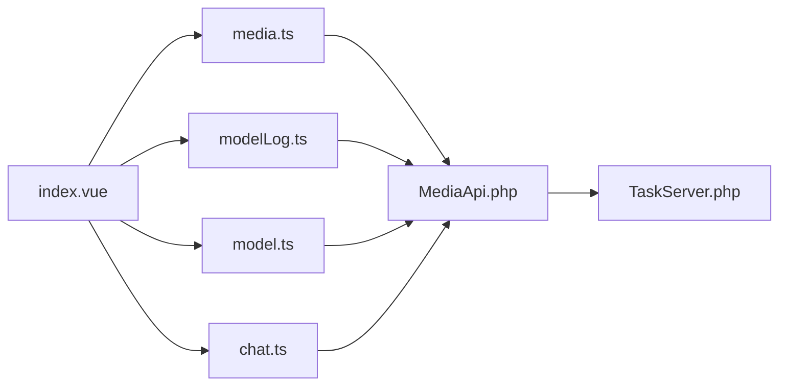

# AI生成页面

<cite>
**本文引用的文件**   
- [frontend/src/views/AssetsGeneratePage/index.vue](file://frontend/src/views/AssetsGeneratePage/index.vue)
- [frontend/src/api/media.ts](file://frontend/src/api/media.ts)
- [frontend/src/api/modelLog.ts](file://frontend/src/api/modelLog.ts)
- [frontend/src/api/model.ts](file://frontend/src/api/model.ts)
- [frontend/src/api/chat.ts](file://frontend/src/api/chat.ts)
- [server/plugin/xbAiModelAgent/api/MediaApi.php](file://server/plugin/xbAiModelAgent/api/MediaApi.php)
- [server/plugin/xbAiModelAgent/process/TaskServer.php](file://server/plugin/xbAiModelAgent/process/TaskServer.php)
</cite>

## 目录
1. [简介](#简介)
2. [项目结构](#项目结构)
3. [核心组件](#核心组件)
4. [架构总览](#架构总览)
5. [详细组件分析](#详细组件分析)
6. [依赖关系分析](#依赖关系分析)
7. [性能与体验优化](#性能与体验优化)
8. [故障排查指南](#故障排查指南)
9. [结论](#结论)

## 简介
本文件面向“AI生成页面”的前后端实现，系统性讲解以下能力：
- AI模型选择与参数配置（图片/视频）
- 结果展示与任务管理（分页、筛选、删除、批量删除）
- 异步任务处理、进度跟踪与错误处理
- 用户体验优化策略（流式提示词优化、缩略图压缩、轮询控制等）

该页面通过前端面板发起媒体生成请求，后端创建并维护任务日志，后台进程持续查询第三方AI服务状态，最终将结果回写数据库，前端通过轮询刷新列表与预览。

## 项目结构
- 前端入口视图负责：
  - 加载模型列表与枚举配置
  - 渲染图片/视频生成面板
  - 调用生成接口与任务日志接口
  - 提供描述词优化（SSE流式）
  - 结果区域的分页、筛选、删除与批量删除
- 后端插件提供：
  - 媒体生成API（校验、计费预扣、创建任务、记录日志）
  - 任务检测进程（扫描待执行/运行中任务、查询第三方状态、完成/失败结算与退款）

图表来源
- [frontend/src/views/AssetsGeneratePage/index.vue](file://frontend/src/views/AssetsGeneratePage/index.vue)
- [frontend/src/api/media.ts](file://frontend/src/api/media.ts)
- [frontend/src/api/modelLog.ts](file://frontend/src/api/modelLog.ts)
- [frontend/src/api/model.ts](file://frontend/src/api/model.ts)
- [frontend/src/api/chat.ts](file://frontend/src/api/chat.ts)
- [server/plugin/xbAiModelAgent/api/MediaApi.php](file://server/plugin/xbAiModelAgent/api/MediaApi.php)
- [server/plugin/xbAiModelAgent/process/TaskServer.php](file://server/plugin/xbAiModelAgent/process/TaskServer.php)

章节来源
- [frontend/src/views/AssetsGeneratePage/index.vue](file://frontend/src/views/AssetsGeneratePage/index.vue)
- [frontend/src/api/media.ts](file://frontend/src/api/media.ts)
- [frontend/src/api/modelLog.ts](file://frontend/src/api/modelLog.ts)
- [frontend/src/api/model.ts](file://frontend/src/api/model.ts)
- [frontend/src/api/chat.ts](file://frontend/src/api/chat.ts)
- [server/plugin/xbAiModelAgent/api/MediaApi.php](file://server/plugin/xbAiModelAgent/api/MediaApi.php)
- [server/plugin/xbAiModelAgent/process/TaskServer.php](file://server/plugin/xbAiModelAgent/process/TaskServer.php)

## 核心组件
- 页面主控制器（index.vue）
  - 负责Tab切换、模型与枚举加载、图片/视频面板参数绑定、生成触发、结果列表轮询与分页、删除与批量删除、描述词优化（SSE）。
- 媒体生成API（media.ts）
  - 封装图片/音频/视频生成参数类型与通用生成接口、任务状态查询接口。
- 任务日志API（modelLog.ts）
  - 提供分页查询、自动对图片进行本地压缩以生成缩略图、删除与批量删除。
- 模型API（model.ts）
  - 提供模型列表与分页接口，用于左侧面板的模型选择。
- 对话API（chat.ts）
  - 提供SSE流式对话，用于提示词优化。
- 媒体接口（MediaApi.php）
  - 参数校验、模型获取、费用预估与预扣、创建任务、写入任务日志、异常时退款。
- 任务检测进程（TaskServer.php）
  - 定时扫描待执行/运行中任务，非阻塞单次查询第三方状态，完成/失败结算与退款，超时保护。

章节来源
- [frontend/src/views/AssetsGeneratePage/index.vue](file://frontend/src/views/AssetsGeneratePage/index.vue)
- [frontend/src/api/media.ts](file://frontend/src/api/media.ts)
- [frontend/src/api/modelLog.ts](file://frontend/src/api/modelLog.ts)
- [frontend/src/api/model.ts](file://frontend/src/api/model.ts)
- [frontend/src/api/chat.ts](file://frontend/src/api/chat.ts)
- [server/plugin/xbAiModelAgent/api/MediaApi.php](file://server/plugin/xbAiModelAgent/api/MediaApi.php)
- [server/plugin/xbAiModelAgent/process/TaskServer.php](file://server/plugin/xbAiModelAgent/process/TaskServer.php)

## 架构总览
整体采用“前端面板 + 后端异步任务 + 后台进程轮询”的架构：
- 用户在前端选择模型与参数，点击生成后调用媒体生成接口。
- 后端校验参数、计算预估费用并预扣余额，创建任务并记录日志，返回任务ID。
- 后台进程周期性扫描待执行/运行中任务，查询第三方AI服务状态，更新日志为完成或失败，并进行费用多退少补。
- 前端定时轮询任务日志列表，根据状态驱动UI更新与预览。

图表来源
- [frontend/src/views/AssetsGeneratePage/index.vue](file://frontend/src/views/AssetsGeneratePage/index.vue)
- [frontend/src/api/media.ts](file://frontend/src/api/media.ts)
- [frontend/src/api/modelLog.ts](file://frontend/src/api/modelLog.ts)
- [server/plugin/xbAiModelAgent/api/MediaApi.php](file://server/plugin/xbAiModelAgent/api/MediaApi.php)
- [server/plugin/xbAiModelAgent/process/TaskServer.php](file://server/plugin/xbAiModelAgent/process/TaskServer.php)

## 详细组件分析

### 模型选择与参数配置
- 模型列表加载
  - 根据当前主Tab（图片/视频）按分组编码拉取模型列表，供左侧面板使用。
- 枚举配置
  - 统一从枚举接口加载分辨率、比例、时长等选项，并在图片/视频面板中复用。
- 参数映射
  - 图片：提示词、反向提示词、分辨率、比例、参考图URL列表。
  - 视频：提示词、分辨率、比例、时长。
- 默认模型
  - 可通过模型列表的第一个作为默认选中项。

章节来源
- [frontend/src/views/AssetsGeneratePage/index.vue](file://frontend/src/views/AssetsGeneratePage/index.vue)
- [frontend/src/api/model.ts](file://frontend/src/api/model.ts)

### 图像与视频生成面板
- 图片面板
  - 支持文本到图片模式，可选参考图，支持反向提示词。
  - 提交前将枚举中的分辨率解析为width/height，并组装reference_image_urls。
- 视频面板
  - 支持文本到视频模式，可设置时长。
  - 提交前将枚举中的分辨率解析为width/height，并携带duration_seconds。
- 生成触发
  - 调用媒体生成接口，成功后清空提示词并刷新任务日志列表。

章节来源
- [frontend/src/views/AssetsGeneratePage/index.vue](file://frontend/src/views/AssetsGeneratePage/index.vue)
- [frontend/src/api/media.ts](file://frontend/src/api/media.ts)

### 结果展示与任务管理
- 结果列表
  - 分页加载任务日志，自动将图片类型的原始URL压缩为base64缩略图以提升列表性能。
  - 根据modality映射类型（image/audio/video），显示对应预览与元信息。
- 筛选与分页
  - 支持按模态筛选（全部/图片/音频/视频），切换筛选重置到第一页并刷新。
  - 分页变更触发重新拉取。
- 删除与批量删除
  - 单项删除与批量删除均会刷新列表。

章节来源
- [frontend/src/views/AssetsGeneratePage/index.vue](file://frontend/src/views/AssetsGeneratePage/index.vue)
- [frontend/src/api/modelLog.ts](file://frontend/src/api/modelLog.ts)

### 异步任务处理与进度跟踪
- 前端轮询
  - 当存在待执行或执行中的任务时，启动定时器每3秒拉取一次任务日志；无进行中任务则停止轮询。
- 后端进程
  - 定时扫描待执行任务并标记为运行中。
  - 对运行中任务进行非阻塞单次查询，根据第三方返回状态决定完成/失败/继续等待。
  - 完成时写入媒体URL与结果，失败时记录错误信息。
- 费用结算
  - 完成时根据上游实际成本计算销售价，执行多退少补。
  - 失败时退回已预扣余额。

图表来源
- [frontend/src/views/AssetsGeneratePage/index.vue](file://frontend/src/views/AssetsGeneratePage/index.vue)
- [frontend/src/api/modelLog.ts](file://frontend/src/api/modelLog.ts)
- [server/plugin/xbAiModelAgent/process/TaskServer.php](file://server/plugin/xbAiModelAgent/process/TaskServer.php)

章节来源
- [frontend/src/views/AssetsGeneratePage/index.vue](file://frontend/src/views/AssetsGeneratePage/index.vue)
- [frontend/src/api/modelLog.ts](file://frontend/src/api/modelLog.ts)
- [server/plugin/xbAiModelAgent/process/TaskServer.php](file://server/plugin/xbAiModelAgent/process/TaskServer.php)

### 错误处理与用户体验优化
- 错误处理
  - 生成失败：弹窗提示失败原因，保留用户输入以便重试。
  - 优化描述词失败：恢复原文并提示重试。
  - 删除失败：提示错误信息。
- 用户体验优化
  - 流式优化提示词：SSE逐字填充，避免长等待感。
  - 列表图片压缩：在客户端压缩为base64缩略图，减少带宽与首屏时间。
  - 智能轮询：仅在存在进行中任务时轮询，降低无效请求。
  - 状态映射：将后端状态码映射为前端友好状态，便于展示。

章节来源
- [frontend/src/views/AssetsGeneratePage/index.vue](file://frontend/src/views/AssetsGeneratePage/index.vue)
- [frontend/src/api/modelLog.ts](file://frontend/src/api/modelLog.ts)
- [frontend/src/api/chat.ts](file://frontend/src/api/chat.ts)

## 依赖关系分析
- 前端模块依赖
  - index.vue 依赖 media.ts、modelLog.ts、model.ts、chat.ts。
  - modelLog.ts 依赖 image 工具进行压缩。
- 前后端交互
  - 媒体生成：前端 -> MediaApi -> 任务日志表 -> 任务进程。
  - 任务查询：前端 -> ModelLog 接口 -> 任务日志表。
  - 模型列表：前端 -> Model 接口 -> 模型表。
  - 描述词优化：前端 -> Chat 接口（SSE）。

图表来源
- [frontend/src/views/AssetsGeneratePage/index.vue](file://frontend/src/views/AssetsGeneratePage/index.vue)
- [frontend/src/api/media.ts](file://frontend/src/api/media.ts)
- [frontend/src/api/modelLog.ts](file://frontend/src/api/modelLog.ts)
- [frontend/src/api/model.ts](file://frontend/src/api/model.ts)
- [frontend/src/api/chat.ts](file://frontend/src/api/chat.ts)
- [server/plugin/xbAiModelAgent/api/MediaApi.php](file://server/plugin/xbAiModelAgent/api/MediaApi.php)
- [server/plugin/xbAiModelAgent/process/TaskServer.php](file://server/plugin/xbAiModelAgent/process/TaskServer.php)

章节来源
- [frontend/src/views/AssetsGeneratePage/index.vue](file://frontend/src/views/AssetsGeneratePage/index.vue)
- [frontend/src/api/media.ts](file://frontend/src/api/media.ts)
- [frontend/src/api/modelLog.ts](file://frontend/src/api/modelLog.ts)
- [frontend/src/api/model.ts](file://frontend/src/api/model.ts)
- [frontend/src/api/chat.ts](file://frontend/src/api/chat.ts)
- [server/plugin/xbAiModelAgent/api/MediaApi.php](file://server/plugin/xbAiModelAgent/api/MediaApi.php)
- [server/plugin/xbAiModelAgent/process/TaskServer.php](file://server/plugin/xbAiModelAgent/process/TaskServer.php)

## 性能与体验优化
- 列表图片压缩
  - 在客户端对图片进行压缩并缓存为base64缩略图，提升列表滚动性能与首屏速度。
- 轮询节流
  - 仅在有进行中任务时轮询，避免不必要的网络请求。
- SSE流式优化
  - 描述词优化采用SSE流式输出，边生成边展示，提升感知性能。
- 参数预校验
  - 生成前检查必要字段（提示词、模型），减少无效请求。
- 状态映射与容错
  - 将后端多种状态码映射为统一前端状态，增强鲁棒性。

[本节为通用指导，不直接分析具体文件]

## 故障排查指南
- 生成失败
  - 现象：弹窗提示“生成失败”，保留用户输入。
  - 排查：确认模型ID与提示词是否有效，查看任务日志的错误信息。
- 优化描述词失败
  - 现象：恢复原文并提示重试。
  - 排查：确认对话模型可用，检查SSE连接与网络状况。
- 删除失败
  - 现象：提示删除失败。
  - 排查：检查权限与网络，重试操作。
- 任务长时间未结束
  - 现象：列表一直显示“执行中”。
  - 排查：检查后台进程是否运行，第三方AI服务是否响应，查看任务日志错误信息。

章节来源
- [frontend/src/views/AssetsGeneratePage/index.vue](file://frontend/src/views/AssetsGeneratePage/index.vue)
- [frontend/src/api/modelLog.ts](file://frontend/src/api/modelLog.ts)
- [server/plugin/xbAiModelAgent/process/TaskServer.php](file://server/plugin/xbAiModelAgent/process/TaskServer.php)

## 结论
AI生成页面通过清晰的前后端职责划分与异步任务机制，实现了稳定的图片/视频生成流程。结合流式优化、缩略图压缩与智能轮询，显著提升了用户体验与系统性能。建议在生产环境关注后台进程健康度与第三方服务可用性，并持续监控任务成功率与费用结算准确性。