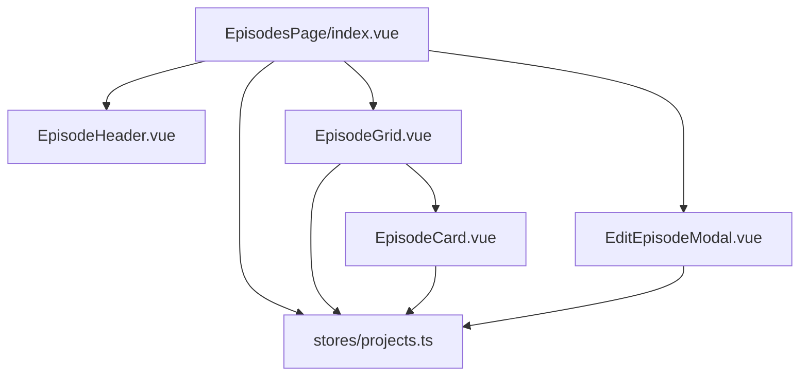
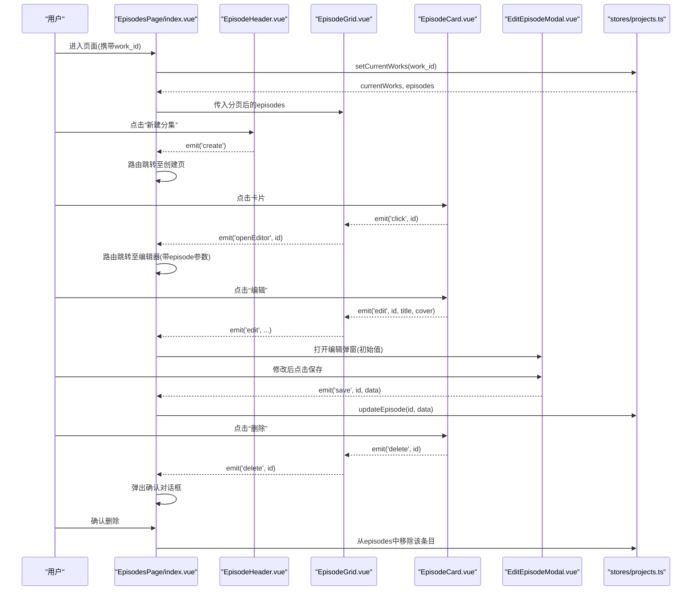
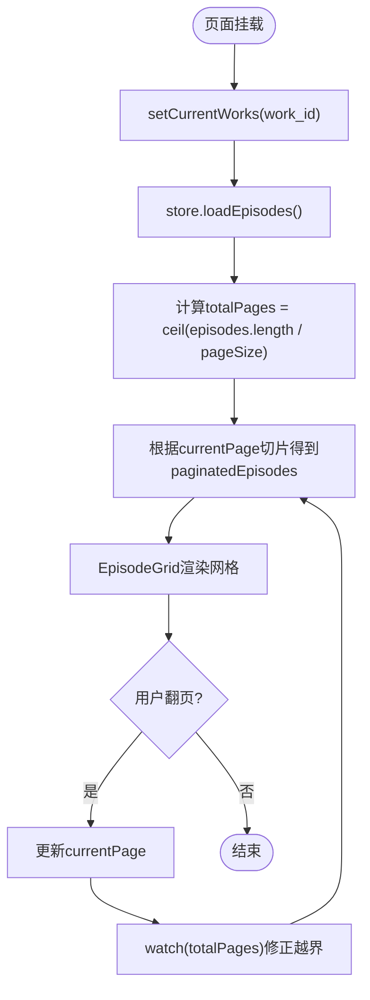
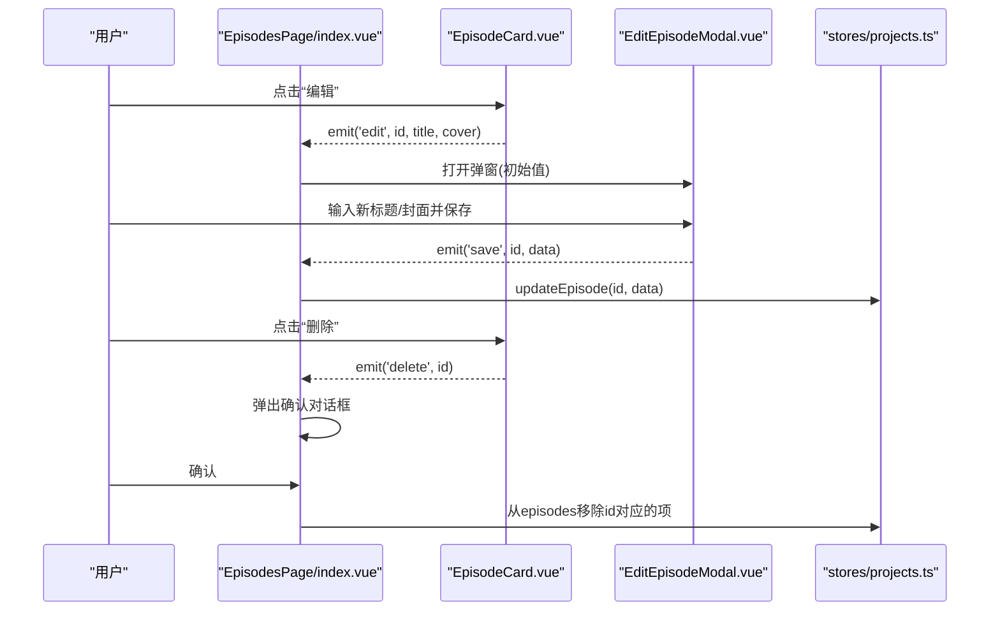
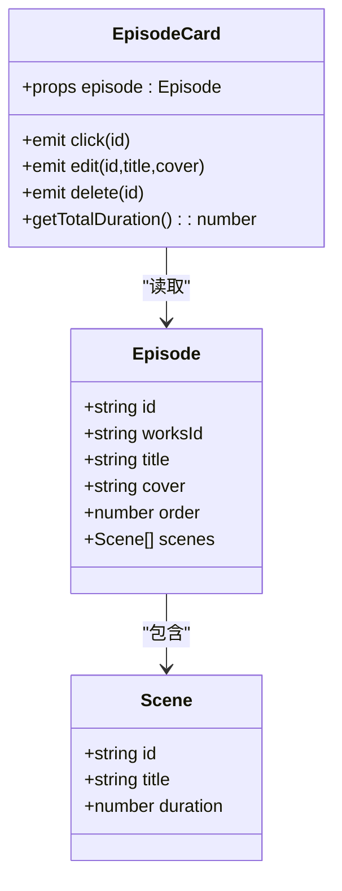
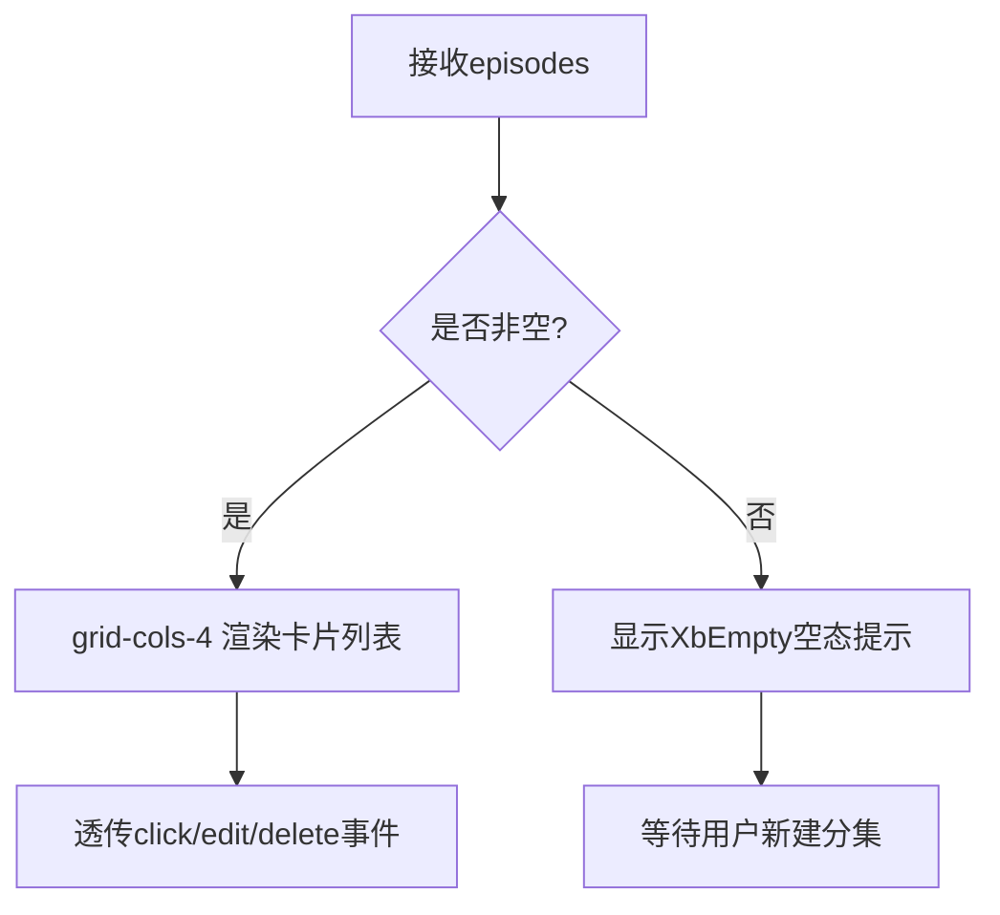
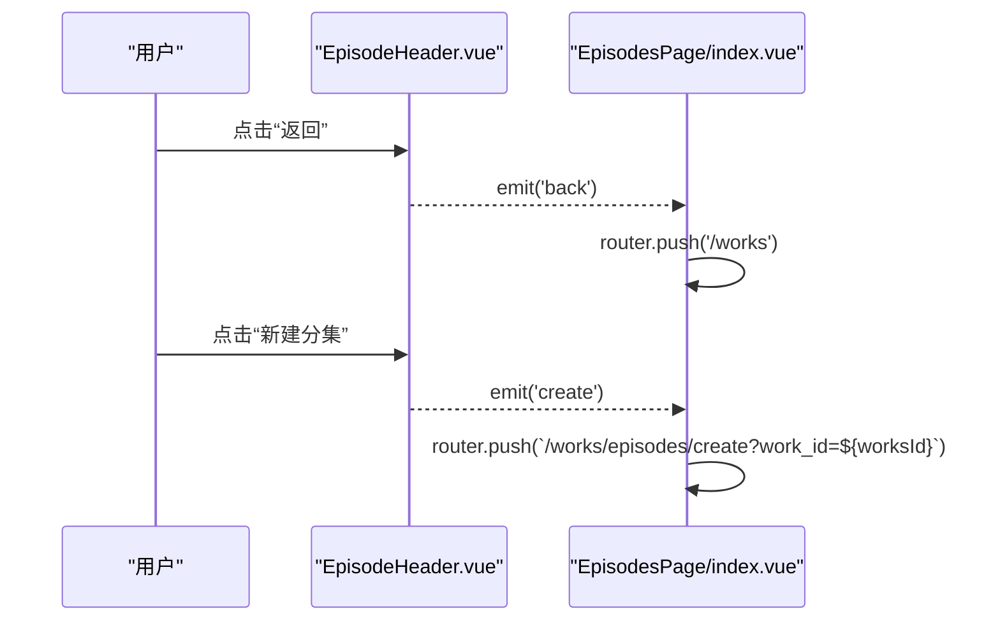
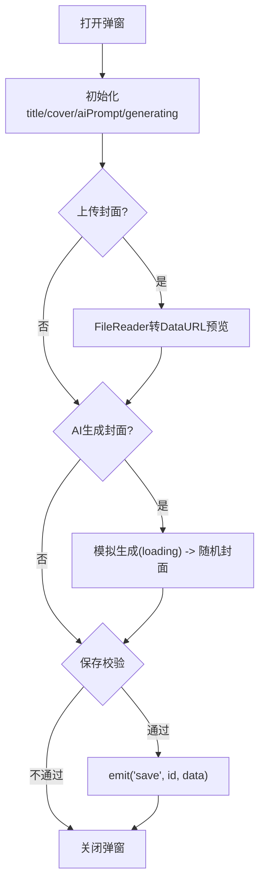
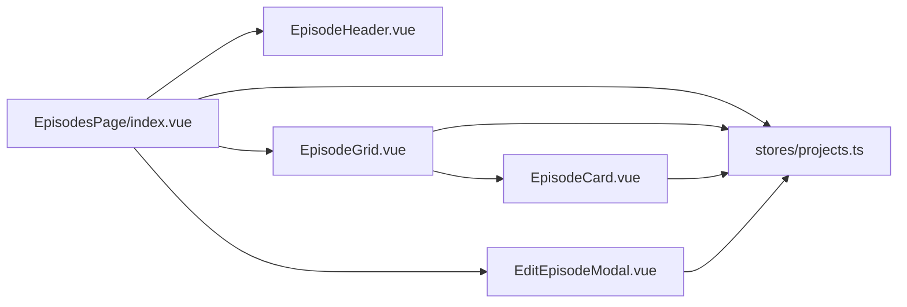

# 分镜管理

<cite>
**本文引用的文件**
- [frontend/src/views/EpisodesPage/index.vue](file://frontend/src/views/EpisodesPage/index.vue)
- [frontend/src/views/EpisodesPage/components/EpisodeHeader.vue](file://frontend/src/views/EpisodesPage/components/EpisodeHeader.vue)
- [frontend/src/views/EpisodesPage/components/EpisodeGrid.vue](file://frontend/src/views/EpisodesPage/components/EpisodeGrid.vue)
- [frontend/src/views/EpisodesPage/components/EpisodeCard.vue](file://frontend/src/views/EpisodesPage/components/EpisodeCard.vue)
- [frontend/src/views/EpisodesPage/components/EditEpisodeModal.vue](file://frontend/src/views/EpisodesPage/components/EditEpisodeModal.vue)
- [frontend/src/stores/projects.ts](file://frontend/src/stores/projects.ts)
</cite>

## 目录
1. [简介](#简介)
2. [项目结构](#项目结构)
3. [核心组件与职责](#核心组件与职责)
4. [架构总览](#架构总览)
5. [详细组件分析](#详细组件分析)
6. [依赖关系分析](#依赖关系分析)
7. [性能与体验优化建议](#性能与体验优化建议)
8. [故障排查指南](#故障排查指南)
9. [结论](#结论)

## 简介
本章节面向“分镜管理”功能，围绕分镜列表展示、分页机制、CRUD（创建、编辑、删除）实现逻辑展开，深入讲解 EpisodeCard 交互设计、EpisodeGrid 网格布局算法、EpisodeHeader 导航功能。同时覆盖数据绑定、状态同步、用户反馈与错误处理机制，并提供与其他组件的集成方式与使用模式说明。

## 项目结构
分镜管理页面位于前端视图模块下，采用“页面 + 子组件 + Store 状态管理”的分层组织方式：
- 页面入口：负责路由参数解析、全局状态设置、分页计算、弹窗控制与事件分发
- 子组件：
  - EpisodeHeader：顶部导航与新建按钮
  - EpisodeGrid：分集网格容器与空态提示
  - EpisodeCard：单集卡片，承载点击打开编辑器、编辑、删除等交互
  - EditEpisodeModal：编辑分集的模态框，支持封面上传与 AI 生成封面
- 状态管理：Pinia store 提供作品与分集的数据模型与操作方法

图表来源
- [frontend/src/views/EpisodesPage/index.vue:1-115](file://frontend/src/views/EpisodesPage/index.vue#L1-L115)
- [frontend/src/views/EpisodesPage/components/EpisodeHeader.vue:1-36](file://frontend/src/views/EpisodesPage/components/EpisodeHeader.vue#L1-L36)
- [frontend/src/views/EpisodesPage/components/EpisodeGrid.vue:1-35](file://frontend/src/views/EpisodesPage/components/EpisodeGrid.vue#L1-L35)
- [frontend/src/views/EpisodesPage/components/EpisodeCard.vue:1-65](file://frontend/src/views/EpisodesPage/components/EpisodeCard.vue#L1-L65)
- [frontend/src/views/EpisodesPage/components/EditEpisodeModal.vue:1-139](file://frontend/src/views/EpisodesPage/components/EditEpisodeModal.vue#L1-L139)
- [frontend/src/stores/projects.ts:1-279](file://frontend/src/stores/projects.ts#L1-L279)

章节来源
- [frontend/src/views/EpisodesPage/index.vue:1-115](file://frontend/src/views/EpisodesPage/index.vue#L1-L115)
- [frontend/src/stores/projects.ts:1-279](file://frontend/src/stores/projects.ts#L1-L279)

## 核心组件与职责
- EpisodesPage/index.vue
  - 解析路由 work_id，设置当前作品
  - 维护分页状态（页码、每页数量、总页数），计算当前页数据
  - 监听总页数变化，自动修正当前页
  - 转发新建、编辑、删除事件到子组件或 Store
  - 组合 XbPagination、XbConfirmModal、EditEpisodeModal 完成交互闭环
- EpisodeHeader.vue
  - 显示作品标题与分集总数
  - 返回上一页与新建分集按钮的事件发射
- EpisodeGrid.vue
  - 接收分页后的分集数组，渲染网格
  - 空态时展示 XbEmpty 提示
  - 将卡片事件冒泡至父级
- EpisodeCard.vue
  - 展示封面、标题、场景数、时长
  - 触发打开编辑器、编辑、删除事件
- EditEpisodeModal.vue
  - 支持封面本地预览与替换
  - 模拟 AI 生成封面流程（含加载态）
  - 保存时校验标题并向上抛出 save 事件
- stores/projects.ts
  - 定义 Works、Episode、Scene 数据结构
  - 提供 setCurrentWorks、loadEpisodes、addEpisode、updateEpisode 等方法
  - 提供分镜场景增删改排序等辅助方法（为后续扩展预留）

章节来源
- [frontend/src/views/EpisodesPage/index.vue:1-115](file://frontend/src/views/EpisodesPage/index.vue#L1-L115)
- [frontend/src/views/EpisodesPage/components/EpisodeHeader.vue:1-36](file://frontend/src/views/EpisodesPage/components/EpisodeHeader.vue#L1-L36)
- [frontend/src/views/EpisodesPage/components/EpisodeGrid.vue:1-35](file://frontend/src/views/EpisodesPage/components/EpisodeGrid.vue#L1-L35)
- [frontend/src/views/EpisodesPage/components/EpisodeCard.vue:1-65](file://frontend/src/views/EpisodesPage/components/EpisodeCard.vue#L1-L65)
- [frontend/src/views/EpisodesPage/components/EditEpisodeModal.vue:1-139](file://frontend/src/views/EpisodesPage/components/EditEpisodeModal.vue#L1-L139)
- [frontend/src/stores/projects.ts:1-279](file://frontend/src/stores/projects.ts#L1-L279)

## 架构总览
整体采用“页面编排 + 子组件事件驱动 + Pinia 状态集中管理”的模式。页面作为协调者，聚合 UI 组件与状态，保证单一数据源与可预测的状态更新。

图表来源
- [frontend/src/views/EpisodesPage/index.vue:1-115](file://frontend/src/views/EpisodesPage/index.vue#L1-L115)
- [frontend/src/views/EpisodesPage/components/EpisodeHeader.vue:1-36](file://frontend/src/views/EpisodesPage/components/EpisodeHeader.vue#L1-L36)
- [frontend/src/views/EpisodesPage/components/EpisodeGrid.vue:1-35](file://frontend/src/views/EpisodesPage/components/EpisodeGrid.vue#L1-L35)
- [frontend/src/views/EpisodesPage/components/EpisodeCard.vue:1-65](file://frontend/src/views/EpisodesPage/components/EpisodeCard.vue#L1-L65)
- [frontend/src/views/EpisodesPage/components/EditEpisodeModal.vue:1-139](file://frontend/src/views/EpisodesPage/components/EditEpisodeModal.vue#L1-L139)
- [frontend/src/stores/projects.ts:1-279](file://frontend/src/stores/projects.ts#L1-L279)

## 详细组件分析

### 分镜列表与分页机制
- 数据来源
  - 通过 setCurrentWorks 设置当前作品并加载其 episodes
  - episodes 由 store 中的 loadEpisodes 初始化（示例为 Mock 数据）
- 分页策略
  - pageSize 固定为 8
  - currentPage 响应式维护当前页码
  - totalPages 基于 episodes 长度动态计算
  - paginatedEpisodes 通过 slice 截取当前页数据
  - watch(totalPages) 在总页数减少时自动回退到有效页码，避免越界
- 渲染与交互
  - EpisodeGrid 接收 paginatedEpisodes 进行网格渲染
  - 空态时使用 XbEmpty 提示
  - 底部使用 XbPagination 双向绑定 currentPage，切换页码即刷新列表

图表来源
- [frontend/src/views/EpisodesPage/index.vue:20-40](file://frontend/src/views/EpisodesPage/index.vue#L20-L40)
- [frontend/src/stores/projects.ts:165-185](file://frontend/src/stores/projects.ts#L165-L185)

章节来源
- [frontend/src/views/EpisodesPage/index.vue:20-40](file://frontend/src/views/EpisodesPage/index.vue#L20-L40)
- [frontend/src/stores/projects.ts:165-185](file://frontend/src/stores/projects.ts#L165-L185)

### CRUD 操作实现逻辑
- 创建
  - 点击 Header 的“新建分集”，页面跳转到创建页（路由包含 work_id）
  - 创建成功后，可在创建页调用 store.addEpisode 新增一条分集记录
- 编辑
  - 点击卡片的“编辑”，打开 EditEpisodeModal，预填标题与封面
  - 保存时校验标题非空，向父级 emit('save', id, {title, cover})
  - 父级调用 store.updateEpisode 进行局部更新
- 删除
  - 点击卡片的“删除”，弹出 XbConfirmModal 二次确认
  - 确认后从 episodes 中过滤掉对应 id，关闭弹窗

图表来源
- [frontend/src/views/EpisodesPage/index.vue:46-73](file://frontend/src/views/EpisodesPage/index.vue#L46-L73)
- [frontend/src/views/EpisodesPage/components/EpisodeCard.vue:45-60](file://frontend/src/views/EpisodesPage/components/EpisodeCard.vue#L45-L60)
- [frontend/src/views/EpisodesPage/components/EditEpisodeModal.vue:56-61](file://frontend/src/views/EpisodesPage/components/EditEpisodeModal.vue#L56-L61)
- [frontend/src/stores/projects.ts:255-261](file://frontend/src/stores/projects.ts#L255-L261)

章节来源
- [frontend/src/views/EpisodesPage/index.vue:46-73](file://frontend/src/views/EpisodesPage/index.vue#L46-L73)
- [frontend/src/views/EpisodesPage/components/EditEpisodeModal.vue:56-61](file://frontend/src/views/EpisodesPage/components/EditEpisodeModal.vue#L56-L61)
- [frontend/src/stores/projects.ts:255-261](file://frontend/src/stores/projects.ts#L255-L261)

### EpisodeCard 交互设计
- 视觉信息
  - 封面图占满卡片上半区，hover 时透明度提升并显示播放图标
  - 左上角标签显示“N个场景”
  - 下方显示标题与总时长（按 scenes.duration 累加）
- 交互行为
  - 点击卡片主体：触发 openEditor，跳转至编辑器
  - 点击“编辑”按钮：打开编辑弹窗，预填标题与封面
  - 点击“删除”按钮：触发删除确认流程
- 事件冒泡
  - 卡片内部按钮使用 stopPropagation 防止冒泡到卡片点击

图表来源
- [frontend/src/views/EpisodesPage/components/EpisodeCard.vue:1-65](file://frontend/src/views/EpisodesPage/components/EpisodeCard.vue#L1-L65)
- [frontend/src/stores/projects.ts:24-70](file://frontend/src/stores/projects.ts#L24-L70)

章节来源
- [frontend/src/views/EpisodesPage/components/EpisodeCard.vue:1-65](file://frontend/src/views/EpisodesPage/components/EpisodeCard.vue#L1-L65)
- [frontend/src/stores/projects.ts:24-70](file://frontend/src/stores/projects.ts#L24-L70)

### EpisodeGrid 网格布局算法
- 布局策略
  - 使用 CSS Grid 四列布局 grid-cols-4，配合 gap-4 间距
  - 当 episodes 为空时，展示 XbEmpty 空态提示
- 渲染与事件
  - v-for 遍历 episodes，每个元素渲染一个 EpisodeCard
  - 将卡片事件透传至父级，由父级统一处理

图表来源
- [frontend/src/views/EpisodesPage/components/EpisodeGrid.vue:1-35](file://frontend/src/views/EpisodesPage/components/EpisodeGrid.vue#L1-L35)

章节来源
- [frontend/src/views/EpisodesPage/components/EpisodeGrid.vue:1-35](file://frontend/src/views/EpisodesPage/components/EpisodeGrid.vue#L1-L35)

### EpisodeHeader 导航功能
- 功能点
  - 左侧返回按钮：触发 back 事件，页面执行 goBack 回到作品列表
  - 标题与副标题：显示作品名与“连载管理 · 共 N 集”
  - 右侧“新建分集”按钮：触发 create 事件，页面跳转至创建页
- 样式与可访问性
  - 使用图标与文字组合，按钮具备 hover 反馈

图表来源
- [frontend/src/views/EpisodesPage/components/EpisodeHeader.vue:1-36](file://frontend/src/views/EpisodesPage/components/EpisodeHeader.vue#L1-L36)
- [frontend/src/views/EpisodesPage/index.vue:42-48](file://frontend/src/views/EpisodesPage/index.vue#L42-L48)

章节来源
- [frontend/src/views/EpisodesPage/components/EpisodeHeader.vue:1-36](file://frontend/src/views/EpisodesPage/components/EpisodeHeader.vue#L1-L36)
- [frontend/src/views/EpisodesPage/index.vue:42-48](file://frontend/src/views/EpisodesPage/index.vue#L42-L48)

### EditEpisodeModal 编辑与用户反馈
- 数据绑定
  - visible 控制弹窗显隐
  - initialTitle/initialCover 用于初始化表单
  - 打开弹窗时重置 aiPrompt 与 generating 状态
- 封面上传
  - 使用 FileReader 将本地图片转为 DataURL 进行预览
  - 支持 hover 遮罩提示更换封面
- AI 生成封面（模拟）
  - 输入描述后点击“生成”，显示 loading 态
  - 随机选择预设封面地址，完成后清空提示词
- 保存校验
  - 仅当存在 episodeId 且标题非空时才触发保存
  - 向父级 emit('save', id, {title, cover})

图表来源
- [frontend/src/views/EpisodesPage/components/EditEpisodeModal.vue:21-61](file://frontend/src/views/EpisodesPage/components/EditEpisodeModal.vue#L21-L61)

章节来源
- [frontend/src/views/EpisodesPage/components/EditEpisodeModal.vue:21-61](file://frontend/src/views/EpisodesPage/components/EditEpisodeModal.vue#L21-L61)

## 依赖关系分析
- 组件耦合
  - EpisodesPage 作为编排层，强依赖各子组件与 Store
  - EpisodeGrid 弱依赖 EpisodeCard，仅通过 props 与 events 通信
  - EditEpisodeModal 与 EpisodesPage 通过 props/events 解耦
- 外部依赖
  - Vue Router：页面跳转与参数传递
  - Pinia：集中状态管理与数据流
  - 自定义 UI 组件：XbButton、XbIcon、XbEmpty、XbPagination、XbConfirmModal、XbModal、XbInput 等

图表来源
- [frontend/src/views/EpisodesPage/index.vue:1-115](file://frontend/src/views/EpisodesPage/index.vue#L1-L115)
- [frontend/src/stores/projects.ts:1-279](file://frontend/src/stores/projects.ts#L1-L279)

章节来源
- [frontend/src/views/EpisodesPage/index.vue:1-115](file://frontend/src/views/EpisodesPage/index.vue#L1-L115)
- [frontend/src/stores/projects.ts:1-279](file://frontend/src/stores/projects.ts#L1-L279)

## 性能与体验优化建议
- 列表渲染
  - 当前使用 slice 做客户端分页，适合中小规模数据；若数据量增大，建议后端分页接口替代
  - 为 EpisodeCard 添加稳定 key（已使用 episode.id），确保 diff 高效
- 图片加载
  - 封面图建议使用懒加载与缩略图，降低首屏压力
  - 对大图进行压缩与 CDN 加速
- 交互反馈
  - 删除与保存等操作可增加 loading 态与成功/失败消息提示
  - 网络请求失败时，统一错误拦截并给出友好提示
- 可访问性
  - 为按钮增加 aria-label，键盘可达性与屏幕阅读器友好

[本节为通用建议，无需代码引用]

## 故障排查指南
- 问题：翻页后列表无变化
  - 检查 currentPage 是否与 XbPagination 双向绑定
  - 确认 totalPages 计算是否正确，watch 是否生效
- 问题：删除无效
  - 确认 confirmDelete 与 deleteEpisode 的流程是否完整
  - 检查 episodes 过滤逻辑是否命中目标 id
- 问题：编辑未保存
  - 检查 EditEpisodeModal 的保存校验条件（是否存在 id 与标题非空）
  - 确认父级 saveEpisode 是否调用 store.updateEpisode
- 问题：封面未更新
  - 检查 handleCoverUpload 的 FileReader 回调是否赋值 cover
  - 确认 AI 生成流程是否覆盖了 cover 值

章节来源
- [frontend/src/views/EpisodesPage/index.vue:62-73](file://frontend/src/views/EpisodesPage/index.vue#L62-L73)
- [frontend/src/views/EpisodesPage/components/EditEpisodeModal.vue:56-61](file://frontend/src/views/EpisodesPage/components/EditEpisodeModal.vue#L56-L61)

## 结论
分镜管理功能以清晰的组件分层与事件驱动模式实现，结合 Pinia 集中状态管理，保证了数据流的可追踪与可维护性。页面内实现了完整的分页、CRUD 与用户反馈链路，并通过子组件的职责拆分提升了复用性与扩展性。后续可在此基础上接入真实后端 API、完善错误处理与性能优化策略，进一步提升用户体验与系统稳定性。