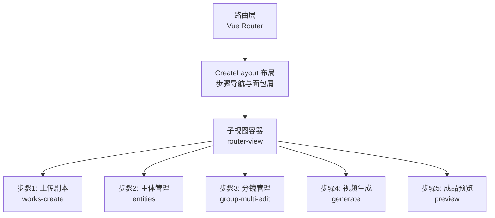
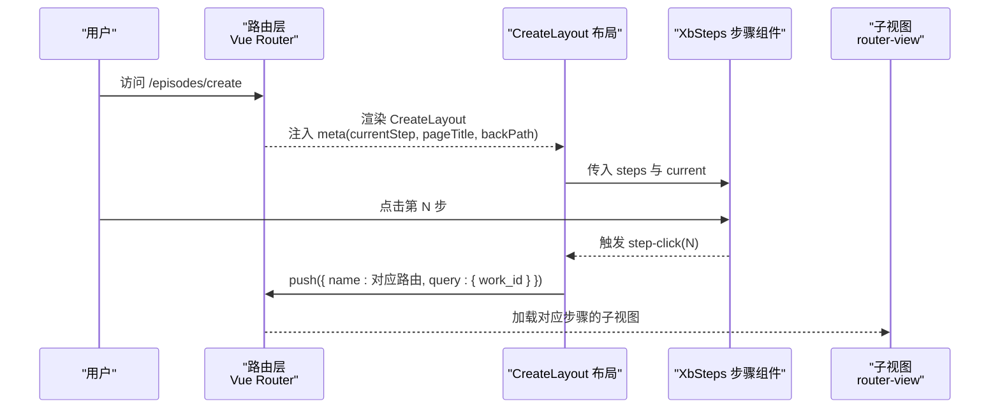
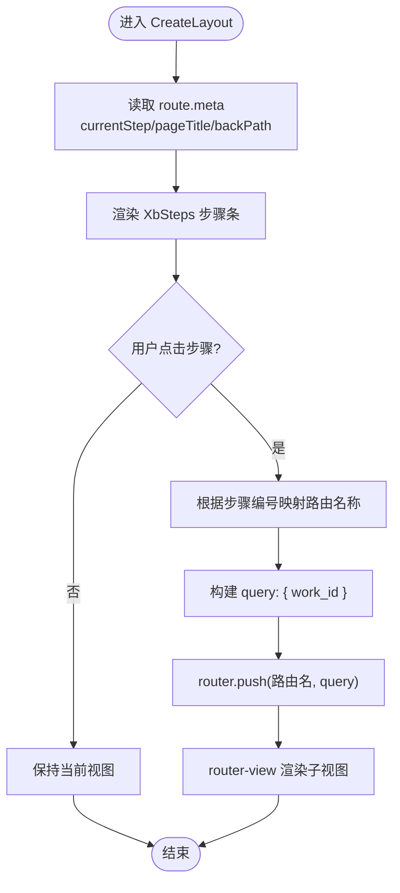
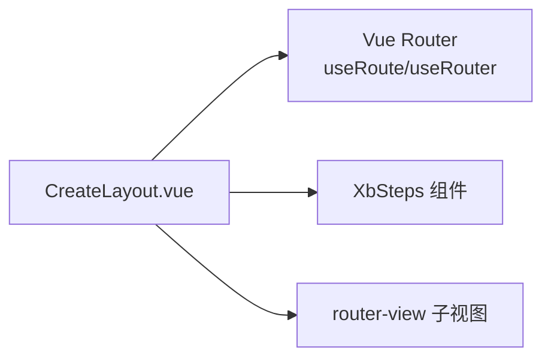

# 创作流程

<cite>
**本文引用的文件**
- [CreateLayout.vue](file://frontend/src/views/EpisodesPage/CreateLayout.vue)
</cite>

## 目录
1. [简介](#简介)
2. [项目结构](#项目结构)
3. [核心组件](#核心组件)
4. [架构总览](#架构总览)
5. [详细组件分析](#详细组件分析)
6. [依赖分析](#依赖分析)
7. [性能考虑](#性能考虑)
8. [故障排查指南](#故障排查指南)
9. [结论](#结论)
10. [附录](#附录)

## 简介
本文件围绕“协作创作流程”展开，聚焦以下目标：
- CreateLayout 布局系统的架构设计与路由驱动的多步骤导航
- generate 页面的生成流程控制（基于当前仓库可验证的路由与步骤）
- StyleSelector 样式选择器的实现逻辑（概念性说明，便于后续扩展）
- 多步骤表单处理、实时预览更新、参数验证与数据持久化机制（通用最佳实践）
- 工作流状态管理、进度跟踪、错误恢复与用户引导（结合现有步骤组件与路由元信息）

为保证准确性，本节文档对代码层面的分析与图示均严格映射到仓库中实际存在的文件。对于未在仓库中出现的模块（如 StyleSelector），将以概念性说明呈现，避免臆造实现细节。

## 项目结构
从仓库可见，创作流程的核心入口位于 EpisodesPage 下的 CreateLayout 布局组件。该组件通过 Vue Router 的 meta 字段驱动步骤条与页面标题，并使用 XbSteps 组件提供可点击的步骤导航。

图表来源
- [CreateLayout.vue:1-71](file://frontend/src/views/EpisodesPage/CreateLayout.vue#L1-L71)

章节来源
- [CreateLayout.vue:1-71](file://frontend/src/views/EpisodesPage/CreateLayout.vue#L1-L71)

## 核心组件
- CreateLayout 布局
  - 职责：统一展示步骤条、面包屑、返回按钮；根据路由 meta 渲染当前步骤与页面标题；承载 router-view 子视图。
  - 关键能力：
    - 读取 route.meta.currentStep/pageTitle/backPath 作为步骤与标题来源
    - 使用 XbSteps 渲染步骤并支持点击跳转
    - 在跳转时保留 work_id 查询参数，确保跨步骤共享上下文
- XbSteps 步骤组件
  - 职责：可视化步骤列表，支持 current 高亮与 step-click 事件回调
  - 交互：点击某一步骤触发 handleStepClick，按步骤编号跳转到对应路由名称

章节来源
- [CreateLayout.vue:1-71](file://frontend/src/views/EpisodesPage/CreateLayout.vue#L1-L71)

## 架构总览
下图展示了以 CreateLayout 为中心的多步骤创作流程：路由元信息驱动 UI 状态，XbSteps 负责导航，router-view 承载各步骤的具体业务页面。

图表来源
- [CreateLayout.vue:1-71](file://frontend/src/views/EpisodesPage/CreateLayout.vue#L1-L71)

## 详细组件分析

### CreateLayout 布局系统
- 设计要点
  - 路由驱动：currentStep/pageTitle/backPath 均来自 route.meta，保证布局与页面内容解耦
  - 步骤定义集中：steps 数组集中声明，便于维护与扩展
  - 导航一致性：所有跳转都携带 work_id，确保步骤间共享任务上下文
  - 返回策略：优先使用 backPath，否则回退浏览器历史
- 交互流程
  - 点击步骤 -> 根据步骤编号映射到路由名称 -> 带 work_id 跳转 -> 子视图渲染
  - 面包屑显示“分集管理/页面标题”，并提供返回按钮

图表来源
- [CreateLayout.vue:1-71](file://frontend/src/views/EpisodesPage/CreateLayout.vue#L1-L71)

章节来源
- [CreateLayout.vue:1-71](file://frontend/src/views/EpisodesPage/CreateLayout.vue#L1-L71)

### generate 页面生成流程控制（基于现有步骤）
- 现状说明
  - 仓库中存在“步骤4: 视频生成”对应的路由名称 generate，表明该步骤已纳入整体流程
  - 具体生成逻辑（如调用 AI 模型、轮询任务状态、失败重试等）在当前仓库片段中未直接体现，需参考对应路由的实现文件
- 建议流程（通用模式）
  - 前置校验：检查必要参数（如 work_id、素材清单、分镜配置）
  - 提交任务：调用后端接口创建生成任务，获取任务 ID
  - 进度跟踪：轮询或监听任务状态，更新 UI 进度
  - 结果处理：成功则进入下一步（成品预览），失败则提示重试或回退
  - 错误恢复：网络异常、超时、服务端错误等场景的降级与提示

章节来源
- [CreateLayout.vue:1-71](file://frontend/src/views/EpisodesPage/CreateLayout.vue#L1-71)

### StyleSelector 样式选择器（概念性说明）
- 定位
  - 用于在创作流程中选择主题/风格/模板等视觉样式，影响预览与最终输出
- 典型实现思路
  - 数据源：样式枚举、模板列表、预设规则
  - 交互：单选/多选、搜索过滤、预览联动
  - 状态：选中项、筛选条件、最近使用记录
  - 持久化：本地缓存 + 云端同步（可选）
- 与 CreateLayout 的关系
  - 可在任意步骤引入，例如在“分镜管理”或“视频生成”前进行样式选择
  - 通过路由 query 或全局状态传递至后续步骤

[本节为概念性说明，不直接分析具体文件]

## 依赖分析
- 内部依赖
  - CreateLayout 依赖 Vue Router 的 useRoute/useRouter 与自定义 XbSteps 组件
  - 步骤导航强耦合于路由表中的 name 映射，新增步骤需在两处保持一致：步骤定义与路由注册
- 外部依赖
  - XbSteps 组件：提供步骤条 UI 与 step-click 事件
  - 路由元信息：currentStep/pageTitle/backPath 约定

图表来源
- [CreateLayout.vue:1-71](file://frontend/src/views/EpisodesPage/CreateLayout.vue#L1-L71)

章节来源
- [CreateLayout.vue:1-71](file://frontend/src/views/EpisodesPage/CreateLayout.vue#L1-L71)

## 性能考虑
- 路由切换开销
  - 子视图按需懒加载，减少首屏体积
  - 大列表/图片资源采用虚拟滚动与懒加载
- 步骤状态
  - 避免在每次步骤切换时重复请求，利用缓存或状态持久化
- 预览更新
  - 使用防抖/节流优化高频输入导致的预览重渲染
- 错误边界
  - 为复杂子视图添加错误边界，防止单点崩溃影响整体流程

[本节提供通用指导，不直接分析具体文件]

## 故障排查指南
- 步骤无法跳转
  - 检查路由表中是否存在对应 name，且与步骤映射一致
  - 确认 route.query.work_id 是否正确传递
- 步骤高亮不正确
  - 核对 route.meta.currentStep 是否与期望步骤一致
- 返回行为异常
  - 若设置了 backPath，将优先跳转；否则回退浏览器历史
- 子视图未渲染
  - 检查 router-view 是否在 CreateLayout 模板中正确挂载

章节来源
- [CreateLayout.vue:1-71](file://frontend/src/views/EpisodesPage/CreateLayout.vue#L1-71)

## 结论
- CreateLayout 通过路由元信息与 XbSteps 实现了清晰的多步骤导航骨架
- generate 步骤已在流程中占位，具体生成逻辑需在其路由实现中完善
- 建议在后续迭代中补充：
  - 统一的参数校验与错误提示
  - 进度跟踪与失败重试
  - 样式选择器（StyleSelector）与预览联动的完整实现
  - 数据持久化策略（本地缓存与云端同步）

[本节为总结性内容，不直接分析具体文件]

## 附录
- 开发示例与最佳实践
  - 新增步骤
    - 在 steps 数组中添加新条目
    - 在 handleStepClick 中增加 case 分支，push 对应路由名称
    - 在路由表中注册路由，并在 meta 中设置 currentStep/pageTitle/backPath
  - 参数校验
    - 在进入步骤前校验必要参数（如 work_id、素材清单）
    - 失败时给出明确提示并阻止跳转
  - 进度与错误
    - 使用统一的进度状态与错误码
    - 提供重试与回退操作
  - 数据持久化
    - 关键中间态写入本地存储，刷新后可恢复
    - 重要结果同步至云端，保障协作与备份

[本节为通用指导，不直接分析具体文件]